.. sectionauthor:: Артём Светлов <artem.svetlov@nextgis.ru>

.. _ngw_admin_interface:

Административный интерфейс
================================

Главная страница
--------------------------------

После входа в административный интерфейс, пользователь попадает на главную 
страницу, представленную на :numref:`ngweb_admin_index_pic`.

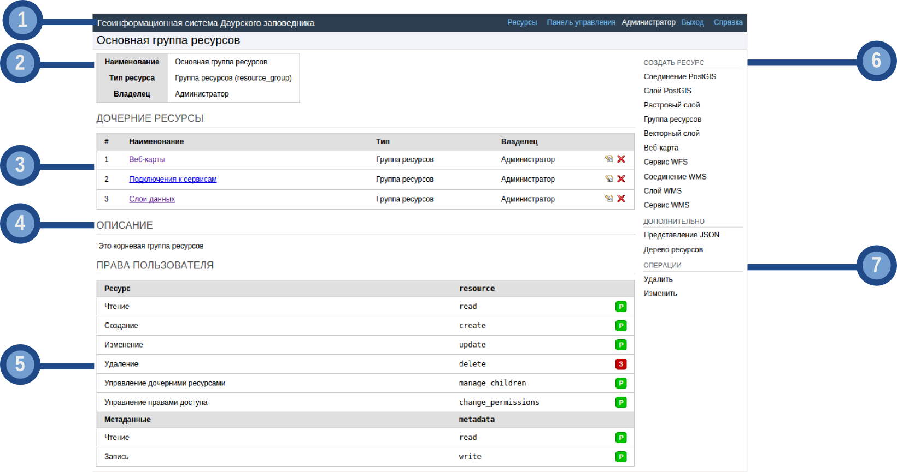

   Главная страница административного интерфейса.

   Цифрами обозначено: 
   1 – основное меню с кнопкой входа/выхода пользователя; 
   2 – блок основной группы ресурсов; 
   3 – блок с перечнем ресурсов в основной группе; 
   4 – описание основной группы; 
   5 – права пользователя на основную группу; 
   6 – типы объектов, которые можно добавлять в основную группу; 
   7 – операции, которые можно проводить с основной группой.	

Главная страница включает в себя блок основного меню, 
(см. :numref:`ngweb_admin_index_pic` п. 1) в котором размещены следующие пункты:

* Ресурсы.
* Панель управления.
* Кнопка входа/выхода пользователя с индикацией текущего пользователя, 
  выполнившего вход.

Блок "дочерние ресурсы" (см. :numref:`ngweb_admin_index_pic` п. 3) включает в себя 
перечень всех ресурсов, которые размещены в корневой группе. В блоке дается 
название ресурса, владелец ресурса, а также кнопка редактирования ресурса.

В блоке "Описание" (см. :numref:`ngweb_admin_index_pic` п. 4) размещается описание 
корневой группы ресурсов (при наличии описания).

Блок "Права пользователя" (см. :numref:`ngweb_admin_index_pic` п. 5) включает в себя 
перечень прав текущего пользователя на корневую группу ресурсов. Зелёная и красная отметки 
идентифицирует наличие соответствующего права. Буквами обозначено: 

* A (Р) - allow (разрешено);
* D (З) - deny (запрещено);
* M - mask (косвенно запрещено);
* E - empty (нет ничего, по факту право отсутствует).

Права имеют следующий состав:

* все права;
* чтение;
* просмотр прав доступа;
* создание;
* изменение;
* изменение прав доступа;
* удаление.

В блоке операций (см. :numref:`ngweb_admin_index_pic`. 6 и 7) имеются инструменты для 
добавления данных и выполнения операций над корневой группой.

В текущей версии возможно добавить следующие виды данных:

* Соединение PostGIS.
* Слой PostGIS.
* Растровый слой.
* Группа ресурсов.
* Векторный слой.
* Веб-карта.
* Соединение WMS.
* Cлой WMS.
* Сервис WMS.

Операции имеют следующий состав: 

* Удалить.
* Изменить. 

Панель управления
--------------------------------

Панель управления NextGIS Web представлена на :numref:`ngweb_admin_control_panel`.

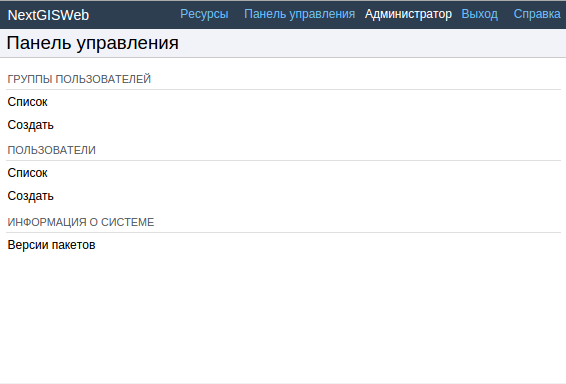

   Панель управления.

Панель управления позволяет выполнять следующие действия:

* Просмотр групп пользователей.
* Создание групп пользователей.
* Просмотр списка пользователей.
* Создание пользователя.
* Назначение прав доступа группам ресурсов и веб-картам.

Вопросы создания групп пользователей и пользователей, назначение прав доступа 
рассмотрены в разделе :ref:`ngw_admin_tasks`.

Просмотр ресурсов
------------------

После входа в административный интерфейс, пользователь попадает на главную 
страницу, представленную на :numref:`ngweb_resource_group`.

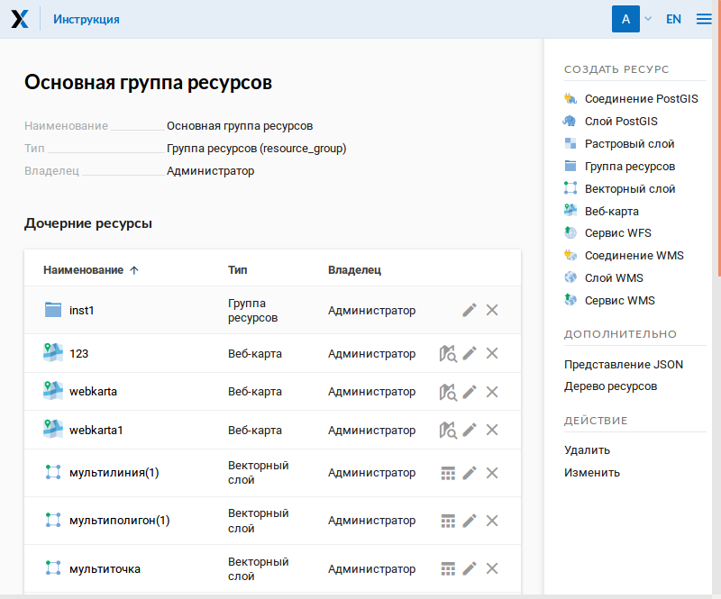

   Группы ресурсов. 

Далее переходим к группе дочерних ресурсов, где обозначены типы слоев этих ресурсов.
Выбираем из таблицы тип ресурса - векторный слой (см. :numref:`ngweb_resource_group1`).

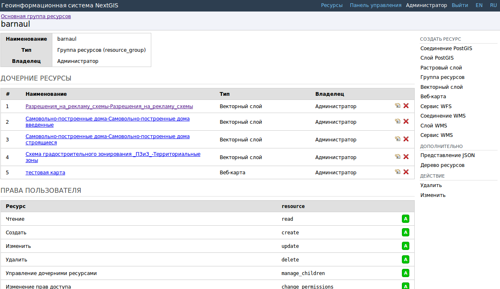

   Группа дочерних ресурсов.

В результате выбора векторного ресурса откроется окно с параметрами/атрибутами 
векторного слоя (см. :numref:`ngweb_options_resource_group`).

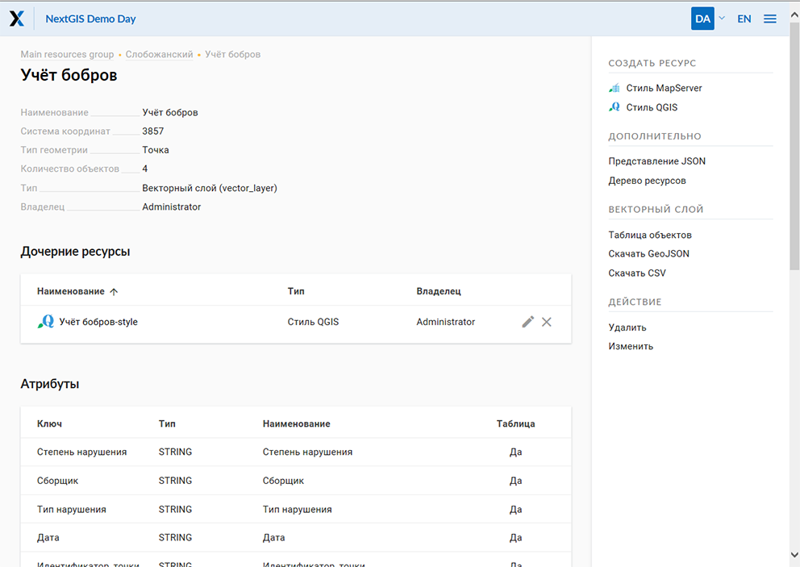
 
   Параметры векторного слоя ресурса.

.. _ngw_feature_table:

Таблица объектов
-----------------

После входа в административный интерфейс необходимо перейти к группе дочерних ресурсов, 
где обозначены типы слоев этих ресурсов. Выбирать из группы дочерних ресурсов необходимое 
именование ресурса, где тип такого ресурса - векторный слой. В блоке операций выбирать 
действие над слоем - "Таблица объектов". Cформируется таблица атрибутов объектов, 
имеющая следующий вид :numref:`ngweb_Object_table`.

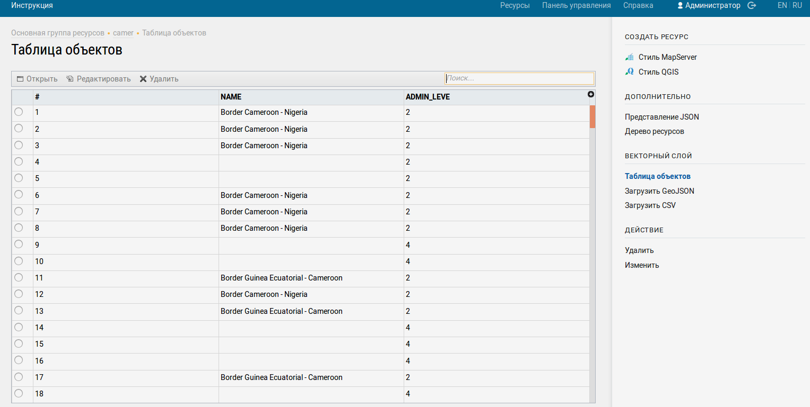

   Таблица объектов. 

Сформированная таблица объектов позволят выполнить следующие операции 
над выделенной записью из таблицы :numref:`ngweb_operations_on_writing_in_object_table`:

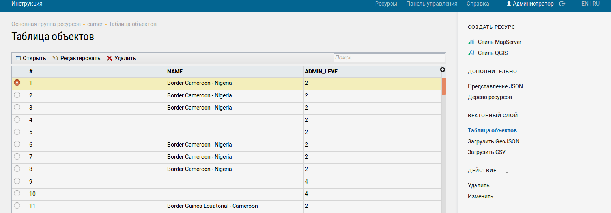

   Операции над записью в таблице объектов.

1. Открыть.
2. Редактировать.
3. Удалить.
4. Воспользоваться Строкой поиска.

Фомирование таблицы объектов можно выполнить другим способом. В административном 
интерфейсе необходимо перейти к группе дочерних ресурсов, где обозначены типы слоев
этих ресурсов и выбрать из группы дочерних ресурсов необходимое именование ресурса, 
где тип такого ресурса - веб-карта. В блоке операций выбрать действие над ресурсом - "Открыть карту".
В результате чего откроется карта (справа) и дерево слоев карты (слева). Для формирования 
таблицы объектов необходимо выделить нужный слой карты в дереве слоев, после чего 
во вкладке "Слой" выбрать "Таблица объектов" :numref:`ngweb_admin_map_and_tree_layers_upload`:

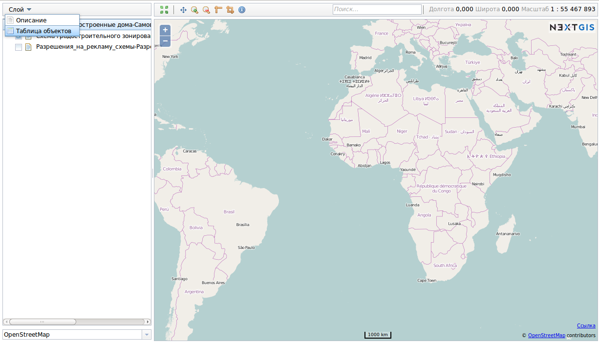

   Карта и дерево слоев.
 
Cформируется таблица объектов, которая позволяет выполнять следующие операции 
над выделенной записью из таблицы :numref:`ngweb_admin_table_objects2_upload`:

1. Открыть.
2. Редактировать.
3. Удалить.
4. Перейти (при нажатии на кнопку происходит переход к выбранному объекту на карте).
5. Воспользоваться Строкой поиска.
 
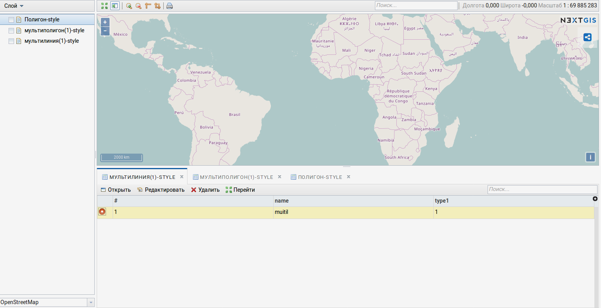

   Операции над записью в таблице объектов.

Редактирование ресурса
-----------------------

После входа в административный интерфейс, пользователь попадает на главную 
страницу, представленную на :numref:`ngweb_resource_group`. Далее переходим к группе 
дочерних ресурсов, где обозначены типы слоев этих ресурсов. Выбираем из таблицы 
тип ресурса - векторный слой. При нажатии в таблице на значок карандаша напротив выбранного 
векторного слоя, откроется окно Обновить ресурс, в котором можно выбрать операции: 

1. Редактирование родителя выбранного ресурса.
2. Добавление описаний и метаданных выбранного ресурса.

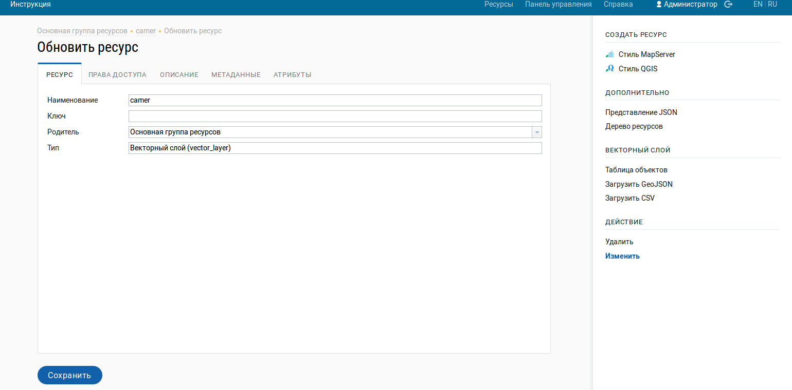

   Окно Обновить ресурс.

В первой вкладке Ресурс доступны к редактированию следующие поля:

1. Наименование (можно изменить имя ресурса).
2. Ключ.
3. Родитель (можно изменить группу ресурсов). Если нажать в строке Родитель кнопку 
   открытия диалога дерева выбора, то откроется окно Выбора ресурса, которое предоставляет 
   возможность выбора места для сохранения слоя:

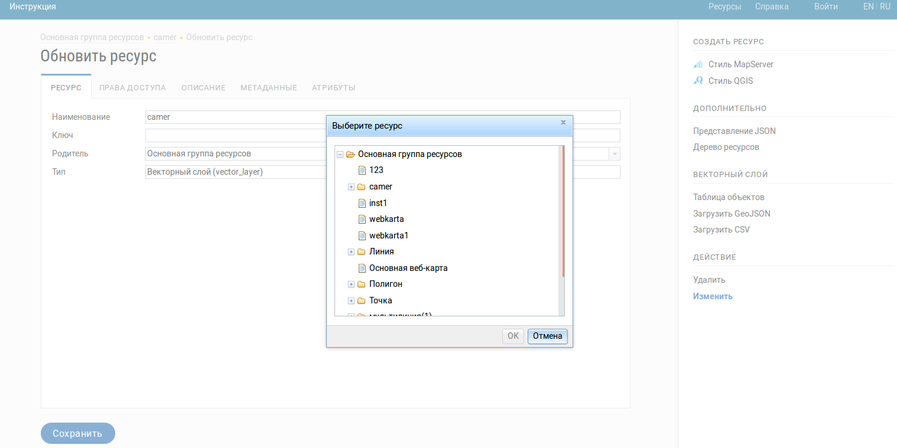

   Окно выбора ресурса.
 
Третья вкладка Описание также доступна к редактированию: имеющийся текст можно изменить 
или удалить, а при отсутствии текста, добавить и сохранить необходимый текст, нажав 
на кнопку Сохранить:  

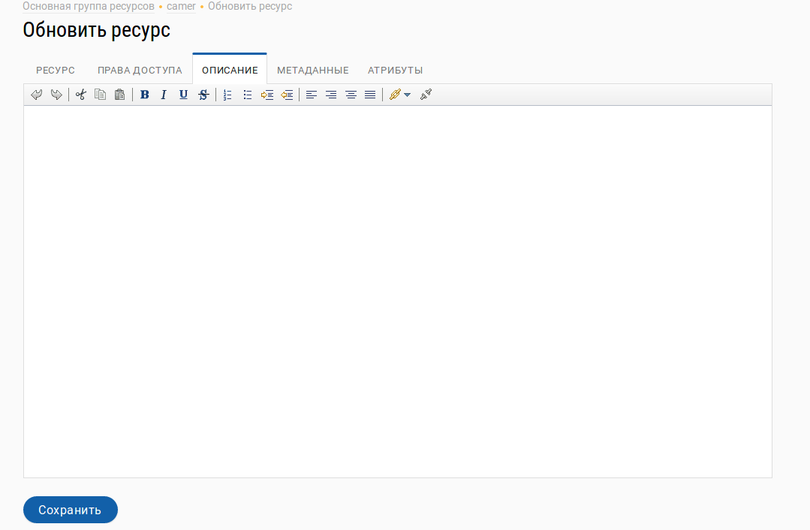
  
   Вкладка Описание.

Четвертая вкладка Метаданные. Метаданные заносятся, удаляются, отражаются в таблице 
при помощи следующих вкладок:

1. Добавить (Текст/Text, Целое число/Integer, Вещественное число/Float).
2. Удалить.  

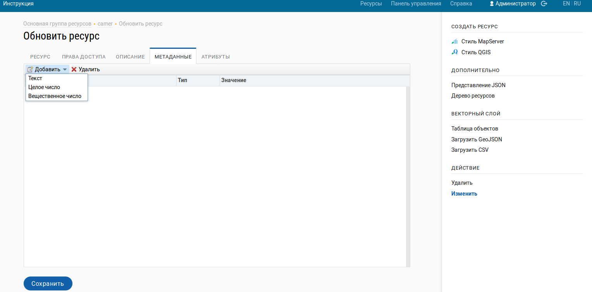

   Вкладка Метаданные.

Таблица состоит из трех столбцов: 

1. Ключ. Ключ-значение позволяет описывать свойства метаданных (автор, дата, версия и тд.).
2. Тип. Типы данных: Текст/Text, Целое число/Integer, Вещественное число/Float.
3. Значение. Значение соответствует типу ключа.

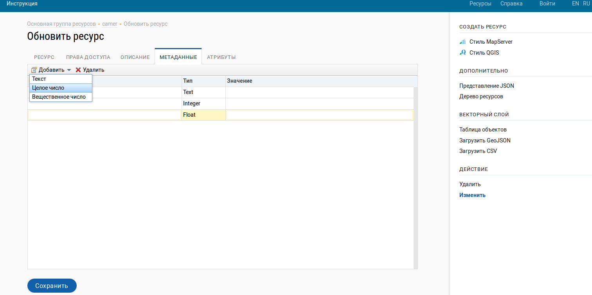

   Таблица с метаданными.

