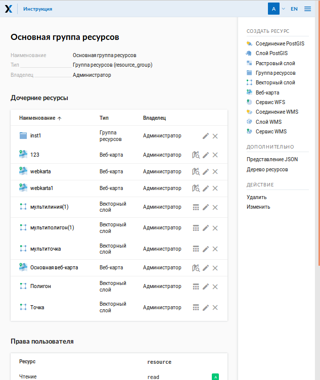
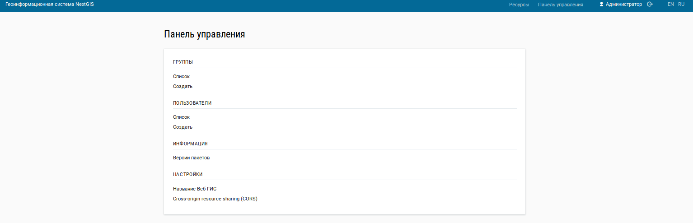

.. sectionauthor:: Артём Светлов <artem.svetlov@nextgis.ru>

.. _ngw_admin_interface:

Административный интерфейс
================================

Главная страница
--------------------------------

После входа в административный интерфейс, пользователь попадает на главную 
страницу, представленную на рисунке :numref:`ngweb_main_page_administrative_interface_pic`.

   Главная страница административного интерфейса.

На рисунке представлено: 

* основное меню с кнопкой входа/выхода пользователя; 
* блок основной группы ресурсов; 
* блок с перечнем ресурсов в основной группе; 
* описание основной группы; 
* права пользователя на основную группу; 
* типы объектов, которые можно добавлять в основную группу; 
* операции, которые можно проводить с основной группой.	

Главная страница включает в себя блок основного меню, 
(см. :numref:`ngweb_main_page_administrative_interface_pic`) в котором размещены следующие пункты:

* Ресурсы.
* Панель управления.
* Кнопка входа/выхода пользователя с индикацией текущего пользователя, 
  выполнившего вход.
* Кнопки смены языка ввода.

Блок "дочерние ресурсы" (см. :numref:`ngweb_main_page_administrative_interface_pic`) 
включает в себя перечень всех ресурсов, которые размещены в корневой группе. В блоке 
дается название ресурса, владелец ресурса, а также кнопка редактирования ресурса.

В блоке "Описание" размещается описание корневой группы ресурсов (при наличии описания).

Блок "Права пользователя" включает в себя перечень прав текущего пользователя на 
корневую группу ресурсов. Зелёная и красная отметки идентифицирует наличие соответствующего 
права. Буквами обозначено: 

* A (Р) - allow (разрешено);
* D (З) - deny (запрещено);
* M - mask (косвенно запрещено);
* E - empty (нет ничего, по факту право отсутствует).

Права имеют следующий состав:

* все права;
* чтение;
* просмотр прав доступа;
* создание;
* изменение;
* изменение прав доступа;
* удаление.

В блоке операций имеются инструменты для добавления данных и выполнения операций 
над корневой группой.

В текущей версии возможно добавить следующие виды данных:

* Подложка веб-карты.
* Соединение PostGIS.
* Слой PostGIS.
* Растровый слой.
* Группа ресурсов.
* Векторный слой.
* Веб-карта.
* Сервис WFS.
* Соединение WMS.
* Cлой WMS.
* Сервис WMS.
* Справочник.

Операции имеют следующий состав: 

* Удалить.
* Изменить. 

Панель управления
--------------------------------

Панель управления NextGIS Web представлена на :numref:`ngweb_control_panel`.

   Панель управления.

Панель управления позволяет выполнять следующие действия:

* Просмотр групп пользователей.
* Создание групп пользователей.
* Просмотр списка пользователей.
* Создание пользователя.
* Назначение прав доступа группам ресурсов и веб-картам.
* Задать название Веб ГИС.
* Возможность ввода перечня допустимых источников для кросс-доменных запросов на странице настроек CORS.

Вопросы создания групп пользователей и пользователей, назначение прав доступа 
рассмотрены в разделе :ref:`ngw_admin_tasks`.

Просмотр ресурсов
------------------

После входа в административный интерфейс, пользователь попадает на главную 
страницу, представленную на :numref:`ngweb_resource_group`.

.. figure:: _static/resource_group.png
   :name: ngweb_resource_group
   :align: center
   :width: 16cm

   Группы ресурсов. 

В группе дочерних ресурсов обозначены их типы (см. :numref:`ngweb_resource_group1`) .

.. figure:: _static/resource_group1.png
   :name: ngweb_resource_group1
   :align: center
   :width: 16cm

   Группа дочерних ресурсов.

При выборе ресурса с типом ``векторный слой`` откроется окно с его параметрами/атрибутами (см. :numref:`ngweb_options_resource_group`).

.. figure:: _static/options_resource_group.png
   :name: ngweb_options_resource_group
   :align: center
   :width: 16cm
 
   Параметры векторного слоя.

.. _ngw_feature_table:

Таблица объектов
-----------------

Для просмотра таблицы объектов необхоимо в административном интерфейсе в группе дочерних 
ресурсов выбрать ресурс c типом векторный слой. В блоке операций векторного слоя выбрать 
действие - "Таблица объектов". Будет сформирована таблица атрибутов объектов, 
имеющая следующий вид :numref:`ngweb_Object_table`.

.. figure:: _static/ngweb_Object_table.png
   :name: ngweb_Object_table
   :align: center
   :width: 16cm

   Таблица объектов. 

Сформированная таблица объектов позволяет выполнить следующие операции 
над выделенной записью из таблицы :numref:`ngweb_operations_on_writing_in_object_table`:

.. figure:: _static/ngweb_operations_on_writing_in_object_table.png
   :name: ngweb_operations_on_writing_in_object_table
   :align: center
   :width: 16cm

   Операции над записью в таблице объектов.

1. Открыть.
2. Редактировать.
3. Удалить.

Также можно воспользоваться Строкой поиска для фильтрации записей в этой таблице.

Фомирование таблицы объектов можно выполнить другим способом. В административном 
интерфейсе необходимо перейти к группе дочерних ресурсов и выбрать ресурс с типом ``веб-карта``. 
В блоке операций веб-карты выбрать действие над ресурсом - "Открыть карту".
В результате чего откроется карта (справа) и дерево слоев карты (слева). Для формирования 
таблицы объектов необходимо выделить нужный слой карты в дереве слоев, после чего 
в меню "Слой" выбрать пункт "Таблица объектов" :numref:`ngweb_admin_map_and_tree_layers_upload`:

.. figure:: _static/map_and_tree_layers.png
   :name: ngweb_admin_map_and_tree_layers_upload
   :align: center
   :width: 16cm

   Карта и дерево слоев.
 
Будет сформирована таблица объектов, которая позволяет выполнять следующие операции 
над выделенной записью таблицы :numref:`ngweb_admin_table_objects2_upload`:

1. Открыть.
2. Редактировать.
3. Удалить.
4. Перейти (при нажатии на кнопку происходит переход к выбранному объекту на карте).

Кроме того, можно воспользоваться "Строкой поиска" для фильтрации записей в таблице.
 
.. figure:: _static/ngweb_operations_on_writing_in_object_table2.png
   :name: ngweb_admin_table_objects2_upload
   :align: center
   :width: 16cm

   Операции над записью в таблице объектов.

Настройка ресурса
-----------------------

Для настройки параметров ресурса необходимо в административном интерфейсе 
(см. :numref:`ngweb_resource_group`) перейти к группе 
дочерних ресурсов и напротив ресурса, который необходимо изменить, нажать на значок карандаша.
В открывшемся окне "Обновить ресурс" можно выбрать операции: 

1. Редактирование родителя выбранного ресурса.
2. Добавление описаний и метаданных выбранного ресурса.

.. figure:: _static/ngw_window_update_resource1.png
   :name: ngw_window_update_resource1
   :align: center
   :width: 16cm

   Окно Обновить ресурс.

В первой вкладке "Ресурс" доступны к редактированию следующие поля:

1. Наименование (можно изменить имя ресурса).
2. Ключ (уникальный идентификатор для использования при работе с REST API).
3. Родитель (можно изменить родительскую группу ресурсов, переместив свой ресурс). Ресурсы можно 
   перемещать из одной группы ресурсов в другую группу и после их создания. 
   Для этого следует:

   * нажать в строке "Родитель" кнопку открытия диалога дерева выбора; 
   * в открывшемся окне "Выбора ресурса" следует выбрать группу ресурсов, 
     куда необходимо переместить свой ресурс;
   * для перемещения своего ресурса, нажмите ОК; 
   * нажать кнопку Сохранить. 

Если ресурс успешно перемещен, то информация о нем появится в новой группе ресурсов 
и пропадет из старой группы ресурсов:

.. figure:: _static/ngw_resource_selection.png
   :name: ngw_resource_selection
   :align: center
   :width: 16cm

   Окно выбора ресурса.

В третьей вкладке "Описание" можно ввести или изменить текст с описанием:  

.. figure:: _static/ngw_description_window.png
   :name: ngw_description_window
   :align: center
   :width: 16cm
  
   Вкладка "Описание".

Четвертая вкладка "Метаданные" предназначена для управления метаданными. Метаданные представляют собой пары
ключ - значение. Метаданные можно добавить, изменить или удалить. Для этого предназначены следующие инструменты:

1. Добавить (Текст/Text, Целое число/Integer, Вещественное число/Float).
2. Удалить.  

.. figure:: _static/ngw_metadata_tab.png
   :name: ngw_metadata_tab
   :align: center
   :width: 16cm

   Вкладка "Метаданные".

Таблица метаданных состоит из трех столбцов: 

1. Ключ. Позволяет описывать свойства метаданных (автор, дата, версия и тд.).
2. Тип. Поддерживаются следующие типы данных: Текст/Text, Целое число/Integer, Вещественное число/Float.
3. Значение. Значение которое соответствует ключу.

.. figure:: _static/ngw_Metadata_table.png
   :name: ngw_Metadata_table
   :align: center
   :width: 16cm

   Таблица с метаданными.

Настрока векторного слоя
^^^^^^^^^^^^^^^^^^^^^^^^^^^^

Дополнительно к параметрам, которые вводятся при создании векторного слоя (см. :ref:`ngw-create-vector-layer`), в окне присутствует вкладка "Атрибуты" (см. :numref:`ngweb_admin_layers_attr`).

.. figure:: _static/admin_layers_attr.png
   :name: ngweb_admin_layers_attr
   :align: center
   :width: 16cm

   Окно редактирования слоя, вкладка "Атрибуты".

В этой вкладке перечислены атрибуты слоя.

* Галочка в столбце ``ТО`` обозначает, что атрибут выводится в окне идентификации.
* Галочка в столбце ``АН`` обозначает, что из этого атрибута берётся название при 
  идентификации, а также при формировании списка закладок. 

Для каждого имени поля можно задать псевдоним для отображения 
вместо имени поля в окне идентификации. В столбцe ``Ключ`` можно поменять название атрибута.

.. figure:: _static/webmap_identification.png
   :name: ngweb_webmap_identification
   :align: center
   :width: 16cm

   Окно идентификации.

.. _ngw_attributes_edit:

Удаление ресурса
-----------------

Для удаления ресурса необходимо выполнить ряд шагов:

1. Откройте окно свойств ресурса, который хотите удалить;
2. Выберите и нажмите на кнопку "Удалить" на правой панели административного интерфейса Веб ГИС;
3. В открывшемся окне на вкладке "Удалить ресурс" поставьте галочку в окошке "Подтвердить удаление ресурса";
4. Нажмите кнопку "Удалить". 

Если ресурс успешно удален, то информация о нем исчезнет из соответствующей группы ресурсов.

.. figure:: _static/ngw_deletion_resource.png
   :name: ngw_deletion_resource
   :align: center
   :width: 16cm

   Удаление ресурса.

Экспорт данных в форматы CSV и GeoJSON
---------------------------------------
  
Веб ГИС позволяет выгружать/экспортировать данные в следующие форматы: 

* :term:`GeoJSON`;
* :term:`CSV`.

Файлы сохраняются в той;t системе координат, в которой хранятся внутри Веб ГИС - ``EPSG:3857``.

Для экспорта данных следует выполнить ряд шагов:

1. Откройте окно свойств векторного слоя или слоя PostGIS;
2. Выберите пункт ``Векторный слой ‣ Загрузить GeoJSON`` или ``Векторный слой ‣ Загрузить CSV`` на правой панели веб-интерфейса Веб ГИС;
3. Сохраните файл в формате GeoJSON или CSV к себе на устройство.

.. figure:: _static/ngweb_data_export.png
   :name: ngweb_data_export
   :align: center
   :width: 16cm

   Экспoрт и сoхранение данных в форматы CSV и GeoJSON.
