.. sectionauthor:: Артём Светлов <artem.svetlov@nextgis.ru>
.. sectionauthor:: Роман Гайнуллов <roman.gainullov@nextgis.ru>

.. _ngw_admin_interface:

Административный интерфейс
================================

Главная страница
--------------------------------

После входа в административный интерфейс, пользователь попадает на главную 
страницу, представленную на рисунке :numref:`ngweb_main_page_administrative_interface_pic`

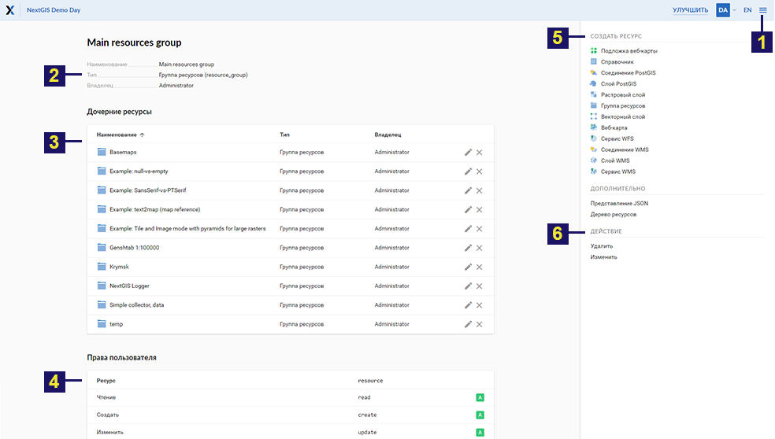

   Главная страница административного интерфейса

   Цифрами обозначены: 1 - Основное меню; 2 - Пользовательские настройки (Выход и Смена языка); 3 – Строка поиска русурсов в Веб ГИС; 4 - Описание основной группы ресурсов; 5- Дочерние ресурсы; 6 - Права текущего пользователя на основную группу; 7 - Типы объектов, которые можно создавать в основной группе; 7 - Операции, которые можно проводить с основной группой

В блоке основного меню (см. :numref:`ngweb_main_page_administrative_interface_pic`, п.1) размещены следующие пункты (см. :numref:`ngweb_main_page_main_menu_pic`):

* Ресурсы
* Панель управления
* Справка
* Аккаунт

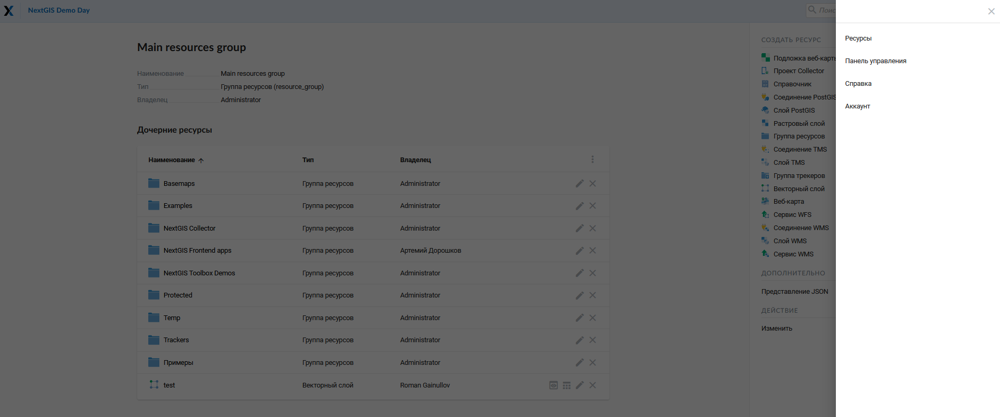

   Основное меню
   
В блоке "Описание" (см. :numref:`ngweb_main_page_administrative_interface_pic`, п.4) размещается описание основной группы ресурсов (при его наличии).

Блок "Дочерние ресурсы" (см. :numref:`ngweb_main_page_administrative_interface_pic`, п.5) 
включает в себя перечень всех ресурсов, которые размещены в основной группе. В виде таблицы
доступны такие параметры как название, тип и владелец ресурса. Одновременно с этим есть кнопки различных действий над ресурсами (редактирование, удаления, предпросмотр, открытие таблицы атрибутов).

Блок "Права пользователя" (см. :numref:`ngweb_main_page_administrative_interface_pic`, п.5) включает в себя перечень прав текущего пользователя на основную группу ресурсов. Зелёная и красная отметки идентифицируют наличие/отсутствие соответствующего 
права. Буквами обозначено: 

* A - allow (разрешено)
* D - deny (запрещено)
* M - mask (косвенно запрещено)
* E - empty (нет ничего, по факту право отсутствует)

Права имеют следующий состав:

* Все права
* Чтение
* Просмотр прав доступа
* Создание
* Изменение
* Изменение прав доступа
* Удаление

Подробнее о правах доступа :ref:`permissions`.

Блок операций (см. :numref:`ngweb_main_page_administrative_interface_pic`, п.7, 8) позволяет как создавать новые типы ресурсов в текущей группе, так и изменять/удалять эту группу (основную группу удалить нельзя - она является корневой).

В текущей версии возможно добавить следующие виды данных (см. :numref:`ngweb_main_page_administrative_interface_pic`, п.7):

* Подложка веб-карты
* Проект Collector
* Справочник
* Соединение PostGIS
* Слой PostGIS
* Растровый слой
* Группа ресурсов
* Соединение TMS
* Слой TMS
* Группа трекеров
* Векторный слой
* Веб-карта
* Сервис WFS
* Соединение WMS
* Cлой WMS
* Сервис WMS

В зависимости от вашей версии NGW также могут быть подключены:

* Библиотека маркеров SVG
* 3D модель
* 3D сцена
* 3D тайлсет

Панель управления
--------------------------------

В панель управления NextGIS Web можно попасть через основное меню (см. :numref:`ngweb_main_page_administrative_interface_pic`, п.1), выбрав соответствующий пункт (см. :numref:`ngweb_main_page_main_menu_pic`). Панель управления представлена на :numref:`ngweb_control_panel`.

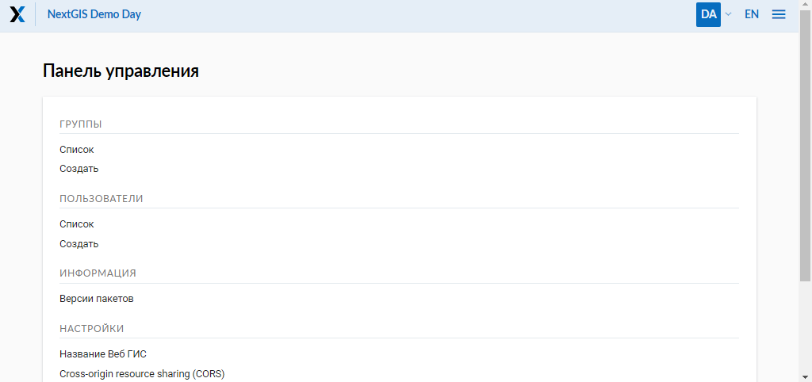

   Панель управления

Панель управления позволяет выполнять следующие действия:

* Управлять группами и пользователями NextGIS Web
* Показать информацию о системе
* Задать название веб ГИС
* Настроить CORS
* Задать стилии CSS
* Указать стартовую страницу NGW
* Задать Логотип (в верхнем левом углу)
* Настроить категорию пользователй, которые имеют права экспортировать данные
* Завести учетные записи пользователей для проектов Collector
* Настроить Трекинг
* Настроить веб-карту

Подробнее эти настройки рассмотрены в разделе :ref:`ngw_admin_tasks`.

Просмотр ресурсов
------------------

После входа в административный интерфейс, пользователь попадает на главную 
страницу :numref:`ngweb_resource_group`

.. figure:: _static/resource_group.png
   :name: ngweb_resource_group
   :align: center
   :width: 16cm

   Группы ресурсов

Для просмотра ресурса следует перейти "внутрь" него через блок Дочерних ресурсов.

В результате выбора ресурса (например, вам нужен векторный слой) откроется окно с его параметрами/атрибутами 
 см. :numref:`ngweb_options_resource_group`

.. figure:: _static/options_resource_group_rus.png
   :name: ngweb_options_resource_group
   :align: center
   :width: 16cm
 
   Параметры векторного слоя ресурса

.. _ngw_feature_table:

Таблица объектов
-----------------

Ряд слоев (векторые, PostGIS) состоят из набора объектов. Для удобной работы с этими данными существуют Таблицы объектов.
Чтобы открыть таблицу слоя, нужно либо нажать на иконку таблицы в списке дочерних ресурсов (см. :numref:`ngweb_main_page_administrative_interface_pic`, п.4) либо пройти внутрь ресурса этого слоя и в блоке операций выбрать "Таблица объектов" (см. :numref:`ngweb_Object_table`).

Для того, чтобы произвести действия над таблицей объектов, необходимо войти в административный интерфейс, перейти к группе дочерних ресурсов, где обозначены типы слоев этих ресурсов (см. :numref:`ngweb_main_page_administrative_interface_pic`, п.5) и нажать на значок таблицы напротив векторного слоя или выбрать этот слой, а затем в блоке операций выбрать действие над слоем - "Таблица объектов" (см. :numref:`ngweb_Object_table`).

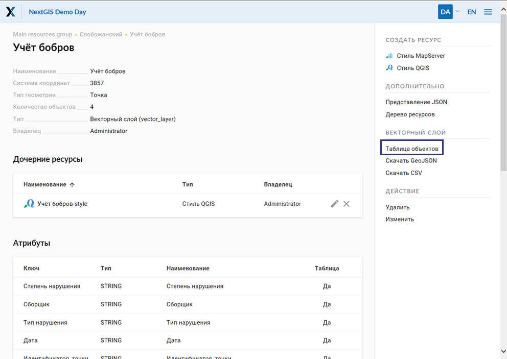

   Выбор таблицы объектов

Сформированная таблица объектов позволяет выполнить следующие операции 
над выделенной записью из таблицы (см. :numref:`ngweb_operations_on_writing_in_object_table`):

1. Открыть
2. Редактировать
3. Удалить
4. Воспользоваться Строкой поиска

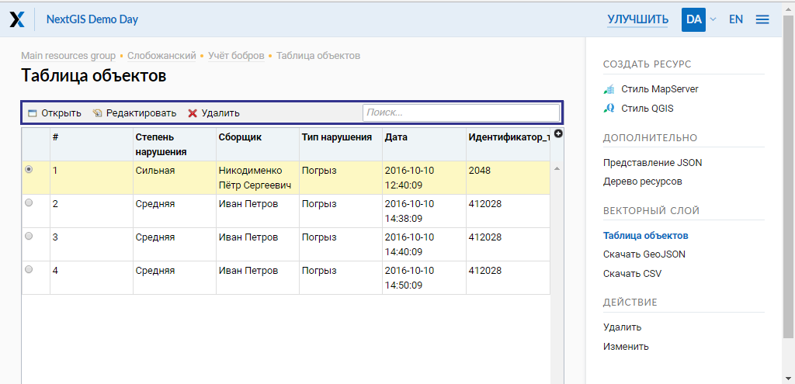

   Операции над записью в таблице объектов

Фомирование таблицы объектов можно выполнить другим способом. В административном 
интерфейсе необходимо перейти к группе дочерних ресурсов, где обозначены типы слоев
этих ресурсов (см. :numref:`ngweb_main_page_administrative_interface_pic`, п.4), и выбрать веб-карту. В блоке операций выбрать действие над ресурсом - "Открыть" (см. :numref:`webmap_open_rus_pic`):

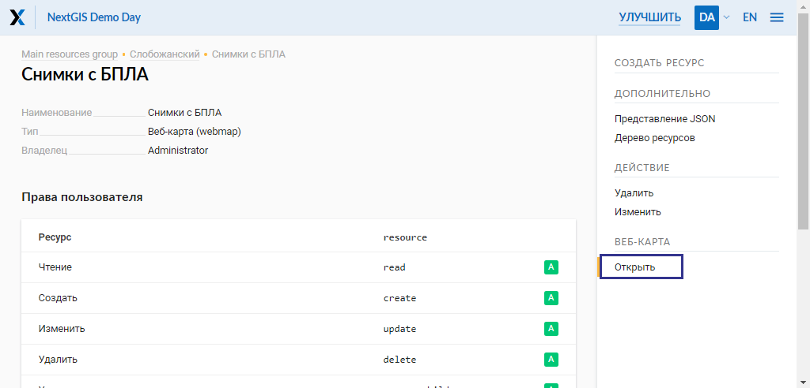

   Операция открытия веб-карты
   
В результате откроется карта (справа) и дерево слоев карты (слева). Для формирования 
таблицы объектов необходимо выделить нужный слой карты в дереве слоев, после чего 
во вкладке "Слой" выбрать "Таблица объектов" :numref:`ngweb_admin_map_and_tree_layers_upload`:

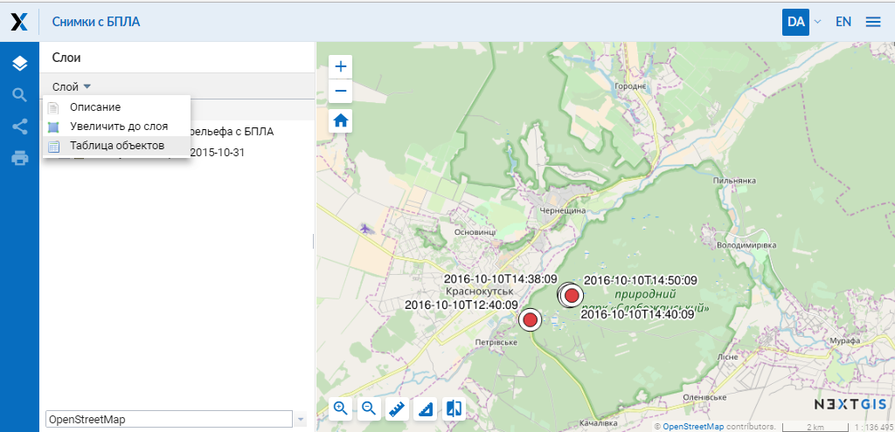

   Карта и дерево слоев
 
Cформируется таблица объектов, которая позволяет выполнять следующие операции 
над выделенной записью из таблицы :numref:`ngweb_admin_table_objects2_upload`:

1. Открыть
2. Редактировать
3. Удалить
4. Перейти (при нажатии на кнопку происходит переход к выбранному объекту на карте)
5. Воспользоваться Строкой поиска
 
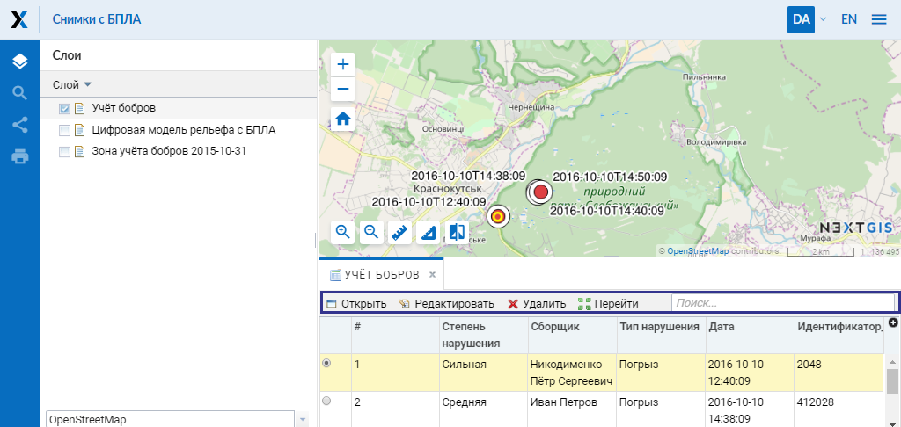

   Операции над записью в таблице объектов

.. _ngw_update_resource:

Обновление ресурса
------------------

Для изменения свойств ресурса необходимо:

* Перейти внутрь ресурса, свойства которого нужно изменить;
* Нажать кнопку "Изменить" в блоке операций справа (см. :numref:`ngw_window_update_edit_resource`)

Или

* Находясь в родительском ресурсе, в списке дочерних напротив целевого слоя выбрать иконку "карандаш" (см. :numref:`ngweb_main_page_administrative_interface_pic`, п.5)

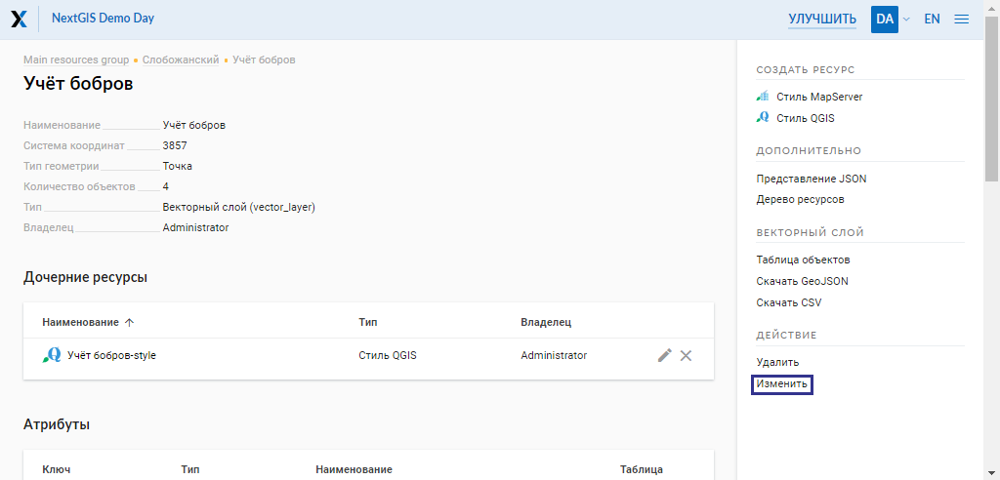

   Выбор действия "Изменить"

После этого откроется окно "Обновить ресурс" (см. :numref:`ngw_window_update_resource1`), в котором можно добавить описание, редактировать родителя, метаданные и атрибуты выбранного ресурса.

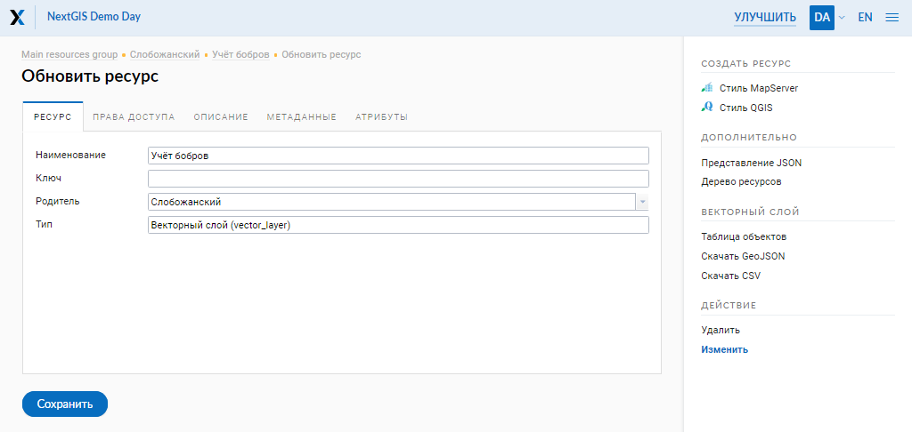

   Окно "Обновить ресурс"

На первой вкладке "Ресурс" доступны к редактированию следующие поля:

1. Наименование (можно изменить имя ресурса)
2. Ключ
3. Родитель (можно изменить группу ресурсов, переместив свой ресурс)
4. Тип

Ресурсы можно перемещать из одной группы ресурсов в другую и после их создания. 
Для этого в поле "Родитель" нужно выбрать ту группу, куда вы хотите переместить текущий ресурс (см. :numref:`ngw_resource_selection`). Выбрав группу ресурсов для перемещения своего ресурса, нажмите Ok и сохраните изменения. 

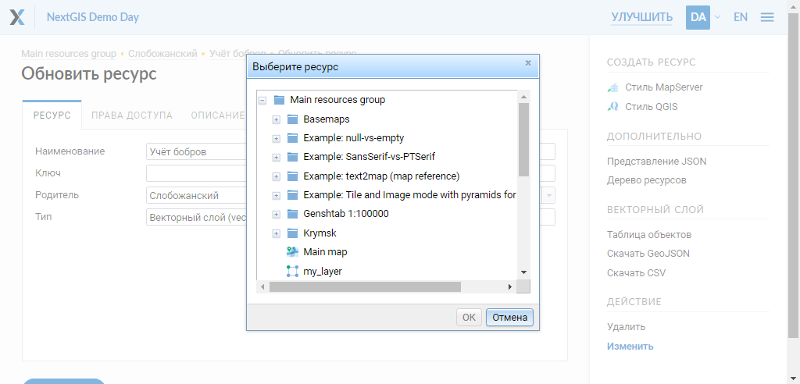

   Окно выбора ресурса

Если ресурс успешно перемещен, то он появится в новой группе ресурсов и пропадет из старой.

Вкладка "Описание" позволяет добавить текстовое описание и гибко его настроить, вставить изображение или ссылку на внешний ресурс.

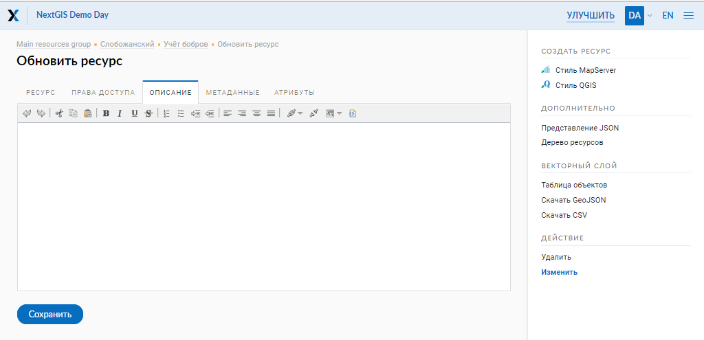
  
   Вкладка "Описание"

Вкладка "Метаданные" позволяет заносить, удалять метаданные и отображать их в таблице (Текст, Целое число, Вещественное число):  

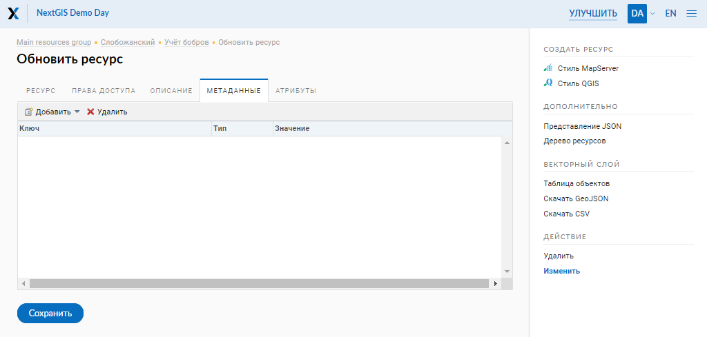

   Вкладка "Метаданные"

Таблица состоит из трех столбцов: 

1. Ключ. Ключ-значение позволяет описывать свойства метаданных (автор, дата, версия и тд.)
2. Тип. Типы данных: Текст, Целое число, Вещественное число
3. Значение. Значение соответствует типу ключа

Вкладка "Атрибуты" содержит таблицу, в которой перечислены атрибуты выбранного слоя (см. :numref:`ngweb_admin_layers_attr`).

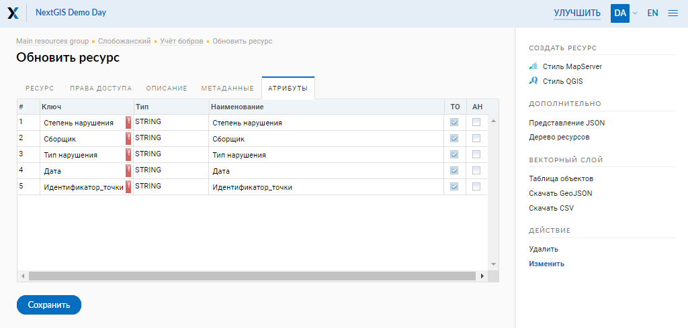

   Вкладка "Атрибуты"

* Галочка в столбце "ТО" обозначает, что атрибут выводится в окне идентификации.
* Галочка в столбце "АН" обозначает, что из этого атрибута формируется список закладок. 

Для каждого имени поля можно поставить соответствующий псевдоним для отображения 
вместо имени поля в окне идентификации.

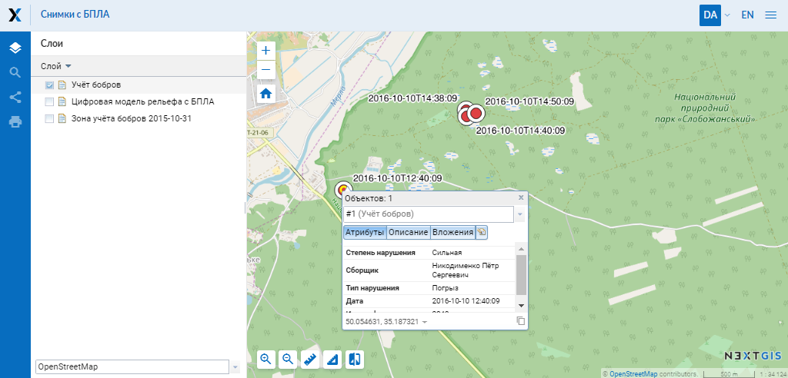

   Окно идентификации

.. _ngw_attributes_edit:

Удаление ресурса
-----------------

NextGIS Web позволяет удалять созданные ресурсы. 

Чтобы удалить ресурс, необходимо :

* Перейти внутрь ресурса, который вы хотите удалить;
* Нажать кнопку "Удалить" в блоке операций справа (см. :numref:`ngw_window_update_delete_resource`)

Или

* Находясь в родительском ресурсе, в списке дочерних напротив целевого слоя выбрать иконку "крест" (см. :numref:`ngweb_main_page_administrative_interface_pic`, п.5)

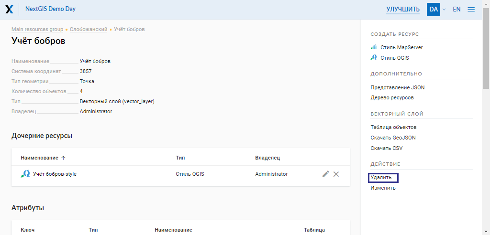

   Выбор действия "Удалить"

И подтвердить операцию в открывшемся окне (см. :numref:`ngw_deletion_resource`)

.. figure:: _static/ngw_deletion_resource_rus.png
   :name: ngw_deletion_resource
   :align: center
   :width: 16cm

   Удаление ресурса

Если ресурс успешно удален, то информация о нем исчезнет из соответствующей группы ресурсов.

Экспорт векторных данных
-------------------------
  
Веб ГИС позволяет выгружать/экспортировать данные в следующих форматах:

* :term:`GeoJSON`
* :term:`CSV`
* CSV для Microsoft Excel
* ESRI Shape
* AutoCAD DXF
* Mapinfo TAB
* MapInfo MIF/MID
* GeoPackage.

При экспорте в некоторые форматы создаются дополнительные файлы, например CSVT (описание полей) и PRJ (описание проекции) для CSV, CPG (кодовая страница) для ESRI Shapefile.

Для того, чтобы экспортировать данные:

#. Откройте ресурс Векторного слоя или Слоя PostGIS, данные которого вы хотите экспортировать;
#. Выберите пункт :menuselection:`Векторный слой --> Сохранить как` на правой панели :ref:`веб-интерфейса <ngw_admin_interface>`;
#. Укажите формат и кодировку данных;
#. При необходимости можно результат запаковать в ZIP архив (для ряда форматов это настройка по умолчанию)
#. Сохраните файл себе на устройство

В поле "Формат" следует указать требуемый формат данных:

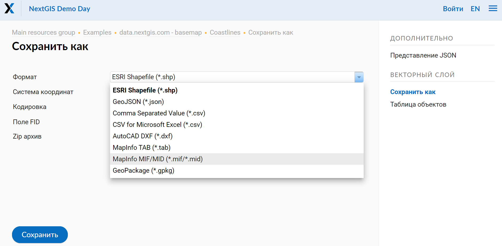

   Поле "Формат"
