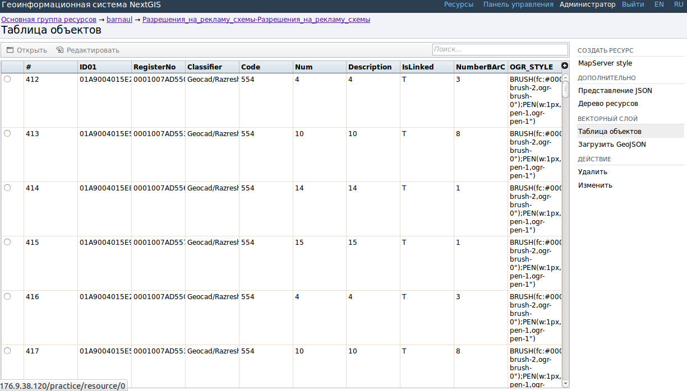
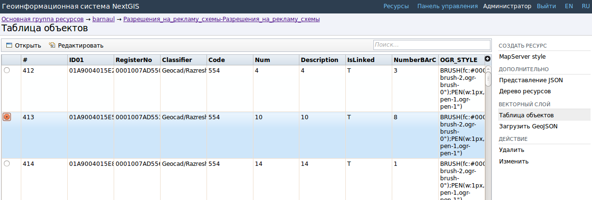
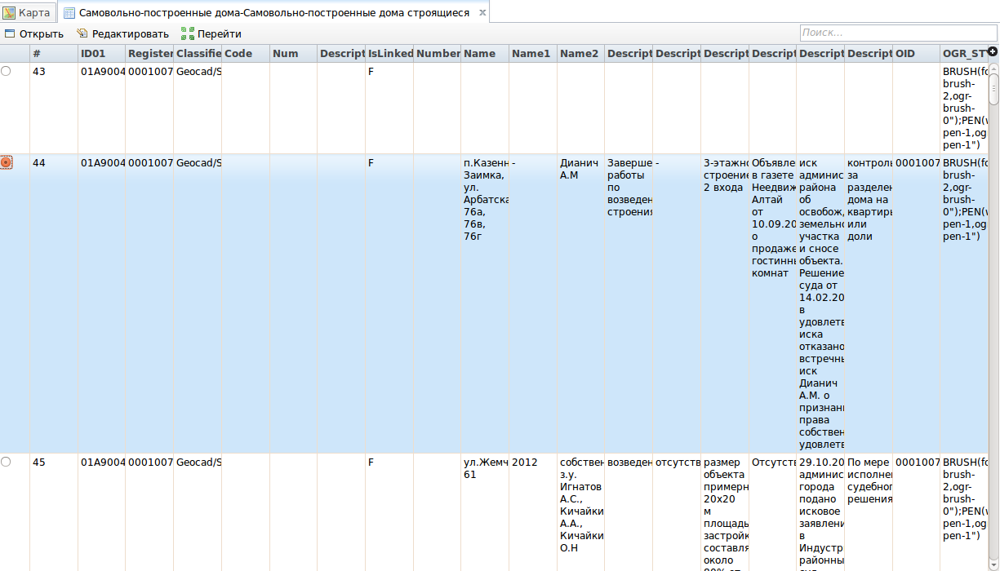

.. sectionauthor:: Artem Svetlov <artem.svetlov@nextgis.ru>

.. _admin_interface:

Administrator interface
================================

Home page
--------------------------------

After login to administrative interface the user is taken to the home page shown on  :numref:`admin_index_pic`.

.. figure:: _static/admin_index.png
   :name: admin_index_pic
   :align: center
   :width: 16cm

   Administrator interface home page.

   The numbers indicate: 
   1 – main menu with login/logout button; 
   2 – main resource group pane; 
   3 – child resources pane with a list of items in main group; 
   4 – user permissions for main resource group; 
   5 – main resource group description; 
   6 – types of items that could be added to the main resource group; 
   7 – actions that could be performed with main resource group.	

Home page includes a main menu pane, 
(see  :numref:`admin_index_pic` index. 1) which has the following links:

* Resources
* Control Panel
* Login/logout button with current user indication 
  .

Child resources pane (see  :numref:`admin_index_pic` index. 3) contains a list of all resources placed in a root group. Pane displays information about display name, owner and an edit resource button.

Description pane (see  :numref:`admin_index_pic` index. 4) displays root group description (if available).

User permissions pane (see  :numref:`admin_index_pic` index. 5) displays list of permissions the current user granted for the root group. Green mark indicates that user has corresponding permission. 

Possible permissions are the following:

* All
* Read
* View permissions
* Create
* Update
* Manage permissions
* Delete

Actions pane (see  :numref:`admin_index_pic`. 6 and 7) contains tools for adding data and executing operations with root group.

In current version it is possible to add the following types of data:

* PostGIS connection
* PostGIS layer
* Raster layer
* Resource group
* Vector layer
* Web Map
* WMS connection
* WMS layer
* WMS service

Possible operations are:: 

* Delete
* Update 

Control panel
--------------------------------

NextGIS Web Control panel presented on  :numref:`admin_control_panel`.

.. figure:: _static/admin_control_panel.png
   :name: admin_control_panel
   :align: center
   :width: 16cm

   Control panel.

Control panel allows to execute the following actions:

* View user groups
* Create user groups
* View user list
* Create user
* Grant permissions to resource groups and web maps.

For more information about creation of user groups and users and granting permissions see topic :ref:`admin_tasks`.

Resource view
------------------

After login to administrative interface the user is taken to home page shown on :numref:`resource_group`.

.. figure:: _static/resource_group.png
   :name: resource_group
   :align: center
   :width: 16cm

   Resource groups. 

The content of resource group is displayed after a click on resource name in a child resources pane of main resource group. On resource group page there is a pane with a list of resources in root group and user permissions pane.
Layer properties are displayed after a click on a name of a layer in child resources pane. E.g. user can click on a resource of type vector layer (see  :numref:`resource_group1`).

.. figure:: _static/resource_group1.png
   :name: resource_group1
   :align: center
   :width: 16cm

   Child resource group

After a click on layer in child resources pane user is taken to a vector layer properties and attributes page (see  :numref:`options_resource_group`).

.. figure:: _static/options_resource_group.png
   :name: options_resource_group
   :align: center
   :width: 16cm
 
   Vector layer parameters.

Feature table
-----------------

To view feature table after login navigate to a child resource group, where would be displayed resource types. Then select from child resources a resource with type vector layer. In actions pane select an action for vector layer called Feature table. A feature table for the vector layer will be displayed :numref:`admin_table_objects_upload`.

   Feature table. 

Feature table allows to perform the following operations with a selected record  :numref:`admin_table_objects1_upload`:

1. Open.
2. Edit.
 

   Actions for the selected record in feature table.

Feature table could be opened in a different way. In the adminitrative interface navigate to a child resource group where would be displayed resource types. Then select from child resources a resource with a type web map. In actions pane click a web map action called Display.
A web map will be opened with a layer tree (left) and a map (right). To view a feature table select required layer in layer tree and then select Feature table command in Layer drop down menu at the top of layer tree :numref:`admin_map_and_tree_layers_upload`:

.. figure:: _static/map_and_tree_layers.png
   :name: admin_map_and_tree_layers_upload
   :align: center
   :width: 16cm

   Map and layer tree.
 
A table will be displayed in a new tab. Table allows to perform the following operations with a selected record :numref:`admin_table_objects2_upload`:

1. Open.
2. Edit.
3. Go to (after a click a map tab will become active and a map will display the selected feature).
 

   Actions for the selected record in feature table.
