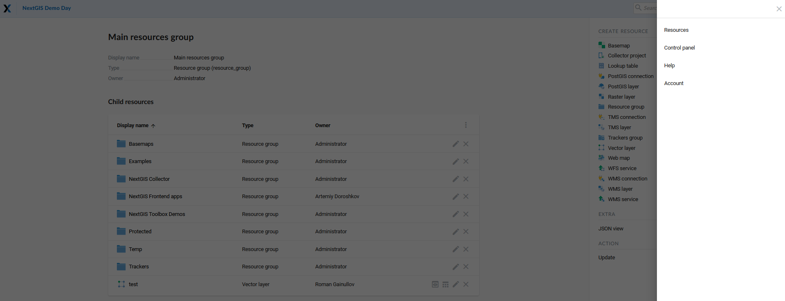
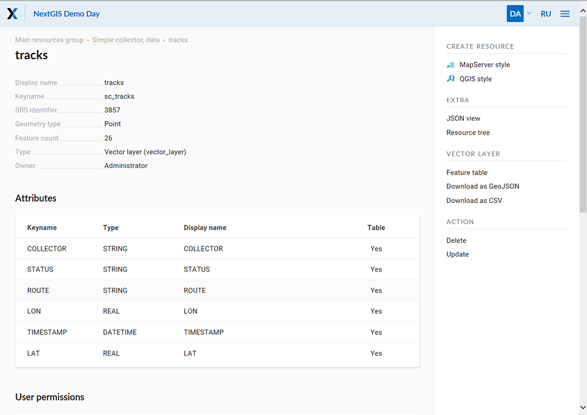
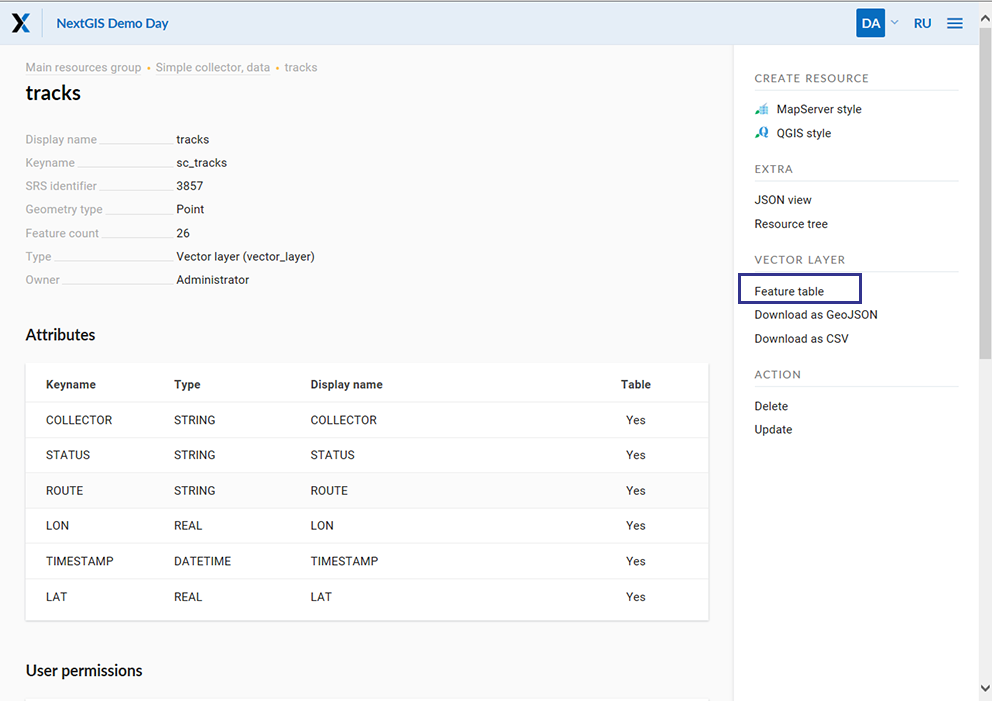
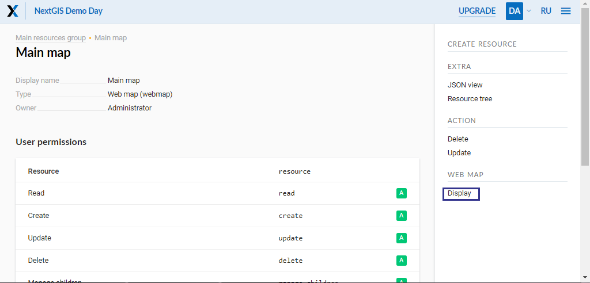
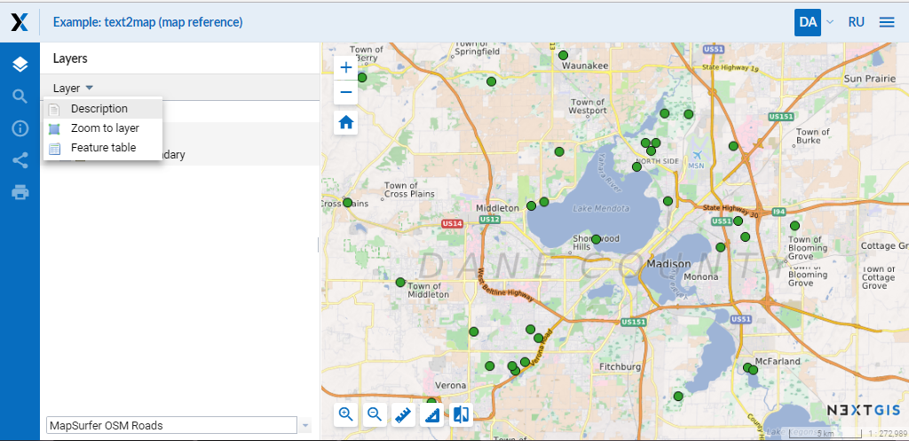

.. sectionauthor:: Artem Svetlov <artem.svetlov@nextgis.ru>

.. _ngw_admin_interface:

Administrator interface
================================

Home page
--------------------------------

After login to administrative interface the user is taken to the home page shown 
on  :numref:`admin_index_pic`.

.. figure:: _static/ngweb_main_page_administrative_interface_eng.png
   :name: admin_index_pic
   :align: center
   :width: 16cm

   Administrator interface home page.

   The numbers indicate: 1 - main menu; 2 - "Change the language" button; 3 – main resource group description; 4 - child resources; 5 - user permissions for main resource group; 6 - types of items that could be added to the main resource group; 7 - actions that could be performed with main resource group.

Home page includes a main menu pane, (see item 1 in :numref:`admin_index_pic`) which has the following links (see :numref:`ngweb_main_page_main_menu_pic`):

* Resources
* Control Panel
* Help
* Account

   Main menu.
 
Description pane (see item 3 in :numref:`admin_index_pic`) displays root group 
description (if available).

Child resources pane (see item 4 in :numref:`admin_index_pic`) contains a list 
of all resources placed in a root group. Pane displays information about display 
name, owner and contains an edit resource button.

User permissions pane (see item 5 in :numref:`admin_index_pic`) displays list of 
permissions the current user granted for the root group. Green and red marks indicate 
that user has/don't have corresponding permission. 

* A - allow
* D - deny
* M - mask (indirectly deny)
* E - empty (actually deny)

Possible permissions are the following:

* All
* Read
* View permissions
* Create
* Edit
* Manage permissions
* Delete

Actions pane (see items 6 and 7 in :numref:`admin_index_pic`) contains tools for adding
data and executing operations with root group.

In current version it is possible to add the following types of data (see item 6 in :numref:`admin_index_pic`):

* Basemap
* Lookup table
* PostGIS connection
* PostGIS layer
* Raster layer
* Resource group
* Vector layer
* Web Map
* WMS connection
* WMS layer
* WMS service

Possible operations are (see item 7 in :numref:`admin_index_pic`): 

* Delete
* Update 

Control panel
--------------------------------

NextGIS Web Control panel is available through the main menu (see item 1 in :numref:`admin_index_pic`), where you need to select "Control panel" (see :numref:`ngweb_main_page_main_menu_pic`). It is presented on  :numref:`admin_control_panel`.

.. figure:: _static/admin_control_panel.png
   :name: admin_control_panel
   :align: center
   :width: 16cm

   Control panel.

Control panel allows to execute the following actions:

* View user groups and user list
* Create user groups and users 
* Grant permissions to resource groups and web maps
* Set Web GIS name
* Input a list of possible sources for cross-origin resource sharing (CORS)

For more information about creation of user groups and users and granting 
permissions see topic :ref:`ngw_admin_tasks`.

Resource view
------------------

After login to administrative interface the user is taken to home page shown on 
:numref:`resource_group`.

.. figure:: _static/resource_group.png
   :name: resource_group
   :align: center
   :width: 16cm

   Resource groups. 

The content of resource group is displayed after a click on resource name in a child resources pane of main resource group. On resource group page there is a pane with a list of resources in root group and user permissions pane.
Layer properties are displayed after a click on a name of a layer in child resources pane. E.g. user can click on a resource of type vector layer.

After a click on layer in child resources pane user is taken to a vector layer properties and attributes page (see  :numref:`options_resource_group`).

 
   Vector layer parameters.

Feature table
-----------------

To view feature table after login navigate to a child resource group, where would be displayed resource types. Then select from child resources a resource with type vector layer. In actions pane select an action for vector layer called Feature table (see :numref:`admin_table_objects_upload`).

   Choice of feature table. 

Feature table allows to perform the following operations with a selected record  (see in :numref:`admin_table_objects1_upload`):

1. Open
2. Edit
3. Delete
4. Use Search Box
 
.. figure:: _static/table_objects1.png
   :name: admin_table_objects1_upload
   :align: center
   :width: 16cm

   Actions for the selected record in feature table.

There is another way to open Feature table. In the adminitrative interface navigate to a child resource group where would be displayed resource types and select a resource with a type web map. In actions pane click a web map action called Display (see in :numref:`webmap_open_eng_pic`):

   "Display" web map action.
   
A web map will be opened with a layer tree (left) and a map (right). To view a feature table select required layer in layer tree and then select Feature table command in Layer drop down menu at the top of layer tree :numref:`admin_map_and_tree_layers_upload`:

   Map and layer tree.
 
A table will be displayed in a new tab. Table allows to perform the following operations with a selected record :numref:`admin_table_objects2_upload`:

1. Open
2. Edit
3. Delete
4. Go to (after a click the selected feature will be displayed on the map)
5. Use Search Box
 
.. figure:: _static/table_objects2.png
   :name: admin_table_objects2_upload
   :align: center
   :width: 16cm

   Actions for the selected record in feature table.
