.. |button_main_menu| image:: _static/button_main_menu.png
   :width: 8mm
   :alt: три горизонтальные синие полоски

.. |button_delete| image:: _static/button_delete.png
   :width: 6mm
   :alt: мусорная корзина

.. |button_edit| image:: _static/button_edit.png
   :width: 6mm
   :alt: карандаш

.. |button_open_web_map| image:: _static/button_open_web_map.png
   :width: 6mm
   :alt: карта с лупой

.. |button_open_feature_table| image:: _static/button_open_feature_table.png
   :width: 6mm
   :alt: табличка

.. |button_preview| image:: _static/button_preview.png
   :width: 6mm
   :alt: глаз в рамке

.. _ngw_admin_interface:

Основные элементы интерфейса
================================

.. _ngw_admin_login:

Авторизация
-----------

Для того, чтобы авторизоваться, откройте Веб ГИС и нажмите **Войти** в правом верхнем углу.

.. figure:: _static/ngweb_before_signin_ru.png
   :name: ngw_before_signin_pic
   :align: center
   :width: 20cm
   
   Вход с главной страницы Веб ГИС

В открывшемся диалоговом окне нажмите синюю кнопку **Войти через NextGIS ID**.

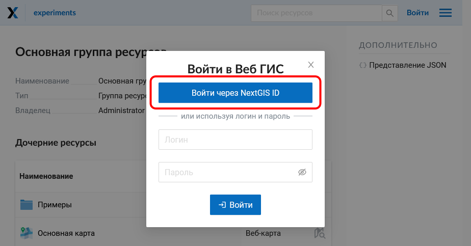
   
   Выбор входа по NextGIS ID

Вы будете перенаправлены на страницу авторизации my.nextgis.com. Введите имя пользователя или емейл, использованный при регистрации аккаунта, и в следующем окне пароль. 

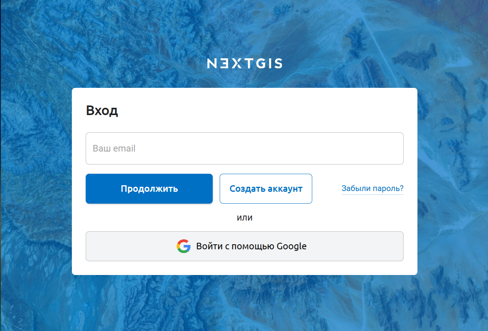
   
   Страница входа NextGIS ID

После успешной авторизации вы будете возвращены на страницу Веб ГИС.

.. _ngw_home_page:

Главная страница
--------------------------------

После авторизации пользователь попадает на главную 
страницу, представленную на рисунке :numref:`ngweb_main_page_administrative_interface_pic`

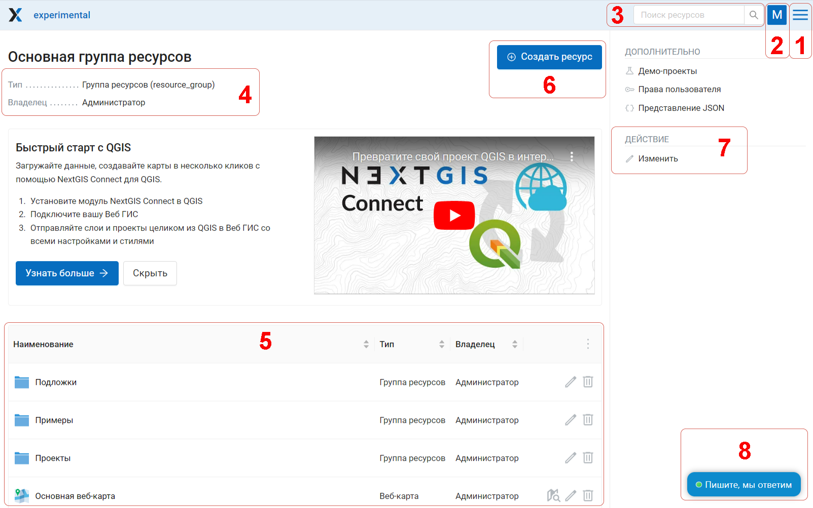

   Главная страница

   Цифрами обозначены: 1 - Основное меню; 2 - Пользовательские настройки (Выход, Избранное и Смена языка); 3 – Строка поиска ресурсов в Веб ГИС; 4 - Описание основной группы ресурсов; 5 - Дочерние ресурсы; 6 - Кнопка добавления ресурсов; 7 - Операции, которые можно проводить с основной группой; 8 - кнопка техподдержки.

В блоке основного меню (см. :numref:`ngweb_main_page_administrative_interface_pic`, п.1) размещены следующие пункты:

* Ресурсы
* Панель управления
* Справка
* План и функции

   
В блоке "Описание" (см. :numref:`ngweb_main_page_administrative_interface_pic`, п.4) размещается такая информация, как тип ресурса, его владелец и другие данные в зависимости от типа пресурса.

Блок "Дочерние ресурсы" (см. :numref:`ngweb_main_page_administrative_interface_pic`, п.5) 
включает в себя перечень всех ресурсов, которые размещены в основной группе. В виде таблицы
доступны название и тип ресурса. Одновременно с этим есть кнопки различных действий над ресурсами (редактирование, удаления, предпросмотр, открытие таблицы атрибутов).

Кнопка создания ресурса (см. :numref:`ngweb_main_page_administrative_interface_pic`, п.6) вызывает всплывающее окно, в котором можно выбрать тип ресурса для создания.

В текущей версии в главную группу ресурсов возможно добавить следующие виды данных (см. :numref:`ngweb_main_page_administrative_interface_pic`, п.7):

* Группа ресурсов
* Веб-карта
* Векторный слой
* Растровый слой
* Группа трекеров
* Набор тайлов
* Подложка веб-карты
* Проект Collector

* Сервис OGC API - Features

* Слой PostGIS
* Соединение PostGIS

* Соединение TMS
* Слой TMS

* Сервис WFS
* Соединение WMS
* Cлой WMS
* Сервис WMS

В зависимости от вашей версии NGW также могут быть подключены:

* Библиотека маркеров SVG
* 3D модель
* 3D сцена
* 3D тайлсет

Блок операций (см. :numref:`ngweb_main_page_administrative_interface_pic`, п.7) позволяет изменять/удалять эту группу (основную группу удалить нельзя - она является корневой).

Возможные операции над ресурсами:

* Изменить
* Удалить

Также на главной странице расположены дополнительные ссылки:

* `Демо-проекты <https://docs.nextgis.ru/docs_ngcom/source/demoprojects.html>`_;
* Права пользователя - позволяет посмотреть, какие права имеет пользователь в данной ВебГИС. `Подробнее о правах доступа <https://docs.nextgis.ru/docs_ngcom/source/permissions.html>`_;
* Представление JSON.

.. _ngw_change_lang:

Переключение языка
------------------

Любой авторизованный пользователь может переключить язык интерфейса.
Для этого в правом верхнем углу экрана по иконке пользователя нужно перейти в раздел "Настройки" (:numref:`admin_select_lang_pic`)

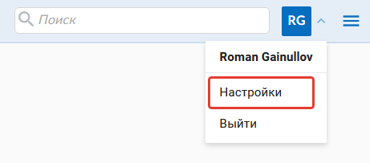

   Переход в настройки

Для выбора доступны следующие языки (:numref:`admin_settings_lang_pic`):

* По умолчанию в браузере
* Русский
* Английский 
* Болгарский
* Итальянский
* Испанский
* Китайский
* Немецкий
* Польский
* Португальский
* Французский
* Чешский

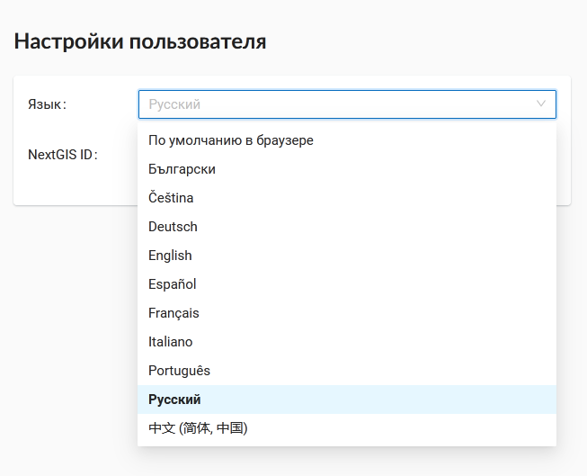

   Изменение языка интерфейса

.. _ngw_search_bar:

Поиск ресурсов
---------------

Для удобного поиска ресурсов и навигации в NextGIS Web существует строка поиска в верхней панели интерфейса (:numref:`admin_search_bar_pic`)
Поиск осуществляется по всей меющейся базе данных, независимо от того, в какой директории пользователь в данный момент находится.

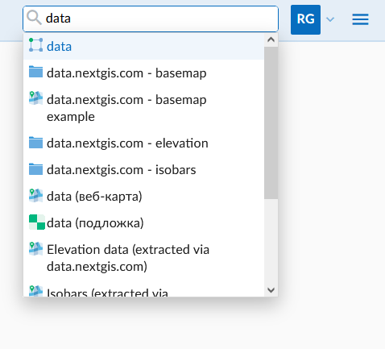

   Поиск ресурсов в веб ГИС

.. _ngw_control_panel:

Панель управления
--------------------------------

В панель управления NextGIS Web можно попасть через основное меню, которое вызывается кнопкой |button_main_menu| в правом верхнем углу (см. :numref:`ngweb_main_page_administrative_interface_pic`, п.1). Панель управления представлена на :numref:`ngweb_control_panel`.

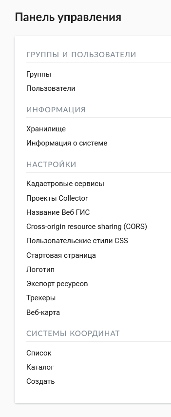

   Панель управления

Панель управления позволяет выполнять следующие действия:

* `Управлять группами и пользователями NextGIS Web <https://docs.nextgis.ru/docs_ngweb/source/users.html>`_
* `Показать информацию о системе <https://docs.nextgis.ru/docs_ngweb/source/infowebgis.html>`_
* `Настроить кадастровые сервисы <https://docs.nextgis.ru/docs_ngweb/source/cadaster.html>`_
* `Добавить учетные записи пользователей <https://docs.nextgis.ru/docs_ngweb/source/collector.html>`_ для проектов Collector
* `Задать название веб ГИС <https://docs.nextgis.ru/docs_ngweb/source/look.html#ngw-name>`_
* `Настроить CORS <https://docs.nextgis.ru/docs_ngweb/source/cors.html>`_
* `Задать стилии CSS <https://docs.nextgis.ru/docs_ngweb/source/look.html#css>`_
* `Настроить пользовательские шрифты <https://docs.nextgis.ru/docs_ngweb/source/look.html#ngw-fonts>`_
* `Указать стартовую страницу NGW <https://docs.nextgis.ru/docs_ngweb/source/look.html#ngw-homepage>`_
* `Задать Логотип (в верхнем левом углу) <https://docs.nextgis.ru/docs_ngweb/source/look.html#ngw-css-logo>`_
* `Подключить метрики и аналитику <https://docs.nextgis.ru/docs_ngweb/source/analytics.html>`_
* Настроить категорию пользователей, которые имеют `права экспортировать данные <https://docs.nextgis.ru/docs_ngweb/source/look.html#ngw-res-export>`_
* `Настроить Трекинг <https://docs.nextgis.ru/docs_ngweb/source/trackers.html>`_
* Включить `версионирование по умолчанию <>`_
* `Настроить веб-карту <https://docs.nextgis.ru/docs_ngweb/source/webmap_set.html>`_
* `Управлять системами координат <https://docs.nextgis.ru/docs_ngweb/source/ngw_srs.html#ngw-srs>`_
* Персонализировать элементы интерфейса при помощи `модуля White Label <https://docs.nextgis.ru/docs_ngweb/source/label.html>`_ (для Веб ГИС, развёрнутой на своём сервере)

Ряд настроек доступен только для пользователей плана `Premium <http://nextgis.ru/nextgis-com/plans>`_ .

.. _ngw_view_resource:

Просмотр ресурсов
------------------

После авторизации пользователь попадает на главную страницу :numref:`ngweb_resource_group`

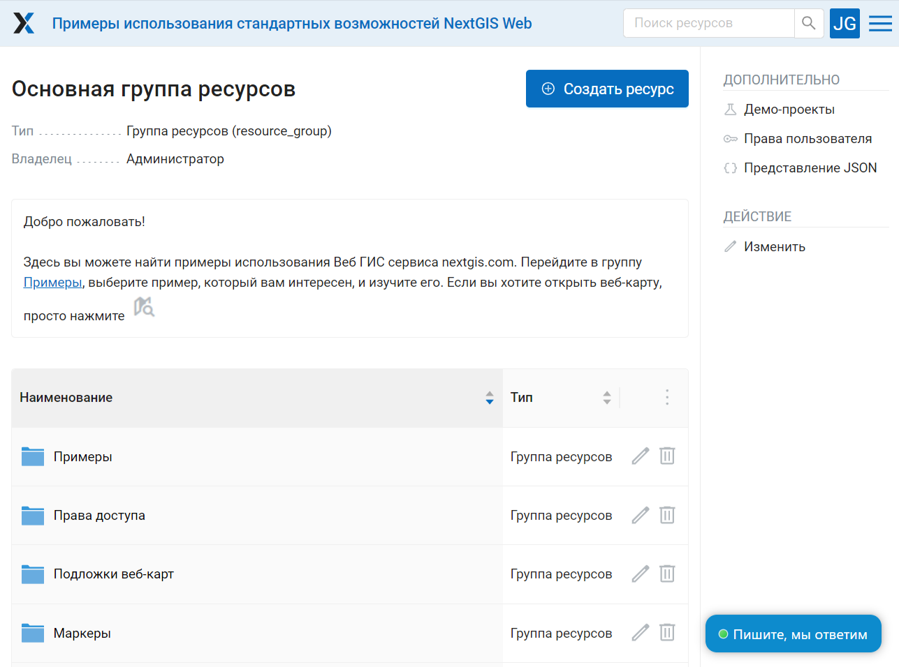

   Главная страница

Из списка ресурсов можно совершать ряд операций, нажимая на иконки в строке:

* |button_edit| перейти в редактирование ресурса
* |button_delete| удалить ресурс. 

В зависимости от типа ресурса могут быть доступны другие действия

* |button_preview| просмотр
* |button_open_web_map| открыть (для веб-карты)
* |button_open_feature_table| открыть таблицу атрибутов (для векторных слоёв)

Три точки в заголовке таблицы вызывают меню списка ресурсов.

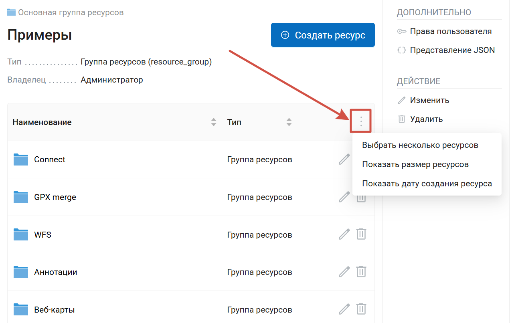

   Меню списка ресурсов

В этом меню можно:

* Выбрать несколько ресурсов для массового `перемещения <https://docs.nextgis.ru/docs_ngweb/source/edit_resource.html#ngw-parent-change-multi>`_ или `удаления <https://docs.nextgis.ru/docs_ngweb/source/edit_resource.html#ngw-delete-resource-multi>`_;
* Включить дополнительные колонки в таблице: размер ресурсов и дата создания.

Включение дополнительных колонок позволяет отсортировать ресурсы по размеру и дате создания соответственно.

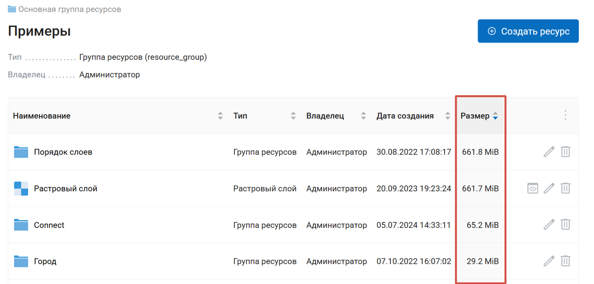

   Список ресурсов отсортирован по размеру

Нажмите на строку с ресурсом, чтобы перейти на его страницу и увидеть информацию о ресурсе и список его дочерних ресурсов.

Отсюда также можно перейти в режим `редактирования ресурса <https://docs.nextgis.ru/docs_ngweb/source/edit_resource.html>`_.

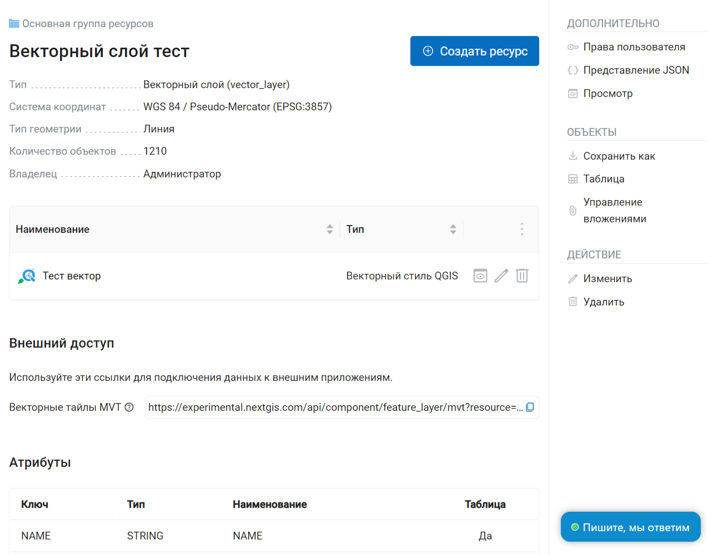
 
   Параметры векторного слоя

.. _ngw_feature_table:

Таблица объектов
-----------------

Ряд слоев (векторые, PostGIS) состоят из набора объектов. Для удобной работы с этими данными существуют Таблицы объектов.
Чтобы открыть таблицу слоя, нужно либо нажать на иконку таблицы в списке дочерних ресурсов (см. :numref:`feature_table_choice_from_group_pic`) либо пройти внутрь ресурса этого слоя и в блоке операций выбрать "Таблица объектов" (см. :numref:`ngweb_Object_table`).

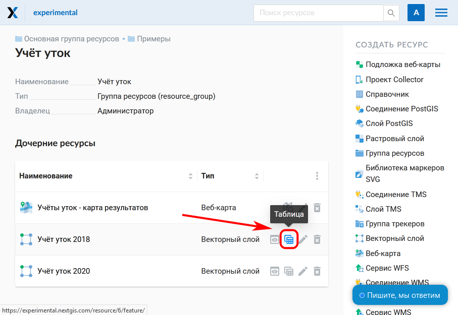

   Выбор таблицы объектов в списке ресурсов

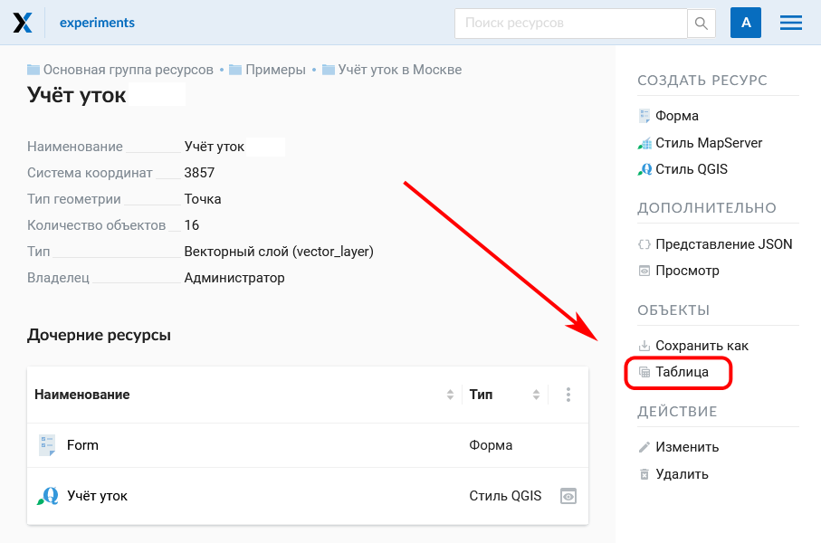

   Выбор таблицы объектов на странице слоя

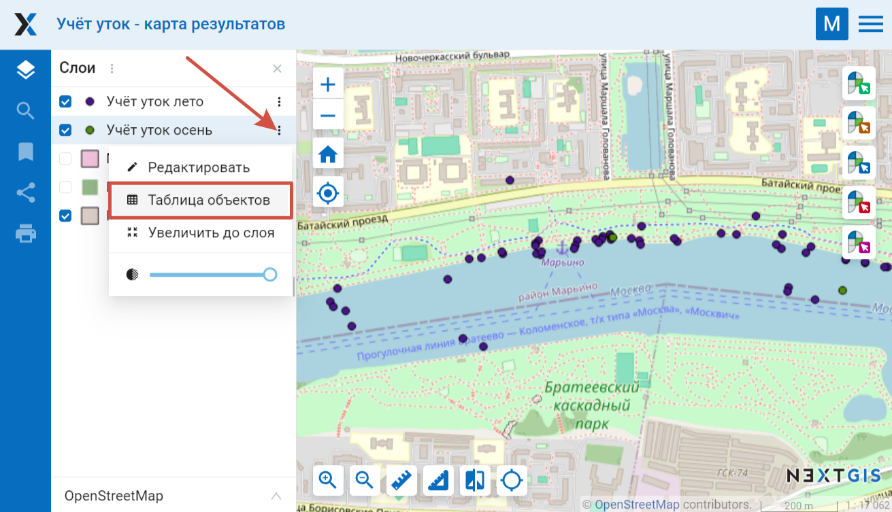

   Открытие таблицы объектов на веб-карте

Авторизованные пользователи могут `редактировать объекты через таблицу <https://docs.nextgis.ru/docs_ngweb/source/feature_table.html>`_.

.. _ngw_vector_export:

Экспорт векторных данных
-------------------------
  
Веб ГИС позволяет экспортировать данные в следующие форматы:

* :term:`GeoPackage`
* :term:`GeoJSON`
* :term:`CSV`
* CSV для Microsoft Excel
* :term:`ESRI Shapefile`
* :term:`AutoCAD DXF`
* :term:`Mapinfo TAB`
* :term:`MapInfo MIF/MID`
* :term:`KML`
* :term:`KMZ`

При экспорте в некоторые форматы создаются дополнительные файлы, например CSVT (описание полей) и PRJ (описание проекции) для CSV, CPG (кодовая страница) для ESRI Shapefile.

.. note:: 
	Поддерживается экспорт геометрий и атрибутов объектов. Описания, метаданные и изображения объектов вышеописанным способом не экспортируются, но могут быть :ref:`переданы по NextGIS API <ngcom_ngapi>`.

Для того, чтобы экспортировать данные:

#. Откройте ресурс Векторного слоя или Слоя PostGIS, данные которого вы хотите экспортировать;
#. Выберите пункт :menuselection:`Объекты --> Сохранить как` на правой панели :ref:`веб-интерфейса <ngw_admin_interface>`;
#. Укажите формат и кодировку данных;
#. При необходимости можно результат запаковать в ZIP архив (для ряда форматов это настройка по умолчанию)
#. Сохраните файл себе на устройство

По умолчанию экспорт будет произведён в формат GeoPackage в кодировке UTF-8 с включением всех полей.

.. raw:: html

   <iframe width="560" height="315" src="https://rutube.ru/play/embed/90d560f23df007b4d4b376eb0100d260/" frameBorder="0" allow="clipboard-write; autoplay" webkitAllowFullScreen mozallowfullscreen allowFullScreen></iframe>

Посмотреть видео на `youtube <https://youtu.be/cGKK5crJCKo>`_, `rutube <https://rutube.ru/video/90d560f23df007b4d4b376eb0100d260/>`_.

.. _ngw_vector_export_settings:

Параметры экспорта
~~~~~~~~~~~~~~~~~~~

В поле "Формат" можно выбрать требуемый формат данных:

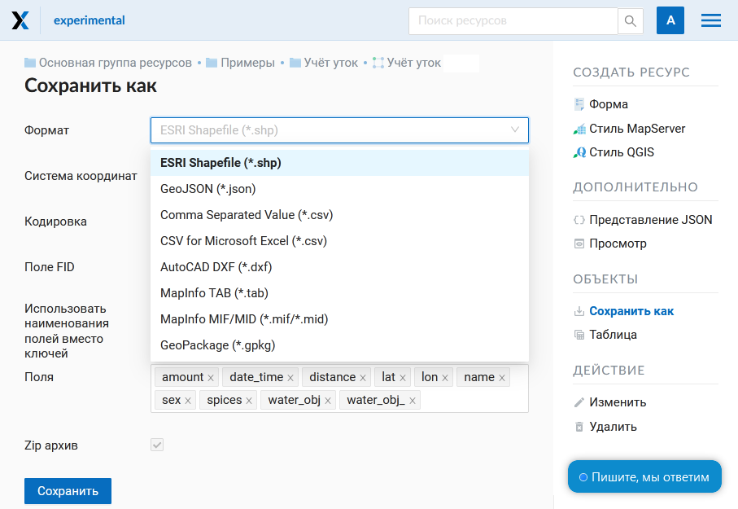

   Поле "Формат"

В поле *Система координат* помимо стандартных вариантов Широта-Долгота (EPSG: 4326) и Меркатор (EPSG: 3857) есть возможность выбрать другие системы координат, добавленные ранее (о том, как добавить настраиваемые системы координат см. в `этом разделе <https://docs.nextgis.ru/docs_ngweb/source/ngw_srs.html>`_): 

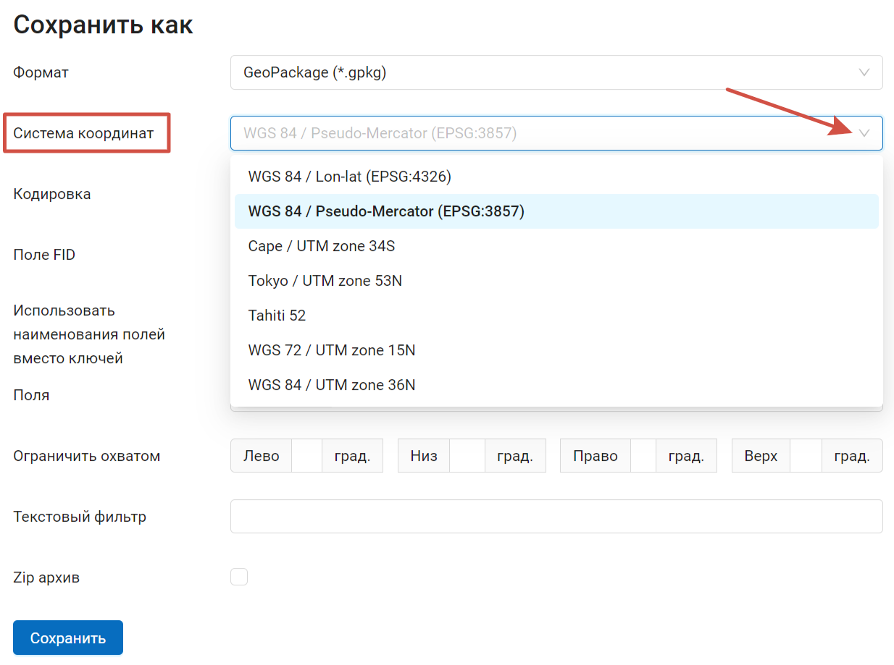

   Поле "Система координат"

В поле *Кодировки* можно выбрать для выходного файла одну из кодировок: UTF-8, Windows-1251, Windows-1252:

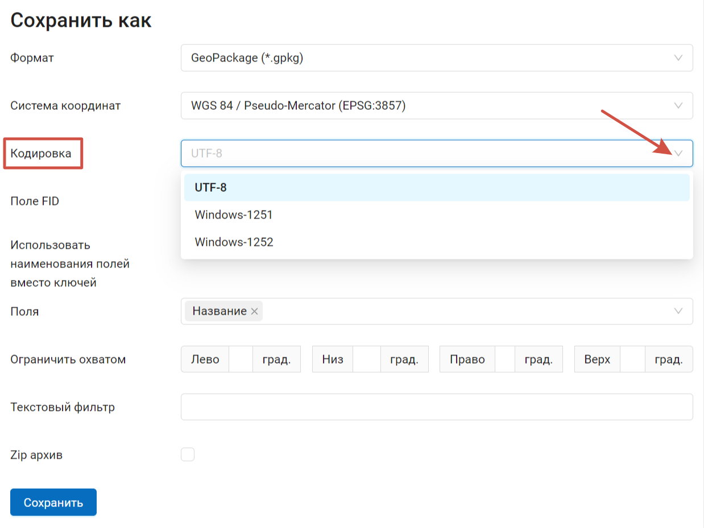

   Поле "Кодировки"

Настройка *Поле FID* предназначена для задания имени атрибутивного поля, которое будет создано в экспортируемом слое и в которое будут помещены идентификаторы объектов в системе (по умолчанию «ngw_id»).

Далее можно включить опцию *Использовать наименования полей вместо ключей*. Ключ - техническое обозначение поля, в котором используется только латиница без дополнительных символов. Наименование может быть на любом языке, обычно оно отображается как подпись колонки или поля в форме (см. `подробнее <https://docs.nextgis.ru/docs_ngweb/source/layers_settings.html#ngw-attributes-edit>`_).

В следующем поле можно указать *поля* таблицы данных, которые будут включены в файл при экспорте. По умолчанию все поля добавлены. Для того, чтобы удалить лишние, можно нажать на крестик рядом с соответствующим ключом или снять галочку в выпадающем меню. Чтобы снова добавить поле, отметьте его в выпадающем меню.

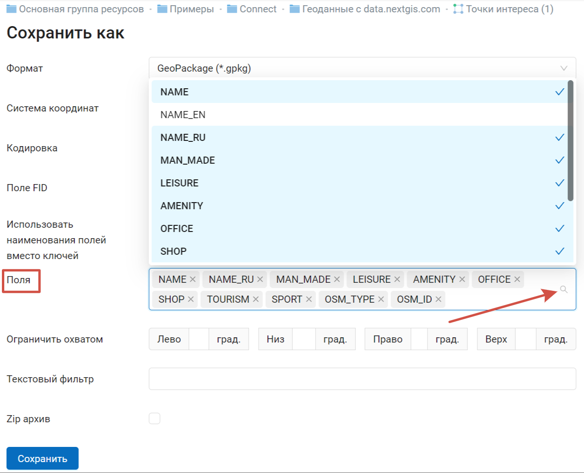

   Выбор полей

.. raw:: html

   <iframe width="560" height="315" src="https://rutube.ru/play/embed/3c2ff0e798f391f91cc8e4c1dc01a701/" frameBorder="0" allow="clipboard-write; autoplay" webkitAllowFullScreen mozallowfullscreen allowFullScreen></iframe>

Посмотреть видео на `youtube <https://youtu.be/7dvCIbl_psc>`__, `rutube <https://rutube.ru/video/3c2ff0e798f391f91cc8e4c1dc01a701/>`__.

Опция *Ограничить охватом* позволяет экспортировать не все объекты слоя, а только те, которые находятся в нужной области. Охват задается в градусах.

Также можно ограничить выборку объекта при помощи *текстового фильтра*. Поиск производится по всем полям, для которых не отключен `полнотекстовый поиск <https://docs.nextgis.ru/docs_ngweb/source/layers_settings.html#ngw-attributes-edit>`_, так же как в таблице атрибутов.

При экспорте в такие форматы, как ESRI Shapefile или MapInfo TAB, в результате создаётся Zip-архив с нужными файлами. Для однофайловых форматов (например, GeoJSON) создание архива является опциональным. 

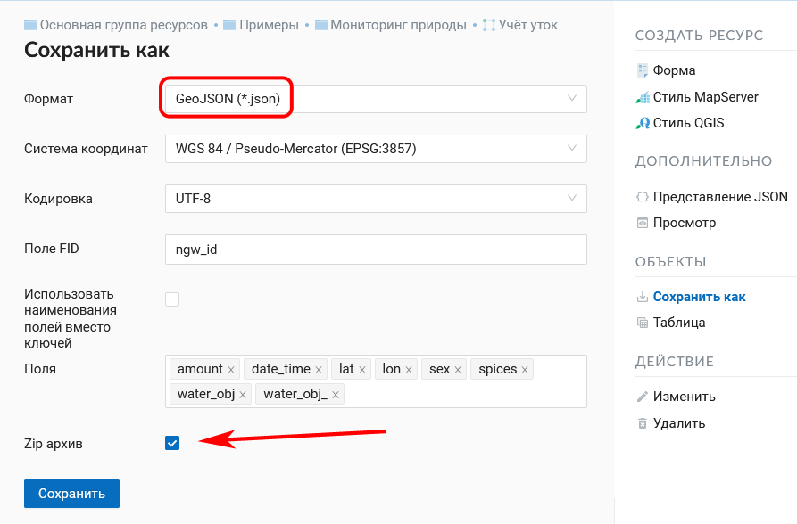

   Активный флажок "Zip архив" при выборе формата GeoJSON

Для разработчиков все параметры экспорта доступны через HTTP :term:`API`.
Например, такой запрос выдаст данные слоя в формате CSV, системе координат EPSG:4326, кодировке UTF-8:

https://demo.nextgis.ru/api/resource/4077/export?format=CSV&srs=4326&zipped=true&fid=ngw_id&encoding=UTF-8

Также можно выполнить экспорт объектов слоя (всех или некоторых) через `таблицу объектов <https://docs.nextgis.ru/docs_ngweb/source/feature_table.html>`_ и  `с помощью настольного приложения NextGIS QGIS <https://docs.nextgis.ru/docs_ngconnect/source/export.html>`_.

