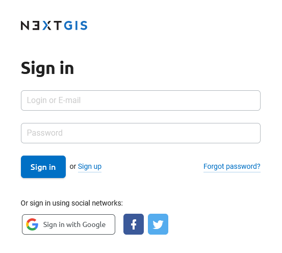
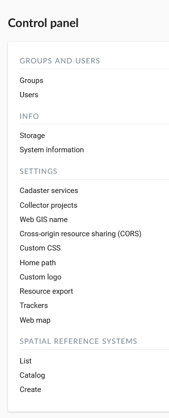
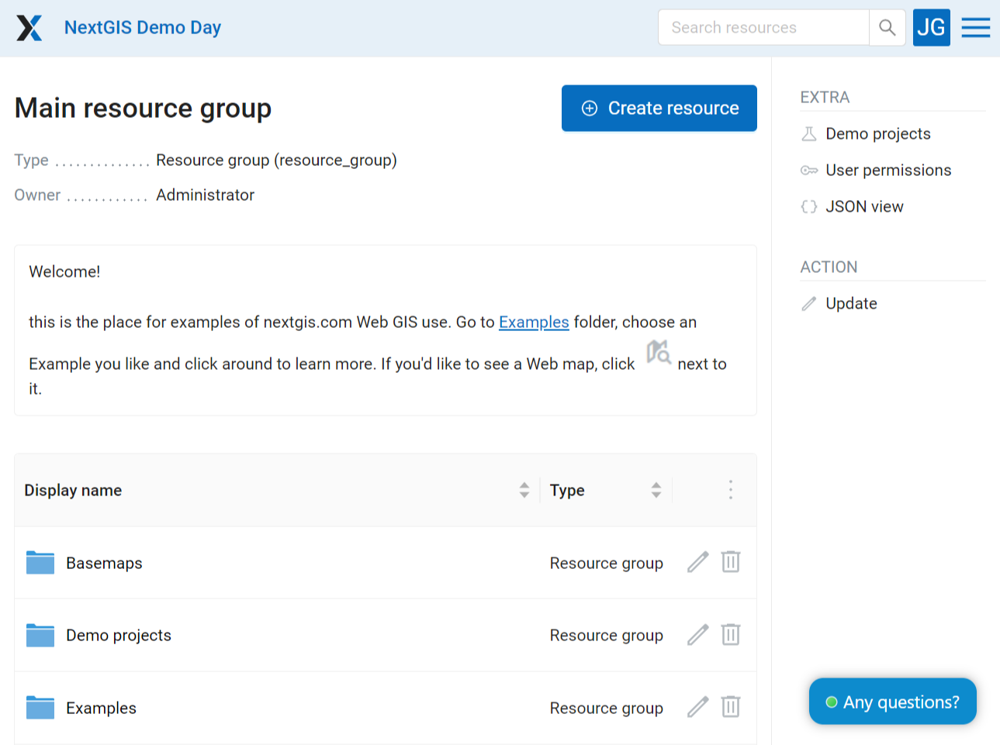

.. sectionauthor:: Artem Svetlov <artem.svetlov@nextgis.ru>
.. sectionauthor:: Roman Gainullov <roman.gainullov@nextgis.com>

.. _ngw_admin_interface:

Administrator interface (Admin console)
=========================================

Authorization
--------------

To open the admin console, open the Web GIS and press "Sign in" in the top right corner.

.. figure:: _static/ngweb_before_signin_en.png
   :name: ngweb_before_signin_pic
   :align: center
   :width: 20cm
   
   Signing in from Web GIS main page

In the opened dialog press the blue button that reads **Sign in with NextGIS ID**.

.. figure:: _static/ngweb_signin_nextgisid_en.png
   :name: ngweb_signin_nextgisid_pic
   :align: center
   :width: 20cm
   
   Selecting sign-in via NextGIS

You will be redirected to my.nextgis.com authorization page. Enter your username or email you used for registration and your password. 

   
   Signing in with NextGIS

After the authorization is completed successfully you will be redirected back to the Web GIS.

.. _ngw_home_page:

Home page
--------------------------------

After login to administrative interface the user is taken to the home page shown 
on :numref:`admin_index_pic`

.. figure:: _static/ngweb_main_page_administrative_interface_en.png
   :name: admin_index_pic
   :align: center
   :width: 25cm

   Administrator interface home page

   The numbers indicate: 1 - Main menu; 2 - User settings (Exit and Change language); 3 - Resource search bar in Web GIS 4 – Main resource group description; 5 - Child resources; 6 - User permissions for main resource group; 7 - Types of items that could be added to the main resource group; 8 - Actions that could be performed with main resource group

Home page includes main menu pane, (see item 1 in :numref:`admin_index_pic`) which has the following links (see :numref:`ngweb_main_page_main_menu_pic`):

* Resources
* Control Panel
* Help
* Account

.. figure:: _static/ngweb_main_page_main_menu_eng_2.png
   :name: ngweb_main_page_main_menu_pic
   :align: center
   :width: 20cm

   Main menu in NextGIS Web
 
Description pane (see item 4 in :numref:`admin_index_pic`) displays type of resource and owner as well as description (if available).

Child resources pane (see item 5 in :numref:`admin_index_pic`) contains a list of all resources placed in a main group.
The table contains name and type of the resource and action buttons (edit, delete, for some types of resources - preview, open the attribute table).

"Create resoruce" button opens a pop-up window where you can choose the type of resource you want to create.

In current version it is possible to add the following types of data to the Main resource group:

* Basemap
* Collector project
* Lookup table
* OGC API - Features service
* PostGIS connection
* PostGIS layer
* Raster layer
* Resource group
* TMS connection
* TMS layer
* Trackers group
* Vector layer
* Web Map
* WFS service
* WMS connection
* WMS layer
* WMS service

Depending on your NGW version you may also add:

* SVG marker library
* 3D model
* 3D scene
* 3D tileset

Actions pane (see item 7 in :numref:`admin_index_pic`) contains tools for adding data and executing operations with the current resource. For the Main resource group the only available operation is Update (i.e. edit).

On the main page there is also a block of extra links:

* `Demo projects <https://docs.nextgis.com/docs_ngcom/source/demoprojects.html>`_;
* User permissions - show access rights for the logged in user. `Learn more about user permissions <https://docs.nextgis.com/docs_ngcom/source/permissions.html>`_;
* JSON view.

.. _ngw_change_lang:

Language change
---------------

Any authorized user can switch the interface language.
To do this, in the upper right corner on the user icon, go to the "Settings" section (:numref:`admin_select_lang_pic`).

.. figure:: _static/admin_settings_lang_en.png
   :name: admin_settings_lang_pic
   :align: center
   :width: 10cm

   Go to Settings bar

The following languages are available for selection (:numref:`admin_settings_lang_pic`)

* Default browser
* Russian
* English
* Bulgarian
* Chinese
* Czech
* French
* German
* Italian
* Spanish
* Portuguese

.. figure:: _static/admin_select_lang_en_2.png
   :name: admin_select_lang_pic
   :align: center
   :width: 16cm

   Selecting language

.. _ngw_search_bar:

Resource search
---------------

For easy search for resources and navigation, there is a search bar in the top bar (:numref:`admin_search_bar_pic`).
The search is carried out in the entire existing database, regardless of which directory the user is currently in.

.. figure:: _static/admin_search_bar_en.png
   :name: admin_search_bar_pic
   :align: center
   :width: 12cm

   Finding Resources in Web GIS

.. _ngw_control_panel:

Control panel
--------------------------------

NextGIS Web Control panel is available through the main menu (see item 1 in :numref:`admin_index_pic`), where you need to select "Control panel" (see :numref:`ngweb_main_page_main_menu_pic`). It is presented on  :numref:`admin_control_panel`.

   Control panel

Control panel allows to execute the following actions:

* `Manage NextGIS Web groups and users <https://docs.nextgis.com/docs_ngweb/source/users.html>`_
* `Display information about the system and storage <https://docs.nextgis.com/docs_ngweb/source/infowebgis.html>`_
* Access cadaster services
* `Add participants of Collector projects <https://docs.nextgis.com/docs_ngweb/source/collector.html>`_
* `Set the name of your Web GIS <https://docs.nextgis.com/docs_ngweb/source/look.html#web-gis-name>`_
* `Configure CORS <https://docs.nextgis.com/docs_ngweb/source/cors.html>`_
* `Manage custom fonts <https://docs.nextgis.com/docs_ngweb/source/look.html#font-management>`_
* `Set CSS styles <https://docs.nextgis.com/docs_ngweb/source/look.html#customize-the-design-with-css>`_
* `Specify NGW start page (home path) <https://docs.nextgis.com/docs_ngweb/source/look.html#how-to-change-the-homepage-address>`_
* `Set custom Logo (in the upper left corner) <https://docs.nextgis.com/docs_ngweb/source/look.html#upload-a-logo>`_
* `Set up Analytics <https://docs.nextgis.com/docs_ngweb/source/analytics.html>`_
* `Specify which users see the data export button <https://docs.nextgis.com/docs_ngweb/source/webmap_set.html#resource-export>`_
* `Customize display of Tracks <https://docs.nextgis.com/docs_ngweb/source/trackers.html>`_
* `Customize Web Maps <https://docs.nextgis.com/docs_ngweb/source/webmap_set.html>`_
* `Add spacial reference systems <https://docs.nextgis.com/docs_ngweb/source/ngw_srs.html>`_
* `Customize UI elements with White Label module (on-premise only) <https://docs.nextgis.com/docs_ngweb/source/label.html>`_

For more information about creation of user groups and users and granting 
permissions see topic :ref:`ngw_admin_tasks`.

.. _ngw_view_resource:

Resource view
------------------

After login to administrative interface the user is taken to home page shown on :numref:`resource_group`.

   Resource groups

You can open the Update resource dialog by clicking the pencil icon next to the resource, or delete a resource directly from the list. For special types of resources other actions are available (e.g. Preview for vector layers or Open for Web Maps).

To open a resource page click on the corresponding row of the table. The resource page contains properties, attributes, a link for external access and a list of child resources if there are any (see  :numref:`resource_details_pic`).

.. figure:: _static/resource_details_en_2.png
   :name: resource_details_pic
   :align: center
   :width: 20cm
 
   Vector layer parameters

Here you can also enter the resource `edit mode <https://docs.nextgis.com/docs_ngweb/source/edit_resource.html>`_.

.. _ngw_feature_table:

Feature table
-----------------

Some resources contain a set of features that can be viewed as a table.
Press the "Table" icon opposite the resource name or select an action for a vector layer called "Table" in the features pane.

.. figure:: _static/feature_table_choice_from_group_en.png
   :name: feature_table_choice_from_group_pic
   :align: center
   :width: 20cm

   Opening feature table from the resource list

.. figure:: _static/feature_table_choice_eng_2.png
   :name: admin_table_objects_upload
   :align: center
   :width: 20cm

   Opening feature table from the resource page

.. figure:: _static/map_and_tree_layers_eng_3.png
   :name: admin_map_and_tree_layers_upload
   :align: center
   :width: 20cm

   Opening feature table from the map

Authorized users can `edit features <https://docs.nextgis.com/docs_ngweb/source/feature_table.html>`_ from the feature table.

.. _ngw_vector_export:

Data export
-----------------
  
NextGIS Web allows you to export data in the following formats:

* :term:`GeoJSON`
* :term:`CSV`
* CSV for Microsoft Excel
* :term:`ESRI Shapefile`
* AutoCAD DXF
* Mapinfo TAB
* MapInfo MIF/MID
* :term:`GeoPackage`

While exporting to some formats additional files are created, for example CSVT (field description) and PRJ (projection description) for CSV, CPG (code page) for ESRI Shapefile.

To export data:

#. Open a Vector or PostGIS layer, the data of which you want to export;
#. Select the item: menuselection: `Features -> Save As` on the right pane :ref:` web interface <ngw_admin_interface> `;
#. Specify the format and encoding of the data and select fields to be exported;
#. If necessary, you can compress the result into a ZIP archive (for a number of formats this is the default setting);
#. Save the file to your device.

.. figure:: _static/ngweb_data_export_eng_2.png
   :name: ngweb_data_export
   :align: center
   :width: 20cm
   
   Selecting "Save as" action to export data

.. figure:: _static/formats_en_2.png
   :name: formats_pic
   :align: center
   :width: 20cm

   Data export in various formats

