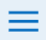

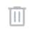

.. |button_edit| image:: _static/button_edit.png
   :width: 6mm
   :alt: pencil

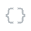

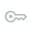

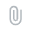

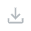

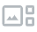

.. |button_open_web_map| image:: _static/button_open_web_map.png
   :width: 6mm
   :alt: magnifying glass on map

.. |button_open_feature_table| image:: _static/button_open_feature_table.png
   :width: 6mm
   :alt: table

.. _ngw_admin_interface:

Main interface
==================

Authorization
--------------

Open the Web GIS and press "Sign in" in the top right corner.

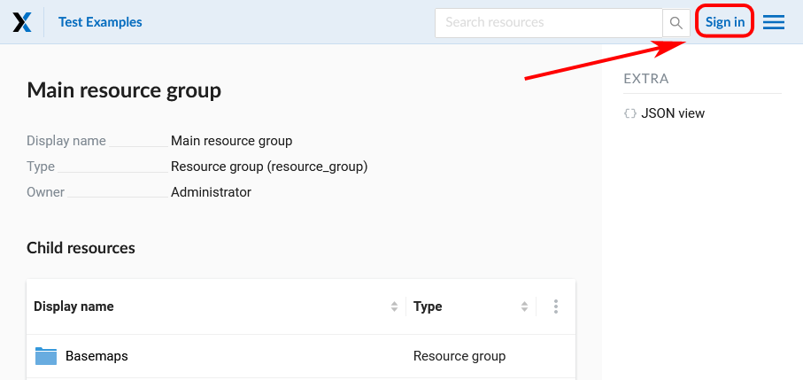
   
   Signing in from Web GIS main page

In the opened dialog press the blue button that reads **Sign in with NextGIS ID**.

.. figure:: _static/ngweb_signin_nextgisid_en.png
   :name: ngweb_signin_nextgisid_pic
   :align: center
   :width: 20cm
   
   Selecting sign-in via NextGIS

You will be redirected to my.nextgis.com authorization page. Enter your username or email you used for registration, then on the next page enter your password. 

.. figure:: _static/ngid_signup_signin_en.png
   :name: ngweb_nextgisid_pic
   :align: center
   :width: 16cm
   
   Signing in with NextGIS

After the authorization is completed successfully you will be redirected back to the Web GIS.

.. _ngw_home_page:

Home page
--------------------------------

After login the user is taken to the home page shown on :numref:`admin_index_pic`

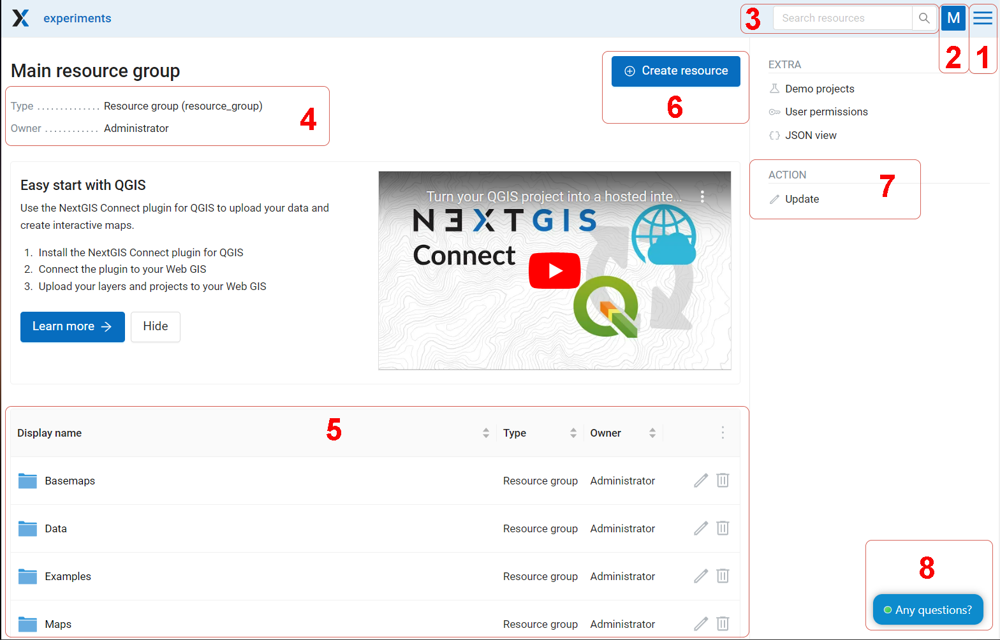

   Home page

   The numbers indicate: 1 - Main menu; 2 - User settings (Exit and Change language); 3 - Resource search bar in Web GIS 4 – Main resource group description; 5 - Child resources; 6 - User permissions for main resource group; 7 - Types of items that could be added to the main resource group; 8 - Actions that could be performed with main resource group

Home page includes main menu pane, (see item 1 in :numref:`admin_index_pic`) which has the following links (see :numref:`ngweb_main_page_main_menu_pic`):

* Resources
* Control Panel
* Help
* Account

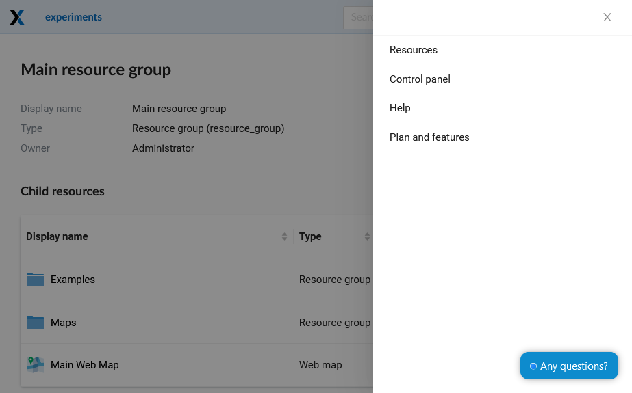

   Main menu in NextGIS Web
 
Description pane (see item 4 in :numref:`admin_index_pic`) displays type of resource and owner as well as description (if available).

Child resources pane (see item 5 in :numref:`admin_index_pic`) contains a list of all resources placed in a main group.
The table contains name and type of the resource and action buttons (edit, delete, for some types of resources - preview, open the attribute table).

"Create resoruce" button opens a pop-up window where you can choose the type of resource you want to create.

In current version it is possible to add the following types of data to the Main resource group:

* Basemap
* Collector project
* Lookup table
* OGC API - Features service
* PostGIS connection
* PostGIS layer
* Raster layer
* Resource group
* TMS connection
* TMS layer
* Trackers group
* Vector layer
* Web Map
* WFS service
* WMS connection
* WMS layer
* WMS service

Depending on your NGW version you may also add:

* SVG marker library
* 3D model
* 3D scene
* 3D tileset

Actions pane (see item 7 in :numref:`admin_index_pic`) contains tools for adding data and executing operations with the current resource. For the Main resource group the only available operation is Update (i.e. edit).

On the main page there is also a block of extra links:

* `Demo projects <https://docs.nextgis.com/docs_ngcom/source/demoprojects.html>`_;
* User permissions - show access rights for the logged in user. `Learn more about user permissions <https://docs.nextgis.com/docs_ngcom/source/permissions.html>`_;
* JSON view.

.. _ngw_change_lang:

Language change
---------------

Any authorized user can switch the interface language.
To do this, in the upper right corner on the user icon, go to the "Settings" section.

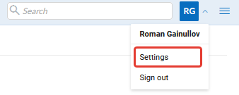

   Go to Settings bar

The following languages are available for selection (:numref:`admin_settings_lang_pic`)

* Default browser
* Russian
* English
* Bulgarian
* Chinese
* Czech
* French
* German
* Italian
* Polish
* Spanish
* Portuguese

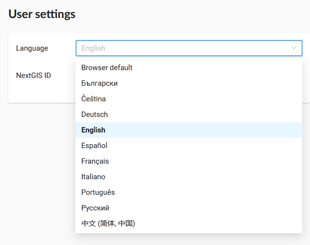

   Selecting language

.. _ngw_search_bar:

Resource search
---------------

For easy search for resources and navigation, there is a search bar in the top bar (:numref:`admin_search_bar_pic`).
The search is carried out in the entire existing database, regardless of which directory the user is currently in.

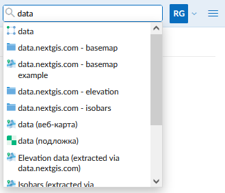

   Finding Resources in Web GIS

See how the search works in our video:

.. raw:: html

   <iframe width="560" height="315" src="https://www.youtube.com/embed/q6h-zL4yg0c?si=1_xkTl5GRvpu1DJv" title="YouTube video player" frameborder="0" allow="accelerometer; autoplay; clipboard-write; encrypted-media; gyroscope; picture-in-picture; web-share" referrerpolicy="strict-origin-when-cross-origin" allowfullscreen></iframe>

Watch on `youtube <https://youtu.be/q6h-zL4yg0c?si=FKHlTbneOmen5O5k>`_.

.. _ngw_control_panel:

Control panel
--------------------------------

NextGIS Web Control panel is available through the main menu. Press the |button_main_menu| button in the top right corner (see item 1 in :numref:`admin_index_pic`) and select "Control panel".

Control panel has several sections, see :numref:`admin_control_panel`.

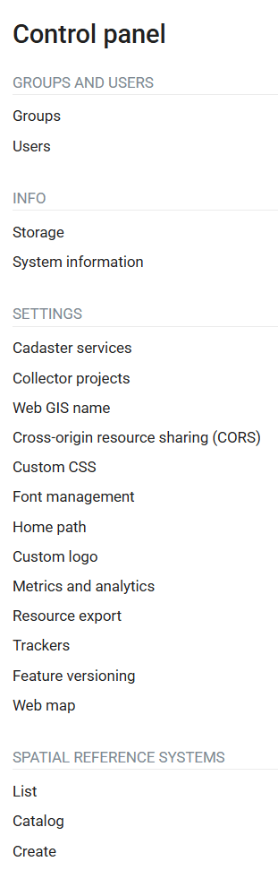

   Control panel

Control panel allows to execute the following actions:

* `Manage NextGIS Web groups and users <https://docs.nextgis.com/docs_ngweb/source/users.html>`_
* `Display information about the system and storage <https://docs.nextgis.com/docs_ngweb/source/infowebgis.html>`_
* Access cadaster services
* `Add participants of Collector projects <https://docs.nextgis.com/docs_ngweb/source/collector.html>`_
* `Set the name of your Web GIS <https://docs.nextgis.com/docs_ngweb/source/look.html#web-gis-name>`_
* `Configure CORS <https://docs.nextgis.com/docs_ngweb/source/cors.html>`_
* `Manage custom fonts <https://docs.nextgis.com/docs_ngweb/source/look.html#font-management>`_
* `Set CSS styles <https://docs.nextgis.com/docs_ngweb/source/look.html#customize-the-design-with-css>`_
* `Specify NGW start page (home path) <https://docs.nextgis.com/docs_ngweb/source/look.html#how-to-change-the-homepage-address>`_
* `Set custom Logo (in the upper left corner) <https://docs.nextgis.com/docs_ngweb/source/look.html#upload-a-logo>`_
* `Set up Analytics <https://docs.nextgis.com/docs_ngweb/source/analytics.html>`_
* `Specify which users see the data export button <https://docs.nextgis.com/docs_ngweb/source/webmap_set.html#resource-export>`_
* `Customize display of Tracks <https://docs.nextgis.com/docs_ngweb/source/trackers.html>`_
* Set up `Feature versioning by default <https://docs.nextgis.com/docs_ngweb/source/version.html#vers-ngw-default>`_
* `Customize Web Maps <https://docs.nextgis.com/docs_ngweb/source/webmap_set.html>`_
* `Add spacial reference systems <https://docs.nextgis.com/docs_ngweb/source/ngw_srs.html>`_
* `Customize UI elements with White Label module (on-premise only) <https://docs.nextgis.com/docs_ngweb/source/label.html>`_

For more information about creation of user groups and users and granting 
permissions see `this section <https://docs.nextgis.com/docs_ngweb/source/users.html`_.

.. _ngw_view_resource:

Resource view
------------------

After login to administrative interface the user is taken to home page.

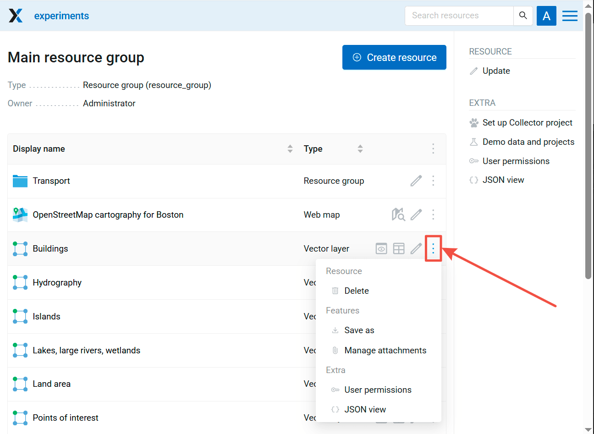

   Resource groups

The resource list allows users to perform some actions by clicking icons next to the resource name: 

* |button_edit| open the resource edit page;
* |button_delete| delete resource;
* |button_key| view user permissions for the resource;
* |button_json| open JSON view of the resource.

Other actions can be available depending on the resource type, including:

* |button_preview| preview;
* |button_open_web_map| open (for Web Maps);
* |button_open_gallery| view resource gallery;
* |button_open_feature_table| open feature table (for vector layers);
* |button_attachments| manage attachments (for vector layers);
* |button_export| save features of the vector layer as a file, etc.

Press three dots in the right corner of the table title to open the resource list menu.

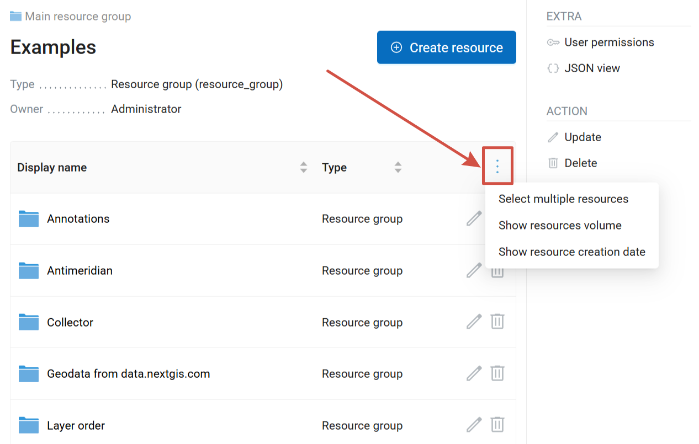

   Resource list menu

This menu allows to:

* Select multiple resource to be `moved <https://docs.nextgis.com/docs_ngweb/source/edit_resource.html#using-multiple-selection>`_ or `deleted <https://docs.nextgis.com/docs_ngweb/source/edit_resource.html#deleting-several-resources-at-once>`_;
* View additional columns in the resource list table: creation date and resource volume.

Additional columns allow to sort the resource list by date or size:

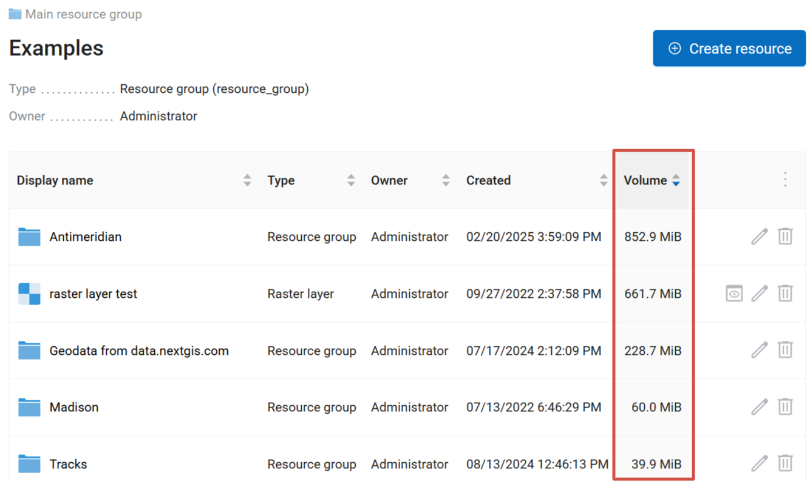

   Resource list sorted by volume

To open the resource page click on the corresponding row of the table. The resource page contains properties, attributes, a link for external access and a list of child resources if there are any (see  :numref:`resource_details_pic`).

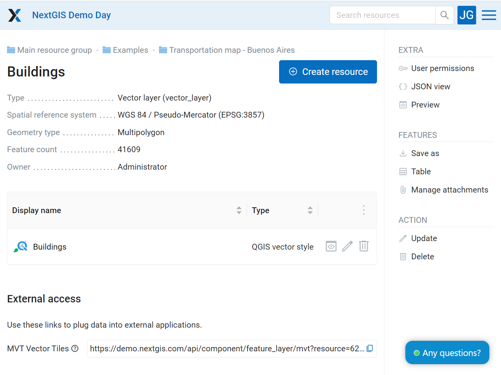
 
   Vector layer parameters

Here you can also enter the resource `edit mode <https://docs.nextgis.com/docs_ngweb/source/edit_resource.html>`_.

.. _ngw_feature_table:

Feature table
-----------------

Some resources contain a set of features that can be viewed as a table.
Press the "Table" icon opposite the resource name or select an action for a vector layer called "Table" in the features pane.

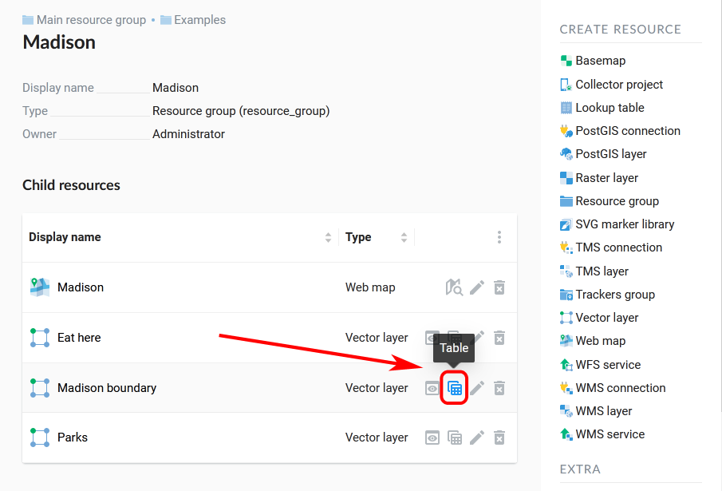

   Opening feature table from the resource list

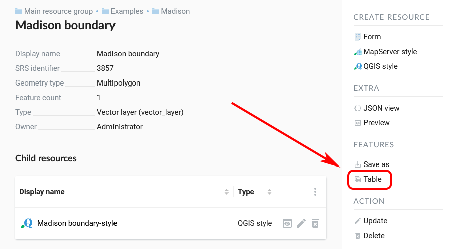

   Opening feature table from the resource page

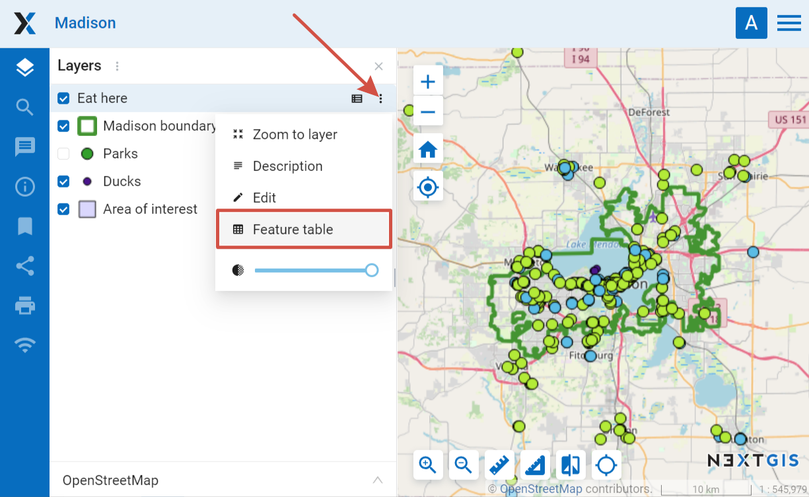

   Opening feature table from the map

Authorized users can `edit features <https://docs.nextgis.com/docs_ngweb/source/feature_table.html>`_ from the feature table.

.. _ngw_vector_export:

Data export
-----------------
  
Web GIS allows to export data from Vector layers and PostGIS layer in the following formats:

* :term:`GeoPackage`
* :term:`CSV` and CSV for Microsoft Excel
* :term:`ESRI Shapefile`
* :term:`AutoCAD DXF`
* :term:`Mapinfo TAB`
* :term:`MapInfo MIF/MID`
* :term:`GeoJSON`
* :term:`KML`
* :term:`KMZ`
* :term:`GPX`

Depending on the format, additional file components are exported making further use of the exported data more convenient. For example CSVT (field structure description) and PRJ (coordinate system description) are added to CSV and CPG (codepage) to ESRI Shapefile.

.. note:: 
	Geometry and attributes are supported for export. Features' descriptions, metadata and images can't be exported in the described way but can be requested using :ref:`NextGIS API <ngcom_ngapi>`.

To export data:

#. Open the Properties page of Vector layer or PostGIS layer from which you want to export data;
#. Select :menuselection:`Vector layer --> Save as` on the right side of the page;
#. Select data format and encoding;
#. If you need to have the file archived, select *ZIP archive* (some multi-file formats are zipped by default);
#. Save the file to your device.

By default data is exported to a GeoPackage file using UTF-8 encoding with all fields included.

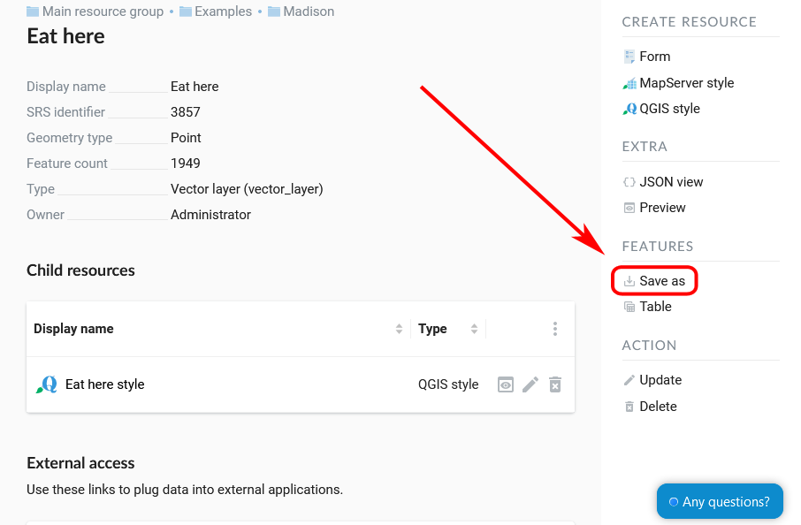
   
   Selecting "Save as" action to export data

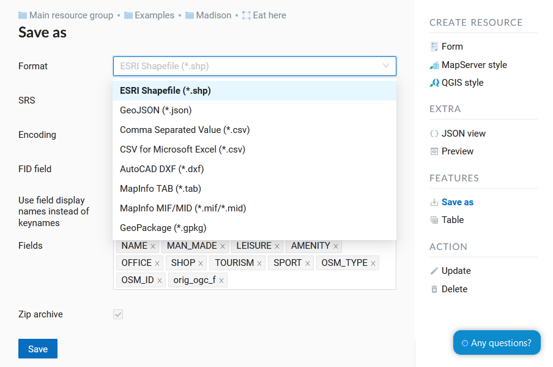

   Data export in various formats

.. _ngw_vector_export_settings:

Export settings
~~~~~~~~~~~~~~~~~~~

In the *Format* field select data format you need:

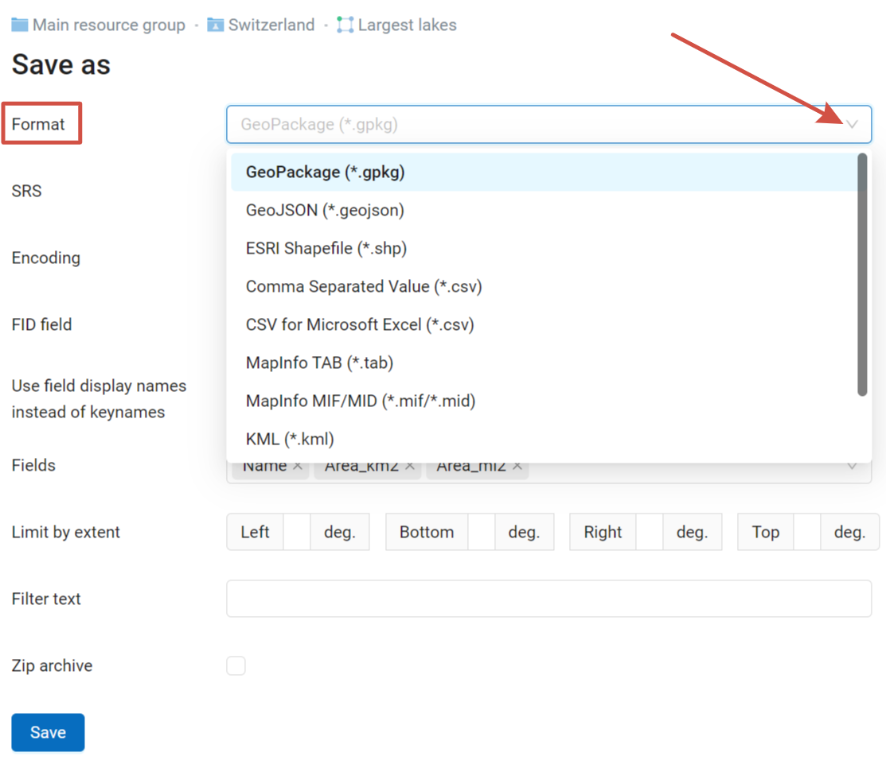

   "Format" field

In the *SRS* field (Spatial reference system) in addition to standard coordinate systems Longitude-Latitude (EPSG: 4326) and Mercator (EPSG: 3857) you can select custom coordinate systems created earlier (how to add custom SRS see `this page <https://docs.nextgis.com/docs_ngweb/source/ngw_srs.html>`_): 

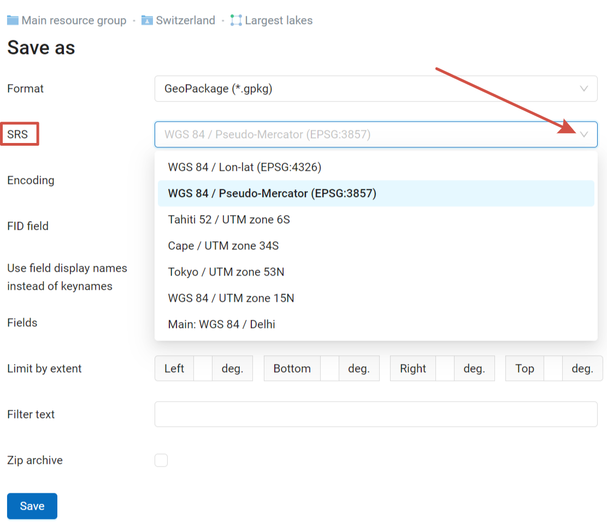

   "SRS" field

In the *Encoding* field you can choose UTF-8, Windows-1251, or Windows-1252 encoding for your data:

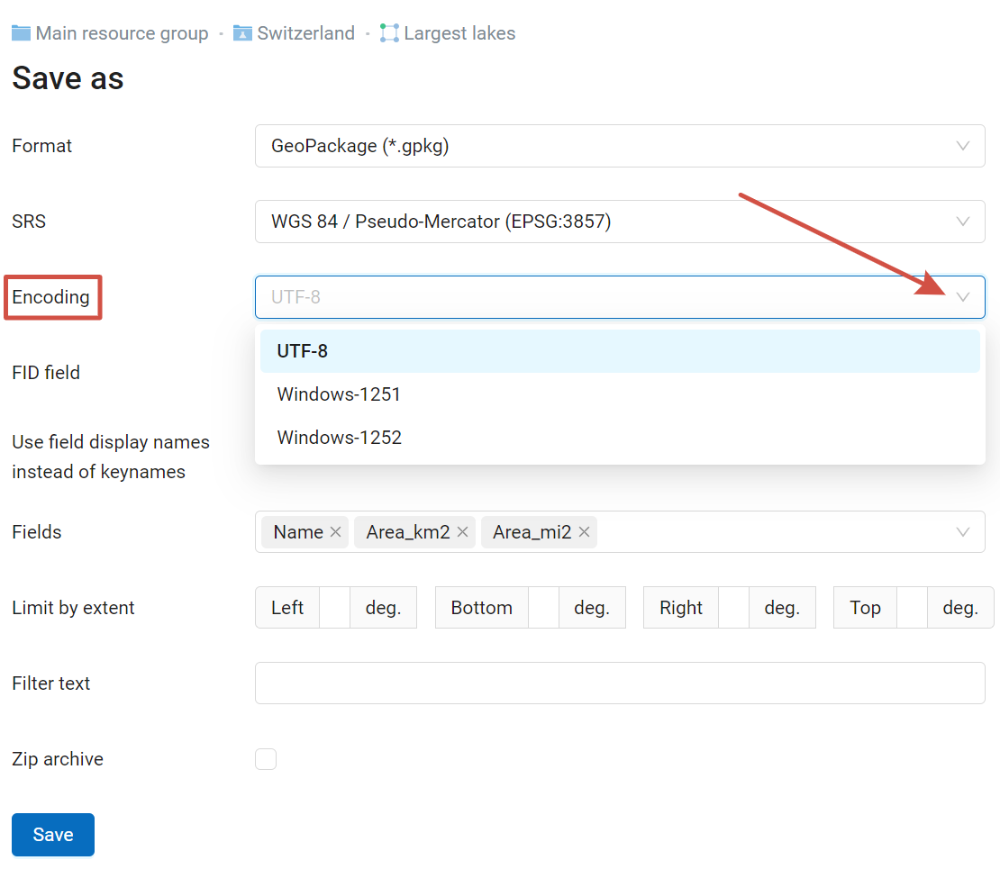

   "Encoding" field

*FID field* is used for setting a field name to be added to a exported data where the object identifiers will be placed (the default is “ngw_id”).

You can choose to *use field display names instead of keynames*.  Keynames are technical and use only plain Latin symbols.  Display names can be in any language, usually they are seen as column headers or field labels in a form (for more details see `this section <https://docs.nextgis.com/docs_ngweb/source/layers_settings.html#ngw-attributes-edit>`_).

Next you can chose which of the *fields* of the data to keep in the file. By default, all are selected. To remove a field, click on the cross by its name or untick it in the drop-down menu. To add a field again, tick it in the drop-down menu.

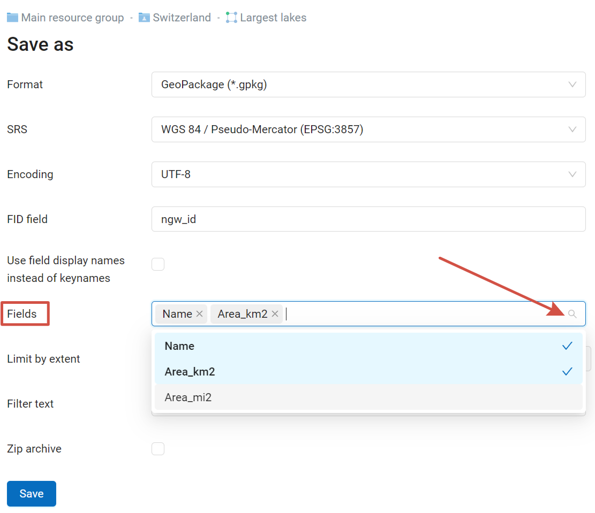

   Selcting fields

.. raw:: html

   <iframe width="560" height="315" src="https://www.youtube.com/embed/Hukt3lD-JyQ?si=aZH_hwK3z655jwvq" title="YouTube video player" frameborder="0" allow="accelerometer; autoplay; clipboard-write; encrypted-media; gyroscope; picture-in-picture; web-share" referrerpolicy="strict-origin-when-cross-origin" allowfullscreen></iframe>

Watch on `youtube <https://youtu.be/Hukt3lD-JyQ?si=c8Cbut245FWU7LMQ>`__.

If you need to export only the features within a particular area, you can *Limit by extent*. The extent is set in degrees.

A *text filter* is also available.  Search is performed in all fields that don't have `text search <https://docs.nextgis.com/docs_ngweb/source/edit_resource.html#edit-vector-layer-attributes-table>`_ disabled, just like in the feature table. 

Output in ESRI Shapefile or MapInfo TAB results in a Zip archive with necessary files. For single-file formats (like GeoJSON or CSV) creation of Zip archive is optional.  

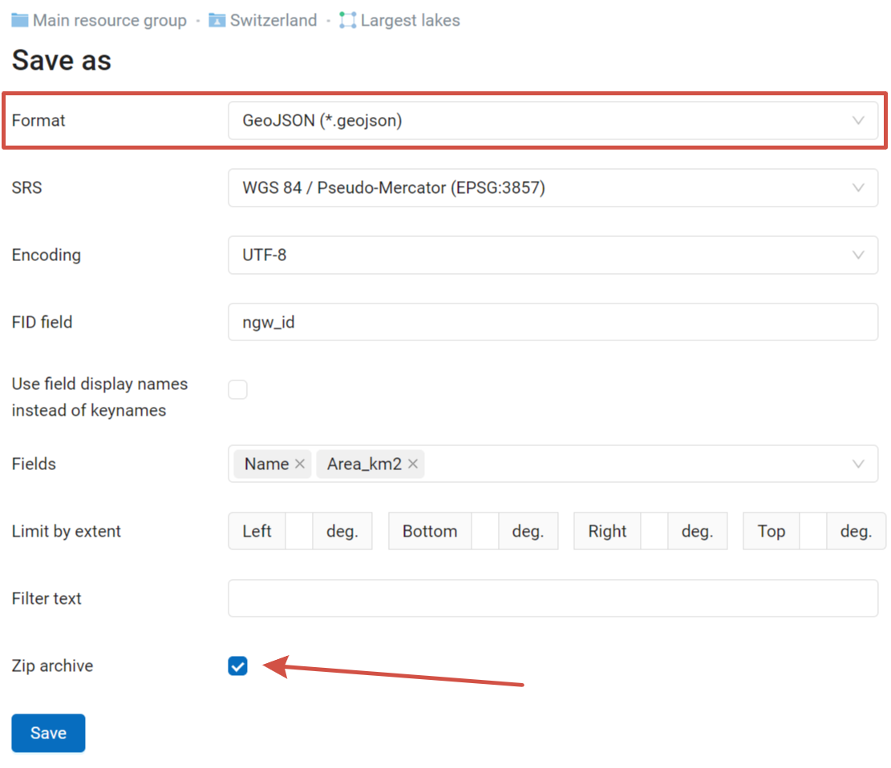

   Creation of Zip archive selected for GeoJSON format

All export options are available through HTTP API.
For example, this query will get you data in CSV format, EPSG:4326, UTF-8 encoding, zipped:

https://demo.nextgis.com/api/resource/4077/export?format=csv&srs=4326&zipped=true&fid=ngw_id&encoding=UTF-8 

You can also export data from Vector layers using `feature table on the Web Map <https://docs.nextgis.com/docs_ngweb/source/feature_table.html>`_ or :ref:`with desktop app NextGIS QGIS <ngcom_ngqgis_connect_data_export>`.

