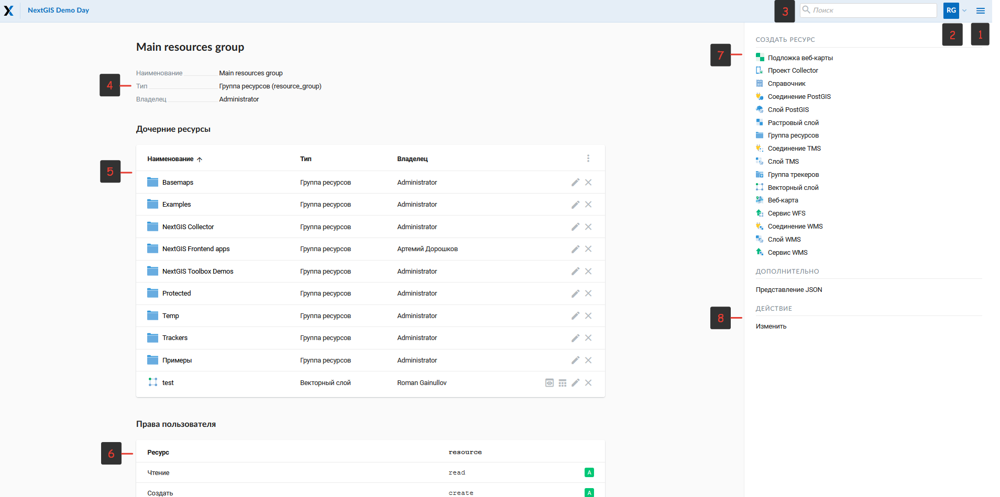

.. sectionauthor:: Артём Светлов <artem.svetlov@nextgis.ru>

.. _ngw_admin_interface:

Административный интерфейс
================================

Главная страница
--------------------------------

После входа в административный интерфейс, пользователь попадает на главную 
страницу, представленную на рисунке :numref:`ngweb_main_page_administrative_interface_pic`.

   Главная страница административного интерфейса.

   Цифрами обозначены: 1 - основное меню; 2 - кнопка смены языка; 3 – описание основной группы ресурсов; 4 - дочерние ресурсы; 5 - права пользователя на основную группу; 6 - типы объектов, которые можно добавлять в основную группу; 7 - операции, которые можно проводить с основной группой.

В блоке основного меню (см. :numref:`ngweb_main_page_administrative_interface_pic`, п.1) размещены следующие пункты (см. :numref:`ngweb_main_page_main_menu_pic`):

* Ресурсы
* Панель управления
* Справка
* Аккаунт

.. figure:: _static/ngweb_main_page_main_menu_rus.png
   :name: ngweb_main_page_main_menu_pic
   :align: center
   :width: 16cm

   Основное меню.
   
В блоке "Описание" (см. :numref:`ngweb_main_page_administrative_interface_pic`, п.3) размещается описание корневой группы ресурсов (при его наличии).

Блок "дочерние ресурсы" (см. :numref:`ngweb_main_page_administrative_interface_pic`, п.4) 
включает в себя перечень всех ресурсов, которые размещены в корневой группе. В блоке 
дается название ресурса, владелец ресурса, а также есть кнопка редактирования ресурса.

Блок "Права пользователя" (см. :numref:`ngweb_main_page_administrative_interface_pic`, п.5) включает в себя перечень прав текущего пользователя на корневую группу ресурсов. Зелёная и красная отметки идентифицируют наличие/отсутствие соответствующего 
права. Буквами обозначено: 

* A - allow (разрешено)
* D - deny (запрещено)
* M - mask (косвенно запрещено)
* E - empty (нет ничего, по факту право отсутствует)

Права имеют следующий состав:

* все права
* чтение
* просмотр прав доступа
* создание
* изменение
* изменение прав доступа
* удаление

В блоке операций (см. :numref:`ngweb_main_page_administrative_interface_pic`, п.6 и п.7) имеются инструменты для добавления данных и выполнения операций над корневой группой.

В текущей версии возможно добавить следующие виды данных (см. :numref:`ngweb_main_page_administrative_interface_pic`, п.6):

* Подложка веб-карты
* Справочник
* Соединение PostGIS
* Слой PostGIS
* Растровый слой
* Группа ресурсов
* Векторный слой
* Веб-карта
* Сервис WFS
* Соединение WMS
* Cлой WMS
* Сервис WMS

Операции имеют следующий состав (см. :numref:`ngweb_main_page_administrative_interface_pic`, п.7): 

* Удалить
* Изменить

Панель управления
--------------------------------

В панель управления NextGIS Web можно попасть через основное меню (см. :numref:`ngweb_main_page_administrative_interface_pic`, п.1), выбрав соответствующий пункт (см. :numref:`ngweb_main_page_main_menu_pic`). Панель управления представлена на :numref:`ngweb_control_panel`.

.. figure:: _static/ngweb_control_panel_new.png
   :name: ngweb_control_panel
   :align: center
   :width: 16cm

   Панель управления.

Панель управления позволяет выполнять следующие действия:

* Просмотр групп и списка пользователей
* Создание групп и списка пользователя
* Назначение прав доступа группам ресурсов и веб-картам
* Задать название Веб ГИС
* Возможность ввода перечня допустимых источников для кросс-доменных запросов на странице настроек CORS

Вопросы создания групп пользователей и пользователей, назначение прав доступа 
рассмотрены в разделе :ref:`ngw_admin_tasks`.

Просмотр ресурсов
------------------

После входа в административный интерфейс, пользователь попадает на главную 
страницу, представленную на :numref:`ngweb_resource_group`.

.. figure:: _static/resource_group.png
   :name: ngweb_resource_group
   :align: center
   :width: 16cm

   Группы ресурсов. 

Далее переходим к группе дочерних ресурсов, где обозначены типы слоев этих ресурсов.
Выбираем из таблицы тип ресурса - векторный слой.

В результате выбора векторного ресурса откроется окно с параметрами/атрибутами 
векторного слоя (см. :numref:`ngweb_options_resource_group`).

.. figure:: _static/options_resource_group_rus.png
   :name: ngweb_options_resource_group
   :align: center
   :width: 16cm
 
   Параметры векторного слоя ресурса.

.. _ngw_feature_table:

Таблица объектов
-----------------

Для того, чтобы произвести действия над таблицей объектов, необходимо войти в административный интерфейс, перейти к группе дочерних ресурсов, где обозначены типы слоев этих ресурсов, и нажать на значок таблицы напротив векторного слоя или выбрать этот слой, а затем в блоке операций выбрать 
действие над слоем - "Таблица объектов" (см. :numref:`ngweb_Object_table`).

.. figure:: _static/feature_table_choice_rus.png
   :name: ngweb_Object_table
   :align: center
   :width: 16cm

   Выбор таблицы объектов. 

Сформированная таблица объектов позволяет выполнить следующие операции 
над выделенной записью из таблицы (см. :numref:`ngweb_operations_on_writing_in_object_table`):

1. Открыть
2. Редактировать
3. Удалить
4. Воспользоваться Строкой поиска

.. figure:: _static/ngweb_operations_on_writing_in_object_table_rus.png
   :name: ngweb_operations_on_writing_in_object_table
   :align: center
   :width: 16cm

   Операции над записью в таблице объектов.

Фомирование таблицы объектов можно выполнить другим способом. В административном 
интерфейсе необходимо перейти к группе дочерних ресурсов, где обозначены типы слоев
этих ресурсов, и выбрать веб-карту. В блоке операций выбрать действие над ресурсом - "Открыть" (см. :numref:`webmap_open_rus_pic`):

.. figure:: _static/webmap_open_rus.png
   :name: webmap_open_rus_pic
   :align: center
   :width: 16cm

   Операция открытия веб-карты.
   
В результате откроется карта (справа) и дерево слоев карты (слева). Для формирования 
таблицы объектов необходимо выделить нужный слой карты в дереве слоев, после чего 
во вкладке "Слой" выбрать "Таблица объектов" :numref:`ngweb_admin_map_and_tree_layers_upload`:

.. figure:: _static/map_and_tree_layers_rus.png
   :name: ngweb_admin_map_and_tree_layers_upload
   :align: center
   :width: 16cm

   Карта и дерево слоев.
 
Cформируется таблица объектов, которая позволяет выполнять следующие операции 
над выделенной записью из таблицы :numref:`ngweb_admin_table_objects2_upload`:

1. Открыть
2. Редактировать
3. Удалить
4. Перейти (при нажатии на кнопку происходит переход к выбранному объекту на карте)
5. Воспользоваться Строкой поиска
 
.. figure:: _static/ngweb_operations_on_writing_in_object_table2_rus.png
   :name: ngweb_admin_table_objects2_upload
   :align: center
   :width: 16cm

   Операции над записью в таблице объектов.

Обновление ресурса
------------------

Для того, чтобы изменить ресурс, необходимо войти в административный интерфейс (см. :numref:`ngweb_resource_group`), перейти к группе 
дочерних ресурсов, выбрать тип ресурса - векторный слой и нажать на значок карандаша напротив выбранного слоя или нажать на выбранный слой, а затем в блоке операций выбрать действие над ресурсом: "Изменить". После этого откроется окно "Обновить ресурс" (см. :numref:`ngw_window_update_resource1`), в котором можно редактировать родителя выбранного ресурса, изменить права доступа, добавить описание, метаданных и атрибутов выбранного ресурса.

.. figure:: _static/ngw_window_update_resource1_rus.png
   :name: ngw_window_update_resource1
   :align: center
   :width: 16cm

   Окно "Обновить ресурс".

В первой вкладке Ресурс доступны к редактированию следующие поля:

1. Наименование (можно изменить имя ресурса)
2. Ключ
3. Родитель (можно изменить группу ресурсов, переместив свой ресурс)
4. Тип

Ресурсы можно перемещать из одной группы ресурсов в другую группу ресурсов и после их создания. Для этого следует нажать в строке "Родитель" кнопку открытия диалога дерева выбора, после чего откроется окно "Выбора ресурса", которое предоставляет возможность выбора группы ресурсов, куда можно переместить свой ресурс. Выбрав группу ресурсов для перемещения своего ресурса, следует нажать ОК и нажать кнопку "Сохранить". 

Если ресурс успешно перемещен, то информация о нем появится в новой группе ресурсов 
и пропадет из старой группы ресурсов:

.. figure:: _static/ngw_resource_selection_rus.png
   :name: ngw_resource_selection
   :align: center
   :width: 16cm

   Окно выбора ресурса.

Третья вкладка Описание также доступна к редактированию: имеющийся текст можно изменить 
или удалить, а при отсутствии текста, добавить и сохранить необходимый текст, нажав 
на кнопку Сохранить:  

.. figure:: _static/ngw_description_window.png
   :name: ngw_description_window
   :align: center
   :width: 16cm
  
   Вкладка Описание.

Четвертая вкладка Метаданные. Метаданные заносятся, удаляются, отражаются в таблице 
при помощи следующих вкладок:

1. Добавить (Текст/Text, Целое число/Integer, Вещественное число/Float).
2. Удалить.  

.. figure:: _static/ngw_metadata_tab.png
   :name: ngw_metadata_tab
   :align: center
   :width: 16cm

   Вкладка Метаданные.

Таблица состоит из трех столбцов: 

1. Ключ. Ключ-значение позволяет описывать свойства метаданных (автор, дата, версия и тд.).
2. Тип. Типы данных: Текст/Text, Целое число/Integer, Вещественное число/Float.
3. Значение. Значение соответствует типу ключа.

.. figure:: _static/ngw_Metadata_table.png
   :name: ngw_Metadata_table
   :align: center
   :width: 16cm

   Таблица с метаданными.

Настройка векторного слоя
^^^^^^^^^^^^^^^^^^^^^^^^^^^^

Дополнительно к параметрам, которые вводились при создании слоя, в окне присутствует вкладка :guilabel:`Атрибуты` (см. :numref:`ngweb_admin_layers_attr`).

.. figure:: _static/admin_layers_attr.png
   :name: ngweb_admin_layers_attr
   :align: center
   :width: 16cm

   Окно редактирования слоя, вкладка :guilabel:`Атрибуты`.

В этой таблице перечислены атрибуты слоя.

* Галочка в столбце :guilabel:`ТО` обозначает, что атрибут выводится в окне идентификации.
* Галочка в столбце :guilabel:`АН` обозначает, что из этого атрибута берётся название при 
  идентификации, а также при формировании списка закладок. 

Для каждого имени поля можно поставить соответствующий псевдоним для отображения 
вместо имени поля в окне идентификации.

.. figure:: _static/webmap_identification.png
   :name: ngweb_webmap_identification
   :align: center
   :width: 16cm

   Окно идентификации.

.. _ngw_attributes_edit:

Удаление ресурса
-----------------

Сервис Веб ГИС позволяет удалять загруженные данные путем удаления соответствующих ресурсов. 
Для того, чтобы удалить ресурс:

1. Откройте окно свойств ресурса, который хотите удалить;
2. Выберите и нажмите на кнопку Удалить на правой панели веб-интерфейса Веб ГИС;
3. В открывшемся окне на вкладке Удалить ресурс поставьте галочку в окошке Подтвердить удаление ресурса;
4. Нажмите кнопку Удалить. 

Если ресурс успешно удален, то информация о нем исчезнет из соответствующей Группы ресурсов.

.. figure:: _static/ngw_deletion_resource.png
   :name: ngw_deletion_resource
   :align: center
   :width: 16cm

   Удаление ресурса.

Экспорт данных в форматы CSV и GeoJSON
---------------------------------------
  
Веб ГИС позволяет выгружать/экспортировать данные в следующие форматы: 

* в формате GeoJSON,
* в формате CSV.

Для экспорта данных:

1. Откройте окно свойств Векторного слоя или Слоя PostGIS, данные которого вы хотите экспортировать;
2. Выберите пункт Векторный слой ‣ Загрузить GeoJSON или Векторный слой ‣ Загрузить CSV на правой панели веб-интерфейса Веб ГИС;
3. Сохраните файл в формате GeoJSON или CSV к себе на устройство.

.. figure:: _static/ngweb_data_export.png
   :name: ngweb_data_export
   :align: center
   :width: 16cm

   Экспoрт и сoхранение данных в форматы CSV и GeoJSON.
