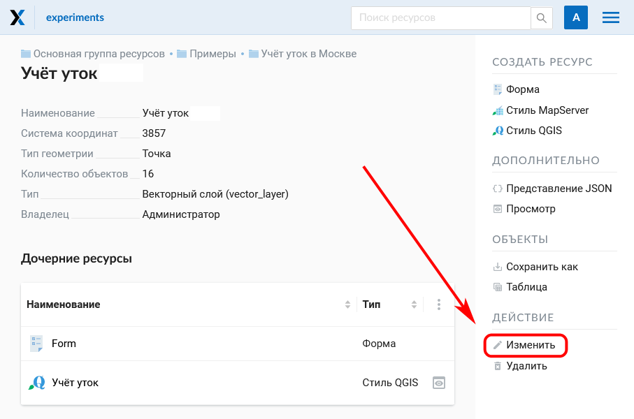
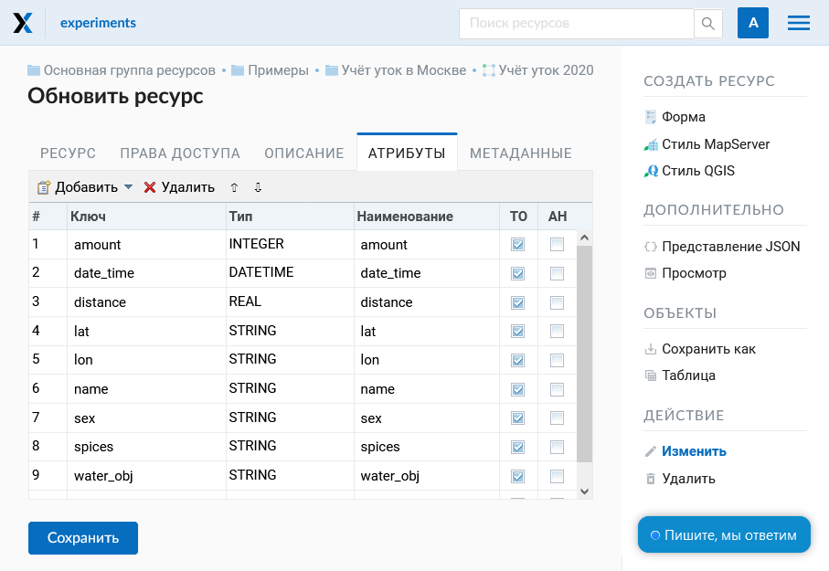

.. sectionauthor:: Артём Светлов <artem.svetlov@nextgis.ru>
.. sectionauthor:: Роман Гайнуллов <roman.gainullov@nextgis.ru>

.. _ngw_admin_interface:

Административный интерфейс
================================

Авторизация
-----------

Для того, чтобы войти в административный интерфейс, откройте Веб ГИС и нажмите **Войти** в правом верхнем углу.

.. figure:: _static/ngweb_before_signin_ru.png
   :name: ngweb_before_signin_pic
   :align: center
   :width: 20cm
   
   Вход с главной страницы Веб ГИС

В открывшемся диалоговом окне нажмите синюю кнопку **Войти через NextGIS ID**.

.. figure:: _static/ngweb_signin_nextgisid_ru.png
   :name: ngweb_signin_nextgisid_pic
   :align: center
   :width: 20cm
   
   Выбор входа по NextGIS ID

Вы будете перенаправлены на страницу авторизации my.nextgis.com. Введите имя пользователя или емейл, использованный при регистрации аккаунта, и пароль. 

.. figure:: _static/ngweb_nextgisid_ru.png
   :name: ngweb_nextgisid_pic
   :align: center
   :width: 12cm
   
   Страница входа NextGIS ID

После успешной авторизации вы будете возвращены на страницу Веб ГИС.

.. _ngw_home_page:

Главная страница
--------------------------------

После входа в административный интерфейс пользователь попадает на главную 
страницу, представленную на рисунке :numref:`ngweb_main_page_administrative_interface_pic`

.. figure:: _static/ngweb_main_page_administrative_interface_rus.png
   :name: ngweb_main_page_administrative_interface_pic
   :align: center
   :width: 25cm

   Главная страница административного интерфейса

   Цифрами обозначены: 1 - Основное меню; 2 - Пользовательские настройки (Выход и Смена языка); 3 – Строка поиска ресурсов в Веб ГИС; 4 - Описание основной группы ресурсов; 5- Дочерние ресурсы; 6 - Права текущего пользователя на основную группу; 7 - Типы объектов, которые можно создавать в основной группе; 7 - Операции, которые можно проводить с основной группой

В блоке основного меню (см. :numref:`ngweb_main_page_administrative_interface_pic`, п.1) размещены следующие пункты (см. :numref:`ngweb_main_page_main_menu_pic`):

* Ресурсы
* Панель управления
* Справка
* Аккаунт

   Основное меню
   
В блоке "Описание" (см. :numref:`ngweb_main_page_administrative_interface_pic`, п.4) размещается описание основной группы ресурсов (при его наличии).

Блок "Дочерние ресурсы" (см. :numref:`ngweb_main_page_administrative_interface_pic`, п.5) 
включает в себя перечень всех ресурсов, которые размещены в основной группе. В виде таблицы
доступны такие параметры как название, тип и владелец ресурса. Одновременно с этим есть кнопки различных действий над ресурсами (редактирование, удаления, предпросмотр, открытие таблицы атрибутов).

Блок "Права пользователя" (см. :numref:`ngweb_main_page_administrative_interface_pic`, п.5) включает в себя перечень прав текущего пользователя на основную группу ресурсов. Зелёная и красная отметки идентифицируют наличие/отсутствие соответствующего права. Буквами обозначено: 

* A - allow (разрешено)
* D - deny (запрещено)
* M - mask (косвенно запрещено)
* E - empty (нет ничего, по факту право отсутствует)

Права имеют следующий состав:

* Все права
* Чтение
* Просмотр прав доступа
* Создание
* Изменение
* Изменение прав доступа
* Удаление

Подробнее о правах доступа :ref:`ngw_admin_tasks`.

Блок операций (см. :numref:`ngweb_main_page_administrative_interface_pic`, п.7, 8) позволяет как создавать новые типы ресурсов в текущей группе, так и изменять/удалять эту группу (основную группу удалить нельзя - она является корневой).

В текущей версии возможно добавить следующие виды данных (см. :numref:`ngweb_main_page_administrative_interface_pic`, п.7):

* Подложка веб-карты
* Проект Collector
* Справочник
* Соединение PostGIS
* Слой PostGIS
* Растровый слой
* Группа ресурсов
* Соединение TMS
* Слой TMS
* Группа трекеров
* Векторный слой
* Веб-карта
* Сервис WFS
* Соединение WMS
* Cлой WMS
* Сервис WMS

В зависимости от вашей версии NGW также могут быть подключены:

* Библиотека маркеров SVG
* 3D модель
* 3D сцена
* 3D тайлсет

Возможные операции над ресурсами:

* Изменить
* Удалить

.. _ngw_control_panel:

Панель управления
--------------------------------

В панель управления NextGIS Web можно попасть через основное меню (см. :numref:`ngweb_main_page_administrative_interface_pic`, п.1), выбрав соответствующий пункт (см. :numref:`ngweb_main_page_main_menu_pic`). Панель управления представлена на :numref:`ngweb_control_panel`.

.. figure:: _static/ngweb_control_panel_new_ru.png
   :name: ngweb_control_panel
   :align: center
   :width: 10cm

   Панель управления

Панель управления позволяет выполнять следующие действия:

* Управлять группами и пользователями NextGIS Web
* Показать информацию о системе
* Задать название веб ГИС
* Настроить CORS
* Задать стилии CSS
* Указать стартовую страницу NGW
* Задать Логотип (в верхнем левом углу)
* Настроить категорию пользователей, которые имеют права экспортировать данные
* Завести учетные записи пользователей для проектов Collector
* Настроить Трекинг
* Настроить веб-карту

Подробнее эти настройки рассмотрены в разделе :ref:`ngw_admin_tasks`.

.. _ngw_view_resource:

Просмотр ресурсов
------------------

После входа в административный интерфейс, пользователь попадает на главную страницу :numref:`ngweb_resource_group`

   Главная страница

Для просмотра ресурса следует перейти "внутрь" него через блок Дочерних ресурсов.

После выбора ресурса (например, вам нужен векторный слой) откроется окно с его параметрами/атрибутами см. :numref:`ngweb_options_resource_group`

 
   Параметры векторного слоя ресурса

.. _ngw_feature_table:

Таблица объектов
-----------------

Ряд слоев (векторые, PostGIS) состоят из набора объектов. Для удобной работы с этими данными существуют Таблицы объектов.
Чтобы открыть таблицу слоя, нужно либо нажать на иконку таблицы в списке дочерних ресурсов (см. :numref:`feature_table_choice_from_group_pic`) либо пройти внутрь ресурса этого слоя и в блоке операций выбрать "Таблица объектов" (см. :numref:`ngweb_Object_table`).

   Выбор таблицы объектов в списке ресурсов

   Выбор таблицы объектов на странице слоя

Для того, чтобы произвести действия над таблицей объектов, необходимо войти в административный интерфейс, перейти к группе дочерних ресурсов, где обозначены типы слоев этих ресурсов (см. :numref:`feature_table_choice_from_group_pic`, п.5) и нажать на значок таблицы напротив векторного слоя.
Другой способ - выбрать этот слой, а затем в блоке операций выбрать действие над слоем - "Таблица объектов" (см. :numref:`ngweb_Object_table`).

Сформированная таблица объектов позволяет выполнить следующие операции (см. :numref:`ngweb_operations_on_writing_in_object_table`):

1. Открыть выделенную запись
2. Редактировать запись (в том числе редактировать на новой странице)
3. Удалить запись
4. Сохранить как (доступен расширенный и быстрый экспорт)
5. Воспользоваться строкой Поиска
6. Обновить таблицу
7. Открыть настройки таблицы

   Инструменты таблицы объектов

Формирование таблицы объектов можно выполнить другим способом. В административном 
интерфейсе необходимо перейти к группе дочерних ресурсов, где обозначены типы слоев
этих ресурсов (см. :numref:`ngweb_main_page_administrative_interface_pic`, п.4), найти веб-карту и в той же строке нажать значок с изображением лупы, чтобы открыть карту.

   Операция открытия веб-карты из группы ресурсов

Также можно сначала перейти на страницу ресурса веб-карты и в блоке операций выбрать действие над ресурсом - "Открыть" (см. :numref:`webmap_open_rus_pic`):

   Операция открытия веб-карты со страницы ресурса
   
В результате откроется карта (справа) и дерево слоев карты (слева). Для формирования 
таблицы объектов необходимо выделить нужный слой карты в дереве слоев, после чего 
в меню слоя выбрать "Таблица объектов" :numref:`ngweb_admin_map_and_tree_layers_upload`:

   Карта и дерево слоев
 
Cформируется таблица объектов, которая позволяет выполнять следующие операции  :numref:`ngweb_admin_table_objects2_upload`:

1. Открыть выделенную запись
2. Редактировать запись 
3. Удалить запись
4. Перейти (при нажатии на кнопку происходит переход к выбранному объекту на карте)
5. Сохранить как (доступен расширенный и быстрый экспорт)
6. Приблизить к найденным объектам
7. Отфильтровать объекты по местности
8. Воспользоваться строкой Поиска
9. Обновить таблицу
10. Открыть настройки таблицы
 
.. figure:: _static/ngweb_operations_on_writing_in_object_table2_rus_3.png
   :name: ngweb_admin_table_objects2_upload
   :align: center
   :width: 20cm

   Операции над записью в таблице объектов

.. _ngw_feature_table_filter_area:

Фильтрация объектов по области карты
~~~~~~~~~~~~~~~~~~~~~~~~~~~~~~~~~~

В NextGIS Web предусмотрена возможность отфильтровать объекты, входящие в выделенную область карты. Обозначить границы области можно, нарисовав их непосредственно на карте.

Откройте таблицу объектов и нажмите на кнопку с пунктирной рамкой. В выпадающем меню выберите форму геометрии очертаний области фильтрации:

* окружность (задаётся двумя кликами по карте, первый клик обозначит центр окружности, второй - желаемый радиус, он будет показываться в метрах)
* линия (отфильтрованы будут все объекты, пересекаемые заданной линией)
* прямоугольник (задаётся двумя вершинами)
* произвольный полигон (каждый клик создаёт вершину полигона, охватываемая им область высветляется; чтобы завершить рисование, кликните в точке дважды, полигон замкнётся автоматически)

   Выбор геометрии области фильтрации

Теперь таблица объектов содержит только те из них, которые попадают в выделенную область. На кнопке будет отображена форма геометрии выделения. В выпадающем меню появятся следующие пункты:

* Скрыть/Показать границы и заливку выделенной области
* Увеличить до выделенной области
* Очистить фильтр

   Действия с фильтром

Отфильтрованные объекты можно экспортировать в большинстве распространенных форматов геоданных. В меню кнопки **Сохранить как** можно выбрать быстрый экспорт с настройками по умолчанию или расширенный экспорт, где можно задать пользовательские настройки (подробнее см. ниже).

.. _ngw_update_resource:

Обновление ресурса
------------------

Для изменения свойств ресурса необходимо:

* Находясь в родительском ресурсе, в списке дочерних напротив целевого слоя выбрать иконку "карандаш" (см. :numref:`ngw_update_edit_resource_from_group_pic`)

   Выбор действия "Изменить" в списке ресурсов

Или

* Перейти внутрь ресурса, свойства которого нужно изменить;
* Нажать кнопку "Изменить" в блоке операций справа (см. :numref:`ngw_window_update_edit_resource`)

   Выбор действия "Изменить" на странице ресурса

После этого откроется окно "Обновить ресурс" (см. :numref:`ngw_window_update_resource1`), в котором можно добавить описание, редактировать родителя, метаданные и атрибуты выбранного ресурса.

   Окно "Обновить ресурс"

На первой вкладке "Ресурс" доступны к редактированию следующие поля:

1. Наименование (можно изменить имя ресурса)
2. Родитель (можно изменить группу ресурсов, переместив свой ресурс)
3. Владелец
4. Ключ

Ресурсы можно перемещать из одной группы ресурсов в другую и после их создания. 
Для этого в поле "Родитель" нужно выбрать ту группу, куда вы хотите переместить текущий ресурс (см. :numref:`ngw_resource_selection`). Выбрав группу ресурсов для перемещения своего ресурса, нажмите **Ok** и сохраните изменения. 

   Окно выбора группы ресурсов

Если ресурс успешно перемещен, то он появится в новой группе ресурсов и пропадет из старой.

Если в выбранной папке уже есть ресурс, название которого совпадает с обновляемым, он не будет перенесен, и на экране появится предупреждение:

.. figure:: _static/parent_change_name_not_unique_ru.png
   :name: parent_change_name_not_unique_pic
   :align: center
   :width: 20cm

   Предупреждение о неуникальности имени

Закрыв его, измените имя ресурса и повторите шаги по выбору папки.

Вкладка "Описание" позволяет добавить текстовое описание и гибко его настроить, вставить изображение или ссылку на внешний ресурс.

.. figure:: _static/ngw_description_window_rus_3.png
   :name: ngw_description_window
   :align: center
   :width: 20cm
  
   Вкладка "Описание"

Вкладка "Метаданные" позволяет заносить, удалять метаданные и отображать их в таблице (Текст, Целое число, Вещественное число):  

   Вкладка "Метаданные"

Таблица состоит из трех столбцов: 

1. Ключ. Ключ-значение позволяет описывать свойства метаданных (автор, дата, версия и тд.)
2. Тип. Типы данных: Строка, число, логический, пусто (если выбрать "Пусто", поле значения очистится)
3. Значение. Значение соответствует типу ключа

Вкладка "Атрибуты" содержит таблицу, в которой перечислены атрибуты выбранного слоя (см. :numref:`ngweb_admin_layers_attr`).

   Вкладка "Атрибуты"

* Галочка в столбце "ТО" обозначает, что атрибут выводится в окне идентификации.
* Галочка в столбце "АН" обозначает, что из этого атрибута формируется список закладок. 

Для каждого имени поля в графе "Наименование" можно поставить соответствующий псевдоним для отображения 
вместо имени поля в окне идентификации.

.. figure:: _static/webmap_identification_rus_2.png
   :name: ngweb_webmap_identification
   :align: center
   :width: 20cm

   Окно идентификации

.. _ngw_attributes_edit:

Удаление ресурса
-----------------

NextGIS Web позволяет удалять созданные ресурсы. 

Это можно сделать несколькими способами:

Находясь в родительском ресурсе, в списке дочерних напротив целевого слоя выбрать иконку "крест" (см. :numref:`ngw_delete_resource_from_group_pic`)

.. figure:: _static/ngw_delete_resource_from_group_ru.png
   :name: ngw_delete_resource_from_group_pic
   :align: center
   :width: 20cm

   Выбор действия "Удалить" в списке ресурсов

Затем подтвердить операцию во всплывающем окне.

.. figure:: _static/ngw_deletion_resource_from_group_ru.png
   :name: ngw_deletion_resource_from_group_pic
   :align: center
   :width: 20cm

   Подтверждение удаления

Или

Перейти внутрь ресурса, который вы хотите удалить и нажать кнопку "Удалить" в блоке операций справа (см. :numref:`ngw_window_update_delete_resource`).

.. figure:: _static/ngw_window_update_delete_resource_rus_2.png
   :name: ngw_window_update_delete_resource
   :align: center
   :width: 20cm

   Выбор действия "Удалить" на странице ресурса

Затем подтвердить операцию в открывшемся окне (см. :numref:`ngw_deletion_resource`), поставив галочку и нажав на синюю кнопку "Удалить".

.. figure:: _static/ngw_deletion_resource_rus_2.png
   :name: ngw_deletion_resource
   :align: center
   :width: 20cm

   Удаление ресурса

Если ресурс успешно удален, то информация о нем исчезнет из соответствующей группы ресурсов.

Удаление нескольких ресурсов сразу
~~~~~~~~~~~~~~~~~~~~~~~~~~~~~~~~~~

Находясь в родительском ресурсе, вызвать меню списка дочерних ресурсов, включить выбор нескольких ресурсов.

Выделить в списке ресурсы, которые необходимо удалить, и выбрать действие "Удалить" из того же меню. Затем подтвердить удаление во всплывающем окне.

   
   Удаление нескольких ресурсов

.. _ngw_vector_export:

Экспорт векторных данных
-------------------------
  
Веб ГИС позволяет экспортировать данные в следующие форматы:

* :term:`GeoJSON`
* :term:`CSV`
* CSV для Microsoft Excel
* ESRI Shapefile
* AutoCAD DXF
* Mapinfo TAB
* MapInfo MIF/MID
* GeoPackage.

При экспорте в некоторые форматы создаются дополнительные файлы, например CSVT (описание полей) и PRJ (описание проекции) для CSV, CPG (кодовая страница) для ESRI Shapefile.

Для того, чтобы экспортировать данные:

#. Откройте ресурс Векторного слоя или Слоя PostGIS, данные которого вы хотите экспортировать;
#. Выберите пункт :menuselection:`Объекты --> Сохранить как` на правой панели :ref:`веб-интерфейса <ngw_admin_interface>`;
#. Укажите формат и кодировку данных;
#. При необходимости можно результат запаковать в ZIP архив (для ряда форматов это настройка по умолчанию)
#. Сохраните файл себе на устройство

В поле "Формат" следует указать требуемый формат данных:

   Поле "Формат"
