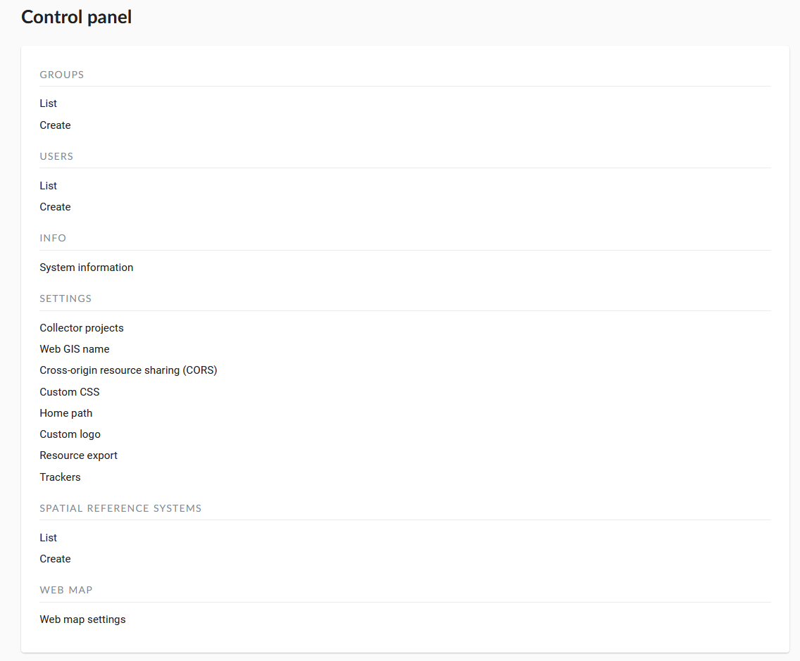

.. sectionauthor:: Artem Svetlov <artem.svetlov@nextgis.ru>

.. _ngw_admin_interface:

Administrator interface
================================

Home page
--------------------------------

After login to administrative interface the user is taken to the home page shown 
on  :numref:`admin_index_pic`.

.. figure:: _static/ngweb_main_page_administrative_interface_eng.png
   :name: admin_index_pic
   :align: center
   :width: 16cm

   Administrator interface home page.

   The numbers indicate: 1 - main menu; 2 - "Change the language" button; 3 – main resource group description; 4 - child resources; 5 - user permissions for main resource group; 6 - types of items that could be added to the main resource group; 7 - actions that could be performed with main resource group.

Home page includes a main menu pane, (see item 1 in :numref:`admin_index_pic`) which has the following links (see :numref:`ngweb_main_page_main_menu_pic`):

* Resources
* Control Panel
* Help
* Account

   Main menu.
 
Description pane (see item 3 in :numref:`admin_index_pic`) displays root group 
description (if available).

Child resources pane (see item 4 in :numref:`admin_index_pic`) contains a list 
of all resources placed in a root group. Pane displays information about display 
name, owner and contains an edit resource button.

User permissions pane (see item 5 in :numref:`admin_index_pic`) displays list of 
permissions the current user granted for the root group. Green and red marks indicate 
that user has/don't have corresponding permission. 

* A - allow
* D - deny
* M - mask (indirectly deny)
* E - empty (actually deny)

Possible permissions are the following:

* All
* Read
* View permissions
* Create
* Edit
* Manage permissions
* Delete

Actions pane (see items 6 and 7 in :numref:`admin_index_pic`) contains tools for adding
data and executing operations with root group.

In current version it is possible to add the following types of data (see item 6 in :numref:`admin_index_pic`):

* Basemap
* Lookup table
* PostGIS connection
* PostGIS layer
* Raster layer
* Resource group
* Vector layer
* Web Map
* WMS connection
* WMS layer
* WMS service

Possible operations are (see item 7 in :numref:`admin_index_pic`): 

* Delete
* Update 

Control panel
--------------------------------

NextGIS Web Control panel is available through the main menu (see item 1 in :numref:`admin_index_pic`), where you need to select "Control panel" (see :numref:`ngweb_main_page_main_menu_pic`). It is presented on  :numref:`admin_control_panel`.

   Control panel.

Control panel allows to execute the following actions:

* View user groups and user list
* Create user groups and users 
* Grant permissions to resource groups and web maps
* Set Web GIS name
* Input a list of possible sources for cross-origin resource sharing (CORS)

For more information about creation of user groups and users and granting 
permissions see topic :ref:`ngw_admin_tasks`.

Resource view
------------------

After login to administrative interface the user is taken to home page shown on 
:numref:`resource_group`.

.. figure:: _static/resource_group_eng.png
   :name: resource_group
   :align: center
   :width: 16cm

   Resource groups. 

The content of resource group is displayed after a click on resource name in a child resources pane of main resource group (see item 4 in :numref:`admin_index_pic`). On resource group page there is a pane with a list of resources in root group and user permissions pane.
Layer properties are displayed after a click on a name of a layer in child resources pane. E.g. user can click on a resource of type vector layer.

After a click on layer in child resources pane user is taken to a vector layer properties and attributes page (see  :numref:`options_resource_group`).

.. figure:: _static/options_resource_group_eng.png
   :name: options_resource_group
   :align: center
   :width: 16cm
 
   Vector layer parameters.

Feature table
-----------------

To view feature table after login navigate to a child resource group (see item 4 in :numref:`admin_index_pic`), where would be displayed resource types. Then select from child resources a resource with type vector layer and press the "Table" icon opposite the resource or select an action for a vector layer called "Feature table" in actions pane (see :numref:`admin_table_objects_upload`).

.. figure:: _static/feature_table_choice_eng.png
   :name: admin_table_objects_upload
   :align: center
   :width: 16cm

   Choice of feature table. 

Feature table allows to perform the following operations with a selected record  (see :numref:`admin_table_objects1_upload`):

1. Open
2. Edit
3. Delete
4. Use Search Box
 
.. figure:: _static/table_objects1_eng.png
   :name: admin_table_objects1_upload
   :align: center
   :width: 16cm

   Actions for the selected record in feature table.

There is another way to open Feature table. In the adminitrative interface navigate to a child resource group where would be displayed resource types and select a resource with a type web map. In actions pane click a web map action called Display (see :numref:`webmap_open_eng_pic`):

.. figure:: _static/webmap_open_eng.png
   :name: webmap_open_eng_pic
   :align: center
   :width: 16cm

   "Display" web map action.
   
A web map will be opened with a layer tree (left) and a map (right). To view a feature table select required layer in layer tree and then select "Feature table" command in Layer drop down menu at the top of layer tree :numref:`admin_map_and_tree_layers_upload`:

.. figure:: _static/map_and_tree_layers_eng.png
   :name: admin_map_and_tree_layers_upload
   :align: center
   :width: 16cm

   Map and layer tree.
 
A table will be displayed in a new tab. Table allows to perform the following operations with a selected record :numref:`admin_table_objects2_upload`:

1. Open
2. Edit
3. Delete
4. Go to (after a click the selected feature will be displayed on the map)
5. Use Search Box
 
.. figure:: _static/table_objects2_eng.png
   :name: admin_table_objects2_upload
   :align: center
   :width: 16cm

   Actions for the selected record in feature table.

Update resource
---------------

To edit a resource after login navigate to a child resource group (see item 4 in :numref:`admin_index_pic`), where would be displayed resource types. Then select from child resources a resource with type vector layer and press the "Pencil" icon opposite the resource or select the layer and then select an action called "Update" in actions pane (see :numref:`ngw_window_update_edit_resource`).
 
.. figure:: _static/ngw_window_update_edit_resource.png
   :name: ngw_window_update_edit_resource
   :align: center
   :width: 16cm

   Selection of "Update" action in action pane.

In opened window "Update resource" (see :numref:`ngw_window_update_resource1`) you can edit parent of the selected resource, add description, metadata and attributes of the resource.

.. figure:: _static/ngw_window_update_resource1_eng.png
   :name: ngw_window_update_resource1
   :align: center
   :width: 16cm

   "Update resource" window.

On the first tab "Resource" you can edit the next fields:

1. Display name (you can change the resource's name)
2. Keyname
3. Parent (you can change the resource group through moving the resource)
4. Type

You can move resources from one resource group to another after their creation too. To do it press Parent drop down menu and select resource group to move the resource to in "Select resource" window (see :numref:`ngw_resource_selection`). Then press OK and "Save" button.

.. figure:: _static/ngw_resource_selection_eng.png
   :name: ngw_resource_selection
   :align: center
   :width: 16cm

   "Select resource" window.

If the resource is moved successfully, the information about it appears in a new resource group and is replaced from the previous one.

The third tab "Description" allows to edit or delete a text or to add a new text and to save it after pressing "Save" button:  

.. figure:: _static/ngw_description_window_eng.png
   :name: ngw_description_window
   :align: center
   :width: 16cm
  
   "Description" tab.

The fourth tab "Metadata" allows to add and delete metadata, and to display them in a table using "Add" (Text, Integer, Float) and "Remove" operations:  

.. figure:: _static/ngw_metadata_tab_eng.png
   :name: ngw_metadata_tab
   :align: center
   :width: 16cm

   "Metadata" tab.

The table contains three columns: 

1. Key. It allows to describe metadata features (author, date, version etc.)
2. Type: Text, Integer, Float
3. Value. Value corresponds key type

The fifth tab "Attributes" contains a table with vector layer attributes (see :numref:`ngweb_admin_layers_attr`).

.. figure:: _static/admin_layers_attr_eng.png
   :name: ngweb_admin_layers_attr
   :align: center
   :width: 16cm

   "Attributes" tab.

* Tick in "FT" column means that the attribute is displayed in the identification window.
* Tick in "LA" column means that the attribute gives its name during the identification and forming of the tabs list.

For each field name you can set the corresponding pseudonym to use it for display in the identification window instead of the name.

.. figure:: _static/webmap_identification_eng.png
   :name: ngweb_webmap_identification
   :align: center
   :width: 16cm

   The identification window.

.. _ngw_attributes_edit:

Delete resource
---------------

Web GIS allows to delete uploaded data through deleting of the corresponding resources. 

To delete the resource after login navigate to a child resource group (see item 4 in :numref:`admin_index_pic`), where would be displayed resource types. Then select from child resources a resource with type vector layer and press the "Cross" icon opposite the resource or select the layer and then select an action called "Delete" in actions pane (see :numref:`ngw_window_update_delete_resource`). 

.. figure:: _static/ngw_window_update_delete_resource.png
   :name: ngw_window_update_delete_resource
   :align: center
   :width: 16cm

   Selection of "Delete" action in action pane
   
In the opened "Delete resource" window (see :numref:`ngw_deletion_resource`) you need to tick "Confirm deletion of the resource" and press "Delete" button. 

.. figure:: _static/ngw_deletion_resource_eng.png
   :name: ngw_deletion_resource
   :align: center
   :width: 16cm

   Delete resource.

If the resource was deleted successfully, the information about it disappear in the corresponding resource group.

Data export to CSV and GeoJSON formats
---------------------------------------
  
Web GIS allows to download/export data in CSV and GeoJSON formats.

To download data after login navigate to a child resource group (see item 4 in :numref:`admin_index_pic`), where would be displayed resource types. Then select from child resources a resource with type vector layer or PostGIS layer you need to export and select an action called "Download as GeoJSON" or "Download as CSV" in actions pane "Vector layer" (see :numref:`ngweb_data_export`).

.. figure:: _static/ngweb_data_export_eng.png
   :name: ngweb_data_export
   :align: center
   :width: 16cm

   Data export to CSV and GeoJSON formats.
 
