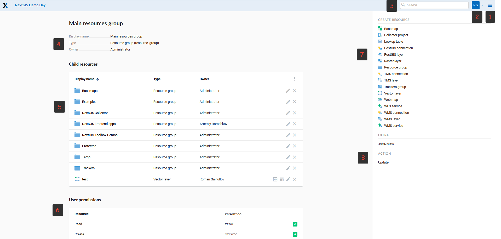
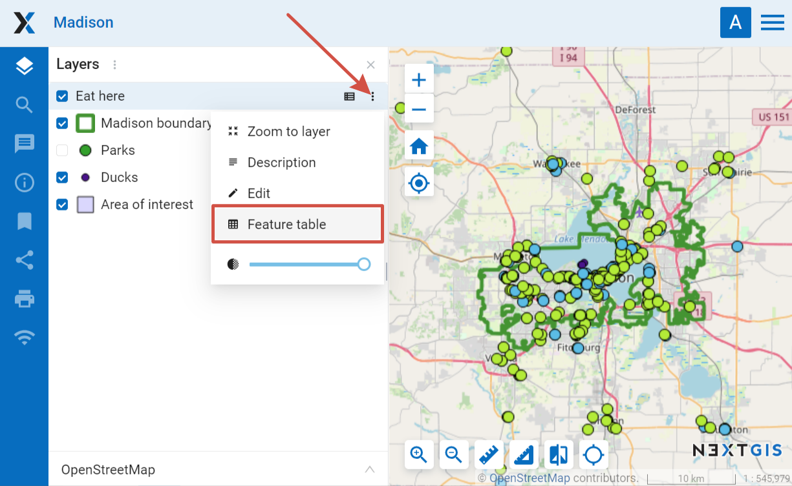
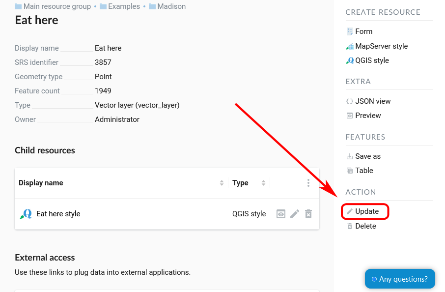
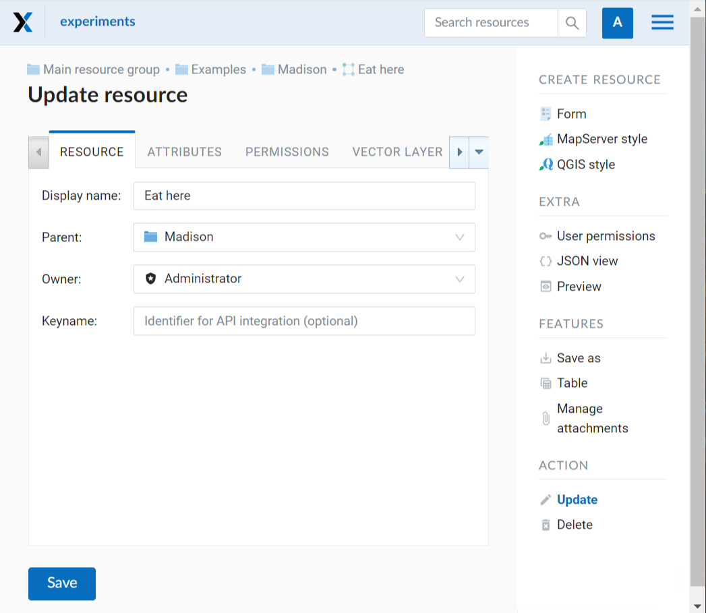
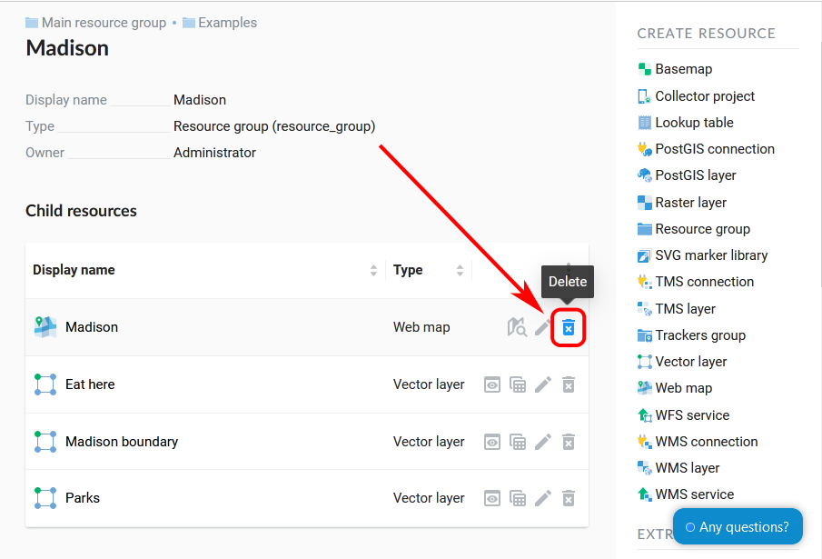
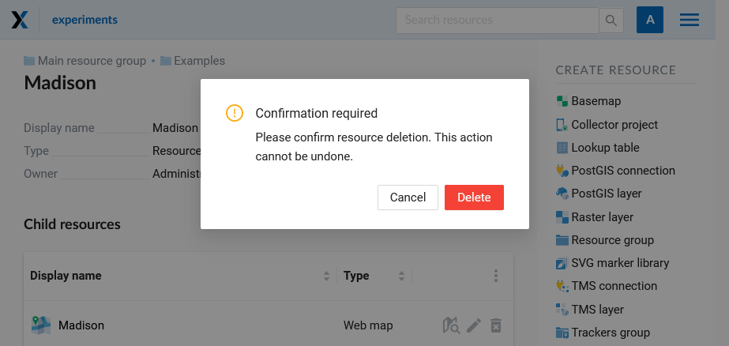
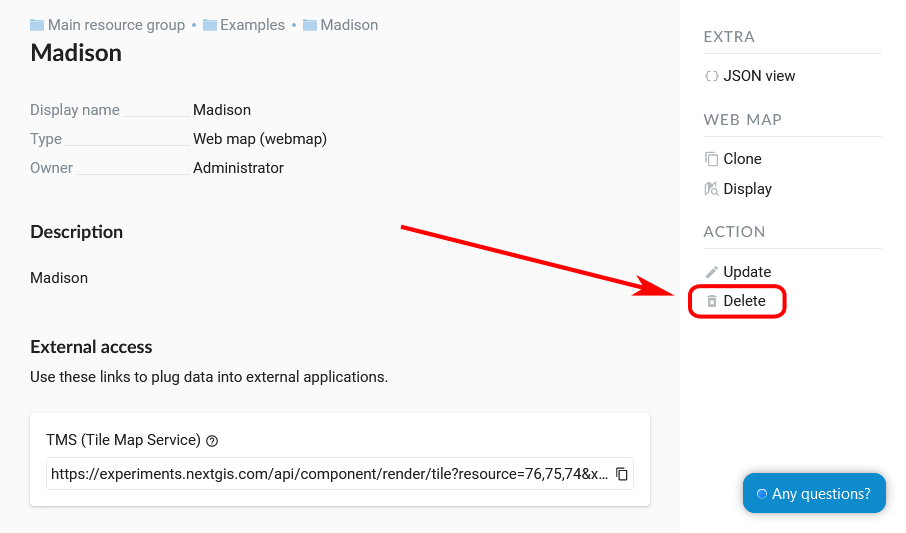
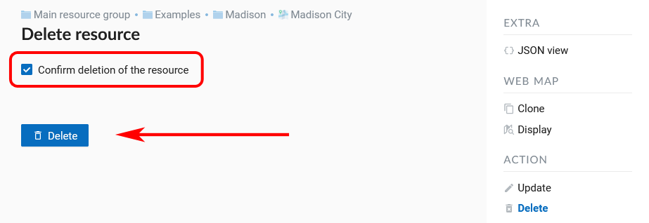
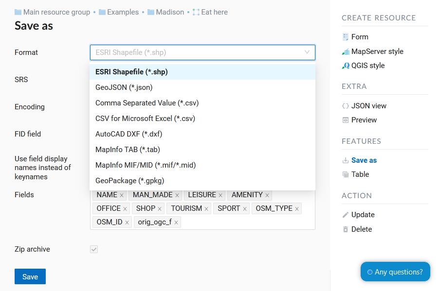

.. sectionauthor:: Artem Svetlov <artem.svetlov@nextgis.ru>
.. sectionauthor:: Roman Gainullov <roman.gainullov@nextgis.com>

.. _ngw_admin_interface:

Administrator interface (Admin console)
=========================================

Authorization
-----------

To open the admin console, open the Web GIS and press "Sign in" in the top right corner.

   
   Signing in from Web GIS main page

In the opened dialog press the blue button that reads **Sign in with NextGIS ID**.

   
   Selecting sign-in via NextGIS

You will be redirected to my.nextgis.com authorization page. Enter your username or email you used for registration and your password. 

   
   Signing in with NextGIS

After the authorization is completed successfully you will be redirected back to the Web GIS.

.. _ngw_home_page:

Home page
--------------------------------

After login to administrative interface the user is taken to the home page shown 
on :numref:`admin_index_pic`

   Administrator interface home page

   The numbers indicate: 1 - Main menu; 2 - User settings (Exit and Change language); 3 - Resource search bar in Web GIS 4 – Main resource group description; 5 - Child resources; 6 - User permissions for main resource group; 7 - Types of items that could be added to the main resource group; 8 - Actions that could be performed with main resource group

Home page includes a main menu pane, (see item 1 in :numref:`admin_index_pic`) which has the following links (see :numref:`ngweb_main_page_main_menu_pic`):

* Resources
* Control Panel
* Help
* Account

   Main menu in NextGIS Web
 
Description pane (see item 4 in :numref:`admin_index_pic`) displays a main group description (if available).

Child resources pane (see item 5 in :numref:`admin_index_pic`) contains a list of all resources placed in a main group.
In the form of a table, the parameters such as name, type and owner of the resource are available.
At the same time there are buttons of different actions over resources (edit, delete, preview, open the attribute table).

User permissions pane (see item 6 in :numref:`admin_index_pic`) displays list of permissions the current user granted for the current group.
Green and red marks indicate that user has/don't have corresponding permission. 

* A - allow
* D - deny
* M - mask (indirectly deny)
* E - empty (actually deny)

Possible permissions are the following:

* All
* Read
* View permissions
* Create
* Update (Edit)
* Delete
* Manage children
* Change permissions

Actions pane (see items 7 and 8 in :numref:`admin_index_pic`) contains tools for adding data and executing operations with the root group.

In current version it is possible to add the following types of data:

* Basemap
* Collector project
* Lookup table
* PostGIS connection
* PostGIS layer
* Raster layer
* Resource group
* TMS connection
* TMS layer
* Trackers group
* Vector layer
* Web Map
* WFS service
* WMS connection
* WMS layer
* WMS service

Depending on your NGW version may also be connected:

* SVG marker library
* 3D model
* 3D scene
* 3D tileset

Possible operations are (see item 8 in :numref:`admin_index_pic`): 

* Update 
* Delete

.. _ngw_control_panel:

Control panel
--------------------------------

NextGIS Web Control panel is available through the main menu (see item 1 in :numref:`admin_index_pic`), where you need to select "Control panel" (see :numref:`ngweb_main_page_main_menu_pic`). It is presented on  :numref:`admin_control_panel`.

   Control panel

Control panel allows to execute the following actions:

* Manage NextGIS Web groups and users
* Display information about the system and storage
* Access cadaster services
* Create user accounts for Collector projects
* Set the name of your Web GIS
* Configure CORS
* Set CSS styles
* Specify NGW start page (home path)
* Set Logo (in the upper left corner)
* Customize a type of users who have permission to export data
* Customize Tracking
* Customize Web Map
* Add spacial reference systems

For more information about creation of user groups and users and granting 
permissions see topic :ref:`ngw_admin_tasks`.

.. _ngw_view_resource:

Resource view
------------------

After login to administrative interface the user is taken to home page shown on :numref:`resource_group`.

   Resource groups

To open a resource group and view the contents, click on it in the child resource pane.

Resource parameters are displayed after a click on the name of the resource in the list. User is taken to a page containing properties, attributes, user permissions, a link for external access and a list of child resources if there are any (see  :numref:`resource_details_pic`).

 
   Vector layer parameters

.. _ngw_feature_table:

Feature table
-----------------

Some resources contain a set of features that can be viewed as a table.
Press the "Table" icon opposite the resource name or select an action for a vector layer called "Table" in the features pane.

.. figure:: _static/feature_table_choice_from_group_en.png
   :name: feature_table_choice_from_group_pic
   :align: center
   :width: 20cm

   Opening feature table from the resource list

   Opening feature table from the resource page

Feature table allows to perform the following operations with a selected feature  (see :numref:`admin_table_objects1_upload`):

1. Open
2. Edit (in a new tab or in the same tab)
3. Delete
4. Save as (advanced or quick export available)
5. Use Search Box
6. Refresh the table
7. Open table settings

   Actions for the selected feature in the feature table

There is another way to open Feature table. In the adminitrative interface navigate to a child resource group where resource types are marked and find a resource with a type Web Map. Open it by clicking on the "Display" icon (see :numref:`webmap_open_from_group_pic`):

   Opening a Web Map from the list

Alternatively, you can go to the resource page and click "Display" in the Web Map actions pane on the right.

   Opening a Web Map from the resouce page

A Web Map will be opened with a layer tree (left) and a map (right). To view a feature table select the required layer in layer tree and then select "Feature table" command in the Layer drop down menu at the top of layer tree :numref:`admin_map_and_tree_layers_upload`:

   Opening feature table from the map
 
A table will be displayed in a new tab. Table allows to perform the following operations with the selected feature  :numref:`admin_table_objects2_upload`:

1. Open in a new tab
2. Edit 
3. Delete
4. Go to (after a click the selected feature will be displayed on the map)
5. Save as (advanced or quick export available)
6. Zoom to filtered features
7. Filter features by area
5. Use Search Box
6. Refresh the table
7. Open table settings

 

   Actions for the selected record in feature table

.. _ngw_feature_table_filter_area:

Filter layer features on the Web Map by area
~~~~~~~~~~~~~~~~~~~~~~~~~~~~~~~~~~

NextGIS Web has a tool in the Feature table that filters all layer features within a selected area. To choose area limits just draw them on the Web Map.

Open the feature table and click on the button with a dotted frame. In the dropdown menu select the geometry of the area:

* circle (click twice on the map, to choose the center of the circle and its size, the radius length is shown in meters)
* line (features intersected by the line will be filtered)
* rectangle (click on diagonally opposite apexes)
* free-hand drawn polygon (each click creates an apex, the area covered by the polygon is highlighted; to finish the shape, double-click on an apex, the polygon will be completed automatically)

   Selecting filter geometry

Now the feature table only contains the features within the selected area. The tool button will have the current area shape on it. In the dropdown menu you can use one of the following options:

* Show/Hide the outline and fill of the selected area
* Zoom to the filtering area
* Clear filtering geometry

   Filter actions

You can use quick export to save the filtered features in a variety of common geodata formats. Click **Save as** and select in the dropdown menu Quick export with default settings or Advanced export to modify parameters (see detailed description below).

.. _ngw_update_resource:

Update resource
---------------

In the group page press the pencil icon opposite the resource.

.. figure:: _static/ngw_update_resource_from_group_en.png
   :name: ngw_update_resource_from_group_pic
   :align: center
   :width: 20cm

Alternatively, open the resource properties page and then select "Update" in the actions pane (see :numref:`ngw_window_update_edit_resource`).
 

   Selection of "Update" action in the actions pane

In opened window "Update resource" (see :numref:`ngw_window_update_resource1`) you can edit parent of the selected resource, add description, metadata and attributes of the resource.

   "Update resource" window

On the first tab "Resource" you can edit the next fields:

1. Display name (you can change the resource's name)
2. Parent (you can change the resource group through moving the resource)
3. Owner
4. Keyname

You can move resources from one resource group to another. To do it press the arrow at the end of the Parent field and select resource group to move the resource to in the pop-up window (see :numref:`ngw_resource_selection`). Then press **OK** and **Save** button.

.. figure:: _static/ngw_resource_selection_eng_3.png
   :name: ngw_resource_selection
   :align: center
   :width: 20cm

   Folder selection window

If the resource is moved successfully, the information about it appears in the new resource group and is removed from the previous one.

If in the selected folder there is already a resource with the same name as the one you want to transfer, it will not be moved and the following message will appear:

.. figure:: _static/parent_change_name_not_unique_en.png
   :name: parent_change_name_not_unique_pic
   :align: center
   :width: 20cm

   Alert in case if the name is not unique

Close the alert window, change the name of the resource and try to change the parent again.

The tab "Description" allows to add text, links and images describing the resource.

.. figure:: _static/ngw_description_window_eng_3.png
   :name: ngw_description_window
   :align: center
   :width: 20cm
  
   "Description" tab

The tab "Metadata" allows to add and delete metadata, and to display them in a table using "Add" (Text, Integer, Float) and "Remove" operations:  

.. figure:: _static/ngw_metadata_tab_eng_3.png
   :name: ngw_metadata_tab
   :align: center
   :width: 16cm

   "Metadata" tab

The table contains three columns: 

1. Key. It allows to describe metadata features (author, date, version etc.)
2. Type: String, Numer, Boolean, Empty (if you select "Empty", the value field will be cleared)
3. Value. Value corresponds to the key type

The tab "Attributes" contains a table with vector layer attributes (see :numref:`ngweb_admin_layers_attr`).

   "Attributes" tab

* Tick in "FT" column means that the attribute is displayed in the identification window.
* Tick in "LA" column means that the attribute is used for bookmarks.

For each field name you can set the display name to use it in the identification window instead of the keyname.

.. figure:: _static/webmap_identification_eng_2.png
   :name: ngweb_webmap_identification
   :align: center
   :width: 20cm

   The identification window

.. _ngw_attributes_edit:

Delete resource
---------------

Web GIS allows to delete uploaded data through deleting of the corresponding resources. 

In the group page press the cross icon opposite the resource.

   
   Deleting resource from the group

A pop-up window for confirmation will appear. Click **Delete** to confirm.

   
   Confirmation to delete a resource

Alternatively, open the resource page and then select "Delete" in the actions pane (see :numref:`ngw_window_update_delete_resource`). 

   Selection of "Delete" action in the action pane
   
In the opened "Delete resource" window you need to tick "Confirm deletion of the resource" and press **Delete** button. 

   "Delete resource" window

If the resource was deleted successfully, the information about it disappear from the corresponding resource group.

Deleting several resources at once
~~~~~~~~~~~~~~~~~~~~~~~~~~~~~~~

In the parent resource open the child resources list menu and enable multiple selection.

Tick the resources and select "Delete" from the same menu. Confirm the operation in the pop-up window.

.. figure:: _static/delete_selected_multiple_en.png
   :name: delete_selected_multiple_pic
   :align: center
   :width: 20cm
   
   Deleting multiple resources

.. _ngw_vector_export:

Data export
-----------------
  
NextGIS Web allows you to export data in the following formats:

* :term:`GeoJSON`
* :term:`CSV`
* CSV for Microsoft Excel
* :term:`ESRI Shapefile`
* AutoCAD DXF
* Mapinfo TAB
* MapInfo MIF/MID
* :term:`GeoPackage`

While exporting to some formats additional files are created, for example CSVT (field description) and PRJ (projection description) for CSV, CPG (code page) for ESRI Shapefile.

To export data:

#. Open a Vector or PostGIS layer, the data of which you want to export;
#. Select the item: menuselection: `Features -> Save As` on the right pane :ref:` web interface <ngw_admin_interface> `;
#. Specify the format and encoding of the data and select fields to be exported;
#. If necessary, you can compress the result into a ZIP archive (for a number of formats this is the default setting);
#. Save the file to your device.

   
   Selecting "Save as" action to export data

   Data export in various formats

