.. sectionauthor:: Artem Svetlov <artem.svetlov@nextgis.ru>
.. sectionauthor:: Dmitry Baryshnikov <dmitry.baryshnikov@nextgis.ru>
.. sectionauthor:: Roman Gainullov <roman.gainullov@nextgis.com>

.. _ngw_admin_tasks:

Administrative tasks
===================

.. _ngw_change_lang:

Language change
---------------

Any user can switch the interface language.
To do this, in the upper right corner on the user icon, go to the "Settings" section (:numref:`admin_select_lang_pic`).

.. figure:: _static/admin_settings_lang_en.png
   :name: admin_settings_lang_pic
   :align: center
   :width: 10cm

   Go to Settings bar

The following languages are available for selection (:numref:`admin_settings_lang_pic`)

* Default browser
* Russian
* English
* Italian
* Spanish
* German
* Portuguese
* French
* Czech

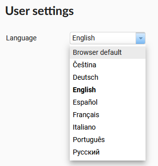

   Selecting language

.. _ngw_search_bar:

Resource search
---------------

For easy search for resources and navigation, there is a search bar in the top bar (:numref:`admin_search_bar_pic`).
The search is carried out in the entire existing database, regardless of which directory the user is currently in.

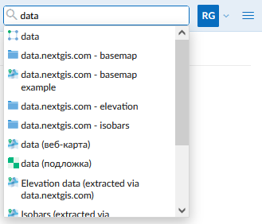

   Finding Resources in Web GIS

.. _ngw_create_group:

Create new user group
---------------------

A dialog for creation of a new user group presented on  :numref:`ngweb_admin_controlpanel_usergroup_create_pic`
To open this window select "Control panel" (see :numref:`ngweb_main_page_main_menu_pic`) in the main menu (see item 1 in :numref:`admin_index_pic`). In control panel (see :numref:`admin_control_panel`) select "Create" option in "Groups" block.

.. figure:: _static/admin_controlpanel_usergroup_create_eng.png
   :name: ngweb_admin_controlpanel_usergroup_create_pic
   :align: center
   :width: 16cm

   "Create new group" dialog

In "Create new group" dialog enter full name and group name (short name), if necessary enter a group description, set group members and click "Create" button. 

.. note:: 
   A name for a group should contain only letters and numbers. 

Create new user
---------------

A dialog for creation of a new user is presented on :numref:`admin_controlpanel_user_create`. 
To open this window select "Control panel" (see :numref:`ngweb_main_page_main_menu_pic`) in the main menu (see item 1 in :numref:`admin_index_pic`). In control panel (see :numref:`admin_control_panel`) select "Create" option in "Users" block.

.. figure:: _static/admin_controlpanel_user_create_eng.png
   :name: admin_controlpanel_user_create
   :align: center
   :width: 16cm

   "Create new user" dialog
   
In "Create new user" dialog enter the following information:

* Full user name (e.g. John Smith)
* Login – user login (e.g. smith)
* Password
* Group(-s) user belongs to (the list of available groups is provided below user info. If the required group is absent you need to create a new one (see  :ref:`ngw_create_group`)).

Then click "Create" button.

.. note:: 
   The password is limited in length in the range of 5-25 characters. Login can have symbols of the Latin alphabet, numbers and an underscore, but must begin necessarily with a letter.

.. _ngw_access_rights:
    
Access management
-----------------

NextGIS Web is resource based so each component (layer, group, service) is a resource. NextGIS Web provides extended settings for resource access permissions.

Permissions could be set during resource creation (see. :ref:`ngw_create_layers`), 
or using resource update (see. :ref:`ngw_change_layers`) To manage permissions use a "Permissions" tab in create/update resource dialog (see. :numref:`ngweb_access_rights_tab`)

.. figure:: _static/access_rights_tab.png
   :name: ngweb_access_rights_tab
   :align: center
   :width: 10cm
   
   Permissions tab for resource

You can grant, revoke and update permissions using this tab. You can grant different permissions to a single resource for different users and/or groups.
A dialog with permission item settings is presented on fig.  :numref:`ngweb_access_rights_dialog`.

.. figure:: _static/access_rights_dialog.png
   :name: ngweb_access_rights_dialog
   :align: center
   :width: 10cm
   
   Permission item settings dialog

A dialog has the following elements:
    
* Action
* Principal
* Permission
* Resource
* Propagate

**Action** defines the kind of the rule - allow or deny.

.. note:: By default everything is denied.

**Principal** - a user or a user group who is subject to a rule.

Besides standard users created by administrator, system has special system users:

* administrator - Web GIS user which has administrative rights
* owner - Web GIS user which created a particular resource
* guest - Web GIS user which is accessing a particular resource without being authentificated (not logged in)
* authenticated - authenticated Web GIS user under any account (but not guest)
* everyone - all users including guests and authenticated

Besides standard groups created by administrator, system has special system user groups:

* Administrators - a group whose users have administrative rights
* Editors - a group, whose users do not have access to the control panel, but can create, edit and manage data

Adding users to this groups is a convenient way to set appropriate permissions across the whole system. These groups can't be removed.

**Permission** - defines allowed or denied action with the resource. There are the following types of permissions: 

* All resources: All permissions
* Resource: All permissions
* Resource: Manage children
* Resource: Change permissions
* Resource: Read
* Resource: Create
* Resource: Update
* Resource: Delete
* Service: All permissions
* Service: Connect
* Service: Configure
* Data structure: All permissions
* Data structure: Write
* Data structure: Read
* Connection: All permissions
* Connection: Write
* Connection: Read
* Connection: Connect
* Web map: All permissions
* Web map: Edit annotations
* Web map: View annotations
* Web map: Display
* Collector: All permissions
* Collector: Read
* Data: All permissions
* Data: Write
* Data: Read
* Metadata: All permissions
* Metadata: Write
* Metadata: Read

**Resource** - type of resource the rule created for. This setting is important for resource groups where it is required to grant permissions only to some types of resources. If there is no need to grant different permissions to different types of resources, select "All resources" for this setting.

**Propagate** checkbox defines if permission rules need to be applied to resources in sub-groups or not. Note, that setting permissions for lower level resource and propagating doesn't cancel the need to set them for upward resources. For example, if you gave read access to a resource group that is contained by other groups, but you didn't give appropriate permissions for higher level resources (up to root) the user will not get access to current resource group.

Permissions could be assigned to resources indirectly. For example permission "Web map: Display" could be assigned for a resource group and if a "Propagate" checkbox is checked this rule will be applied to every web map inside this resource group and inside all the subgroups.

Here is a description for available permission types.

**All resources: All permissions** - allows or denies any actions with resources.

**Resource: All permissions** - allows or denies any actions with resources excluding resource groups.

**Resource: Manage children** - allows or denies update of child resources settings. 
 
**Resource: Change permissions** - allows or denies access permissions management for a resource.

**Resource: Read** - allows or denies reading of resources.

**Resource: Create** - allows or denies creation of resources.

**Resource: Update** - allows or denies modification of resources.

**Resource: Delete** - allows or denies deletion of resources.

**Service: All permissions** - allows or denies any actions with a service.

**Service: Connect** - allows or denies connections to a service.

**Service: Configure** - allows or denies modification of service setiings.

**Data structure: All permissions** - allows or denies any actions with data structure.

**Data structure: Write** - allows or denies modification of data structure.

**Data structure: Read** - allows or denies reading of the data structure.

**Connection: All permissions** - allows or denies any actions with connections.

**Connection: Write** - allows or denies modification of connections.

**Connection: Read** - allows or denies reading of connection parameters.

**Connection: Connect** - allows or denies usage of connection (defines if layers and data from the connection will be available for a user).

**Web map: All permissions** - allows or denies any actions with a web map.

**Web map: Display** - allows or denies display of a web map.

**Data: All permissions** - allows or denies any actions with data.

**Data: Write** - allows or denies data modification.

**Data: Read** - allows or denies reading of data.

**Metadata: All permissions** - allows or denies any actions with metadata.

**Metadata: Write** - allows or denies modification of metadata.

**Metadata: Read** - allows or denies reading of metadata.

When you assign rights to a particular resource take into account the rights of its constituent resources. For example to provide access to a WMS service you should grant the following permissions:
    
* Service: Connect - to a connection itself.
* Resource: Read - to all resources (vector and raster layers)  
  published with WMS service.
* Data structure: Read - to all resources (vector and raster layers) 
  published with WMS service.
* Data: Read - to all resources (vector and raster layers) 
  published with WMS service.

If you have a complex system with several maps and different users who should work with these maps you can create user groups. You can assign different permissions to every group.

Example: Assigning permissions
------------------------------

Close a group for guests, open it for the user
~~~~~~~~~~~~~~~~~~~~~~~~~~~~~~~~~~~~~~~~~~~~~~

.. figure:: _static/access_rights_group_for_quest_1_eng.png
   :name: ngweb_access_rights_tab_0_pic
   :align: center
   :width: 16cm

   Settings for resourse group.

.. figure:: _static/access_rights_group_for_quest_2_eng.png
   :name: ngweb_access_rights_tab_0_pic
   :align: center
   :width: 16cm

   Settings for root resource group.

You can also allow the user reading all higher resource groups as alternative. 

Grant guest user resource display permission
~~~~~~~~~~~~~~~~~~~~~~~~~~~~~~~~~~~~~~~~~~~~

.. note:: 
	Guest users will be able to see administrative interface and view all folders excluding especially closed ones.

.. figure:: _static/access_rights_group_for_quest_0_eng.png
   :name: ngweb_access_rights_tab_0_pic
   :align: center
   :width: 16cm

   Settings for root resource group.

.. figure:: _static/access_rights_group_for_quest_webmaps_eng.png
   :name: ngweb_access_rights_tab_1_pic
   :align: center
   :width: 16cm

   Settings for resourse group with maps.

.. figure:: _static/access_rights_group_for_quest_geodata_eng.png
   :name: ngweb_access_rights_tab_2_pic
   :align: center
   :width: 16cm

   Settings for resource group with geodata.

   
Grant guest user web map display permission
~~~~~~~~~~~~~~~~~~~~~~~~~~~~~~~~~~~~~~~~~~~~

.. note:: 
   Guest users will be able to see only a web map with layers

.. figure:: _static/Case2_Main_resource_group.png
   :name: Case2_Main resource group
   :align: center
   :width: 16cm

   Settings for main resource group

.. figure:: _static/Case2_mapfolder.png
   :name: Case2_mapfolder
   :align: center
   :width: 16cm

   Settings for resourse group with maps

.. figure:: _static/Case2_datafolder.png
   :name: Case2_datafolder
   :align: center
   :width: 16cm

   Settings for resource group with geodata

It is important to note that parent resources (if any) also need read permissions for the guest (see. :numref:`Case2_permissions`)
If there aren't rights to 'read' resource, then the data propagated to it will also be impossible to read.

.. figure:: _static/Case2_permissions.png
   :name: Case2_permissions
   :align: center
   :width: 16cm

   Set in other resource groups

Grant a single user permissions to a single resource group
~~~~~~~~~~~~~~~~~~~~~~~~~~~~~~~~~~~~~~~~~~~~~~~~~~~~~~~~~~~~

.. figure:: _static/access_rights_group_for_user_1.png
   :name: ngweb_access_rights_tab_3_pic
   :align: center
   :width: 16cm

   Settings for a resource group

.. figure:: _static/access_rights_group_for_user_2.png
   :name: ngweb_access_rights_tab_4_pic
   :align: center
   :width: 16cm

   Settings for root resource group

Grant a permission to input data using a mobile application to a group of users
~~~~~~~~~~~~~~~~~~~~~~~~~~~~~~~~~~~~~~~~~~~~~~~~~~~~~~~~~~~~~~~~~~~~~~~~~~~~~~~~

Create a separate group of users ("Contributors" in this example) and a separate resource group.  

.. figure:: _static/access_rights_group_for_mobile_import_1.png
   :name: ngweb_access_rights_tab_mobile_import_1_pic
   :align: center
   :width: 16cm

   Settings for a resource group.

.. figure:: _static/access_rights_group_for_mobile_import_2.png
   :name: ngweb_access_rights_tab_mobile_import_2_pic
   :align: center
   :width: 16cm

   Settings for root resource group.

Disallow view of webmap to all not authendificated users, grant view to authendificated users
~~~~~~~~~~~~~~~~~~~~~~~~~~~~~~~~~~~~~~~~~~~~~~~~~~~~~~~~~~~~~~~~~~~~~~~~~~~~~~~~~~~~~~~~~~~~~~~~~~
  

.. figure:: _static/access_rights_deny_webmap_guests_allow_logined.png
   :name: access_rights_deny_webmap_guests_allow_logined_pic
   :align: center
   :width: 16cm

    Settings for webmap.

Disallow all access for guest users (without password)
~~~~~~~~~~~~~~~~~~~~~~~~~~~~~~~~~~~~~~~~~~~~~~~~~~~~~~~~~~~~~~~~~~~~~~~~~~~~~~~~~~~~~~~~~~~~~~~~~~
  

.. figure:: _static/access_rights_deny_all.png
   :name: access_rights_deny_all
   :align: center
   :width: 16cm

    Settings for root resource group.

.. _ngw_change_password:

Update user password
--------------------

To update user password you can use administrative interface. To do it select "Control panel" (see :numref:`ngweb_main_page_main_menu_pic`) in the main menu (see item 1 in :numref:`admin_index_pic`). In control panel (see :numref:`admin_control_panel`) select "List" option in "Users" block and click pencil icon near the user you want to update password for  (see :numref:`ngweb_change_password_pic`). In opened window in "Password" field fill in a new password and click "Save" button.

.. figure:: _static/ngweb_change_password_eng.png
   :name: ngweb_change_password_pic
   :align: center
   :width: 16cm

   User editting window
   

Also there is an option to change user password using command line:

.. warning:: Setting a password using a command line is not safe.

.. code:: bash

  env/bin/nextgisweb --config config.ini change_password user password
  env/bin/nextgisweb --config config.ini change_password user password

.. note:: 
   The password is limited in length in the range of 5-25 characters.

.. _ngw_storage:

Storage
--------

The "Storage" section contains information about the volume of data loaded into Web GIS depending on their type.
The space usage estimate is located below the main table.
The administrator can forcibly recalculate the amount of storage (for example - immediately after loading big data, if the system has not yet recalculated the occupied space on its own).

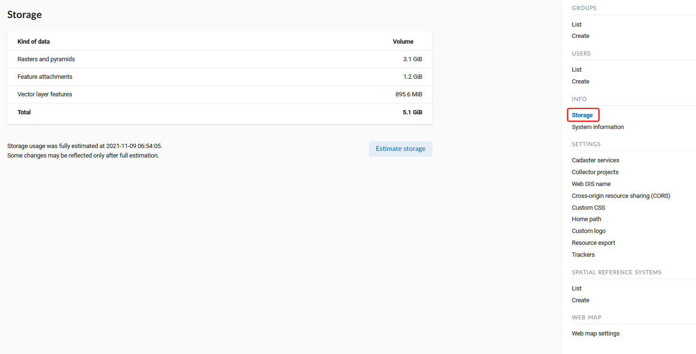

   Storage section

.. _ngw_backups:

Backups
-------

In this section you can see a list of available NextGIS Web backups, as well as download any of them.
The process of creating backups and restoring for developers is described in `this section <https://docs.nextgis.ru/docs_ngweb_dev/doc/admin/backup_restore.html>`_.

.. _ngw_system_info:

System information
------------------

Through the control panel, the administrator can view information about the system and the current version of the platform (see :numref:`admin_system_info_rus_eng`). Using the icon in the upper right corner, you can copy all this data to the clipboard.

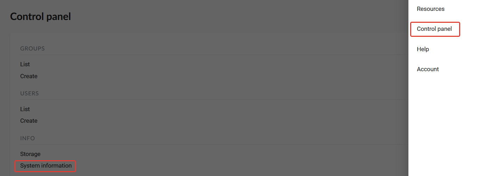

   System information section in the control panel

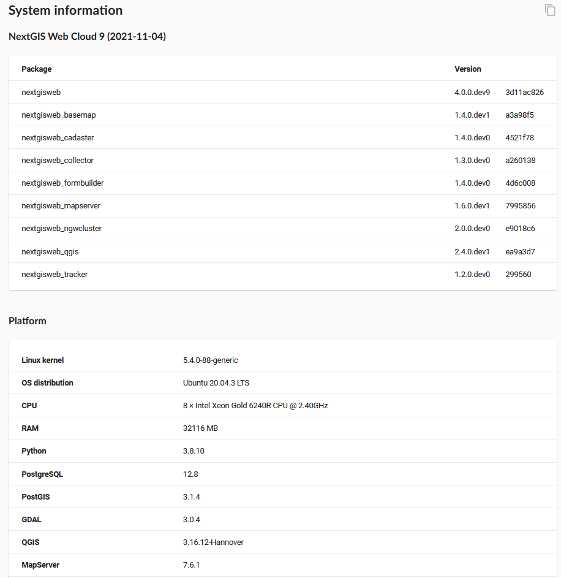

   System and platform information

.. _ngw_res_export:

Resource export
------------------

This function shows in the Web GIS interface the ability to export (save) data only for those categories of users that are selected from the list below. 

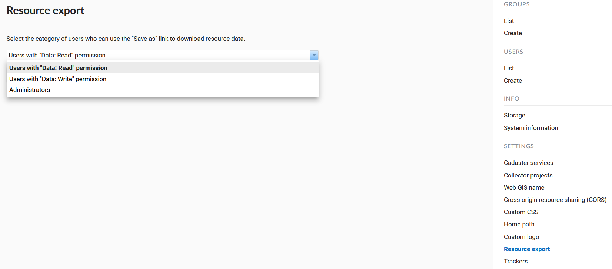

   Selecting a category of users entitled to export data

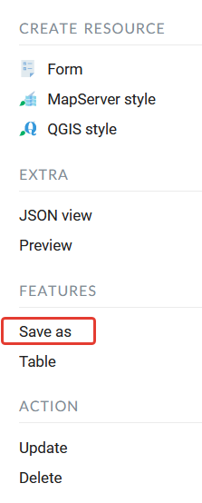

   Data export

The Data Export function can be seen either only by administrators or by users with the right to:

- Reading data
- Writing data

All other users will not be able to save data from the Web GIS interface.

.. note:: 
   This setting does not in any way affect the ability to receive data through the `REST API <https://docs.nextgis.com/docs_ngweb_dev/doc/developer/toc.html>`_ in accordance with the set `permissions <https://docs.nextgis.com/docs_ngweb/source/admin_tasks.html#access-management>`_ to them.

.. _ngw_contr_panel_webmap_settings:

Web Map Settings
----------------

Using the control panel administrator can set a number of general settings for all web maps in NextGIS Web:

* Identification popup
* Measurement parameters
* Address search parameters

.. figure:: _static/admin_webmap_panel_settings_eng.png
   :name: admin_webmap_panel_settings_eng
   :align: center
   :width: 15cm

   Web Map Settings Page

.. _ngw_contr_panel_webmap_ident:

Identify popup
~~~~~~~~~~~~~~~

The section regulates two parameters:

* Size of the pop-up window when identifying objects on the web map;
* The radius of the area around the object within which the identification works.

Dimensions are in pixels.

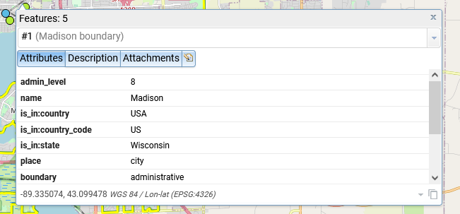

   Object identification on the web map

At the same time you can turn on/off the display of feature attributes.

.. _ngw_contr_panel_webmap_measure:

Measurement
~~~~~~~~~~~

The section sets the parameters responsible for various measurements on the web map:

* Units of length measurement (according to the selected SRS)
* Units of measurement of areas (in accordance with the selected SRS)
* Degree format
* Coordinate system for calculating measurements

.. _ngw_contr_panel_webmap_search:

Address search
~~~~~~~~~~~~~~

* "Enable" - the search results on the web map will include not only the attribute data but also the address base if there are matches
* "Limit by web map initial extent" - the search will be performed within the extent set in the web map settings

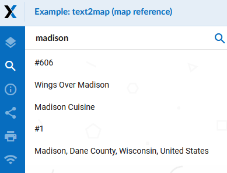

   Web map search

.. _ngw_CSS:

Customization of NextGIS Web outlook
------------------------------------

You can customize the look of NextGIS Web, including logos, backgrounds, header and buttons colors etc. To do it select "Control panel" (see :numref:`ngweb_main_page_main_menu_pic`) in the main menu (see item 1 in :numref:`admin_index_pic`). In control panel (see :numref:`admin_control_panel`) select "Custom CSS" in "Settings" block. In opened tab enter your own :term:`CSS` rules. They will be used throughout your Web GIS on all its pages.

Custom CSS examples
--------------------

Change header color
~~~~~~~~~~~~~~~~~~~

.. code-block:: bash

    .header{background-color: #F44336; color: #fff;}

Remove NextGIS logo from Web map
~~~~~~~~~~~~~~~~~~~~~~~~~~~~~~~~

.. code-block:: bash

    .map-logo{display:none;}
    
Remove social networks sharing buttons
~~~~~~~~~~~~~~~~~~~~~~~~~~~~~~~~~~~~~~~~~~~~

.. code-block:: bash

    div.social-links {display:none;}
    
    Remove hamburger button	
~~~~~~~~~~~~~~~~~~~~~~~~~~~~~~~~

.. code-block:: css
	
	span#rightMenuIcon {display:none;}
	
For return it back - open control panel by url http://username.nextgis.com/control-panel

Remove login button in upper right corner
~~~~~~~~~~~~~~~~~~~~~~~~~~~~~~~~~~~~~~~~~~~~~~~~~~

.. code-block:: css
	
	ui.header-nav header__right {display:none;}
    
Remove identification window header
~~~~~~~~~~~~~~~~~~~~~~~~~~~~~~~~~~~
Identification window is a popup that is shown when you click on a feature on a Web map. This setting will hide it's header and layer selector:

.. code-block:: css

	div.ngwPopup__content div div.dijitAlignTop,
        div.ngwPopup__features span.ngwWebmapToolIdentify-controller {
            display: none;
        }

Advanced example
~~~~~~~~~~~~~~~~

This example shows how to change the look of pretty much all changeable elements of NextGIS Web. 
You can try these examples as is or change it to your liking. You can also see them in action `here <http://nastya.nextgis.com>`_.

.. code-block:: bash

	/* Base background */

	body{
	  background-color: #fff;
	  background-image:url("https://nextgis.ru/img/hypnotize_transparent.png");
	}

	/* Header text and background color */

	.header{
	  background-color: #F44336;
	  color: #fff;
	}

	/* Separator color between logo and title */

	.header__title-logo{
	  border-right: 1px solid rgba(255,255,255,.48) !important;
	}

	/* User info color in header */

	.user-avatar__label{
	  background-color: #fff !important;
	  color: #F44336 !important;
	}

	.user-avatar .user-avatar__icon{
	  color: rgba(255,255,255,.82) !important;
	}

	/* Primary button */

	.dijitButton--primary{
	  background-color: #fff !important;
	  color:#f44336 !important;
	  font-weight: bold !important;
	  border: 2px solid #f44336 !important;
	}

	.dijitButton--primary:hover{
	  background-color: #f44336 !important;
	  color: #fff !important;
	}

	/* Default button */

	.dijitButton--default{
	  background-color: #fff !important;
	  color:#999 !important;
	  font-weight: bold !important;
	  border: 2px solid #999 !important;
	}

	.dijitButton--default:hover{
	  background-color: #999 !important;
	  color: #fff !important;
	}

	/* Tabs color */

	.dijitTabContainerTop-tabs .dijitTabChecked{
	  border-top-color: #f44336 !important;
	}

	/* Left navigation panel on the map */

	.navigation-menu{
	  background-color: #fff !important;
	  border-right: 1px solid rgba(0,0,0,.12) !important;
	  color: #000 !important;
	}

Customize NextGIS UI Elements (White label)
----------------------------------------

White label is a special module that allows you to remove or replace NextGIS logos and names with your company logos and names. The module is purchased and installed separately. The module adds a new section to the Control Panel (см. :numref:`Control_panel_whitelabel`), which allows you to disable or override various interface elements mentioning NextGIS.

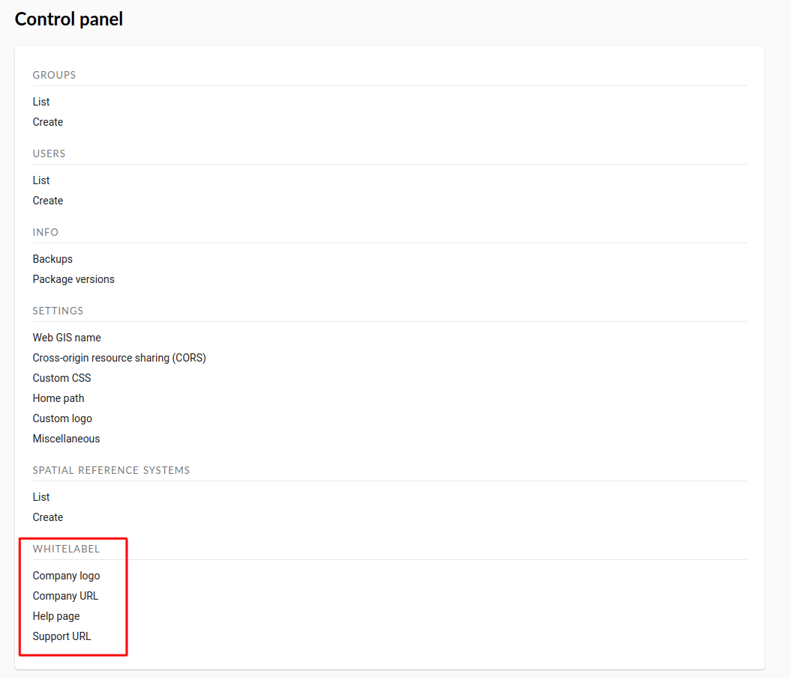
   
   'White label' module in control panel

Company logo on Web map
~~~~~~~~~~~~~~~~~~~~~~~

In Control Panel, you can upload your logo in PNG format (see in:numref:`logo_whitelabel_en`) to display in the lower right corner of the map.

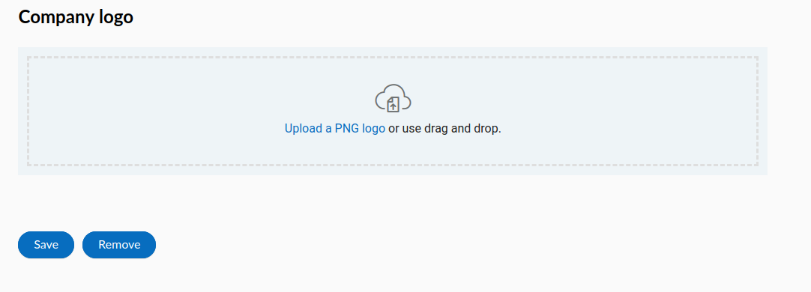

   Upload company logo file

If the file is not loaded, there is no logo (see in:numref:`web-map_logo`).

.. figure:: _static/web-map_logo.png
   :name: web-map_logo
   :align: center
   :width: 25cm

   Web map with NextGIS logo (left) and without logo (right)
  
  
Company URL
~~~~~~~~~~~
  
You can assigned a new hyperlink for a company website to a just added logo (см. :numref:`url-logo_en`)

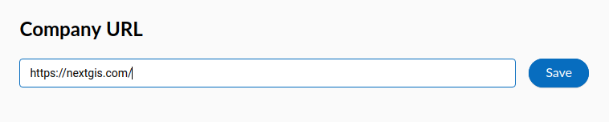

   Company URL
 
 
Help page
~~~~~~~~~
By default, help leads to http://nextgis.com/help/. You can set a different hyperlink (see in :numref: `help_whitelabel_en`) to 'Help' (see in :numref:`help_link_en`).

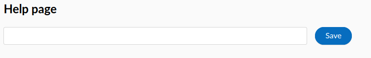

   Reroute a link to 'help'

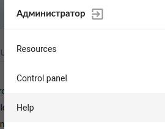

   'Help' in the menu

Support URL
~~~~~~~~~~~

Also you can set URL for the technical support page (see in :numref:`tech_support`).

This link will appear on error messages:

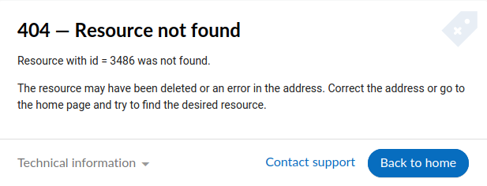
   
   Support URL in the interface
 
 
 Other items
~~~~~~~~~~~~~~~~~

* The default Web GIS name is specified without mentioning NextGIS.
* In WMS and WFS services resources, **NextGIS QGIS** is replaced with **QGIS**(см. :numref:`WMS_WFS_whitelabel`).

.. figure:: _static/WMS_WFS_whitelabel.png
   :name: WMS_WFS_whitelabel
   :align: center
   :width: 25cm

   Replacing *NextGIS QGIS* (left) with *QGIS* (right) in WMS and WFS services
   
* The social networks preview mentioning NextGIS is removed (см. :numref:`Preview_maplinks`).

.. figure:: _static/Preview_maplinks.png
   :name: Preview_maplinks
   :align: center
   :width: 25cm

   Hiding the mention of *NextGIS QGIS* in web GIS links
