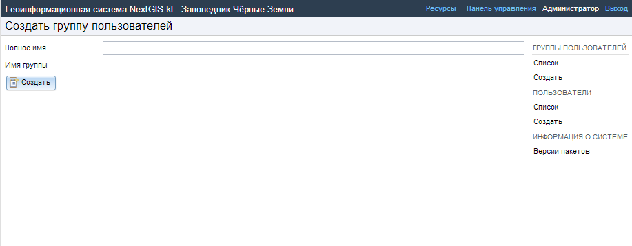

.. sectionauthor:: Artem Svetlov <artem.svetlov@nextgis.ru>
.. sectionauthor:: Dmitry Baryshnikov <dmitry.baryshnikov@nextgis.ru>

.. _ngw_admin_tasks:

Administrator tasks
================================

.. _ngw_create_group:

Creation of a new user group
----------------------------

A dialog for creation of a new user group presented on  :numref:`ngweb_admin_controlpanel_usergroup_create_pic`. 
This window could be opened from Control panel 
(see  :numref:`admin_control_panel`). To open the window click : 
:menuselection:`Groups --> Create`.

   Create new group dialog.

In create new group dialog enter full name, group name (short name) and click a button  :guilabel:`Create`. Also you can enter a description for a user group. 

.. note:: 
   A name for a group should contain only letters and numbers. 

Creation of a new user
----------------------

A dialog for creation of a new user is presented on :numref:`admin_controlpanel_user_create`. 
This window could be opened from Control panel 
(see  :numref:`admin_control_panel`). To open the window click: 
:menuselection:`Users --> Create`.

Enter the following information:

* Full name (e.g. Ivanov Ivan Ivanovich)
* Login – user login (e.g. ivanov)
* Password

Then select groups user belongs to. The list of available groups is provided below user info. If the required group is absent you need to create a new one 
(see  :ref:`ngw_create_group`).

Then click a button :guilabel:`Create`.

.. figure:: _static/admin_controlpanel_user_create.png
   :name: admin_controlpanel_user_create
   :align: center
   :width: 16cm

   Create new user dialog.

.. _ngw_access_rights:
    
Setting permissions
----------------------

NextGIS Web is resource based so each component (layer, group, service) is a resource. NextGIS Web provides extended settings for resource access permissions.

Permissions could be set during resource creation (see. :ref:`ngw_create_layers`), 
or using resource update (see. :ref:`ngw_change_layers`). To manage permissions use a "Permissions" tab in create/update resource dialog (see. :numref:`ngweb_access_rights_tab`).

.. figure:: _static/access_rights_tab.png
   :name: ngweb_access_rights_tab
   :align: center
   :width: 10cm
   
   Permissions tab for resource.

You can grant, revoke and update permissions using this tab. You can grant different permissions to a single resource for different users and/or groups.
A dialog with permission item settings is presented on fig.  :numref:`ngweb_access_rights_dialog`.

.. figure:: _static/access_rights_dialog.png
   :name: ngweb_access_rights_dialog
   :align: center
   :width: 10cm
   
   Permission item settings dialog.

A dialog has the following elements:
    
* Action
* Principal
* Permission
* Resource
* Propagate

**Action** defines the kind of the rule - allow or deny.

.. note:: By default everything is denied.

**Principal** - a user or a user group who are subject to a rule.

Permission - defines allowed or denied actions with the resource. There are the following available types of permissions: 

* All resources: All permissions
* Resource: All permissions
* Resource: Manage children
* Resource: Change permissions
* Resource: Read
* Resource: Create
* Resource: Update
* Resource: Delete
* Service: All permissions
* Service: Connect
* Service: Configure
* Data structure: All permissions
* Data structure: Write
* Data structure: Read
* Connection: All permissions
* Connection: Write
* Connection: Read
* Connection: Connect
* Web map: All permissions
* Web map: Display
* Data: All permissions
* Data: Write
* Data: Read
* Metadata: All permissions
* Metadata: Write
* Metadata: Read

**Resource** - type of resource the rule created for. This setting is important for resource groups where it is required to grant permissions only to some types of resources. If there is no need to grant different permissions to different types of resources, select "All resources" for this setting.

**Propagate** checkbox defines if permission rules need to be applied to resources in sub-groups or not. Note: Setting permissions for lower level resource and propagating doesn't cancel the need to set them for upward resources. For example, if you gave read access to a resource group that is contained by other groups, but you didn't give appropriate permissions for higher level resources (up to root) the user will not get access to current resource group.

Permissions could be assigned to resources indirectly. For example permission "Web map: Display" could be assigned for a resource group and if a "Propagate" checkbox is checked this rule will be applied to every web map inside this resource group and inside all the subgroups.

Here is a description for available permission types.

**All resources: All permissions** - allows or denies any actions with resources.

**Resource: All permissions** - allows or denies any actions with resources excluding resource groups.

**Resource: Manage children** - allows or denies update of child resources settings. 
 
**Resource: Change permissions** - allows or denies access permissions management for a resource.

**Resource: Read** - allows or denies reading of resources.

**Resource: Create** - allows or denies creation of resources.

**Resource: Update** - allows or denies modification of resources.

**Resource: Delete** - allows or denies deletion of resources.

**Service: All permissions** - allows or denies any actions with a service.

**Service: Connect** - allows or denies connections to a service.

**Service: Configure** - allows or denies modification of service setiings.

**Data structure: All permissions** - allows or denies any actions with data structure.

**Data structure: Write** - allows or denies modification of data structure.

**Data structure: Read** - allows or denies reading of the data structure.

**Connection: All permissions** - allows or denies any actions with connections.

**Connection: Write** - allows or denies modification of connections.

**Connection: Read** - allows or denies reading of connection parameters.

**Connection: Connect** - allows or denies usage of connection (defines if layers and data from the connection will be available for a user).

**Web map: All permissions** - allows or denies any actions with a web map.

**Web map: Display** - allows or denies display of a web map.

**Data: All permissions** - allows or denies any actions with data.

**Data: Write** - allows or denies data modification.

**Data: Read** - allows or denies reading of data.

**Metadata: All permissions** - allows or denies any actions with metadata.

**Metadata: Write** - allows or denies modification of metadata.

**Metadata: Read** - allows or denies reading of metadata.

When you assign rights to a particular resource take into account the rights of its constituent resources. For example to provide access to a WMS service you should grant the following permissions:
    
* Service: Connect - to a connection itself.
* Resource: Read - to every resource (vector and raster layers)  
  published with WMS service.
* Data structure: Read - to every resource (vector and raster layers) 
  published with WMS service.
* Data: Read - to every resource (vector and raster layers) 
  published with WMS service.

If you have a complex system with several maps and different users who should work with these maps you can create user groups. You can assign different permissions to every group.

Example: Assigning permissions
------------------------------

Grant guest user web map display permission
~~~~~~~~~~~~~~~~~~~~~~~~~~~~~~~~~~~~~~~~~~~~

.. note:: 
	Guest users will be able to see administrative interface and view all folders excluding especially closed ones.

.. figure:: _static/access_rights_group_for_quest_0.png
   :name: ngweb_access_rights_tab_0_pic
   :align: center
   :width: 16cm

   Settings for root resource group.

.. figure:: _static/access_rights_group_for_quest_webmaps.png
   :name: ngweb_access_rights_tab_1_pic
   :align: center
   :width: 16cm

   Settings for resourse group with maps.

.. figure:: _static/access_rights_group_for_quest_geodata.png
   :name: ngweb_access_rights_tab_2_pic
   :align: center
   :width: 16cm

   Settings for resource group with geodata.

Grant a single user permissions to a single resource group
~~~~~~~~~~~~~~~~~~~~~~~~~~~~~~~~~~~~~~~~~~~~~~~~~~~~~~~~~~~~

.. figure:: _static/access_rights_group_for_user_1.png
   :name: ngweb_access_rights_tab_3_pic
   :align: center
   :width: 16cm

   Settings for a resource group.

.. figure:: _static/access_rights_group_for_user_2.png
   :name: ngweb_access_rights_tab_4_pic
   :align: center
   :width: 16cm

   Settings for root resource group.

Grant a permission to input data using a mobile application to a group of users
~~~~~~~~~~~~~~~~~~~~~~~~~~~~~~~~~~~~~~~~~~~~~~~~~~~~~~~~~~~~~~~~~~~~~~~~~~~~~~~~

Create a separate group of users ("Contributors" in this example) and a separate resource group.  

.. figure:: _static/access_rights_group_for_mobile_import_1.png
   :name: ngweb_access_rights_tab_mobile_import_1_pic
   :align: center
   :width: 16cm

   Settings for a resource group.

.. figure:: _static/access_rights_group_for_mobile_import_2.png
   :name: ngweb_access_rights_tab_mobile_import_2_pic
   :align: center
   :width: 16cm

   Settings for root resource group.

.. _ngw_change_password:

Update of user password
-----------------------------

To update user password you can use a web interface.
Also there is an option to change user password using command line:

.. note:: Setting a password using a command line is not safe.

.. code:: bash

  env/bin/nextgisweb --config config.ini change_password user password
  env/bin/nextgisweb --config config.ini change_password user password

.. _ngw_CSS:

Customization of NextGIS Web outlook
---------------------------------------

You can customize the look of NextGIS Web, including logos, backgrounds, header and buttons colors etc., with a little bit of CSS magic:

#. Sign in as the user with administrative privileges and open Control panel, then select Custom CSS. 
#. Enter your own CSS rules. They will be used throughout your Web GIS on all its pages.

Custom CSS examples
--------------------

Change header color:
~~~~~~~~~~~~~~~~~~~~~

.. code-block:: bash

    .header{background-color: #F44336; color: #fff;}

Remove NextGIS logo from Web map:
~~~~~~~~~~~~~~~~~~~~~~~~~~~~~~~~~~~~

.. code-block:: bash

    .map-logo{display:none;}

Advanced example
~~~~~~~~~~~~~~~~~~

This example shows how to change the look of pretty much all changeable elements of NextGIS Web. 
You can try these examples as is or change it to your liking. You can also see them in action `here <http://nastya.nextgis.com>`_.

.. code-block:: bash

	/* Base background */

	body{
	  background-color: #fff;
	  background-image:url("https://nextgis.ru/img/hypnotize_transparent.png");
	}

	/* Header text and background color */

	.header{
	  background-color: #F44336;
	  color: #fff;
	}

	/* Separator color between logo and title */

	.header__title-logo{
	  border-right: 1px solid rgba(255,255,255,.48) !important;
	}

	/* User info color in header */

	.user-avatar__label{
	  background-color: #fff !important;
	  color: #F44336 !important;
	}

	.user-avatar .user-avatar__icon{
	  color: rgba(255,255,255,.82) !important;
	}

	/* Primary button */

	.dijitButton--primary{
	  background-color: #fff !important;
	  color:#f44336 !important;
	  font-weight: bold !important;
	  border: 2px solid #f44336 !important;
	}

	.dijitButton--primary:hover{
	  background-color: #f44336 !important;
	  color: #fff !important;
	}

	/* Default button */

	.dijitButton--default{
	  background-color: #fff !important;
	  color:#999 !important;
	  font-weight: bold !important;
	  border: 2px solid #999 !important;
	}

	.dijitButton--default:hover{
	  background-color: #999 !important;
	  color: #fff !important;
	}

	/* Tabs color */

	.dijitTabContainerTop-tabs .dijitTabChecked{
	  border-top-color: #f44336 !important;
	}

	/* Left navigation panel on the map */

	.navigation-menu{
	  background-color: #fff !important;
	  border-right: 1px solid rgba(0,0,0,.12) !important;
	  color: #000 !important;
	}
