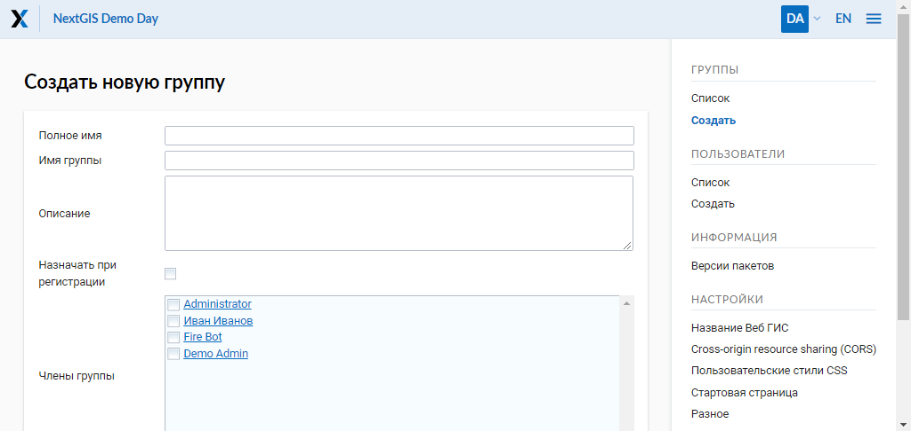
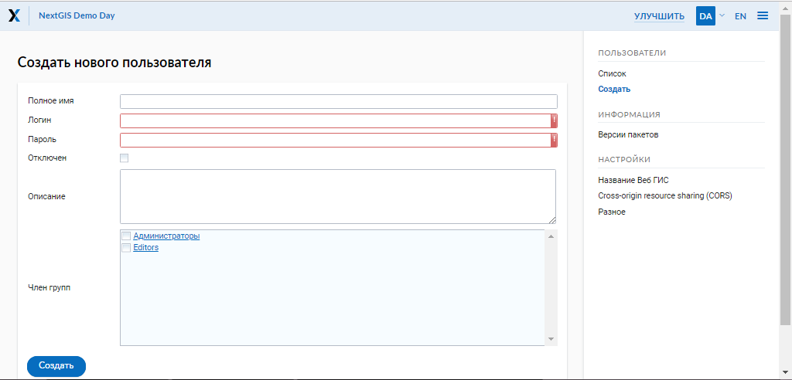
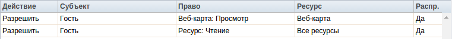
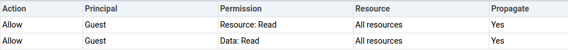
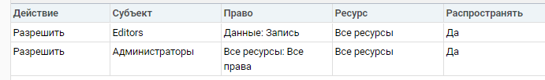
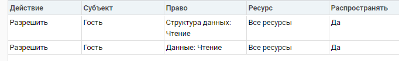
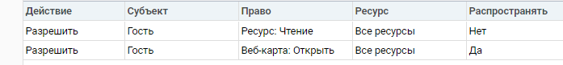

.. sectionauthor:: Артём Светлов <artem.svetlov@nextgis.ru>
.. sectionauthor:: Дмитрий Барышников <dmitry.baryshnikov@nextgis.ru>

.. _ngw_admin_tasks:

Административные задачи
=======================

.. _ngw_change_lang:

Переключение языка
----------------------------

Администратор может переключать язык интерфейса. Для открытия этого окна необходимо в верхнем правом углу экрана администраторского интерфейса нажать кнопку "RU"/"EN".

.. _ngw_create_group:

Создание групп пользователей
----------------------------

Диалог создания новой группы пользователей представлен на :numref:`ngweb_admin_controlpanel_usergroup_create_pic`. 
Для открытия этого окна необходимо в основном меню (см. :numref:`ngweb_main_page_administrative_interface_pic`, п.1) выбрать пункт "Панель управления" (см. :numref:`ngweb_main_page_main_menu_pic`). На Панели управления (см. :numref:`ngweb_control_panel`) следует выбрать команду "Создать" в подпункте "Группы".

   Окно создания новой группы.

В диалоге необходимо указать полное и краткое наименование группы, при необходимости ввести описание группы, указать членов данной группы и нажать кнопку "Создать". 

.. note:: 
   Название группы должно содержать только цифры и буквы. 

Создание пользователя
---------------------

Диалог создания нового пользователя представлен на :numref:`ngweb_admin_controlpanel_user_create`. 
Для открытия этого окна необходимо в основном меню (см. :numref:`ngweb_main_page_administrative_interface_pic`, п.1) открыть панель управления (см. :numref:`ngweb_main_page_main_menu_pic`) и выбрать команду "Создать" в подпункте "Пользователи".

   Окно создания пользователя
   
В диалоге необходимо указать:

* Полное имя пользователя (например, Иванов Иван Иванович)
* Имя пользователя – логин (например, ivanov)
* Пароль для входа
* Группа(-ы), к которым относится пользователь (в списке будут отображены имеющиеся группы. Если необходимой группы в списке нет, то ее необходимо предварительно создать (см. :ref:`ngw_create_group`)).

Далее необходимо нажать кнопку "Создать".

.. _ngw_access_rights:
    
Настройка прав доступа
----------------------

NextGIS Web строится на ресурсном подходе - каждый компонент системы (слой, 
группа, сервис) является ресурсом. NextGIS Web обладает расширенными настройками 
прав доступа к ресурсам.

Права доступа можно назначить как при создании ресурса (см. :ref:`ngw_create_layers`), 
так и при его изменении (см. :ref:`ngw_change_layers`). Для этого в диалоге 
создания/изменения ресурс необходимо перейти на вкладку 
"Права доступа" (см. :numref:`ngweb_access_rights_tab`).

.. figure:: _static/access_rights_tab_rus.png
   :name: ngweb_access_rights_tab
   :align: center
   :width: 10cm
   
   Вкладка настроек прав доступа

В данной вкладке можно назначать, отменять или изменять права доступа. Для одного
ресурса могут быть назначены различные права доступа пользователей и/или групп.
Диалог настроек правил доступа представлен на рис. :numref:`ngweb_access_rights_dialog`.

.. figure:: _static/access_rights_dialog.png
   :name: ngweb_access_rights_dialog
   :align: center
   :width: 10cm
   
   Диалог настроек правил доступа

Диалог включает в себя следующие элементы:
    
* Действие.
* Субъект.
* Право.
* Ресурс.
* Распространять.

**Действие** определяет типы правила - запрещающее или разрешающее.

.. note:: По умолчанию все запрещено.

**Субъект** - пользователь или группа, на которых распространяется правило.

**Право** - определяет разрешенные или запрещенные действия с ресурсом. Существуют 
следующие виды прав: 

* Все ресурсы: Все права
* Ресурс: Все права
* Ресурс: Управление дочерними ресурсами
* Ресурс: Управление правами доступа
* Ресурс: Чтение
* Ресурс: Создать
* Ресурс: Изменить
* Ресурс: Удалить
* Сервис: Все права
* Сервис: Соединение
* Сервис: Конфигурация
* Структура данных: Все права
* Структура данных: Запись
* Структура данных: Чтение
* Соединение: Все права
* Соединение: Запись
* Соединение: Чтение
* Соединение: Соединение
* Веб-карта: Все права
* Веб-карта: Открыть
* Данные: Все права
* Данные: Запись
* Данные: Чтение
* Метаданные: Все права
* Метаданные: Запись
* Метаданные: Чтение

**Ресурс** определяет, на какие ресурсы распространять права. Это актуально для группы ресурсов, 
где необходимо назначить права определенным типам ресурсов. Если нет необходимости 
в выборе типов ресурсов или все ресурсы в группе одинаковые, то необходимо проставить "Все 
ресурсы".

Чекбокс "**Распространять**" определяет, распространять ли правило на ресурсы в 
подгруппы или нет. Обратите внимание, что установка прав на ресурс нижнего уровня, 
и распространение их не отменяет необходимости устанавливать их на ресурсы верхнего уровня. 
Например, дав доступ на чтение на группу ресурсов вложенную в другие группы, но не дав 
соответствующих прав на группы верхнего уровня относительно текущей, вплоть до корневого ресурса, 
пользователь не получит доступа к подпапке.

Права могут назначаться даже ресурсам, которым они не соответствуют явно. Например,
право "Веб-карта: Просмотр" может быть назначено ресурсу Группа ресурсов, и, если включен
переключатель "Распространять", то право будет применено ко всем веб-картам
в данной группе и подгруппах.

Рассмотрим права подробнее.

**Все ресурсы: Все права** - разрешает или запрещает любые действия с ресурсами.

**Ресурс: Все права** - разрешает или запрещает любые действия с ресурсами, за
исключением групп ресурсов.

**Ресурс: Управление дочерними ресурсами** - разрешает или запрещает изменение 
настроек дочерних ресурсов. 
 
**Ресурс: Управление правами доступа** - разрешает или запрещает управлять правами
доступа к ресурсу.

**Ресурс: Чтение** - разрешает или запрещает чтение ресурсов.

**Ресурс: Создать** - разрешает или запрещает создание ресурсов.

**Ресурс: Изменить** - разрешает или запрещает модифицировать ресурсы.

**Ресурс: Удалить** - разрешает или запрещает удалять ресурсы.

**Сервис: Все права** - разрешает или запрещает любые действия с сервисом.

**Сервис: Соединение** - разрешает или запрещает выполнять подключения к сервису.

**Сервис: Конфигурация** - разрешает или запрещает изменять настройки сервиса.

**Структура данных: Все права** - разрешает или запрещает любые действия со 
структурой данных.

**Структура данных: Запись** - разрешает или запрещает изменять структуру данных.

**Структура данных: Чтение** - разрешает или запрещает чтение структуры данных.

**Соединение: Все права** - разрешает или запрещает любые действия с соединениями.

**Соединение: Запись** - разрешает или запрещает 
модифицировать соединения.

**Соединение: Чтение** - разрешает или запрещает чтение 
параметров соединения.

**Соединение: Соединение** - разрешает или запрещает использовать 
соединение (будут ли доступны пользователю слои или данные из соединения).

**Веб-карта: Все права** - разрешает или запрещает любые действия над веб-картой.

**Веб-карта: Открыть** - разрешает или запрещает просмотр веб-карты.

**Данные: Все права** - разрешает или запрещает любые действия над данными.

**Данные: Запись** - разрешает или запрещает модификацию данных.

**Данные: Чтение** - разрешает или запрещает чтение данных.

**Метаданные: Все права** - разрешает или запрещает любые действия над 
метаданными.

**Метаданные: Запись** - разрешает или запрещает модифицировать метаданные.

**Метаданные: Чтение** - разрешает или запрещает читать метаданные.

При назначении прав на тот или иной ресурс следует учитывать права на составляющие 
его ресурсы. Например, для предоставления доступа к WMS сервису необходимо дать 
следующие права:
    
* Сервис: Соединение - разрешение на само подключение.
* Ресурс: Чтение - разрешение на все ресурсы (векторные и растровые слои), 
  опубликованные в WMS сервисе.
* Структура данных: Чтение - разрешение на все ресурсы (векторные и растровые слои),
  опубликованные в WMS сервисе.
* Данные: Чтение - разрешение на все ресурсы (векторные и растровые слои),
  опубликованные в WMS сервисе.

При наличии сложной системы с несколькими отдельными картами, с которой должны 
работать разные пользователи, можно создать группы пользователей. Для групп 
можно настраивать права доступа по отдельности.

Примеры настроек прав доступа
-----------------------------

Закрыть группу для гостей, открыть для специального пользователя
~~~~~~~~~~~~~~~~~~~~~~~~~~~~~~~~~~~~~~~~~~~~~~~~~~~~~~~~~~~~~~~~~

.. figure:: _static/access_rights_group_for_quest_1_rus.png
   :name: ngweb_access_rights_tab_0_pic
   :align: center
   :width: 16cm

   Задать в свойствах группы ресурсов.

.. figure:: _static/access_rights_group_for_quest_2_rus.png
   :name: ngweb_access_rights_tab_0_pic
   :align: center
   :width: 16cm

   Задать в свойствах корневой группы ресурсов

В качестве альтернативы можно разрешить этому пользователю чтение на все вышестоящие группы ресурсов. 

Дать гостю права на просмотр ресурсов
~~~~~~~~~~~~~~~~~~~~~~~~~~~~~~~~~~

.. note:: 
   Гости будут иметь возможность видеть административный интерфейс и ходить по всем папкам, кроме специально закрытых для просмотра.

.. figure:: _static/access_rights_group_for_quest_0.png
   :name: ngweb_access_rights_tab_0_pic
   :align: center
   :width: 16cm

   Задать в свойствах корневой группы ресурсов

   Задать в свойствах группы ресурсов с веб-картами

   Задать в свойствах группы ресурсов с геоданными

Дать гостю права на просмотр карты
~~~~~~~~~~~~~~~~~~~~~~~~~~~~~~~~~~

.. note:: 
   Гости смогут видеть веб-карту со слоями данными.

   Задать в свойствах корневой группы ресурсов

   Задать в свойствах группы ресурсов с веб-картами

   Задать в свойствах группы ресурсов с геоданными.

Дать одному пользователю права на одну группу ресурсов
~~~~~~~~~~~~~~~~~~~~~~~~~~~~~~~~~~~~~~~~~~~~~~~~~~~~~~

.. figure:: _static/access_rights_group_for_user_1.png
   :name: ngweb_access_rights_tab_3_pic
   :align: center
   :width: 16cm

   Задать в свойствах группы ресурсов

.. figure:: _static/access_rights_group_for_user_2_rus.png
   :name: ngweb_access_rights_tab_4_pic
   :align: center
   :width: 16cm

   Задать в свойствах корневой группы ресурсов

Дать группе пользователей право на ввод данных через мобильное приложение
~~~~~~~~~~~~~~~~~~~~~~~~~~~~~~~~~~~~~~~~~~~~~~~~~~~~~~~~~~~~~~~~~~~~~~~~~~~~~~~~

Создать отдельную группу пользователей (в примере - "Openstreetmap users") и отдельную группу ресурсов.  

.. figure:: _static/access_rights_group_for_mobile_import_1.png
   :name: ngweb_access_rights_tab_mobile_import_1_pic
   :align: center
   :width: 16cm

   Задать в свойствах группы ресурсов

.. figure:: _static/access_rights_group_for_mobile_import_2.png
   :name: ngweb_access_rights_tab_mobile_import_2_pic
   :align: center
   :width: 16cm

   Задать в свойствах корневой группы ресурсов

Закрыть просмотр веб-карты всем кто не залогинился, разрешить тем кто залогинился
~~~~~~~~~~~~~~~~~~~~~~~~~~~~~~~~~~~~~~~~~~~~~~~~~~~~~~~~~~~~~~~~~~~~~~~~~~~~~~~~~~~~~~
  

.. figure:: _static/access_rights_deny_webmap_guests_allow_logined_rus.png
   :name: access_rights_deny_webmap_guests_allow_logined_pic
   :align: center
   :width: 16cm

   Задать в свойствах веб-карты.
   
Закрыть доступ ко всей системе гостям (тем, кто без пароля)
~~~~~~~~~~~~~~~~~~~~~~~~~~~~~~~~~~~~~~~~~~~~~~~~~~~~~~~~~~~~~~~~~~~~~~~~~~~~~~~~~~~~~~
  

.. figure:: _static/access_rights_deny_all_rus.png
   :name: access_rights_deny_all
   :align: center
   :width: 16cm

   Задать в свойствах корневой группы ресурсов

.. _ngw_change_password:

Изменение пароля пользователя
-----------------------------

Для смены пароля пользователя можно воспользоваться административным интерфейсом. Для этого необходимо в основном меню (см. :numref:`ngweb_main_page_administrative_interface_pic`, п.1) выбрать пункт "Панель управления" (см. :numref:`ngweb_main_page_main_menu_pic`). На Панели управления (см. :numref:`ngweb_control_panel`) следует выбрать команду "Список" в подпункте "Пользователи" и нажать на иконку в виде карандаша напротив пользователя, для которого необходимо сменить пароль (см. :numref:`ngweb_change_password_pic`). В открывшемся окне в поле "Пароль" ввести новый пароль. После ввода нового пароля следует нажать на кнопку "Сохранить".

.. figure:: _static/ngweb_change_password_rus.png
   :name: ngweb_change_password_pic
   :align: center
   :width: 16cm

   Окно редактирования пользователя

Также существует возможность изменить пароль пользователя из командной строки:

.. warning:: Указание нового пароля пользователя в командной строке потенциально небезопасно.

.. code-block:: shell

  env/bin/nextgisweb --config config.ini change_password user password
  env/bin/nextgisweb --config config.ini change_password user password

.. _ngw_CSS:

Настройка внешнего вида интерфейса
-----------------------------------

Можно изменять внешний вид NextGIS Web. Внешний вид включает: логотипы, цвета шапки, фона, кнопок и других элементов. Для этого необходимо в основном меню (см. :numref:`ngweb_main_page_administrative_interface_pic`, п.1) выбрать пункт "Панель управления" (см. :numref:`ngweb_main_page_main_menu_pic`). На Панели управления (см. :numref:`ngweb_control_panel`) следует выбрать команду "Пользовательские стили CSS" в подпункте "Настройки". В открывшейся вкладке можно задать собственные стили :term:`CSS`, которые будут использованы для оформления всех страниц Веб ГИС. 

Примеры настроек внешнего вида интерфейса
-------------------------------------------

Изменить цвет шапки:
~~~~~~~~~~~~~~~~~~~~

.. code-block:: css

	.header{background-color: #F44336; color: #fff;}

Убрать логотип NextGIS с карты:
~~~~~~~~~~~~~~~~~~~~~~~~~~~~~~~~

.. code-block:: css

	.map-logo{display:none;}

Убрать логотип NextGIS из шапки:
~~~~~~~~~~~~~~~~~~~~~~~~~~~~~~~~

.. code-block:: css

	.header__title-logo{display:none;}
	
Заменить логотипы NextGIS на другие (только если вам это позволяет делать лицензионное соглашение):
~~~~~~~~~~~~~~~~~~~~~~~~~~~~~~~~

.. code-block:: css	

	.map-logo{content:url("https://upload.wikimedia.org/wikipedia/commons/thumb/3/30/JR_logo_%28east%29.svg/80px-JR_logo_%28east%29.svg.png")}
	.header__title-logo{content:url("https://upload.wikimedia.org/wikipedia/commons/thumb/3/30/JR_logo_%28east%29.svg/80px-JR_logo_%28east%29.svg.png")}
	
	
Убрать кнопки шаринга в социальные сети:
~~~~~~~~~~~~~~~~~~~~~~~~~~~~~~~~

.. code-block:: css
	
	div.social-links {display:none;}
	
Убрать кнопку-гамбургер	
~~~~~~~~~~~~~~~~~~~~~~~

.. code-block:: css
	
	span#rightMenuIcon {display:none;}

Что бы вернуть её обратно - откройте контрольную панель по url http://username.nextgis.com/control-panel

Убрать кнопки справа с логином
~~~~~~~~~~~~~~~~~~~~~~~~~~~~~~

.. code-block:: css
	
	ui.header-nav header__right {display:none;}
	
Убрать заголовок окна идентификации
~~~~~~~~~~~~~~~~~~~~~~~~~~~~~~~~~~~
Окно идентификации - это всплывающее окно, появляющееся при нажатии на объект на карте. Данная настройка скроет его заголовок и выбор идетифицируемого слоя.

.. code-block:: css

	div.ngwPopup__content div div.dijitAlignTop,
        div.ngwPopup__features span.ngwWebmapToolIdentify-controller {
            display: none;
        }

Расширенный пример настройки внешнего вида Веб ГИС
~~~~~~~~~~~~~~~~~~~~~~~~~~~~~~~~~~~~~~~~~~~~~~~~~~

Этот пример показывает, как настроить большинство изменяемых элементов внешнего вида NextGIS Web. 
Можно использовать фрагменты приведенных ниже стилей как есть или с нужными изменениями. 
Увидеть эти стили в действии можно по `ссылке <http://nastya.nextgis.com>`_.

.. code-block:: css

	/* Base background */

	body{
	  background-color: #fff;
	  background-image:url("https://nextgis.ru/img/hypnotize_transparent.png");
	}

	/* Header text and background color */

	.header{
	  background-color: #F44336;
	  color: #fff;
	}

	/* Separator color between logo and title */

	.header__title-logo{
	  border-right: 1px solid rgba(255,255,255,.48) !important;
	}

	/* User info color in header */

	.user-avatar__label{
	  background-color: #fff !important;
	  color: #F44336 !important;
	}

	.user-avatar .user-avatar__icon{
	  color: rgba(255,255,255,.82) !important;
	}

	/* Primary button */

	.dijitButton--primary{
	  background-color: #fff !important;
	  color:#f44336 !important;
	  font-weight: bold !important;
	  border: 2px solid #f44336 !important;
	}

	.dijitButton--primary:hover{
	  background-color: #f44336 !important;
	  color: #fff !important;
	}

	/* Default button */

	.dijitButton--default{
	  background-color: #fff !important;
	  color:#999 !important;
	  font-weight: bold !important;
	  border: 2px solid #999 !important;
	}

	.dijitButton--default:hover{
	  background-color: #999 !important;
	  color: #fff !important;
	}

	/* Tabs color */

	.dijitTabContainerTop-tabs .dijitTabChecked{
	  border-top-color: #f44336 !important;
	}

	/* Left navigation panel on the map */

	.navigation-menu{
	  background-color: #fff !important;
	  border-right: 1px solid rgba(0,0,0,.12) !important;
	  color: #000 !important;
	}
	

Настройка элементов интерфейса NextGIS (White label)
----------------------------------------

White label — это специальный модуль, позволяющий убрать или заменить логотипы и названия NextGIS на логотипы и названия вашей компании. Модуль приобретается и устанавливается в NextGIS Web отдельно. Модуль добавляет новый раздел в Панель управления (см. :numref:`Control_panel_whitelabel_ru`), позволяющий отключить или переопределить различные элементы интерфейса, связанные с упоминанием NextGIS.

.. figure:: _static/Control_panel_whitelabel_ru.png
   :name: Control_panel_whitelabel_ru
   :align: center
   :width: 15cm

   Модуль 'White label' в панели управления

Логотип компании на веб-карте
~~~~~~~~~~~~~~~~~~~~

В панели управления вы сможете загрузить свой логотип в формате PNG (см. :numref:`logo_whitelabel`) для отображения в правом нижнем углу карты. Если файл не загружен - логотип отсутствует (см. :numref:`web-map_logo`).

.. figure:: _static/logo_whitelabel.png
   :name: logo_whitelabel
   :align: center
   :width: 25cm

   Загрузка файла логотипа компании

.. figure:: _static/web-map_logo.png
   :name: web-map_logo
   :align: center
   :width: 25cm

   Веб-карта с логотипом NextGIS (слева) и без логотипа (справа)
   

URL-адрес компании
~~~~~~~~~~~~~~~~~~~~

Новому логотипу также можно назначить ссылку на адрес организации (см. :numref:`url-logo`)

.. figure:: _static/url-logo.png
   :name: url-logo
   :align: center
   :width: 25cm

   URL-адрес организации

Страница справки (сылка на справку)
~~~~~~~~~~~~~~~~~

Без модуля White label справка ведет на http://nextgis.ru/help/. Вы можете задать свою ссылку (см. :numref:`helplink_whitelabel`) на справку (см. :numref:`help_link`).

.. figure:: _static/helplink_whitelabel.png
   :name: helplink_whitelabel
   :align: center
   :width: 15cm

   Переопределение ссылки на справку

.. figure:: _static/help_link.png
   :name: help_link
   :align: center
   :width: 12cm

   Раздел "Справка" в меню
   

Адрес техподдержки
~~~~~~~~~~~~~~~~~~~

Аналогично вы сможете задать свою ссылку (см. :numref:`support_whitelabel`) на страницу техподдержки (см. :numref:`support_link`).

.. figure:: _static/support_whitelabel.png
   :name: support_whitelabel
   :align: center
   :width: 16cm
   
   Переопределение ссылки на техподдержку

.. figure:: _static/support_link.png
   :name: support_link
   :align: center
   :width: 16cm

   Ссылка в интерфейсе на страницу техподдержки

Прочие элементы
~~~~~~~~~~~~~~~~

* Название Веб ГИС по умолчанию задаётся без упоминания NextGIS.
* В ресурсах WMS и WFS сервисов упоминание **NextGIS QGIS** заменяется на **QGIS** (см. :numref:`WMS_WFS_whitelabel`).

.. figure:: _static/WMS_WFS_whitelabel.png
   :name: WMS_WFS_whitelabel
   :align: center
   :width: 25cm

   Замена *NextGIS QGIS* (слева) на *QGIS* (справа) в сервисах WMS и WFS
   
* В ссылках на Веб ГИС убирается превью с упоминанием NextGIS (см. :numref:`Preview_maplinks`).

.. figure:: _static/Preview_maplinks.png
   :name: Preview_maplinks
   :align: center
   :width: 25cm

   Сокрытие упоминания *NextGIS QGIS* в ссылках на веб ГИС
