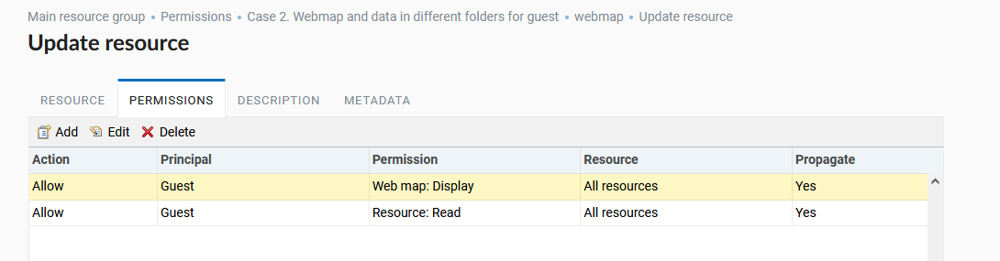
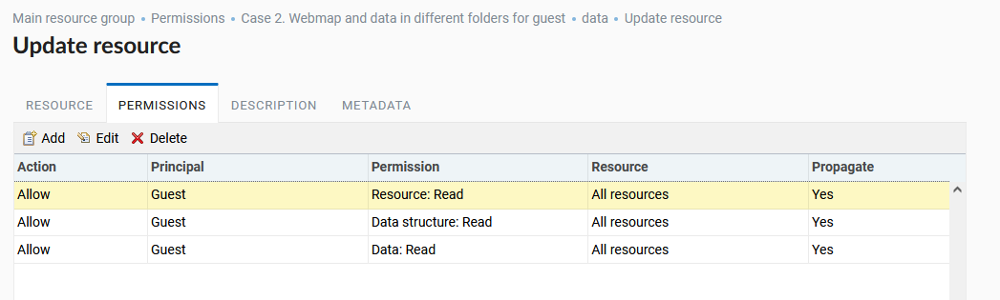
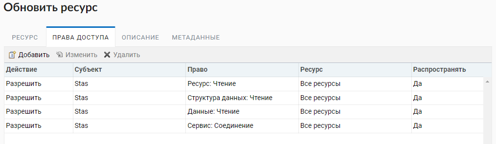
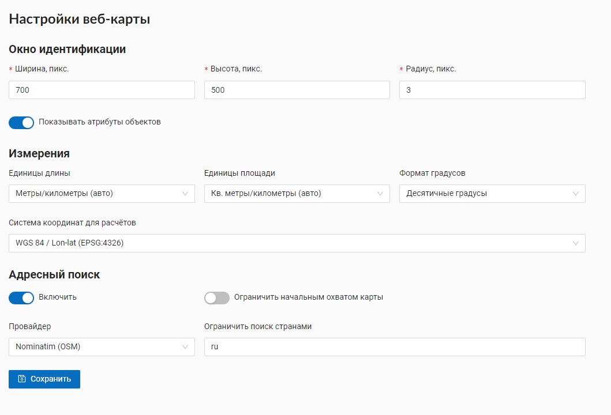

.. sectionauthor:: Артём Светлов <artem.svetlov@nextgis.ru>
.. sectionauthor:: Роман Гайнуллов <roman.gainullov@nextgis.ru>

.. _ngw_admin_tasks:

Административные задачи
=======================

.. _ngw_change_lang:

Переключение языка
------------------

Любой пользователь может переключить язык интерфейса.
Для этого в правом верхнем углу экрана по иконке пользователя нужно перейти в раздел "Настройки" (:numref:`admin_select_lang_pic`)

.. figure:: _static/admin_settings_lang_rus.png
   :name: admin_settings_lang_pic
   :align: center
   :width: 10cm

   Переход в настройки

Для выбора доступны следующие языки (:numref:`admin_settings_lang_pic`):

* По умолчанию в браузере
* Русский
* Английский 
* Болгарский
* Итальянский
* Испанский
* Китайский
* Немецкий
* Португальский
* Французский
* Чешский

   Изменение языка интерфейса

.. _ngw_search_bar:

Поиск ресурсов
---------------

Для удобного поиска ресурсов и навигации в NextGIS Web существует строка поиска в верхней панели интерфейса (:numref:`admin_search_bar_pic`)
Поиск осуществляется по всей меющейся базе данных, независимо от того, в какой директории пользователь в данный момент находится.

   Поиск ресурсов в веб ГИС

.. _ngw_audit:

Аудит (Регистрация операций пользователей)
----------

История пользовательских запросов к Веб-ГИС регистрируется в журнале. Он располагается в разделе **Аудит** Панели управления Веб-ГИС (:numref:`control_panel_audit_pic`).

   
   Расположение журнала в панели управления Веб-ГИС

Журнал состоит из верхней панели фильтров и таблицы истории запросов пользователей (:numref:`user_activity_log_pic`). Каждое действие пользователя регистрируется в таблице журнала и содержит следующие параметры:

* Время
* Статус
* Метод
* Имя маршрута
* Контекст
* Пользователь
  

   
   Журнал пользовательских операций

Кнопки **Назад** и **Вперед** позволяют перемещаться между страницами журнала. Существует возможность отфильтровать записи в журнале по временному интервалу и пользователю, который совершал действия (:numref:`audit_filter_pic`). Таблица может быть экспортирована в формате .*CSV с учетом применения фильтров.

   
   Фильтрация по дате и пользователям

По клику на запись журнала можно посмотреть текст самого запроса (:numref:`audit_log_entry_pic`).

   
   Запись в журнале операций

.. _ngw_create_group:

Создание групп пользователей
----------------------------

Диалог создания новой группы пользователей представлен на :numref:`ngweb_admin_controlpanel_usergroup_create_pic`
Для открытия этого окна необходимо в основном меню (см. :numref:`ngweb_main_page_administrative_interface_pic`, п.1) выбрать пункт "Панель управления" (см. :numref:`ngweb_main_page_main_menu_pic`). На Панели управления (см. :numref:`ngweb_control_panel`) следует выбрать команду "Создать" в подпункте "Группы".

   Окно создания новой группы

В диалоге необходимо указать полное и краткое наименование группы, при необходимости ввести описание группы, выбрать членов данной группы в выпадающем списке и нажать кнопку "Создать". 
Установите флаг "Новые пользователи" в настройках группы для её автоматического назначения вновь создаваемым пользователям. 

.. note:: 
   Название группы должно содержать только цифры и буквы. 

.. _ngw_create_user:

Создание пользователя
---------------------

Диалог создания нового пользователя представлен на :numref:`ngweb_admin_controlpanel_user_create`. 
Для открытия этого окна необходимо в основном меню (см. :numref:`ngweb_main_page_administrative_interface_pic`, п.1) открыть панель управления (см. :numref:`ngweb_main_page_main_menu_pic`) и выбрать команду "Создать" в подпункте "Пользователи".

.. figure:: _static/admin_controlpanel_user_create_rus_2.png
   :name: ngweb_admin_controlpanel_user_create
   :align: center
   :width: 16cm

   Окно создания пользователя
   
В диалоге необходимо указать:

* Полное имя пользователя (например, Иванов Иван Иванович)
* Имя пользователя – логин (например, ivanov)
* Пароль для входа
* Группа(-ы), к которым относится пользователь (в списке будут отображены имеющиеся группы. Если необходимой группы в списке нет, то ее необходимо предварительно создать (см. :ref:`ngw_create_group`)).
* Язык интерфейса для этого пользователя

Дополнительные сведения о пользователе можно добавить в пункт "Описание".

Далее необходимо нажать кнопку **"Создать"**.

.. note:: 
   Пароль ограничен по длине в диапазоне 5-25 символов. Логин может иметь символы латинского алфавита, цифры и символ подчеркивания, но должен начинаться обязательно с буквы.

.. _ngw_disable_delete_user:

Отключение и удаление пользователей
----------------------------------

В основном меню (см. :numref:`ngweb_main_page_administrative_interface_pic`, п.1) откройте панель управления (см. :numref:`ngweb_main_page_main_menu_pic`) и выберите подпункт "Пользователи". В строке каждого пользователя есть иконки "Изменить" и "Удалить".

   
   Список пользователей

В окне изменения можно редактировать параметры пользователя, а также **отключить** его. Для этого нужно поставить флажок в поле "Отключен" и нажать кнопку **Сохранить**.

   
   Отключение пользователя

Отключенный пользователь не будет учитываться в лимите тарифного плана. Это позволяет включать различных пользователей по необходимости, не выходя за ограничения текущего плана.

Если нужно именно **полностью удалить** пользователя, это можно сделать из списка пользователей, нажав на значок удаления (см. :numref:`ngweb_admin_controlpanel_user_list_pic`) и подтвердив действие во всплывающем окне.

Также можно открыть окно редактирования и там нажать кнопку **Удалить**.

.. _ngw_access_rights:
    
Настройка прав доступа
----------------------

NextGIS Web строится на ресурсном подходе - каждый компонент системы (слой, 
группа, сервис) является ресурсом. NextGIS Web обладает расширенными настройками 
прав доступа к ресурсам.

Права доступа можно назначить как при создании ресурса (см. :ref:`ngw_create_layers`), 
так и при его изменении (см. :ref:`ngw_change_layers`). Для этого в диалоге 
создания/изменения ресурс необходимо перейти на вкладку 
"Права доступа" (см. :numref:`ngweb_access_rights_tab`).

.. figure:: _static/access_rights_tab_rus.png
   :name: ngweb_access_rights_tab
   :align: center
   :width: 20cm
   
   Вкладка настроек прав доступа

В данной вкладке можно назначать, отменять или изменять права доступа. Для одного
ресурса могут быть назначены различные права доступа пользователей и/или групп.
Диалог настроек правил доступа представлен на рис. :numref:`ngweb_access_rights_dialog`.

.. figure:: _static/access_rights_dialog.png
   :name: ngweb_access_rights_dialog
   :align: center
   :width: 20cm
   
   Диалог настроек правил доступа

Диалог включает в себя следующие элементы:
    
* Действие.
* Субъект.
* Право.
* Ресурс.
* Распространять.

**Действие** определяет типы правила - запрещающее или разрешающее.

.. note:: По умолчанию все запрещено.

**Субъект** - пользователь или группа, на которых распространяется правило.

Кроме пользователей создаваемых администратором, в системе есть специальные системные пользователи:

* Администратор - пользователь Веб ГИС, обладающий административными правами
* Владелец - пользователь Веб ГИС, создавший ресурс, на которое устанавливается право
* Гость - пользователь Веб ГИС, который обращается к ресурсу, не являясь при этом авторизованным
* Прошедший проверку - пользователь Веб ГИС, авторизованный в системе под любым существующим аккаунтом (то есть не гость)
* Любой пользователь -  все, включая гостей и авторизовавшихся под любым аккаунтом пользователей

Кроме групп создаваемых администратором, в системе есть специальные системные группы пользователей:

* Администраторы - группа, пользователи которой обладают административными правами
* Editors - группа, пользователи которой не имеют доступа в панель управления, но могут создавать и редактировать данные.

Добавление пользователей в эти группы - удобный способ быстро назначить необходимые права в рамках всей системы. Удалить эти группы нельзя.

**Право** - определяет разрешенные или запрещенные действия с ресурсом. Существуют 
следующие виды прав: 

* Все ресурсы: Все права
* Ресурс: Все права
* Ресурс: Управление дочерними ресурсами
* Ресурс: Управление правами доступа
* Ресурс: Чтение
* Ресурс: Создать
* Ресурс: Изменить
* Ресурс: Удалить
* Сервис: Все права
* Сервис: Соединение
* Сервис: Конфигурация
* Структура данных: Все права
* Структура данных: Запись
* Структура данных: Чтение
* Соединение: Все права
* Соединение: Запись
* Соединение: Чтение
* Соединение: Соединение
* Веб-карта: Все права
* Веб-карта: Редактировать аннотации
* Веб-карта: Просмотр аннотаций
* Веб-карта: Открыть
* Collector: Все права
* Collector: Чтение
* Данные: Все права
* Данные: Запись
* Данные: Чтение
* Метаданные: Все права
* Метаданные: Запись
* Метаданные: Чтение

**Ресурс** определяет, на какие ресурсы распространять права. Это актуально для группы ресурсов, 
где необходимо назначить права определенным типам ресурсов. Если нет необходимости 
в выборе типов ресурсов или все ресурсы в группе одинаковые, то необходимо проставить "Все 
ресурсы".

Чекбокс "**Распространять**" определяет, распространять ли правило на ресурсы в 
подгруппы или нет. Обратите внимание, что установка прав на ресурс нижнего уровня, 
и распространение их не отменяет необходимости устанавливать их на ресурсы верхнего уровня. 
Например, дав доступ на чтение на группу ресурсов вложенную в другие группы, но не дав 
соответствующих прав на группы верхнего уровня относительно текущей, вплоть до корневого ресурса, 
пользователь не получит доступа к подпапке.

Права могут назначаться даже ресурсам, которым они не соответствуют явно. Например,
право "Веб-карта: Просмотр" может быть назначено ресурсу Группа ресурсов, и, если включен
переключатель "Распространять", то право будет применено ко всем веб-картам
в данной группе и подгруппах.

Рассмотрим права подробнее.

**Все ресурсы: Все права** - разрешает или запрещает любые действия с ресурсами.

**Ресурс: Все права** - разрешает или запрещает любые действия с ресурсами, за
исключением групп ресурсов.

**Ресурс: Управление дочерними ресурсами** - разрешает или запрещает изменение 
настроек дочерних ресурсов. 
 
**Ресурс: Управление правами доступа** - разрешает или запрещает управлять правами
доступа к ресурсу.

**Ресурс: Чтение** - разрешает или запрещает чтение ресурсов.

**Ресурс: Создать** - разрешает или запрещает создание ресурсов.

**Ресурс: Изменить** - разрешает или запрещает модифицировать ресурсы.

**Ресурс: Удалить** - разрешает или запрещает удалять ресурсы.

**Сервис: Все права** - разрешает или запрещает любые действия с сервисом.

**Сервис: Соединение** - разрешает или запрещает выполнять подключения к сервису.

**Сервис: Конфигурация** - разрешает или запрещает изменять настройки сервиса.

**Структура данных: Все права** - разрешает или запрещает любые действия со 
структурой данных.

**Структура данных: Запись** - разрешает или запрещает изменять структуру данных.

**Структура данных: Чтение** - разрешает или запрещает чтение структуры данных.

**Соединение: Все права** - разрешает или запрещает любые действия с соединениями.

**Соединение: Запись** - разрешает или запрещает модифицировать соединения.

**Соединение: Чтение** - разрешает или запрещает чтение параметров соединения.

**Соединение: Соединение** - разрешает или запрещает использовать 
соединение (будут ли доступны пользователю слои или данные из соединения).

**Веб-карта: Все права** - разрешает или запрещает любые действия над веб-картой.

**Веб-карта: Открыть** - разрешает или запрещает просмотр веб-карты.

**Данные: Все права** - разрешает или запрещает любые действия над данными.

**Данные: Запись** - разрешает или запрещает модификацию данных.

**Данные: Чтение** - разрешает или запрещает чтение данных.

**Метаданные: Все права** - разрешает или запрещает любые действия над 
метаданными.

**Метаданные: Запись** - разрешает или запрещает модифицировать метаданные.

**Метаданные: Чтение** - разрешает или запрещает читать метаданные.

При назначении прав на тот или иной ресурс следует учитывать права на составляющие 
его ресурсы. Например, для предоставления доступа к WMS сервису необходимо дать 
следующие права:
    
* Сервис: Соединение - разрешение на само подключение.
* Ресурс: Чтение - разрешение на все ресурсы (векторные и растровые слои), 
  опубликованные в WMS сервисе.
* Структура данных: Чтение - разрешение на все ресурсы (векторные и растровые слои),
  опубликованные в WMS сервисе.
* Данные: Чтение - разрешение на все ресурсы (векторные и растровые слои),
  опубликованные в WMS сервисе.

При наличии сложной системы с несколькими отдельными картами, с которой должны 
работать разные пользователи, можно создать группы пользователей. Для групп 
можно настраивать права доступа по отдельности.

Примеры настроек прав доступа
-----------------------------

Дать гостю права на просмотр всех ресурсов
~~~~~~~~~~~~~~~~~~~~~~~~~~~~~~~~~~~~~~~~~~

.. note:: 
   Гости будут иметь возможность видеть административный интерфейс и ходить по всем папкам, кроме специально закрытых для просмотра.

.. figure:: _static/access_rights_group_for_quest_0.png
   :name: ngweb_access_rights_tab_0_pic
   :align: center
   :width: 20cm

   Задать в свойствах основной группы ресурсов

Дать гостю права на просмотр карты
~~~~~~~~~~~~~~~~~~~~~~~~~~~~~~~~~~

.. note:: 
   Гости смогут видеть веб-карту со слоями c данными.

.. figure:: _static/Case2_Main_resource_group.png
   :name: Case2_Main resource group
   :align: center
   :width: 20cm

   Задать в свойствах корневой группы ресурсов

   Задать в свойствах группы ресурсов с веб-картой

   Задать в свойствах группы ресурсов с геоданными
   
Важно обратить внимание, что на родительские ресурсы (при их наличии) также необходимы права на их чтения для гостя (см. :ref:`Case2_permissions`) 
Если на ресурс нет права на чтение, то вложенные в него данные также прочитать будет невозможно.
   
   
.. figure:: _static/Case2_permissions.png
   :name: Case2_permissions
   :align: center
   :width: 20cm

   Задать во вложенных группах ресурсов
   

Дать пользователю права на одну группу ресурсов
~~~~~~~~~~~~~~~~~~~~~~~~~~~~~~~~~~~~~~~~~~~~~~~

.. figure:: _static/access_rights_group_for_user_1.png
   :name: ngweb_access_rights_tab_3_pic
   :align: center
   :width: 20cm

   Задать в свойствах группы ресурсов

.. figure:: _static/access_rights_group_for_user_2_rus.png
   :name: ngweb_access_rights_tab_4_pic
   :align: center
   :width: 20cm

   Задать в свойствах корневой группы ресурсов

Закрыть группу для гостей, открыть для специального пользователя
~~~~~~~~~~~~~~~~~~~~~~~~~~~~~~~~~~~~~~~~~~~~~~~~~~~~~~~~~~~~~~~~~

.. figure:: _static/access_rights_group_for_quest_1_rus.png
   :name: ngweb_access_rights_tab_0_pic
   :align: center
   :width: 20cm

   Задать в свойствах группы ресурсов

.. figure:: _static/access_rights_group_for_quest_2_rus.png
   :name: ngweb_access_rights_tab_0_pic
   :align: center
   :width: 20cm

   Задать в свойствах корневой группы ресурсов

В качестве альтернативы можно разрешить этому пользователю чтение на все вышестоящие группы ресурсов.

Дать группе пользователей право на ввод данных через мобильное приложение
~~~~~~~~~~~~~~~~~~~~~~~~~~~~~~~~~~~~~~~~~~~~~~~~~~~~~~~~~~~~~~~~~~~~~~~~~

Создать отдельную группу пользователей (в примере - "Openstreetmap users") и отдельную группу ресурсов.  

.. figure:: _static/access_rights_group_for_mobile_import_1.png
   :name: ngweb_access_rights_tab_mobile_import_1_pic
   :align: center
   :width: 20cm

   Задать в свойствах группы ресурсов

.. figure:: _static/access_rights_group_for_mobile_import_2.png
   :name: ngweb_access_rights_tab_mobile_import_2_pic
   :align: center
   :width: 20cm

   Задать в свойствах корневой группы ресурсов

Закрыть просмотр веб-карты всем кто не залогинился, разрешить тем кто залогинился
~~~~~~~~~~~~~~~~~~~~~~~~~~~~~~~~~~~~~~~~~~~~~~~~~~~~~~~~~~~~~~~~~~~~~~~~~~~~~~~~~~~~~~
  

.. figure:: _static/access_rights_deny_webmap_guests_allow_logined_rus.png
   :name: access_rights_deny_webmap_guests_allow_logined_pic
   :align: center
   :width: 20cm

   Задать в свойствах веб-карты.
   
Закрыть доступ ко всей системе гостям (тем, кто без пароля)
~~~~~~~~~~~~~~~~~~~~~~~~~~~~~~~~~~~~~~~~~~~~~~~~~~~~~~~~~~~~~~~~~~~~~~~~~~~~~~~~~~~~~~
  

.. figure:: _static/access_rights_deny_all_rus.png
   :name: access_rights_deny_all
   :align: center
   :width: 20cm

   Задать в свойствах корневой группы ресурсов

Обеспечить авторизованному пользователю доступ к WMS сервису для использования в сторонних приложениях
~~~~~~~~~~~~~~~~~~~~~~~~~~~~~~~~~~~~~~~~~~~~~~~~~~~~~~~~~~~~~~~~~~~~~~~~~~~~~~~~~~~~~~~~~~~~~~~~~~~~~~~~~~

Данные и сервис WMS на основе этих данных находятся в одной группе ресурсов. Права устанавливаются на эту группу.
Для основной группы ресурсов пользователю уже установлено право на чтение ресурса.

   Задать в группе ресурсов с данными и WMS сервисом

.. _ngw_change_password:

Изменение пароля пользователя
-----------------------------

Для смены пароля пользователя можно воспользоваться административным интерфейсом. Для этого необходимо в основном меню (см. :numref:`ngweb_main_page_administrative_interface_pic`, п.1) выбрать пункт "Панель управления" (см. :numref:`ngweb_main_page_main_menu_pic`). На Панели управления (см. :numref:`ngweb_control_panel`) следует выбрать команду "Список" в подпункте "Пользователи" и нажать на иконку в виде карандаша напротив пользователя, для которого необходимо сменить пароль (см. :numref:`ngweb_change_password_pic`). В открывшемся окне в поле "Пароль" ввести новый пароль. После ввода нового пароля следует нажать на кнопку "Сохранить".

.. figure:: _static/ngweb_change_password_rus.png
   :name: ngweb_change_password_pic
   :align: center
   :width: 20cm

   Окно редактирования пользователя

Также существует возможность изменить пароль пользователя из командной строки:

.. warning:: Указание нового пароля пользователя в командной строке потенциально небезопасно.

.. code-block:: shell

  env/bin/nextgisweb --config config.ini change_password user password
  env/bin/nextgisweb --config config.ini change_password user password

.. note:: 
   Пароль ограничен по длине в диапазоне 5-25 символов

.. _ngw_storage:

Хранилище
----------

Раздел "Хранилище" содержит информацию об объёме загруженных в Веб ГИС данных в зависимости от их типа.
Оценка занимаемого пространства происходит с различной периодичностью, которая указывается под общей таблицей.
Администратор может принудительно пересчитать объем хранилища (например - сразу после загрузки больших данных, если система пока не пересчитала занимаемый объем самостоятельно).

   Раздел "Хранилище"

.. _ngw_backups:

Резервные копии
----------------------

В данном разделе можно посмотреть список имеющихся резервных копий NextGIS Web, а также скачать любую из них.
Процесс создания бэкапов и восстановления для разработчиков описан `здесь <https://docs.nextgis.ru/docs_ngweb_dev/doc/admin/backup_restore.html>`_. 

.. _ngw_system_info:

Информация о системе
----------------------

Через панель управления администратор может посмотреть информацию о системе и текущей версии платформы (:numref:`admin_system_info_pic`)
Через иконку в правом верхнем углу есть возможность скопировать все эти данные в буфер обмена.

   Раздел информации о системе в панели управления
   
  

   Информация о системе и платформе

.. _ngw_cadastre_services:

Кадастровые сервисы
----------------------

.. figure:: _static/admin_system_cadastr_serv.png
   :name: admin_system_cadastr_serv
   :align: center
   :width: 20cm

   Кадастровые сервисы в панели управления

Наличие `Premium-подписки <https://nextgis.ru/pricing-base/>`_ или `NextGIS Web на своем сервере <https://nextgis.ru/pricing/#ngw>`_ позволяет получить API-ключ (через `geoservices <https://geoservices.nextgis.com/settings/profile>`_, API key в разделе Profile) для расширенных функций по работе с веб-картой. Кадастровые сервисы дают возможность пользователю идентифицировать на веб-карте различные кадастровые единицы:

- Кварталы
- Земельные участки
- Объекты капитального строительства
- Округа

Подключение кадастровых сервисов для NextGIS Web on-premise
~~~~~~~~~~~~~~~~~~~~~~~~~~~~~~~~~~~~~~~~~~~~~~~~~~~~~~~~~~~~~

1. Создать глобальный аккаунт my.nextgis.com (если его еще нет);
2. Сообщить через систему поддержки о создании аккаунта, запросить перевод на Premium;
3. Дождаться уведомления о переводе на Premium;
4. Авторизоваться на geoservices.nextgis.com (облачный аккаунт NextGIS ID, пункт 1);
5. Перейти на вкладку `Rosreestr <https://geoservices.nextgis.com/pkk>`_ и скопировать `API ключ <https://docs.nextgis.ru/docs_geoservices/source/rosreestr_pkk.html#nggeos-pkk>`_;
6. Вставить ключ в настройки на стороне NGW в `Панели управления <https://docs.nextgis.ru/docs_ngweb/source/admin_tasks.html#ngw-cadastre-services>`_ (сервер NGW должен быть доступен извне по белому IP).

.. _ngw_res_export:

Экспорт ресурсов
------------------

Данная настройка показывает в интерфейсе Веб ГИС возможность экспорта (сохранения) данных только для тех категорий пользователей, которые выбраны из соответствующего списка. 

   Выбор категории пользователей, имеющих право экспортировать данные

   Экспорт данных

Функцию Экспорта данных могут видеть либо только администраторы, либо пользователи с правом на:

- Чтение данных
- Запись данных

Все остальные пользователи не смогут сохранить данные из интерфейса Веб ГИС. 

.. note:: 
   Эта настройка никак не влияет на возможность получать данные через `REST API <https://docs.nextgis.ru/docs_ngweb_dev/doc/developer/toc.html>`_ в соответствии с установленными `правами доступа <https://docs.nextgis.ru/docs_ngweb/source/permissions.html>`_ к ним.

.. _ngw_contr_panel_webmap_settings:

Настройки веб-карты
----------------------

Через панель управления администратор может задать ряд общих настроек для всех веб-карт в NextGIS Web (:numref:`admin_webmap_panel_settings`):

* Размер окна идентификации
* Параметры измерений
* Параметры адресного поиска

   Страница настроек веб-карты

.. _ngw_contr_panel_webmap_ident:

Окно идентификации
~~~~~~~~~~~~~~~~~~~~

В разделе регулируются два параметра:

* Размер всплывающего окна при идентификации объектов на веб-карте;
* Радиус области вокруг объекта, в рамках которой индентификация работает.

Размеры задаются в пикселях (:numref:`admin_webmap_panel_indentify`)

.. figure:: _static/admin_webmap_panel_indentify_rus.png
   :name: admin_webmap_panel_indentify
   :align: center
   :width: 20cm

   Идентификация объекта на веб-карте

Одновременно с этим можно включить/выключить отображение атрибутов объектов слоя.

.. _ngw_contr_panel_webmap_measure:

Измерения
~~~~~~~~~~

В разделе задаются параметры, отвечающие за различные измерения на веб-карте (:numref:`admin_webmap_panel_settings`):

* Единицы измерения длин (в соответствии с выбранной СК)
* Единицы измерения площадей (в соответствии с выбранной СК)
* Формат градусов
* Система координат для расчета измерений

.. _ngw_contr_panel_webmap_search:

Адресный поиск
~~~~~~~~~~~~~~

Адресный поиск в NextGIS Web осуществляется по двум базам адресов (провайдерам):

* OpenStreetMap - используется по-умолчанию
* Yandex Maps - внешний геокодер с использованием API ключа 

Параметры:

* "Включить" - результаты поиска на веб-картах будут включать не только атрибутивные данные, но и базу адресов, если найдутся совпадения
* "Ограничить охватом карты" - поиск будет произведен в пределах того охвата, который установлен в настройках веб-карты
* "Ограничить странами" - работает для провайдера OSM. Формат заполения - ru, de и т.д.
* "Ключ геокодера API Яндекс.Карт" - для провайдера Yandex Maps. Пользователь получает самостоятельно через https://developer.tech.yandex.ru

   Настройки адресного поиска на веб-карте

   Поиск по веб-карте

.. _ngw_CSS:

Настройка внешнего вида интерфейса на CSS
-------------------------------------------

Можно изменять внешний вид NextGIS Web. Внешний вид включает: логотипы, цвета шапки, фона, кнопок и других элементов. Для этого необходимо в основном меню (см. :numref:`ngweb_main_page_administrative_interface_pic`, п.1) выбрать пункт "Панель управления" (см. :numref:`ngweb_main_page_main_menu_pic`). На Панели управления (см. :numref:`ngweb_control_panel`) следует выбрать команду "Пользовательские стили CSS" в подпункте "Настройки". В открывшейся вкладке можно задать собственные стили :term:`CSS`, которые будут использованы для оформления всех страниц Веб ГИС. 

Примеры настроек внешнего вида интерфейса
-------------------------------------------

Изменить цвет шапки:
~~~~~~~~~~~~~~~~~~~~

.. code-block:: css

	.header{background-color: #F44336; color: #fff;}

Убрать логотип NextGIS с карты:
~~~~~~~~~~~~~~~~~~~~~~~~~~~~~~~~

.. code-block:: css

	.map-logo{display:none;}

Убрать логотип NextGIS из шапки:
~~~~~~~~~~~~~~~~~~~~~~~~~~~~~~~~

.. code-block:: css

	.header__title-logo{display:none;}
	
Заменить логотипы NextGIS на другие (только если вам это позволяет делать лицензионное соглашение):
~~~~~~~~~~~~~~~~~~~~~~~~~~~~~~~~

.. code-block:: css	

	.map-logo{content:url("https://upload.wikimedia.org/wikipedia/commons/thumb/3/30/JR_logo_%28east%29.svg/80px-JR_logo_%28east%29.svg.png")}
	.header__title-logo{content:url("https://upload.wikimedia.org/wikipedia/commons/thumb/3/30/JR_logo_%28east%29.svg/80px-JR_logo_%28east%29.svg.png")}
	
	
Убрать кнопки шаринга в социальные сети:
~~~~~~~~~~~~~~~~~~~~~~~~~~~~~~~~

.. code-block:: css
	
	div.social-links {display:none;}
	
Убрать кнопку-гамбургер	
~~~~~~~~~~~~~~~~~~~~~~~

.. code-block:: css
	
	#menu.header-nav__item {display:none;}

Чтобы вернуть её обратно - откройте контрольную панель по url http://username.nextgis.com/control-panel

Убрать кнопки справа с логином
~~~~~~~~~~~~~~~~~~~~~~~~~~~~~~

.. code-block:: css
	
	ui.header-nav header__right {display:none;}
	
Убрать заголовок окна идентификации
~~~~~~~~~~~~~~~~~~~~~~~~~~~~~~~~~~~
Окно идентификации - это всплывающее окно, появляющееся при нажатии на объект на карте. Данная настройка скроет его заголовок и выбор идетифицируемого слоя.

.. code-block:: css

	div.ngwPopup__content div div.dijitAlignTop,
        div.ngwPopup__features span.ngwWebmapToolIdentify-controller {
            display: none;
        }

Расширенный пример настройки внешнего вида Веб ГИС
~~~~~~~~~~~~~~~~~~~~~~~~~~~~~~~~~~~~~~~~~~~~~~~~~~

Этот пример показывает, как настроить большинство изменяемых элементов внешнего вида NextGIS Web. 
Можно использовать фрагменты приведенных ниже стилей как есть или с нужными изменениями. 
Увидеть эти стили в действии можно по `ссылке <http://nastya.nextgis.com>`_.

.. code-block:: css

	/* Base background */

	body{
	  background-color: #fff;
	  background-image:url("https://nextgis.ru/img/hypnotize_transparent.png");
	}

	/* Header text and background color */

	.header{
	  background-color: #F44336;
	  color: #fff;
	}

	/* Separator color between logo and title */

	.header__title-logo{
	  border-right: 1px solid rgba(255,255,255,.48) !important;
	}

	/* User info color in header */

	.user-avatar__label{
	  background-color: #fff !important;
	  color: #F44336 !important;
	}

	.user-avatar .user-avatar__icon{
	  color: rgba(255,255,255,.82) !important;
	}

	/* Primary button */

	.dijitButton--primary{
	  background-color: #fff !important;
	  color:#f44336 !important;
	  font-weight: bold !important;
	  border: 2px solid #f44336 !important;
	}

	.dijitButton--primary:hover{
	  background-color: #f44336 !important;
	  color: #fff !important;
	}

	/* Default button */

	.dijitButton--default{
	  background-color: #fff !important;
	  color:#999 !important;
	  font-weight: bold !important;
	  border: 2px solid #999 !important;
	}

	.dijitButton--default:hover{
	  background-color: #999 !important;
	  color: #fff !important;
	}

	/* Tabs color */

	.dijitTabContainerTop-tabs .dijitTabChecked{
	  border-top-color: #f44336 !important;
	}

	/* Left navigation panel on the map */

	.navigation-menu{
	  background-color: #fff !important;
	  border-right: 1px solid rgba(0,0,0,.12) !important;
	  color: #000 !important;
	}
	

Настройка элементов интерфейса NextGIS (White label)
----------------------------------------

White label — это специальный модуль, позволяющий убрать или заменить логотипы и названия NextGIS на логотипы и названия вашей компании. Модуль приобретается и устанавливается в NextGIS Web отдельно. Модуль добавляет новый раздел в Панель управления (см. :numref:`Control_panel_whitelabel_ru`), позволяющий отключить или переопределить различные элементы интерфейса, связанные с упоминанием NextGIS.

.. figure:: _static/Control_panel_whitelabel_ru.png
   :name: Control_panel_whitelabel_ru
   :align: center
   :width: 20cm

   Модуль 'White label' в панели управления

Логотип компании на веб-карте
~~~~~~~~~~~~~~~~~~~~~~~~~~~~~

В панели управления вы сможете загрузить свой логотип в формате PNG (см. :numref:`logo_whitelabel`) для отображения в правом нижнем углу карты. Если файл не загружен - логотип отсутствует (см. :numref:`web-map_logo`).

.. figure:: _static/logo_whitelabel.png
   :name: logo_whitelabel
   :align: center
   :width: 25cm

   Загрузка файла логотипа компании

.. figure:: _static/web-map_logo.png
   :name: web-map_logo
   :align: center
   :width: 25cm

   Веб-карта с логотипом NextGIS (слева) и без логотипа (справа)
   

URL-адрес компании
~~~~~~~~~~~~~~~~~~~~

Новому логотипу также можно назначить ссылку на адрес организации (см. :numref:`url-logo`)

.. figure:: _static/url-logo.png
   :name: url-logo
   :align: center
   :width: 25cm

   URL-адрес организации

Страница справки
~~~~~~~~~~~~~~~~~

Без модуля White label справка ведет на http://nextgis.ru/help/. Вы можете задать свою ссылку (см. :numref:`helplink_whitelabel`) на справку (см. :numref:`help_link`).

.. figure:: _static/helplink_whitelabel.png
   :name: helplink_whitelabel
   :align: center
   :width: 15cm

   Переопределение ссылки на справку

.. figure:: _static/help_link.png
   :name: help_link
   :align: center
   :width: 12cm

   Раздел "Справка" в меню
   

Адрес техподдержки
~~~~~~~~~~~~~~~~~~~

Аналогично вы сможете задать свою ссылку (см. :numref:`support_whitelabel`) на страницу техподдержки (см. :numref:`support_link`).

.. figure:: _static/support_whitelabel.png
   :name: support_whitelabel
   :align: center
   :width: 16cm
   
   Переопределение ссылки на техподдержку

.. figure:: _static/support_link.png
   :name: support_link
   :align: center
   :width: 16cm

   Ссылка в интерфейсе на страницу техподдержки

Прочие элементы
~~~~~~~~~~~~~~~~

* Название Веб ГИС по умолчанию задаётся без упоминания NextGIS.
* В ресурсах WMS и WFS сервисов упоминание **NextGIS QGIS** заменяется на **QGIS** (см. :numref:`WMS_WFS_whitelabel`).

.. figure:: _static/WMS_WFS_whitelabel.png
   :name: WMS_WFS_whitelabel
   :align: center
   :width: 25cm

   Замена *NextGIS QGIS* (слева) на *QGIS* (справа) в сервисах WMS и WFS
   
* В ссылках на Веб ГИС убирается превью с упоминанием NextGIS (см. :numref:`Preview_maplinks`).

.. figure:: _static/Preview_maplinks.png
   :name: Preview_maplinks
   :align: center
   :width: 25cm

   Сокрытие упоминания *NextGIS QGIS* в ссылках на веб ГИС
