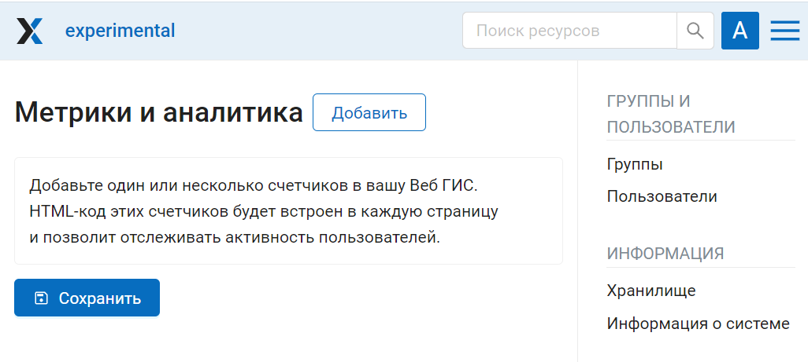
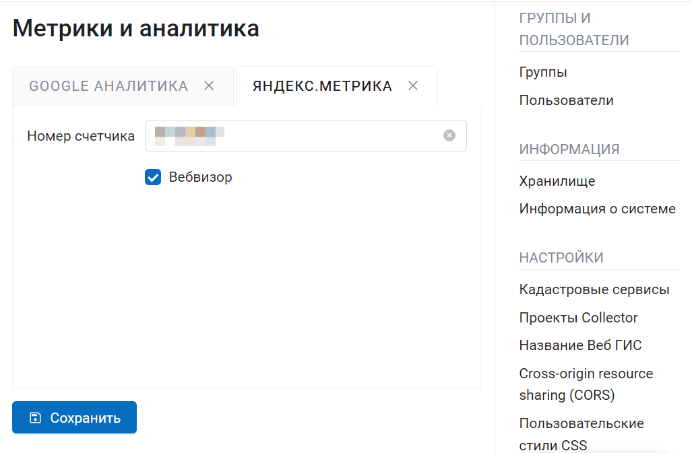
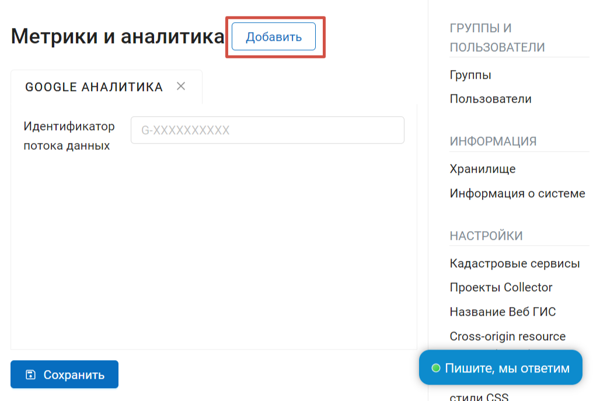

Метрики и аналитика
=====================

.. note:: 
        Функционал доступен только на плане `Premium <https://nextgis.ru/pricing-base/>`_

В этом разделе Панели управления вы можете добавить  один или несколько счётчиков в вашу Веб ГИС. HTML-код этих счетчиков будет встроен в каждую страницу и позволит отслеживать активность пользователей.

   Метрики и аналитика

Добавленные счётчики будут отображаться на отдельных вкладках.

   Счётчики

Для того, чтобы добавить новый счётчик, нажмите кнопку **Добавить**, выберите сервис, который хотите подключить, и в появившейся вкладке введите данные счётчика.

   Добавление нового счётчика

Как подключить Яндекс.Метрику подробно описано `здесь <https://docs.nextgis.ru/docs_ngcom/source/yandexmetrika.html>`_.
