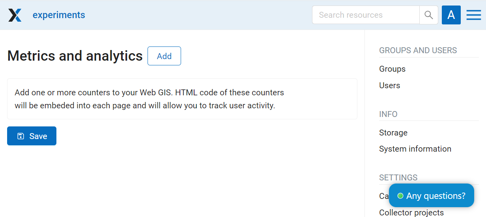
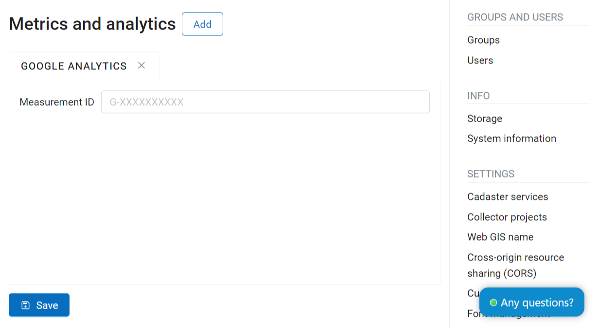

Metrics and analytics
=====================

.. note:: 
        This functionality is only available for `Premium <https://nextgis.com/pricing-base/>`_ subscription plan.

In this section of the Control panel you can add tracking code to your Web GIS. Measurement code will be added to each page to help track user activity.

   Metrics and analytics
   
To add new measurement code, press **Add**, select a service you'd like to enable and enter your measurement ID in the opened tab.

   Adding new measurement

