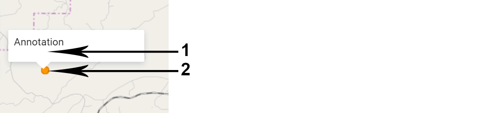
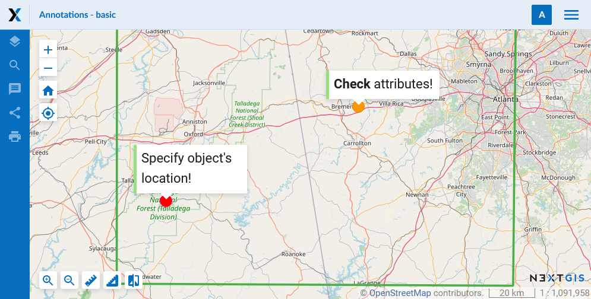
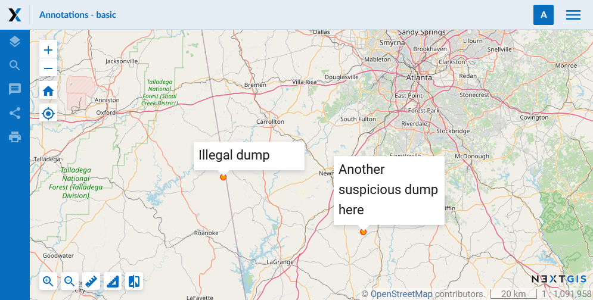
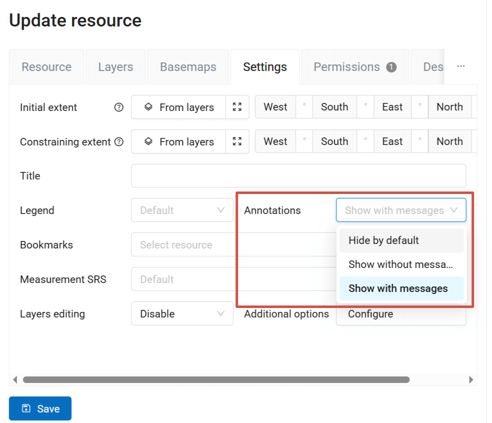
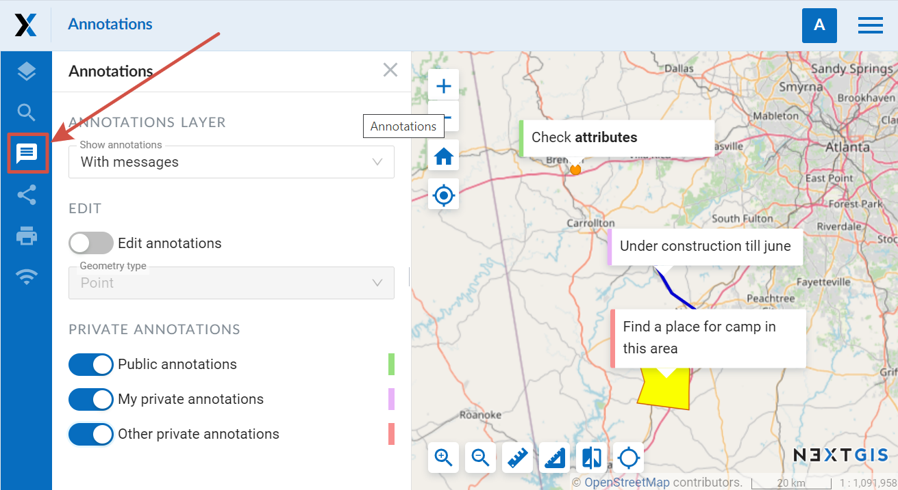
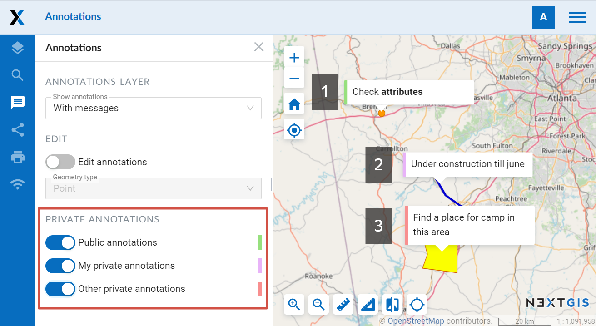
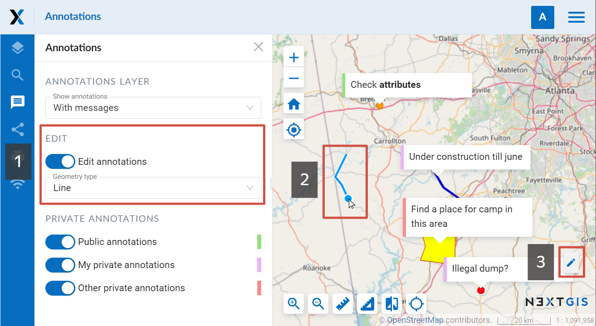
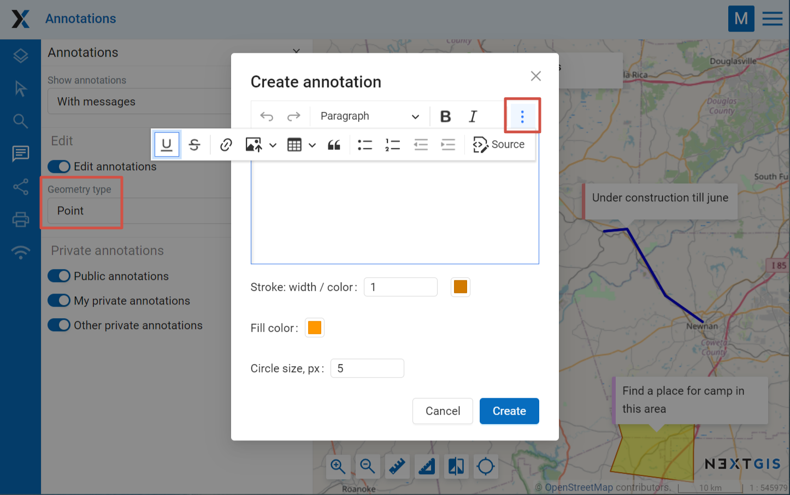

.. _ngw_annotation:

.. _nextgis.com: http://nextgis.com/
.. _WYSIWYG: https://en.wikipedia.org/wiki/WYSIWYG
.. role:: raw-html(raw)
    :format: html

Web Map annotations
===================

Annotation. What is it?
~~~~~~~~~~~~~~~~~~~~~~~~

Annotations are text messages attached to the points, which you can create and display on any `Web Map <https://docs.nextgis.com/docs_ngweb/source/webmaps_admin.html>`_. You can create your own set of annotations for each Web Map.

Annotation consists of a point and a message attached to this point.

   Annotation structure (1 - a text message of annotation, 2 - a point of annotation)

The main aim of annotations is to specify user's data by placing temporary messages on a Web Map.

   An example of annotation display

At the same time, you can use annotations as a simple tool to create point data with text attributes attached to the Web Map.

   An example of annotation display (as point data)

.. note::
    In contrast to a full vector layer, annotation tool does not allow to export data, search for it etc. Therefore, we recommend using `vector layers <https://docs.nextgis.com/docs_ngweb/source/layers.html#empty-vector-layer>`_ to create the bulk of the data.

.. _ngw_annotation_enable:

How to enable Web Map annotations?
~~~~~~~~~~~~~~~~~~~~~~~~~~~~~~~~~~~~~

You can enable creation of annotations and set the display options in the Settings tab of the "Create resource" or "Update resource" windows for the Web Map (see :ref:`Update resource <ngw_update_resource>`). By default the annotation tool is inactive.

   Settings tab of a Web Map for managing annotations (annotations are enabled and are shown on a Web Map when it opens)

The options are:

- *Hide by default* - annotations are hidden;
- *Show without messages* - the annotation symbols are visible on the Web Map when it opens;
- *Show with messages* - both symbols and text are shown on the Web Map.

.. _ngw_annotation_panel:

Web Map: Annotations panel
~~~~~~~~~~~~~~~~~~~~~~~~~~~

If the *"Enable annotations"* option is active, the "Annotations" panel appears on the Web Map:

   "Annotations" panel on a Web Map

"Annotations" panel consists of several options:

**Show annotations** - allows to show or hide symbols and messages of annotations.

**Edit annotations** - activate or inactivate annotation edit mode.

**Private annotations** - select what types of annotations are displayed. The types are color-coded:

- **Public annotations** - marked green. Visible for everyone, even unlogged users.
- **My private annotations** - marked purple. Visible for the creater and authorized users, including the administrator
- **Other private annotations** - marked red. Private annotations added by other users of the WebGIS

   Three color-coded types of annotations: 1 - public, 2 - my private, 3 - other private

.. _ngw_annotation_edit:

Web Map: annotation editting
~~~~~~~~~~~~~~~~~~~~~~~~~~~~~

You can create and edit annotations, if the option *Edit annotations* on the *"Annotations" panel* is active. When it is active, the mouse pointer has a blue point next to it and a pencil pictogram appears above existing annotations:

   Annotation edit mode (1 - annotation editing enabled, 2 - mouse pointer while creating a line, 3 - edit pictogram appearing when the pointer hovers over the annotation text)

To **create** an annotation you need to click the left mouse button on the Web Map. For a point symbol, only click once. To finish creating a line or a polygon, double click on the last point (polygon will be automatically completed).

Then a dialog window of annotation creation will be opened:

   Dialog window of annotation creation. Point geometry type is selected

Dialog of annotation creation consists of:

- **Editor of annotation message** - WYSIWYG_ editor of the annotation text message.
- **Stroke: width / color** - width and color of the annotation point stroke.
- **Fill color** - color of the annotation point.
- **Circle size, px** - size (diameter) of the annotation point in pixels.

After clicking **Save**, a drop-down menu appears. In it you need to select the type for your annotation - public or private. After you do so, the newly created annotation will appear on the Web Map.

To **edit** annotations you need to activate annotation edit mode, point to an annotation and click the pictogram on it with the left mouse button. The dialog window for annotation editting looks like a dialog window of annotation creation, but has a **"Delete"** button, which allows to delete the chosen annotation. In order to change the font size of the message or its part, you need to select the text first. 
You can edit both your own private annotations and those created by other users if you have the necessary permissions. The type of the annotation is marked at the top of the edit window. For private annotations of other users you will see the creator's name in brackets.

.. _ngw_annotation_perm:

Web Map: user's permissions associated with annotations
~~~~~~~~~~~~~~~~~~~~~~~~~~~~~~~~~~~~~~~~~~~~~~~~~~~~~~~

To further manage the work with annotations you can use access permissions (you can read more about `setting permissions <https://docs.nextgis.com/docs_ngcom/source/permissions.html#types-of-rules-what-can-be-allowed-or-denied>`_).

By default only the Administrator can view the Annotations panel and manage annotations.

There are three permissions associated with annotations that you can use to allow other users to work with annotations. 

You can set one of them (view), two (view+draw) or all three (view+draw+manage), only in these combinations. So, for example, if "Draw" permission is set without "view" permission, it will not work.

#. **Web Map: View annotations** - "Annotations" panel is active. Public annotations are visible.
#. **Web Map: Draw annotations** - "Edit annotations" option on the "Annotations" panel is active. User can create public and private annotations.
#. **Web Map: Manage annotations** - User can view and edit private annotations created by other users.

