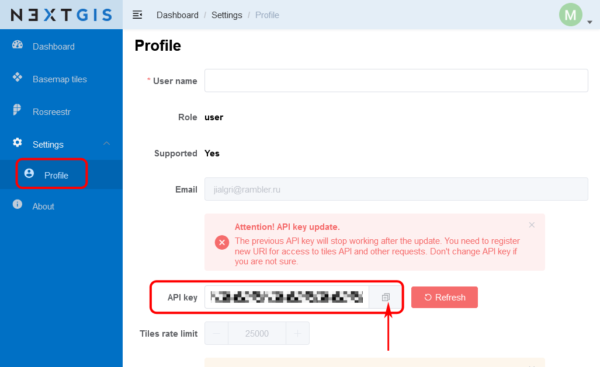
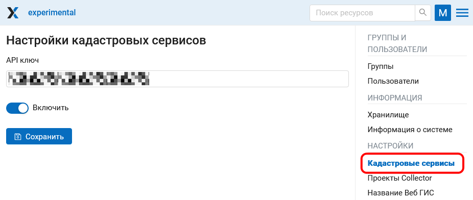
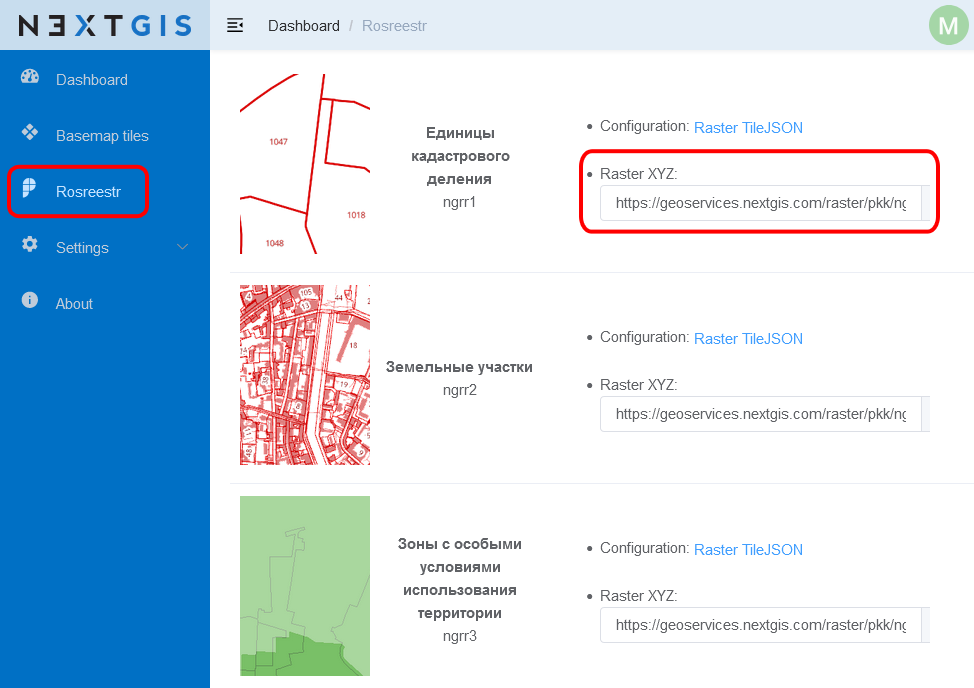
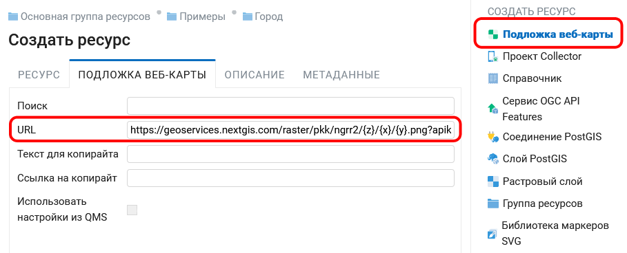
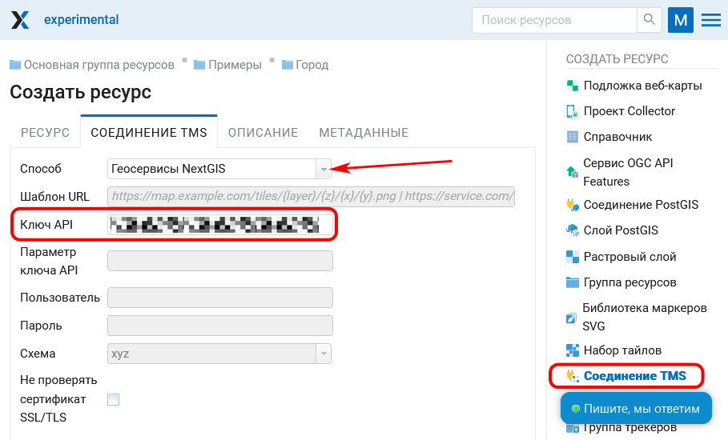
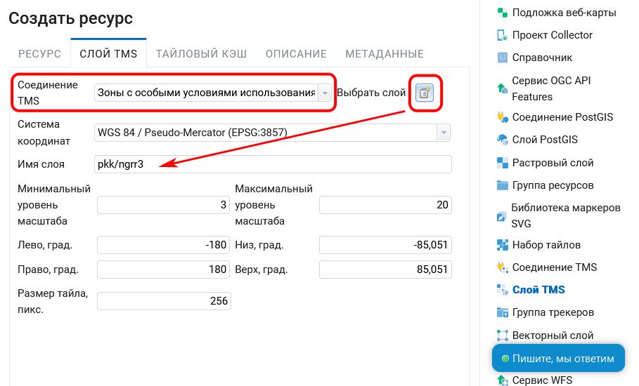
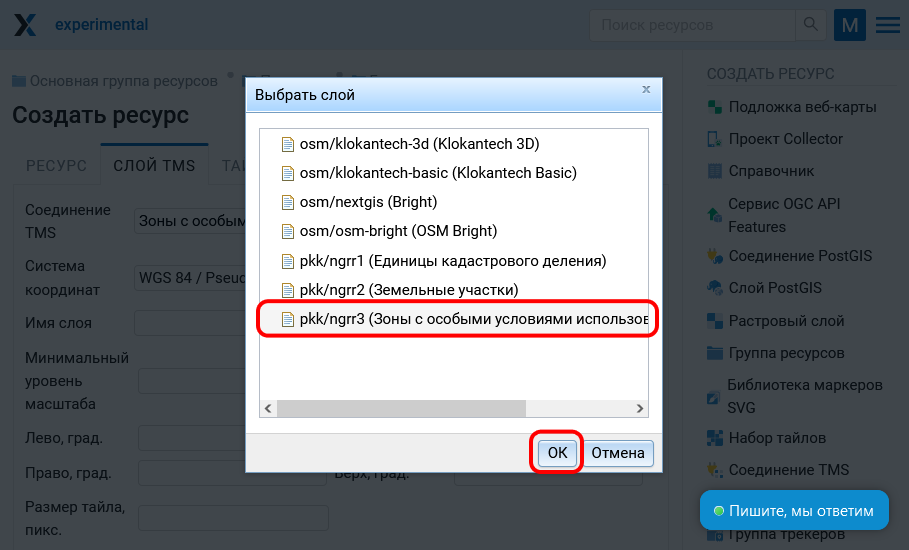
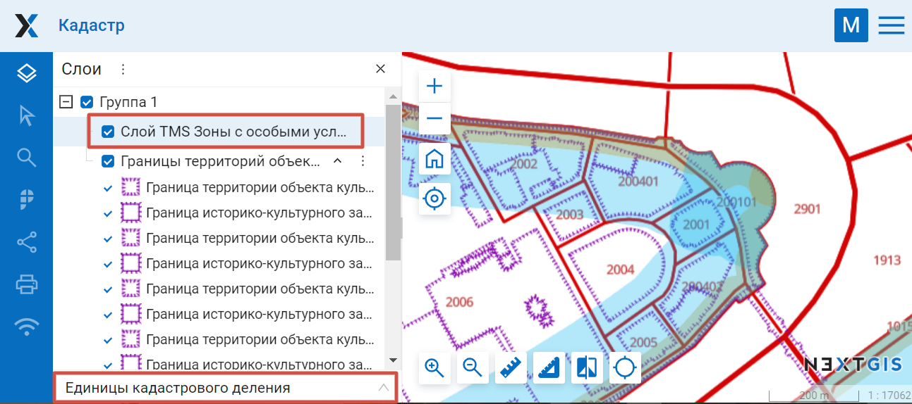
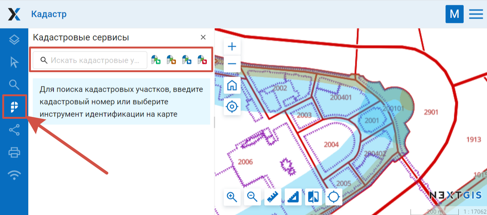
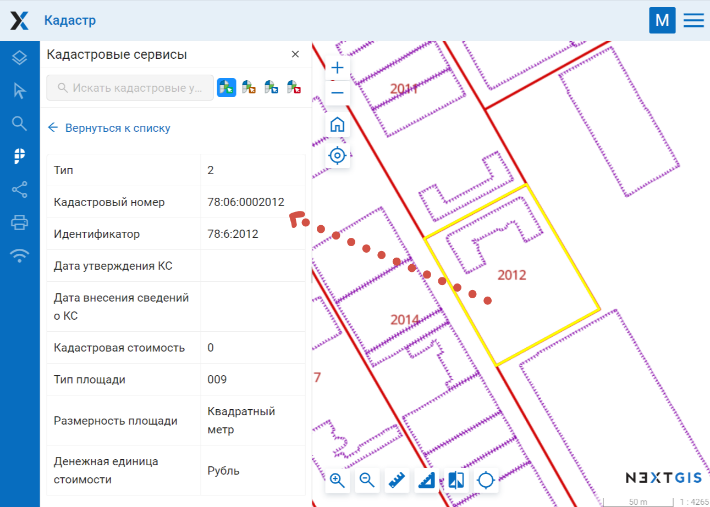

.. _ngw_cadaster:

Как работать с кадастровыми сервисами
======================================

.. note::
   Функционал доступен при наличии `Premium-подписки <https://nextgis.ru/pricing-base/>`_ или `NextGIS Web на своем сервере <https://nextgis.ru/pricing/#ngw>`_.

Кадастровые сервисы дают возможность пользователю идентифицировать на веб-карте различные кадастровые единицы:

- Кварталы
- Земельные участки
- Объекты капитального строительства
- Зоны с особыми условиями использования территории

Для получения доступа к кадастровым сервисам необходим API ключ. 

1. Зайдите на сайт `NextGIS GeoServices <https://geoservices.nextgis.com/settings/profile>`_, авторизуйтесь с помощью NextGIS ID.
2. В разделе "Профиль" скопируйте содержимое поля "Ключ API".

   
   Ключ API в профиле пользователя Геосервисов

3. Перейдите в свою ВебГИС. В панели управления откройте Настройки --> Кадастровые сервисы.

   
   Подключение кадастровых сервисов в Панели управления

4. На странице настроек введите скопированный Ключ API, переключите ползунок в положение "Включить" и нажмите **Сохранить**.

Доступные следующие слои кадастрового деления:

1. Единицы кадастрового деления (ngrr1)
2. Земельные участки (ngrr2)
3. Зоны с особыми условиями использования территории (ngrr3)

.. _ngw_cadaster_basemap:

Подключение подложек НСПД
--------------------------------

.. note:: Этот функционал доступен только для Веб ГИС в облаке.

Для того, чтобы подключить один из этих слоёв в качестве подложки, скопируйте его URL.

   
   URL слоя на сайте Геосервисов

Создайте в своей ВебГИС новую подложку, добавив этот URL. `Подробнее о создании подложек <https://docs.nextgis.ru/docs_ngweb/source/webmaps_admin.html#ngw-create-basemap>`_.

   
   Добавление слоя земельных участков в качестве подложки

.. _ngw_cadaster_tms:

Подключение слоев кадастрового деления через TMS
---------------------------------------------------

Если на карте нужно отобразить одновременно несколько слоев кадастрового деления, их удобнее подключить через TMS.

Для этого сначала нужно создать **соединение TMS**.

В диалоге создания ресурса выберите в выпадающем меню "Геосервисы NextGIS" и введите свой ключ API (получить ключ API можно на сайте `NextGIS GeoServices <https://geoservices.nextgis.com/settings/profile>`_).

   
   Создание TMS-соединения для Геосервисов

Для завершения нажмите **Создать**.

Затем нужно создать **слой TMS**. В настройках слоя выберите созданное на предыдущем шаге соединение. При помощи кнопки справа выберите нужный слой. Его имя и другие параметры автоматически подставятся в соответствующие поля.

   
   Создание TMS-слоя 

   
   Выбор нужного слоя из TMS-соединения

Для завершения нажмите **Создать**.

Далее этот слой можно `добавить на веб-карту <https://docs.nextgis.ru/docs_ngweb/source/webmaps_admin.html#ngw-map-layers>`_.

   
   Слои кадастрового деления отображаются на веб-карте как слой TMS (ЗОУИТ) и подложка (Единицы кадастрового деления)

.. _ngw_cadaster_identify:

Получение информации о кадастровых единицах
----------------------------------------------------

После подключения кадастровых сервисов панель с инструментами идентификации кадастровых единиц |panel_cadaster| становится доступна в любой карте Веб ГИС. Настроить доступность этой панели можно для `Веб ГИС в целом <https://docs.nextgis.ru/docs_ngweb/source/cadaster.html#control-panel-cadaster-pic>`_ или для `отдельной веб-карты <https://docs.nextgis.ru/docs_ngweb/source/webmaps_admin.html#ngw-map-additional>`_.

.. |panel_cadaster| image:: _static/panel_cadaster.png

   
   Инструменты идентификации кадастровых единиц 

Доступны следующие инструменты:

#. Поиск по кадастровым номерам
#. Идентификация кадастровых кварталов
#. Идентификация земельных участков
#. Идентификация объектов капитального строительства
#. Идентификация зон с особыми условиями использования территории

Для того, чтобы получить информацию по объекту, выберите инструмент и кликните им в нужном месте карты. Будет показан список объектов, в которые входит эта точка. Нажмите на идентификатор, чтобы открыть карточку объекта. Зум карты будет установлен по этому объекту. Чтобы посмотреть другие найденные объекты, нажмите **Вернуться к списку**.

   
   Пример использования инструмента идентификации. Желтым выделен идентифицируемый объект 

.. _ngw_cadaster_link:

Ссылка на объект по кадастровому номеру
---------------------------------------

Для того, чтобы сгенерировать ссылку на объект, вам нужно знать адрес веб-карты и кадастровый номер объекта.

Скопируйте **ссылку на веб-карту**, например https://demo.nextgis.ru/resource/3931/display?panel=layers, где *demo* - это имя Веб ГИС, а *3931* - ID веб-карты.

Воспользуйтесь `инструментом идентификации <https://docs.nextgis.ru/docs_ngweb/source/cadaster.html#ngw-cadaster-identify>`_ кадастровых кварталов или земельных участков и скопируйте **кадастровый номер** из карточки объекта.

В ссылке на веб-карту замените часть, которая идет после *display* на ``?cadno=`` + кадастровый номер.

Итоговая ссылка имеет следующий вид: https://demo.nextgis.ru/resource/3931/display?cadno=77:04:0004019

При переходе по ссылки карта откроется на начальном охвате с активной панелью поиска по кадастровым номерам. нажмите на идентификатор объекта, чтобы перейти к нему на карте и отобразить его данные.

Этот механизм можно использовать и для поиска объекта на веб-карте, если вы знаете его кадастровый номер.

