.. _collector:

.. _nextgis.com: http://nextgis.com/
.. _NextGIS Collector: https://play.google.com/store/apps/details?id=com.nextgis.collector

Проекты сбора данных Collector
======================================

Создав проект сбора данных в своей Веб ГИС, вы можете собирать данные в векторные слои при помощи мобильного приложения `NextGIS Collector`_.

Для этого нужно выполнить следующие действия:

1. Добавить сборщиков в `список участников сбора данных <https://docs.nextgis.ru/docs_ngweb/source/collector.html#ngw-collector-add-members>`_;
2. Создать `векторный слой и при желании форму сбора данных <https://docs.nextgis.ru/docs_ngweb/source/collector.html#collector-create-form>`_;
3. Создать и настроить `проект сбора данных <https://docs.nextgis.ru/docs_ngweb/source/collector.html#ngw-collector-create-project>`_.

После этого участники проекта могут начать сбор данных в приложении `NextGIS Collector`_.

.. _ngw_collector_add_members:

Участники проекта сбора данных
-------------------------------

.. todo:: Частично дублирует https://docs.nextgis.ru/docs_ngcom/source/collector.html#collector-add-members

В разделе Панели управления "Проекты Collector" настраивается список участников, которые могут быть включены в `проекты сбора данных <https://docs.nextgis.ru/docs_ngweb/source/collector.html#ngc-list-collectors-pic>`_. Каждый участник должен иметь аккаунт `NextGIS ID <https://docs.nextgis.ru/docs_ngcom/source/create.html#nextgis-id>`_.

.. figure:: _static/ngc-stages-004_ru.png
   :name: list_of_collectors_empty_pic
   :align: center
   :width: 20cm

   Общий вид страницы «Список участников»

Для добавления участника сбора данных в Веб ГИС необходимо нажать кнопку **Создать**, вы будете перенаправлены на страницу «Создать нового участника». Здесь необходимо ввести полный email-адрес NextGIS ID.

.. note::
    Рекомендуется заполнять поле «Описание» фамилией и именем участника команды по сбору данных, чтобы в дальнейшем иметь данные о пользователях NextGIS Collector в одном месте. 
    В таблице пользователей работает поиск.

.. figure:: _static/ngc-stages-005_ru.png
   :name: create_collector_pic
   :align: center
   :width: 20cm

   Создание нового участника команды по сбору данных

.. figure:: _static/ngc-stages-006_ru.png
   :name: list_of_collectors_pic
   :align: center
   :width: 20cm

   Пример заполненной таблицы участников команды по сбору данных

Зарегистрированные пользователи смогут при установке мобильного приложения `NextGIS Collector`_ и успешной авторизации в нем получить доступ к проектам сбора данных из вашей Веб ГИС и начать сбор данных.

.. note::
   Если вам нужно добавить несколько участников, это доступно на плане Premium и в `NextGIS Web Extended, развёрнутой на своём сервере <https://nextgis.ru/pricing/#ngwextended>`_

   `Перейти на Премиум <https://my.nextgis.com/subscription/update>`_

Однако в каждом отдельном проекте вы сможете контролировать доступ различных пользователей.

Теперь можно переходить к созданию ресурсов в Веб ГИС.

.. _ngw_collector_create_project:

Создание проекта сбора данных
------------------------------

.. todo:: Дублирует https://docs.nextgis.ru/docs_ngcom/source/collector.html#collector-create-project

Проект сбора данных - это ресурс в вашей Веб ГИС, который представляет собой набор слоев данных для редактирования. 
В Веб ГИС «проект сбора данных» сокращенно называется «Проект Collector». 
Проект сбора данных предоставляет возможность участнику сбора данных редактировать слои, содержащиеся в нём. Владелец Веб ГИС имеет возможность ограничивать доступ к проекту отдельным участникам сбора данных.

Перед тем, как создавать проект сбора данных, нужно:

1. Добавить нужных пользователей в Список участников сбора данных `в Панели управления <https://docs.nextgis.ru/docs_ngweb/source/collector.html#ngw-collector-add-members>`_.

2. `Создать необходимые слои данных <https://docs.nextgis.ru/docs_ngweb/source/layers.html#ngw-create-empty-vector-layer>`_ или `загрузить имеющиеся <https://docs.nextgis.ru/docs_ngweb/source/layers.html#ngw-process-create-vector-layer>`_ и при желании добавить к ним `формы <https://docs.nextgis.ru/docs_ngweb/source/collector.html#collector-create-form>`_.

.. _project_wizard:

Мастер настройки проектов сбора данных
~~~~~~~~~~~~~~~~~~~~~~~~~~~~~~~~~~~~~~~

Чтобы создать новый проект, перейдите в Основную группу ресурсов и выберите в меню справа **Настроить проект Collector**.

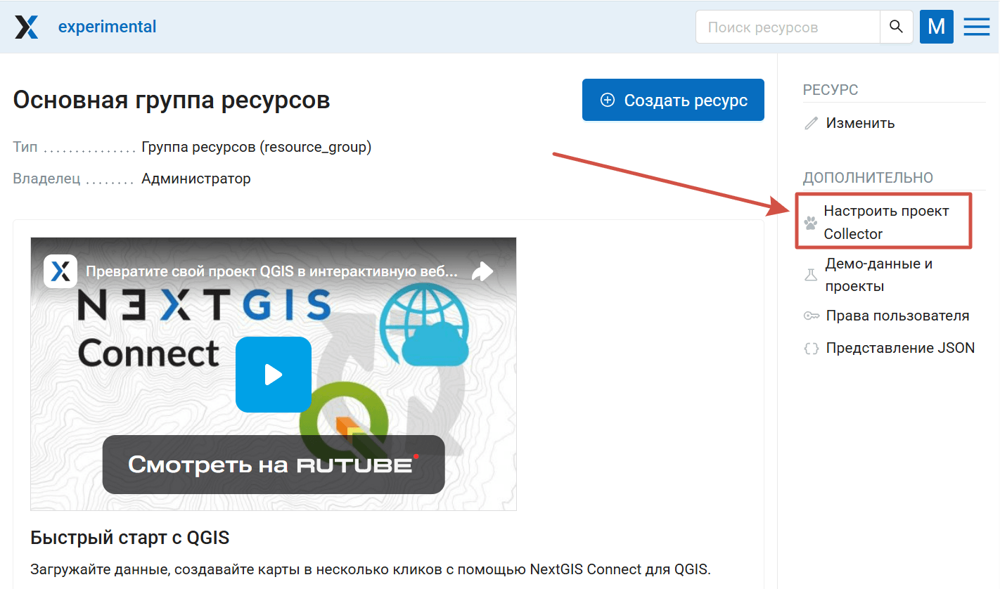

   Активация мастера настройки проектов

Откроется страница настройки проекта, отличающаяся от обычного интерфейса создания ресурсов. 

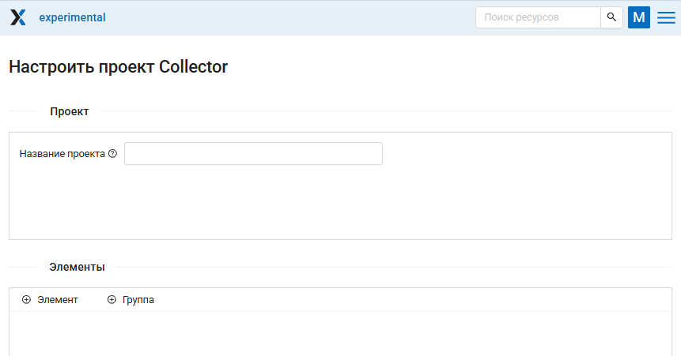

   Интерфейс быстрого создания проекта Collector

Нужно заполнить всего несколько полей.

* **Название проекта** - в Веб ГИС будет создана папка с этим названием, внутри которой будет располагаться файл проекта Collector и веб-карта для отображения результатов.
* **Элементы проекта**

Элементом проекта Collector может быть:

* форма для сбора данных,
* редактируемый слой данных, 
* слой данных только для отображения, 
* картографическая подложка. По умолчанию в проект включается стандартная подложка, но вы можете также `создать другую <https://docs.nextgis.ru/docs_ngweb/source/webmaps_admin.html#ngw-create-basemap>`_ и добавить её отдельным элементом.

Для добавления элемента нажмите **+ Элемент**.

* Чтобы добавить **редактируемый слой данных** выберите *слой* (или, если в слое две и более форм сбора данных, можно выбрать *одну или несколько форм*);
* Чтобы добавить **слой только для отображения**, выберите его *стиль*;
* Чтобы добавить отличную от стандартной **подложку**, отметьте ресурс подложки. 

Можно добавить несколько элементов сразу. В частности, при необходимости вы можете добавить несколько разных форм одного и того же слоя.

Элементы, выбранные для добавления, отмечаются галочкой. Слой, если выбран его стиль или одна из форм внутри него, отмечается синей точкой. 

Вы можете перемещаться между группами ресурсов и отмечать нужные элементы. На кнопке **Выбрать отмеченное** внизу отображется общее количество выбранных ресурсов. Чтобы снять выделение, нажмите кнопку |button_clear_selection| рядом с ней.

.. |button_clear_selection| image:: _static/button_clear_selection.png
   :alt: с крестиком
   :width: 8mm 

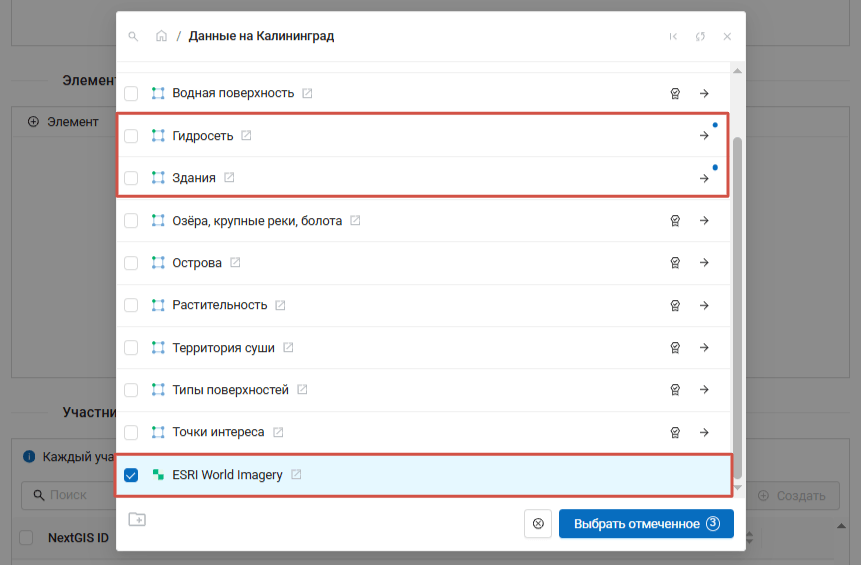

   Добавление элементов в проект

Внутри дерева элементов работает перетягивание. Чтобы удалить элемент из списка, кликните Х в конце строки. 

При нажатии на элемент можно посмотреть и отредактировать его параметры.

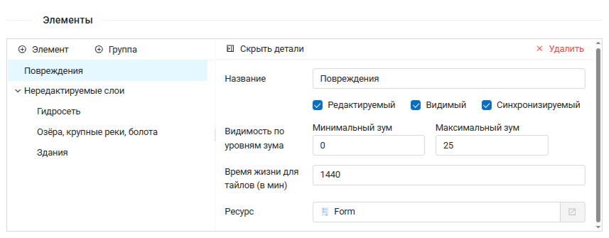

   Параметры элемента

Каждый элемент проекта Collector имеет следующие параметры:

- «Название» - название слоя, которое будет доступно в мобильном приложении NextGIS Collector.
- «Редактируемый» - будет ли пользователь мобильного приложения NextGIS Collector иметь возможность редактирования слоя.
- «Видимый» - контролирует видимость слоя в в мобильном приложении NextGIS Collector.
- «Синхронизируемый» - будут ли правки слоя синхронизироваться с вашей Веб ГИС.
- «Видимость по уровням зума» - определяет, при каком приближении карты виден этот слой. Включает два параметра: «Минимальный зум» и «Максимальный зум».
- «Время жизни» - время кэширования тайлов (актуален для тайловых слоев).

Чтобы вернуться к списку элементов, нажмите "Скрыть детали".

* **Участники** - здесь отмечаются пользователи, которые будут вносить данные через приложение. Чтобы дать участнику доступ к проекту, отметьте его флажком.

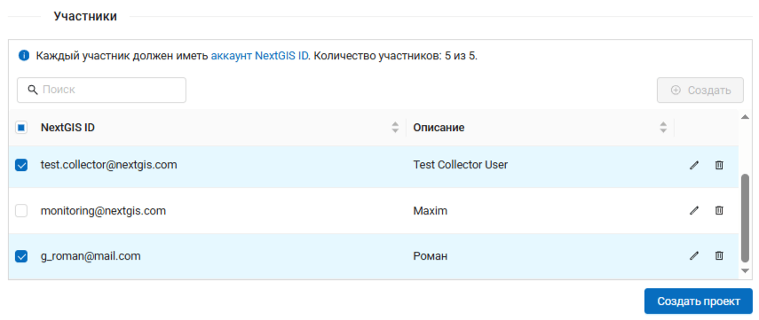

   Выбор участников проекта

Администратор Веб ГИС может в этом же окне управлять общим списком участников, добавлять новых и удалять лишних. Обратите внимания, что эти изменения применяются сразу, даже если вы не закончили создание проекта.

Нажмите **Создать**, чтобы завершить создание проекта.

Отроется страница созданного проекта внутри папки с заданным названием.

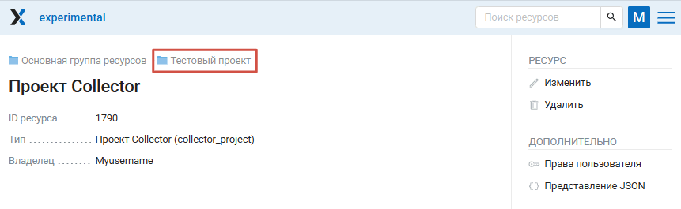

   Созданный проект сбора данных

По умолчанию сборщики будут видеть в приложении проект под названием "Проект Collector". Чтобы задать своё название для проекта (например, если у вас их несколько), нажмите |button_edit| Изменить в меню справа и введите новое наименование (см. :numref:`ngc_proj_name_pic`).

.. |button_edit| image:: _static/button_edit.png
   :alt: карандаш
   :width: 6mm

Если нажать на название папки наверху, вы перейдёте в группу ресурсов и увидите три созданных ресурса с наименованиями по умолчанию: проект Collector, веб-карту, на которую добавлены те же слои для визуализации собранных данных, и стандартную подложку.

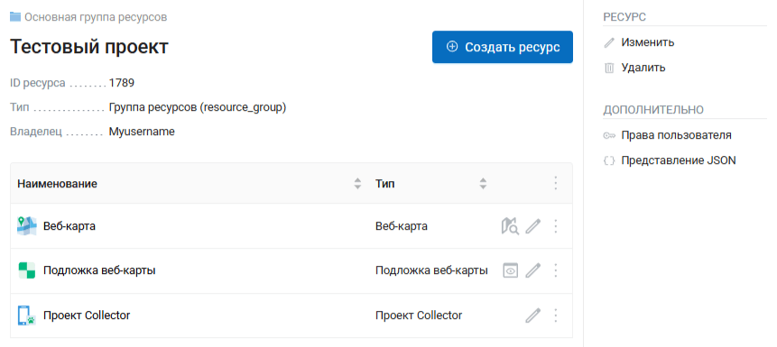

   Папка, содержащая проект, подложку и веб-карту

Если у слоёв, подключённых в проект как редактируемые, не было формы сбора данных или стиля, они создаются автоматически. Затем можно при необходимости отредактировать  `форму <https://docs.nextgis.ru/docs_ngweb/source/collector.html#collector-create-form>`_ или `стиль <https://docs.nextgis.ru/docs_ngweb/source/mapstyles.html#qgis>`_ через диалог изменения ресурса.

Если вы опытный пользователь и хотите создать проект `с более тонкими настройками <https://docs.nextgis.ru/docs_ngweb/source/collector.html#project-manually>`_, это можно сделать через стандартное меню создания ресурса.

.. _project_manually:

Создание проекта сбора данных вручную
~~~~~~~~~~~~~~~~~~~~~~~~~~~~~~~~~~~~~

Проект Collector также можно создать через стандартный интерфейс созданя ресурса.

Перейдите в группу ресурсов, где вы хотите создать проект, нажмите **Создать ресурс** и выберите тип ресурса «Проект Collector»:

.. figure:: _static/select_create_collector_project_ru.png
   :name: create_collector_project_pic
   :align: center
   :width: 20cm

   Выбор типа создаваемого ресурса «Проект Collector»

Введите наименование проекта. Под этим имененм проект будет доступен в мобильном приложении `NextGIS Collector`_:

.. figure:: _static/ngc_proj_name_ru.png
   :name: ngc_proj_name_pic
   :align: center
   :width: 20cm

   Окно создания проекта Collector

На вкладке «Проект» доступны следующие настройки:

* Начальный экран - опция, которая задает стартовый экран в мобильном приложении `NextGIS Collector`_ - это может быть либо список форм, либо карта.

* Начальный охват - по умолчанию карта в проекте открывается с охватом на весь мир. Можно задать другой охват в градусах вручную или выбрать слой, охват которого будет использоваться при открытии проекта.

* Настройка конфигурации мобильного проекта - тонкие настройки для использования проекта на большом количестве устройств.

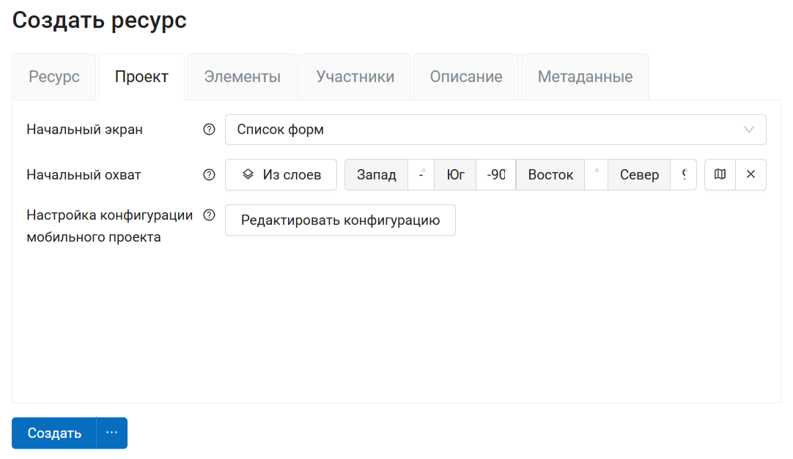

   Внешний вид вкладки «Проект»

На  вкладке "Элементы" можно добавлять элементы, объединять их в группы и удалять их (крестик в конце строки), а также менять порядок отображения слоёв перетаскиванием. 

.. figure:: _static/ngc_items_tab_add_ru.png
   :name: ngc_items_tab_add_pic
   :align: center
   :width: 20cm

   Добавление нескольких элементов в проект. Отмечено три элемента: подложка, стиль слоя, одна из форм сбора данных

Не обязательно переходить внутрь и выбирать стиль. Нажмите значок |button_pick_first| справа от имени слоя, чтобы выделить первый подходящий элемент.

.. |button_pick_first| image:: _static/button_pick_first.png
   :alt: шестиугольник с ленточкой
   :width: 8mm

Кнопка  **+ Группа** позволяет создать группу элементов. Внутри дерева элементов работает перетягивание. Чтобы удалить элемент из списка, кликните Х в конце строки. 

.. figure:: _static/ngc_items_tab_ru.png
   :name: ngc_items_tab_pic
   :align: center
   :width: 20cm

   Внешний вид вкладки «Элементы»

Далее необходимо предоставить доступ участникам сбора данных. 

На вкладке «Участники» отметьте тех участников сбора данных, которые должны участвовать в этом проекте:

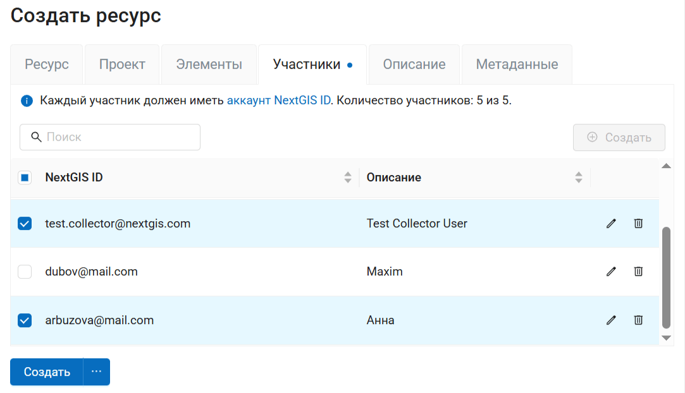

   Внешний вид вкладки «Участники»

Администратор может редактировать список участников в этой панели или  `в Панели управления <https://docs.nextgis.ru/docs_ngweb/source/collector.html#ngw-collector-add-members>`_.

Нажмите кнопку **Создать**, чтобы сохранить проект.

В результате будет создан проект Collector (проект по сбору данных).

Таких проектов в вашей Веб ГИС может быть неограниченное количество. В каждом из проектов вы можете ограничивать или разрешать доступ только определенному набору участников из группы участников по сбору данных.

.. _collector_create_form:

Форма сбора данных
---------------------

Собираемые данные сохраняются в базу данных векторного слоя. 
Внутри ресурса слоя можно добавить пользовательскую форму сбора данных - более интуитивный интерфейс, который сборщики будут видеть в приложении.

При создании проекта формы для добавленных в него слоёв добавляются автоматически.

Зайдите в ресурс слоя, для которого хотите создать форму сбора данных. Нажмите кнопку **Создать ресурс** и выберите тип ресурса "Форма".

.. figure:: _static/ngweb_create_form_ru.png
   :name: ngweb_create_form_pic
   :align: center
   :width: 16cm

   Выбор типа создаваемого ресурса «Форма»

В открывшемся окне на вкладке "Форма" у вас есть два варианта:

* собрать форму в конструкторе;
* загрузить файл NGFP. 

Для того, чтобы создать новую форму в конструкторе, перетащите нужные элементы из списка слева в поле посередине. При добавлении элемента нужно выбрать поле, в которе будут записываться данные из этого элемента. Можно выбрать одно из существующих полей слоя или добавить новое.

Если в вашем слое уже задана структура, выберите подходящее поле из списка.

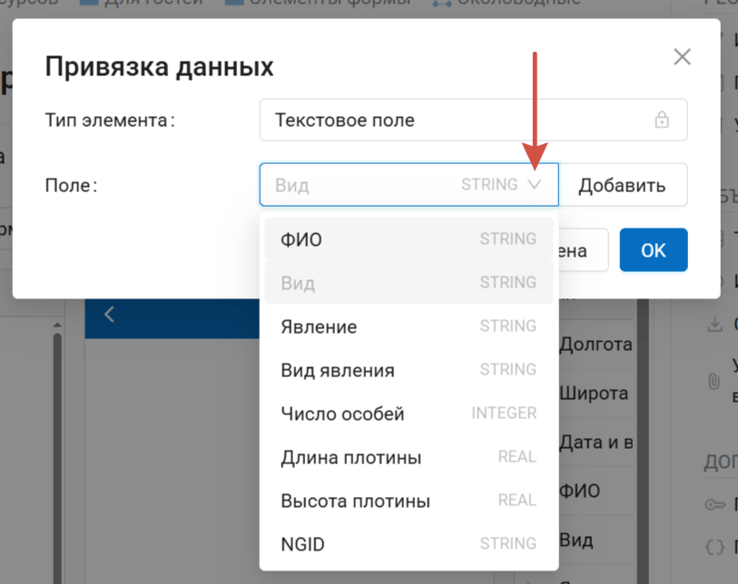

   Выбор из существующих полей

Можно создать пустой слой без атрибутов, и затем задать его структуру путём создания формы.

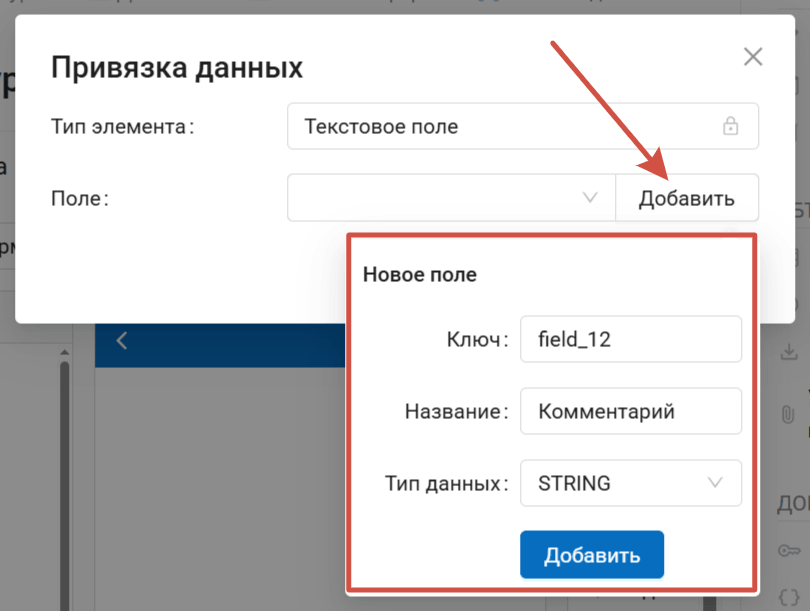

   Добавление нового поля

Отметьте **Добавить недостающие поля в слой**, чтобы новые поля были добавлены в слой. 

Щелкните по элементу, чтобы изменить его свойства. `Подробнее о настройках элементов формы <https://docs.nextgis.ru/docs_ngweb/source/form_elements.html>`_.

.. figure:: _static/form_build_ru.png
   :name: form_build_pic
   :align: center
   :width: 20cm

   Построение формы при помощи конструктора. Показаны свойства добавленного элемента "Дата и время"

Также можно задать наименование формы во вкладке "Ресурс" и ввести описание и метаданные на соответствующих вкладках.

Нажмите **Сохранить** для завершения создания формы. 

Откроется страница ресурса созданной формы, на которой доступен её предпросмотр.

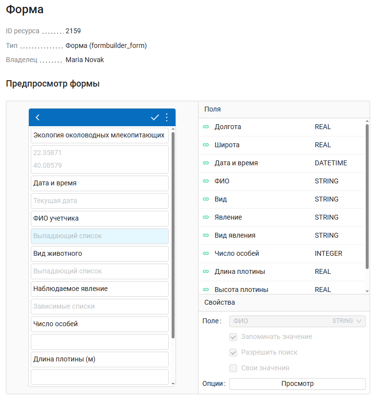

   Просмотр формы на странице ресурса

Теперь можно:

* перейти к созданию `проекта сбора данных <https://docs.nextgis.ru/docs_ngweb/source/collector.html#ngw-collector-create-project>`_,
* или `добавить слой в NextGIS Mobile <https://docs.nextgis.ru/docs_ngmobile/source/ngw_integration.html#ngmobile-add-layer-webgis>`_, форма подтянется автоматически.

Созданную форму можно **редактировать**. Для этого нажмите иконку карандаша рядом с ней или зайдите на страницу ресурса и нажмите **Изменить**. Если форма была загружена из файла, на вкладке выберите в выпадающем списке "Редактировать форму".

У одного слоя может быть **несколько** форм сбора данных. Можно подключать разные формы в разные проекты Collector или несколько форм одного слоя в один проект. 

После изменения формы в приложении Collector нужно будет выйти из проекта и войти заново. Подгрузится новая форма, через которую можно будет продолжать собирать данные в тот же слой.

После создания формы можно приступить к созданию проекта сбора данных.

.. hint:: Научим ваших сотрудников работать в нашем ПО

   Чтобы заказать корпоративное обучение, напишите нам на edu@nextgis.ru

