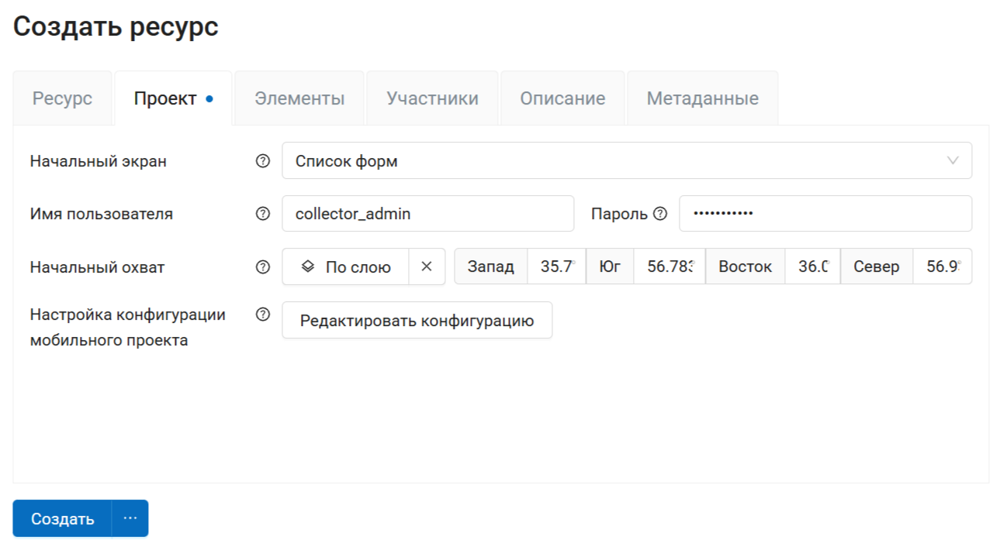
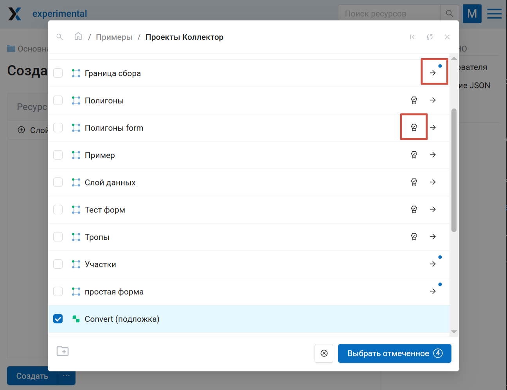
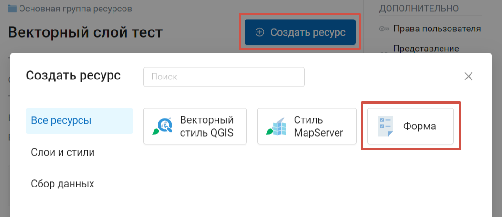
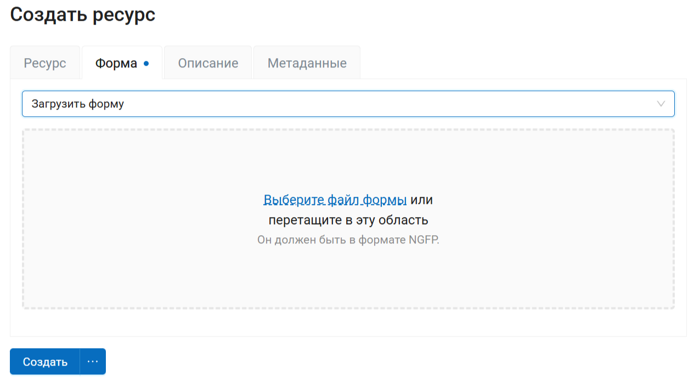
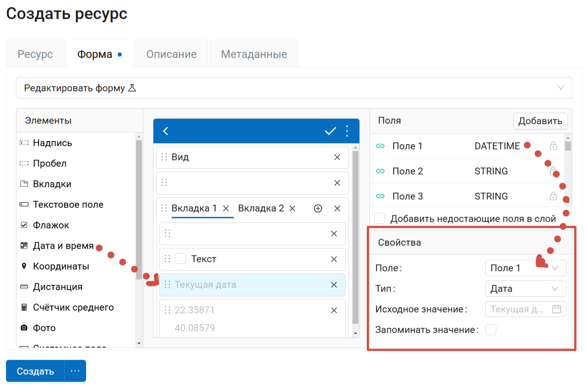

.. _collector:

.. _nextgis.com: http://nextgis.com/
.. _NextGIS Collector: https://play.google.com/store/apps/details?id=com.nextgis.collector

Проекты сбора данных Collector
======================================

Создав проект сбора данных в своей Веб ГИС, вы можете собирать данные в векторные слои при помощи мобильного приложения `NextGIS Collector`_.

.. seealso:: Подробная инструкция: `Как организовать сбор данных <https://docs.nextgis.ru/docs_ngcom/source/collector.html>`_

Здесь описано создание списка участников сбора данных, `проекта сбора данных <https://docs.nextgis.ru/docs_ngweb/source/collector.html#ngw-collector-create-project>`_ и `форм <https://docs.nextgis.ru/docs_ngweb/source/collector.html#collector-create-form>`_.

.. _ngw_collector_add_members:

Участники проекта сбора данных
-------------------------------

.. todo:: Частично дублирует https://docs.nextgis.ru/docs_ngcom/source/collector.html#collector-add-members

В разделе Панели управления "Проекты Collector" настраивается список участников, которые могут быть включены в `проекты сбора данных <https://docs.nextgis.ru/docs_ngweb/source/collector.html#ngc-list-collectors-pic>`_. Каждый участник должен иметь аккаунт `NextGIS ID <https://docs.nextgis.ru/docs_ngcom/source/create.html#nextgis-id>`_.

.. figure:: _static/ngc-stages-004_ru.png
   :name: list_of_collectors_empty_pic
   :align: center
   :width: 20cm

   Общий вид страницы «Список участников»

Для добавления участника сбора данных в Веб ГИС необходимо нажать кнопку **Создать**, вы будете перенаправлены на страницу «Создать нового участника». Здесь необходимо ввести полный email-адрес NextGIS ID.

.. note::
    Рекомендуется заполнять поле «Описание» фамилией и именем участника команды по сбору данных, чтобы в дальнейшем иметь данные о пользователях NextGIS Collector в одном месте. 
    В таблице пользователей работает поиск.

.. figure:: _static/ngc-stages-005_ru.png
   :name: create_collector_pic
   :align: center
   :width: 20cm

   Создание нового участника команды по сбору данных

.. figure:: _static/ngc-stages-006_ru.png
   :name: list_of_collectors_pic
   :align: center
   :width: 20cm

   Пример заполненной таблицы участников команды по сбору данных

Зарегистрированные пользователи смогут при установке мобильного приложения `NextGIS Collector`_ и успешной авторизации в нем получить доступ к проектам сбора данных из вашей Веб ГИС и начать сбор данных.

Однако в каждом отдельном проекте вы сможете контролировать доступ различных пользователей.

.. _ngw_collector_create_project:

Создание проекта сбора данных
------------------------------

.. todo:: Дублирует https://docs.nextgis.ru/docs_ngcom/source/collector.html#collector-create-project

Проект сбора данных - это ресурс в вашей Веб ГИС, который представляет собой набор слоев данных для редактирования. 
В Веб ГИС «проект сбора данных» сокращенно называется «Проект Collector». 
Проект сбора данных предоставляет возможность участнику сбора данных редактировать слои, содержащиеся в нём. Владелец Веб ГИС имеет возможность ограничивать доступ к проекту отдельным участникам сбора данных.

Список участников сбора данных `создаётся в Панели управления <fhttps://docs.nextgis.ru/docs_ngweb/source/collector.html#ngw-collector-add-members>`_

Вы можете создать проект сбора данных в Веб ГИС или `в настольном приложении NextGIS Formbuilder <https://docs.nextgis.ru/docs_formbuilder/source/workflow.html#nextgis-web>`_.

Если вы хотите создать проект сбора данных в Веб ГИС:

1. Сначала нужно `создать необходимые слои данных <https://docs.nextgis.ru/docs_ngweb/source/layers.html#ngw-create-empty-vector-layer>`_ или `загрузить имеющиеся <https://docs.nextgis.ru/docs_ngweb/source/layers.html#ngw-process-create-vector-layer>`_. 

2. Также вы можете `подложку <https://docs.nextgis.ru/docs_ngweb/source/webmaps_admin.html#ngw-create-basemap>`_, если сборщику на мобильном устройстве нужно будет видеть карту.

3. В группе, где вы хотите создать проект, нажмите **Создать ресурс** и выберите тип ресурса «Проект Collector»:

.. figure:: _static/select_create_collector_project_ru.png
   :name: create_collector_project_pic
   :align: center
   :width: 20cm

   Выбор типа создаваемого ресурса «Проект Collector»

4. Введите наименование проекта. Под этим имененм проект будет доступен в мобильном приложении `NextGIS Collector`_:

.. figure:: _static/ngc_proj_name_ru.png
   :name: ngc_proj_name_pic
   :align: center
   :width: 20cm

   Окно создания проекта Collector

5. На вкладке «Проект» необходимо ввести имя и пароль пользователя Веб ГИС, имеющего права на редактирование данных. Не имеет отношения к аккаунтам участников - пользователей мобильных приложений.

Также на этой вкладке доступны следующие настройки:

* Начальный экран - опция, которая задает стартовый экран в мобильном приложении `NextGIS Collector`_ - это может быть либо список форм, либо карта.

* Начальный охват - по умолчанию карта в проекте открывается с охватом на весь мир. Можно задать другой охват в градусах вручную или выбрать слой, охват которого будет использоваться при открытии проекта.

* Настройка конфигурации мобильного проекта - тонкие настройки для использования проекта на большом количестве устройств.

   Внешний вид вкладки «Проект»

6. На  вкладке "Элементы" можно добавлять элементы, объединять их в группы и удалять их (крестик в конце строки), а также менять порядок отображения слоёв перетаскиванием. 

Элемент проекта Collector может быть:

* редактируемым слоем данных, 
* слоем данных только для отображения, 
* картографической подложкой,
* формой для сбора данных.

Для добавление элемента нажмите **+ Слой**.

* Чтобы добавить **редактируемый слой данных** выберите *слой* (или, если в слое две и более форм сбора данных, можно выбрать *одну или несколько форм*);
* Чтобы добавить **слой только для отображения**, выберите его *стиль*;
* Чтобы добавить **подложку**, отметьте ресурс подложки.

Можно добавить несколько элементов сразу.

При необходимости вы можете добавить несколько разных форм одного и того же слоя.

Элементы, выбранные для добавления, отмечаются галочкой. Слой, если выбран его стиль или одна из форм внутри него, отмечается синей точкой. 

Вы можете перемещаться между группами ресурсов и отмечать нужные элементы. На кнопке **Выбрать отмеченное** внизу отображется общее количество выбранных ресурсов. Чтобы снять выделение, нажмите кнопку |button_clear_selection| рядом с ней.

.. |button_clear_selection| image:: _static/button_clear_selection.png
   :alt: с крестиком
   :width: 8mm 

   Добавление нескольких элементов в проект. Отмечено три элемента: подложка, стиль слоя, одна из форм сбора данных

Чтобы добавить слой для отображения, не обязательно переходить внутрь и выбирать стиль. Нажмите значок |button_pick_first| справа от имени слоя, чтобы выделить первый подходящий элемент.

.. |button_pick_first| image:: _static/button_pick_first.png
   :alt: editor's choice
   :width: 8mm

Кнопка  **+ Группа** позволяет создать группу элементов. Внутри дерева элементов работает перетягивание. Чтобы удалить элемент из списка, кликните Х в конце строки. 

При нажатии на элемент можно посмотреть и отредактировать его параметры.

.. figure:: _static/ngc_items_tab_ru.png
   :name: ngc_items_tab_pic
   :align: center
   :width: 20cm

   Внешний вид вкладки «Элементы»

Каждый элемент проекта Collector имеет следующие атрибуты:

- «Название» - название слоя, которое будет доступно в мобильном приложении NextGIS Collector.
- «Редактируемый» - будет ли пользователь мобильного приложения NextGIS Collector иметь возможность редактирования слоя.
- «Видимый» - контролирует видимость слоя в в мобильном приложении NextGIS Collector.
- «Синхронизируемый» - будут ли правки слоя синхронизироваться с вашей Веб ГИС.
- «Видимость по уровням зума» - определяет, при каком приближении карты виден этот слой. Включает два параметра: «Минимальный зум» и «Максимальный зум».
- «Время жизни» - время кэширования тайлов (актуален для тайловых слоев).

Чтобы вернуться к списку элементов, нажмите "Скрыть детали".

7. Далее необходимо предоставить доступ участникам сбора данных. 

Предварительно список NextGIS ID участников сбора данных должен быть `добавлен в Панели управления <https://docs.nextgis.ru/docs_ngweb/source/collector.html#ngw-collector-add-members>`_.

На вкладке «Участники» путем установления галок выбираем тех участников сбора данных, которые должны участвовать в этом проекте:

.. figure:: _static/ngc_list_collectors_ru.png
   :name: ngc_list_collectors_pic
   :align: center
   :width: 16cm

   Внешний вид вкладки «Участники»

9. Нажмите кнопку **Создать**, чтобы сохранить проект.

В результате будет создан проект Collector (проект по сбору данных).

Таких проектов в вашей Веб ГИС может быть неограниченное количество. В каждом из проектов вы можете ограничивать или разрешать доступ только определенному набору участников из группы участников по сбору данных.

.. _collector_create_form:

Форма сбора данных
---------------------

Внутри ресурса слоя можно добавить пользовательскую форму сбора данных.

Зайдите в ресурс слоя, для которого хотите создать форму сбора данных. Нажмите кнопку **Создать ресурс** и выберите тип ресурса "Форма".

   Выбор типа создаваемого ресурса «Форма»

В открывшемся окне на вкладке "Форма" у вас есть два варианта:

* загрузить файл NGFP, созданный в Formbuilder;
* собрать форму в конструкторе, выбрав вариант "Редактировать форму". 

   Загрузка файла формы

Для того, чтобы создать новую форму в конструкторе, перетащите нужные элементы из списка слева в поле посередине. Щелкните по элементу, чтобы изменить его свойства и выбрать поле, в которое будут записываться данные.

   Построение формы при помощи конструктора. Показаны свойства добавленного элемента "Дата и время"

Если отметить **Добавить недостающие поля в слой**, то для элементов, добавляемых в форму, будут добавляться новые поля. Можно создать пустой слой без атрибутов, и затем задать его структуру путём создания формы.

Также можно задать наименование формы во вкладке "Ресурс" и ввести описание и метаданные на соответствующих вкладках.

Созданную форму можно **редактировать**. Для этого нажмите иконку карандаша рядом с ней или зайдите на страницу ресурса и нажмите **Изменить**. Если форма была загружена из файла, на вкладке выберите в выпадающем списке "Редактировать форму".

У одного слоя может быть **несколько** форм сбора данных. Можно подключать разные формы в разные проекты Collector или несколько форм одного слоя в один проект. 

После изменения формы в приложении Collector выйдите из проекта и войдите заново. Подгрузится новая форма, через которую можно будет продолжать собирать данные в тот же слой.

.. note:: Форму сбора данных можно загрузить в Веб ГИС при помощи программы `Formbuilder <https://docs.nextgis.ru/docs_formbuilder/source/workflow.html>`_, создав одновременно слой, а также, при необходимости, веб-карту и проект Collector. 

