.. _collector:

.. _nextgis.com: http://nextgis.com/
.. _NextGIS Collector: https://play.google.com/store/apps/details?id=com.nextgis.collector

Collector projects
======================================

.. note::
    You can use described functionality in Web GIS created in nextgis.com_ service on `Premium plan <https://nextgis.com/pricing-base/>`_

To set up data collection:

1. Add users that are going to collect data to the `list of data collectors <https://docs.nextgis.com/docs_ngweb/source/collector.html#ngw-collector-add-members>`_;
2. Create `vector layer and data collection form <https://docs.nextgis.com/docs_ngweb/source/collector.html#collector-create-form>`_;
3. Create and configure `data collection project <https://docs.nextgis.com/docs_ngweb/source/collector.html#project-wizard>`_.

.. _ngw_collector_add_members:

List of collectors
-------------------------------

In the Collector Projects section of the Control Panel, you can manage the list of `data collectors <https://docs.nextgis.com/docs_ngcom/source/collector.html>`_. Each participant must have a `NextGIS ID account <https://docs.nextgis.com/docs_ngcom/source/create.html#how-to-create-account-nextgis-id>`_. 

.. figure:: _static/ngc-stages-004_eng_2.png
   :name: list_of_collectors_empty_pic
   :align: center
   :width: 20cm

   List of collectors

To add a team participant to the Web GIS press "Create" button.
It will redirect you to the "Create new collector" page. Make sure to type in full email address that serves as NextGIS ID login. 

.. note::
    We recommend filling up the field "Description" with the name and the surname of the team participant in order to have data about all NextGIS Collector users in one place. 
    You can always find the participant you need with a search tool in a table of Collector users, which is quite suitable when there are a lot of participants. 
 

.. figure:: _static/ngc-stages-005_eng_2.png
   :name: create_collector_pic
   :align: center
   :width: 20cm

   Creating a new data collection participant

As a result of this stage all data collection team participants will be registered in your Web GIS.

.. figure:: _static/ngc-stages-006_eng_2.png
   :name: list_of_collectors_pic
   :align: center
   :width: 20cm

   An example of a filled list of collectors

Users with a registration in your Web GIS can access data collection projects from your Web GIS and begin data collection after they installed the `NextGIS Collector <https://play.google.com/store/apps/details?id=com.nextgis.collector>`_ mobile app and successfully sign in there. 

However you can control the access of different users to each individual project. 

Now you can created the neccessary resources for data collection.

.. _collector_create_form:

Form for data collection
------------------------

Data collected by field workers is stored in a vector layer.

Create `an empty vector layer with fitting geometry <https://docs.nextgis.com/docs_ngweb/source/layers.html#ngw-create-empty-vector-layer>`_ or `upload a vector file <https://docs.nextgis.com/docs_ngweb/source/layers.html#ngw-process-create-vector-layer>`_.

For a vector layer you can create a data collection form as a child resource. It provides a user-freindly interface viewed in the Collector app.

Open the resource page of the layer, click **Create resource** and select "Form".

.. figure:: _static/ngweb_create_form_en.png
   :name: ngweb_create_form_pic
   :align: center
   :width: 20cm

   Selecting "Form" resource type

In the opened window on the Form tab you have two options:

* build a form;  
* upload a NGFP file.

To create a new form in the online builder, drag the elements from the list on the left to the middle field. Click on the element to modify it and select the field in which this data will be stored.

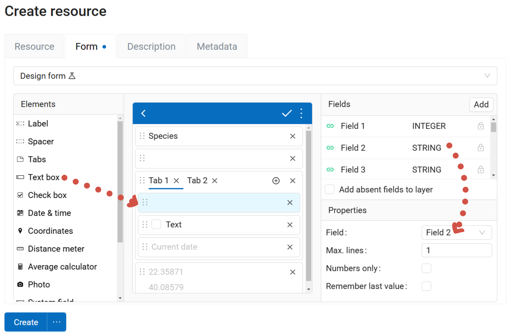

   Building a form online. Properties of the "Text box" element are displayed

If you tick **Add absent fields to layer**, fields for the added elements will be added to the layer. This allows users to create an empty layer, then set its structure by creating a form.

If your layer already has attributes, you can select the corresponding field for each element as you add it to the layout.

You can set a display name on the Resource tab and add description and metadata on the corresponding tabs.

Click **Create** to finish the process. Next you need to create a `data collection project <https://docs.nextgis.com/docs_ngweb/source/collector.html#ngw-collector-create-project>`_.

Form can be **edited**. Press the pencil icon next to it or open the resource page and click **Edit**. If the form was uploaded from a file, on the Form tab select Design form from the dropdown menu.

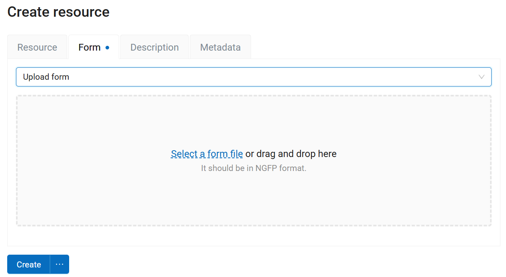

   Uploading form file

You can have **multiple** forms for one layer. Include different forms in different Collector projects or add several forms for one layer in one project. 

After a form is modified, select "Change project" and re-join the project. The new form will be uploaded, allowing you to continue collecting data to the same layer.

.. _ngw_collector_create_project:

Data collection project
---------------------------------

Data collection project is a resource in your Web GIS, it is a set of layers for editing. 
In NextGIS Web a data collection project resource is called "Collector Project".
Data collection project allows a data collection team participant to edit its layers. 
Web GIS owner can restrain access to the project for separate participants. 

Before creating a Collector project make sure you've completed the preparation:

1. Added users who are going to gather data to the `List of collectors in the Control panel <https://docs.nextgis.com/docs_ngweb/source/collector.html#ngw-collector-add-members>`_;
2. `Created <https://docs.nextgis.com/docs_ngweb/source/layers.html#ngw-create-empty-vector-layer>`_ or `uploaded <https://docs.nextgis.com/docs_ngweb/source/layers.html#ngw-process-create-vector-layer>`_ vector layers and (optionally) added `forms <https://docs.nextgis.com/docs_ngweb/source/collector.html#collector-create-form>`_ for them.
3. You can also create a `basemap <https://docs.nextgis.com/docs_ngweb/source/webmaps_admin.html#ngw-create-basemap>`_, if data collectors need to view a map while working.

.. _project_wizard:

Set up Collector project
~~~~~~~~~~~~~~~~~~~~~~~~~~~~~~~~~~~~~~~

To create a new data collection project, go to the Main resource group and select **Set up Collector project** in the menu on the right.

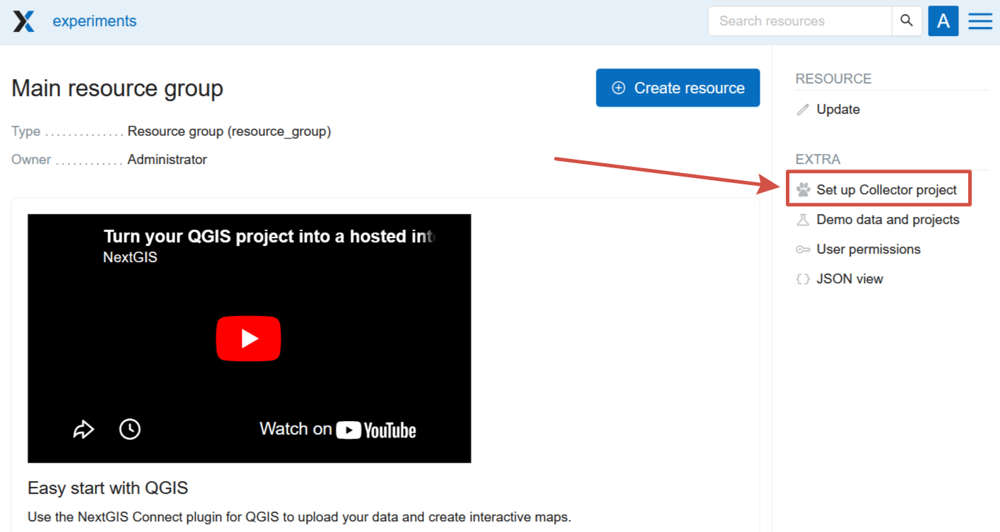

   Starting Collector project setup

A wizard page opens, different from the standard resource creating interface. 

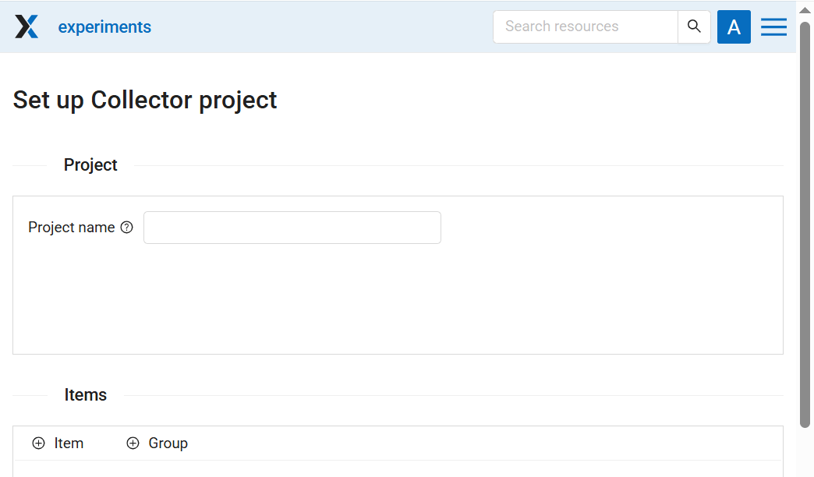

   Interface for quick setup

Fill in this form to create a project.

* **Project name** - a resource group is created in your Web GIS. This group contains the Collector project resource as well as a Web Map for data visualisation.
* **Items**

You can add:

* data collection form,
* editable vector layer, 
* display-only layer, 
* basemap. A default basemap is automatically included in the project, but you can `create another basemap <https://docs.nextgis.com/docs_ngweb/source/webmaps_admin.html#ngw-create-basemap>`_ and add is a separate item.

Click "+ Item" to add an item.

* To add an **editable data layer** select the *layer* (If a layer has two or more forms, you can select one or several of them);
* To add a **display-only layer** select its *style*;
* To add a **basemap** select the basemap resource. 

You can add multiple items at once, for example, several forms of the same vector layer.

Items selected to be added are marked with a tick. A layer that has a style or form(s) selected is marked with a blue dot. 

Navigate between resource groups and tick the items you want to add. The **Add selected** button displays the total number of selected resources. To clear the selection press the  |button_clear_selection| button next to it.

.. |button_clear_selection| image:: _static/button_clear_selection.png
   :alt: X
   :width: 8mm 

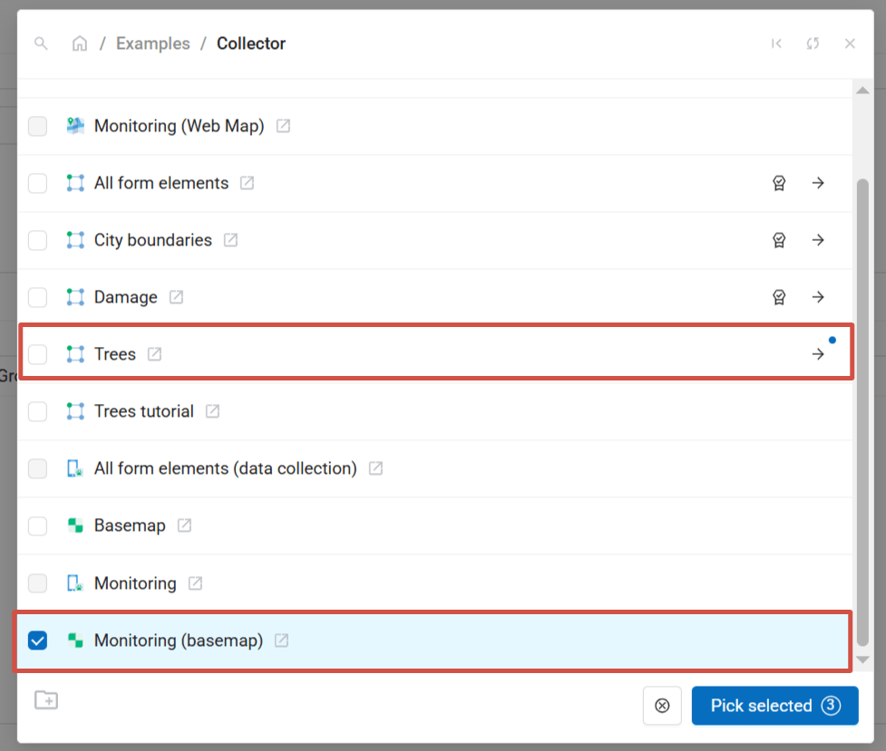

   Adding several items to a project. Items selected to be added are marked with a tick. A layer that has a style or form(s) selected is marked with a blue dot. 

Drag-and-drop to rearrange items within the item tree. To delete an item, press **X** at the end of the row. 

Click on the item to see its attributes.

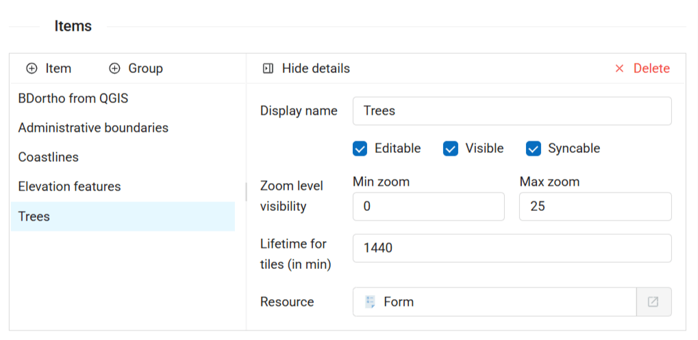

   Item settings

Each item of Collector project has the following settings:

- «Display name» - a layer name which is displayed in the NextGIS Collector mobile app. 
- «Editable» - allow or deny editing of the layer in the NextGIS Collector mobile app.  
- «Visible» - controls layer's visibility in the NextGIS Collector mobile app. 
- «Syncable» - allow or deny synchronization of the layer with your Web GIS.
- «Zoom level visibility» - defines for which zoom levels the layer is visible. It has two parameters: Min zoom and Max zoom.
- «Lifetime for tiles (in min)» - time of tiles cashing (for tile layers).

To go back to the list of items, press **Hide details**.

* **Collectors** - select the users that need to enter the data in this project. To give a user access to the project, mark the row with a tick.

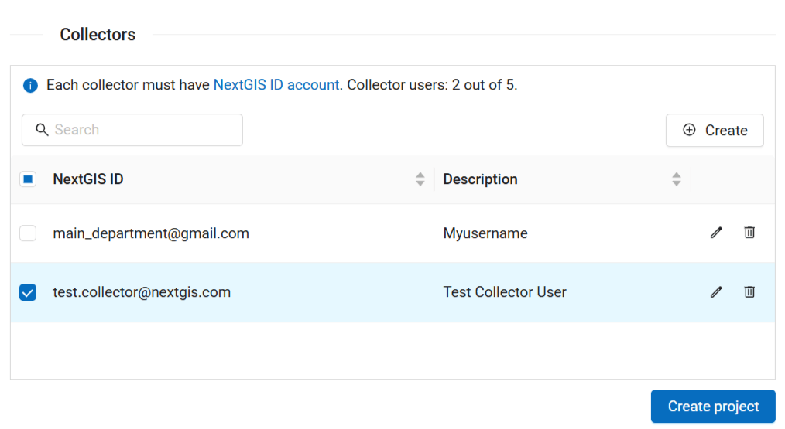

   Selecting collectors for the project

Web GIS administrator can manage the list of available collectors, add or delete them. Keep in mind, that these changes are general Web GIS settings, they are instantly effective, even if you haven't completed the project creation.

Click **Create** to complete the process.

The Collector project resource page opens. It is located inside the resource group with the name you set as the project name.

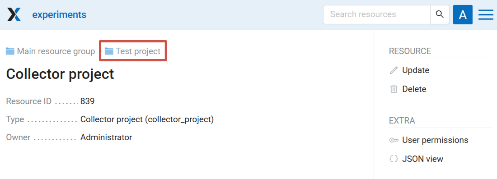

   Newly created Collector project

By default this project is displayed in the Collector mobile app as "Collector project". To set up a custom display name (it's handy if you have multiple projects going at once), click |button_edit| Update in the right menu and enter a new name (see :numref:`ngc_proj_name_pic`).

.. |button_edit| image:: _static/button_edit.png
   :alt: pencil
   :width: 6mm

Click on the group name to navigate to that group, There, you'll find three resource with default names: Collector project, Web Map with the same list of layers as the project, and a standard basemap.

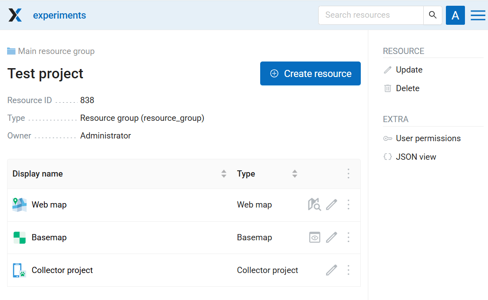

   Resource group with Collector project, Basemap and Web Map

If you're an experienced user and with to fine-tune the project as you're creating it, you can use the standard resource creation dialog.

.. _project_manually:

Advanced Collector project creation
~~~~~~~~~~~~~~~~~~~~~~~~~~~~~~~~~~~~~

An alternative way to create a Collector project is via the standard resource creation dialog.

Go to the resource group where you want to create a project, click **Create resource** and select «Collector project»:

.. figure:: _static/select_create_collector_project_en.png
   :name: create_collector_project_pic
   :align: center
   :width: 20cm

   Select «Collector project»

Name your project. This name will be displayed in the `NextGIS Collector`_ mobile app :

.. figure:: _static/ngc_proj_name_en.png
   :name: ngc_proj_name_pic
   :align: center
   :width: 20cm

   Adding name for Collector project

In the "Project" tab select "Starting screen". The starting screen in the `NextGIS Collector`_ mobile app could be a list of forms or a map. 

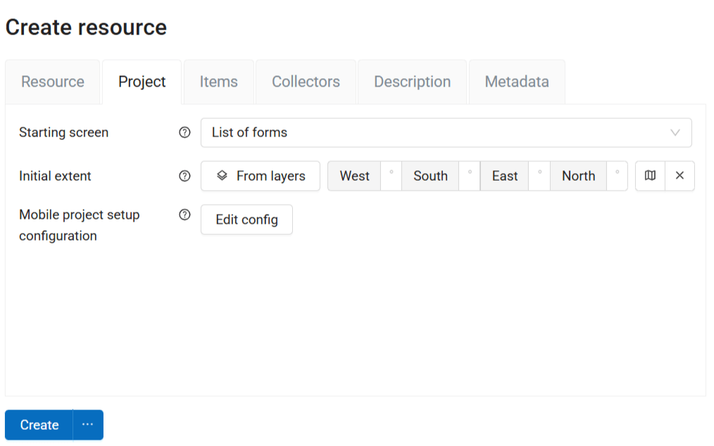

   "Project" tab

On the Items tab you can Add items, Group them, Delete (X symbol on the right) and change the order by dragging items in the list. 

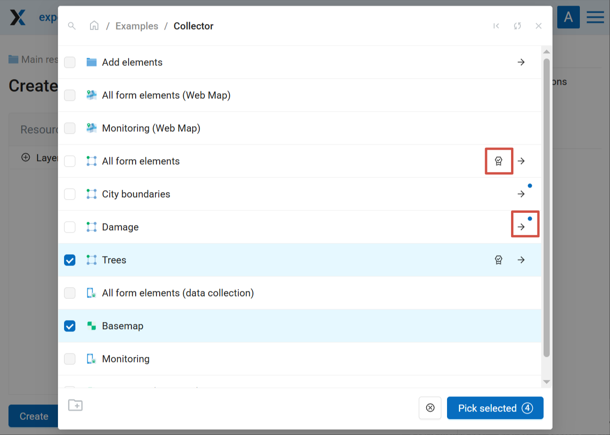

   Adding several items to a project. Four items selected: a basemap, a layer, a form and a style

Click on the item to see its attributes.

.. figure:: _static/ngc_items_tab_en.png
   :name: ngc_items_tab_pic
   :align: center
   :width: 16cm

   "Items" tab

Then on the "Collectors" tab tick the users participating in the project to give them permissions: 

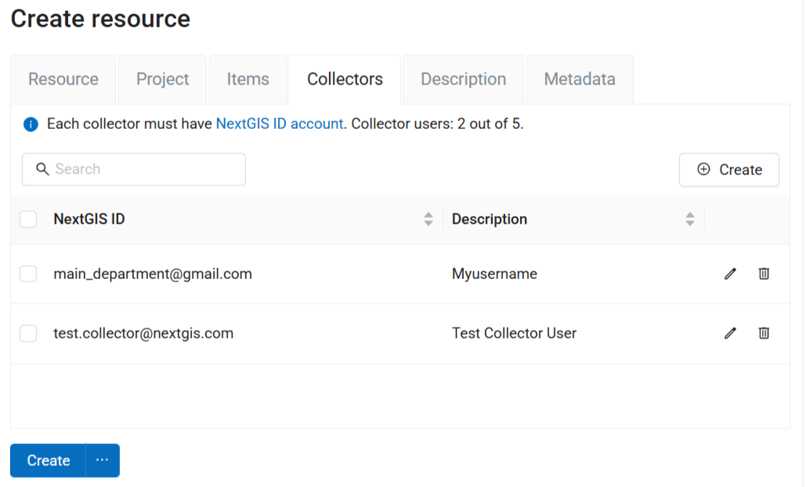

   «Collectors» tab

Web GIS administrators can manage the list of available collectors in this section or in the `Control panel <https://docs.nextgis.com/docs_ngweb/source/collector.html#ngw-collector-add-members>`_.

Click **Create**.

As a result a Collector project (data collection project) will be created.

You can have unlimited number of projects in your Web GIS. In each of them you can restrain or allow access for a particular set of users from the data collection participants list.

.. seealso:: Seems confusing? Check out our tutorial `Collect Spatial Data in the Field <https://docs.nextgis.com/docs_howto/source/tutorial_collect.html>`_ that guides you through the whole process step-by-step.