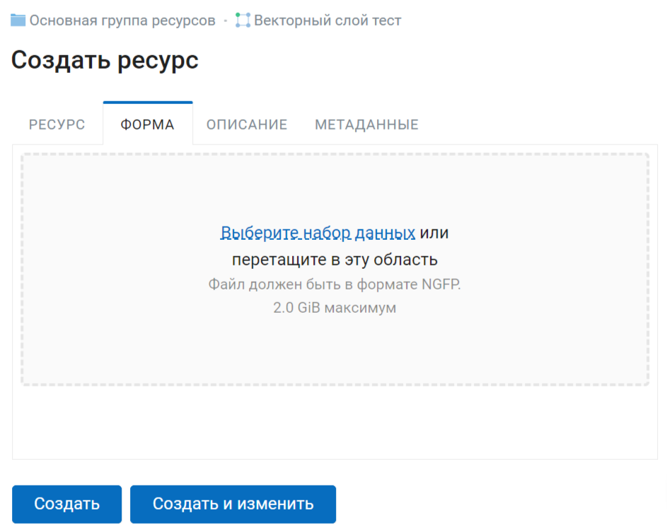

.. _collector:

.. _nextgis.com: http://nextgis.com/
.. _NextGIS Collector: https://play.google.com/store/apps/details?id=com.nextgis.collector

Проекты сбора данных Collector
======================================

.. note::
    Описываемая в данном разделе функциональность доступна в Веб ГИС, созданной с помощью сервиса nextgis.com_ и находящейся на тарифном плане `Премиум <https://nextgis.ru/pricing-base/>`_.

.. _collector_add_members:

Участники проекта сбора данных
-------------------------------

В разделе Панели управления "Проекты Collector" настраиваются участники, включенные в `проекты сбора данных <https://docs.nextgis.ru/docs_ngcom/source/collector.html>`_. Каждый участник должен иметь аккаунт `NextGIS ID <https://docs.nextgis.ru/docs_ngcom/source/create.html#nextgis-id>`_.

.. figure:: _static/ngc-stages-004_ru.png
   :name: ngc-stages-004
   :align: center
   :width: 20cm

   Общий вид страницы «Список участников»

Для добавления участника команды по сбору данных в Веб ГИС необходимо нажать кнопку «Создать»,
вы будете перенаправлены на страницу «Создать нового участника». Здесь необходимо ввести полный email-адрес NextGIS ID.

.. note::
    Рекомендуется заполнять поле «Описание» фамилией и именем участника команды по сбору данных,
    чтобы в дальнейшем иметь данные о пользователях NextGIS Collector в одном месте. В таблице пользователей
    работает поиск, поэтому всегда можно найти участника. Эта особенность становится актуальной при
    большом количестве участников.

.. figure:: _static/ngc-stages-005_ru.png
   :name: ngc-stages-005
   :align: center
   :width: 20cm

   Создание нового участника команды по сбору данных

В результате выполнения действий этого этапа в вашей Веб ГИС будут зарегистрированы участники
команды по сбору данных.

.. figure:: _static/ngc-stages-006_ru.png
   :name: ngc-stages-006
   :align: center
   :width: 20cm

   Пример заполненной таблицы участников команды по сбору данных

Зарегистрированные пользователи смогут при установке
мобильного приложения `NextGIS Collector`_ и успешной авторизации в нем получить проекты
сбора данных из вашей Веб ГИС и начать сбор данных. Однако в каждом отдельном проекте
вы сможете контролировать доступ различных пользователей.

.. _collector_create_project:

Создание проекта сбора данных
------------------------------

Проект сбора данных - это ресурс в вашей Веб ГИС, который представляет собой набор слоев
данных для редактирования. В Веб ГИС «проект сбора данных» сокращенно называется «Проект Collector».
Проект сбора данных предоставляет возможность участнику сбора данных возможность редактировать слои,
содержащиеся в нем. Владелец Веб ГИС имеет возможность ограничивать доступ к проекту
отдельным участникам сбора данных.

Вы можете создать проект сбора данных в NextGIS Formbuilder (наиболее простой вариант, описан `здесь <https://docs.nextgis.ru/docs_formbuilder/source/workflow.html#nextgis-web>`_) или в Веб ГИС.

Если вы хотите создать проект сбора данных в Веб ГИС, сначала нужно создать необходимые слои данных в NextGIS Formbuilder или загрузить имеющиеся.

Предположим, что в нашей Веб ГИС уже загружены слои данных и мы хотим создать проект
и предоставить возможность участникам сбора данных собирать или редактировать
уже имеющиеся данные нашей Веб ГИС. Для этого необходимо выполнить следующие действия:

1. Открыть Веб ГИС.

2. Создать подложку, если сборщику на мобильном устройстве нужно будет видеть карту.

3. Выбрать в панели «Создать ресурс» ссылку «Проект Collector»:

.. figure:: _static/select_create_collector_project_ru.png
   :name: ngc-stages-007
   :align: center
   :width: 20cm

   Выбор типа создаваемого ресурса «Проект Collector»

4. Ввести наименование проекта. Это наименование будет доступно в мобильном приложении `NextGIS Collector`_:

.. figure:: _static/ngc_proj_name_ru.png
   :name: ngc-stages-008
   :align: center
   :width: 20cm

   Окно создания проекта Collector

5. Далее необходимо открыть вкладку «Проект» и заполнить поля «Вид начального экрана» и
«Данные для входа NextGIS Collector».

«Вид начального экрана» - опция, которая задает стартовый экран в мобильном приложении `NextGIS Collector`_ -
это может быть либо список слоев, либо карта.

«Данные для входа NextGIS Collector» - имя и пароль пользователя Веб ГИС с соответствующими правами доступа. Не имеет отношения к аккаунтам участников, пользователей мобильных приложений.

.. figure:: _static/ngc_proj_tab_ru.png
   :name: ngc-stages-009
   :align: center
   :width: 16cm

   Внешний вид вкладки «Проект»

6. Следующий этап - добавление необходимых элементов в проект.

Элемент проекта Collector может быть редактируемым слоем данных, слоем данных только для отображения,
картографической подложкой или формой для сбора данных.

.. note::
            Добавление слоёв PostGIS в проект Collector возможно, но работа с такими слоями на данный момент не поддерживается мобильным приложением NextGIS Collector.

Добавление аналогично добавлению слоев при создании веб-карты - необходимо нажать кнопку «+ Слой»
для добавления слоя или формы сбора данных. В списке выбирайте слой, не форму. Кнопка  «+ Группа» позволяет
создать группу элементов. Внутри дерева элементов работает перетягивание. Чтобы удалить элемент из списка, кликните Х в конце строки. 

При нажатии на элемент можно посмотреть и отредактировать его параметры.

.. figure:: _static/ngc_items_tab_ru.png
   :name: ngc-stages-010
   :align: center
   :width: 20cm

   Внешний вид вкладки «Элементы»

Каждый элемент проекта Collector имеет следующие атрибуты:

- «Название» - название слоя, которое будет доступно в мобильном приложении NextGIS Collector.
- «Редактируемый» - будет ли пользователь мобильного приложения NextGIS Collector иметь возможность редактирования слоя.
- «Видимый» - контролирует видимость слоя в в мобильном приложении NextGIS Collector.
- «Синхронизируемый» - будут ли правки слоя синхронизироваться с вашей Веб ГИС.
- «Видимость по уровням зума» - определяет, при каком приближении карты виден этот слой. Включает два параметра: «Минимальный зум» и «Максимальный зум».
- «Время жизни» - время кеширования тайлов (актуален для тайловых слоев).

Чтобы вернуться к списку элементов, нажмите "Скрыть детали".

7. При необходимости, добавьте в проект подложку.

8. Далее необходимо предоставить доступ необходимым участникам группы сбора данных. На вкладке «Участники»
путем установления галок выбираем тех участников сбора данных, которые должны участвовать в этом проекте:

.. figure:: _static/ngc_list_collectors_ru.png
   :name: ngc-stages-011
   :align: center
   :width: 18cm

   Внешний вид вкладки «Участники»

9. Сохраняем проект.

В результате будет создан проект Collector (проект по сбору данных).

Таких проектов в вашей Веб ГИС может быть неограниченное количество. В каждом из проектов вы можете ограничивать или разрешать доступ только определенному набору участников из группы участников по сбору данных.

.. _collector_create_form:

Форма сбора данных
---------------------

Форму сбора данных можно загрузить в Веб ГИС при помощи программы `Formbuilder <https://docs.nextgis.ru/docs_formbuilder/source/workflow.html>`_. Также, если у вас есть файл NGFP, созданной в этой программе, вы можете на его основе создать форму в Веб ГИС через веб-интерфейс.

Зайдите в ресурс слоя, для которого хотите создать форму сбора данных.

Нажмите кнопку Создать ресурс и выберите тип ресурса "Форма".

.. figure:: _static/ngweb_create_form_ru.png
   :name: ngweb_create_form_pic
   :align: center
   :width: 20cm

   Выбор типа создаваемого ресурса «Форма»

В открывшемся окне на вкладке "Форма" загрузите файл в формате NGFP.

   Загрузка файла формы

Можно задать пользовательское наименование во вкладке "Ресурс", а также ввести описание и метаданные на соответствующих вкладках.

Через веб-интерфейс можно заменить форму сбора данных, подключаемую к слою. Создайте внутри слоя новый ресурс формы. Затем удалите старую форму. 

В приложении Collector запустите синхронизацию. Подгрузится новая форма, через которую можно будет продолжать собирать данные в тот же слой.

