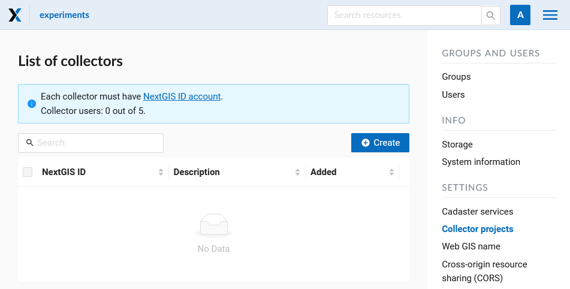
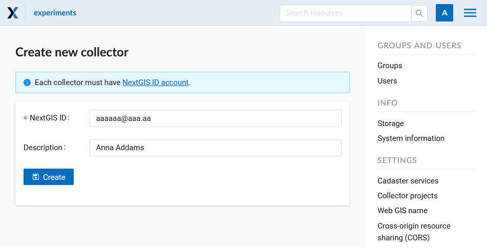
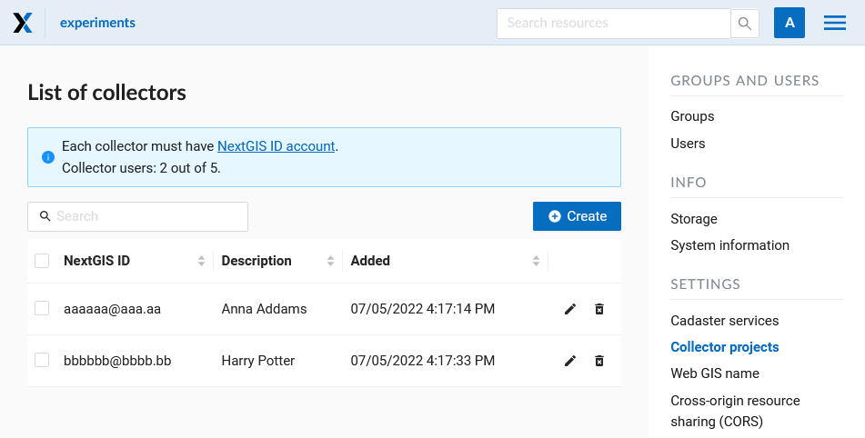
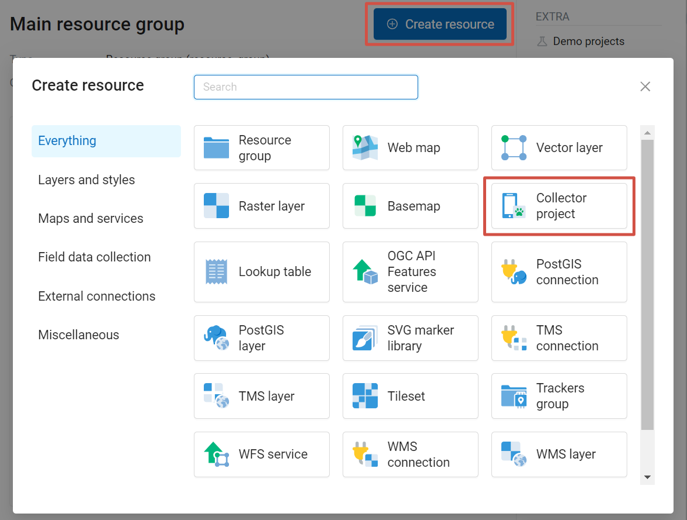
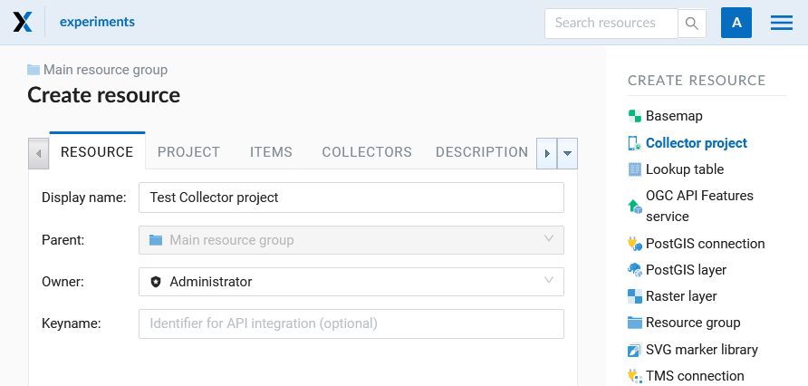
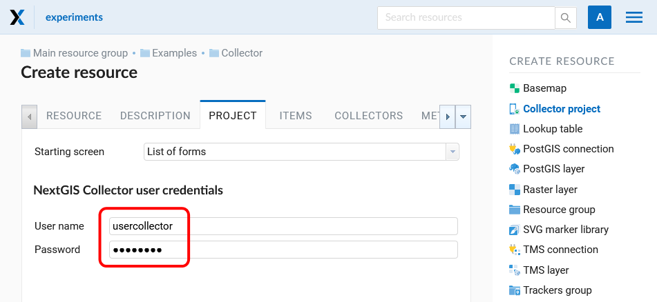
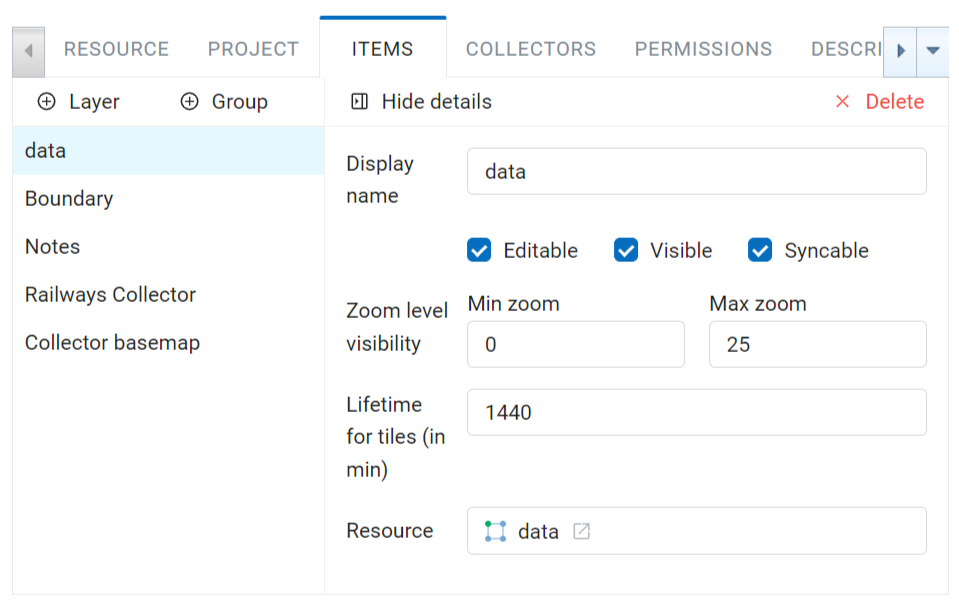
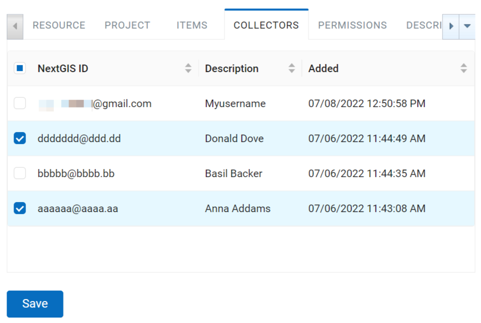
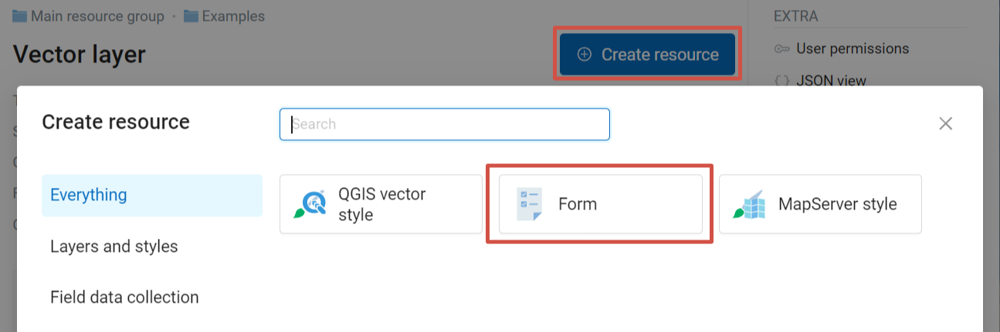
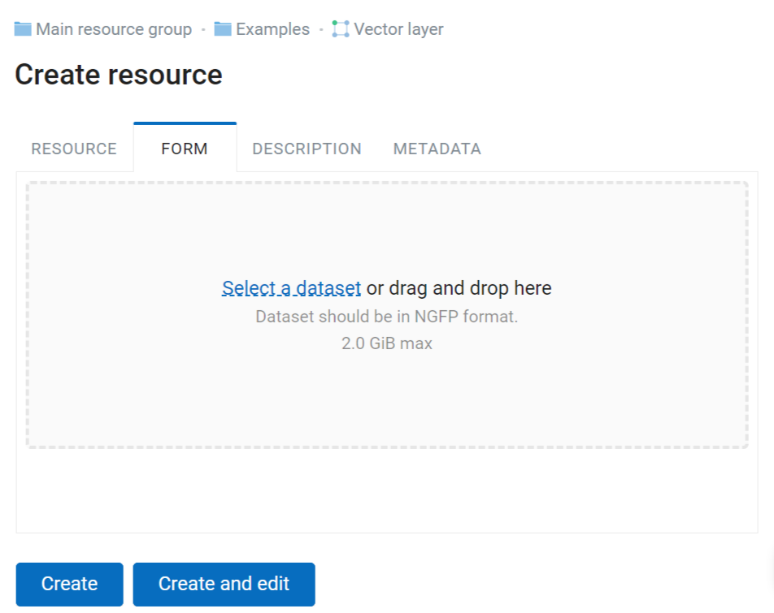

.. _collector:

.. _nextgis.com: http://nextgis.com/
.. _NextGIS Collector: https://play.google.com/store/apps/details?id=com.nextgis.collector

Collector projects
======================================

.. note::
    You can use described functionality in Web GIS created in nextgis.com_ service on `Premium plan <https://nextgis.com/pricing-base/>`_

.. _collector_add_members:

List of participants
-------------------------------

In the Collector Projects section of the Control Panel, you can manage the list of `data collectors <https://docs.nextgis.com/docs_ngcom/source/collector.html>`_. Each participant must have a `NextGIS ID account <https://docs.nextgis.com/docs_ngcom/source/create.html#how-to-create-account-nextgis-id>`_. 

   List of collectors

To add a team participant to the Web GIS press "Create" button.
It will redirect you to the "Create new collector" page. Make sure to type in full email address that serves as NextGIS ID login. 

.. note::
    We recommend filling up the field "Description" with the name and the surname of the team participant in order to have data about all NextGIS Collector users in one place. 

You can always find the participant you need with a search tool in a table of Collector users, which is quite suitable when there are a lot of participants. 
 
 

   Creating a new data collection participant

As a result of this stage all data collection team participants will be registered in your Web GIS.

   An example of a filled list of collectors

Users with a registration in your Web GIS can access data collection projects from your Web GIS and begin data collection after they installed the `NextGIS Collector <https://play.google.com/store/apps/details?id=com.nextgis.collector>`_ mobile app and successfully sign in there. 

However you can control the access of different users to each individual project. 
It is described in details below.

.. _collector_create_project:

Creating data collection project
------------------------------

Data collection project is a resource in your Web GIS, it is a set of layers for editing. 
In a Web GIS "data collection project" is called "Collector Project".
Data collection project allows a data collection team participant to edit its layers. 
Web GIS owner can restrain access to the project for separate participants. 
 

You can create a Collector project via NextGIS Formbuilder (the simplest way, described `here <https://docs.nextgis.com/docs_formbuilder/source/workflow.html#nextgis-web>`_) or in your Web GIS.

If you want to use your Web GIS to create a Collector project, first you need to create necessary data layers in NextGIS Formbuilder or upload them from a file.

Let's suppose that layers with data are already uploaded to your Web GIS, and you want to create a project and allow data collection team participants to collect or edit data in your Web GIS. 

To do it:

1. Open the Web GIS.

2. Create a basemap if the collector will need to see a map on the mobile app.

3. Press «Create resource» and select «Collector project»:

   Select «Collector project»

4. Name your project. This name will be displayed in the `NextGIS Collector`_ mobile app :

   Adding name for Collector project

In the "Project" tab select "Starting screen" and fill in "NextGIS Collector user credentials".

The starting screen in the `NextGIS Collector`_ mobile app could be a list of forms or a map. 

«NextGIS Collector user credentials» - user name and password of a Web GIS user with necessary permissions to access data used in the project. This user is not related to accounts of actual data collectors.

   "Project" tab

6. The next stage is adding necessary items to the project on the "Items" tab.

An item of Collector project could be an editable data layer, display-only data layer, basemap or a form for data collection. 

.. note::
            You could add PostGIS layers in Collector project, but the NextGIS Collector mobile app does not support work with them for now

Adding of items is like adding layers when creating a Web Map. Press the **+ Layer** button to add a layer or a data collection form. 

Select the vector layer in the resource list, not the form. Press **+ Group** to create a group of items. 
Drag-and-drop to rearrange items within the item tree. To delete an item, press **X** at the end of the row. 

Click on the item to see its attributes.

   "Items" tab

Each item of Collector project has the following attributes:

- «Display name» - a layer name which is displayed in the NextGIS Collector mobile app. 
- «Editable» - allow or deny editing of the layer in the NextGIS Collector mobile app.  
- «Visible» - controls layer's visibility in the NextGIS Collector mobile app. 
- «Syncable» - allow or deny synchronization of the layer with your Web GIS.
- «Zoom level visibility» - defines for which zoom levels the layer is visible. It has two parameters: Min zoom and Max zoom.
- «Lifetime for tiles (in min)» - time of tiles cashing (for tile layers).

To go back to the list of items, press **Hide details**.

7. Add basemap if necessary.

8. Then on the "Collectors" tab tick the users participating in the project to give them permissions: 

   «Collectors» tab

9. Press "Create".

As a result a Collector project (data collection project) will be created.

You can have unlimited number of projects in your Web GIS. In each of them you can restrain or allow access for a particular set of users from the data collection participants list.

.. _collector_create_form:

Data collection form
---------------------

Data collection form can be uploaded to Web GIS using `Formbuilder <https://docs.nextgis.com/docs_formbuilder/source/workflow.html>`_. If you have a pre-made NGFP file you can create a form in the Web interface of your Web GIS.

Open the resource page of the layer for which you want to add a form.

Press **Create resource** and select "Form".

   Selecting "Form" resource type

In the opened dialog on the "Form" tab upload a NGFP file.

   Uploading form as a file

You can set a display name on the Resource tab and add description and metadata on the corresponding tabs.

In the Web interface you can also replace an existing data collection form of a layer with a new one. Create a new form resource inside the layer. Then delete the old form. 

In the Collector app start synchronization. The new form will be uploaded, allowing you to continue collecting data to the same layer.

