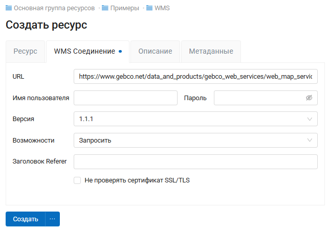
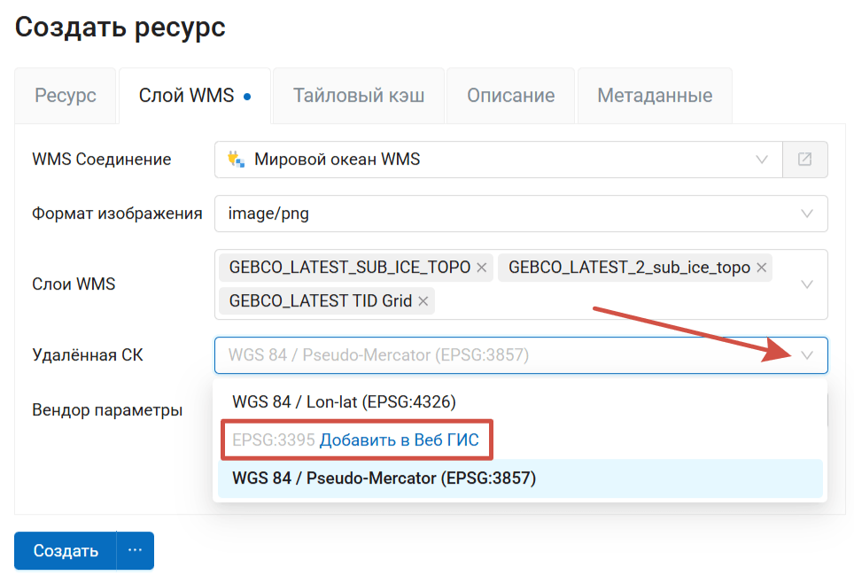

.. _ngw_connected_in:

Слои WFS, WMS, TMS
===================

NextGIS Web позволяет добавлять данные из внешних источников по стандартным протоколам:

* `WFS <https://docs.nextgis.ru/docs_ngweb/source/connections.html#ngw-wfs-in>`_,
* `WMS <https://docs.nextgis.ru/docs_ngweb/source/connections.html#ngw-wms-in>`_,
* `TMS <https://docs.nextgis.ru/docs_ngweb/source/connections.html#ngw-tms-in>`_.

Также можно создать слой `на основе базы данных PostGIS <https://docs.nextgis.ru/docs_ngweb/source/postgis_details.html>`_.

.. _ngw_wfs_in:

WFS
--------

:term:`WFS` позволяет получать данные, опубликованные на сторонних ГИС-серверах (arcgis, geoserver и т.п.), применять к ним свои стили, добавлять их на веб карты.

Сначала нужно создать соединение WFS.

.. _ngw_wfs_connection:

Соединение WFS
~~~~~~~~~~~~~~~

Нажмите кнопку **Создать ресурс** и выберите во всплывающем окне тип ресурса **Соединение WFS**.

.. figure:: _static/ngweb_create_wfs_conn_ru.png
   :name: ngweb_create_wfs_conn_pic
   :align: center
   :width: 20cm

   Выбор типа ресурса "Соединение WFS"
   
Далее можно ввести пользовательское наименование подключения, которое будет отображаться в административном веб интерфейсе.

.. figure:: _static/wfs_connection_name_ru.png
   :name: wfs_connection_name_pic
   :align: center
   :width: 16cm

   Наименование ресурса Соединение WFS
   
Также можно добавить `Описание и метаданные <https://docs.nextgis.ru/docs_ngweb/source/edit_resource.html#ngw-update-info-metada>`_.

На вкладке "Cоединение WFS" вводятся параметры подключения к **Серверу WFS**, который предоставляет данные:

* URL
* Имя пользователя 
* Пароль 
* Версия WFS

.. figure:: _static/wfs_connection_set_ru.png
   :name: wfs_connection_set_pic
   :align: center
   :width: 16cm

   Настройка подключения WFS

В случае, если выбранная версия не поддерживается, после нажатия кнопки **Создать** вы получите сообщение об ошибке:

.. figure:: _static/wfs_connection_error_ru.png
   :name: wfs_connection_error_pic
   :align: center
   :width: 16cm

   Сообщение о некорректной версии

Далее нужно создать ресурс слоя WFS.

.. _ngw_wfs_layer:

Слой WFS
~~~~~~~~~

Ресурс **Слой WFS** добавляется на базе созданного ранее Соединения WFS. Для этого следует выбрать соответствующий тип ресурса из меню создания.

.. figure:: _static/ngweb_create_wfs_layer_ru.png
   :name: ngweb_create_wfs_layer_pic
   :align: center
   :width: 20cm
   
   Выбор типа ресурса "Слой WFS"

В открывшемся окне на вкладке "Слой WFS" выберите ранее созданное Соединение WFS. Затем укажите нужный слой и поле геометрии. SRID добавится автоматически.

.. figure:: _static/wfs_layer_settings_ru.png
   :name: wfs_layer_settings_pic
   :align: center
   :width: 16cm

   Настройки слоя WFS

На вкладке "Ресурс" можно указать пользовательское название ресурса. Также можно добавить `Описание и метаданные <https://docs.nextgis.ru/docs_ngweb/source/edit_resource.html#ngw-update-info-metada>`_.

Для того, чтобы добавить слой WFS на веб-карту, у него должен быть стиль. Вы можете создать стиль QGIS по умолчанию или `добавить свой стиль <https://docs.nextgis.ru/docs_ngweb/source/mapstyles.html>`_ QGIS или Mapserver через меню "Создать ресурс".

.. figure:: _static/wfs_layer_result_ru.png
   :name: wfs_layer_result_pic
   :align: center
   :width: 16cm

   Варианты добавления стиля к созданному слою WFS

.. _ngw_wms_in:

WMS
--------

.. note:: 
	В настоящее время поддерживаются версии WMS 1.1.1 и 1.3.0.

NextGIS Web является клиентом :term:`WMS`. Для подключения слоя WMS необходимо знать его адрес и систему координат, в которой сервер отдаёт данные. 

Чтобы данные отображались, эта система координат должна быть `добавлена в Веб ГИС <https://docs.nextgis.ru/docs_ngweb/source/ngw_srs.html>`_, по умолчанию добавлены EPSG:3857 и EPSG:4326.

.. _ngw_create_wms_connection:

Соединение WMS
~~~~~~~~~~~~~~~

Для добавления слоя WMS необходимо сначала создать подключение к серверу WMS (достаточно одного соединения для множества слоёв). Нажмите кнопку **Создать ресурс** и выберите во всплывающем окне тип ресурса **Cоединение WMS**. 

.. figure:: _static/ngweb_create_wms_conn_ru.png
   :name: admin_layers_create_wms_connection
   :align: center
   :width: 20cm

   Выбор типа ресурса "Cоединение WMS"
   

В открывшемся окне укажите наименование WMS соединения. Оно будет отображаться в административном интерфейсе (не путайте это наименование и названия слоёв в базе данных). 

.. figure:: _static/create_wms_connection_name_ru.png
   :name: admin_layers_create_wms_connection_name
   :align: center
   :width: 14cm

   Наименование Соединения WMS

Также можно добавить `Описание и метаданные <https://docs.nextgis.ru/docs_ngweb/source/edit_resource.html#ngw-update-info-metada>`_.

.. figure:: _static/admin_layers_create_wms_connection_metadata_rus_2.png
   :name: admin_layers_create_wms_connection_metadata
   :align: center
   :width: 20cm

   Метаданные Соединения WMS

На вкладке "Cоединение WMS" вводятся параметры подключения (:numref:`ngweb_admin_layers_create_wms_connection_url`) к **Серверу WMS**, который предоставляет данные:

* URL
* Имя пользователя 
* Пароль 
* Версия WMS
* Возможности (управление запросом ``GetCapabilites`` к WMS-серверу)
* Заголовок Referer - можно указать http-заголовок, посылаемый при запросе данных с удаленного сервера, если он необходим для получения доступа
* Не проверять сертификат SSL/TLS

Поле URL является обязательным, остальные используются по необходимости.

   Окно параметров Cоединения WMS

После указания параметров нажмите кнопку **Создать**.   

.. _ngw_create_layer_wms:

Слой WMS
~~~~~~~~

Далее можно приступать к добавлению отдельных слоёв WMS. Для этого следует перейти в группу, где необходимо создать слой. Нажмите кнопку **Создать ресурс** и выберите во всплывающем окне тип ресурса **Слой WMS** (см. :numref:`admin_layers_create_wms_layer`). 

.. figure:: _static/ngweb_create_wms_layer_ru.png
   :name: admin_layers_create_wms_layer
   :align: center
   :width: 20cm

   Выбор типа ресурса "Слой WMS"
   

На вкладке "Ресурс" указывается наименование слоя WMS (:numref:`ngweb_admin_layers_create_wms_layer_name`). Оно будет отображаться в административном интерфейсе и дереве слоев веб-карты после добавления. 

.. figure:: _static/create_wms_layer_name_ru.png
   :name: ngweb_admin_layers_create_wms_layer_name
   :align: center
   :width: 14cm

   Наименование слоя WMS

Настройки тайлового кэша подробнее описаны в `данном <https://docs.nextgis.ru/docs_ngweb/source/mapstyles.html#ngw-create-tile-cache>`_ разделе.

На вкладке "Слой WMS" настраиваются параметры (:numref:`ngweb_admin_layers_create_wms_layer_parameters`):

* Выбор Соединения WMS (созданного ранее)
* Формат изображения (список MIME-типов данных, предоставляемых сервером)
* Выбор слоя из списка (можно выбрать несколько)
* Удалённая СК - список поддерживаемых сервисом систем координат, по умолчанию выбрана EPSG:3857, если она доступна. Серым показываются СК сервиса, которые не добавлены в Веб ГИС. Нажмите **Добавить в Веб ГИС**, чтобы импортировать СК из каталога. `Подробнее о добавлении СК в Веб ГИС <https://docs.nextgis.ru/docs_ngweb/source/ngw_srs.html#ngw-srs-custom>`_. Проверить системы координат для подключаемого слоя можно, выполнив запрос GetCapabilites к серверу и изучив ответ сервера.
* Вендор параметры

   Окно настройки параметров слоя WMS. Выбор местной СК

.. figure:: _static/create_wms_layer_select_res_ru.png
   :name: create_wms_layer_select resource
   :align: center
   :width: 20cm

   Выбор соединения WMS

На этой вкладке можно добавить вендор параметры. Это нестандартные параметры запроса, которые определяются реализацией для обеспечения расширенных возможностей и зависят от поставщика WMS.

.. figure:: _static/create_wms_layer_vendorparam_ru.png
   :name: ngweb_admin_layers_create_wms_layer_vendorparameters
   :align: center
   :width: 16cm

   Вендор параметры слоя WMS

Также можно добавить `Описание и метаданные <https://docs.nextgis.ru/docs_ngweb/source/edit_resource.html#ngw-update-info-metada>`_.

После указания параметров нажмите кнопку **Создать**.   

.. warning:: 
   Идентификационные запросы к внешним WMS сервисам с Веб карт не поддерживаются. 

.. _ngw_tms_in:

TMS
--------

Чтобы подключить данные из внешних источников по протоколу :term:`TMS`, сначала нужно создать соединение TMS.

.. note:: Данные, загруженные в NextGIS Web, также можно `подключать во внешние приложения по TMS <https://docs.nextgis.ru/docs_ngweb/source/external.html>`_.

.. _ngw_create_tms_connection:

Соединение TMS
~~~~~~~~~~~~~~

Для добавления слоя TMS сначала необходимо создать ресурс Соединение :term:`TMS`. Нажмите кнопку **Создать ресурс** и выберите во всплывающем окне тип ресурса **Соединение TMS** (см. :numref:`TMS_connection_create`).

.. figure:: _static/ngweb_create_tms_conn_ru.png
   :name: TMS_connection_create
   :align: center
   :width: 20cm

   Выбор типа ресурса "Соединение TMS"
   
Далее необходимо ввести наименование подключения, которое будет отображаться в административном веб интерфейсе (см. :numref:`TMS_connection_name`).

.. figure:: _static/TMS_connection_name_rus_2.png
   :name: TMS_connection_name
   :align: center
   :width: 20cm

   Наименование ресурса Соединение TMS
   
Также можно добавить `Описание и метаданные <https://docs.nextgis.ru/docs_ngweb/source/edit_resource.html#ngw-update-info-metada>`_.

Вкладка "Соединение TMS" отвечает за выбор и настройку одного из способов подключения к TMS серверу - настраиваемый или из геосервисов NextGIS (см. :numref:`TMS_connection_type`).

.. figure:: _static/TMS_connection_type_rus_2.png
   :name: TMS_connection_type
   :align: center
   :width: 16cm

   Настройка способа подключения TMS

В случае настраиваемого способа подключения пользователь должен указать шаблон URL, параметры ключа API и используемую тайловую схему. Для геосервисов NextGIS указывается только пользовательский ключ API. После заполнения всех полей нажатие кнопки **Создать** завершает процесс создания ресурса Соединение TMS.

.. _ngw_tms_layer:

Слой TMS
~~~~~~~~

Ресурс **Слой TMS** добавляется на базе созданного ранее Соединения TMS. Для этого следует выбрать соответствующий тип ресурса из меню создания (см. :numref:`TMS_layer_create`).

.. figure:: _static/ngweb_create_tms_layer_ru.png
   :name: TMS_layer_create
   :align: center
   :width: 20cm
   
   Выбор типа ресурса "Слой TMS"

На первой вкладке указывается наименование слоя для отображения в административном интерфейсе (см. :numref:`TMS_layer_name`).

.. figure:: _static/TMS_layer_name_rus_2.png
   :name: TMS_layer_name
   :align: center
   :width: 20cm

   Наименование TMS слоя

Кэширование обеспечивает повышение скорости отображения слоев веб карты. Настройки тайлового кэша подробнее описаны в `данном <https://docs.nextgis.ru/docs_ngweb/source/mapstyles.html#ngw-create-tile-cache>`_ разделе.
   
На вкладке "Слой TMS" находятся основные настройки отображения (см. :numref:`TMS_layer_settings_rus`):

* Соединение TMS - выберите ранее созданное подключение TMS;
* Минимальный и максимальный масштаб отображения данных;
* Охват в градусах;
* Размер тайлов в пикселях.

.. figure:: _static/TMS_layer_settings_rus_2.png
   :name: TMS_layer_settings_rus
   :align: center
   :width: 20cm
   
   Настройки TMS слоя

После создания слоя пользователь может добавить его на веб-карту для отображения. Добавляется именно **слой** TMS, стиль для него не нужен.
   
