.. _ngw_connected_in:

WFS, WMS, TMS layers
====================

NextGIS Web allows to add data from external sources using standard protocols: 

* `WFS <https://docs.nextgis.com/docs_ngweb/source/connections.html#ngw-fws-in>`_, 
* `WMS <https://docs.nextgis.com/docs_ngweb/source/connections.html#ngw-wms-in>`_, 
* `TMS <https://docs.nextgis.com/docs_ngweb/source/connections.html#ngw-tms-in>`_.

Also, you can make a `layer based on a PostGIS database <https://docs.nextgis.com/docs_ngweb/source/postgis_details.html>`_.

.. _ngw_wfs_in:

WFS
--------

:term:`WFS` allows to get data published on third-party GIS servers (arcgis, geoserver etc), apply custom styles to them and add them to Web Maps.

First you need to create a WFS connection.

.. _ngw_wfs_connection:

WFS connection
~~~~~~~~~~~~~~~

Click **Create resource** button and select  **WFS connection**.

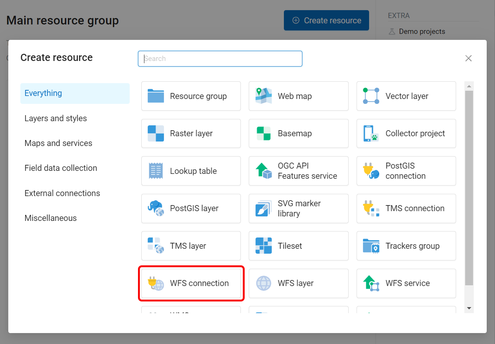

   Selecting "WFS connection" resource type
   
Next you can enter a custom name that will be displayed in the resource list.

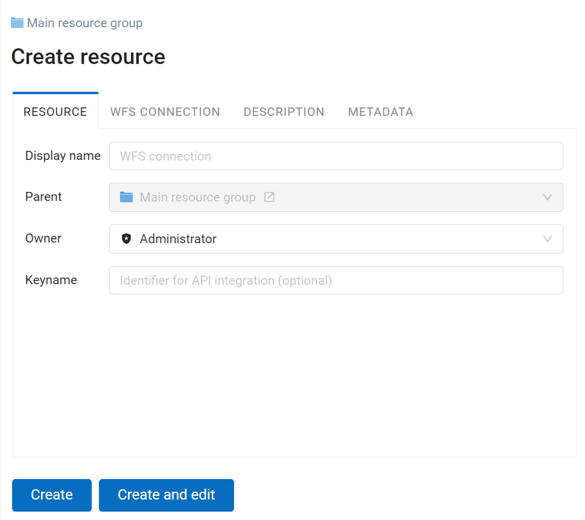

   Name for WFS connection
   
Also you can add `Description and metadata <https://docs.nextgis.com/docs_ngweb/source/edit_resource.html#ngw-update-info-metada>`_.

On the "WFS connection" tab enter the parameters that will be used to connect to the **WFS server** providing the data:

* URL
* Username 
* Password 
* WFS version

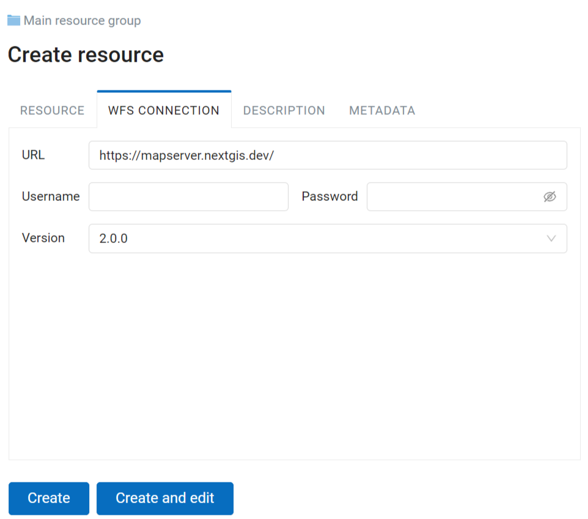

   WFS connection settings

If the version you selected is not supported, you'll get an error message after clicking **Create**:

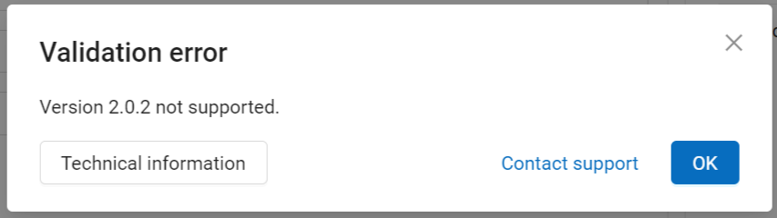

   Error message for incorrect WFS version

Next you can create WFS layer resource.

.. _ngw_wfs_layer:

WFS Layer
~~~~~~~~~

**WFS Layer** is added using an existing WFS connection. Select the resource type in the **Create resource** menu.

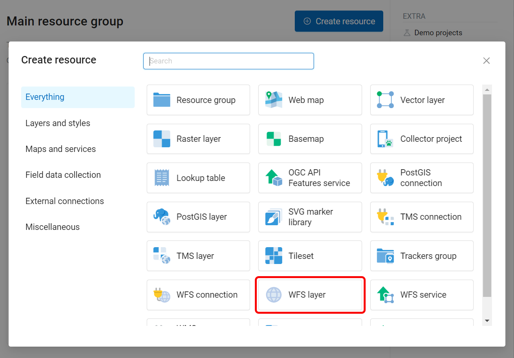
   
   Selecting "WFS layer" resource type

In the opened window in the "WFS layer" tab select the WFS connection you created. Next select the layer and the geometry field. SRID will be added automatically.

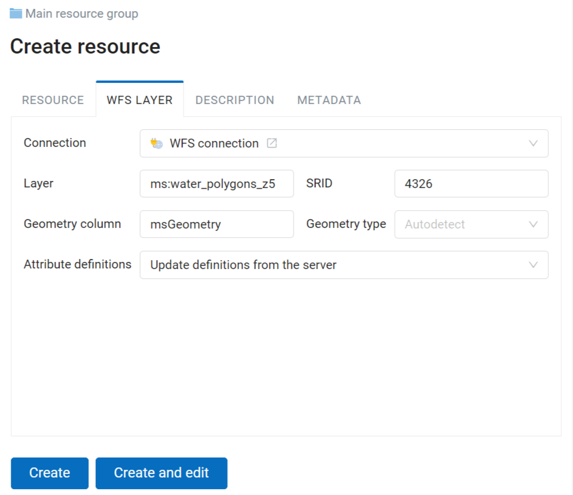

   WFS layer settings

On the "Resource" tab you can set a custom name for the resource. Also you can add `Description and metadata <https://docs.nextgis.com/docs_ngweb/source/edit_resource.html#ngw-update-info-metada>`_.

To add a WFS layer to a Web Map, you need to create a style for it. You can create a default QGIS style or `a custom QGIS or Mapserver style <https://docs.nextgis.com/docs_ngweb/source/mapstyles.html>`_ using "Create resource" menu.

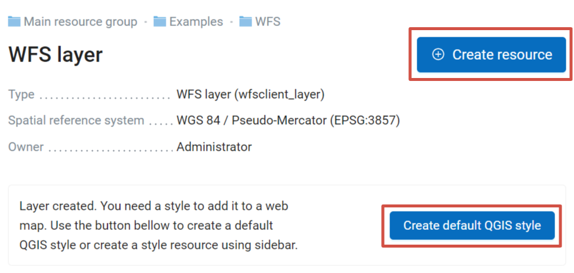

   Two ways to add a style to WFS layer

.. _ngw_wms_in:

WMS
--------

.. note:: 
	Currently supported WMS versions are 1.1.1 and 1.3.0.

NextGIS Web is a :term:`WMS` client. To connect a WMS layer you need to know its address and coordinate system. Make sure this SRS is `added to your Web GIS <https://docs.nextgis.com/docs_ngweb/source/ngw_srs.html>`_.

See how to add WMS with local CRS in our video:

.. raw::html

   <iframe width="560" height="315" src="https://www.youtube.com/embed/dYvOnKSSqBQ?si=l83YINngkAo_dmbq" title="YouTube video player" frameborder="0" allow="accelerometer; autoplay; clipboard-write; encrypted-media; gyroscope; picture-in-picture; web-share" referrerpolicy="strict-origin-when-cross-origin" allowfullscreen></iframe>

Watch on `youtube <https://youtu.be/dYvOnKSSqBQ?si=kXYVFnqFXw3IN3kI>`_.

.. _ngw_create_wms_connection:

WMS Connection
~~~~~~~~~~~~~~~

To add a WMS layer you need to create a resource called WMS connection. You may create a single connection for many layers. Click **Create resource** button and select  **WMS connection**. 

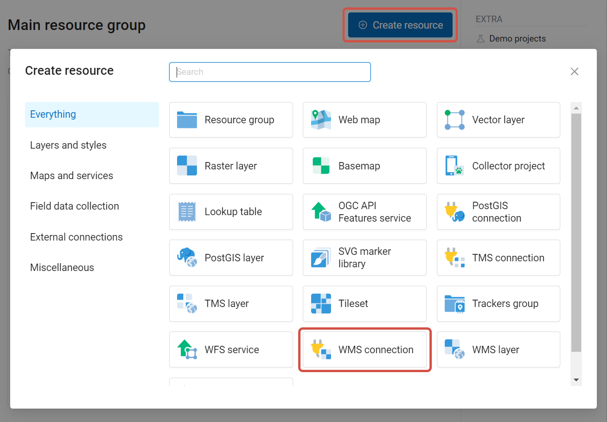

   Selecting  "WMS connection" resource type
   

Enter the name of the resource that will be displayed in the administrator interface. Not to be confused with layer name in a database. "Keyname" field is optional. 

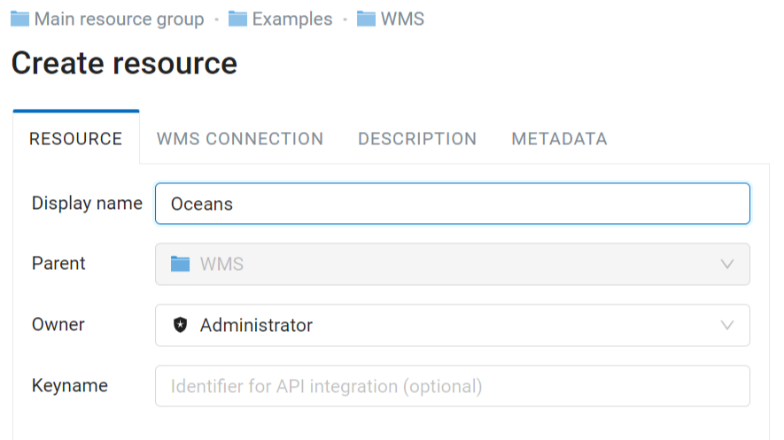

   Name for WMS connection

Also you can add `Description and metadata <https://docs.nextgis.com/docs_ngweb/source/edit_resource.html#ngw-update-info-metada>`_.

On the "WMS connection" tab enter the following WMS server connection parameters:

* URL
* Username 
* Password 
* Version of WMS protocol
* Capabilities (manages GetCapabilities queries to the WMS Server)
* Referer - optional HTTP header field required to access some services
* Skip SSL/TLS certificate verification

URL field needs to be filled, others are used when necessary.

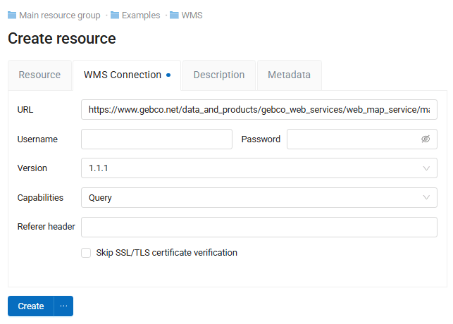

   WMS connection tab of Create resource dialog

After setting up all necessery parameters, click **Create**.   

.. _ngw_create_layer_wms:

WMS layer
~~~~~~~~~~

Now you can add WMS layers. Open the resource group where you want to create the layer. Click **Create resource** button and select **WMS layer**.  

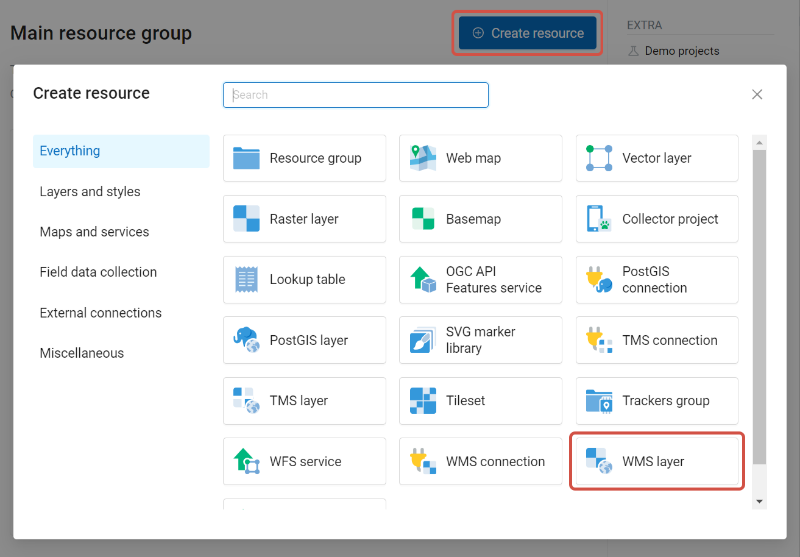

   Selecting "WMS layer" resource type
   

Enter display name that will be visible in administrator interface and in the map layer tree.  

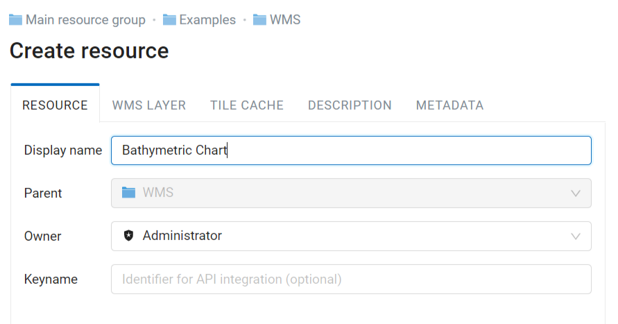

   WMS layer name

Tile cache settings are described in details `in this section <https://docs.nextgis.com/docs_ngweb/source/mapstyles.html#tile-cache>`_.

Switch to the "WMS layer" tab set up the following parameters:

* WMS connection that was created earlier.
* MIME-type from the dropdown list.
* Select the required layers from the list by clicking the underlined names. You can select several layers.
* Remote SRS - if the server supports serveral SRS, you can pick one from a dropdown list. SRS absent from your Web GIS are displayed in grey. `How to add SRS to Web GIS <https://docs.nextgis.com/docs_ngweb/source/ngw_srs.html#custom-spacial-reference-systems>`_. You can check if this coordinate system is available for a particular layer by making a ``GetCapabilites`` request to a server and examining the response.
* Vendor parameters - optional

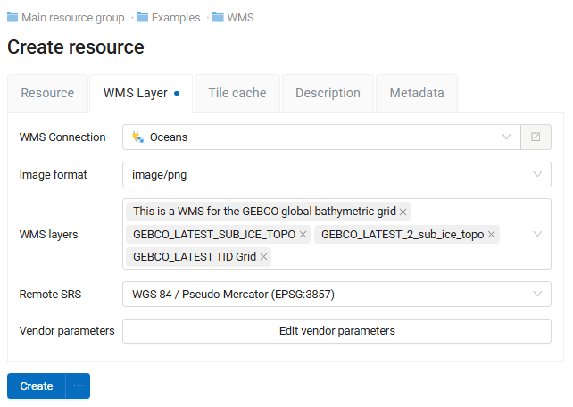

   WMS layer parameters tab

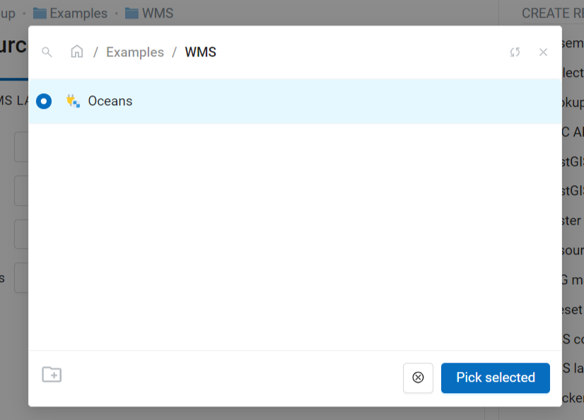

   Selecting WMS connection

Vendor parameters are special query settings for additional functions. They vary depending on the WMS provider.

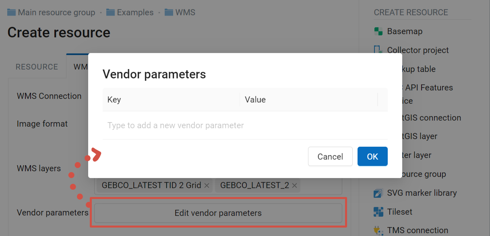

   Vendor parameters of the WMS layer

Also you can add `Description and metadata <https://docs.nextgis.com/docs_ngweb/source/edit_resource.html#ngw-update-info-metada>`_.

After setting up all necessery parameters, click **Create**.   

.. warning:: 
   Identification requests to external WMS layers from Web Maps are not supported yet. 

.. _ngw_tms_in:

TMS
--------

To add data from external sources using :term:`TMS` protocol, first create TMS connection.

.. note:: Data uploaded to NextGIS Web, can also be `added to external application via TMS <https://docs.nextgis.com/docs_ngweb/source/external.html>`_.

.. _ngw_create_tms_connection:

TMS connection
~~~~~~~~~~~~~~

To add a TMS layer, you first need to create a :term:`TMS` connection. Click on **Create resource** button and select **TMS connection** (see :numref:`TMS_connection_create`).

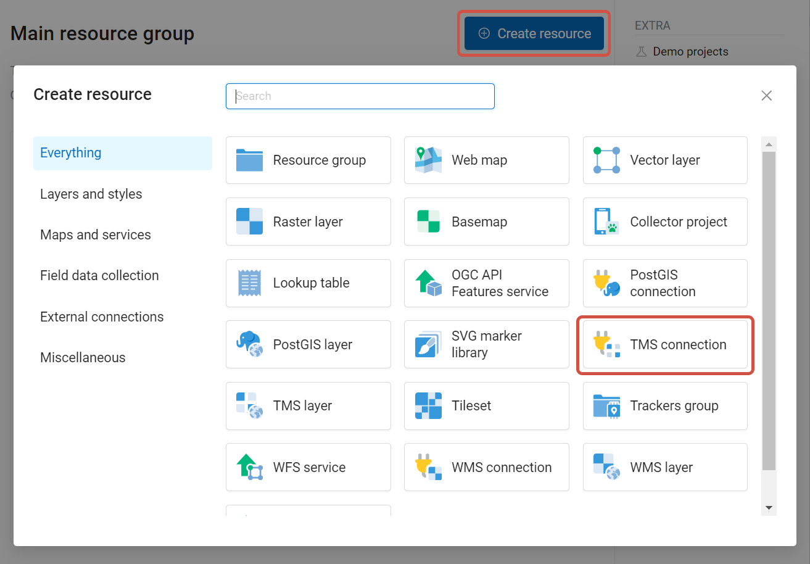

   Selecting TMS Connection resource type
   
Enter the connection name that will be displayed in the administrator interface (see :numref:`TMS_connection_name`).

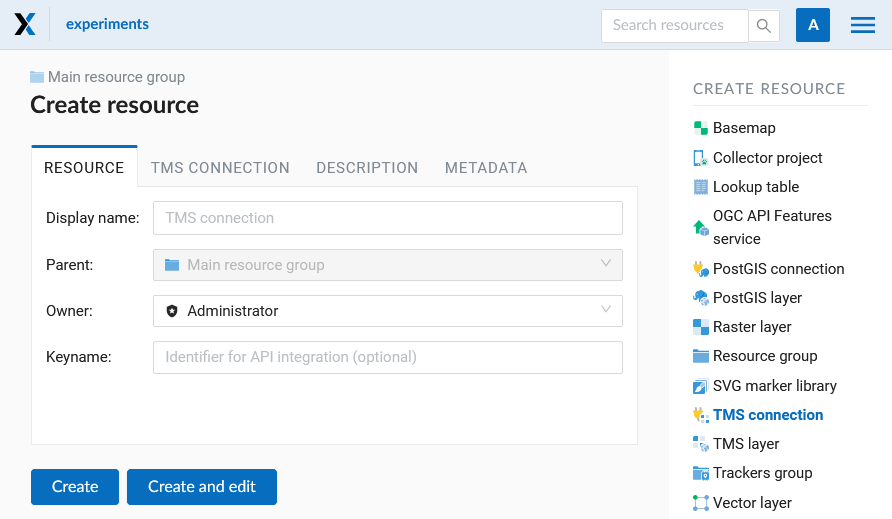

   TMS Connection Resource Name
   
Also you can add `Description and metadata <https://docs.nextgis.com/docs_ngweb/source/edit_resource.html#ngw-update-info-metada>`_.

On the TMS connection tab you need to select the way to connect to the TMS server - custom or via NextGIS GeoServices (see :numref:`TMS_connection_type`).

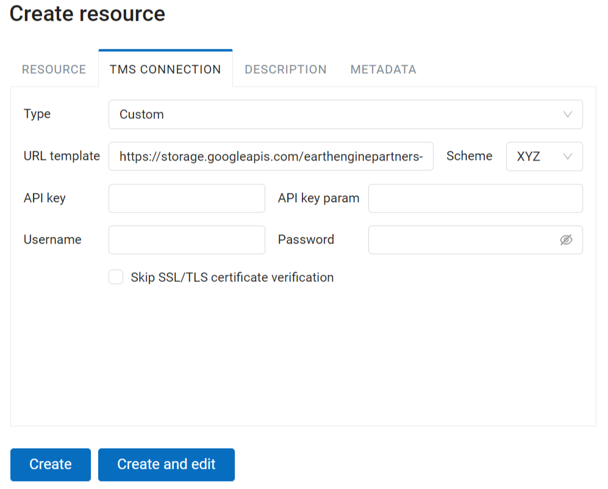

   Configuring TMS Connection

In the case of a custom connection method, the user must specify the URL template, API key parameters if needed and the tile scheme used. For NextGIS GeoServices, only a custom API key is specified. After filling in all fields click **Create** to complete the process of creating a **TMS Connection** resource.

.. _ngw_tms_layer:

TMS layer
~~~~~~~~~~

**TMS layer** resource is created using previously created **TMS Connection**. Click on **Create resource** button and select **TMS layer** (see :numref:`TMS_layer_create`).

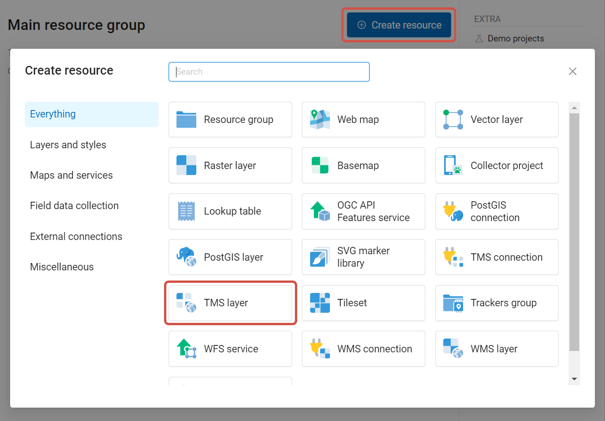
   
   Selecting TMS layer resource type

Enter the name that will be displayed in the administrator interface (see :numref:`TMS_layer_name`).

   TMS layer name

Caching provides faster rendering of Web Map layers. Tile cache settings are described in details `in this section <https://docs.nextgis.com/docs_ngweb/source/mapstyles.html#tile-cache>`_.
   
The main display settings are on the TMS layer tab (see :numref:`TMS_layer_settings_pic`):

* TMS connection - select a TMS connection resource that was created earlier;
* The range of zoom levels for data display;
* The extent in degrees;
* Tile size in pixels.

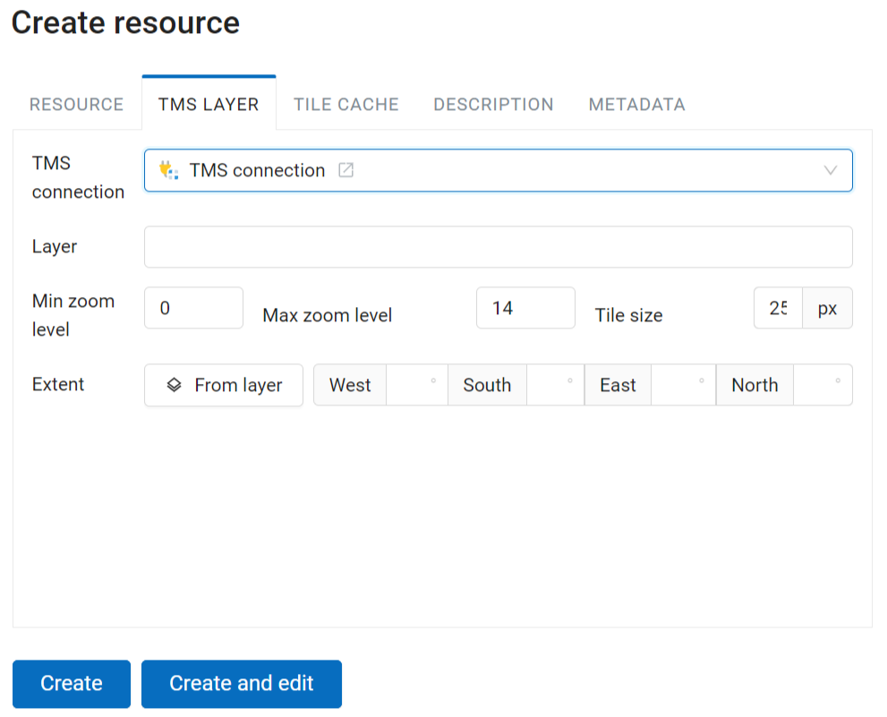
   
   TMS layer settings

After creating a TMS layer, the user can add it to the Web Map to display. No style is needed.
   
