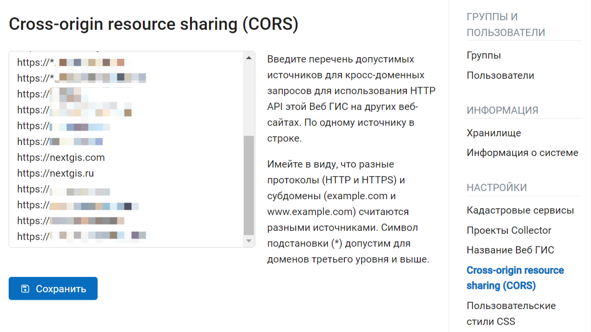

Cross-origin resource sharing (CORS)
=====================================

.. note:: 
	Эта функциональность доступна только для пользователей планов `Mini и Premium <http://nextgis.ru/nextgis-com/plans>`_.

Если вы разработчик и хотите использовать свою Веб ГИС как источник данных для других карт или систем, у вас есть возможность включить и настроить режим `CORS <https://ru.wikipedia.org/wiki/Cross-origin_resource_sharing>`_. 

В Панели управления перейдите в раздел Cross-origin resource sharing (CORS).

Введите перечень допустимых источников для кросс-доменных запросов для использования HTTP API этой Веб ГИС на других веб-сайтах. По одному источнику в строке. Нажмите **Сохранить**.

   Перечень допустимых источников

Имейте в виду, что разные протоколы (HTTP и HTTPS) и субдомены (example.com и www.example.com) считаются разными источниками. Символ подстановки (*) допустим для доменов третьего уровня и выше.

Также CORS можно настроить `для сервисов NextGIS GeoServices PKK <https://docs.nextgis.ru/docs_geoservices/source/geos_for_dev.html#cors-origins>`_.
