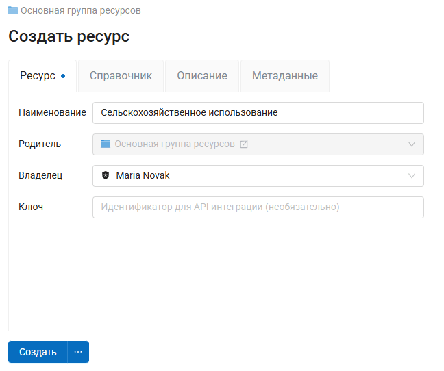
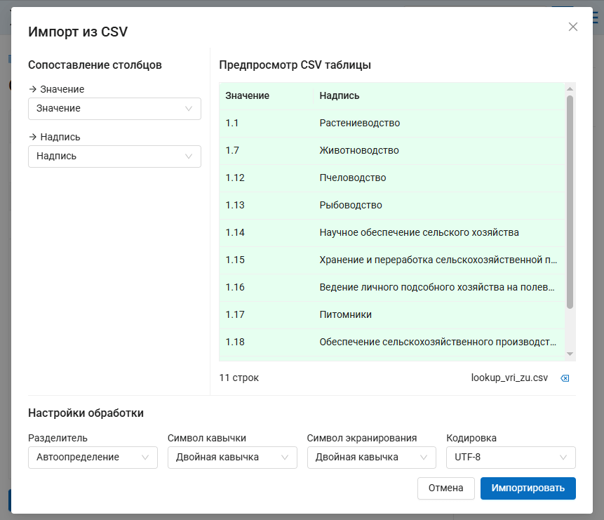
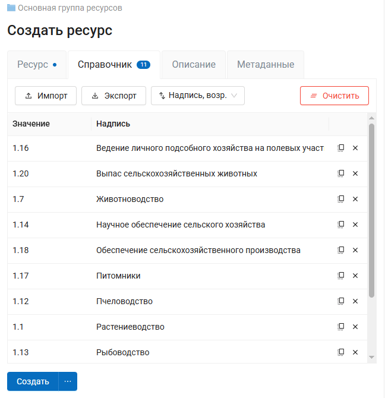
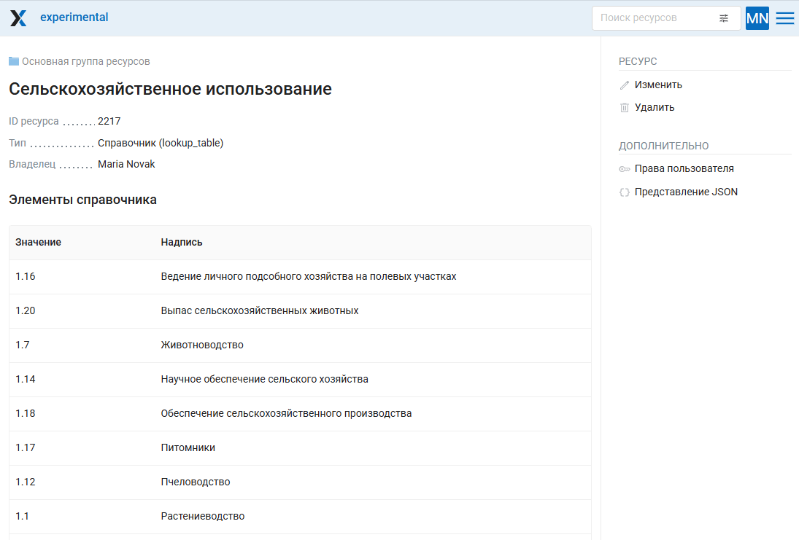

Справочники и наборы файлов
================================

.. _ngw_create_lookup_table:

Справочник
----------------------------

Для создания справочника необходимо перейти в ту группу ресурсов (корневая или др.), где будет создан справочник. Нажмите кнопку **Создать ресурс** и выберите во всплывающем окне тип ресурса **Справочник** (см. :numref:`admin_layers_create_lookup_table`). 

.. figure:: _static/ngweb_create_lookup_ru.png
   :name: admin_layers_create_lookup_table
   :align: center
   :width: 20cm

   Выбор типа ресурса "Справочник"
   
Во вкладке **Ресурс** указываетя название справочника. Оно будет отображаться в административном интерфейсе и дереве слоев веб-карты после добавления. Поле Ключ является необязательным к заполнению.

   Наименование справочника

На вкладке "Справочник" введите данные в виде "значение - надпись", где значение - краткое техническое обозначение, которое будет записываться в данных (например, код), а надпись - развёрнутое, более лёгкое для понимания название.

Также можно добавить справочник, импортировав его из файла. Нажмите **Импорт** и выберите файл CSV на устройстве.

   Импорт справочника из файла

При импорте можно выбрать:

* Колонки значения и надписи;
* Разделитель;
* Символ кавычки;
* Символ экранирования;
* Кодировку.

В окне препросмотра вы увидите получающую таблицу и можете проверить правильность выбранных настроек.

Значения справочника можно отсортировать. Доступны следующие варианты сортировки:

* Значение, по возрастанию;
* Значение, по убыванию;
* Надпись, по возрастанию;
* Надпись, по убыванию;
* Настраиваемый - можно произвольно расставить строки в нужном порядке, потянув за значок с шестью точками в левой части (см. :numref:`ngweb_creating_a_new_lookup_pic`).

   Окно данных справочника. Строки отсортированы по алфавиту по столбцу Надпись

Обратите внимание, что значения, имеющие в составе разделители, будут сортироваться как дробные числа, то есть "1.12" окажется выше, чем "1.7". В таком случае можно сначала отсортировать строки по значению, а затем перейти в режим "Настраиваемый" и исправить порядок там, где нужно.

Можно добавить описание ресурса и метаданные на соответствующих вкладках.
Как правило, метаданные используются для разработки сторонних приложений с помощью `API <https://docs.nextgis.ru/docs_ngweb_dev/doc/developer/toc.html>`_.

После ввода необходимых данных следует нажать на кнопку **Сохранить**. 
Окно примет вид :numref:`ngweb_lookup_result_pic`.

   Созданный справочник

Для внесения изменений в справочник следует в панели операций "Действие" выбрать 
**Изменить**, после чего откроется окно для редактирования данных ресурса.
В окне необходимо перейти на вкладку "Справочник", на которой можно изменить состав значений 
справочника:

* добавить новую пару значение - надпись;
* изменить текущую пару значение - надпись;
* удалить пару значение - надпись.

Также можно экспортировать справочник в формате CSV. 

Справочник можно также `подключить к полю векторного слоя <https://docs.nextgis.ru/docs_ngweb/source/layers_settings.html#lookup-add-to-field>`_ или `добавить в форму <https://docs.nextgis.ru/docs_ngweb/source/form_elements.html#import-csv>`_, это позволит выбирать значение атрибута из списка при создании и редактировании объектов. 

.. _ngw_create_file_bucket:

Набор файлов
----------------------

.. important::

   Это особый тип ресурса, доступный в `редакции Extended NextGIS on-premise <https://nextgis.ru/pricing/>`_. Он позволяет создать хранилище с файлами любого типа.

Во вкладке **Ресурс** указываетя название набора. Оно будет отображаться в административном интерфейсе. Поле Ключ является необязательным к заполнению.

.. figure:: _static/ngw_name_file_bucket_ru.png
   :name: name_file_bucket_pic
   :align: center
   :width: 16cm
   
   Название ресурса Набор файлов

Во вкладке **Набор файлов** выберите файлы или zip-архив, из которого файлы нужно извлечь.

.. figure:: _static/ngw_upload_file_bucket_ru.png
   :name: ngw_upload_file_bucket_pic
   :align: center
   :width: 16cm

   Загрузка файлов в набор

Также на соответствующих вкладках можно добавить описание и метаданные.

После того, как набор создан, состав файлов в нём можно редактировать: добавлять и удалять файлы. Если выбрать извлечение из zip-архива, извлечённые файлы **заменят** добавленные ранее.

Файлы, содержащиеся в наборе, можно открыть в браузере (если это позволяет их расширение), сохранить по одному или экспортировать все вместе в виде zip-архива.

.. figure:: _static/ngw_file_bucket_result_ru.png
   :name: ngw_file_bucket_result_pic
   :align: center
   :width: 20cm

   Страница ресурса со списком содержащихся в нём файлов

