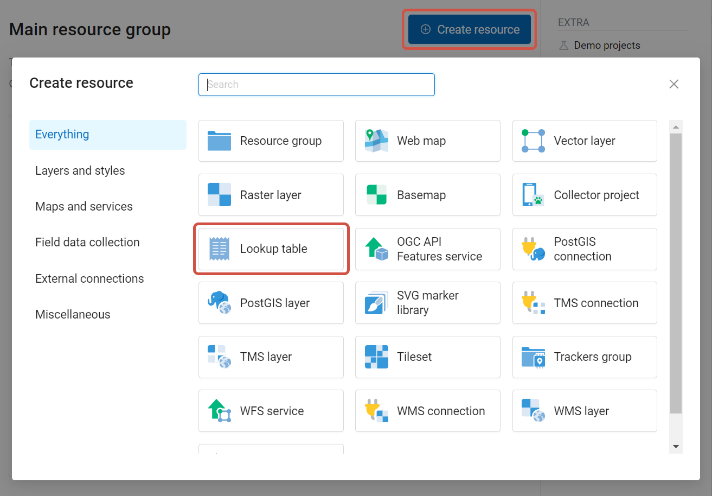
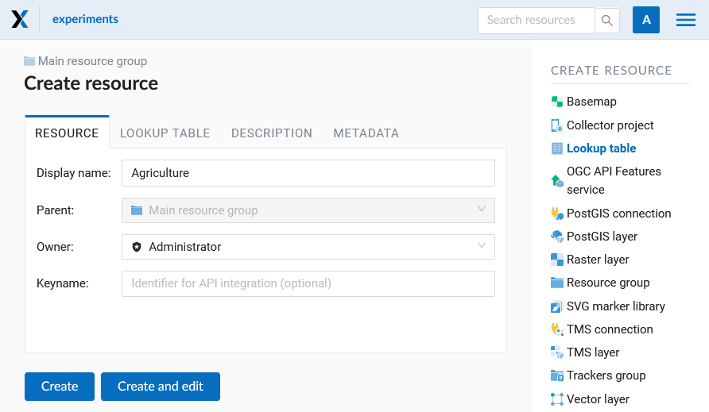
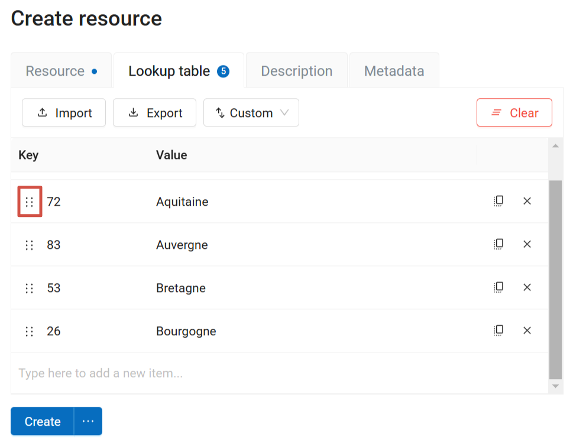
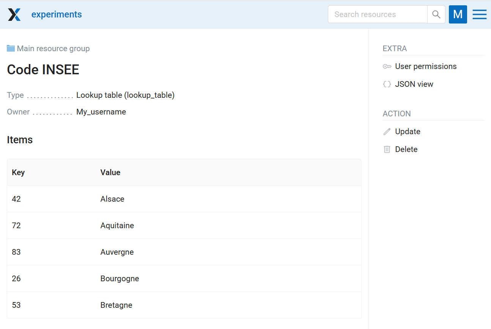
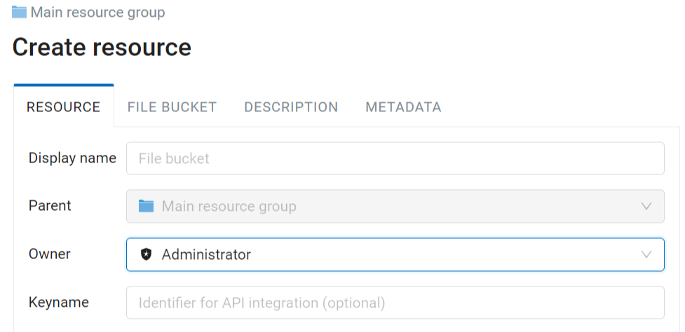
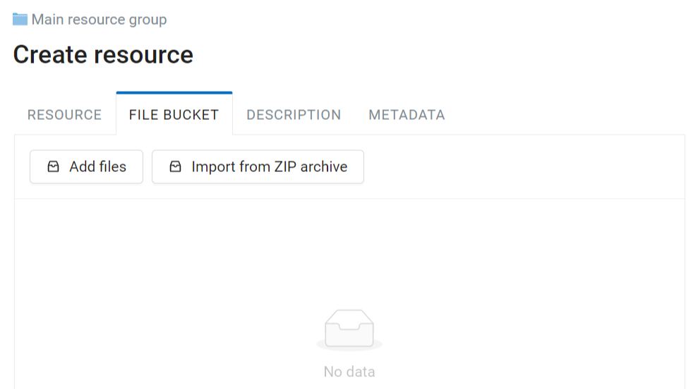
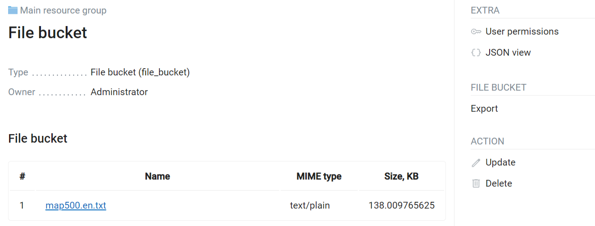

Creating other types of resources
=================================

.. _ngw_create_lookup_table:

Lookup table
----------------------------

To create a lookup table navigate to the group, where you want to create it (root group or another). Press **Create resource** button and select  **Lookup table** (see :numref:`admin_layers_create_lookup_table`). 

   Selecting "Lookup table" resource type
   
In the opened dialog enter a display name. It will be displayed in the resource list and the Web Map layer tree. “Keyname” field is optional.

   Lookup table name

Switch from "Resource" tab to the "Lookup table" tab, which is presented on :numref:`ngweb_creating_a_new_lookup_pic`. Add data in the “key-value” format. You can also import a pre-made lookup table from a CSV file.

   Lookup table contents

The entries can be sorted in a variety of ways:

* By key, ascending (lower to higher);
* By key, descending (higher to lower);
* By value, ascending;
* By value, descending;
* Custom - drag the six dot icon on the left (:numref:`ngweb_creating_a_new_lookup_pic`) to move the entry.

Numbers with separators are treated like decimals, i.e. "1.12" is before "1.7". If you need to fix it, sort by key first, then switch to "Custom" and move the entries to the correct position.

You can also add resource description and metadata on the corresponding tabs.
Metadata is used in external apps working with `API <https://docs.nextgis.com/docs_ngweb_dev/doc/developer/toc.html>`_.

Then click **Save**. 
The window will then look as on :numref:`ngweb_new_resource_lookup_pic`

   Newly created lookup table

To change anything in a lookup table click **Update** in the "Action" pane. 
The resource update dialog will open.
Switch to "Lookup table" tab where you can change the table's contents:  

* add a new key-value pair
* change a current key-value pair
* delete a key-value pair

A lookup table can be exported to a CSV file.

You can also connect a lookup table to a field of a vector layer. This way while editing the layer you can choose attribute values from the list. To add a lookup table to the layer, open the Edit dialog and to to the Attributes tab. In the row of the attribute click on the downward arrow in the Lookup table column.

See how to work with lookup tables in our video:

.. raw:: html

   <iframe width="560" height="315" src="https://www.youtube.com/embed/TVuKHJjjP5E?si=UpbC32raabaHHaQC" title="YouTube video player" frameborder="0" allow="accelerometer; autoplay; clipboard-write; encrypted-media; gyroscope; picture-in-picture; web-share" referrerpolicy="strict-origin-when-cross-origin" allowfullscreen></iframe>

Watch on `youtube <https://youtu.be/TVuKHJjjP5E?si=JiGYc2ApkmUbT0LV>`_.

.. _ngw_create_file_bucket:

File bucket
----------------------

.. important::

   It is a special type of resource available in `Extended edition of NextGIS on-premise <https://nextgis.com/pricing/>`_. It allows users to create a storage space for any types of files.

On the **Resource** tab enter a name for the file bucket. It will be displayed in the administrator interface. “Keyname” field is optional.

   
   File bucket name

In the **File bucket** tab select files or a ZIP archive to extract files from.

   Uploading files to bucket

The "Description" and "Metadata" of the resource can be configured on the corresponding tabs.

After a file bucket is created, its contents can be modified. You can add and delete individual files. If you select a new ZIP archive, the files extracted from it will replace all files added before.

Files stored in the bucket can be viewed in browser (if the file type allows it), saved one-by-one from the context menu or exported all at once as a ZIP archive.

   Resource page of a File bucket with the list of included files
