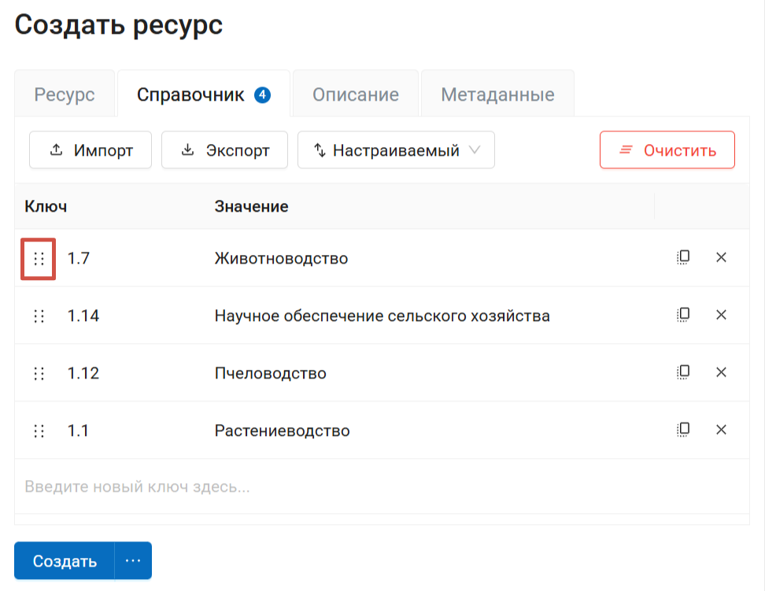
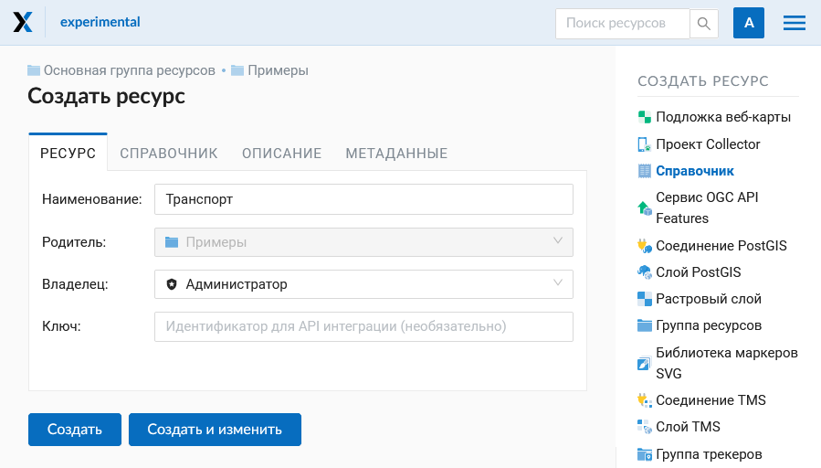
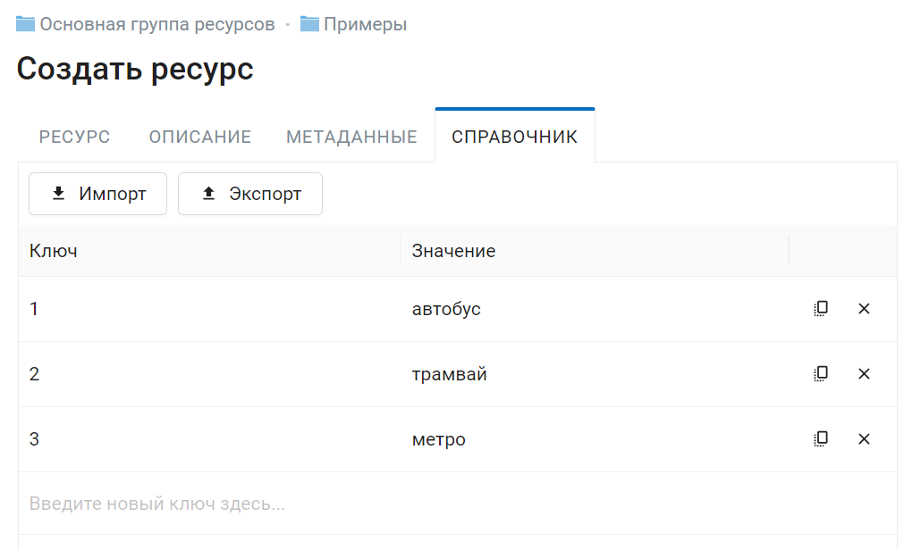
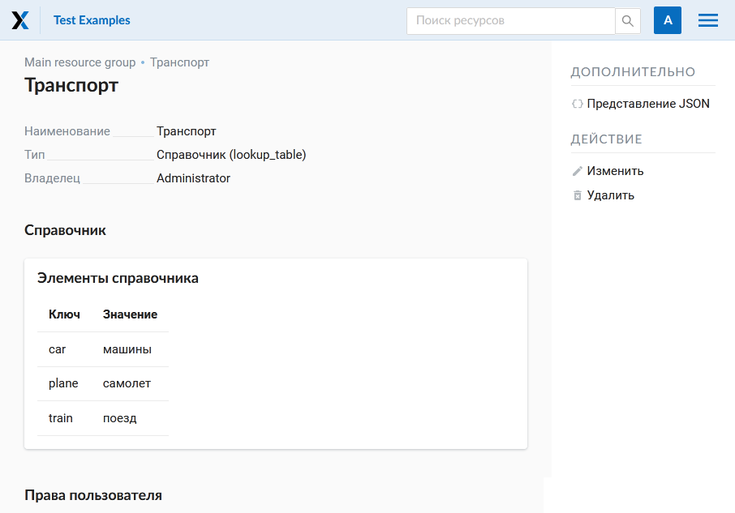
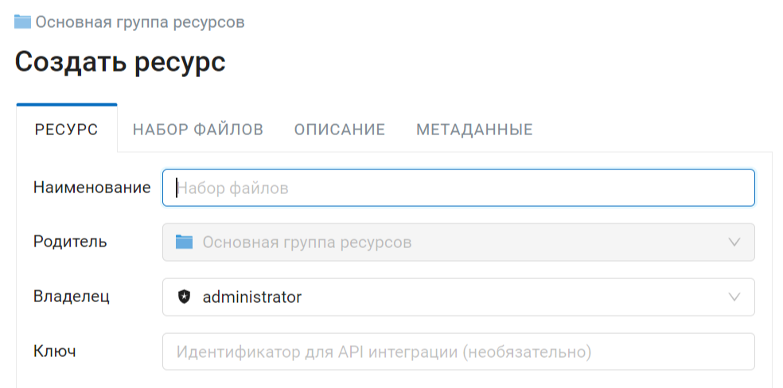
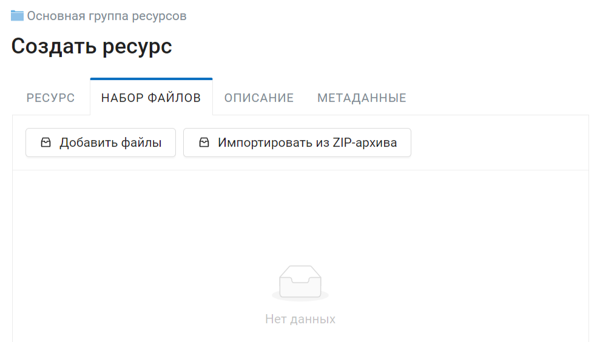
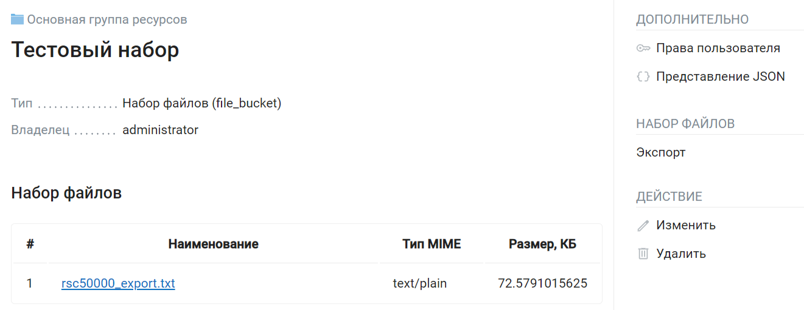

Создание других типов ресурсов
================================

.. _ngw_create_lookup_table:

Справочник
----------------------------

Для создания справочника необходимо перейти в ту группу ресурсов (корневая или др.), где будет создана справочник. Нажмите кнопку **Создать ресурс** и выберите во всплывающем окне тип ресурса **Справочник** (см. :numref:`admin_layers_create_lookup_table`). 

   Выбор типа ресурса "Справочник"
   
Во вкладке **Ресурс** указываетя название справочника. Оно будет отображаться в административном интерфейсе и дереве слоев веб-карты после добавления. Поле Ключ является необязательным к заполнению.

   Наименование справочника

На вкладке "Справочник" введите данные в виде "ключ - значение". Также можно добавить справочник, импортировав его из файла.

   Окно данных справочника

Можно добавить описание ресурса и метаданные на соответствующих вкладках.
Как правило, метаданные используются для разработки сторонних приложений с помощью `API <https://docs.nextgis.ru/docs_ngweb_dev/doc/developer/toc.html>`_.

После ввода необходимых данных следует нажать на кнопку **Сохранить**. 
Окно примет вид :numref:`ngweb_new_resource_lookup`.

   Созданный справочник

Для внесения изменений в справочник следует в панели операций "Действие" выбрать 
**Изменить**, после чего откроется окно для редактирования данных ресурса.
В окне необходимо перейти на вкладку "Справочник", на которой можно изменить состав значений 
справочника:

* добавить новую пару ключ - значение
* изменить текущую пару ключ - значение
* удалить пару ключ - значение

Также можно экспортировать справочник в формате CSV.

Справочник можно также подключить к векторному слою, это позволит выбирать значение атрибута из списка. Для этого перейдите в редактирование векторного слоя, во вкладке Атрибуты выберите нужную строку и нажмите на стрелку вниз в колонке Справочник.

Процесс работы со справочниками также представлен в видео:

.. raw:: html

   <iframe width="560" height="315" src="https://rutube.ru/play/embed/44079b285c89950cfb831e69d60822db/" frameBorder="0" allow="clipboard-write; autoplay" webkitAllowFullScreen mozallowfullscreen allowFullScreen></iframe>

Посмотреть на `youtube <https://youtu.be/4geb-lbE81g>`_, `rutube <https://rutube.ru/video/44079b285c89950cfb831e69d60822db/>`_.

.. _ngw_create_file_bucket:

Набор файлов
----------------------

.. important::

   Это особый тип ресурса, доступный в `редакции Extended NextGIS on-premise <https://nextgis.ru/pricing/>`_. Он позволяет создать хранилище с файлами любого типа.

Во вкладке **Ресурс** указываетя название набора. Оно будет отображаться в административном интерфейсе. Поле Ключ является необязательным к заполнению.

   
   Название ресурса Набор файлов

Во вкладке **Набор файлов** выберите файлы или zip-архив, из которого файлы нужно извлечь.

   Загрузка файлов в набор

Также на соответствующих вкладках можно добавить описание и метаданные.

После того, как набор создан, состав файлов в нём можно редактировать: добавлять и удалять файлы. Если выбрать извлечение из zip-архива, извлечённые файлы **заменят** добавленные ранее.

Файлы, содержащиеся в наборе, можно открыть в браузере (если это позволяет их расширение), сохранить по одному или экспортировать все вместе в виде zip-архива.

   Страница ресурса со списком содержащихся в нём файлов

