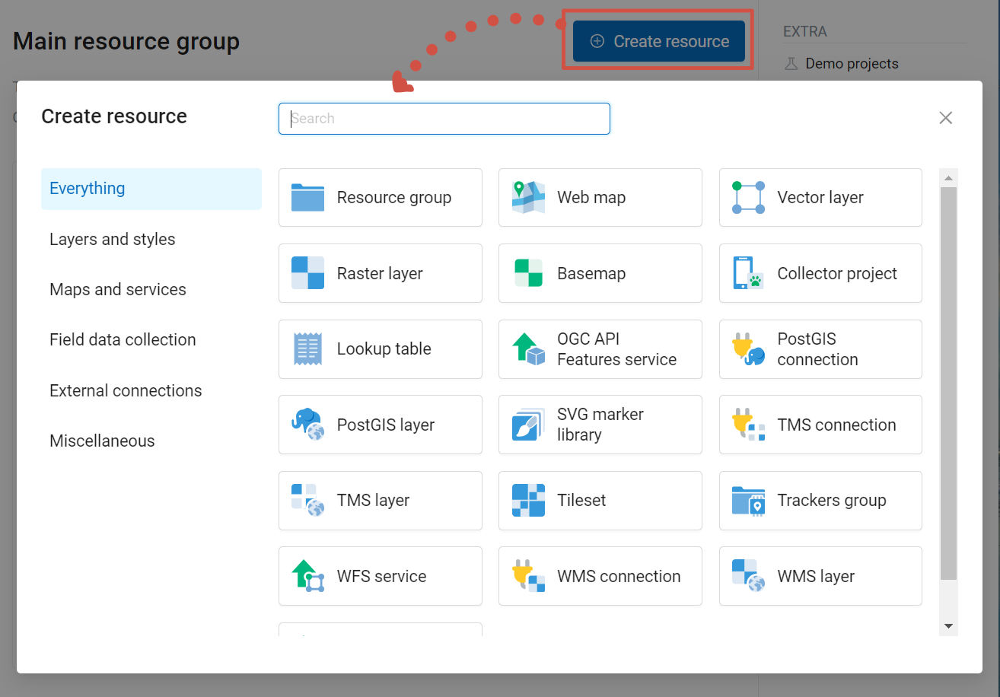
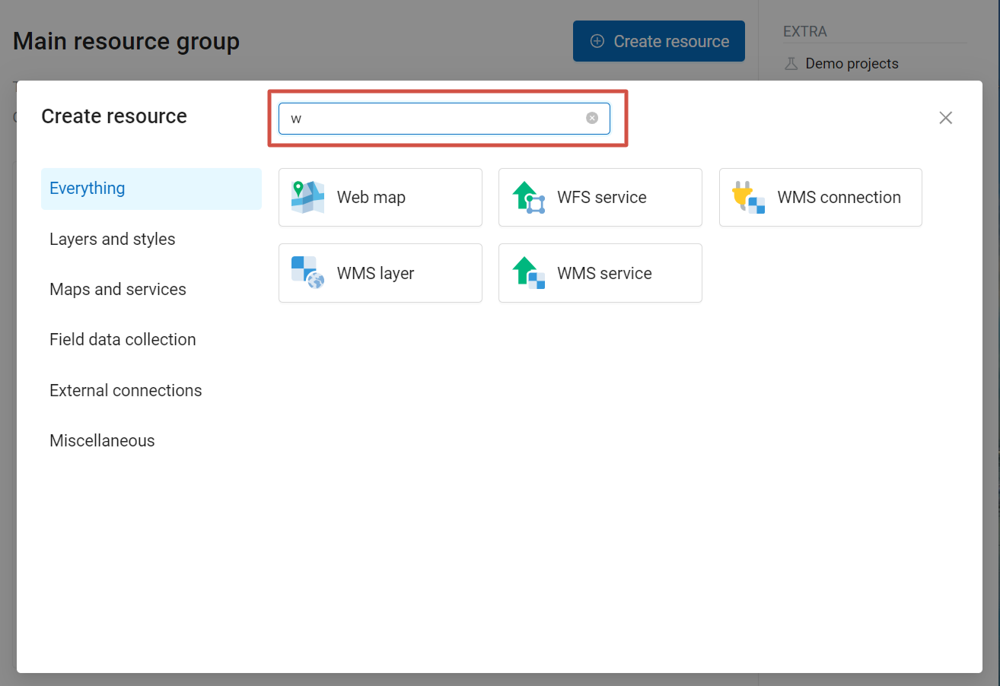
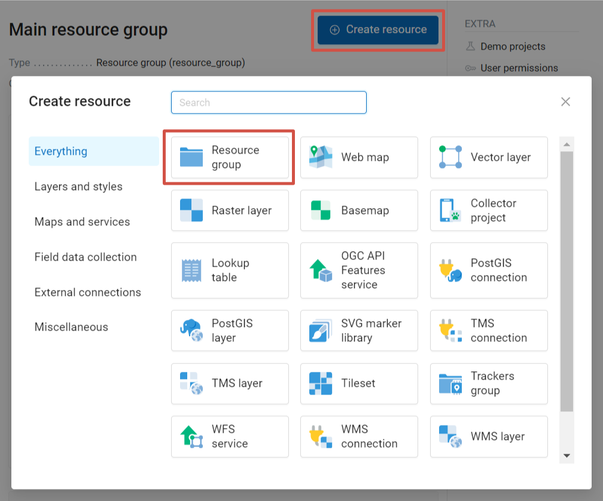
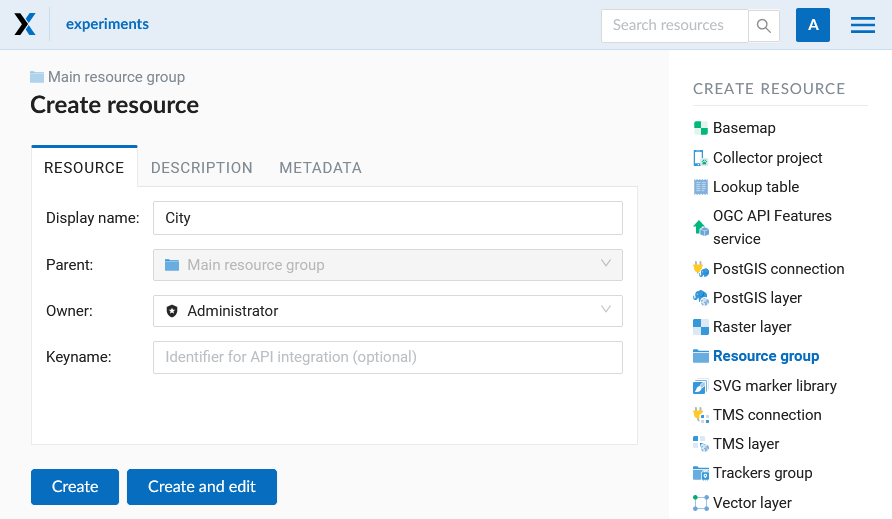
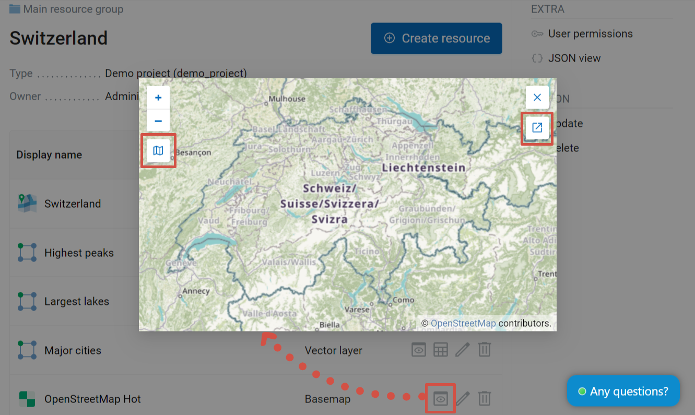
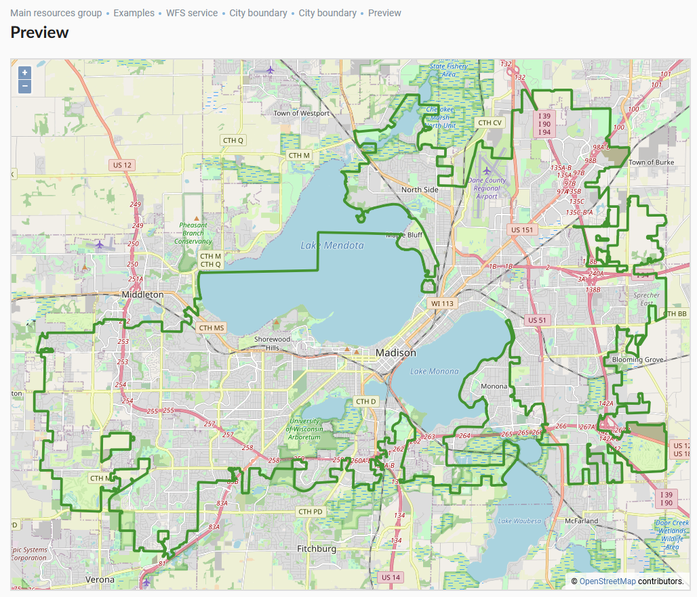
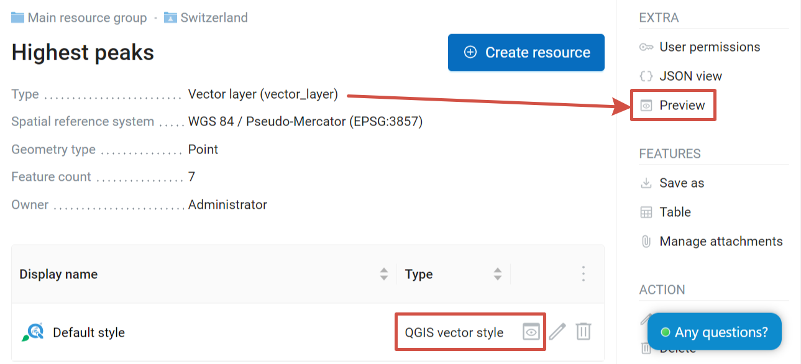
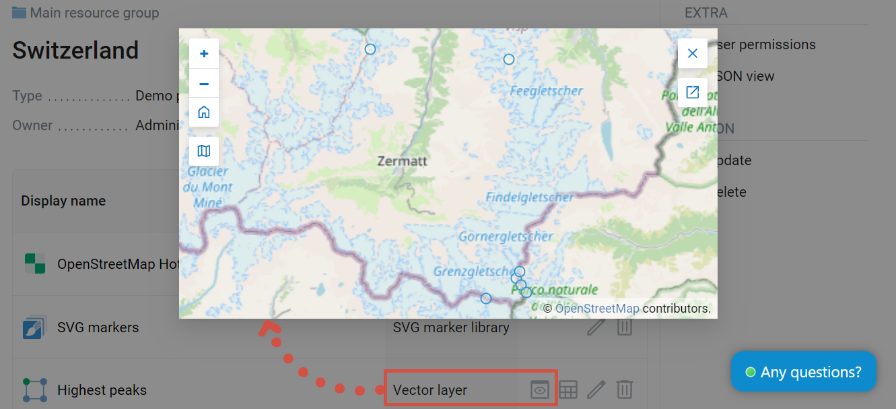
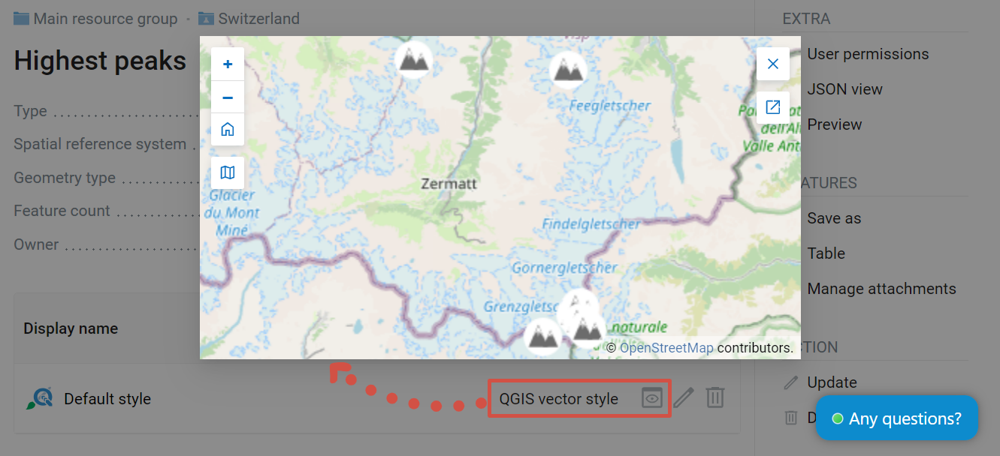

.. sectionauthor:: Artem Svetlov <artem.svetlov@nextgis.ru>
.. sectionauthor:: Roman Gainullov <roman.gainullov@nextgis.com>
.. sectionauthor:: Yulia Grigorenko <yulia.grigorenko@nextgis.com>

Adding resources
===================

NextGIS Web is built on a **resource-based** approach - each component of the system (layer, group, service) is a resource.
One of these resources is a **layer** - a raster image or a vector file (database table).

For each layer you can create an **unlimited** number of **styles** - ways to visualize geodata on a Web Map.

Interface for adding of PostGIS layers, vector and raster layers is practically the same. First, you specify the parameters for the layer, and then you add a style that renders data on the Web Map. 

To create a new resource, open the group where you want to add it and press **Create resource** button. Then in the pop-up window select the resource type. The window opens on the full list of available resource types. 

   Create resource window

To find the resource type you need faster, use the search bar. 

   Searching for resource type

Resource types are also grouped into categories. You can select a category from the list on the left.

* Layers and styles (`vecctor <https://docs.nextgis.com/docs_ngweb/source/layers.html#ngw-create-vector-layer>`_ and `raster <https://docs.nextgis.com/docs_ngweb/source/layers.html#ngw-create-raster-layer>`_ layers and `styles <https://docs.nextgis.com/docs_ngweb/source/mapstyles.html>`_, `basemaps <https://docs.nextgis.com/docs_ngweb/source/webmaps_admin.html#ngw-create-basemap>`_)
* Maps and services (`Web Map <https://docs.nextgis.com/docs_ngweb/source/webmaps_admin.html>`_, WMS, WFS, OGC API - Features services)
* Field data collection (`tracker group, tracker <https://docs.nextgis.com/docs_ngcom/source/tracking.html#tracking-create>`_, `Collector project <https://docs.nextgis.com/docs_ngweb/source/collector.html#collector-create-project>`_), `form for data collection <https://docs.nextgis.com/docs_ngweb/source/collector.html#collector-create-form>`_
* External connections (PostGIS, TMS and WMS connections)
* Miscellaneous (`resource group <https://docs.nextgis.com/docs_ngweb/source/create_resource.html#ngw-resourses-group>`_, `SVG marker library <https://docs.nextgis.com/docs_ngweb/source/mapstyles.html#svg>`_, `lookup table <https://docs.nextgis.com/docs_ngweb/source/.html#ngw-create-lookup-table>`_, `file bucket <https://docs.nextgis.com/docs_ngweb/source/create_other.html#ngw-create-file-bucket>`_)

Click on the resource type to see the detailed description of the process.

.. _ngw_resourses_group:

Creation of a Resource group
------------------------

Resources can be arranged into groups. For example, you can have special groups for base layers, satellite images and topical data. 
 

Groups help organize the layers in the Control panel and make it easier to manage access permissions.  
 

To create a resource group navigate to the group, where you want to create a new one (root group or another).  Press **Create resource** button and select  **Resource group** (see :numref:`admin_layers_create_resource_group`).  

   Selection of "Resource group" resource type
   
Create resource dialog for resource group is presented on :numref:`admin_layers_create_group`.

   Create resource dialog for resource group

In the opened dialog enter the name of the resource that will be displayed in the administrator interface and in the map layer tree, and then click **Create**.  

“Keyname” field is optional.

You can also add resource description and metadata on the corresponding tabs. 
Metadata is used in external apps working with `API <https://docs.nextgis.com/docs_ngweb_dev/doc/developer/toc.html>`_.

.. _ngw_data_preview:

Data preview
------------------------

The preview function allows you to see the uploaded data on the basemap or a basemap without adding it on the Web Map.
	
Click the "eye" icon opposite the name of the child resource you want to preview.

A visual preview of the uploaded geometries will open without the possibility of more detailed interaction (viewing attributes, identifying objects, etc).

   Data preview

Click |button_open_new_tab| **Open in a new tab** to view a bigger preview on a separate page.

Alternatively, open the resource page and click on the **Preview** button in the right menu in the **Extra** section.

   Data preview in a separate tab 

To preview a style, open the layer page and click on the eye icon next to the style subresource. The "Preview" action in the Extra tab on the right will display the preview of the resource itself, i.e. layer (:numref:`ngweb_preview_vector_pic`).

   Selecting Data Preview Function for the layer (top right) or its style (below)

   Preview of a vector layer, features marked by default round markers 

   Preview of a style, the same features marked by custom icons

.. _ngw_standard_structure:

Typical structure
-----------------

With NextGIS Web application experience we recommend the following typical structure for organizing resources. 

Typical structure ::

