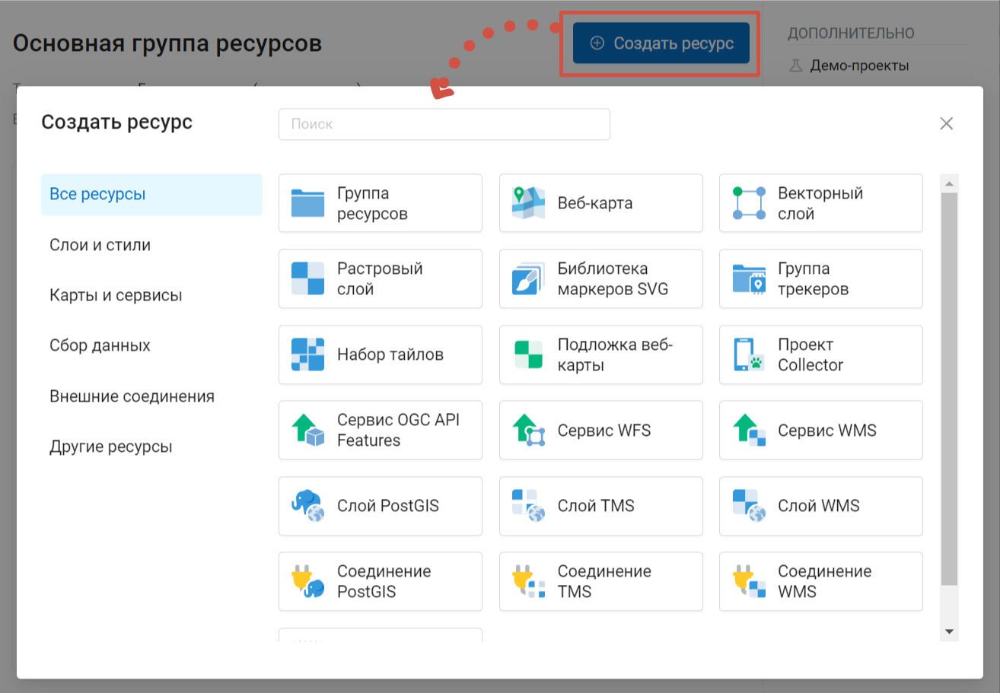
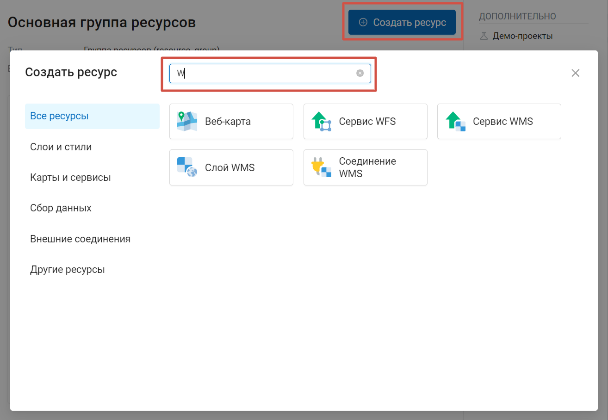
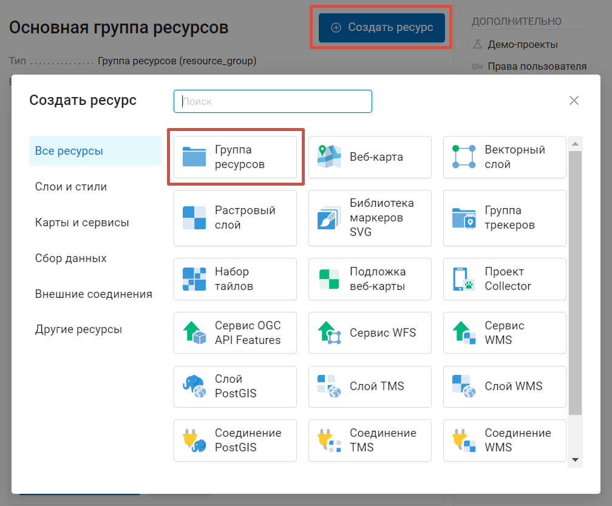
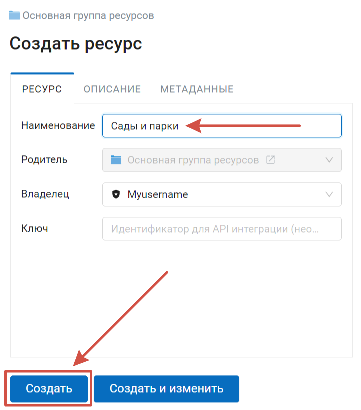
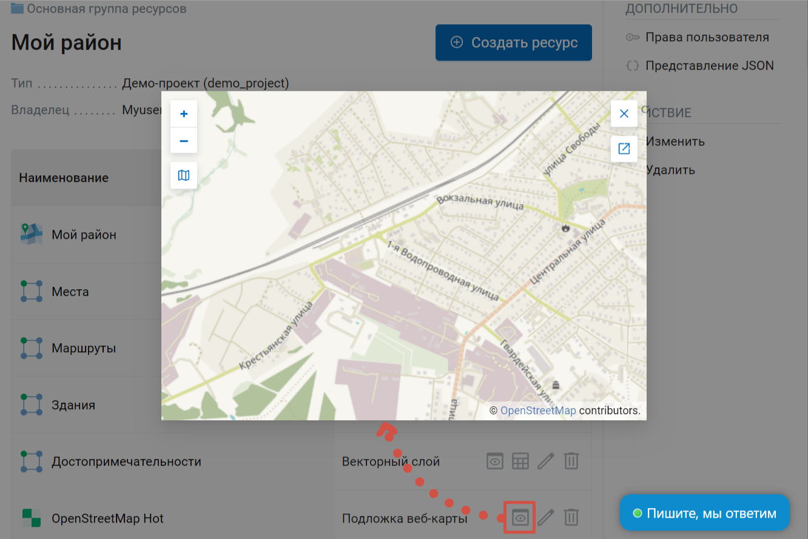
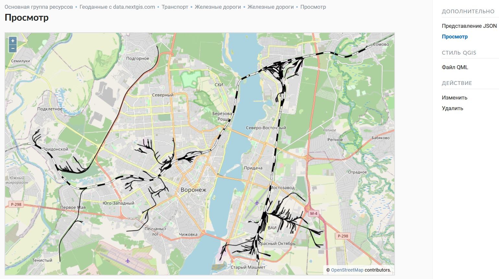
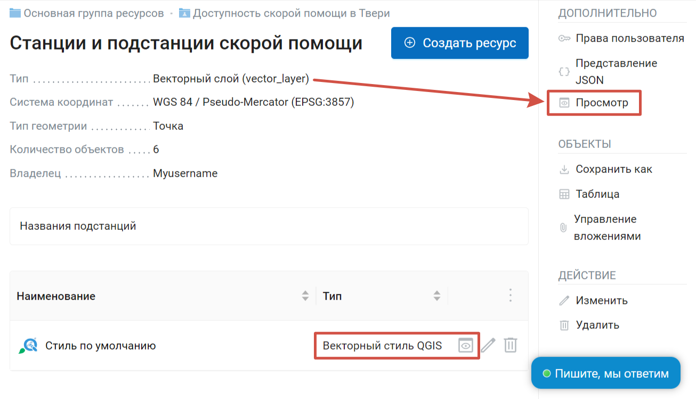
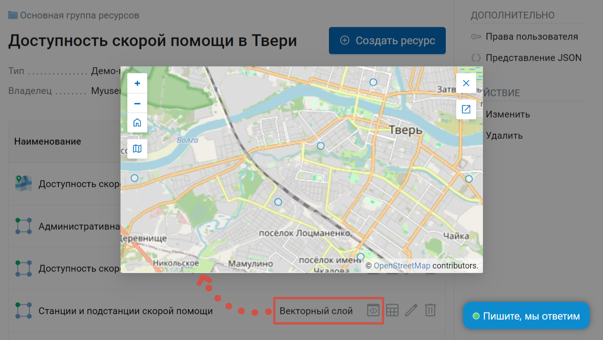
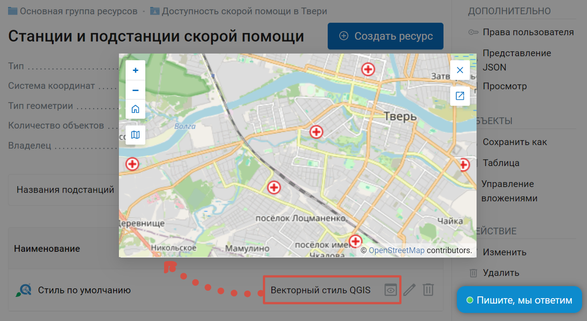

Добавление ресурсов
===================

NextGIS Web строится на **ресурсном** подходе - каждый компонент системы (слой, группа, сервис) является её ресурсом.
Одним из таких типов ресурсов является **слой** - растровое изображение или векторный файл (таблица базы данных).

Для каждого слоя может быть создано **неограниченное** количество **стилей** - способов визуализации геоданных на веб-карте.

Интерфейс добавления векторных, растровых и PostGIS слоев приблизительно одинаковый - создается ресурс слоя, внутри него - ресурсы стилей.
Последние визуализируют данные на веб-карте.

Для того, чтобы создать ресурс, перейдите в группу, куда хотите его добавить, и нажмите на кнопку **Создать ресурс**. Затем во всплывающем окне выберите нужный тип ресурса. Изначально предлагается полный список доступных ресурсов. 

   Окно создания ресурса

Чтобы быстрее найти нужный тип ресурса, можно воспользоваться строкой поиска.

   Поиск нужного типа ресурса

Также типы ресурсов сгруппированы по категориям, которые можно выбрать в левой части окна:

* Слои и стили (`векторные <https://docs.nextgis.ru/docs_ngweb/source/layers.html#ngw-create-vector-layer>`_ и `растровые <https://docs.nextgis.ru/docs_ngweb/source/layers.html#ngw-create-raster-layer>`_ слои и `стили <https://docs.nextgis.ru/docs_ngweb/source/mapstyles.html>`_, `подложки <https://docs.nextgis.ru/docs_ngweb/source/webmaps_admin.html#ngw-create-basemap>`_)
* Карты и сервисы (`веб-карта <https://docs.nextgis.ru/docs_ngweb/source/webmaps_admin.html>`_, сервисы WMS, WFS, OGC API - Features)
* Сбор данных (`группа трекеров, трекер <https://docs.nextgis.ru/docs_ngcom/source/tracking.html#tracking-create>`_, `проект Collector <https://docs.nextgis.ru/docs_ngweb/source/collector.html#collector-create-project>`_), `форма сбора данных <https://docs.nextgis.ru/docs_ngweb/source/collector.html#collector-create-form>`_
* Внешние соединения (соединения PostGIS, TMS, WMS)
* Другие ресурсы (`группа ресурсов <https://docs.nextgis.ru/docs_ngweb/source/create_resource.html#ngw-resourses-group>`_, `библиотека маркеров SVG <https://docs.nextgis.ru/docs_ngweb/source/mapstyles.html#svg>`_, `справочник <https://docs.nextgis.ru/docs_ngweb/source/create_other.html#ngw-create-lookup-table>`_, `набор файлов <https://docs.nextgis.ru/docs_ngweb/source/create_other.html#ngw-create-file-bucket>`_)

Нажмите на нужный тип ресурса, чтобы перейти к подробному описанию его создания.

.. _ngw_resourses_group:

Создание группы ресурсов
------------------------

Ресурсы можно объединять в группы. Например, в одну группу можно сложить базовые данные, 
в другую группу –  космические снимки, в третью – тематические данные и т.д.

Группы служат для удобной организации слоев в панели управления, а также для удобного 
назначения прав доступа. 

Для создания группы ресурсов необходимо перейти в ту группу (корневая или др.), где будет создана новая группа ресурсов. Нажмите кнопку **Создать ресурс** и выберите во всплывающем окне тип ресурса **Группа ресурсов** (см. :numref:`admin_layers_create_resource_group`). 

   Выбор типа ресурса "Группа ресурсов"
   
При этом откроется окно, представленное на :numref:`ngweb_admin_layers_create_group`.

   Окно создания группы ресурсов

В открывшемся окне необходимо указать название группы, которое будет отображаться в административном веб интерфейсе, 
а также в дереве слоев карты, и нажать кнопку **Создать**.

Поле "Ключ" является необязательным к заполнению.

Можно добавить описание ресурса и метаданные на соответствующих вкладках. 
Как правило, метаданные используются для разработки сторонних приложений с помощью `API <https://docs.nextgis.ru/docs_ngweb_dev/doc/developer/toc.html>`_.

.. _ngw_data_preview:

Предварительный просмотр
------------------------

Функция предварительного просмотра позволяет увидеть созданную подложку или геометрии загруженных данных на подложке без добавления их на веб-карту.
	
Находясь в соответствующем ресурсе, нажмите на иконку "глаз" напротив названия вложенного ресурса.

Откроется окно визуального предварительного просмотра загруженных геометрий без возможности более детального взаимодействия (просмотра атрибутов, идентификации объектов и др.).

   Выбор функции предварительного просмотра данных

Нажмите |button_open_new_tab| **Открыть в новой вкладке**, чтобы перейти к более крупному превью на отдельной странице.

.. |button_open_new_tab| image:: _static/button_open_new_tab.png

Также вы можете перейти на отдельную страницу предпросмотра, нажав на кнопку **Просмотр** в правом меню в разделе *Дополнительно* на странице ресурса.

   Предварительный просмотр данных на отдельной странице

Чтобы посмотреть превью стиля, зайдите в ресурс слоя и нажмите на значок глаза рядом со стилем в списке дочерних ресурсов. Пункт "Предпросмотр" в меню справа откроет просмотр самого слоя на отдельной странице.

   Переход к предпросмотрю слоя (вверху) и стиля (внизу)

   Предварительный просмотр слоя, объекты отмечены стандартными символами

   Предварительный просмотр стиля, те же объекты отмечены пользовательскими значками

.. _ngw_standard_structure:

Типовая структура
-----------------

С учетом опыта использования NextGIS Web рекомендуется создавать отдельные `группы ресурсов <https://docs.nextgis.ru/docs_ngweb/source/create_resource.html#ngw-resourses-group>`_ (папки) для:

* Веб-карт
* Данных
* Внешних подключений

Это упростит настройку прав доступа к отдельным картам и сервисам внутри Веб ГИС.

Пример структуры ::

  Основная группа ресурсов
	Веб-карты
		Основная веб-карта
		Тестовая веб-карта
	Подключения PostGIS
		PostGIS на сервере
	Слои данных
		Базовые данные
			Границы объектов
			Инфраструктура - линейные объекты
			Учётные площадки
		Тематические данные
			Результаты замеров на учётных площадках
			Результаты замеров на учётных маршрутах
			Точки встреч редких видов
		Рельеф
			ASTER DEM
				ЦМР
				Изолинии
		Топографические данные
			Openstreetmap
				Автодороги
				Административные границы
				Гидросеть
				Железнодорожные станции
				Железные дороги
				Землепользование
			1 : 100000
				M-37-015
				M-37-016
				M-37-017
		Съёмка
			Landsat-8
			Ikonos

