.. _ngw_update_resource:

Update resource
===================

In the group page press the pencil icon opposite the resource.

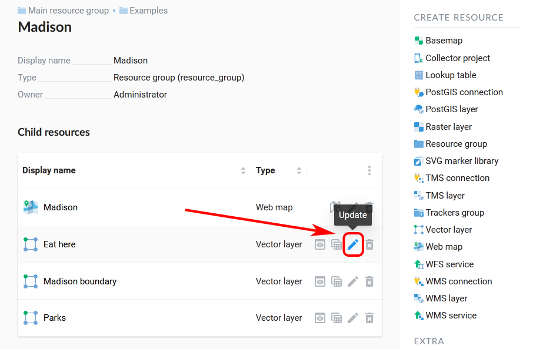

Alternatively, open the resource properties page and then select "Update" in the actions pane (see :numref:`ngw_window_update_edit_resource`).
 
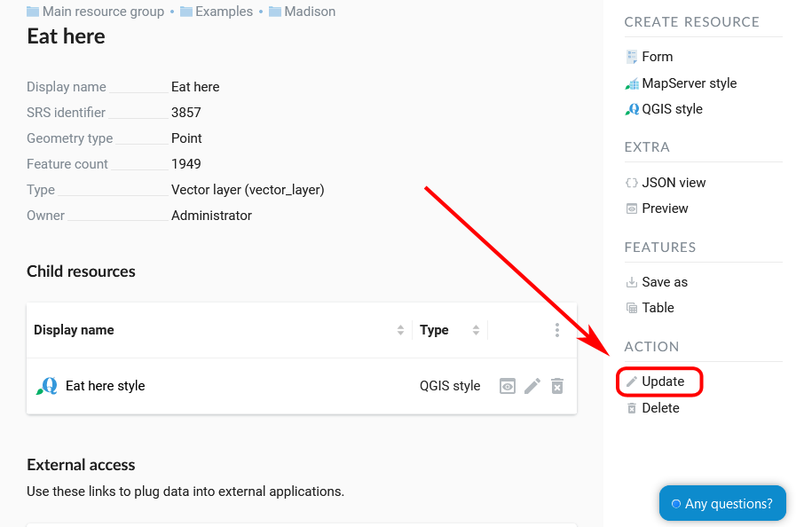

   Selection of "Update" action in the actions pane

In opened window "Update resource" (see :numref:`ngw_window_update_resource1`) you can 

* move the resource to a different parent resource, 
* add `description and metadata <https://docs.nextgis.com/docs_ngweb/source/edit_resource.html#edit-description-and-metadata>`_;
* configure `access permissions <https://docs.nextgis.com/docs_ngcom/source/permissions.html>`_. 

Depending on the resource type there are other tabs, e.g. for vector layers you can edit `attribute fields <https://docs.nextgis.com/docs_ngweb/source/layers_settings.html#edit-vector-layer-attributes-table>`_.

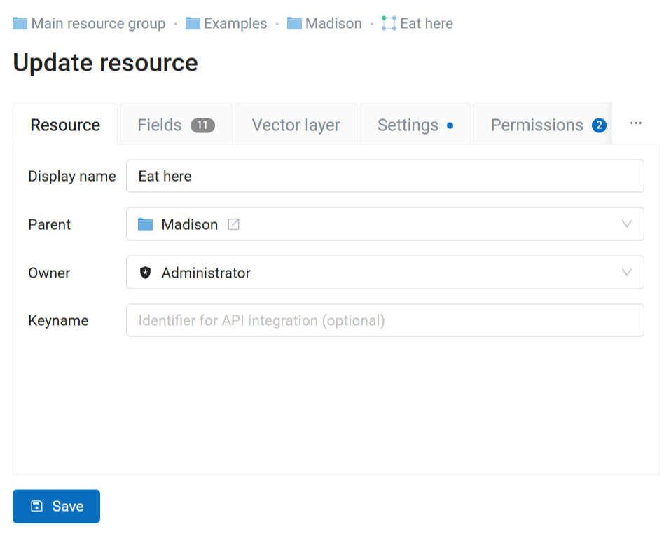

   "Update resource" window

Some tabs have grey numbers on them indicated the number of items (i.e. permission rules, layer fields etc).

Tabs that were modified are marked by blue dots.

On the first tab "Resource" you can edit the following fields:

1. Display name (you can change the resource's name)
2. Parent (you can change the resource group through moving the resource)
3. Owner
4. Keyname

.. _ngw_move_resource:

Move resource
-------------

You can move resources from one resource group to another. 

There are two ways to do so.

.. _ngcom_parent_change_update:

Using resource update
~~~~~~~~~~~~~~~~~~~~~~

This is a good way if you only need to move one resource.

#. Open the Properties page of a resource you want to transfer;
#. Select :menuselection:`Action --> Update` on the right side of Web GIS :ref:`admin console <ngw_admin_interface>`;
#. In the opened dialog window in the field :guilabel:`Parent` in :guilabel:`Resource` tab select Resource group you want to transfer your resource to;
#. Press :guilabel:`Save` button. If a resource is transferred successfully its name will appear in the new Resource group and disappear from the previous Resource group.

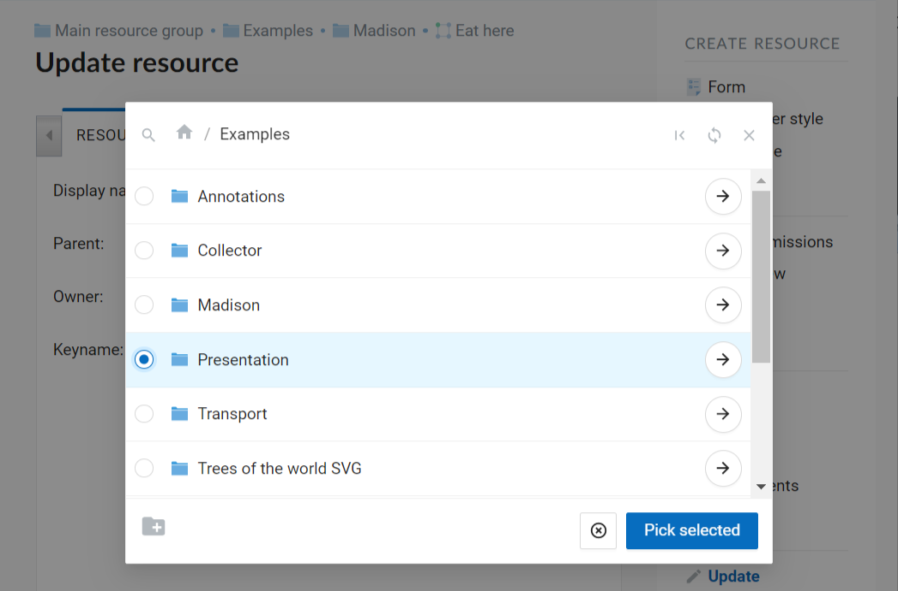

   Selecting the target group

In the same way you can transfer `Styles <https://docs.nextgis.com/docs_ngweb/source/mapstyles.html>`_ between parent resources (`Vector and raster layers <https://docs.nextgis.com/docs_ngweb/source/layers.html>`_, `PostGIS layers <https://docs.nextgis.com/docs_ngweb/source/postgis_details.html>`_).

.. _ngcom_parent_change_multi:

Using multiple selection
~~~~~~~~~~~~~~~~~~~~~~~~~

This way allows you to move several resources at once.

Open the group containing the resources you'd like to move. In the Child Resources list click the three dots in the upper right corner and in the menu press "Select multiple resources". 

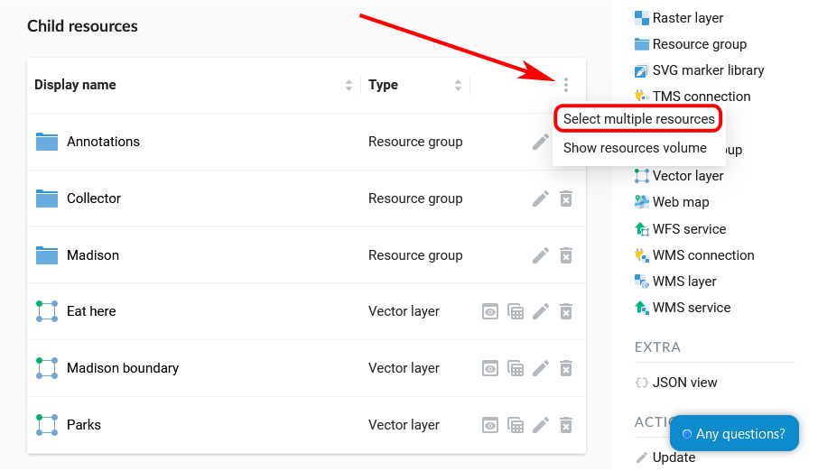
   
   Enabling multiple selection

Boxes will appear to the right of the resource names in the list. Tick them to mark resources for transfer. If you tick the box by the "Display name" title, all resources in the list will be selected. 
After selecting the resources, open the menu again and press "Move".

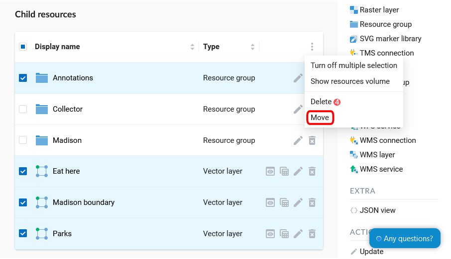
   
   Selecting resources to be moved

A pop-up window of group selection will open.
In this window you can use a search bar. Click the magnifying glass in the top left corner and start entering the name of the group you want to find.
To go up in the resource tree, click the path indicated in the top panel of the window. To open a folder from the list, click the arrow icon on the right.
If you want to return to the source group, click the icon **|<** in the top right corner.

To select the group as the destination, click the circle to the left of its name, a blue dot marker will appear. Then press "Move to selected group". To move resources to the main group, click on the house icon in the top panel of the pop-up window and then press "Move to this group".

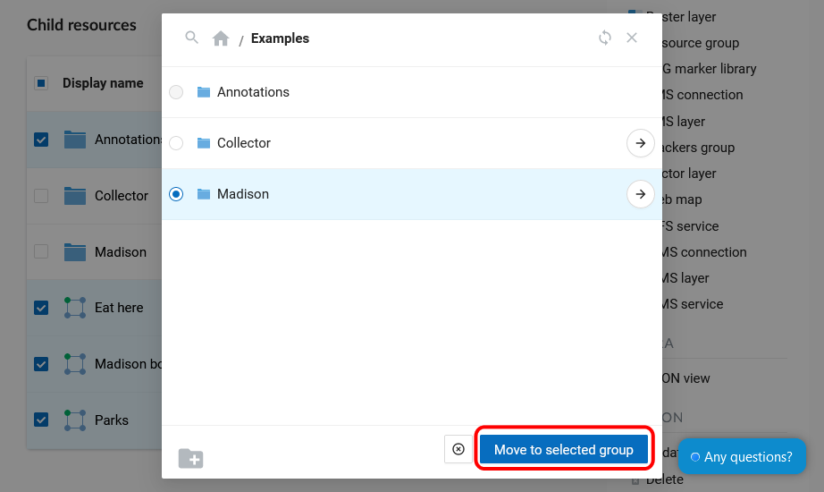
   
   Selecting the target group

If in the selected folder there are already resources with the same name as those you want to transfer, they will not be moved and the following message will appear:

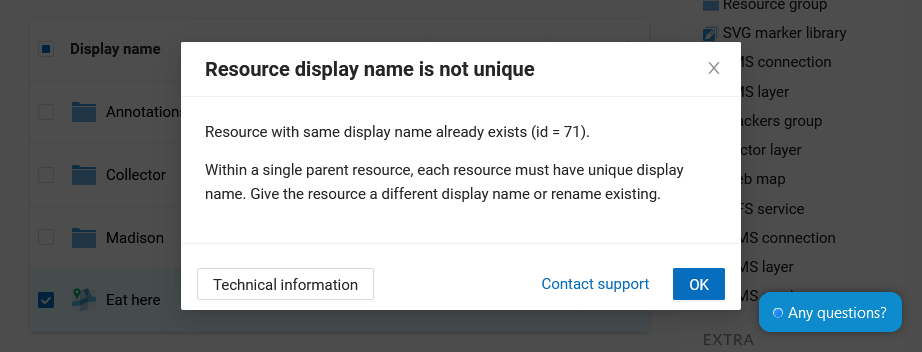

   Alert in case if the name is not unique

Close the alert window, change the name of one of the resources and try to move it again. 

If a resource is transferred successfully its name will appear in the new Resource group and disappear from the previous Resource group.

See how it works in our video:

.. raw:: html

   <iframe width="560" height="315" src="https://www.youtube.com/embed/-87-azrgakw?si=F6y0zttMAUdPeN0g" title="YouTube video player" frameborder="0" allow="accelerometer; autoplay; clipboard-write; encrypted-media; gyroscope; picture-in-picture; web-share" referrerpolicy="strict-origin-when-cross-origin" allowfullscreen></iframe>

Watch on `youtube <https://youtu.be/-87-azrgakw?si=xO3STGS1DgZiiQR_>`_.

.. _ngw_delete_resource:

Delete resource
---------------

Web GIS allows to delete uploaded data through deleting of the corresponding resources. 

In the group page press the cross icon opposite the resource.

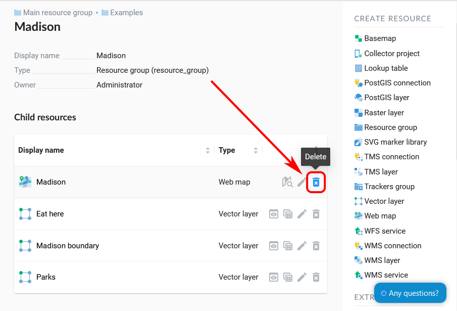
   
   Deleting resource from the group

A pop-up window for confirmation will appear. Click **Delete** to confirm.

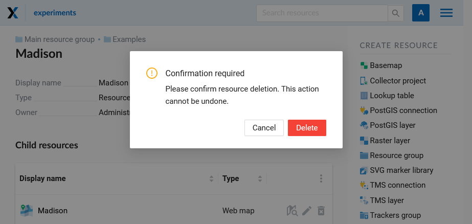
   
   Confirmation to delete a resource

Alternatively, open the resource page and then select "Delete" in the actions pane (see :numref:`ngw_window_update_delete_resource`). 

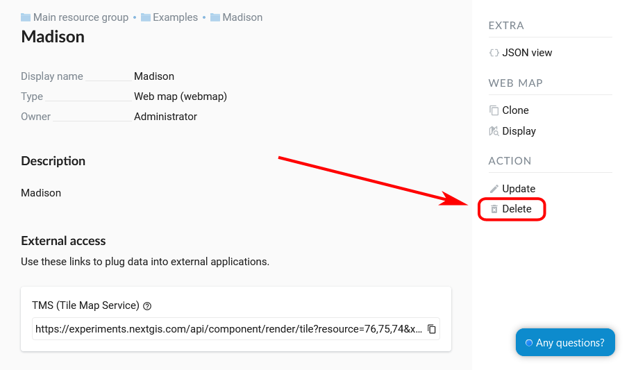

   Selection of "Delete" action in the action pane
   
In the opened "Delete resource" window you need to tick "Confirm deletion of the resource" and press **Delete** button. 

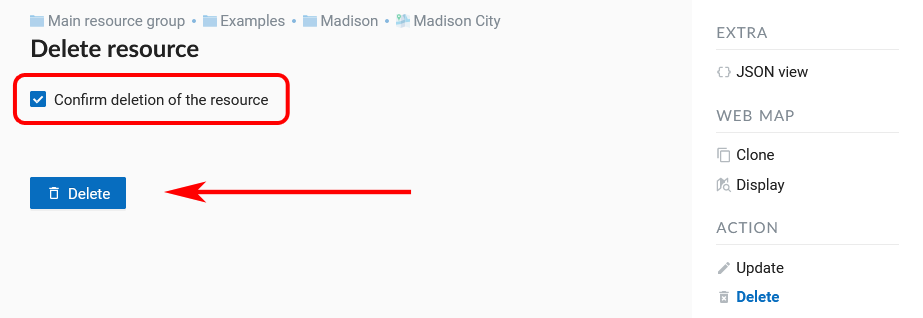

   "Delete resource" window

If the resource was deleted successfully, the information about it disappear from the corresponding resource group.

When a resource is deleted, all its subresources also get deleted. Before confirming deletion you'll see a warning about the number of resources of each type that are about to be deleted:

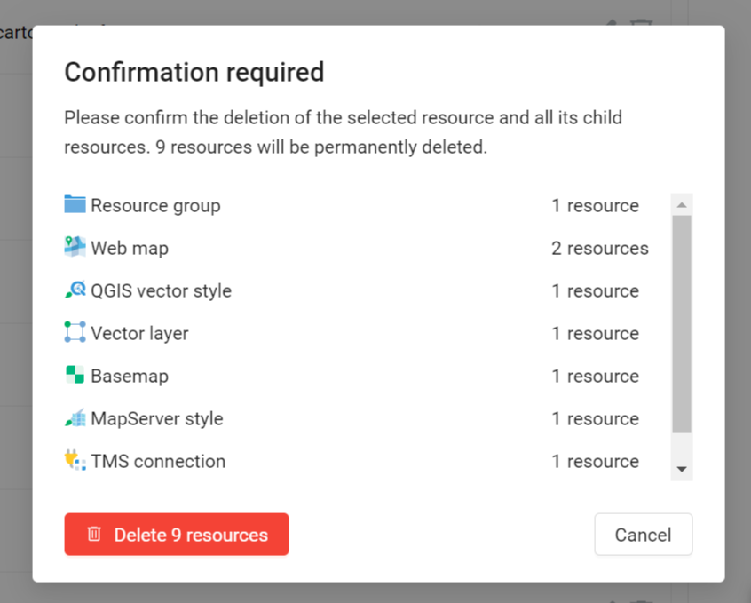

   Warning when deleting a resource group

If you selected "Delete" action from the resource page and not from the resource list, the name of the selected resource will be in the path above.

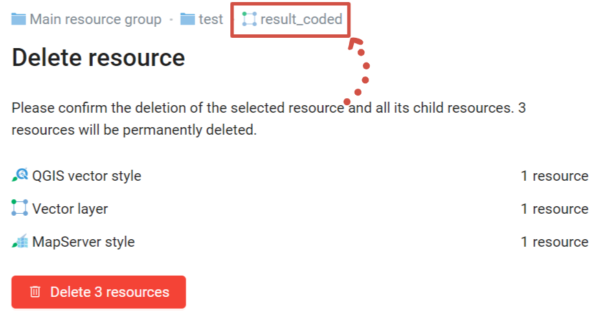

   Warning when deleting a layer

You can also delete resources in your Web GIS `from QGIS using NextGIS Connect plugin <https://docs.nextgis.com/docs_ngconnect/source/manage.html#connect-resource-delete>`_.

.. _ngw_delete_resource_multi:

Deleting several resources at once
~~~~~~~~~~~~~~~~~~~~~~~~~~~~~~~~~~~

In the parent resource open the child resources list menu and enable multiple selection.

Tick the resources and select "Delete" from the same menu. Confirm the operation in the pop-up window.

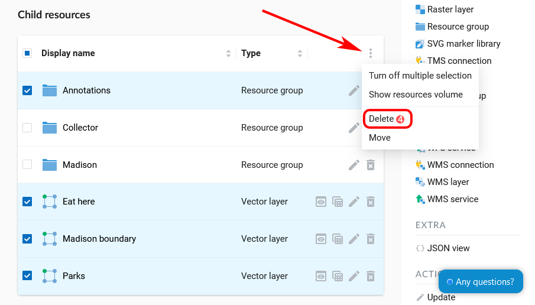
   
   Deleting multiple resources

.. _ngw_update_info_metada:

Edit description and metadata
---------------------------------

The "Description" tab allows to add text, links and images describing the resource.

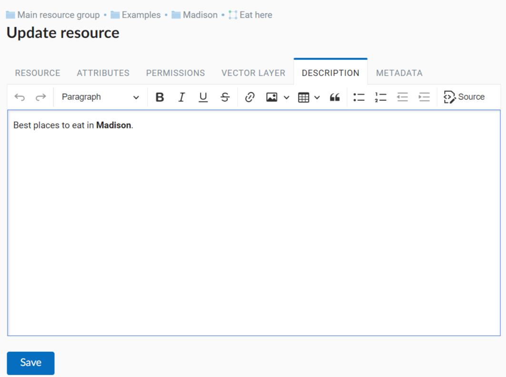
  
   "Description" tab

The "Metadata" tab allows to add and delete metadata, and to display them in a table using **Add** and **Remove** operations:  

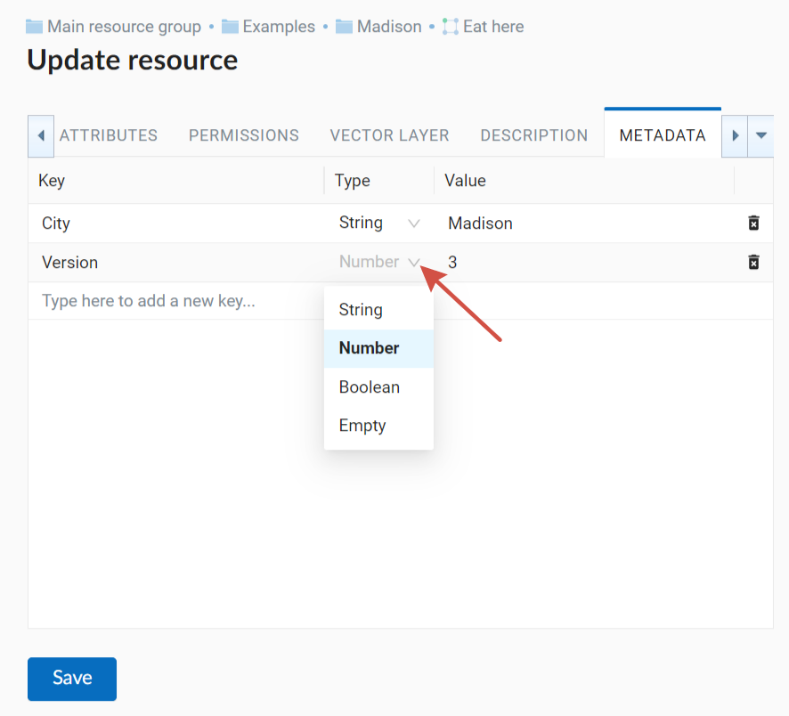

   "Metadata" tab

The table contains three columns: 

1. Key. It allows to describe metadata features (author, date, version etc.)
2. Type: String, Numer, Boolean, Empty (if you select "Empty", the value field will be cleared)
3. Value. Value corresponds to the key type

Typically, metadata is used to develop third-party applications using `API <https://docs.nextgis.com/docs_ngweb_dev/doc/developer/toc.html>`_.

.. _ngw_resource_key:

Keyname for API integrations
-----------------------------

On the Resource tab you can enter a unique Key for the resource to identify the resource in program code.

Key requirements:

* Plain latin symbols and numbers;
* The first symbol must be a letter.

In QGIS you can search a resource by its key via `NextGIS Connect <https://docs.nextgis.com/docs_ngconnect/source/filter.html#ngc-filter-expression>`_.
