.. _ngw_update_resource:

Изменение ресурса
===================

Для редактирования свойств ресурса необходимо:

* Находясь в родительском ресурсе, в списке дочерних напротив целевого слоя выбрать иконку "карандаш" (см. :numref:`ngw_update_edit_resource_from_group_pic`)

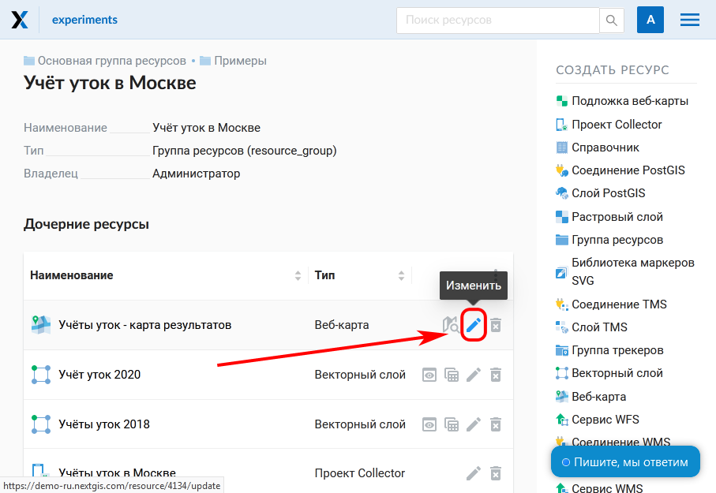

   Выбор действия "Изменить" в списке ресурсов

Или

* Перейти внутрь ресурса, свойства которого нужно изменить;
* Нажать кнопку "Изменить" в блоке операций справа (см. :numref:`ngw_window_update_edit_resource`)

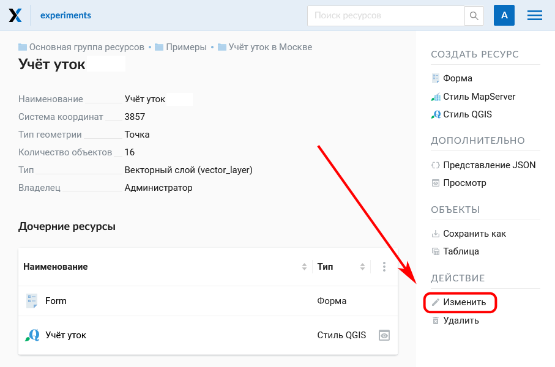

   Выбор действия "Изменить" на странице ресурса

После этого откроется окно "Изменить ресурс" (см. :numref:`ngw_window_update_resource1`), в котором можно добавить `описание и метаданные <https://docs.nextgis.ru/docs_ngweb/source/edit_resource.html#ngw-update-info-metada>`_, редактировать `родителя <https://docs.nextgis.ru/docs_ngweb/source/edit_resource.html#ngw-parent-change-update>`_ выбранного ресурса. 

Также в зависимости от типа ресурса доступны для редактирования другие вкладки, например, `поля (атрибуты) <https://docs.nextgis.ru/docs_ngweb/source/layers_settings.html#ngw-attributes-edit>`_.

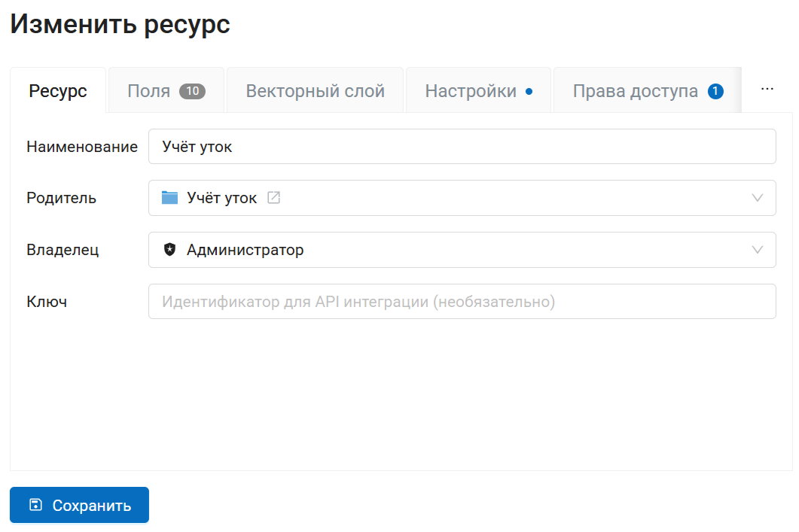

   Окно "Изменить ресурс"

На некоторых вкладках серым отмечено количество элементов (правил доступа, полей векторного слоя и т.п.).

Вкладки, в которые внесены изменения, отмечены синим кружком.

На первой вкладке "Ресурс" доступны к редактированию следующие поля:

1. Наименование (можно изменить имя ресурса)
2. Родитель (можно изменить группу ресурсов, переместив свой ресурс)
3. Владелец
4. Ключ

.. _ngw_move_resource:

Перемещение ресурса
-----------------------

Ресурсы можно перемещать из одной группы ресурсов в другую и после их создания. Для этого в поле "Родитель" нужно указать ту группу, куда вы хотите переместить текущий ресурс (см. :numref:`ngw_resource_selection`).

Это можно сделать двумя способами.

.. _ngw_parent_change_update:

Через изменение ресурса
~~~~~~~~~~~~~~~~~~~~~~~~~~

Этот способ подойдет, если нужно перенести всего один ресурс.

#. Откройте окно свойств ресурса, который вы хотите переместить;
#. Выберите :menuselection:`Действие --> Изменить` на правой панели :ref:`веб-интерфейса <ngw_admin_interface>` Веб ГИС;
#. В открывшемся окне через меню :guilabel:`Родитель` на вкладке :guilabel:`Ресурс` выберите Группу ресурсов, в которую вы хотите переместить свой ресурс;
#. Нажмите кнопку :guilabel:`Сохранить`. 

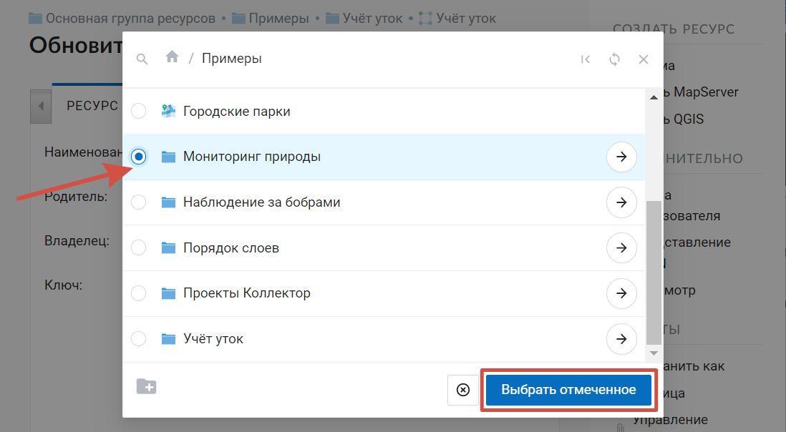

   Окно выбора группы ресурсов

Если ресурс успешно перемещен, то он появится в новой группе ресурсов и пропадет из старой.

Если в выбранной папке уже есть ресурс, название которого совпадает с обновляемым, он не будет перенесен, и на экране появится предупреждение:

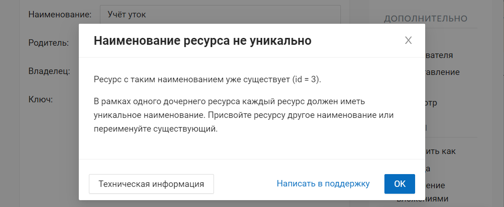

   Предупреждение о неуникальности имени

Закрыв его, измените имя ресурса и повторите шаги по выбору папки.

Аналогичным образом между родительскими ресурсами (`Векторными слоями <https://docs.nextgis.ru/docs_ngweb/source/layers.html#ngw-create-vector-layer>`_, `Растровыми слоями <https://docs.nextgis.ru/docs_ngweb/source/layers.html#ngw-create-raster-layer>`_, `Слоями PostGIS <https://docs.nextgis.ru/docs_ngweb/source/layers.html#postgis>`_) можно перемещать `Стили <https://docs.nextgis.ru/docs_ngweb/source/mapstyles.html>`_.

.. _ngw_parent_change_multi:

Через множественный выбор
~~~~~~~~~~~~~~~~~~~~~~~~~~

Этот способ удобен, если нужно перенести несколько ресурсов.

Откройте группу, в которой находятся ресурсы, которые вы хотите переместить. В списке дочерних рисурсов вызовите меню (три точки в правом верхнем углу) и нажмите "Выбрать несколько ресурсов". 

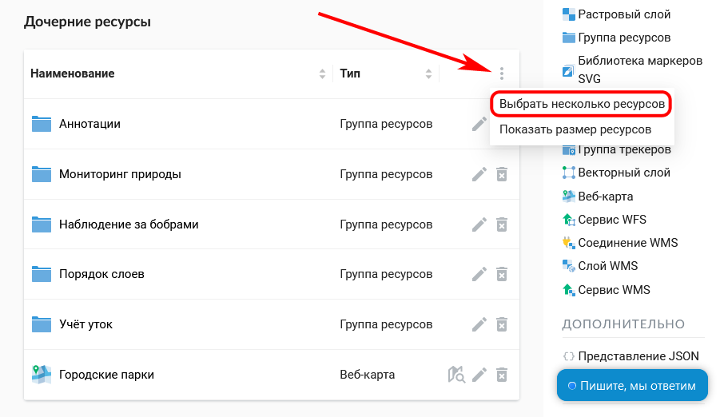
   
   Включение множественного выбора

Слева от названий ресурсов в списке появятся квадратики, в которые можно поставить галку, чтобы пометить нужные ресурсы. Если поставить галку рядом со заголовком "Наименование", будут выделены все ресурсы в списке. 
После того, как ресурсы отмечены, снова вызовите меню и выберите "Переместить".

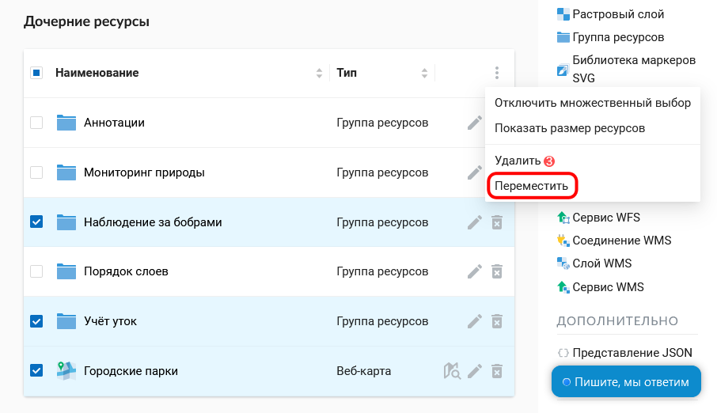
   
   Выбор ресурсов для перемещения

Появится всплывающее окно выбора группы.
В нём можно воспользоваться поиском, нажав на лупу в левом верхнем углу и начав вводить название нужной группы.
Для перемещения по дереву групп вверх используйте путь к папке в верхней части окна. Чтобы перейти в папку из списка, нажмите стрелку справа от ее названия.
Если вы хотите снова открыть группу, в которой находится исходная карта, нажмите значок **|<** в верхней части окна.

Чтобы отметить выбранную группу, поставьте маркер в кружке слева от её названия. Затем нажмите кнопку “Переместить в выбранную группу”. Если нужно перенести ресурсы в основную группу, нажмите на значок домика в верхней части всплывающего окна и затем на кнопку "Переместить в эту группу".

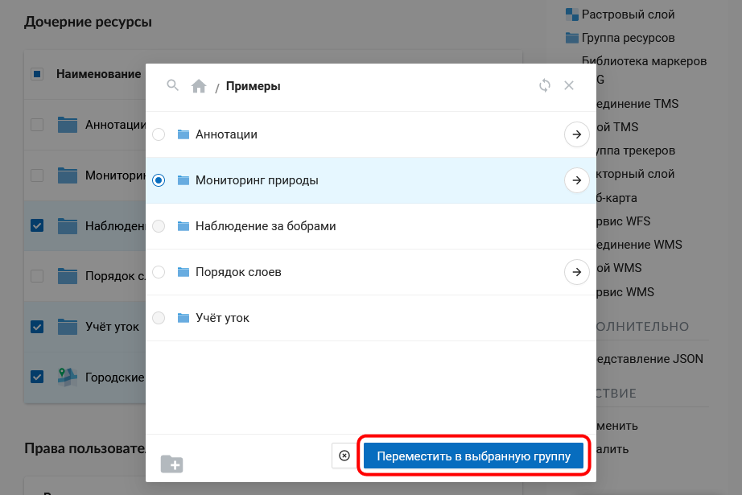
   
   Выбор группы, в которую будут перемещены ресурсы

Если в выбранной папке уже есть ресурсы, название которых совпадает с перемещаемыми, они не будут перенесены, и на экране появится предупреждение :numref:`parent_change_name_not_unique_pic`. Закрыв его, измените имя ресурса и повторите шаги по выбору папки.

Посмотрите, как работает множественное перемещение ресурсов, в нашем видео:

.. raw:: html

   <iframe width="560" height="315" src="https://rutube.ru/play/embed/c1d589500b2e996bc2fe4cd120674f86/" frameBorder="0" allow="clipboard-write; autoplay" webkitAllowFullScreen mozallowfullscreen allowFullScreen></iframe>

Смотреть на `youtube <https://youtu.be/KuAwCMw1ACc>`_, `rutube <https://rutube.ru/video/c1d589500b2e996bc2fe4cd120674f86/>`_.

.. _ngw_delete_resource:

Удаление ресурса
-----------------

NextGIS Web позволяет удалять созданные ресурсы. 

Это можно сделать несколькими способами:

Находясь в родительском ресурсе, в списке дочерних напротив целевого слоя выбрать иконку |button_delete| (см. :numref:`ngw_delete_resource_from_group_pic`)

.. |button_delete| image:: _static/button_delete.png
   :width: 6mm

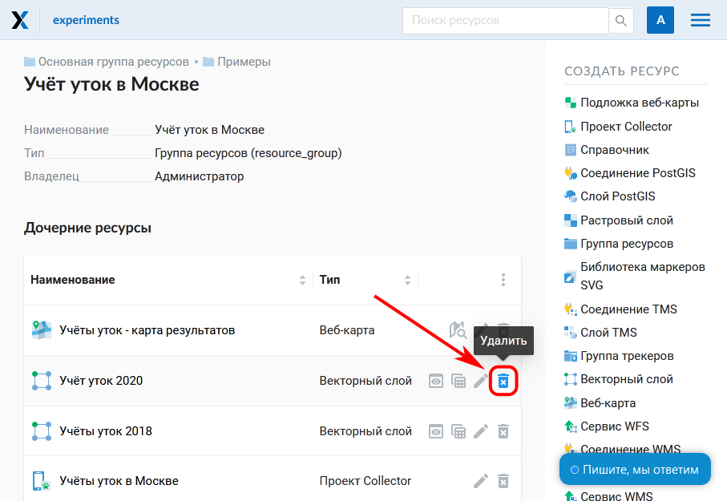

   Выбор действия "Удалить" в списке ресурсов

Затем подтвердить операцию во всплывающем окне.

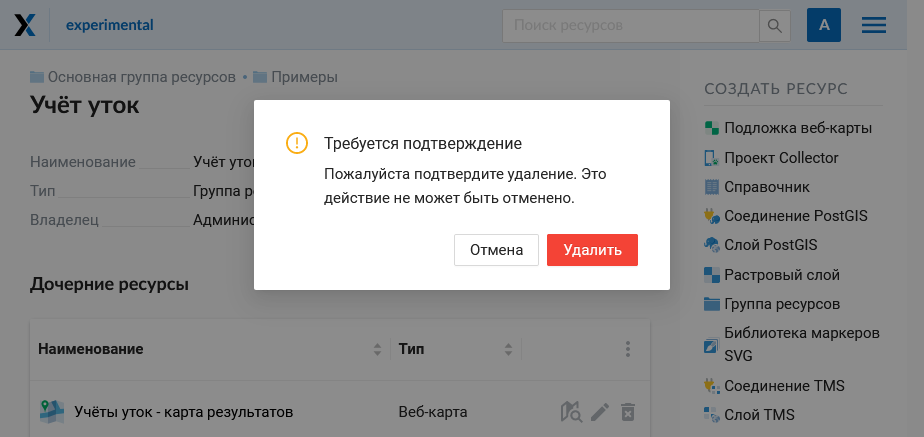

   Подтверждение удаления

Или

Перейти внутрь ресурса, который вы хотите удалить и нажать кнопку "Удалить" в блоке операций справа (см. :numref:`ngw_window_update_delete_resource`).

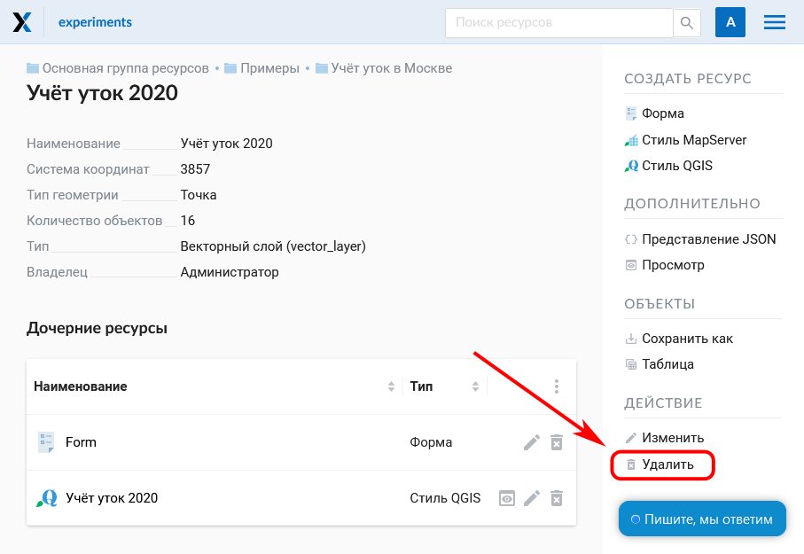

   Выбор действия "Удалить" на странице ресурса

Затем подтвердить операцию в открывшемся окне (см. :numref:`ngw_deletion_resource`), поставив галочку и нажав на синюю кнопку "Удалить".

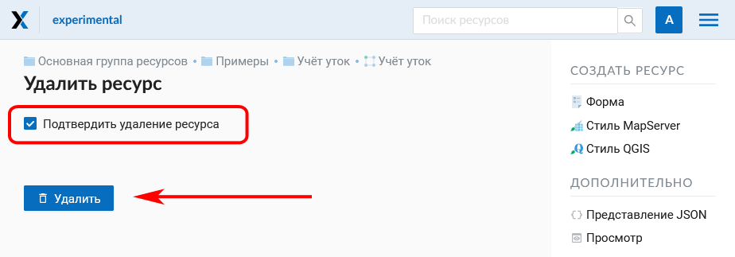

   Удаление ресурса

Если ресурс успешно удален, то информация о нем исчезнет из соответствующей группы ресурсов.

При удалении ресурса также удаляются все его дочерние ресурсы (содержимое группы, стили слоя). В процессе удаления появится предупреждение с указанием типов и количества удаляемых ресурсов:

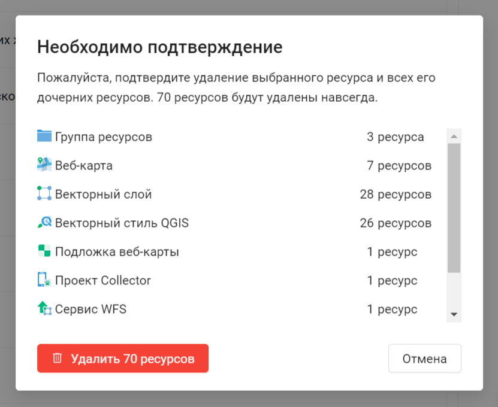

   Предупреждение при удалении группы ресурсов

Если удаление происходит со страницы ресурса, то имя основного выбранного для удаления ресура видно в строке пути.

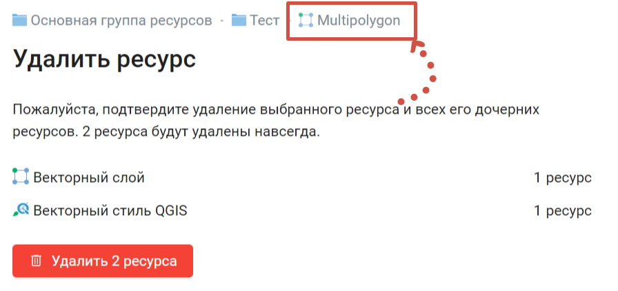

   Предупреждение при удалении слоя

.. _ngw_delete_resource_multi:

Удаление нескольких ресурсов сразу
~~~~~~~~~~~~~~~~~~~~~~~~~~~~~~~~~~

Находясь в родительском ресурсе, вызвать меню списка дочерних ресурсов, включить выбор нескольких ресурсов.

Выделить в списке ресурсы, которые необходимо удалить, и выбрать действие "Удалить" из того же меню. Затем подтвердить удаление во всплывающем окне.

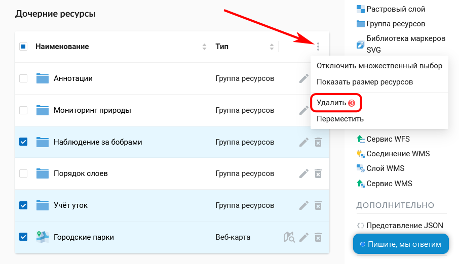
   
   Удаление нескольких ресурсов

.. note:: 
	Вы также можете удалять ресурсы из Веб ГИС `с помощью настольного приложения QGIS <https://docs.nextgis.ru/docs_ngconnect/source/ngc_data_transfer.html#connect-resource-delete>`_.

.. _ngw_update_info_metada:

Описание и метаданные
--------------------------

Вкладка "Описание" позволяет добавить текстовое описание и гибко его настроить, вставить изображение или ссылку на внешний ресурс.

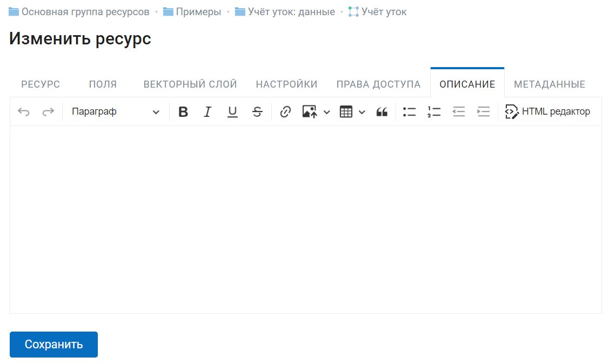
  
   Вкладка "Описание"

Вкладка "Метаданные" позволяет заносить, удалять метаданные и отображать их в таблице (Текст, Целое число, Вещественное число):  

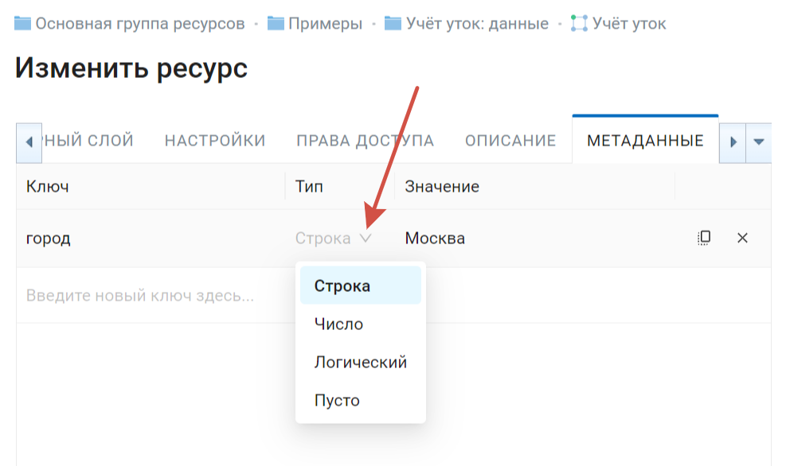

   Вкладка "Метаданные"

Таблица состоит из трех столбцов: 

1. Ключ. Ключ-значение позволяет описывать свойства метаданных (автор, дата, версия и тд.)
2. Тип. Типы данных: Строка, число, логический, пусто (если выбрать "Пусто", поле значения очистится)
3. Значение. Значение соответствует типу ключа

Как правило, метаданные используются для разработки сторонних приложений с помощью `API <https://docs.nextgis.ru/docs_ngweb_dev/doc/developer/toc.html>`_.

.. _ngw_resource_key:

Ключ для API-интеграции
-------------------------

На вкладке "Ресурс" можно задать уникальный ключ ресурса. Такой ключ используется при написании программного кода для интеграций.

Требования к ключу:

* Только латиница и цифры;
* Первый символ - буква.

Поиск ресурса по ключу доступен через модуль QGIS `NextGIS Connect <https://docs.nextgis.ru/docs_ngconnect/source/filter.html#ngc-filter-expression>`_.
