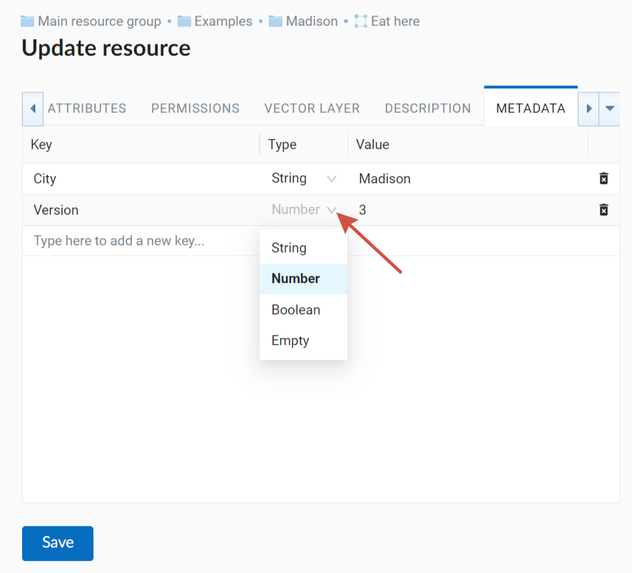

.. _ngw_update_resource:

Update resource
===================

In the group page press the pencil icon opposite the resource.

Alternatively, open the resource properties page and then select "Update" in the actions pane (see :numref:`ngw_window_update_edit_resource`).
 
.. figure:: _static/ngw_window_update_edit_resource_en.png
   :name: ngw_window_update_edit_resource
   :align: center
   :width: 20cm

   Selection of "Update" action in the actions pane

In opened window "Update resource" (see :numref:`ngw_window_update_resource1`) you can edit parent of the selected resource, add description, metadata and attributes of the resource.

.. figure:: _static/ngw_window_update_resource1_eng_3.png
   :name: ngw_window_update_resource1
   :align: center
   :width: 20cm

   "Update resource" window

On the first tab "Resource" you can edit the following fields:

1. Display name (you can change the resource's name)
2. Parent (you can change the resource group through moving the resource)
3. Owner
4. Keyname

.. _ngw_move_resource:

Move resource
-------------

You can move resources from one resource group to another. To do it press the arrow at the end of the Parent field and select resource group to move the resource to in the pop-up window (see :numref:`ngw_resource_selection`). Then press **OK** and **Save** button.

   Folder selection window

If the resource is moved successfully, the information about it appears in the new resource group and is removed from the previous one.

If in the selected folder there is already a resource with the same name as the one you want to transfer, it will not be moved and the following message will appear:

   Alert in case if the name is not unique

Close the alert window, change the name of the resource and try to change the parent again.

.. _ngw_update_info_metada:

Edit description and metadata
---------------------------------

The "Description" tab allows to add text, links and images describing the resource.

  
   "Description" tab

The "Metadata" tab allows to add and delete metadata, and to display them in a table using **Add** and **Remove** operations:  

   "Metadata" tab

The table contains three columns: 

1. Key. It allows to describe metadata features (author, date, version etc.)
2. Type: String, Numer, Boolean, Empty (if you select "Empty", the value field will be cleared)
3. Value. Value corresponds to the key type

.. _ngw_attributes_edit:

Edit vector layer attributes table
-----------------------------------

"Fields" tab contains a table with vector layer attributes (see :numref:`ngweb_admin_layers_attr`).

   "Fields" tab

Click on a table row to open the attribute edit form. You can manage the following parameters:

* Name - you can set the display name to use in the identification window instead of the keyname. 

   The identification window

   Display name with superscript symbol and keyname of the field

* Key
* Type
* Lookup table - allows to add a lookup table to the field and use it to select values of the attribute when you add or edit features. To add a lookup table, click on the field in the form, then in the pop-up window select the resource.

   Adding lookup table to a field

.. |attr_label_symbol| image:: _static/attr_label_symbol.png
.. |attr_text_search_symbol| image:: _static/attr_text_search_symbol.png

* |attr_table_symbol| Feature table - the attribute is displayed in the identification window.
* |attr_text_search_symbol| Text search - you can disable text search in the values of the attribute.
* |attr_label_symbol| Label attribute - the attribute is used for bookmarks.

For these three parameters a dark symbol means "on" and a light symbol means "off".

* Delete

To go back to table view, press the arrow in the top row of the form.

After all edits are made, click **Save**.

.. _ngw_delete_resource:

Delete resource
---------------

Web GIS allows to delete uploaded data through deleting of the corresponding resources. 

In the group page press the cross icon opposite the resource.

.. figure:: _static/ngw_delete_resource_from_group_en.png
   :name: ngw_delete_resource_from_group_pic
   :align: center
   :width: 20cm
   
   Deleting resource from the group

A pop-up window for confirmation will appear. Click **Delete** to confirm.

.. figure:: _static/ngw_delete_from_group_confirmation_en.png
   :name: ngw_delete_resource_from_group_pic
   :align: center
   :width: 20cm
   
   Confirmation to delete a resource

Alternatively, open the resource page and then select "Delete" in the actions pane (see :numref:`ngw_window_update_delete_resource`). 

.. figure:: _static/ngw_window_update_delete_resource_2.png
   :name: ngw_window_update_delete_resource
   :align: center
   :width: 20cm

   Selection of "Delete" action in the action pane
   
In the opened "Delete resource" window you need to tick "Confirm deletion of the resource" and press **Delete** button. 

.. figure:: _static/ngw_delete_from_page_confirmation_en.png
   :name: ngw_delete_from_group_confirmation_pic
   :align: center
   :width: 20cm

   "Delete resource" window

If the resource was deleted successfully, the information about it disappear from the corresponding resource group.

.. _ngw_delete_resource_multi:

Deleting several resources at once
~~~~~~~~~~~~~~~~~~~~~~~~~~~~~~~

In the parent resource open the child resources list menu and enable multiple selection.

Tick the resources and select "Delete" from the same menu. Confirm the operation in the pop-up window.

.. figure:: _static/delete_selected_multiple_en.png
   :name: delete_selected_multiple_pic
   :align: center
   :width: 20cm
   
   Deleting multiple resources
