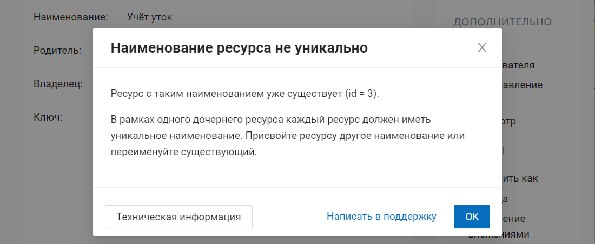
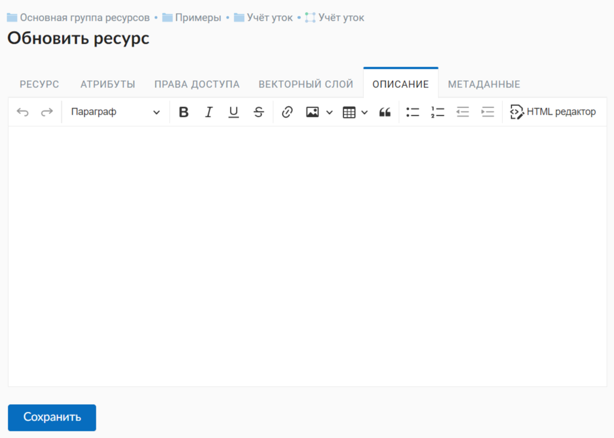
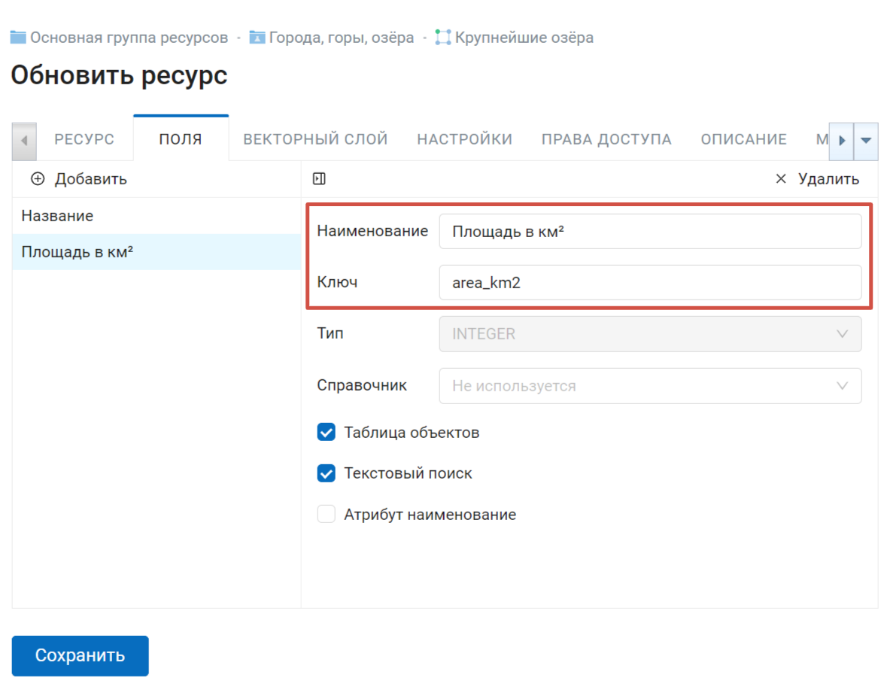
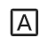
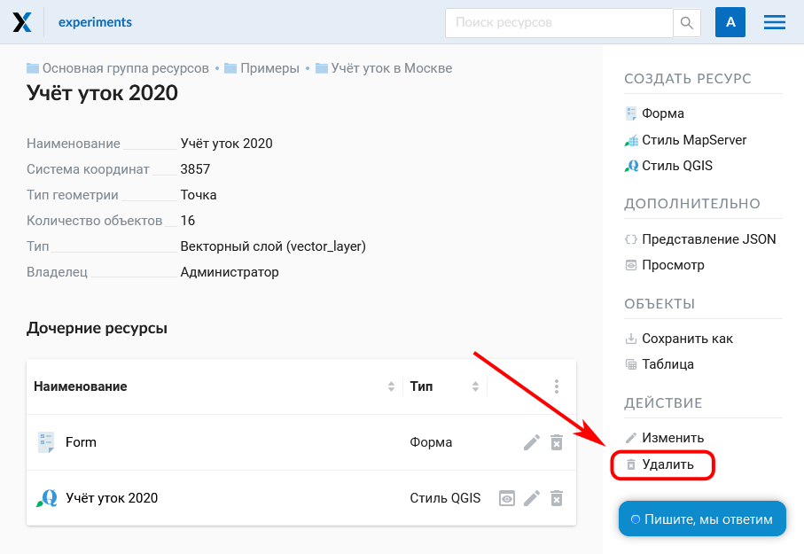

.. _ngw_update_resource:

Обновление ресурса
===================

Для изменения свойств ресурса необходимо:

* Находясь в родительском ресурсе, в списке дочерних напротив целевого слоя выбрать иконку "карандаш" (см. :numref:`ngw_update_edit_resource_from_group_pic`)

.. figure:: _static/ngw_update_edit_resource_from_group_rus.png
   :name: ngw_update_edit_resource_from_group_pic
   :align: center
   :width: 20cm

   Выбор действия "Изменить" в списке ресурсов

Или

* Перейти внутрь ресурса, свойства которого нужно изменить;
* Нажать кнопку "Изменить" в блоке операций справа (см. :numref:`ngw_window_update_edit_resource`)

.. figure:: _static/ngw_window_update_edit_resource_rus_2.png
   :name: ngw_window_update_edit_resource
   :align: center
   :width: 20cm

   Выбор действия "Изменить" на странице ресурса

После этого откроется окно "Обновить ресурс" (см. :numref:`ngw_window_update_resource1`), в котором можно добавить описание, редактировать родителя, метаданные и атрибуты выбранного ресурса.

.. figure:: _static/ngw_window_update_resource1_rus_3.png
   :name: ngw_window_update_resource1
   :align: center
   :width: 20cm

   Окно "Обновить ресурс"

На первой вкладке "Ресурс" доступны к редактированию следующие поля:

1. Наименование (можно изменить имя ресурса)
2. Родитель (можно изменить группу ресурсов, переместив свой ресурс)
3. Владелец
4. Ключ

Перемещение ресурса
-----------------------

Ресурсы можно перемещать из одной группы ресурсов в другую и после их создания. 
Для этого в поле "Родитель" нужно выбрать ту группу, куда вы хотите переместить текущий ресурс (см. :numref:`ngw_resource_selection`). Выбрав группу ресурсов для перемещения своего ресурса, нажмите **Ok** и сохраните изменения. 

.. figure:: _static/ngw_resource_selection_rus_3.png
   :name: ngw_resource_selection
   :align: center
   :width: 20cm

   Окно выбора группы ресурсов

Если ресурс успешно перемещен, то он появится в новой группе ресурсов и пропадет из старой.

Если в выбранной папке уже есть ресурс, название которого совпадает с обновляемым, он не будет перенесен, и на экране появится предупреждение:

   Предупреждение о неуникальности имени

Закрыв его, измените имя ресурса и повторите шаги по выбору папки.

Описание и метаданные
--------------------------

Вкладка "Описание" позволяет добавить текстовое описание и гибко его настроить, вставить изображение или ссылку на внешний ресурс.

  
   Вкладка "Описание"

Вкладка "Метаданные" позволяет заносить, удалять метаданные и отображать их в таблице (Текст, Целое число, Вещественное число):  

.. figure:: _static/ngw_metadata_tab_rus_3.png
   :name: ngw_metadata_tab
   :align: center
   :width: 16cm

   Вкладка "Метаданные"

Таблица состоит из трех столбцов: 

1. Ключ. Ключ-значение позволяет описывать свойства метаданных (автор, дата, версия и тд.)
2. Тип. Типы данных: Строка, число, логический, пусто (если выбрать "Пусто", поле значения очистится)
3. Значение. Значение соответствует типу ключа

Редактирование атрибутов векторного слоя
-------------------------------------------

Вкладка "Поля" содержит таблицу, в которой перечислены атрибуты выбранного слоя (см. :numref:`ngweb_admin_layers_attr`).

   Вкладка "Поля"

При клике на строку таблицы откроется форма редактирования атрибута. Можно настроить следующие параметры:

* Наименование - можно поставить соответствующий псевдоним для отображения вместо технического ключа поля в окне идентификации.

.. figure:: _static/webmap_identification_rus_2.png
   :name: ngweb_webmap_identification
   :align: center
   :width: 20cm

   Окно идентификации

   Наименование поля с верхним индексом и его ключ

* Ключ
* Тип
* Справочник - позволяет подключить к полю справочник, из которого будут браться значения атрибута при добавлении или редактировании объектов. Для того, чтобы добавить справочник, нажмите на поле и выберите во всплывающем окне соответствующий ресурс.

   Добавление справочника

.. |attr_table_symbol| image:: _static/attr_table_symbol.png

* |attr_table_symbol| Таблица объектов - обозначает, что атрибут выводится в окне идентификации.
* |attr_text_search_symbol| Текстовый поиск - можно отключить поиск по значениям этого атрибута.
* |attr_label_symbol| Атрибут наименование - из этого атрибута формируется список закладок.

Для этих трех параметров темный значок в таблице означает "включен", светлый - "выключен".

* Удалить объект

Чтобы вернуться в режим таблицы, нажмите стрелочку в верхнем ряду.

После внесения изменений нажмите **Сохранить**.

.. _ngw_attributes_edit:

Удаление ресурса
-----------------

NextGIS Web позволяет удалять созданные ресурсы. 

Это можно сделать несколькими способами:

Находясь в родительском ресурсе, в списке дочерних напротив целевого слоя выбрать иконку "крест" (см. :numref:`ngw_delete_resource_from_group_pic`)

.. figure:: _static/ngw_delete_resource_from_group_ru.png
   :name: ngw_delete_resource_from_group_pic
   :align: center
   :width: 20cm

   Выбор действия "Удалить" в списке ресурсов

Затем подтвердить операцию во всплывающем окне.

.. figure:: _static/ngw_deletion_resource_from_group_ru.png
   :name: ngw_deletion_resource_from_group_pic
   :align: center
   :width: 20cm

   Подтверждение удаления

Или

Перейти внутрь ресурса, который вы хотите удалить и нажать кнопку "Удалить" в блоке операций справа (см. :numref:`ngw_window_update_delete_resource`).

   Выбор действия "Удалить" на странице ресурса

Затем подтвердить операцию в открывшемся окне (см. :numref:`ngw_deletion_resource`), поставив галочку и нажав на синюю кнопку "Удалить".

.. figure:: _static/ngw_deletion_resource_rus_2.png
   :name: ngw_deletion_resource
   :align: center
   :width: 20cm

   Удаление ресурса

Если ресурс успешно удален, то информация о нем исчезнет из соответствующей группы ресурсов.

Удаление нескольких ресурсов сразу
~~~~~~~~~~~~~~~~~~~~~~~~~~~~~~~~~~

Находясь в родительском ресурсе, вызвать меню списка дочерних ресурсов, включить выбор нескольких ресурсов.

Выделить в списке ресурсы, которые необходимо удалить, и выбрать действие "Удалить" из того же меню. Затем подтвердить удаление во всплывающем окне.

.. figure:: _static/delete_selected_multiple_ru.png
   :name: delete_selected_multiple_pic
   :align: center
   :width: 20cm
   
   Удаление нескольких ресурсов

