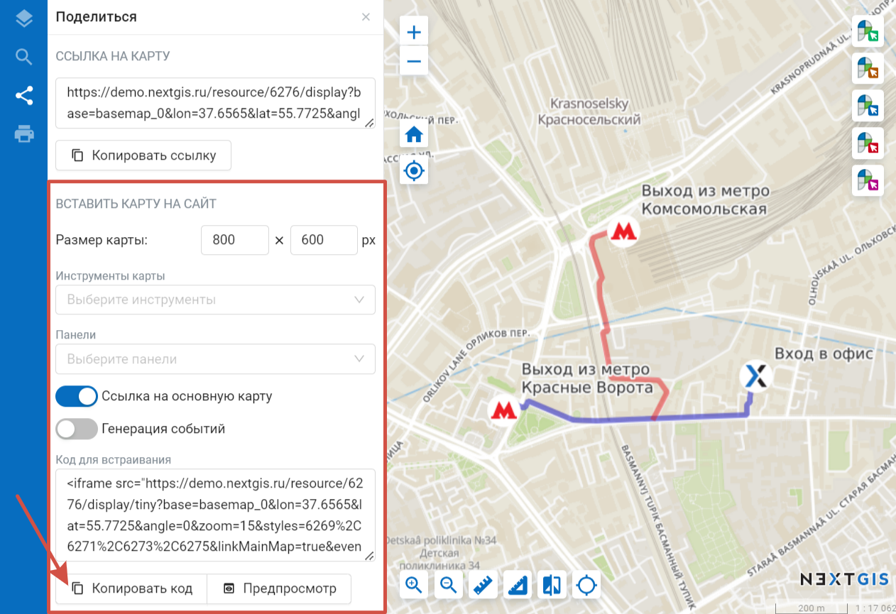
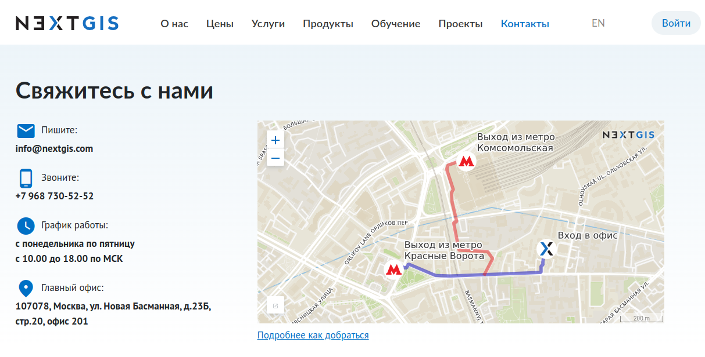
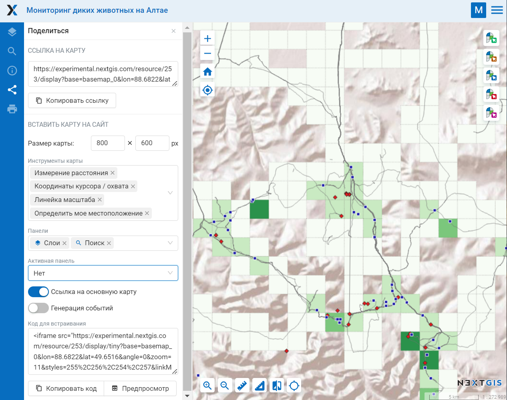

.. _ngw_embed_webmap:

Как вставить веб-карту на свой веб-сайт
=======================================

Все веб-карты, созданные на nextgis.com, могут быть легко встроены в свой сайт.

.. note:: 
	Эта функциональность доступна только для пользователей планов `Mini и Premium <http://nextgis.ru/nextgis-com/plans>`_.

Для встраивания:

* Откройте веб-карту 
* Нажмите на вкладку |panel_share| «Поделиться» на левой боковой панели
* При необходимости настройте ширину и высоту карты и `другие параметры <https://docs.nextgis.ru/docs_ngweb/source/embed_webmap.html#ngw-embed-webmap-settings>`_.
* Скопируйте код 
* Вставьте код на свой сайт.

.. |panel_share| image:: _static/panel_share.png
   :width: 6mm

   Панель встраивания веб-карты на сайт
   
   

   Пример встроенной на сайт веб-карты

Для предварительного просмотра встроенной веб-карты перед её публикацией доступен **Предпросмотр**.

.. _ngw_embed_webmap_settings:

Настройки встраивания
------------------------

**Размер карты** - указывается в пикселях.

**Ссылка на основную карту** - для перехода с сайта на страницу карты в Веб ГИС.

**Генерация событий** - для интеграции и программного взаимодействия с iframe.

Также можно встроить карту с дополнительными иснтрументами и панелями, что позволит, например, включать и отключать слои. 

**Инструменты**, которые могут быть доступны на встроенной карте:

- идентификация объектов;
- измерение площади и расстояния;
- координаты курсора и охвата;
- линейка масштаба;
- начальный охват;
- определение местоположения;
- приближение и отдаление;
- числовой масштаб.

Также можно настроить, какие **панели** будут доступны на карте:

- описание;
- слои;
- поиск.

Если выбрано несколько панелей, в меню **"Активная панель"** одну из них можно выбрать в качестве начальной или настроить, чтобы карта открывалась со свернутыми панелями.

Все настройки зашиваются в единый код.

   Настройки встраивания веб-карты

Если вы разработчик, то ознакомьтесь с набором библиотек `code.nextgis.com <https://code.nextgis.com/>`_ и описанием `NGW API <https://docs.nextgis.ru/docs_ngweb_dev/doc/toc.html>`_.

