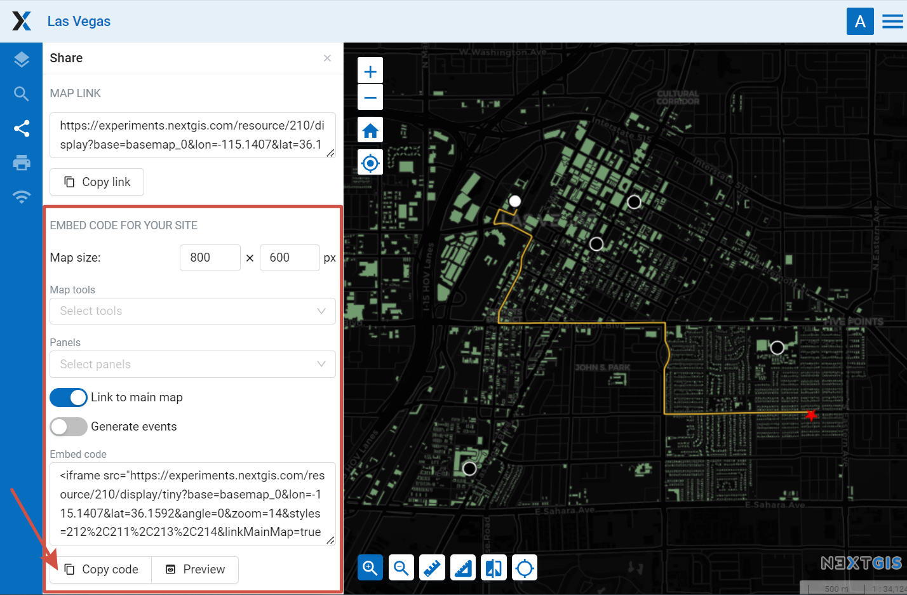
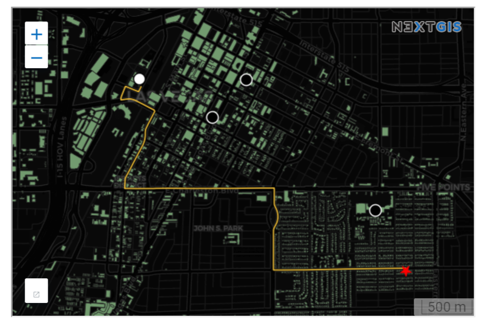
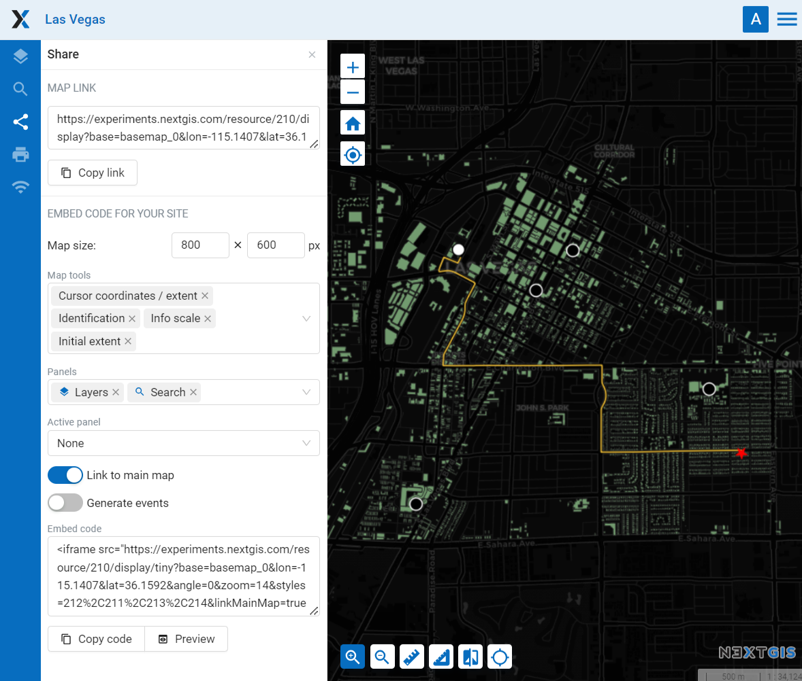

.. _ngw_embed_webmap:

Embed Web Map on a Web page
======================================

All Web Maps created on nextgis.com can be easily embedded into your website.

.. note:: 
	This functionality is available only to nextgis.com `Mini and Premium <http://nextgis.com/nextgis-com/plans>`_ users.

To embed a Web Map:

* Open Web Map 
* Click on the |panel_share| “Share” panel on the left sidebar
* If you wish to, customize map width and height and `other parameters <https://docs.nextgis.com/docs_ngcom/source/embed_webmap.html#ngcom-embed-webmap-settings>`_.
* Copy the code 
* Paste this code to your site

.. |panel_share| image:: _static/panel_share.png
   :width: 6mm

   Sharing panel
   
   

   Embedded Web Map example

You can preview the embedded map before publishing it by pressing **Preview** button.

.. _ngweb_embed_webmap_settings:

Embeded map settings
------------------------

**Map size** - width and height in pixels.

**Link to the main map** - to go from the site to the map page in the Web GIS.

**Generate events** - for integration and programmatic interaction with the iframe.

You can also embed a Web Map with additional tools and panels. This will allow users, for instance, to enable and disable particular layers. 

**Tools** available for embeded map:

- feature identification;
- measuring area and distance;
- cursor location and extent coordinates;
- scale line;
- initial extent;
- marking user location;
- zoom;
- scale info.

You can also choose which **panels** will be available on the map:

- description;
- layers;
- search.

If several panels are added, you can use the **Active panel** menu to select one of them to be displayed by default or have the map open with the panels minimized.

All settings are included in the code.

   Web Map embedding settings

If you are a developer check out the `code.nextgis.com <https://code.nextgis.com/>`_ library suite
and the `NGW API <https://docs.nextgis.com/docs_ngweb_dev/doc/toc.html>`_.

