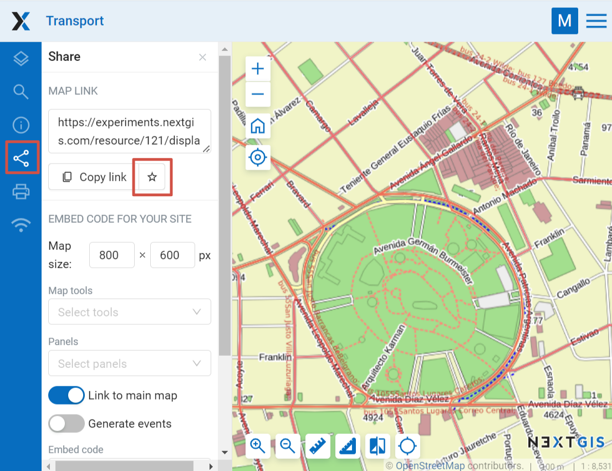
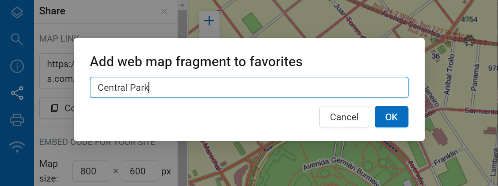
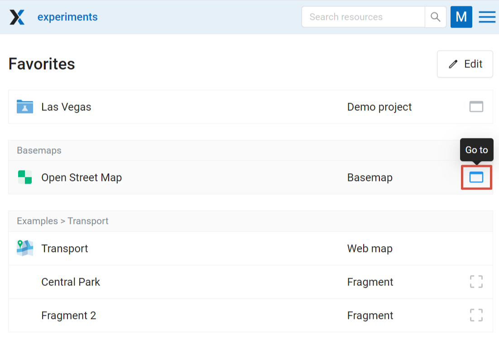

.. _ngw_favorites:

Favorites
==========

In NextGIS Web, you can have quick access to the most frequently used resources (groups, layers, maps and fragments of maps) through the Favorites feature.   

To add a resource to Favorites, navigate to its page, click on the user initials in the top panel to open the menu and press the star icon. Click on the Favorites item in the menu to open the Favorites page.

.. figure:: _static/ngw_add_favorites_en.png
   :name: ngw_add_favorites_pic
   :align: center
   :width: 16cm

   Adding to Favorites

On the Favorites page you can edit the list of added resources and modify names of Web Map fragmets (more about managing Favorites `here <https://docs.nextgis.com/docs_ngcom/source/favorites.html>`_).

.. figure:: _static/ngw_edit_wm_fragment_name_en.png
   :name: ngw_edit_wm_fragment_name_pic
   :align: center
   :width: 16cm

   Editing Favorites

.. _ngcom_favorites_wm_fragment:

How to add Web Map fragment to Favorites
~~~~~~~~~~~~~~~~~~~~~~~~~~~~~~~~~~~~~~~~~~~~~

You can add a Web Map to Favorites with the extent different from the initial extent chosen in the Web Map settings. To do so open the map, modify the extent, then open the "Share" tab and press the star next to the "Copy link" button.

   Adding Web Map fragment to Favorites

You can set up a custom name for the fragment or keep the default ("Fragment").

   Name for the fragment

The fragment name can later be edited from the Favorites page (see below).

.. _ngcom_favorites_edit:

Favorites list editing
~~~~~~~~~~~~~~~~~~~~~~~~~~~~~~~~~~~~~~~

The Favorites page contains a list of the added resources. Above each one there is the name of the parent resource, if it's not the Main resource group.

   Favorites

To open the page of a resource, press  **Go to** button on the right end of the row. 

Press **Edit** button to modify the list.

.. figure:: _static/ngw_edit_wm_fragment_name_en.png
   :name: ngw_edit_wm_fragment_name_pic
   :align: center
   :width: 16cm

   Editing Favorites

To remove a resource from Favorites, click the bin icon on the right. No additional confirmation needed. Deleting from Favorites will not affect the resource itself. You can add it to Favorites and remove it multiple times.

Also from this page you can modify the name of the added Web Map fragments. 

To exit the editing mode, press **Done**.

See how to use Favorites in our video: 

.. raw:: html

   <iframe width="560" height="315" src="https://www.youtube.com/embed/Nk42wbopjBk?si=-Ta58YrUl1CdoUAL" title="YouTube video player" frameborder="0" allow="accelerometer; autoplay; clipboard-write; encrypted-media; gyroscope; picture-in-picture; web-share" referrerpolicy="strict-origin-when-cross-origin" allowfullscreen></iframe>

Watch on `youtube <https://youtu.be/Nk42wbopjBk?si=mK0uk6t6c4lE0i-z>`_.
