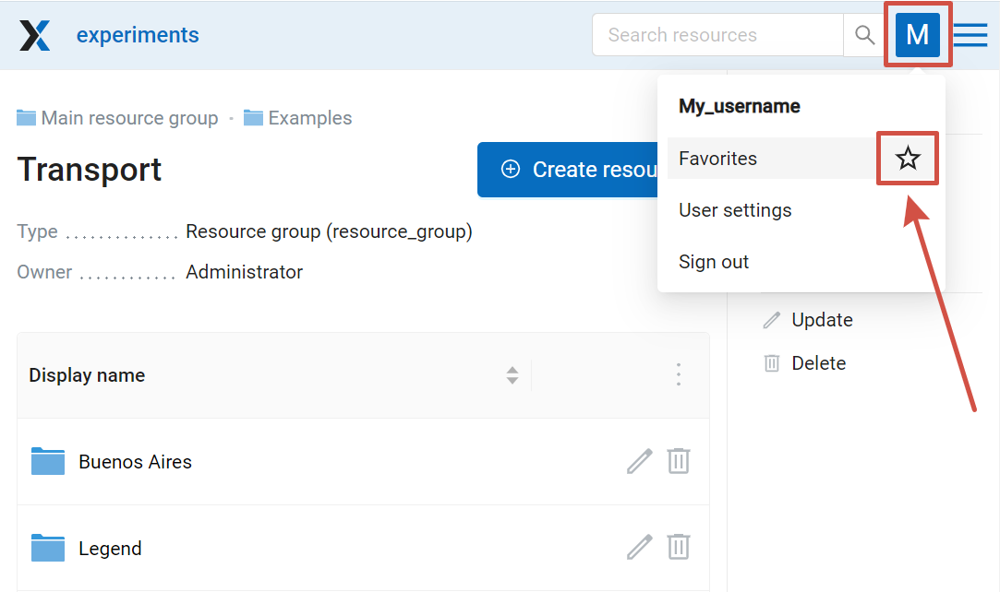
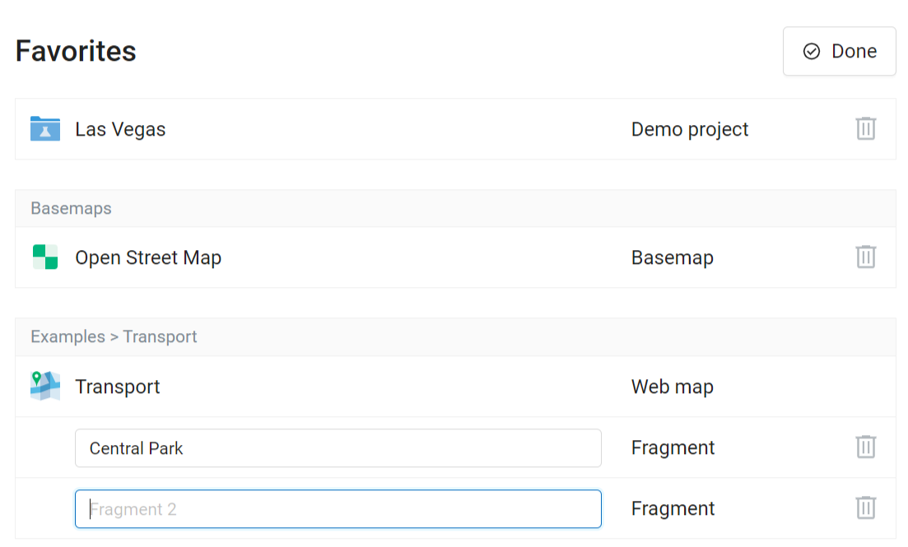

.. _ngw_favorites:

Favorites
==========

In NextGIS Web, you can have quick access to the most frequently used resources (groups, layers, maps and fragments of maps) through the Favorites feature.   

To add a resource to Favorites, navigate to its page, click on the user initials in the top panel to open the menu and press the star icon. Click on the Favorites item in the menu to open the Favorites page.

   Adding to Favorites

On the Favorites page you can edit the list of added resources and modify names of Web Map fragmets (more about managing Favorites `here <https://docs.nextgis.com/docs_ngcom/source/favorites.html>`_).

   Editing Favorites

