.. _ngw_edit_objects:

Редактирование векторных объектов
====================================

Вы можете редактировать **геометрии и атрибуты** объектов в Векторных слоях через веб-интерфейс: `в таблице объектов <https://docs.nextgis.ru/docs_ngweb/source/feature_table.html>`_ или на веб-карте (подробнее описано ниже), - а также `с помощью настольного приложения QGIS <https://docs.nextgis.ru/docs_ngconnect/source/edit.html>`_.

.. _ngw_allow_edit:

Разрешить редактирование на веб-карте
--------------------------------------

.. important:: По умолчанию редактирование объектов веб-карты всегда отключено. 

Чтобы пользователь смог вносить изменения в слои на карте, редактирование нужно включить в настройках веб-карты. Нажмите |button_edit| рядом с названием веб-карты в списке ресурсов, чтобы открыть страницу `Изменение ресурса <https://docs.nextgis.ru/docs_ngweb/source/edit_resource.html#ngw-update-resource>`_.

На вкладке "Настройки" включите редактирование слоёв, выбрав соответствующую опцию в выпадающем меню:

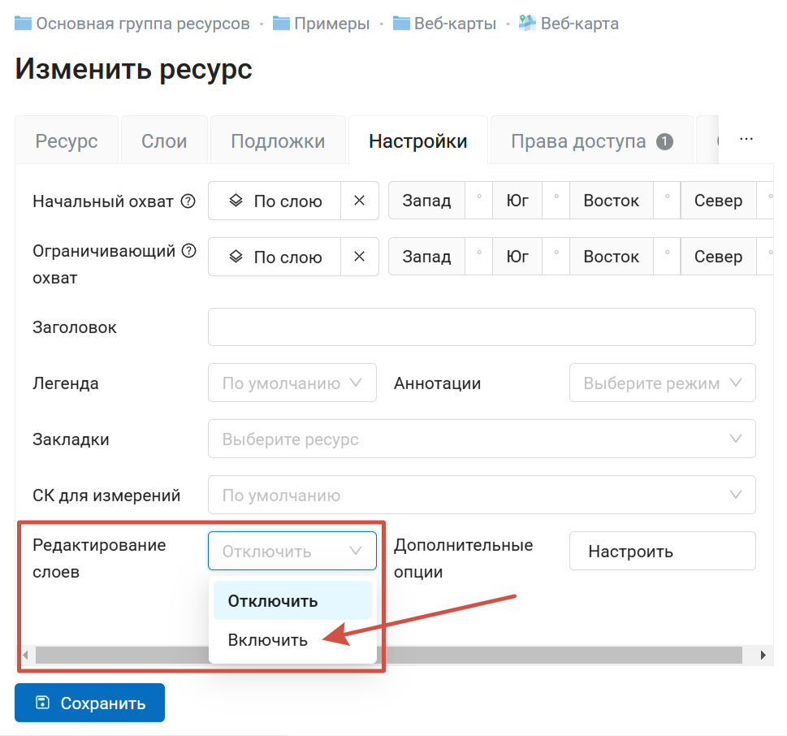

   Включение редактирования слоёв на веб-карте

Редактирование будет доступно для пользователей, у которых есть `право на чтение и изменение данных <https://docs.nextgis.ru/docs_ngcom/source/permissions.html>`_. Право на изменение данных может быть установлено для всей папки, где лежат данные, или для отдельных слоёв.

Если у пользователя недостаточно прав, он не сможет перейти в режим редактирования. `Как проверить права пользователя <https://docs.nextgis.ru/docs_ngcom/source/permissions.html#ngcom-permissions-view>`_.

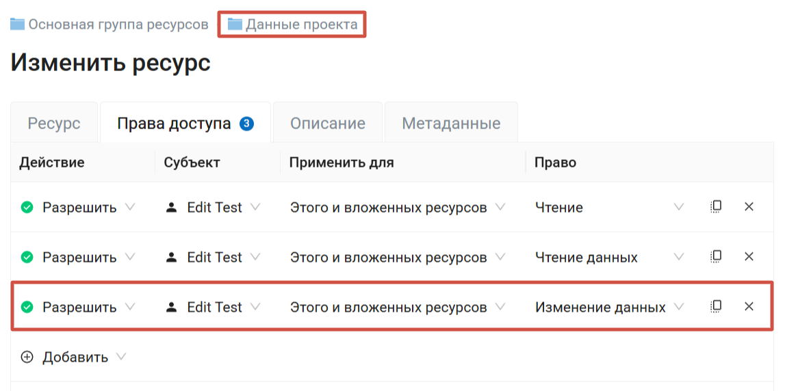

   Для папки с данными установлен набор прав, необходимый для доступа к редактированию

.. _edit_mode:

Режим редактирования
---------------------

1. Откройте `Веб-карту <https://docs.nextgis.ru/docs_ngweb/source/webmaps_client.html>`_ и найдите слой, в котором находится редактируемый объект.
2. Откройте выпадающее меню, нажав на три точки справа от имени слоя (см. :numref:`webmap_edit`), и поставьте галочку напротив пункта "Редактирование".

.. figure:: _static/webgis_edit_objects_ru_2.png
   :name: webmap_edit
   :align: center
   :width: 20cm

   Меню слоя на веб-карте

3. На Веб-карте появится панель инструментов, позволяющая провести редактирование (см. :numref:`webmap_edit_panel`):

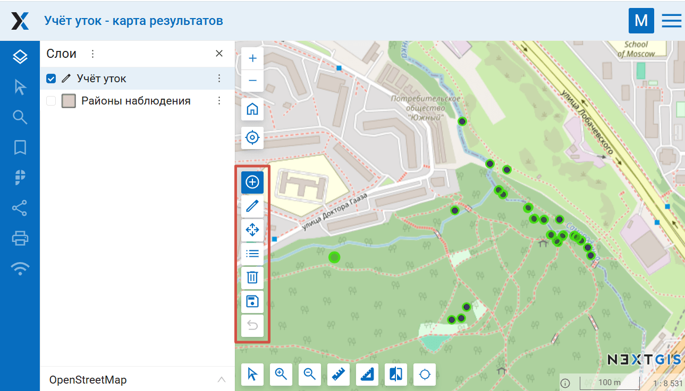

   Панель инструментов для редактирования
   
*  |button_maptool_add| `создать объект <https://docs.nextgis.ru/docs_ngweb/source/feature_edit.html#ngw-create-objects>`_ - активен по умолчанию при первом включении режима редактирования;
* |button_maptool_edit| `редактировать <https://docs.nextgis.ru/docs_ngweb/source/feature_edit.html#webmap-edit-vertices>`_;
* |button_maptool_move| `переместить <https://docs.nextgis.ru/docs_ngweb/source/feature_edit.html#ngw-move-objects>`_ объект целиком;
* |button_maptool_attrib| `редактировать значения атрибутов <https://docs.nextgis.ru/docs_ngweb/source/feature_edit.html#ngw-attributes>`_;
* |button_maptool_delete| `удалить <https://docs.nextgis.ru/docs_ngweb/source/feature_edit.html#ngw-delete-objects>`_;
* |button_maptool_snap| прилипание: синяя = включено, белая = выключено;
* |button_maptool_save| выйти из режима редактирования;
* |button_maptool_undo| отменить последнее действие.

При редактировании полигонов также доступен инструмент

* |button_maptool_hole| `вырезать отверстие <https://docs.nextgis.ru/docs_ngweb/source/feature_edit.html#webmap-hole>`_.

Ниже подробнее рассказывается о работе этих инструментов.

Объекты слоя, доступные для редактирования, подсвечиваются цветным контуром. Можно редактировать одновременно несколько слоёв, каждый будет подсвечен своим цветом.

.. |button_maptool_add| image:: _static/button_maptool_add.png
   :width: 6mm
   :alt: плюс в кружочке

.. |button_maptool_edit| image:: _static/button_maptool_edit.png
   :width: 6mm
   :alt: карандаш

.. |button_edit| image:: _static/button_edit.png
   :width: 6mm
   :alt: карандаш

.. |button_maptool_move| image:: _static/button_maptool_move.png
   :width: 6mm
   :alt: стрелки из центра

.. |button_maptool_attrib| image:: _static/button_maptool_attrib.png
   :width: 6mm
   :alt: три полоски

.. |button_maptool_delete| image:: _static/button_maptool_delete.png
   :width: 6mm
   :alt: мусорная корзина

.. |button_maptool_save| image:: _static/button_maptool_save.png
   :width: 6mm
   :alt: дискета

.. |button_maptool_undo| image:: _static/button_maptool_undo.png
   :width: 6mm
   :alt: загибающаяся стрелка

.. |button_maptool_hole| image:: _static/button_maptool_hole.png
   :width: 6mm
   :alt: ножницы

.. |button_maptool_snap| image:: _static/button_maptool_snap.png
   :width: 6mm
   :alt: рамка с точкой в центре

.. |button_open_feature_table| image:: _static/button_open_feature_table.png
   :width: 6mm
   :alt: таблица

.. |button_open_web_map| image:: _static/button_open_web_map.png
   :width: 6mm
   :alt: карта с лупой

.. |button_maptool_confirm| image:: _static/button_maptool_confirm.png
   :width: 6mm
   :alt: галочка

.. _ngw_create_objects:

Создание нового объекта (точка, линия, полигон)
-----------------------------------------------

1. Перейдите в режим редактирования. В панели инструментов по умолчанию активна (выделена синим) кнопка |button_maptool_add| "Создать". Если перед этим вы выполняли другие действия, нажмите на неё, чтобы активировать режим создания объектов.

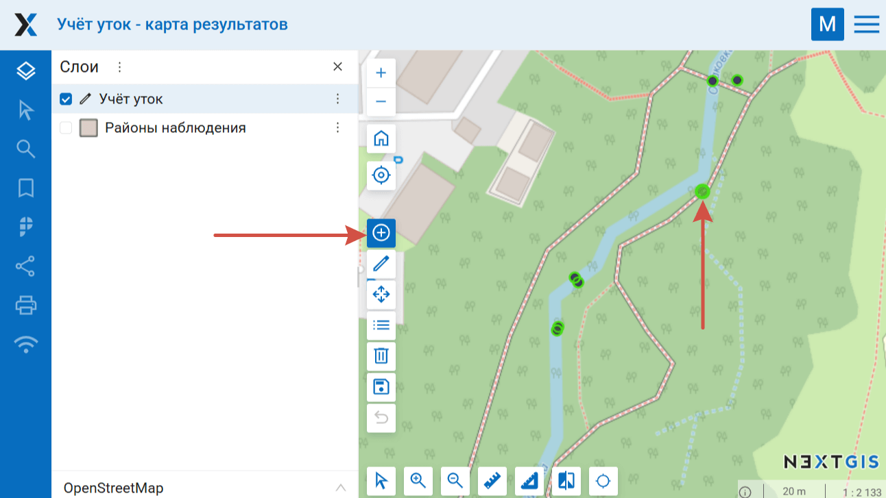

   Кнопка "Создать объекты" на панели инструментов для редактирования и значок при курсоре мыши

2. Возле курсора мыши появится цветной кружок, с помощью которого можно добавлять новые объекты. Щелкните в том месте карты, где необходимо создать новый объект. 

3. Откроется окно ввода значений атрибутов объекта. 

Нажмите **ОК**, чтобы завершить создание объекта. Чтобы очистить форму, нажмите **Сбросить**.

.. figure:: _static/webgis_attr_new_objects_ru.png
   :name: webgis_attr_new_objects_pic
   :align: center
   :width: 20cm

   Введение атрибутов нового объекта

Можно добавить несколько новых объектов подряд. 

При создании линии необходимо щелчками на карте указать положение ее начала и конца. При создании полигона каждый последующий щелок будет указывать положение очередного его узла.

Чтобы завершить создание объекта, щелкните дважды по последней введённой точке, нажмите клавишу Enter или кнопку |button_maptool_confirm|. Завершить создание полигона также можно, кликнув по его начальной точке. 

Если вы ошиблись, чтобы удалить последнюю вершину нажмите Backspace.

При создании узлов будет работать прилипание. Чтобы отключить его, нажмите |button_maptool_snap|.

.. note:: Если нужно создать полигон с отверстием, сначала нарисуйте внешний контур и завершите создание объекта, затем `вырежьте отверстие <https://docs.nextgis.ru/docs_ngweb/source/feature_edit.html#webmap-hole>`_ инструментом |button_maptool_hole|.

4. Для того, чтобы сохранить в слое добавленные объекты, нажмите |button_maptool_save| "Завершить редактирование". 
Откроется диалоговое окно, в котором необходимо выбрать, **сохранять** внесенные изменения, не сохранять или остаться в режиме редактирования (для этого нажмите "Отменить"):

.. figure:: _static/webgis_finish_editting_ru_2.png
   :name: webmap_finish_edit
   :align: center
   :width: 20cm

   Диалоговое окно завершения редактирования

.. _ngw_delete_objects:

Удаление объекта
----------------

1. Активируйте режим редактирования. На панели инструментов для редактирования нажмите кнопку |button_maptool_delete| "Удалить объекты".

2. Выберите на карте объекты, которые хотите удалить, щелкнув по ним курсором мыши. Цветной контур, показывающий доступность для редактирования, исчезнет.

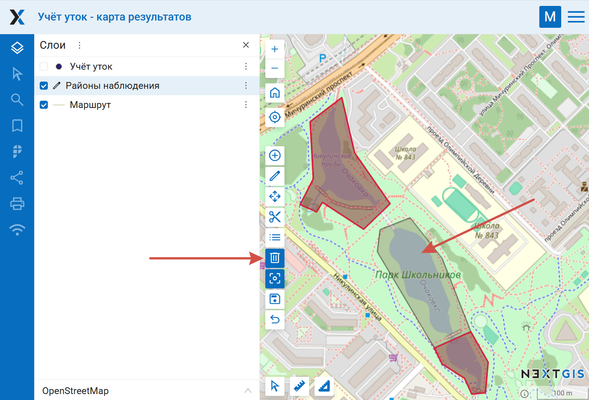
   
   Редактируется слой полигонов. Полигоны, выделенные красным, останутся в слое, полигон без красного контура будет удалён
   
4. Для того, чтобы завершить удаление объектов, нажмите |button_maptool_save| "Завершить редактирование". 
Откроется диалоговое окно, в котором необходимо выбрать, сохранять ли внесенные изменения, не сохранять или остаться в режиме редактирования (см. :numref:`webmap_finish_edit`).

.. _ngw_move_objects:

Изменение положения объекта
----------------------------

1. Чтобы передвинуть объект целиком, активируйте инструмент |button_maptool_move| переместить.

2. Кликните по объекту, чтобы выбрать его, затем перетащите на новое место.

Отображается одновременно старое положение (в символике стиля) и новое (цвет выделения)

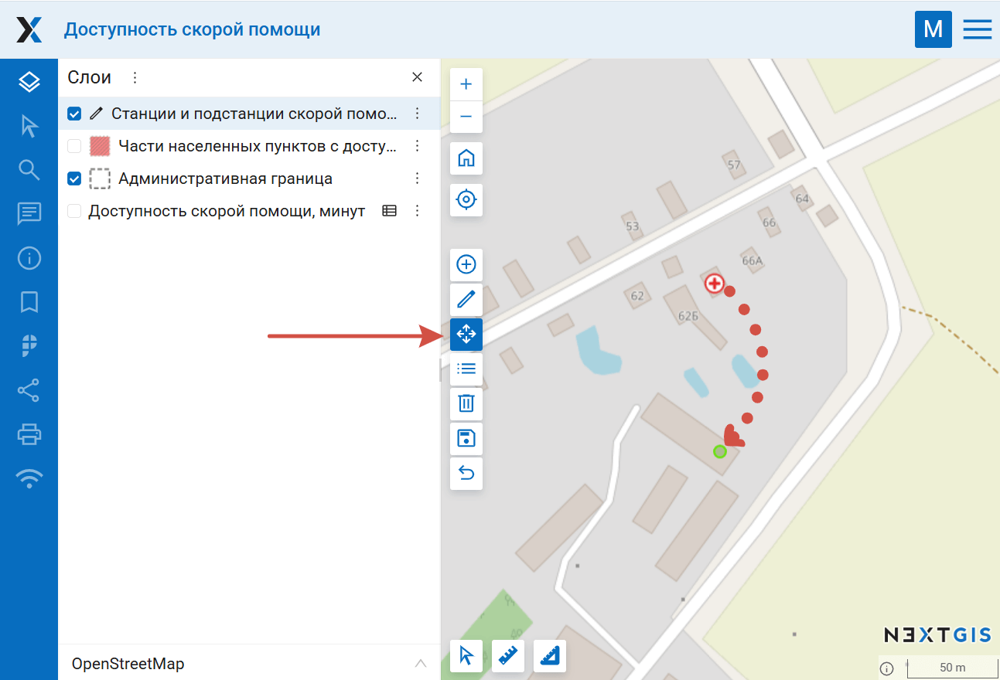

   Перемещение точки. Новое местоположение отмечено зелёным

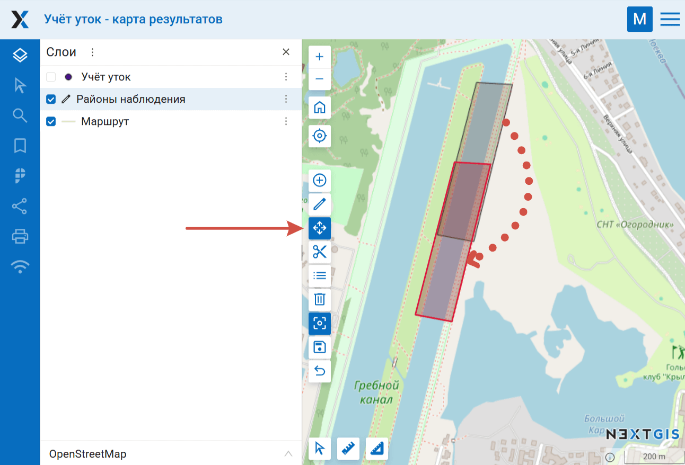

   Перемещение полигонального объекта. Новое местоположение отмечено красным

3. Затем нажмите |button_maptool_save| "Завершить редактирование" и сохраните изменения.

Также вы можете передвигать отдельные узлы линейных и полигональных объектов.

.. _webmap_edit_vertices:

Передвижение отдельных узлов
-----------------------------

1. На панели инструментов для редактирования нажмите кнопку |button_maptool_edit| "Редактировать".

Объекты, положение которых можно изменить, будут обведены цветным контуром.

2. Кликните по узлу и перетащите его в нужное место, зажимая левую кнопку мыши. При перемещении узлов будет работать прилипание. Чтобы отключить прилипание, нажмите |button_maptool_snap|.

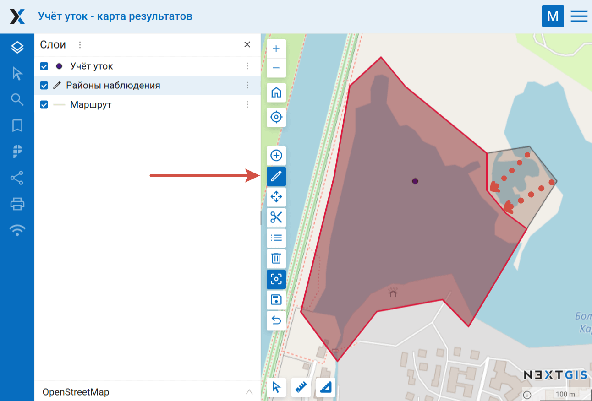

   Изменение узлов полигона. Красным показан изменённый контур

3. Для завершения редактирования нажмите |button_maptool_save| "Завершить редактирование" и сохраните изменения (см. :numref:`webmap_finish_edit`).

.. note:: 
	Одновременно можно редактировать несколько слоев. Для этого необходимо зайти в режим редактирования в каждом слое, который нужно изменить. Прилипание в этом случае будет работать к объектам всех редактируемых слоев.

.. _ngw_vertices:

Добавление и удаление узлов
----------------------------

Для того, чтобы **удалить** лишний узел, в режиме редактирования объекта нужно активировать инструмент  |button_maptool_edit| "Редактировать", зажать клавишу **Shift** и кликнуть по этому узлу. 

Чтобы **добавить** узел, нажмите на линию между двумя существующими узлами и потяните к нужной точке.

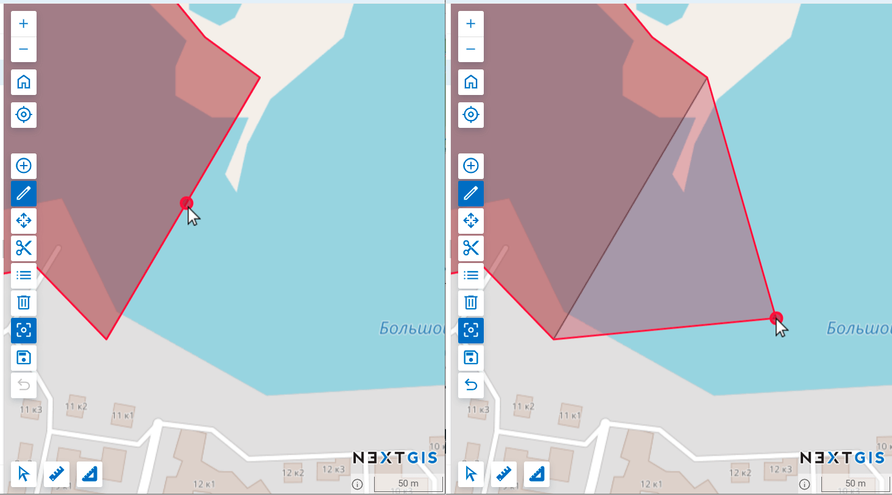
   
   Создание нового узла

.. _webmap_hole:

Отверстие в полигоне
--------------------

Если нужно создать полигон, внутри которого вырезана одна или несколько областей:

1. Сначала добавьте внешний контур полигона при помощи инструмента |button_maptool_add| Создать.

2. Активируйте инструмент |button_maptool_hole| Вырезать отверстие и нарисуйте внутри полигона замкнутый контур.

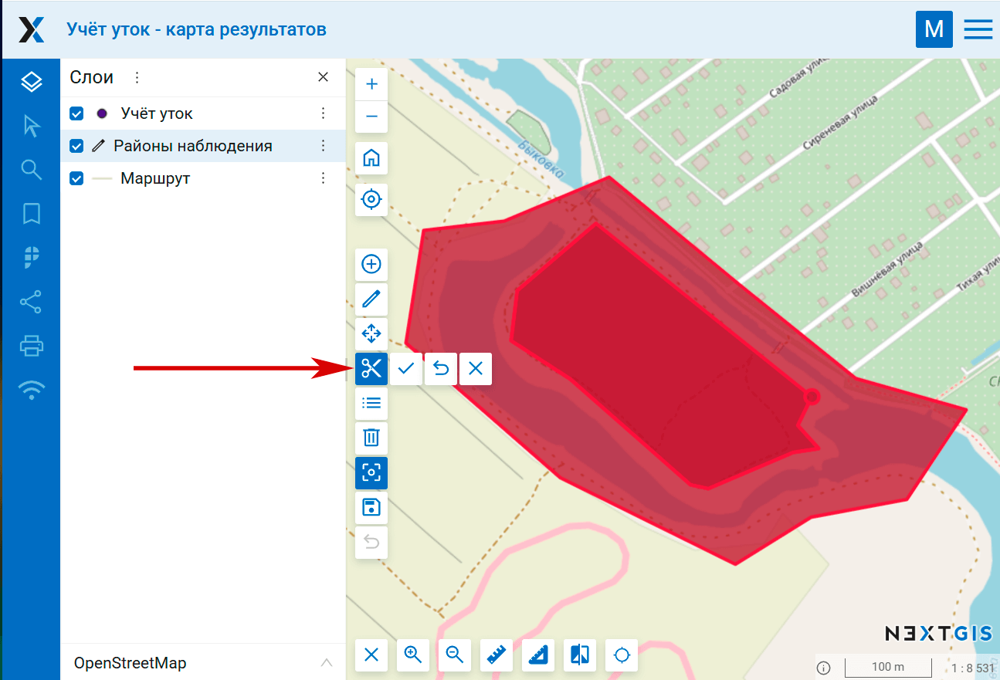

   Вырезание отверстия в полигоне

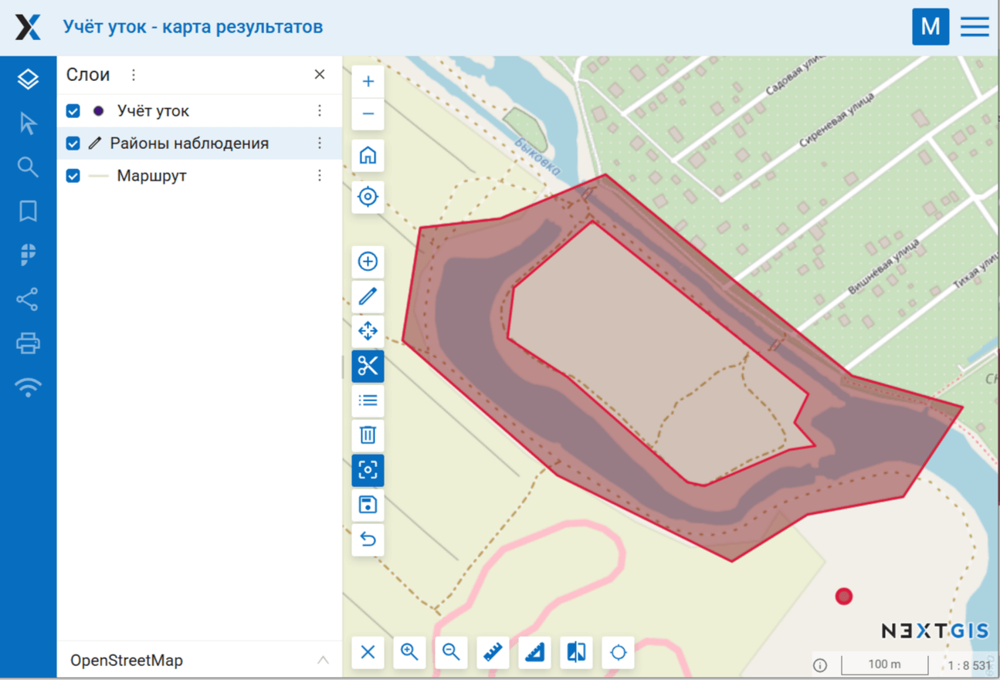

   Полигон с вырезанным отверстием

3. Для завершения редактирования нажмите |button_maptool_save| "Завершить редактирование" и сохраните изменения. (см. :numref:`webmap_finish_edit`).

.. _ngw_attributes:

Редактирование значений атрибутов
---------------------------------

Программное обеспечение NextGIS Web позволяет редактировать атрибуты географических объектов. Редактирование атрибутов можно вызывать несколькими способами.

* В списке ресурсов: 

  - Нажать на значок таблицы |button_open_feature_table| напротив векторного слоя (также можно открыть этот слой, а затем в блоке операций выбрать действие "Таблица объектов") (см. :numref:`ngweb_Object_table`).
  - Откроется таблица. Кликнуть на нужную строку в таблице, она будет выделена. 
  - Нажать на кнопку "Редактировать" над таблицей (см. :numref:`ngweb_editing_attributes2.7`).

.. figure:: _static/ngweb_editing_attributes2.7_rus_2.png
   :name: ngweb_editing_attributes2.7
   :align: center
   :width: 20cm
   
   Редактирование атрибутов из административного интерфейса

Если вы находитесь в режиме |button_open_web_map| просмотра карты:

* Через таблицу объектов

   - В контекстном меню слоя выбрать "Таблица объектов", и далее действовать, как описано выше.
  
* В режиме редактирования

   - В контекстном меню слоя нажмите "Редактировать". 
   - В панели инструментов редактирования выберите |button_maptool_attrib|.
   - Кликните по нужному объекту на карте.

* Через панель идентификации

   - Кликните по объекту на карте. 
   - В панели идентификации нажмите на кнопку редактирования (см. :numref:`ngweb_editing_when_viewing_map`).

.. figure:: _static/editing_when_viewing_map_open_ru.png
   :name: ngweb_editing_when_viewing_map
   :align: center
   :width: 20cm

   Переход к редактированию атрибутов из панели идентификации

 

В окне редактирования атрибутов слоя имеются следующие вкладки:

* вкладка "Атрибуты" (см. :numref:`ngweb_tab_attributes`)

.. figure:: _static/ngweb_tab_attributes_rus_2.png
   :name: ngweb_tab_attributes
   :align: center
   :width: 20cm
 
   Вкладка "Атрибуты"

Для редактирования атрибута просто кликните на нужной строчке. 

Числовые атрибуты можно вводить вручную или изменять, нажимая на стрелки, появляющиеся в правом конце поля. 

Дату также можно ввести вручную или выбрать в календаре - чтобы вызвать его, нажмите иконку в правом конце поля.

К текстовым полям можно подключить `Справочник <https://docs.nextgis.ru/docs_ngweb/source/create_other.html#ngw-create-lookup-table>`_, тогда значение будет выбираться из выпадающего списка.

* вкладка "Вложения" (`подробнее о работе с вложениями <https://docs.nextgis.ru/docs_ngweb/source/feature_edit.html#ngw-attachments>`_);

.. figure:: _static/ngweb_tab_attachment_rus_2.png
   :name: ngweb_tab_attachment
   :align: center
   :width: 20cm
 
   Вкладка "Вложения"

* вкладка "Описание" - оно отображается в панели идентификации при клике по объекту на карте.

.. figure:: _static/ngweb_tab_description_rus_2.png
   :name: ngweb_tab_description
   :align: center
   :width: 20cm

   Вкладка "Описание"

.. note:: Если вы открыли окно редактирования атрибутов из таблицы объектов на отдельной странице, то также будет доступна вкладка изменения геометрии объекта. Если вы открыли редактирование атрибутов из просмотра веб-карты, то для изменения геометрии нужно активировать `режим редактирования <https://docs.nextgis.ru/docs_ngweb/source/feature_edit.html#edit-mode>`_.

.. _ngw_attachments:

Вложения
--------

Программное обеспечение NextGIS Web позволяет прикреплять к записям фотографии, панорамы и другие файлы. 
Тогда при идентификации объекта на карте в панели идентификации будет отображены как атрибуты объекта, так и вложения, которые были ему сопоставлены (см. :numref:`attachm_tab_pic`).

.. figure:: _static/attachm_tab_ru.png
   :name: attachm_tab_pic
   :align: center
   :width: 20cm

   Вложения на карточке объекта

Для просмотра из веб-интерфейса поддерживаются форматы:

* Изображения JPEG, PNG. Формат GIF не поддерживается.
* Панорамы, соответствующие `спецификации <https://developers.google.com/streetview/spherical-metadata?hl=ru>`_.

Можно прикрепить и любые другие файлы, если их не нужно просматривать непосредственно с карты.

При нажатии на фотографию открывается лайтбокс (всплывающее окно в браузере, работающее на JavaScript). Размер фотографии вписывается в окно. Фотографии подписываются, пользователю можно переходить между фотографиями, используя клавиши вправо-влево на клавиатуре (см. :numref:`ngweb_webmap_identification_photo_lightbox`).

.. figure:: _static/webmap_identification_photo_lightbox_rus_3.png
   :name: ngweb_webmap_identification_photo_lightbox
   :align: center
   :width: 20cm

   Развернутая фотография во всплывающем окне

Навигация по панорамам осуществляется мышью. Зажимайте левую кнопку мыши и вращайте камеру. Колёсиком приближайте и отдаляйте обзор. Режим панорамы у снимка можно отключать (круглая синяя кнопка в верхнем углу).

.. figure:: _static/panorama_opened_ru.png
   :name: panorama_opened_pic
   :align: center
   :width: 20cm

   Панорама, открытая с веб-карты

.. _ngw_add_photos:

Добавление вложений к единичному объекту
----------------------------------------

Чтобы прикрепить файл к объекту, откройте окно редактирования. Его можно вызвать разными способами:

* Кликнуть на нужном объекте на веб-карте и во всплывающем окошке нажать кнопку редактирования.
* Открыть на карте таблицу объектов, выделить нужный и нажать кнопку **Редактировать**.
* Открыть таблицу объектов со страницы ресурса, выделить нужную строку и нажать кнопку **Редактировать**.

В окне редактирования откройте вкладку "Вложения" и загрузите файлы. 

.. figure:: _static/add_attachment_ru.png
   :name: manage_att_add_pic
   :align: center
   :width: 20cm

   Добавление вложения

Введите подписи и нажмите "Сохранить".

Теперь при просмотре карты в окне идентификации на вкладке "Вложения" 
видны превью фотографий (см. :numref:`attachm_tab_pic`).

.. note:: 
   По умолчанию вложения могут добавлять все пользователи, но можно настроить 
   так, чтобы добавлять могли только отдельные пользователи (см. 
   `Как настроить права доступа <https://docs.nextgis.ru/docs_ngcom/source/permissions.html>`_).

Можно редактировать имя файла и описание ранее добавленных вложений. Чтобы удалить вложение, нажмите на крестик справа от него. Если при редактировании вы ошиблись, нажмите кнопку **Сбросить**, внесённые изменения будут отменены.   

Для удаления вложения следует выделить его в окне редактирования атрибутов слоя на вкладке "Вложения", нажать кнопку "Удалить", а затем нажать кнопку "Сохранить".

Процесс загрузки вложений также представлен в видео:

.. raw:: html

   <iframe width="560" height="315" src="https://rutube.ru/play/embed/9f0d58e1850b6740b1823763da6dfc97/" frameBorder="0" allow="clipboard-write; autoplay" webkitAllowFullScreen mozallowfullscreen allowFullScreen></iframe>

Посмотреть на `youtube <https://youtu.be/MMPhQeLXZDQ>`_, `rutube <https://rutube.ru/video/9f0d58e1850b6740b1823763da6dfc97/>`_.

.. _ngw_attachments_panoramas:

Использование панорам
---------------------

К объектам можно добавлять не только фографии, но и панорамы. Они дают возможность погружаться в новые локации и изучать детали уже знакомых мест.

.. figure:: _static/identpanel_attachm_panor_ru.png
   :name: popup_attachm_panor_pic
   :align: center
   :width: 20cm

   Превью панорамы в карточке объекта

Загружаемые панорамные снимки должны соответствовать спецификации `Google XMP Photo Sphere <https://developers.google.com/streetview/spherical-metadata?hl=ru>`_.

Работа с панорамами представлена в видео:

.. raw:: html

   <iframe width="560" height="315" src="https://rutube.ru/play/embed/d1f08ddae9780ce93246f8e81748d4c4/" frameBorder="0" allow="clipboard-write; autoplay" webkitAllowFullScreen mozallowfullscreen allowFullScreen></iframe>

Посмотреть на `youtube <https://youtu.be/X5c2Wy1CItw>`__, `rutube <https://rutube.ru/video/d1f08ddae9780ce93246f8e81748d4c4/>`__.

.. _ngw_attachments_imp_exp:

Экспорт и импорт вложений
-------------------------

Для копирования вложений между слоями или создания резервной копии все вложения слоя можно экспортировать в виде архива (При стандартном сохранении слоя они включены в файл не будут). 

На странице слоя выберите действие **Управление вложениями**.

.. figure:: _static/manage_att_select_ru.png
   :name: manage_att_select_pic
   :align: center
   :width: 20cm

   Управление вложениями

Для того, чтобы сохранить вложения, выберите вкладку **Экспорт** и нажмите кнопку **Экспортировать вложения в ZIP-архив**. Полученный архив будет содержать все вложения в директориях с именами объектов. Метаданные вложений сохраняются в отдельном JSON-файле.

.. figure:: _static/manage_att_export_ru.png
   :name: manage_att_export_pic
   :align: center
   :width: 20cm

   Экспорт вложений на устройство

Полученный таким образом архив можно импортировать, чтобы добавить вложения к слою. Для этого откройте вкладку **Импорт**, нажмите **Импортировать вложения из ZIP-архива** и выберите на устройстве соответствующий файл. Архив должен содержать директории названные по идентификаторам объектов. Каждая директория может содержать одно или несколько вложений. Дубликаты будут пропущены. Если нужно заменить ранее добавленные вложения, отметьте галочку "Удалить существующие вложения".

.. figure:: _static/manage_att_import_ru.png
   :name: manage_att_import_pic
   :align: center
   :width: 20cm

   Импорт вложений из архива

Процесс импорта и экспорта вложений также представлен в видео:

.. raw:: html

   <iframe width="560" height="315" src="https://rutube.ru/play/embed/62233baae1d2c10e21ad4709ecffe5cc/" frameBorder="0" allow="clipboard-write; autoplay" webkitAllowFullScreen mozallowfullscreen allowFullScreen></iframe>

Посмотреть видео на `youtube <https://youtu.be/8R4uY5CCE3w>`__, `rutube <https://rutube.ru/video/62233baae1d2c10e21ad4709ecffe5cc/>`__.
