.. _ngw_edit_objects:

Edit vector features
====================

You can modify **geometries and attributes** of vector features via Web interface: `in the Feature table <https://docs.nextgis.com/docs_ngweb/source/feature_table.html>`_ or on a Web Map (see below), - as well as `in QGIS desktop app <https://docs.nextgis.com/docs_ngconnect/source/edit.html>`_.

.. _ngw_allow_edit:

Allow editing
---------------

By default editing of a Web Map is disabled. To allow users to modify the layers of the map, enable editing in the Web Map settings. To find out how to open the "Update resource" dialog, see  :ref:`this chapter<ngw_update_resource>`. 

You can enable or disable editing of all Web Map layers on the “Settings” tab by selecting the corresponding option in the dropdown menu (see :numref:`webmap_allow_editting`).

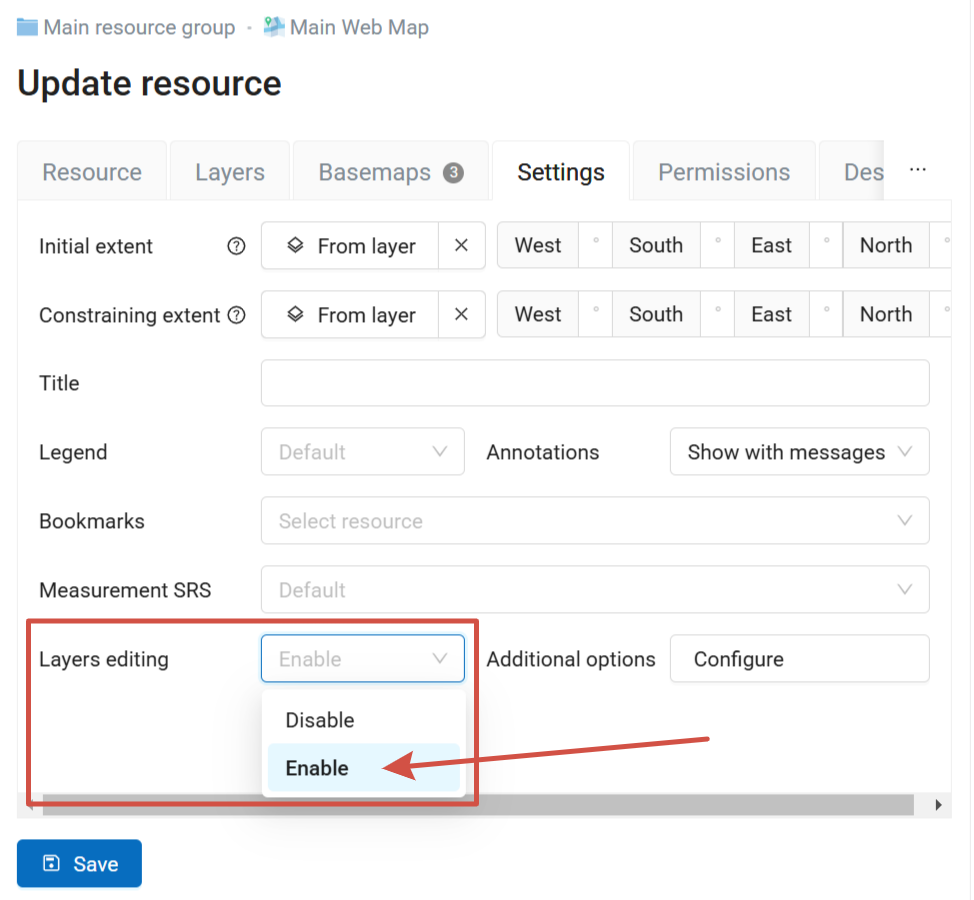

   "Enable layers editing" is turned on

.. note:: 
	By default layer editing is turned off.
	
Editing is available for users who have permissions to `read and modify data <https://docs.nextgis.com/docs_ngcom/source/permissions.html>`_. The "Modify data" permission can be set for the entire resource group where the data is stored or for individual layers.

Users who do not have "Modify data" permission won't be able to activate the edit mode. `How to check user permissions <https://docs.nextgis.ru/docs_ngcom/source/permissions.html#ngcom-permissions-view>`_.

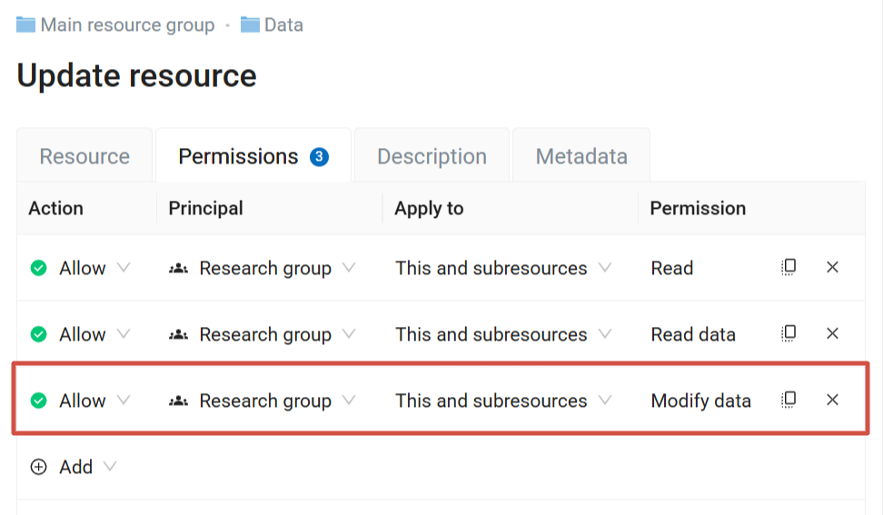

   Permissions set for the Data resource group to allow editing

.. _edit_mode:

Edit mode on a Web Map
----------------------

1. Open `Web Map <https://docs.nextgis.com/docs_ngweb/source/webmaps_client.html>`_ and select the layer with the feature you need to edit.
2. Open dropdown menu by pressing the three dots to the right of the layer name (see :numref:`webmap_edit`), then select "Edit".

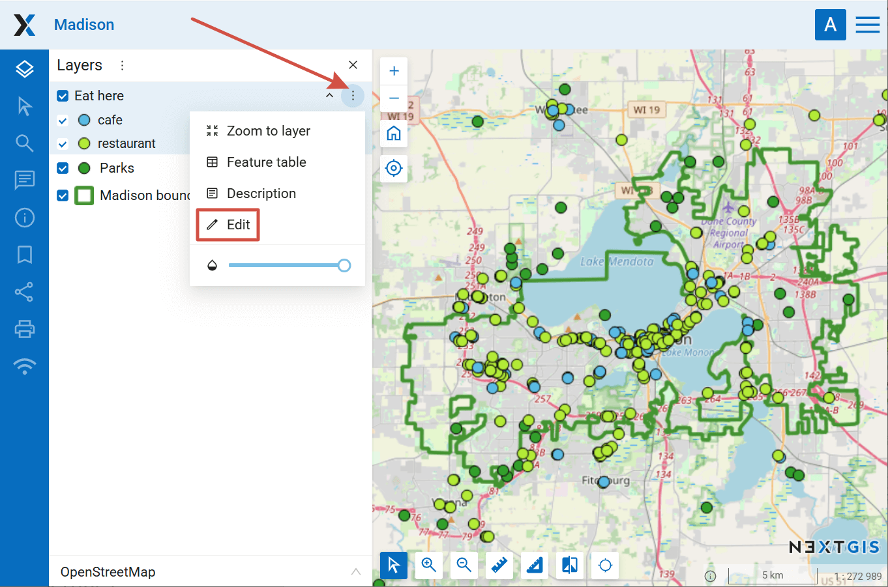

   Entering the editing mode

3. Editing toolbar will appear on the Web Map (see :numref:`webmap_edit_panel`):

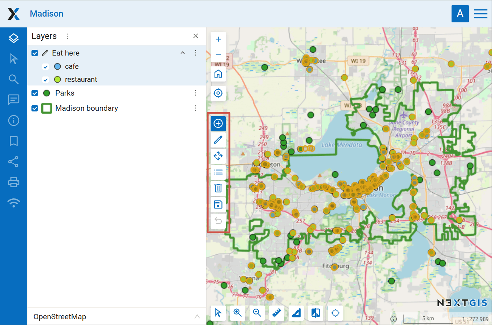

   Editing toolbar
   
* |button_maptool_add| `Create feature <https://docs.nextgis.com/docs_ngweb/source/feature_edit.html#ngw-create-objects>`_ - this tool is active when you first enter the edit mode;
* |button_maptool_edit| `Edit <https://docs.nextgis.com/docs_ngweb/source/feature_edit.html#webmap-edit-vertices>`_;
* |button_maptool_move| `Move <https://docs.nextgis.com/docs_ngweb/source/feature_edit.html#ngw-move-objects>`_ an entire feature;
* |button_maptool_attrib| `Edit attribute values <https://docs.nextgis.com/docs_ngweb/source/feature_edit.html#ngw-attributes>`_;
* |button_maptool_delete| `Delete <https://docs.nextgis.com/docs_ngweb/source/feature_edit.html#ngw-delete-objects>`_;
* |button_maptool_snap| Snapping: blue = enabled, white = disabled;
* |button_maptool_save| Stop editing and leave Edit mode;
* |button_maptool_undo| Undo the last action.

Also, for polygons one more tool is available:

* |button_maptool_hole| `Cut a hole <https://docs.nextgis.com/docs_ngweb/source/feature_edit.html#webmap-hole>`_.

Below you can find detailed description of these operations.

Features available for editing are highlighed. You can edit multiple layers at once, each is highlighted with a different color.

.. |button_edit| image:: _static/button_edit.png
   :width: 6mm
   :alt: pencil

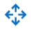

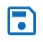

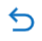

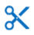

.. |button_open_feature_table| image:: _static/button_open_feature_table.png
   :width: 6mm
   :alt: table

.. |button_open_web_map| image:: _static/button_open_web_map.png
   :width: 6mm
   :alt: map and magnifying glass

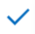

.. _ngw_create_objects:

Create a new feature (point, line, polygon)
-----------------------------------------------

1. Enter Edit mode. The |button_maptool_add| "Create" tool is active by default (the button is blue). If you used some other tool before that, click on the button to activate feature creation.

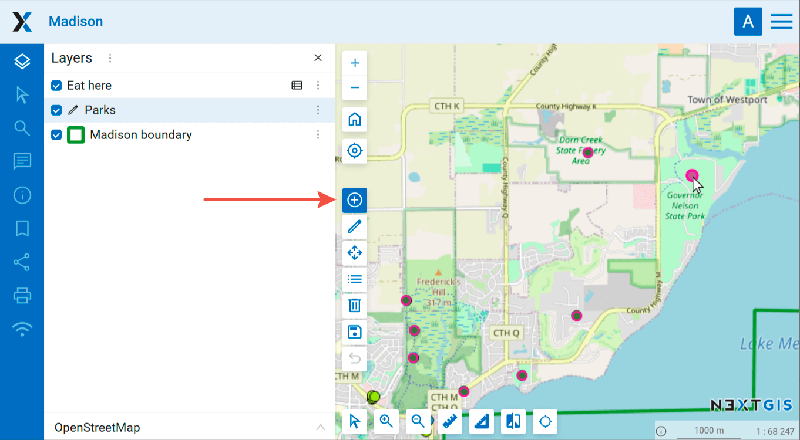

   "Create feature" button on the toolbar and the mark by the mouse pointer

2. A colored circle will appear nearby a mouse pointer, with it you can add new features. Click on the map to create a new feature. 

3. A dialog opens where you can add attribute values. 

Click **OK** to finish creating a feature. To clear the attribute form, click **Reset**.

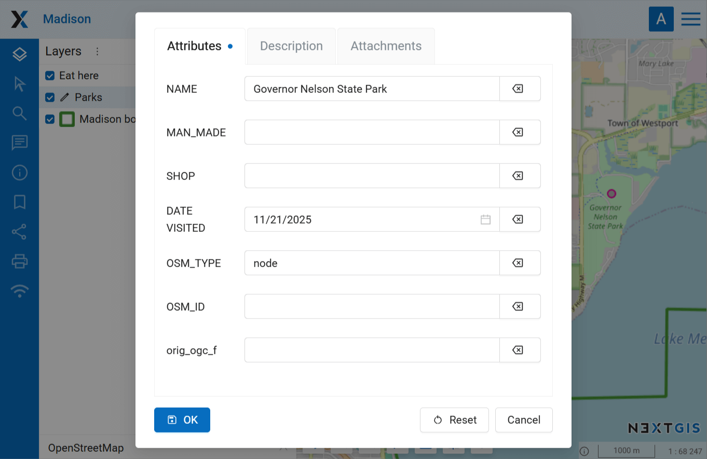

   Entering attribute values for the new feature

You can enter multiple features one after the other. 

When creating a line, click on the map to indicate its start and end points. While creating a polygon each new click on the map adds a new vertex. 

To finish creating geometry, press **Enter**, click twice on the last vertex or click |button_maptool_confirm|. To finish a polygon you can also click on its starting point. 

If you accidentally click on a wrong place, press **Backspace** to delete the last vertex and place it elsewhere.

Snapping is enabled by default for lines and polygons. To disable it, click |button_maptool_snap|.

.. note:: If you need to create a polygon with a hole, first draw the outer ring and complete feature creation, then use |button_maptool_hole| tool to `cut the hole <https://docs.nextgis.com/docs_ngweb/source/feature_edit.html#webmap-hole>`_.

4. To save created features to the layer, click |button_maptool_save| "Stop editing". 
In the opened dialog select **"Save"** to save changes, "Don't save" to discard them, or "Cancel" to stay in the edit mode:

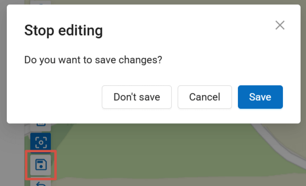

   Dialog for finishing the edits

.. _ngw_delete_objects:

Delete feature
----------------

1. Enter the edit mode. On the editing toolbar click on the |button_maptool_delete| "Delete" button.

2. Click on the features you want to delete. The highlighted contour of the editable features disappears.

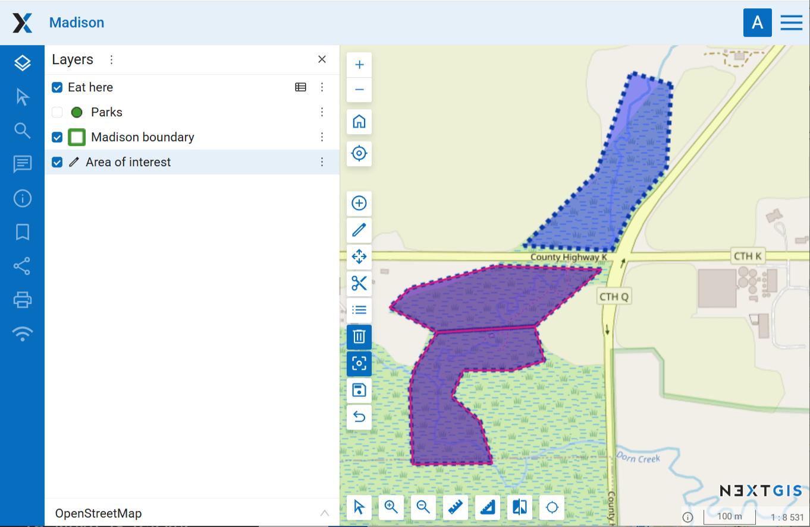
   
   Editing polygon layer. Polygons highlighted in red, remain in the layer, polygon without the red contour is deleted.
   
4. To finish deleting features, click |button_maptool_save| "Stop editing". 
In the opened dialog select "Save" to save changes, "Don't save" to discard them, or "Cancel" to stay in the edit mode (see :numref:`webmap_finish_edit`).

.. _ngw_move_objects:

Move feature
-------------

1. To move en etire feature, enter the Edit mode and activate |button_maptool_move| "Move" tool.

2. Click on the feature to select it, then drag to a new location.

Both the old position (style colors) and the new position (selection color) are shown.

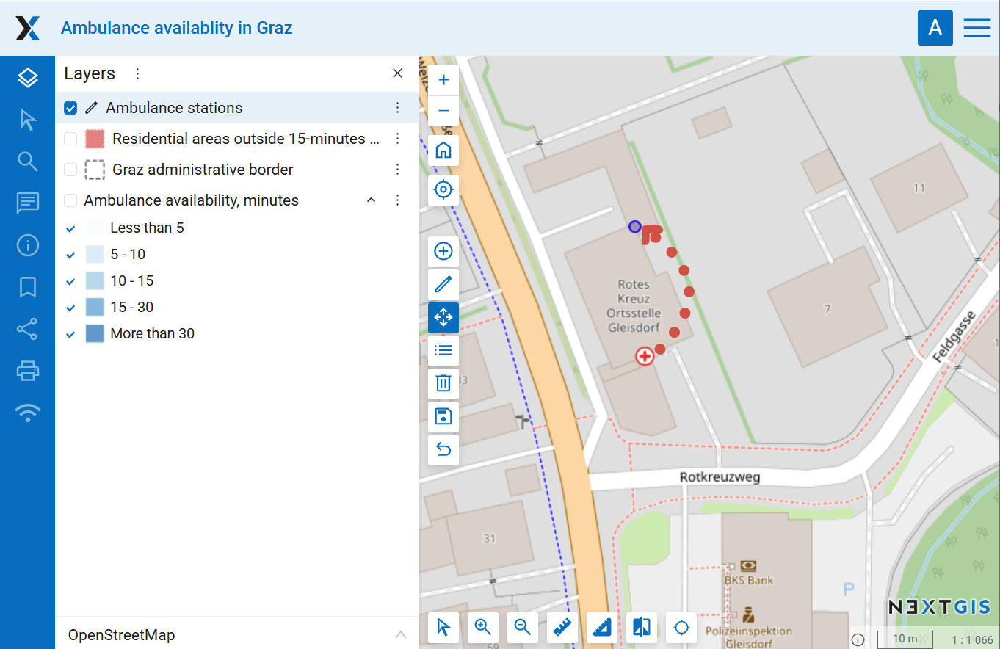

   Moving a point. The new position is marked in blue

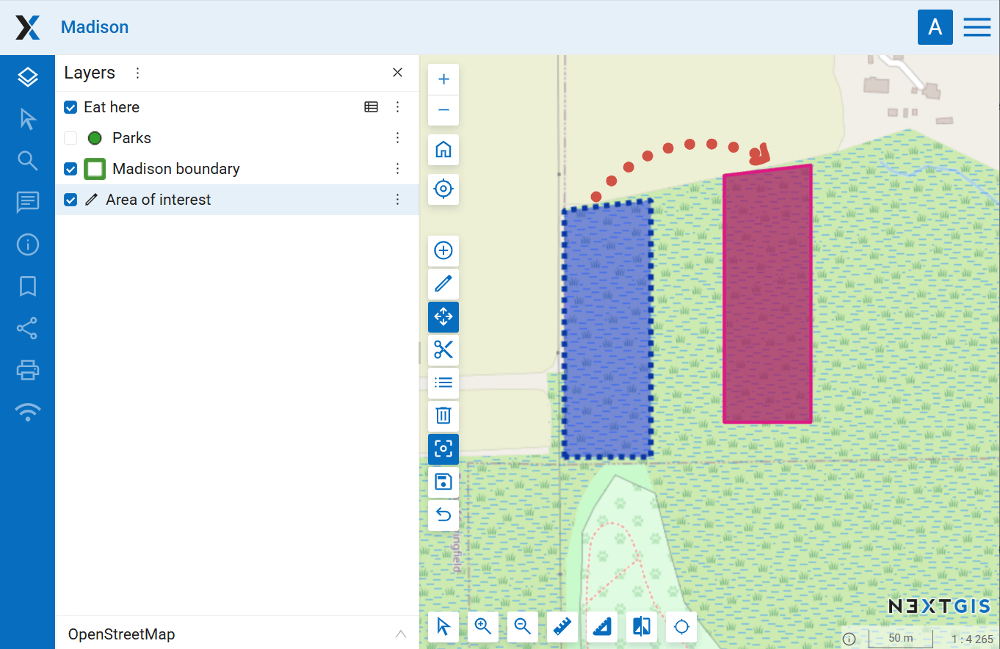

   Moving a polygon feature. The new position is marked in red

3. Click |button_maptool_save| "Stop editing" and save the changes.

Also you can move individual vertices of lines and polygons.

.. _webmap_edit_vertices:

Edit vertices
---------------

1. On the toolbar click on the |button_maptool_edit| "Edit" button.

Editable features are highlighted.

3. Click on a vertex and drag it to a new position by holding the left mouse button. Snapping is active by default. To disable it, click |button_maptool_snap|.

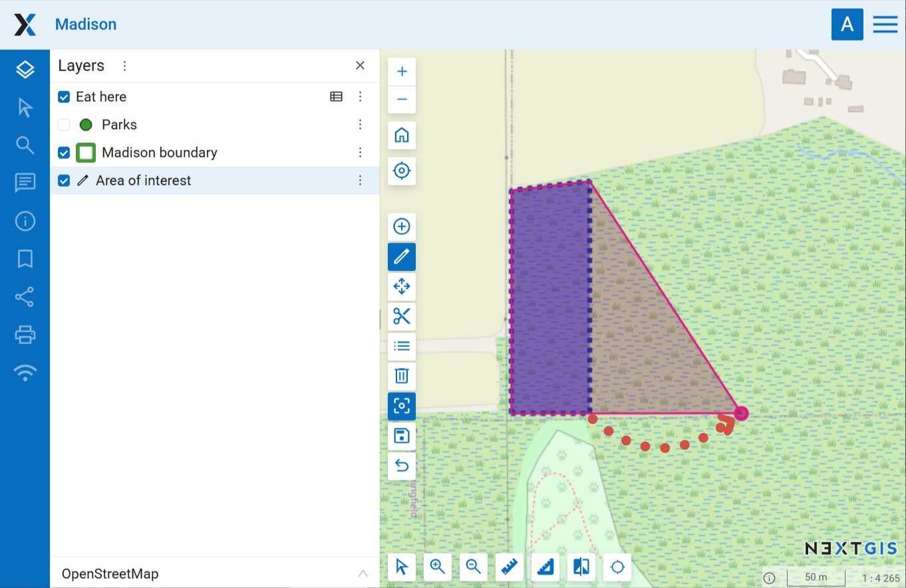

   Editing polygon vertices. The changed geometry is shown in red

3. To finish editing click |button_maptool_save| "Stop editing" and save the changes (see :numref:`webmap_finish_edit`).

.. note:: 
	You can edit several layers simultaneously. To do it enter the edit mode in every layer you want to edit. Snapping works for features of all these layers.

.. _ngw_vertices:

Add and delete vertices
-----------------------

To **delete** a vertice enter the Edit mode, then activate the |button_maptool_edit| "Edit" tool, hold **Shift** and click on the vertex. 

To **add** a vertex, click on the line between two existing vertices and drag it to the desired location.

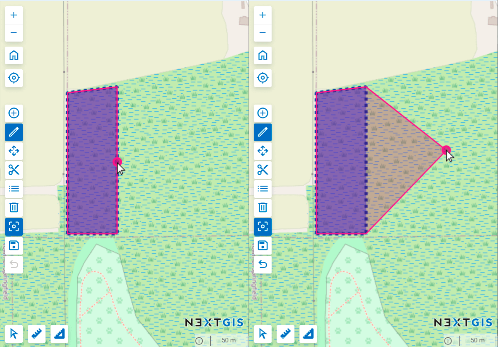
   
   Creating a new vertex

.. _webmap_hole:

Create holes
--------------

If you need to create a polygon that has one or seleral areas cut from it:

1. First add the outer contour using the |button_maptool_add| Create tool.

2. Activate the |button_maptool_hole| Cut hole tool and draw a closed boundary of the hole.

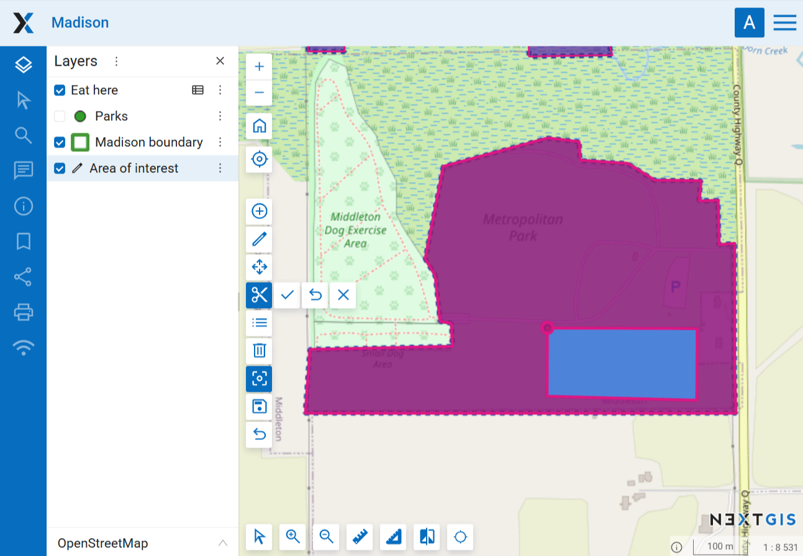

   Polygon with a hole

3. To finish editing click |button_maptool_save| "Stop editing" and save the changes (see :numref:`webmap_finish_edit`).

.. _ngw_attributes:

Edit feature's attributes
---------------------------

NextGIS Web software allows users to edit attributes of geographical features. There are several ways to open the dialog: 

* From the resource list: 

  - Click on the |button_open_feature_table| table symbol `by the vector layer <https://docs.nextgis.com/docs_ngweb/source/admin_interface.html#feature-table-choice-from-group-pic>`_ (or open the layer resource page and select "Feature table" in the `actions pane <https://docs.nextgis.com/docs_ngweb/source/admin_interface.html#admin-table-objects-upload>`_).
  - Feature table opens. Click on the entry in the table to select it. 
  - Click on the **Edit** button in the table toolbar.

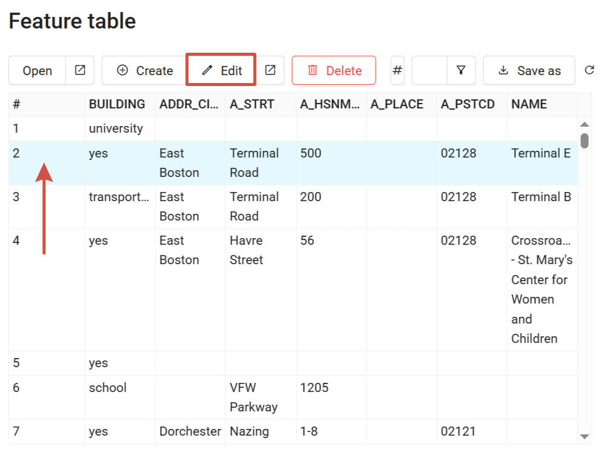
   
   Editing attributes using Feature table

If you are in the Web Map |button_open_web_map| display mode.

* From the Feature table:

   - In the layer's context menu select "Feature table" and then follow the steps described above.
  
* In the Edit mode:

   - In the layer's context menu select "Edit". 
   - In the toolbar on the map select |button_maptool_attrib|.
   - Click on the feature on the map.

* From the Identify panel:

   - Click on the feature on the map. 
   - In the Identify panel click on the "Edit" symbol (see :numref:`ngweb_editing_when_viewing_map`).

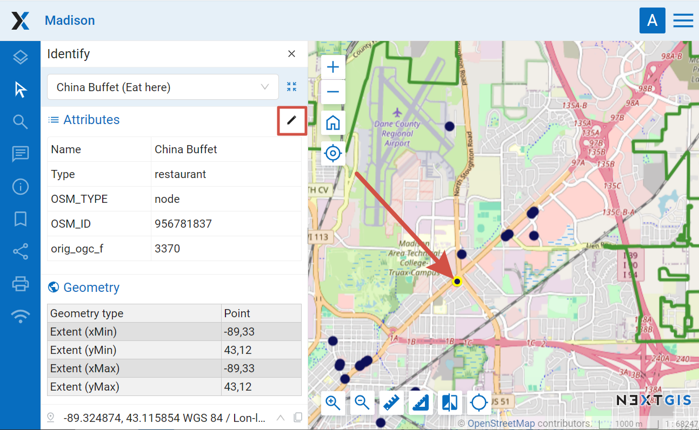

   Editing attribute values from the Identify panel

Editing dialog has the following tabs: 

* "Attributes" tab:

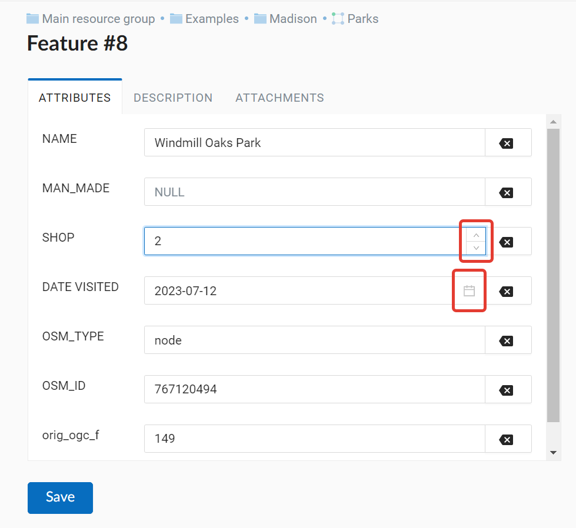
 
   Attributes tab

To edit an attribute click on the field. 

Numbers can be typed in or modified with arrows that appear on the right end of the field. 

Dates also can be typed in or selected in the calender. To open the calender click the icon on the right end of the field.

Add a `Lookup table <https://docs.nextgis.com/docs_ngweb/source/create_other.html#ngw-create-lookup-table>`_ to a field to be able to pick a value from a dropdown list.

* "Attachments" tab (`more on managing attachments <https://docs.nextgis.com/docs_ngweb/source/feature_edit.html#ngw-attachments>`_);

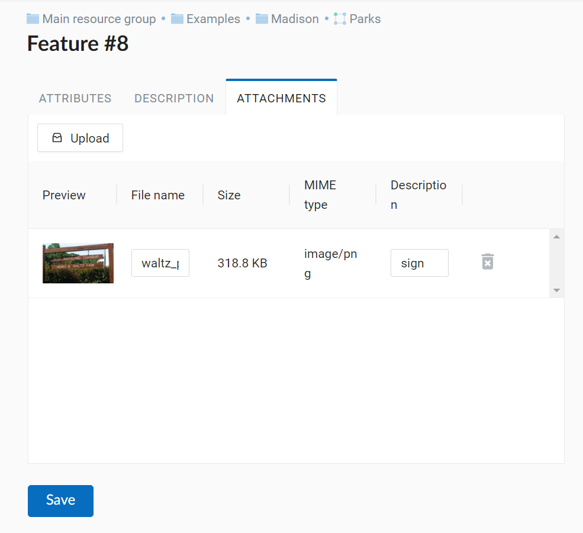
 
   Attachments tab

* "Description" tab - the description is displayed in the Identify panel when you click on a featre.

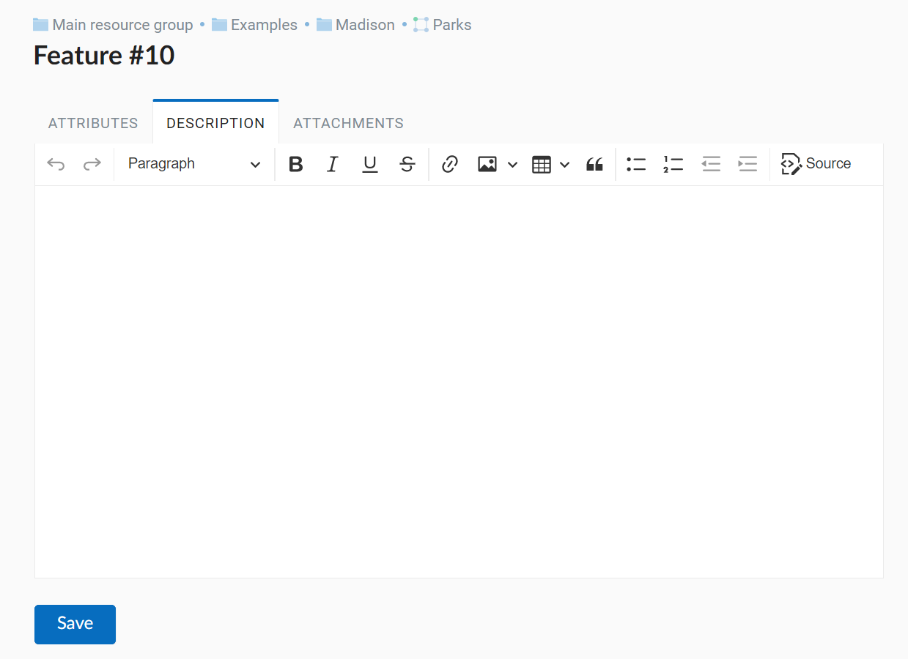

   Description tab

.. note:: If you opened the feature attributes dialog from the Feature table on a separate page, you can edit the feature's geometry in the fourth tab. If you opened the edit dialog from a Web Map, to edit the geometry activate `Edit mode <https://docs.nextgis.com/docs_ngweb/source/feature_edit.html#edit-mode>`_.

.. _ngw_attachments:

Attachments
------------

NextGIS Web software supports adding photos, panoramas and other files to the features. 
If a feature has attachments, they will be shown along with description and attributes in the identify window  (see  :numref:`attachm_tab_pic`).

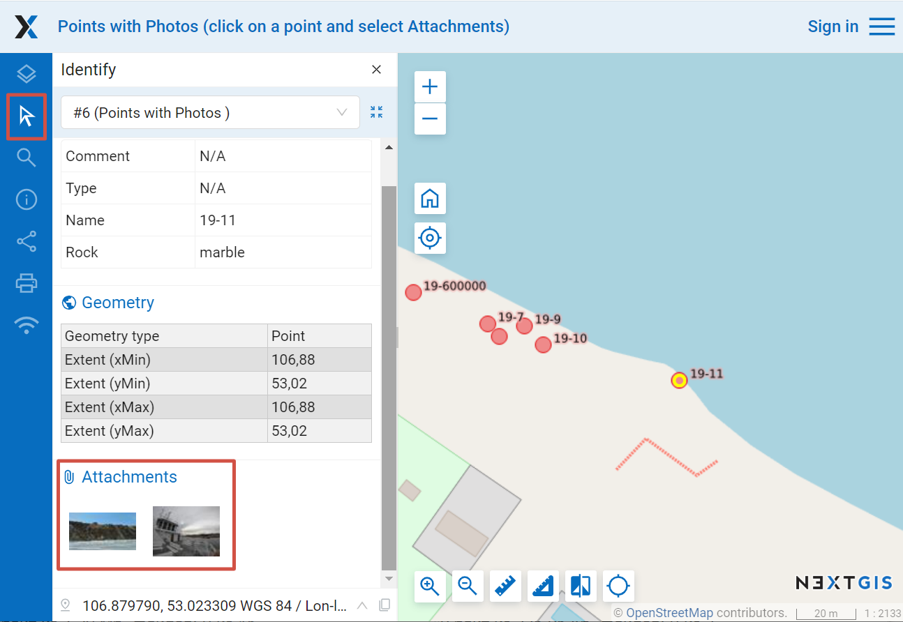

   Identify window for a feature with attached photos

Files in the following formats can be viewed directly in the web client:

* JPEG, PNG images. GIF format not supported.
* Panoramas complying with the `specification <https://developers.google.com/streetview/spherical-metadata?hl=en>`_.

Other types of files can be added as attachments, but won't be viewed in the interface.

After a click on a photo preview a lightbox window is open (a  
javascript powered window in browser). Photo size is adjusted to fit the window.  Photos have descriptions and user can navigate through them using left and right arrow keys on the keyboard (see :numref:`webmap_identification_photo_lightbox`).

.. figure:: _static/webmap_ident_photo_lightbox.png
   :name: webmap_identification_photo_lightbox
   :align: center
   :width: 18cm

   A lightbox with uploaded photo for the identified feature 

To navigate within the panorama, use the mouse. Hold down the left mouse button to rotate the camera. Use the wheel to zoom in and out. Panorama mode can be disabled by clicking on the blue round button in the upper right corner.

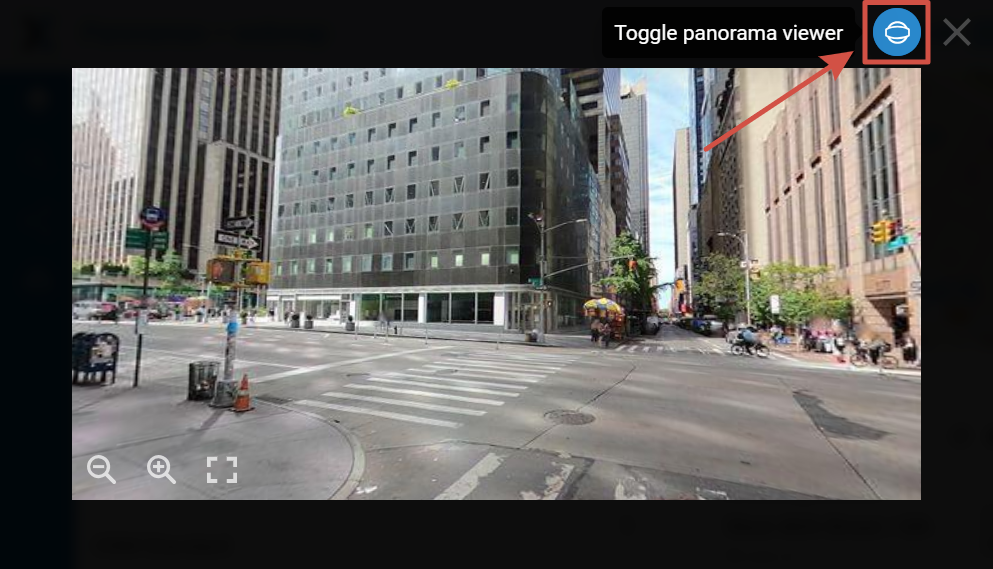

   Panorama opened from Web Map

.. _ngw_add_photos:

Add attachments to a feature
~~~~~~~~~~~~~~~~~~~~~~~~~~~~~~~~~~~~~~~~~

To add an attachment to a feature, go to the edit window. There are several ways to open it:

* Click on the feature on the Web Map, then in the pop-up window press the **Edit** button.
* Open the feature table on the Web Map, select the feature and click **Edit** in the toolbar.
* Open the feature table from the resource page,  select the feature and click **Edit** in the toolbar.

On the Edit page open the Attachments tab and upload the files. 

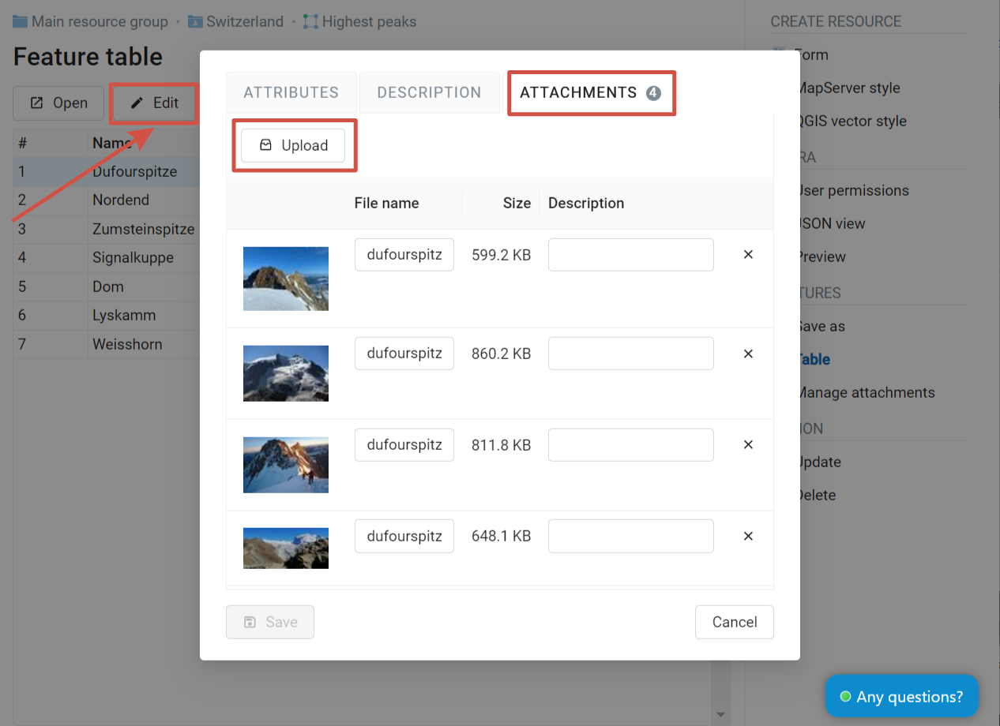

   Adding file as attachment

Enter titles for the attachments and press **Save**.

After uploading you can see previews of photos and panoramas on the "Attachments" tab of the identify window (see :numref:`attach_tab_pic`).

.. note:: 
   By default attachments could be added by any user but there is an option      to limit number of users who can upload photos (see      `Managing access rights <https://docs.nextgis.com/docs_ngcom/source/permissions.html>`_).

You can edit file names and descriptions of the added attachments. To delete an attachment, press the cross icon to its right. If you've made an error during editing, press **Reset**, all modifications will be cancelled.   

To delete an attachment select it on the "Attachments" tab of the edit window, click **Delete**, and then click **Save** button.

See the process of adding attachments in our video:

.. raw:: html

   <iframe width="560" height="315" src="https://www.youtube.com/embed/t1c1GT2myD4?si=q-zfGXgUifTx_62U" title="YouTube video player" frameborder="0" allow="accelerometer; autoplay; clipboard-write; encrypted-media; gyroscope; picture-in-picture; web-share" referrerpolicy="strict-origin-when-cross-origin" allowfullscreen></iframe>

Watch on `youtube <https://youtu.be/t1c1GT2myD4?si=2SZsLHOYH_lfnNAx>`_.

.. _ngw_attachments_panoramas:

How to use panoramas
~~~~~~~~~~~~~~~~~~~~~~~

Not only photos, but also panoramas can be added as attachments. They allow to immerse explore new locations or find new details in familiar places.

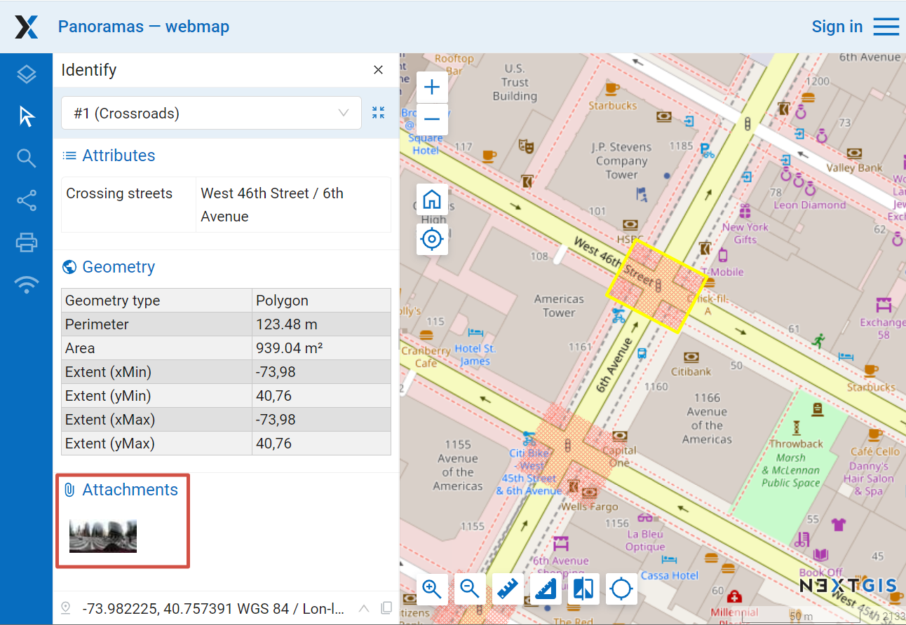

   Panorama preview in the identify panel

Uploaded panoramic images must comply with the Google XMP Photo Sphere `specification <https://developers.google.com/streetview/spherical-metadata?hl=en>`_.

See how to work with panoramas in our video:

.. raw:: html

   <iframe width="560" height="315" src="https://www.youtube.com/embed/MeZ0jJAbZ5I?si=czq1-hdAKBZpfabA" title="YouTube video player" frameborder="0" allow="accelerometer; autoplay; clipboard-write; encrypted-media; gyroscope; picture-in-picture; web-share" referrerpolicy="strict-origin-when-cross-origin" allowfullscreen></iframe>

Watch on `youtube <https://youtu.be/MeZ0jJAbZ5I?si=F6s_wScaTeEjfpPl>`__.

.. _ngw_attachments_imp_exp:

Export and import attachments
~~~~~~~~~~~~~~~~~~~~~~~~~~~~~

To copy feature attachments between different layers or to create a backup you can save them to your device as an archive (Standard layer saving does not include attachments). 

Navigate to the layer resource page and select **Manage attachments**.

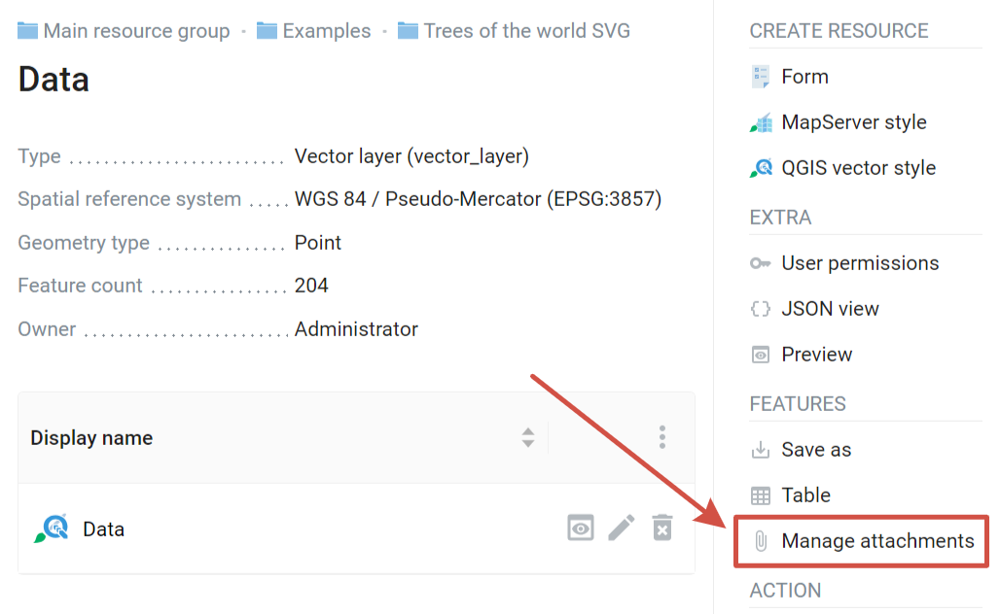

   Managing attachments

To save the attachments, go to the **Export** tab and press **Export attachments to ZIP archive**. The resulting ZIP archive will contain all of the attachments put in directories named after feature IDs. Attachment metadata are put into a separate JSON file.

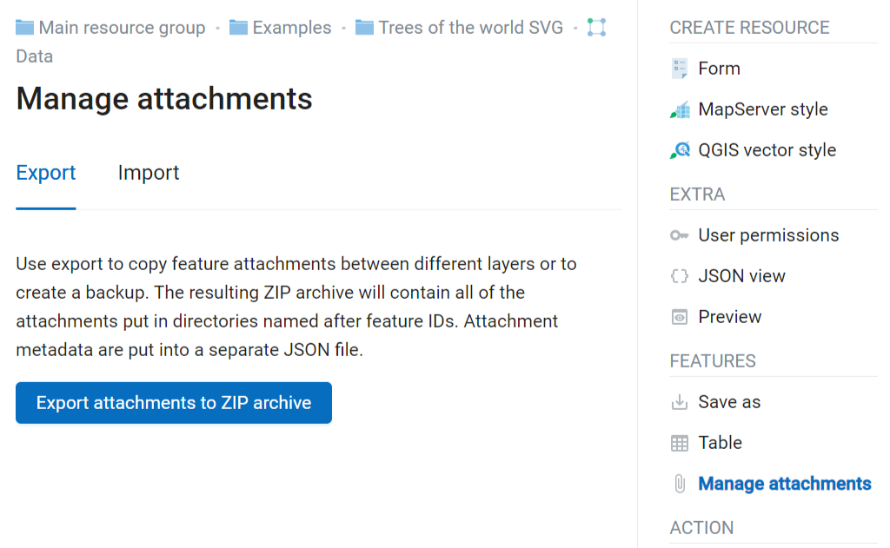

   Exporting attachments as ZIP archive

The resulting archive can be imported to add the attachments to the layer features. Open the **Import** tab, click **Import attachments from ZIP archive** and select the archive on your device. An archive must contain directories named after feature IDs. Each folder can contain one or many attachments. Duplicates will be ignored. If you need to replace the current attachments, tick "Delete existing attachments".

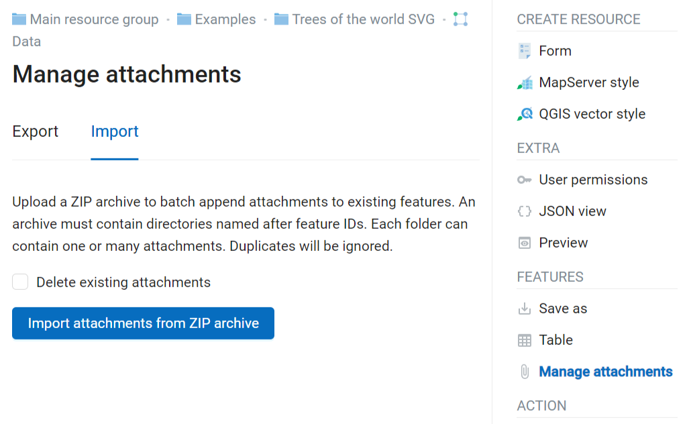

   Importing attachments from ZIP archive

.. to do:: See the process of importing and exporting attachments in our video:
