Managing Feature table
======================

In NextGIS Web you can manage your geodata directly, without needing to display it on a map. View, filter, create, edit and delete features using Feature table.

You can open the Feature table `on a separate page <https://docs.nextgis.com/docs_ngweb/source/feature_table.html#ngw-feature-table-blank>`_ or `on a Web Map <https://docs.nextgis.com/docs_ngweb/source/feature_table.html#ngw-feature-table-webmap>`_.

.. seealso:: `Edit the layer fields <https://docs.nextgis.com/docs_ngweb/source/layers_settings.html#ngw-attributes-edit>`_ used to form the feature table.

.. _ngw_feature_table_blank:

Feature table on a separate page
---------------------------------------

Press the |button_open_feature_table| “Table” icon opposite the resource name or select the Table action for the vector layer in the features pane on the right. 

Feature table allows to perform the following operations with the selected entry (see :numref:`admin_table_objects1_upload`): 

#. `Open selected entry <https://docs.nextgis.com/docs_ngweb/source/feature_table.html#feature-view>`_ 
#. `Create new entry <https://docs.nextgis.com/docs_ngweb/source/feature_table.html#feature-create>`_ (new feature)
#. `Edit entry <https://docs.nextgis.com/docs_ngweb/source/feature_table.html#feature-edit>`_ 
#. `Delete entry <https://docs.nextgis.com/docs_ngweb/source/feature_table.html#feature-delete>`_
#. `Show the total feature count <https://docs.nextgis.com/docs_ngweb/source/feature_table.html#feature-table-other-tools>`_
#. `Search and filter by attribute values <https://docs.nextgis.com/docs_ngweb/source/feature_table.html#table-search-filter>`_
#. Save as a file (choose between advanced and `quick export <https://docs.nextgis.com/docs_ngweb/source/feature_table.html#feature-export>`_)
#. `Refresh the table <https://docs.nextgis.com/docs_ngweb/source/feature_table.html#feature-table-other-tools>`_
#. Select displayed fields in the `table settings <https://docs.nextgis.com/docs_ngweb/source/feature_table.html#ngw-feature-table-fields>`_

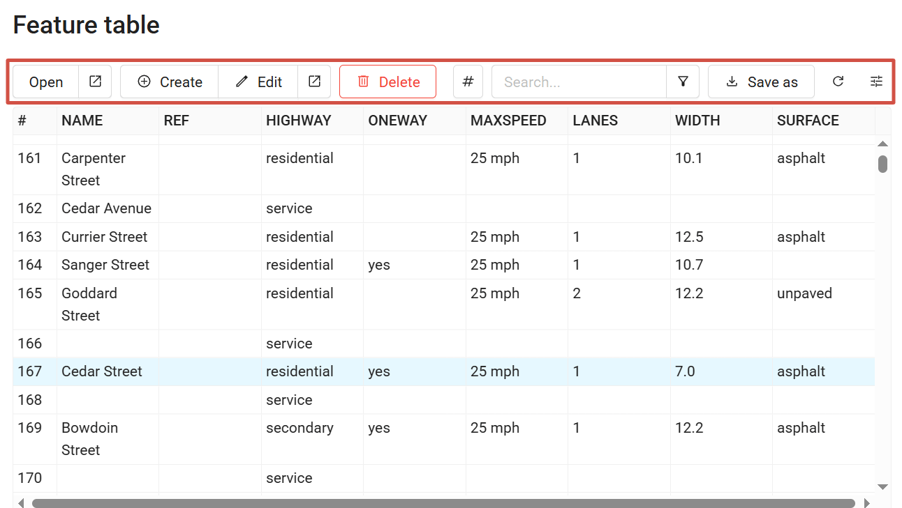

   Feature table tools

Also you can open the Feature table on the Web Map. In this case there are some additional map-related tools.

.. _ngw_feature_table_webmap:

Feature table on a Web Map
--------------------------------

There is another way to open Feature table. |button_open_web_map| open a Web Map that has the layer in question added to it.

.. |button_open_web_map| image:: _static/button_open_web_map.png
   :width: 6mm
   :alt: map and magnifying glass

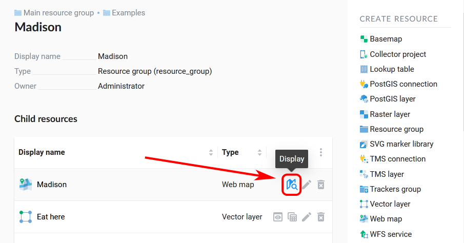

   Opening a Web Map from the list

 
A Web Map will be opened with a layer tree (left) and a map (right). To view a feature table select the required layer in layer tree and then select "Feature table" command in the Layer drop down menu at the top of layer tree :numref:`map_and_tree_layers_pic`:

.. figure:: _static/map_and_tree_layers_eng_3.png
   :name: map_and_tree_layers_pic
   :align: center
   :width: 20cm

   Opening feature table from the map
 
All tools of the Feature table are available, as well as some map navigation tools:

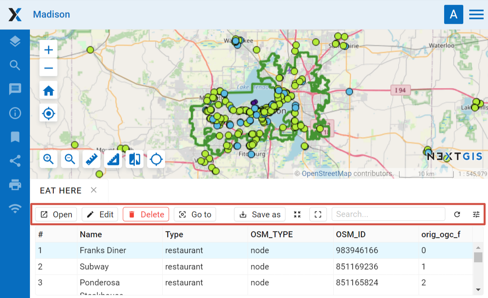

   Actions for the selected record in feature table

#. |button_go_to| Go to (after a click the selected feature will be displayed on the map)
#. |button_zoom_to_filtered| Zoom to filtered features
#. |button_filter_area| `Filter features by area <https://docs.nextgis.com/docs_ngweb/source/feature_table.html#ngw-feature-table-filter-area>`_

.. |button_open_resource| image:: _static/button_open_resource.png
   :width: 6mm
   :alt: square with arrow

.. |button_plus_layer| image:: _static/button_plus_layer.png
   :width: 6mm
   :alt: +

.. |button_edit| image:: _static/button_edit.png
   :width: 6mm
   :alt: pencil

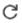

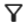

.. |button_open_feature_table| image:: _static/button_open_feature_table.png
   :width: 6mm
   :alt: table

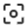

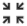

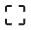

.. |button_delete| image:: _static/button_delete.png
   :width: 6mm
   :alt: trash can

.. _table_search_filter:

Search and filter
------------------

Click on the header of any column to sort the table by that attribute's values.

In the top right corner you'll find the search bar. Enter any text in it. The table contents are filtered, displaying only the features that have the search text in one of the attributes.

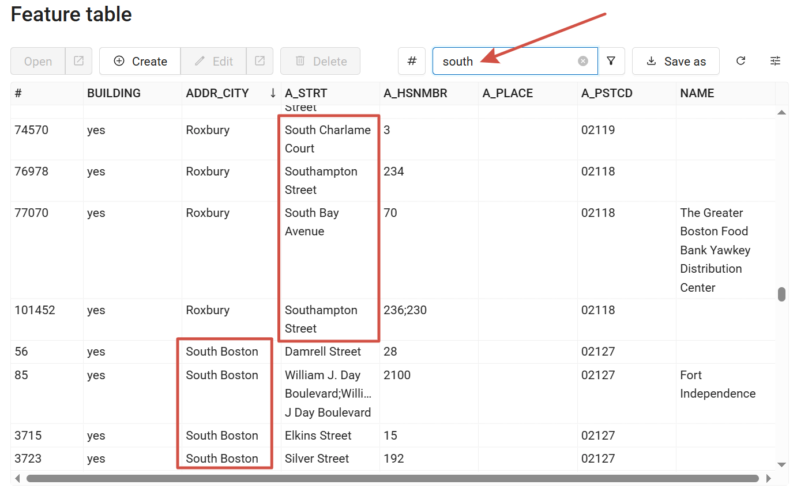

   Text search

You can also create more complicated filters. Click on the funnel icon |button_filter| next to the search bar and add filter conditions. You can use logical operators AND (select "ALL") and OR (select "ANY"). 

For example, there are several roads named "Adams Street" in the Boston area, and we need to filter out the bigger ones (OSM tag "highway=tertiary") and only inspect the smaller ones. Add two conditions: 1) NAME is Equal to "Adams Street"; 2) HIGHWAY is Not Equal to "tertiary". Select "ALL" in the top left corner, that means that both conditions should be satisfied.

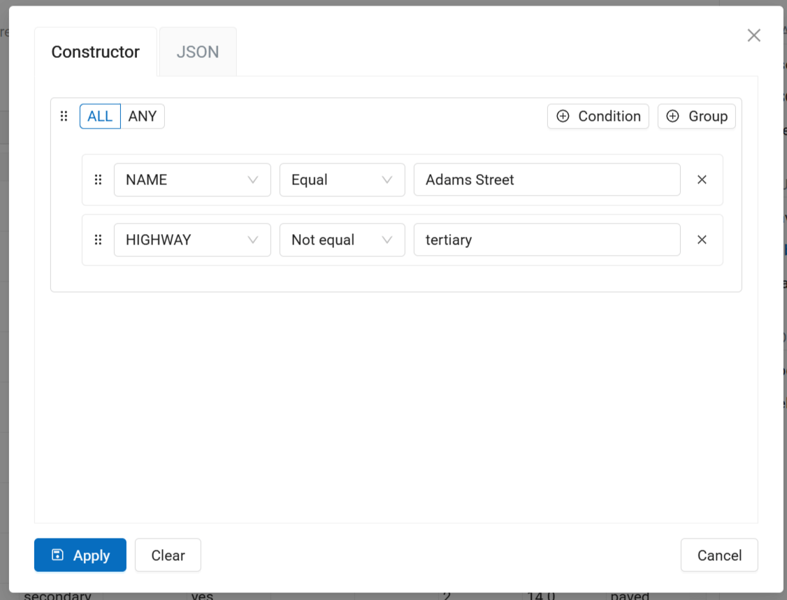

   Filter conditions that must both be satisfied

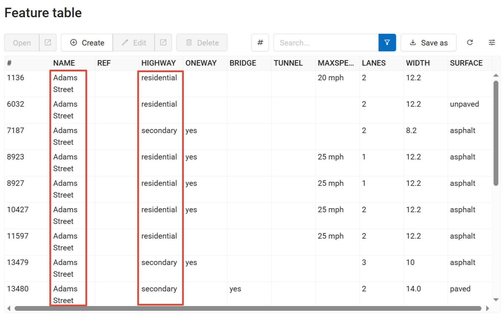

   Filtered entries

.. _ngw_feature_table_filter_area:

Filter layer features on the Web Map by area
---------------------------------------------

NextGIS Web has a tool in the Feature table that filters all layer features within a selected area. To choose area limits just draw them on the Web Map.

Open the feature table and click on the |button_filter| button. In the dropdown menu select the geometry of the area:

* circle (click twice on the map, to choose the center of the circle and its size, the radius length is shown in meters)
* line (features intersected by the line will be filtered)
* rectangle (click on diagonally opposite apexes)
* free-hand drawn polygon (each click creates an apex, the area covered by the polygon is highlighted; to finish the shape, double-click on an apex, the polygon will be completed automatically)

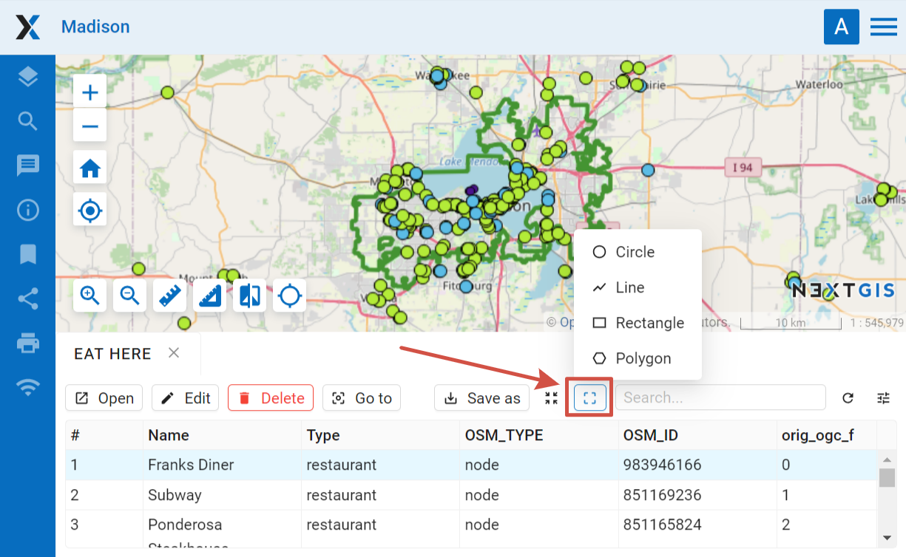

   Selecting filter geometry

Now the feature table only contains the features within the selected area. The tool button will have the current area shape on it. In the dropdown menu you can use one of the following options:

* Show/Hide the outline and fill of the selected area
* Zoom to the filtering area
* Clear filtering geometry

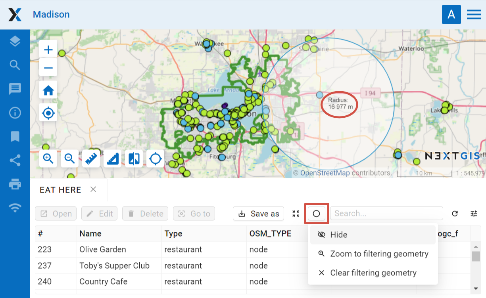

   Filter actions

To set the map extent displaying all the filtered features, click |button_zoom_to_filtered|.

You can use quick export to save the filtered features in a variety of common geodata formats. Click **Save as** and in the dropdown menu select either `quick export <https://docs.nextgis.com/docs_ngweb/source/feature_table.html#feature-export>`_ with default settings or `advanced export <https://docs.nextgis.com/docs_ngweb/source/admin_interface.html#ngw-vector-export>`_ to modify the settings.

See feature filtering in action:

.. raw:: html

   <iframe width="560" height="315" src="https://www.youtube.com/embed/q946UruxUb0?si=ryJmDXIuD8aYPSGH" title="YouTube video player" frameborder="0" allow="accelerometer; autoplay; clipboard-write; encrypted-media; gyroscope; picture-in-picture; web-share" referrerpolicy="strict-origin-when-cross-origin" allowfullscreen></iframe>

Watch on `youtube <https://youtu.be/q946UruxUb0?si=gXo0OMG3x-2dIsac>`_.

.. _feature_view:

View feature entry
------------------

You can view any entry of the feature table in a pop-up or on a separate page. Select the entry and click **Open**. 

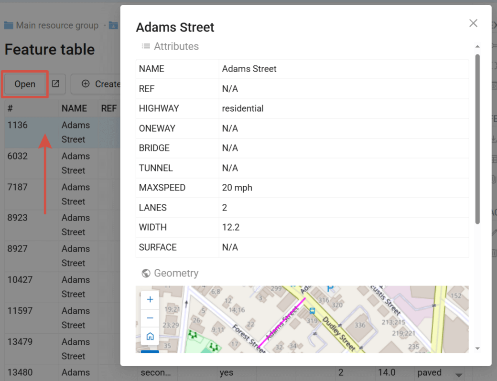

   Viewing feature entry

Click the |button_open_resource| icon next to the **Open** button to view the entry on a new page.

.. _feature_create:

Create new feature
-----------------------

You can use the Feature table to add a new feature to the layer. Click |button_plus_layer| **Create**.

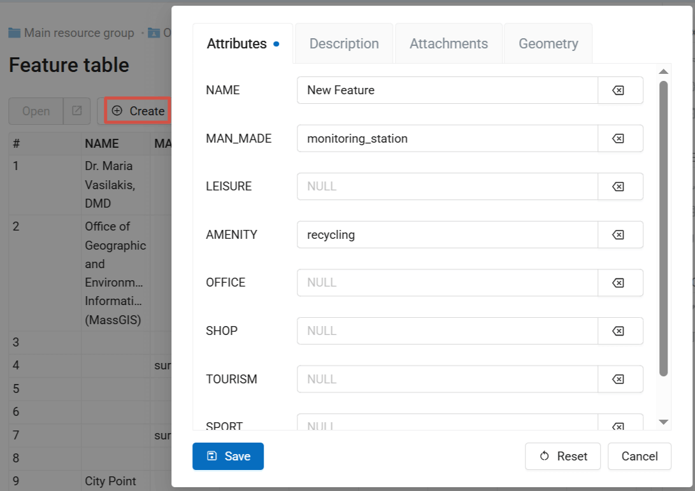

   Creating new feature: enter attribute values

You can add a custom Description and Attachments on the corresponding tabs. The number of attachments is not limited. For each attached file you can add an indivisual description.

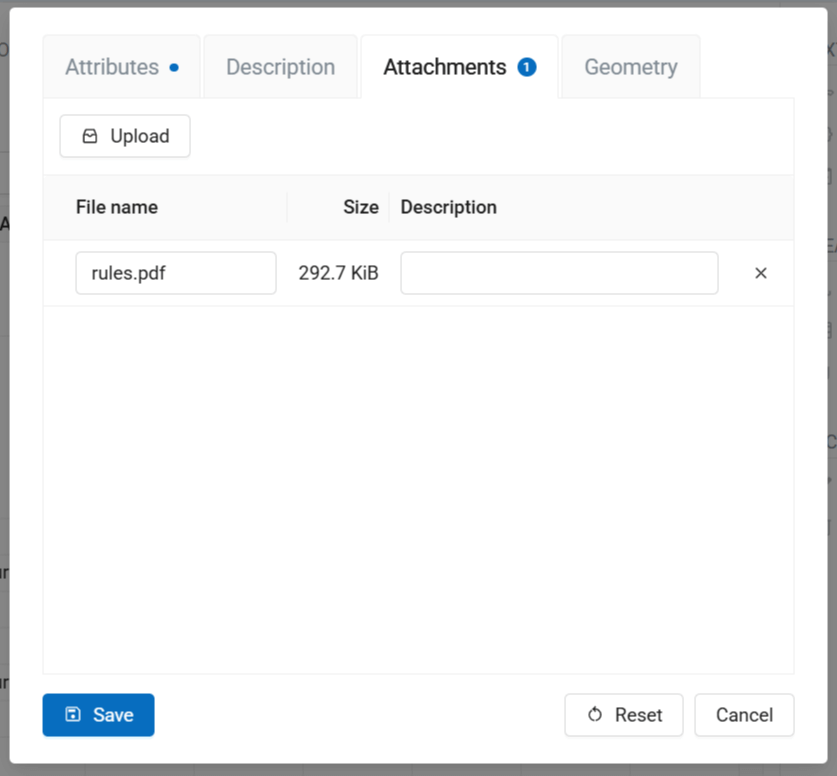

   Attachments tab

On the Geometry tab you can draw the feature's geometry:

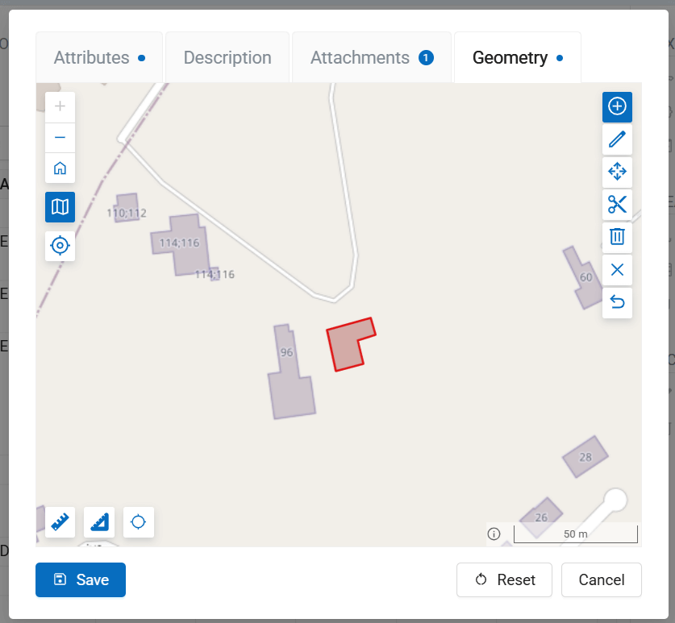

   Creating geometry for the new feature

Click **Save** to finish creating new feature. An entry will be added to the Feature table.

.. _feature_edit:

Edit features
-----------------------

Select an entry and click |button_edit| **Edit**. In the pop-up dialog you can modify the attribute values, description and geometry and manage attachments.

Tabs that have unsaved changes are marked by a blue dot.

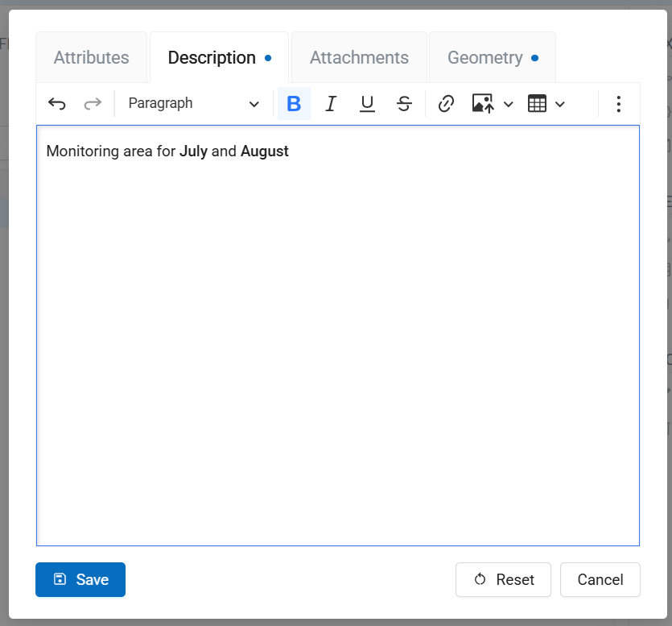

   Editing feature description

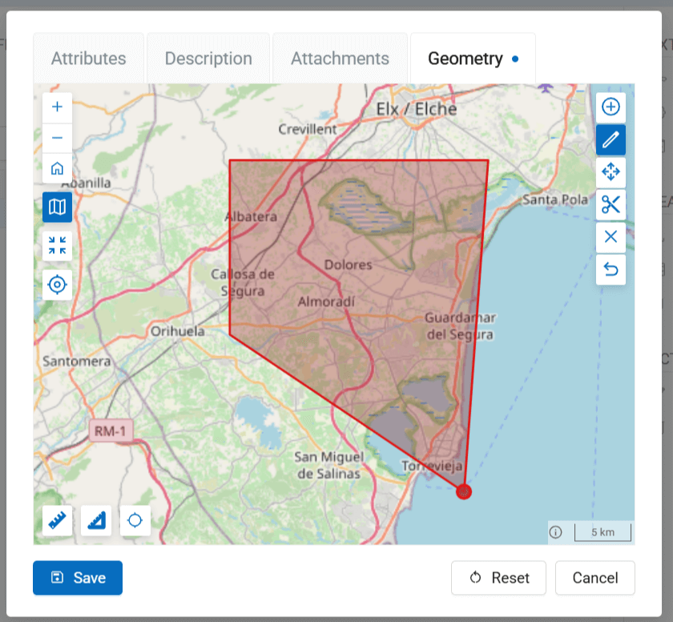

   Editing geometry

Click **Save** to finish editing. All the edits are saved to the layer.

You can also edit features `on a Web Map <https://docs.nextgis.com/docs_ngweb/source/feature_edit.html>`_ or in the desktop app QGIS `via NextGIS Connect <https://docs.nextgis.com/docs_ngconnect/source/resources.html#connect-data-export>`_ plugin.

.. _feature_delete:

Delete feature
----------------

You can use Feature table to delete features from the layer. Select the entry and click |button_delete| **Delete**.

Confirm deletion in the pop-up dialog.

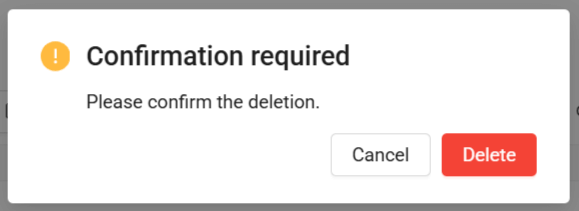

   Deleting feature

.. _feature_export:

Export to file
--------------

To quickly save the filtered entries to a file, click **Save as**, then in the dropdown menu select **Quick export** and choose the file format. 

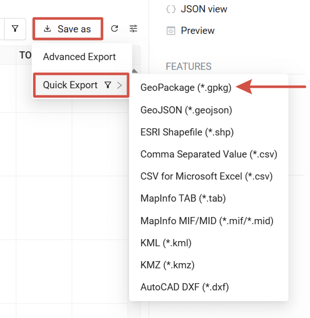

   Quick export

Also you can select **Advanced export** and customize the settings (`more on export settings <https://docs.nextgis.com/docs_ngweb/source/admin_interface.html#ngw-vector-export>`_).

.. _ngw_feature_table_fields:

Displaying selected fields and feature edit information
-------------------------------------------------------

You can select which fields of the feature table to display. Press "Open table settings" button in the right corner and untick the fields you want to hide. 

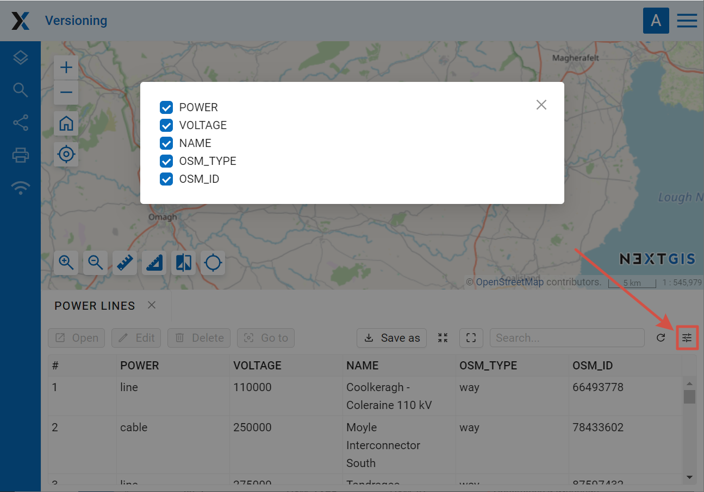

   Selecting fields for display

If `feature versioning <https://docs.nextgis.com/docs_ngweb/source/layers.html#create-vector-layer-vers-pic>`_ is enabled, at the bottom of the list you'll find an additional unticked field. It is a virtual "Last changed" field. It contains date and time of the most recent edit made to the feature as well as the username.

The first change logged is the time the versioning is enabled. 

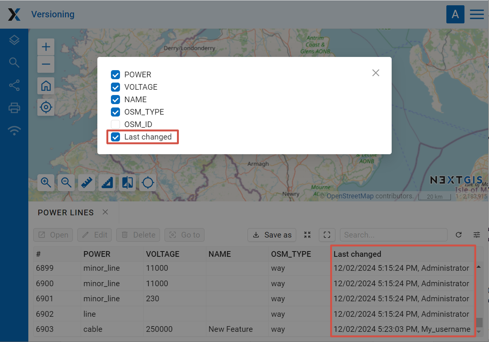

   Displaying changes in the feature table

.. _feature_table_other_tools:

Other tools
-----------------------------------

Click on the # hashtag button to see the current feature count.

Click |button_refresh_single| to refresh the table so that it includes the latest changes made elsewhere.

