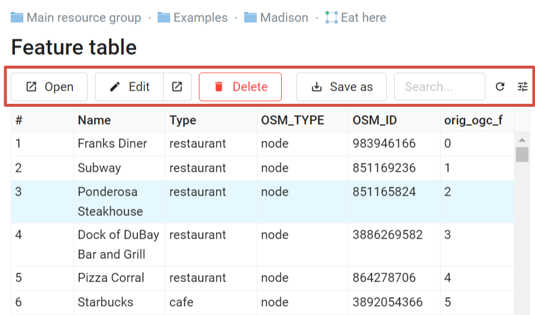
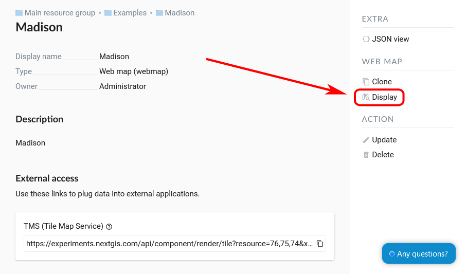

Managing Feature table
========================

Feature table can be displayed in a separate browser tab or on the Web Map.

To edit feature table, log in first.

Feature table on a separate tab
------------------------------------

Press the "Table" icon opposite the resource name or select an action for a vector layer called "Table" in the features pane.

Feature table allows to perform the following operations with a selected feature  (see :numref:`admin_table_objects1_upload`):

1. Open
2. Edit (in a new tab or in the same tab)
3. Delete
4. Save as (advanced or quick export available)
5. Use Search Box
6. Refresh the table
7. Open table settings

   Actions for the selected feature in the feature table

Feature table on a Web Map
------------------------------

There is another way to open Feature table. In the adminitrative interface navigate to a child resource group where resource types are marked and find a resource with a type Web Map. Open it by clicking on the "Display" icon (see :numref:`webmap_open_from_group_pic`):

.. figure:: _static/webmap_open_from_group_en.png
   :name: webmap_open_from_group_pic
   :align: center
   :width: 20cm

   Opening a Web Map from the list

Alternatively, you can go to the resource page and click "Display" in the Web Map actions pane on the right.

   Opening a Web Map from the resouce page

A Web Map will be opened with a layer tree (left) and a map (right). To view a feature table select the required layer in layer tree and then select "Feature table" command in the Layer drop down menu at the top of layer tree :numref:`admin_map_and_tree_layers_upload`:

.. figure:: _static/map_and_tree_layers_eng_3.png
   :name: admin_map_and_tree_layers_upload
   :align: center
   :width: 20cm

   Opening feature table from the map
  
Table allows to perform the following operations with the selected feature  :numref:`admin_table_objects2_upload`:

1. Open in a new tab
2. Edit 
3. Delete
4. Go to (after a click the selected feature will be displayed on the map)
5. Save as (advanced or quick export available)
6. Zoom to filtered features
7. Filter features by area
5. Use Search Box
6. Refresh the table
7. Open table settings

 
.. figure:: _static/table_objects2_eng_3.png
   :name: admin_table_objects2_upload
   :align: center
   :width: 20cm

   Actions for the selected record in feature table

You can also `edit the attributes <https://docs.nextgis.com/docs_ngweb/source/layers_settings.html#edit-vector-layer-attributes-table>`_ themselves.

.. _ngw_feature_table_filter_area:

Filter layer features on the Web Map by area
---------------------------------------------

NextGIS Web has a tool in the Feature table that filters all layer features within a selected area. To choose area limits just draw them on the Web Map.

Open the feature table and click on the button with a dotted frame. In the dropdown menu select the geometry of the area:

* circle (click twice on the map, to choose the center of the circle and its size, the radius length is shown in meters)
* line (features intersected by the line will be filtered)
* rectangle (click on diagonally opposite apexes)
* free-hand drawn polygon (each click creates an apex, the area covered by the polygon is highlighted; to finish the shape, double-click on an apex, the polygon will be completed automatically)

.. figure:: _static/ngweb_filter_by_area_geometry_en.png
   :name: ngweb_filter_by_area_geometry_pic
   :align: center
   :width: 20cm

   Selecting filter geometry

Now the feature table only contains the features within the selected area. The tool button will have the current area shape on it. In the dropdown menu you can use one of the following options:

* Show/Hide the outline and fill of the selected area
* Zoom to the filtering area
* Clear filtering geometry

.. figure:: _static/ngweb_filter_by_area_actions_en.png
   :name: ngweb_filter_by_area_actions_pic
   :align: center
   :width: 20cm

   Filter actions

You can use quick export to save the filtered features in a variety of common geodata formats. Click **Save as** and select in the dropdown menu Quick export with default settings or Advanced export to modify parameters (see detailed description below).

See feature filtering in action:

.. raw:: html

   <iframe width="560" height="315" src="https://www.youtube.com/embed/q946UruxUb0?si=ryJmDXIuD8aYPSGH" title="YouTube video player" frameborder="0" allow="accelerometer; autoplay; clipboard-write; encrypted-media; gyroscope; picture-in-picture; web-share" referrerpolicy="strict-origin-when-cross-origin" allowfullscreen></iframe>

Watch on `youtube <https://youtu.be/q946UruxUb0?si=gXo0OMG3x-2dIsac>`_.

.. _ngw_feature_table_fields:

Displaying selected fields and feature edit information
-------------------------------------

You can select which fields of the feature table to display. Press "Open table settings" button in the right corner and untick the fields you want to hide. 

.. figure:: _static/feature_table_display_set_en.png
   :name: feature_table_display_set_pic
   :align: center
   :width: 20cm

   Selecting fields for display

If `feature versioning <https://docs.nextgis.com/docs_ngweb/source/layers.html#create-vector-layer-vers-pic>`_ is enabled, at the bottom of the list you'll find an additional unticked field. It is a virtual "Last changed" field. It contains date and time of the most recent edit made to the feature as well as the username.

The first change logged is the time the versioning is enabled. 

.. figure:: _static/feature_table_changelog_en.png
   :name: feature_table_changelog_pic
   :align: center
   :width: 20cm

   Displaying changes in the feature table
