Таблица объектов
==================

Для того, чтобы произвести действия над таблицей объектов, необходимо авторизоваться.

Таблицу объектов можно открыть на отдельной странице или на веб-карте.

.. _ngw_feature_table_blank:

Таблица объектов на отдельной странице
---------------------------------------

Чтобы открыть таблицу объектов, перейдите к группе ресурсов, где находится нужный слой, и нажать на значок таблицы напротив векторного слоя.
Другой способ - выбрать этот слой, а затем в блоке операций выбрать действие над слоем - "Таблица объектов".

При нажатии на заголовок любой из колонок, таблица будет отсортирована по выбранному атрибуту.

Сформированная таблица объектов позволяет выполнить следующие операции (см. :numref:`ngweb_operations_on_writing_in_object_table`):

#. Открыть выделенную запись (в том числе на новой странице)
#. Создать новую запись (новый объект)
#. Редактировать запись (в том числе редактировать на новой странице)
#. Удалить запись
#. Показать общее количество объектов слоя
#. Искать по значениям атрибутов и фильтровать таблицу по выражению
#. Сохранить как (доступен расширенный и быстрый экспорт)
#. Обновить таблицу
#. Открыть настройки таблицы

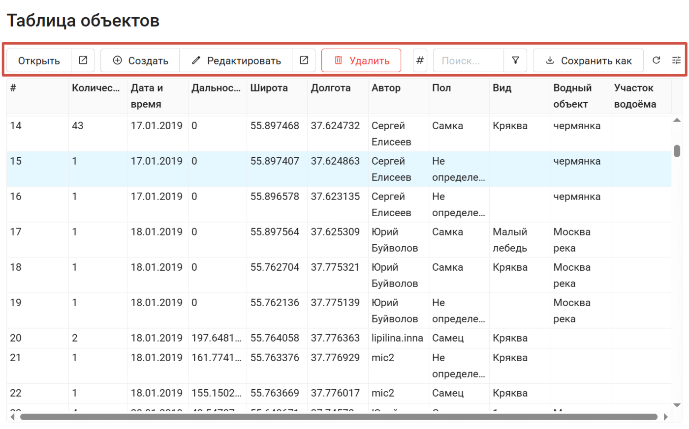

   Инструменты таблицы объектов

.. |button_open_resource| image:: _static/button_open_resource.png
   :width: 6mm
   :alt: квадрат со стрелочкой

.. |button_plus_layer| image:: _static/button_plus_layer.png
   :width: 6mm
   :alt: +

.. |button_edit| image:: _static/button_edit.png
   :width: 6mm
   :alt: карандаш

.. |button_refresh_single| image:: _static/button_refresh_single.png
   :width: 6mm
   :alt: круговая стрелка

.. _feature_view:

Просмотр объекта
~~~~~~~~~~~~~~~~

Каждый объект можно просмотреть на той же странице или в отдельной. Для этого нужно выделить строку объекта и нажать кнопку **Открыть**. 

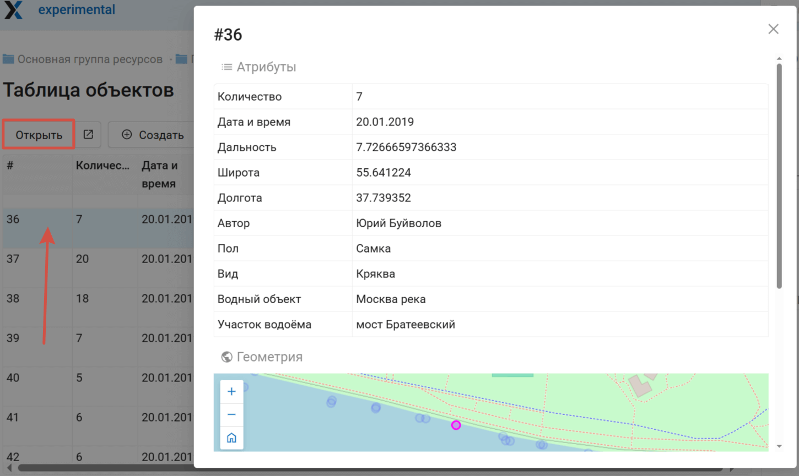

   Просмотр объекта

Если нажать значок |button_open_resource| рядом с кнопкой, предпросмотр отроется на новой странице.

.. _feature_create:

Создание нового объекта
~~~~~~~~~~~~~~~~~~~~~~~

Инструменты таблицы атрибутов позволяют добавить в базу данных векторного слоя новую запись. Нажмите |button_plus_layer| **Создать**

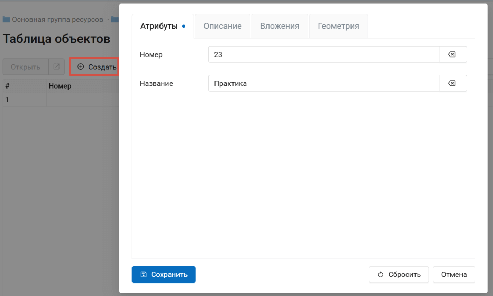

   Создание нового объекта: ввод атрибутов

На вкладках «Описание» и «Вложения» к каждому объекту возможно прикрепить произвольное описание и неограниченное количество файлов, для каждого из которых также можно задать собственное описание.

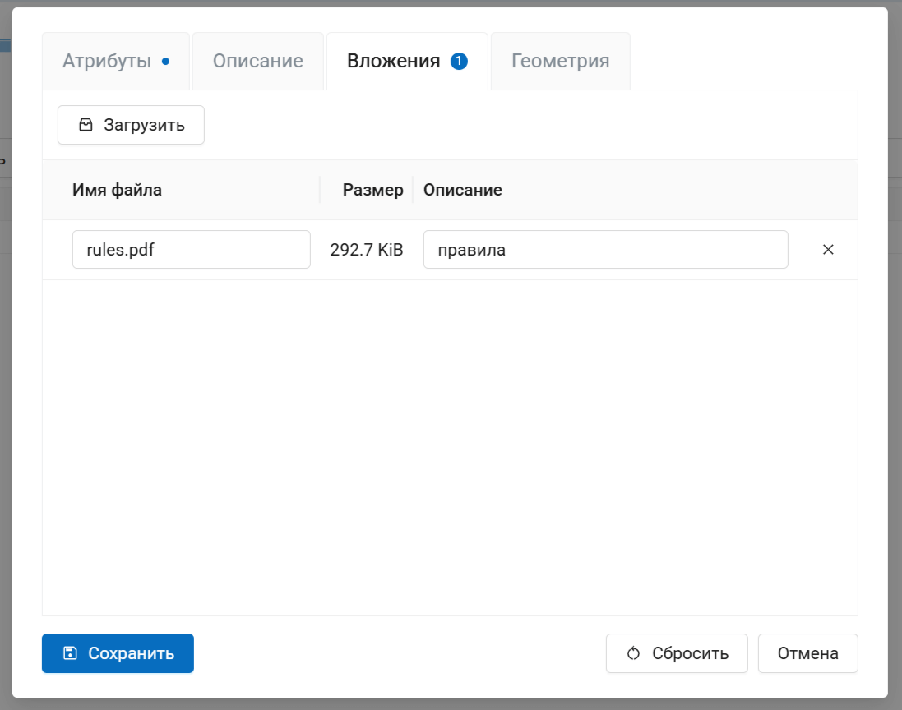

   Вкладка "Вложения"

На вкладке "Геометрия" можно задать геометрию объекта:

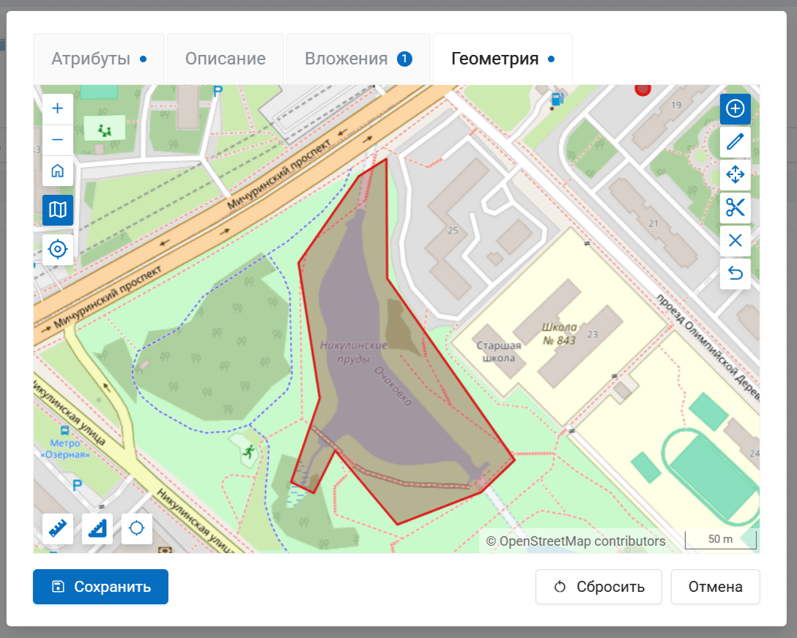

   Геометрия создаваемого объекта

Для завершения создания объекта нажмите кнопку **Сохранить**. В таблицу объектов будет добавлена новая запись.

.. _feature_edit:

Редактирование объекта
~~~~~~~~~~~~~~~~~~~~~~

Выделите нужную запись и нажмите |button_edit| **Редактировать**. Во всплывающем окне вы можете изменять значения атрибутов, менять описание и геометрию и управлять вложениями.

Вкладки, на которых были внесены изменения, отмечаются синей точкой.

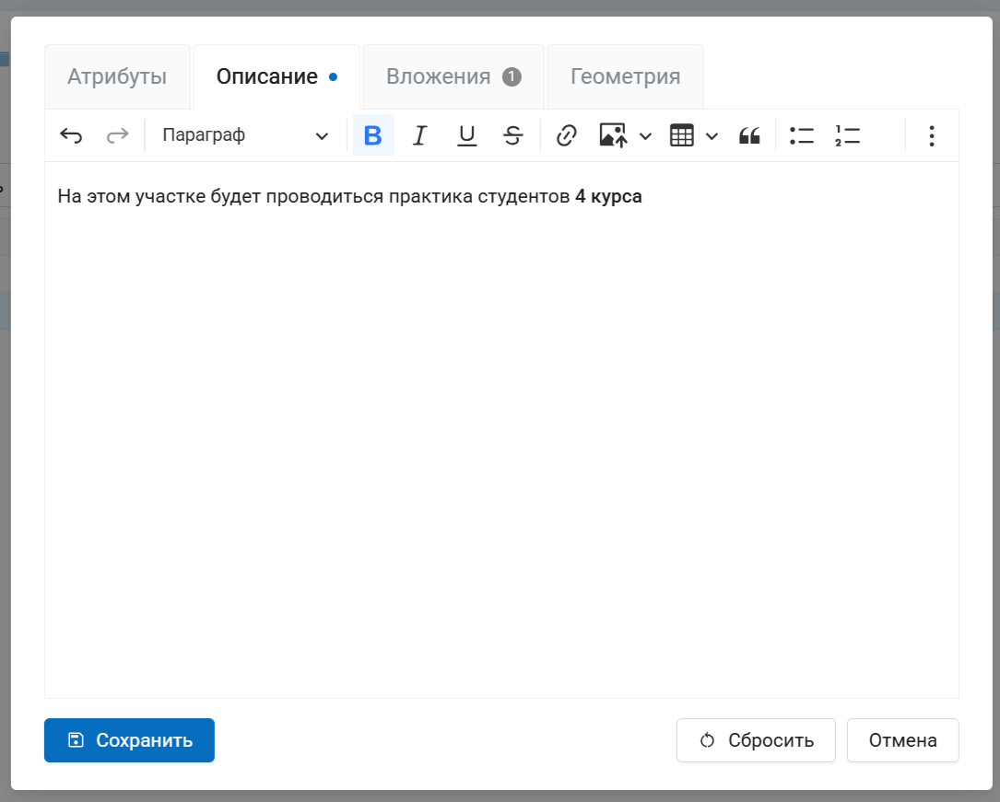

   Редактирование описания объекта

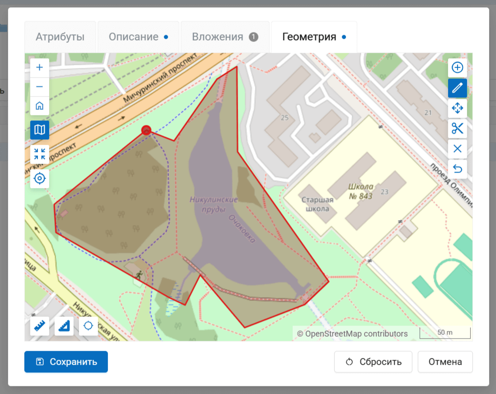

   Редактирование геометрии

Чтобы завершить редактирование, нажмите **Сохранить**. Все внесённые изменения будут записаны в слой.

.. _feature_delete:

Удаление объекта
~~~~~~~~~~~~~~~~

Через таблицу атрибутов вы можете удалить объект из слоя. Для этого выделите строчку с нужной записью и нажмите **Удалить**.

Во всплывающем окне подтвердите удаление объекта.

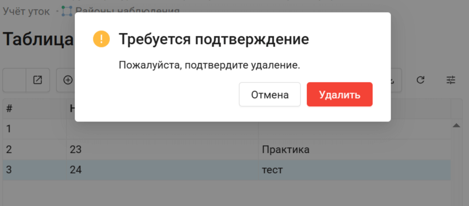

   Удаление объекта

.. _feature_export:

Экспорт в файл
~~~~~~~~~~~~~~~

Чтобы быстро сохранить объекты таблицы в файл, нажмите **Сохранить как**, в выпадающем меню нажмите **Быстрый экспорт** и выберите формат, в который хотите экспортировать данные. 

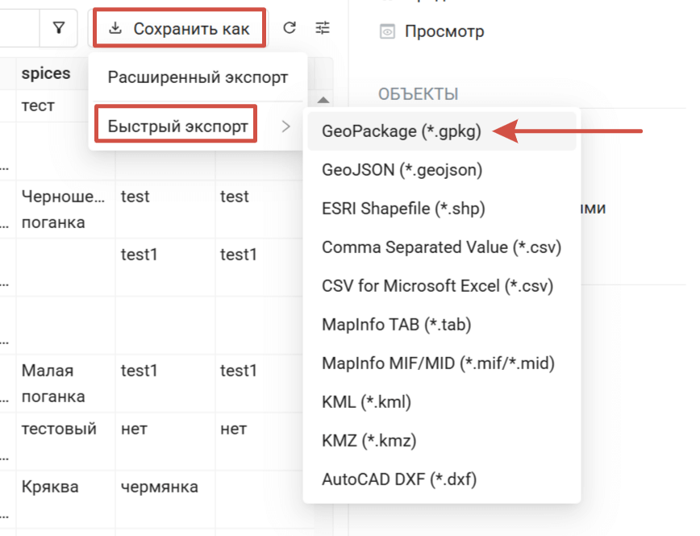

   Быстрый экспорт слоя

Также вы можете выбрать вариант **Расширенный экспорт**, где можно задать пользовательские настройки (`подробнее <https://docs.nextgis.ru/docs_ngweb/source/admin_interface.html#ngw-vector-export>`_).

.. _feature_table_other_tools:

Другие инструменты таблицы объектов
~~~~~~~~~~~~~~~~~~~~~~~~~~~~~~~~~~~

Нажмите кнопку с # хэштегом, чтобы увидеть текущее количество объектов слоя.

Нажмите |button_refresh_single|, чтобы обновить таблицу объектов, если в неё были внесены изменения в другом месте.

.. _ngw_feature_table_webmap:

Таблица объектов на веб-карте
--------------------------------

Формирование таблицы объектов можно выполнить другим способом: с веб-карты, на которую добавлен слой.

.. figure:: _static/webmap_open_simple_ru.png
   :name: webmap_open_simple_pic
   :align: center
   :width: 20cm

   Операция открытия веб-карты из группы ресурсов

.. figure:: _static/webmap_open_rus_2.png
   :name: webmap_open_rus_pic
   :align: center
   :width: 20cm

   Операция открытия веб-карты со страницы ресурса
   
Для формирования таблицы объектов необходимо выделить нужный слой карты в дереве слоев, после чего 
в меню слоя выбрать "Таблица объектов" :numref:`ngweb_admin_map_and_tree_layers_pic`:

.. figure:: _static/map_and_tree_layers_rus_3.png
   :name: ngweb_admin_map_and_tree_layers_pic
   :align: center
   :width: 20cm

   Карта и дерево слоев
 
Cформируется таблица объектов, которая позволяет выполнять следующие операции  :numref:`ngweb_admin_table_objects2_upload`:

1. Открыть выделенную запись
2. Редактировать запись 
3. Удалить запись
4. Перейти (при нажатии на кнопку происходит переход к выбранному объекту на карте)
5. Сохранить как (доступен расширенный и быстрый экспорт)
6. Приблизить к найденным объектам
7. Отфильтровать объекты по местности
8. Воспользоваться строкой Поиска
9. Обновить таблицу
10. Открыть настройки таблицы
 
.. figure:: _static/ngweb_operations_on_writing_in_object_table2_rus_3.png
   :name: ngweb_admin_table_objects2_upload
   :align: center
   :width: 20cm

   Операции над записью в таблице объектов

Также можно `отредактировать атрибуты <https://docs.nextgis.ru/docs_ngweb/source/layers_settings.html#ngw-attributes-edit>`_ векторного слоя, формирующие таблицу объектов.

.. _ngw_feature_table_filter_area:

Фильтрация объектов по области карты
--------------------------------------

В NextGIS Web предусмотрена возможность отфильтровать объекты, входящие в выделенную область карты. Обозначить границы области можно, нарисовав их непосредственно на карте.

Откройте таблицу объектов и нажмите на кнопку с пунктирной рамкой. В выпадающем меню выберите форму геометрии очертаний области фильтрации:

* окружность (задаётся двумя кликами по карте, первый клик обозначит центр окружности, второй - желаемый радиус, он будет показываться в метрах)
* линия (отфильтрованы будут все объекты, пересекаемые заданной линией)
* прямоугольник (задаётся двумя вершинами)
* произвольный полигон (каждый клик создаёт вершину полигона, охватываемая им область высветляется; чтобы завершить рисование, кликните в точке дважды, полигон замкнётся автоматически)

.. figure:: _static/ngweb_filter_by_area_geometry_ru.png
   :name: ngweb_filter_by_area_geometry_pic
   :align: center
   :width: 20cm

   Выбор геометрии области фильтрации

Теперь таблица объектов содержит только те из них, которые попадают в выделенную область. На кнопке будет отображена форма геометрии выделения. В выпадающем меню появятся следующие пункты:

* Скрыть/Показать границы и заливку выделенной области
* Увеличить до выделенной области
* Очистить фильтр

.. figure:: _static/ngweb_filter_by_area_actions_ru.png
   :name: ngweb_filter_by_area_actions_pic
   :align: center
   :width: 20cm

   Действия с фильтром

Отфильтрованные объекты можно экспортировать в большинстве распространенных форматов геоданных. В меню кнопки **Сохранить как** можно выбрать быстрый экспорт с настройками по умолчанию или расширенный экспорт, где можно задать пользовательские настройки (`подробнее <https://docs.nextgis.ru/docs_ngweb/source/admin_interface.html#ngw-vector-export>`_).

Посмотрите, как фильтровать объекты на карте, в нашем видео:

.. raw:: html

   <iframe width="560" height="315" src="https://rutube.ru/play/embed/ccf892bf5f763632c7fd77498a642eb8/" frameBorder="0" allow="clipboard-write; autoplay" webkitAllowFullScreen mozallowfullscreen allowFullScreen></iframe>

Смотреть на `youtube <https://youtu.be/F039ufZM_RU>`_, `rutube <https://rutube.ru/video/ccf892bf5f763632c7fd77498a642eb8/>`_.

.. _ngw_feature_table_fields:

Поля таблицы и отображение изменений
-------------------------------------

При просмотре таблицы объектов на карте можно выбрать, какие поля атрибутов отображать. Для этого нажмите кнопку "Настройки таблицы" в правом углу и настройте видимость полей при помощи галочек. 

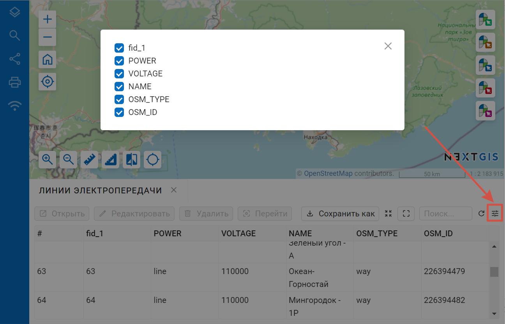

   Выбор полей для отображения

Если для слоя включено `версионирование <https://docs.nextgis.ru/docs_ngweb/source/layers.html#create-vector-layer-vers-pic>`_, в конце списка вы увидите ещё одно поле, виртуальное: последнее изменение. Оно включает дату и время внесения изменений в данные объекта, а также имя пользователя.

В качестве первого изменения будет вписано включение версионирования. 

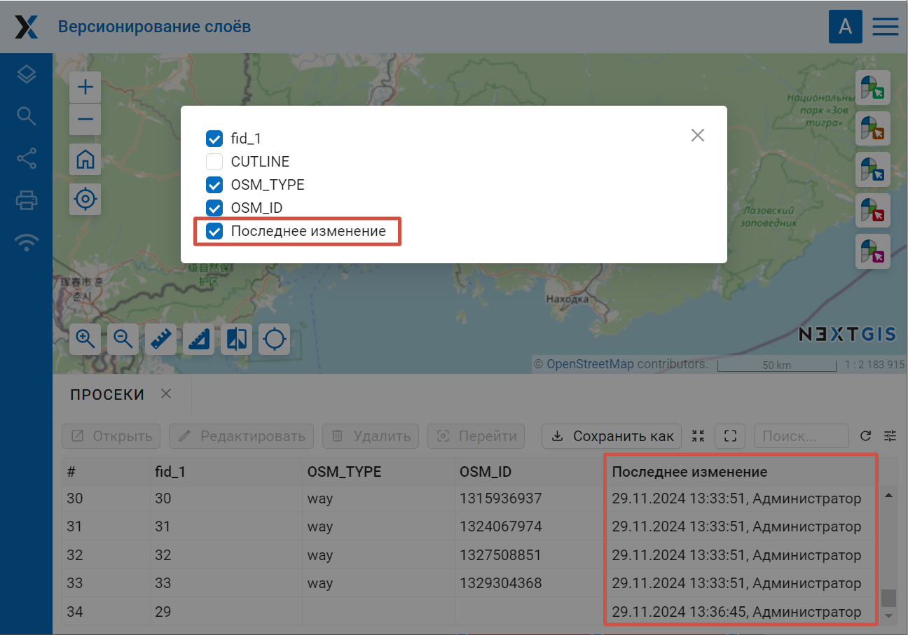

   Отображение изменений в таблице объектов
