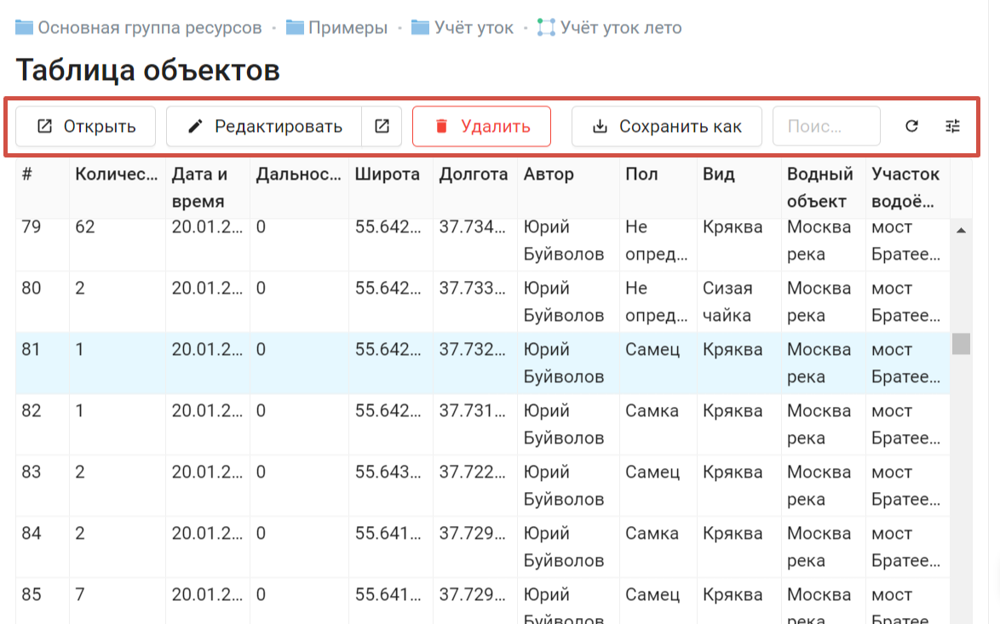
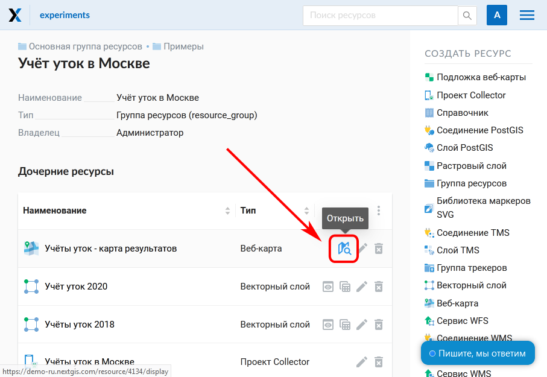
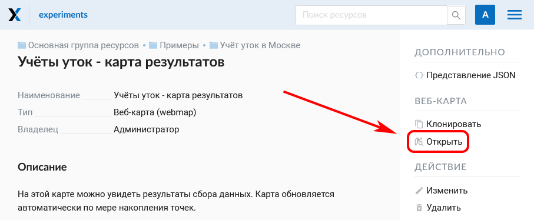
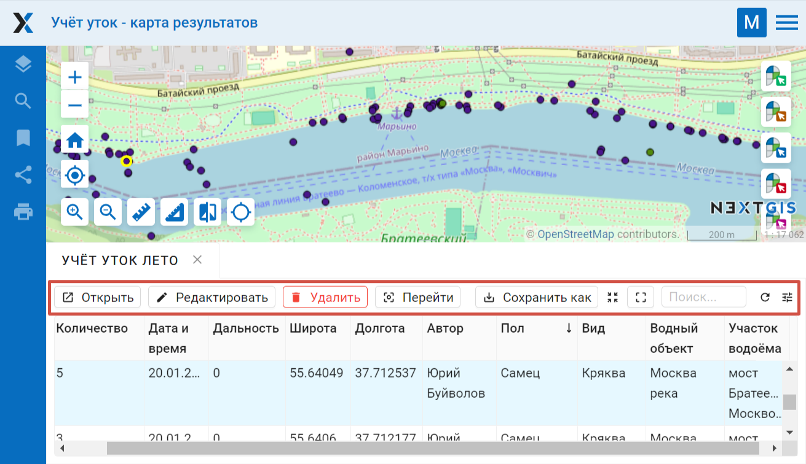
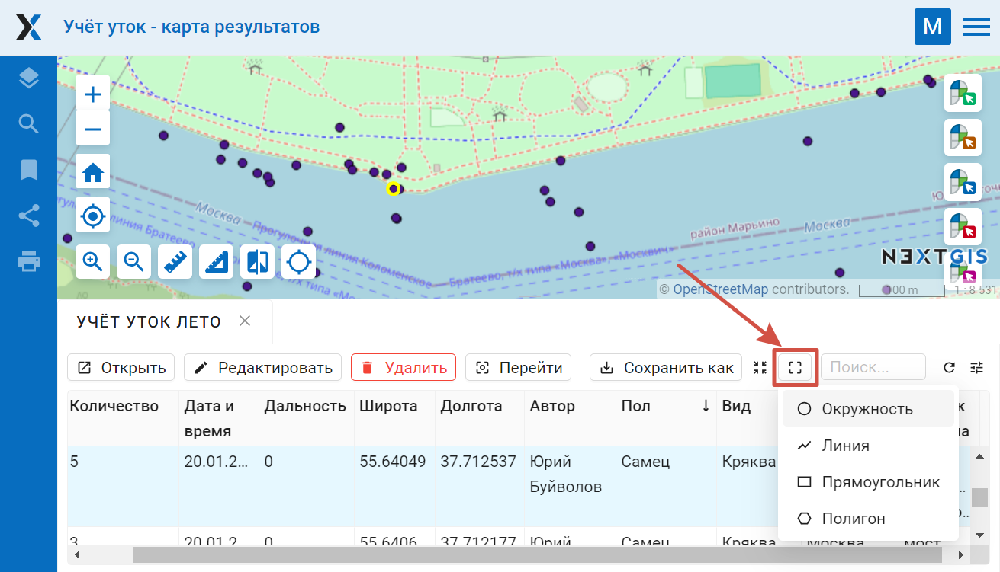
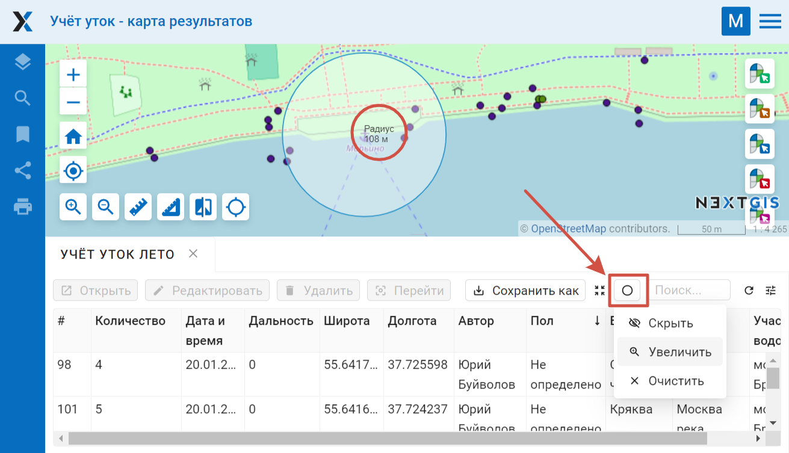

Работа с таблицей объектов
===========================

Для того, чтобы произвести действия над таблицей объектов, необходимо авторизоваться.

Таблицу объектов можно открыть на отдельной странице или на веб-карте.

.. _ngw_feature_table_blank:

Таблица объектов на отдельной странице
---------------------------------------

Чтобы открыть таблицу объектов, перейдите к группе ресурсов, где находится нужный слой, и нажать на значок таблицы напротив векторного слоя.
Другой способ - выбрать этот слой, а затем в блоке операций выбрать действие над слоем - "Таблица объектов".

Сформированная таблица объектов позволяет выполнить следующие операции (см. :numref:`ngweb_operations_on_writing_in_object_table`):

1. Открыть выделенную запись
2. Редактировать запись (в том числе редактировать на новой странице)
3. Удалить запись
4. Сохранить как (доступен расширенный и быстрый экспорт)
5. Воспользоваться строкой Поиска
6. Обновить таблицу
7. Открыть настройки таблицы

   Инструменты таблицы объектов

.. _ngw_feature_table_webmap:

Таблица объектов на веб-карте
--------------------------------

Формирование таблицы объектов можно выполнить другим способом: с веб-карты, на которую добавлен слой.

   Операция открытия веб-карты из группы ресурсов

   Операция открытия веб-карты со страницы ресурса
   
Для формирования таблицы объектов необходимо выделить нужный слой карты в дереве слоев, после чего 
в меню слоя выбрать "Таблица объектов" :numref:`ngweb_admin_map_and_tree_layers_upload`:

.. figure:: _static/map_and_tree_layers_rus_3.png
   :name: ngweb_admin_map_and_tree_layers_upload
   :align: center
   :width: 20cm

   Карта и дерево слоев
 
Cформируется таблица объектов, которая позволяет выполнять следующие операции  :numref:`ngweb_admin_table_objects2_upload`:

1. Открыть выделенную запись
2. Редактировать запись 
3. Удалить запись
4. Перейти (при нажатии на кнопку происходит переход к выбранному объекту на карте)
5. Сохранить как (доступен расширенный и быстрый экспорт)
6. Приблизить к найденным объектам
7. Отфильтровать объекты по местности
8. Воспользоваться строкой Поиска
9. Обновить таблицу
10. Открыть настройки таблицы
 

   Операции над записью в таблице объектов

Также можно `отредактировать атрибуты <https://docs.nextgis.ru/docs_ngweb/source/edit_resource.html#ngw-attributes-edit>`_ векторного слоя, формирующие таблицу объектов.

.. _ngw_feature_table_filter_area:

Фильтрация объектов по области карты
--------------------------------------

В NextGIS Web предусмотрена возможность отфильтровать объекты, входящие в выделенную область карты. Обозначить границы области можно, нарисовав их непосредственно на карте.

Откройте таблицу объектов и нажмите на кнопку с пунктирной рамкой. В выпадающем меню выберите форму геометрии очертаний области фильтрации:

* окружность (задаётся двумя кликами по карте, первый клик обозначит центр окружности, второй - желаемый радиус, он будет показываться в метрах)
* линия (отфильтрованы будут все объекты, пересекаемые заданной линией)
* прямоугольник (задаётся двумя вершинами)
* произвольный полигон (каждый клик создаёт вершину полигона, охватываемая им область высветляется; чтобы завершить рисование, кликните в точке дважды, полигон замкнётся автоматически)

   Выбор геометрии области фильтрации

Теперь таблица объектов содержит только те из них, которые попадают в выделенную область. На кнопке будет отображена форма геометрии выделения. В выпадающем меню появятся следующие пункты:

* Скрыть/Показать границы и заливку выделенной области
* Увеличить до выделенной области
* Очистить фильтр

   Действия с фильтром

Отфильтрованные объекты можно экспортировать в большинстве распространенных форматов геоданных. В меню кнопки **Сохранить как** можно выбрать быстрый экспорт с настройками по умолчанию или расширенный экспорт, где можно задать пользовательские настройки (подробнее см. ниже).

