.. _form:

Form elements
==============

In the form editing interface on the left there is a toolbar that contains all the elements that can be added to a form. 

.. todo::  Hover over an element to see tooltip with its description.

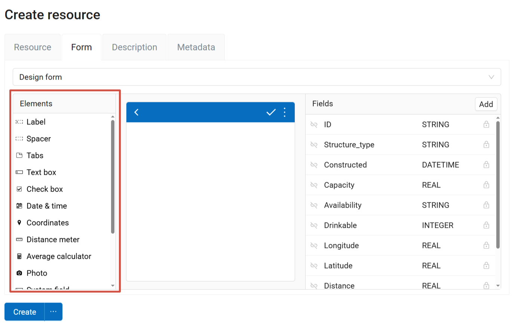

   Elements panel

To create a new form in the online builder, drag the elements from the list on the left to the middle field representing the device screen. 

You'll find detailed descriptions of all the elements below. 

Form design elements:

* `Label <https://docs.nextgis.com/docs_ngweb/source/form_elements.html#form-label>`_- text of the form interface: field names, instructions on entering data etc;
* `Spacer <https://docs.nextgis.com/docs_ngweb/source/form_elements.html#form-spacer>`_ - a blank space that separates parts of the form;
* `Tabs <https://docs.nextgis.com/docs_ngweb/source/form_elements.html#form-tabs>`_ - instead of scrolling up and down a single long form, you can divide it into tabs and switch between them.

Data entering elements:

* `Text box <https://docs.nextgis.com/docs_ngweb/source/form_elements.html#text>`_;
* `Check box <https://docs.nextgis.com/docs_ngweb/source/form_elements.html#checkbox>`_;
* `Date and time <https://docs.nextgis.com/docs_ngweb/source/form_elements.html#datetime>`_;
* `Coordinates <https://docs.nextgis.com/docs_ngweb/source/form_elements.html#coordinates>`_;
* `Distance meter <https://docs.nextgis.com/docs_ngweb/source/form_elements.html#distance>`_;
* `Average calculator <https://docs.nextgis.com/docs_ngweb/source/form_elements.html#average>`_;
* `Photo <https://docs.nextgis.com/docs_ngweb/source/form_elements.html#photo>`_;
* `System field <https://docs.nextgis.com/docs_ngweb/source/form_elements.html#sytem>`_;
* `Dropdown <https://docs.nextgis.com/docs_ngweb/source/form_elements.html#dropdown>`_;
* `Dual dropdown <https://docs.nextgis.com/docs_ngweb/source/form_elements.html#dual_dropdown>`_;
* `Radio group <https://docs.nextgis.com/docs_ngweb/source/form_elements.html#radio>`_;
* `Dependent dropdowns <https://docs.nextgis.com/docs_ngweb/source/form_elements.html#dependet_dropdown>`_.

.. _label:

Label
-------

This element allows you to add text to the form interface: field names, instructions on entering data etc.

Properties:

* **Label** - edit the text displayed on the form.

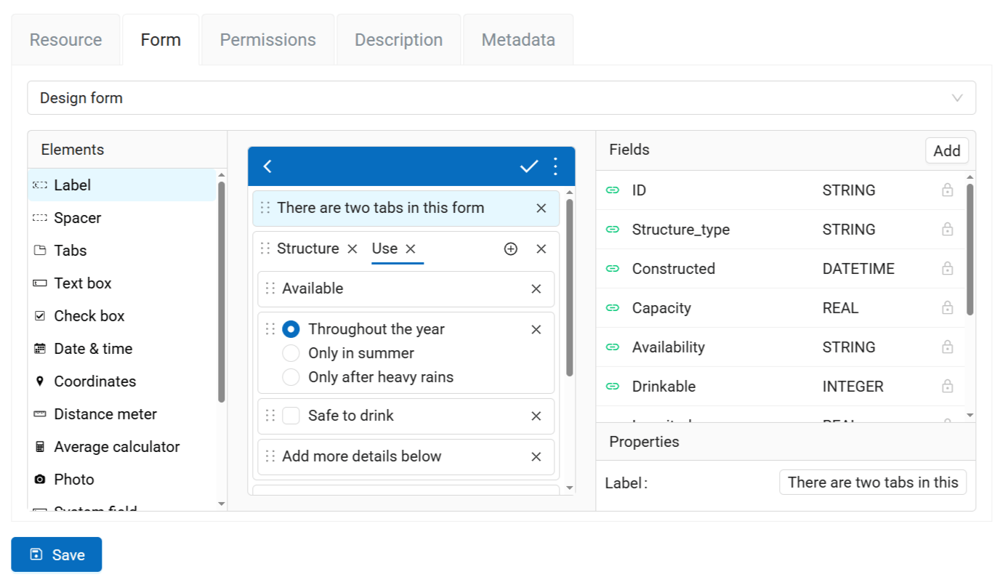

   Label properties

Label is not linked to any field of the layer.

.. _spacer:

Spacer
------------

Spacer allows you to add blank spaces between parts of the form.

.. todo:: _static/form_with_spacers_en.png
   :name: form_with_spacers_pic
   :align: center
   :width: 7cm

   Form with spaces

.. _tabs:

Tabs
-------

Tabs are used to group other elements. You can add multiple tab sets to a form and manage the number of tabs in each of them.

In a form, some elements can be in tabs while others are outside tab sets.

To add a tab set, drag "Tabs" element to the form. 

In the "Properties" section you can set the name of each tab. To add a new tab, click on the |button_plus_layer| symbol. To delete a tab, click on the X next to its name.

.. |button_plus_layer| image:: _static/button_plus_layer.png
   :width: 6mm

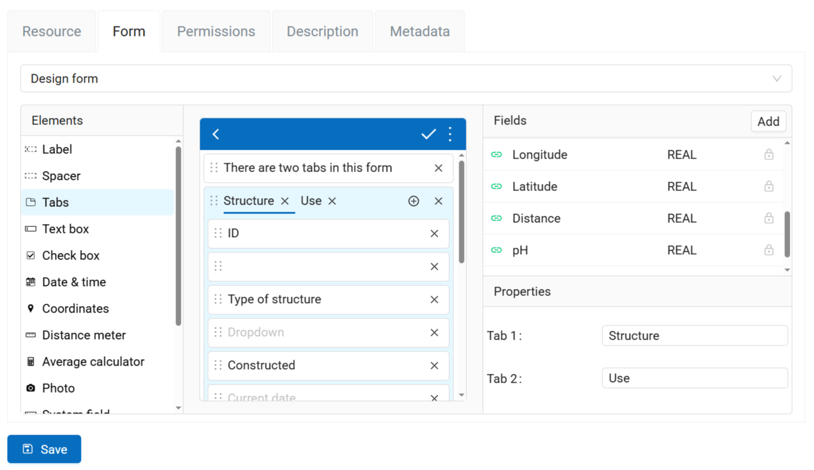

   Properties of the "Tabs" element

The current tab is underlined in blue.

.. _add_to_tab:

Adding elements to tabs
~~~~~~~~~~~~~~~~~~~~~~~~~~~~~~~~~

To add an element to a tab, drag it to it. The element will be added to the active tab marked in blue. Make sure that the element is within the tab set. 

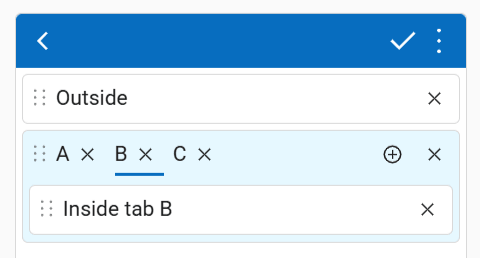

   Adding elements to a tab and outside the tab set

A form can have multiple tab sets as well as elements outside sets.

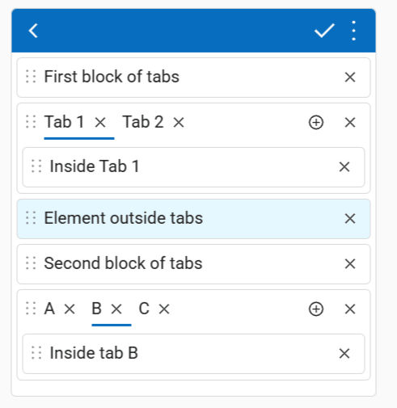

   Possible placement of elements and tabs

Elements placed in the tab that is not currently active are hidden. To edit them, switch to that tab.

.. _text:

Text edit
--------------

An element for entering simple text or numbers.

Properties:

* **Field** - select the field of the vector layer where the data from this element is to be recorded.
* **Max. lines** - Maximum number of lines for this text field. Integer, between 1 and 256.
* **Initial value** - the text added to the field by default.
* **Remember last value** - if activated, inserts the value added for the previous feature.

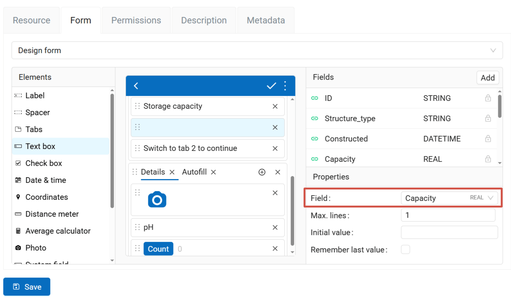

   Text box used for entering numbers, linked to a field of REAL type

.. _checkbox:

Checkbox
------------

An element which allows user to pick from two values: true or false.

Properties:

* **Field** - select the field of the vector layer where the data from this element is to be recorded.
* **Label** - text displayed next to the check box.
* **Initial value** - if this box is checked, the check box in the form is checked by default.
* **Remember last value** - if activated, inserts the value added for the previous feature.

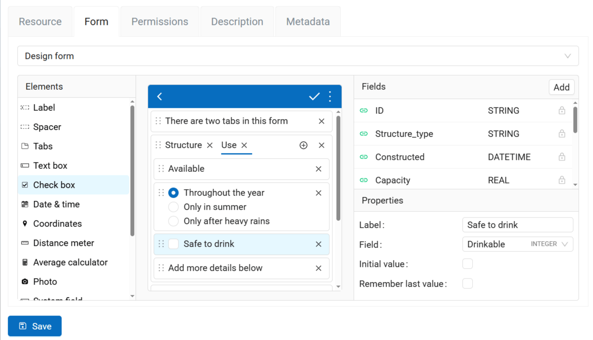

   Check box set to default value "false"

.. _datetime:

Date and time
------------

This elements allows to enter date, time or date+time.

Properties:

* **Field** - select the field of the vector layer where the data from this element is to be recorded.
* **Type** - date only, time only or date and time.
* **Initial value** - by default the Date and Time field enters the current date and time. You can set a different initial value using the calendar widget. 
* **Remember last value** - if activated, inserts the value added for the previous feature.

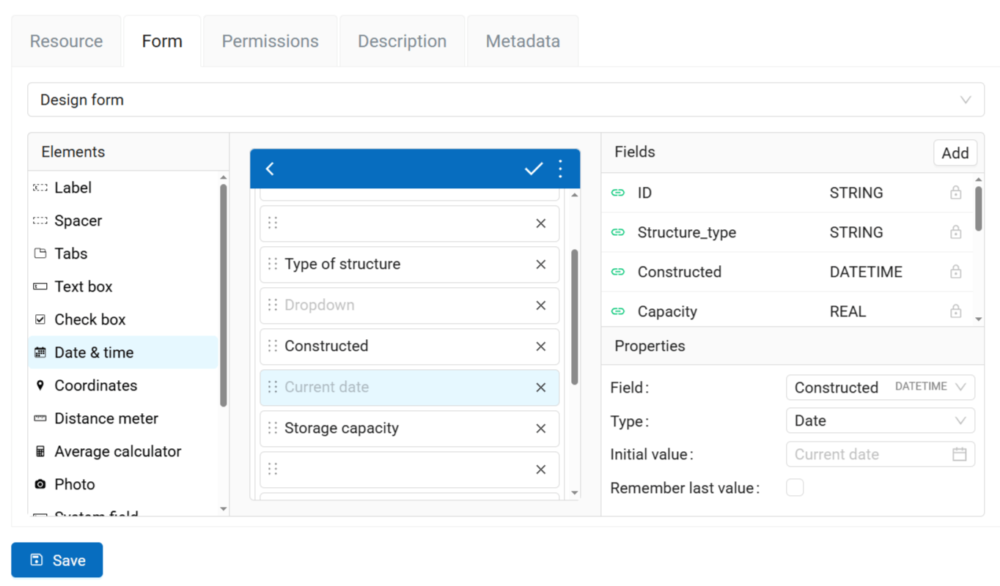

   Date & time element and its properties

.. _coordinates:

Coordinates
-----------

This element automatically saves current position of the data collector in string format.

Contains two fields: latitude and longitude.

Properties:

* **Longitude field** - select the field of the vector layer where the longitude data is to be recorded.
* **Latitude field** - select the field of the vector layer where the latitude data is to be recorded.
* **Hide** - the element will not be visible in the form, but the coordinates will be saved anyway.

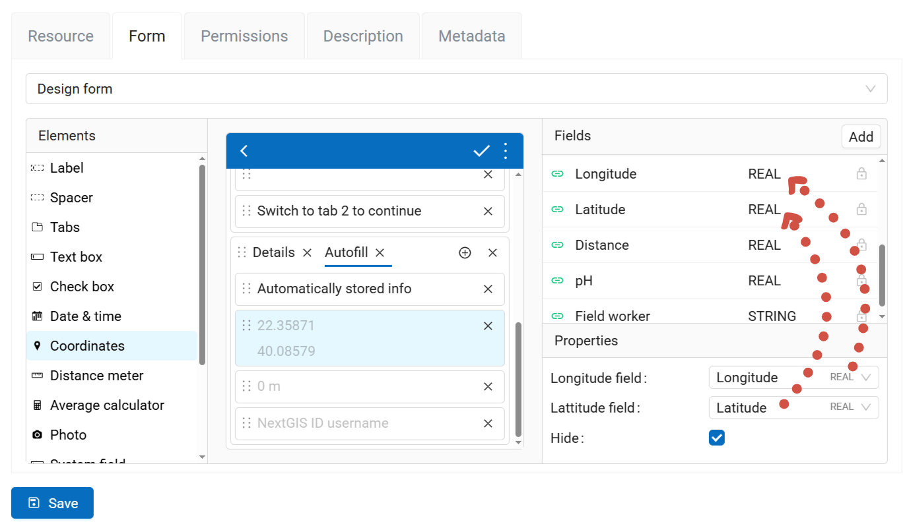

   Fields where coordinates are recorded

.. _distance:

Distance meter
--------------

This element automatically measures distance between data collector and the entered point. To be able to calculate distance, enable geolocation.

Properties:

* **Field** - select the layer field to store the data from this element.

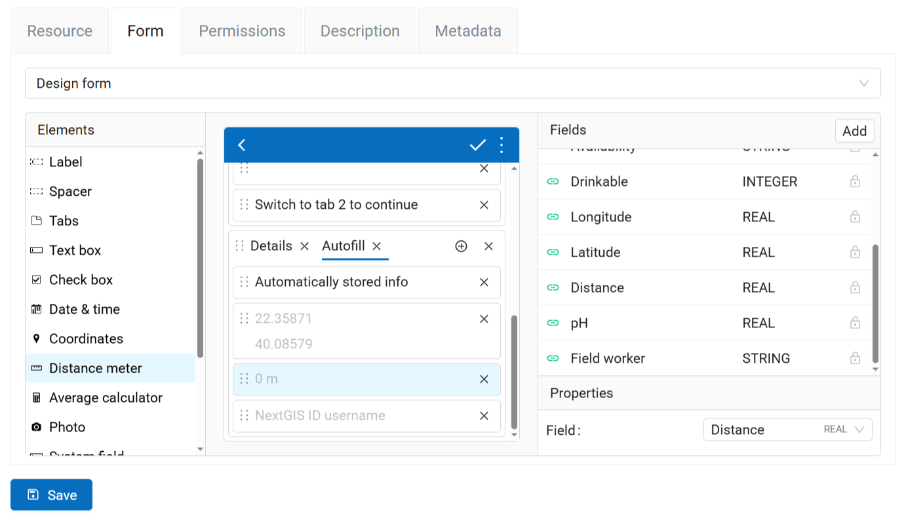

   Properties of the "Distance meter" element

.. _average:

Average calculator
------------------

An element which calculates the average value from some amount of entered values. For example, you can measure the trunk width of ten trees growing in the area, enter these numbers and click **Count**. The calculated average is recorded to the layer field.

Includes an interactive **Count** button.

Properties:

* **Field** - select the field of the vector layer where the data from this element is to be recorded.
* **Number of samples** - how many values should the data collector enter to calculate an average value.

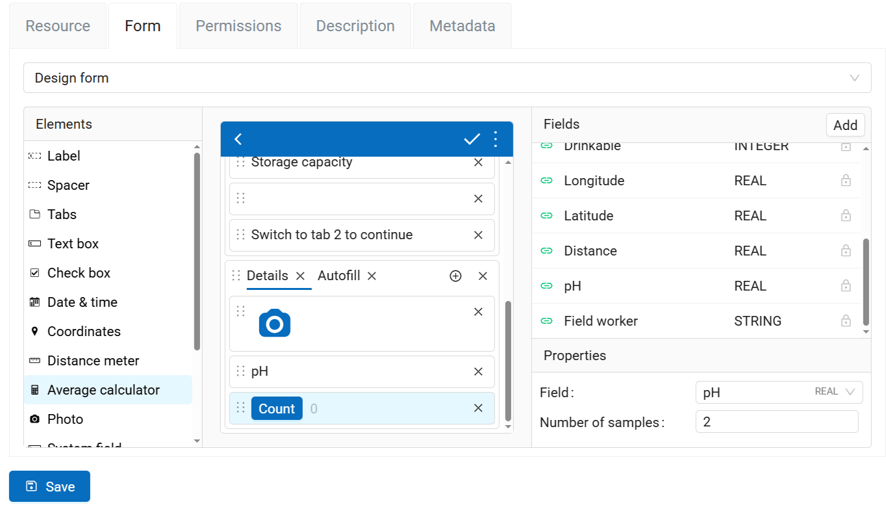

   Average calculator

.. _photo:

Photo
-----

An element which allows to take photos with the camera of the device or to add them from the gallery.

Properties:

* **Max number** - maximum number of photos that can be added to a feature, (1-20).
* **Comment** - text under the added photo(s).

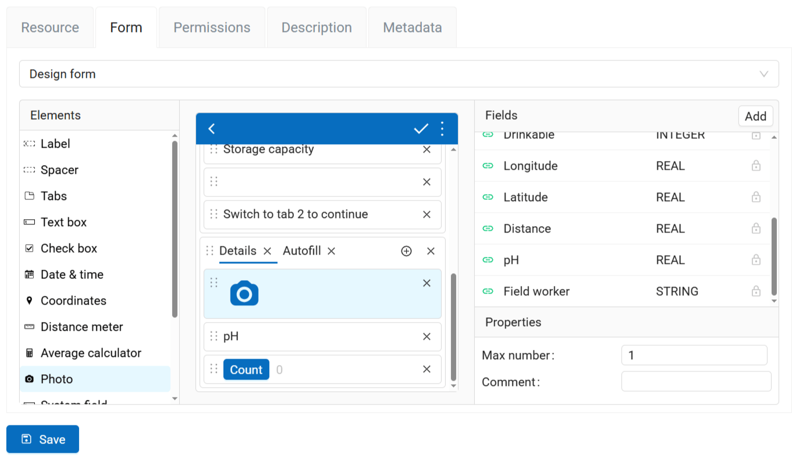

   Properties of the "Photo" element

.. _sytem:

System field
--------------

This element allows to automatically record the NextGIS ID or username of the user editing the layer.

Properties:

* **Field** - select the field of the vector layer where the data from this element is to be recorded.
* **Type** - you can store the username chosen either in NextGIS ID or within Web GIS.

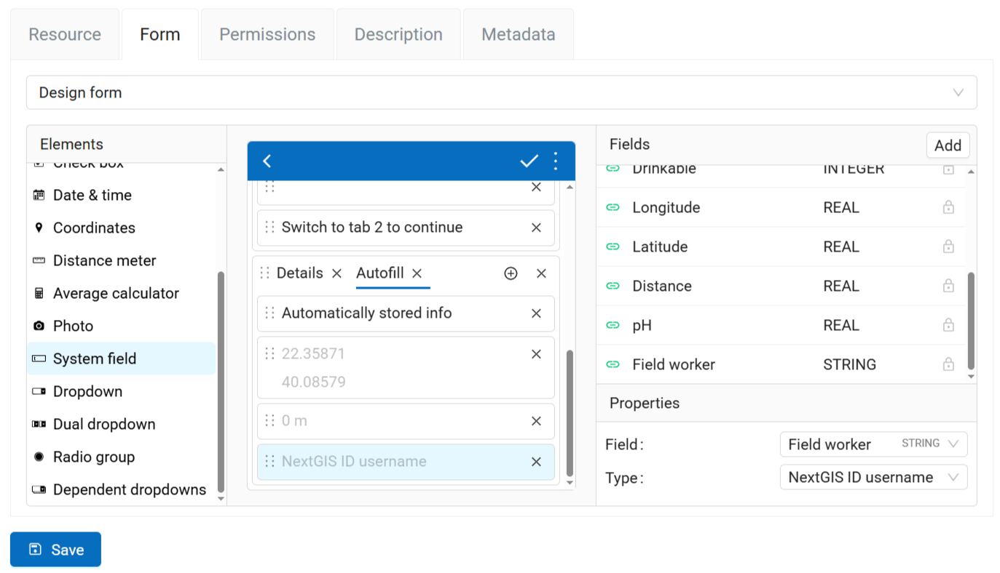

   Properties of the System field

.. _dropdown:

Dropdown
----------

A dropdown menu to select one value from a predetermined list.

Properties:

* **Field** - select the field of the vector layer where the data from this element is to be recorded.
* **Remember last value** - if activated, inserts the value added for the previous feature.
* **Enable search** - user can start typing to search in available options.
* **Allow free input** - data collector can enter text that is not in the list of options.
* **Options** - a list of possible field values. Click **Edit** to enter the values.

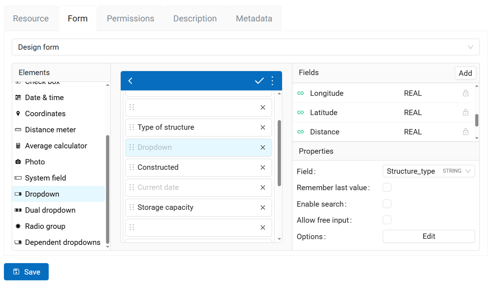

   Properties of the "Dropdown" element

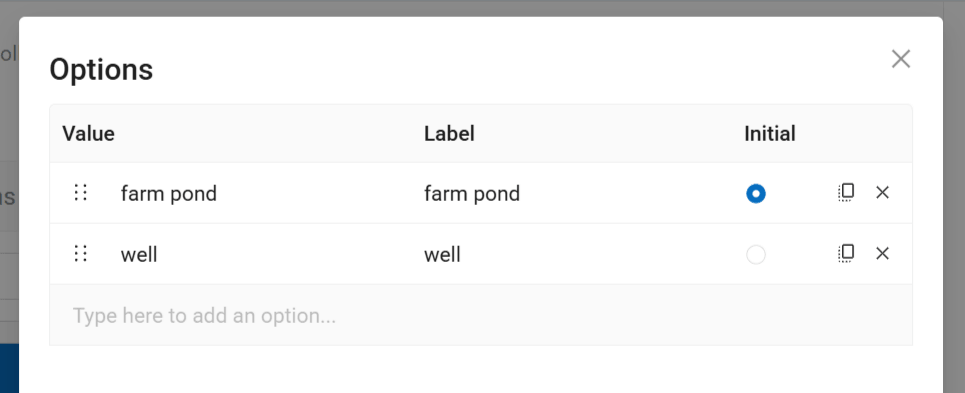

   Editing a list

Options are entered as a table.

To **add an option** type in the value that is stored in the layer attribute and the label displayed in the form dropdown (can be the same as the value).

.. important:: Make sure to fill in both columns, or you won't be able to save the form.

The right end of the row has the following buttons:

* Initial - set this option as the default;
* Clone - makes a copy of the row, it's handy if you only need to modify a part of the value;
* Delete.

.. _dual_dropdown:

Dual dropdown
----------------

Dropdown list with predetermined items split into two parts. For instance, showing a place name in two different languages.

Properties:

* **Field** - select the field of the vector layer where the data from this element is to be recorded.
* **Remember last value** - if activated, inserts the value added for the previous feature.
* **First label** - text displaed above the left part of the dropdown.
* **Second label** - text displayed above the second part of the dropdown.
* **Options** - a list of possible field values. Click **Edit** to enter the values.

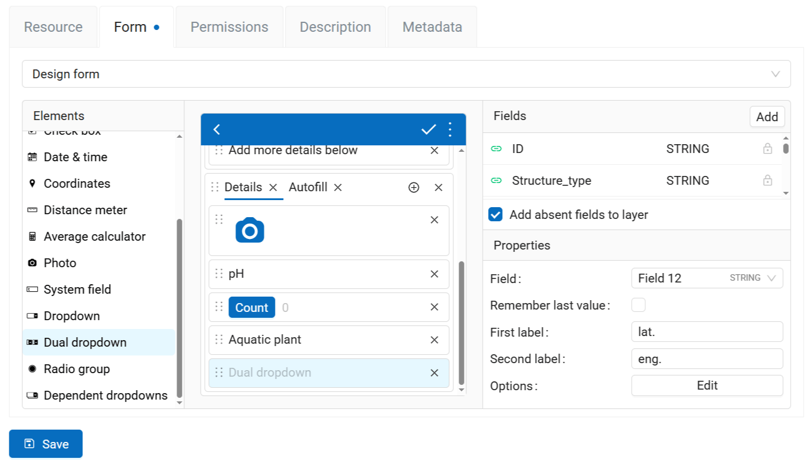

   Properties of the "Dual dropdown" element

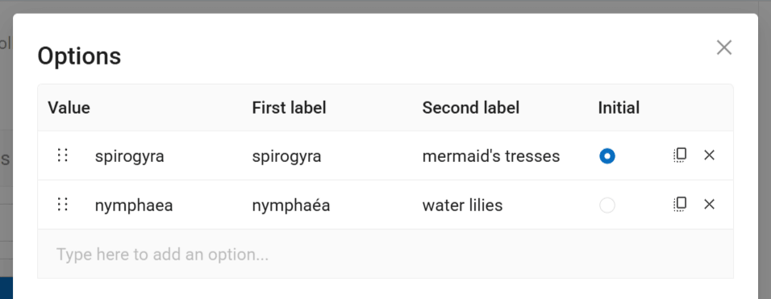

   Modifying items in a dual dropdown

Options are entered as a table.

To **add an option** type in the value that is stored in the layer attribute and two labels displayed in the form dropdown.

.. important:: Make sure to fill in all the columns, or you won't be able to save the form.

The right end of the row has the following buttons:

* Initial - set this option as the default;
* Clone - makes a copy of the row, it's handy if you only need to modify a part of the value;
* Delete.

.. _radio:

Radio group
-----------

A list of predetermined values (data collector chooses only one item from the list). You can see all the options of the radiogroup, unlike the dropdown that you need to click to view the list.

Properties:

* **Field** - select the field of the vector layer where the data from this element is to be recorded.
* **Remember last value** - if activated, inserts the value added for the previous feature.
* **Options** - a list of possible field values. Click **Edit** to enter the values.

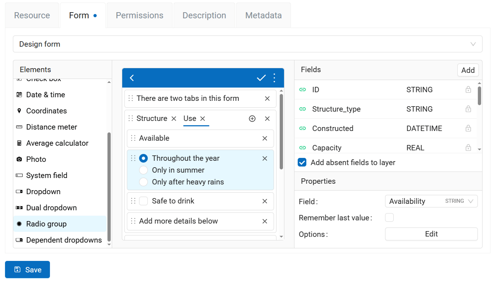

   Properties of the "Radiogroup" element

Options are entered as a table.

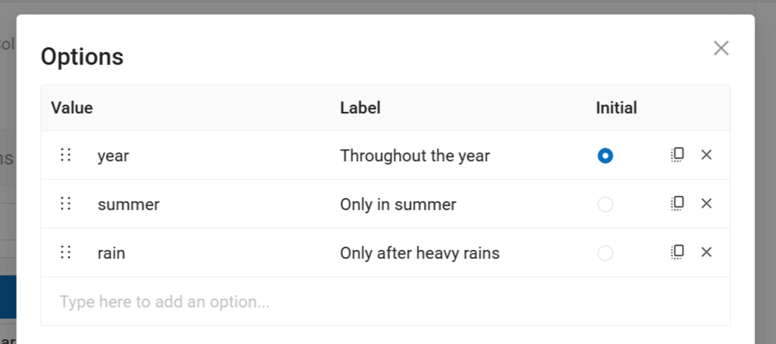

   Editing radiogroup

To **add an option** type in the value that is stored in the layer attribute and the label displayed in the form dropdown (can be the same as the value).

.. important:: Make sure to fill in both columns, or you won't be able to save the form.

The right end of the row has the following buttons:

* Initial - set this option as the default;
* Clone - makes a copy of the row, it's handy if you only need to modify a part of the value;
* Delete.

.. _dependet_dropdown:

Dependent dropdowns
-------------------

A pair of drop-down lists with predefined items.  The item list of the secondary dropdown (bottom) depends on the items of the primary dropdown (top).

**Example:**

* Main list - a list of regions (1. Centre-Val de Loire; 2.  Grand Est)
* Dependent list - departments of the regions (1.1. Eure-et-Loir, 1.2. Indre; 2.1. Ardennes, 2.2. Marne)

Properties:

* **Primary field** - select the field of the vector layer where the data from the first dropdown is to be recorded.
* **Secondary field** - select the field of the vector layer where the data from the second dropdown is to be recorded.
* **Remember last value** - if activated, inserts the value added for the previous feature.
* **Options** - a list of possible field values. Click **Edit** to enter the values.

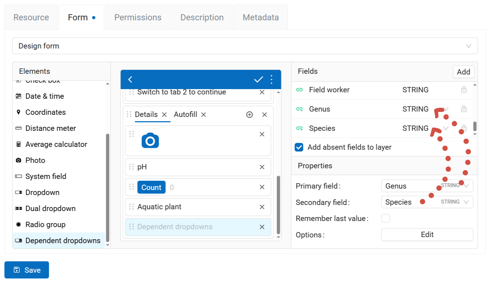

   Properties of the "Dependent dropdowns" element

Options are entered as a table.

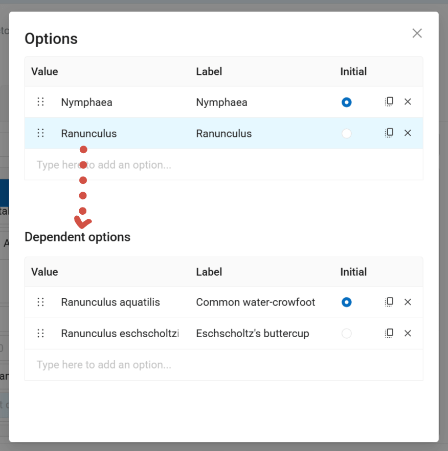

   Editing the secondary list of the dropdowns

To **add an option** type in the value that is stored in the layer attribute and the label displayed in the form dropdown (can be the same as the value).

.. important:: Make sure to fill in both columns, or you won't be able to save the form.

The right end of the row has the following buttons:

* Initial - set this option as the default;
* Clone - makes a copy of the row, it's handy if you only need to modify a part of the value;
* Delete.

