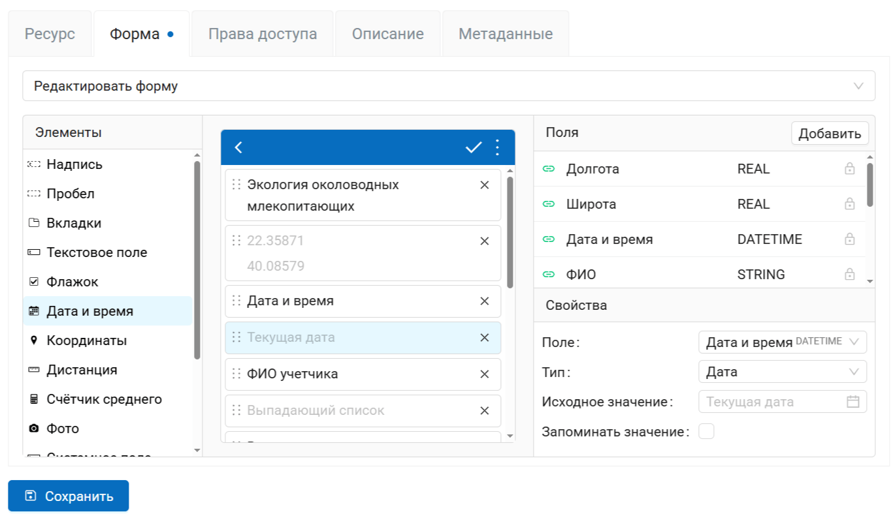
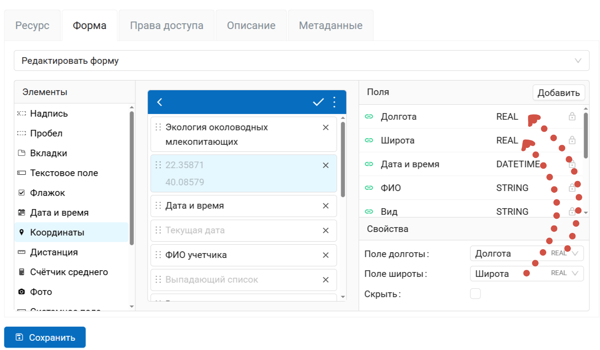
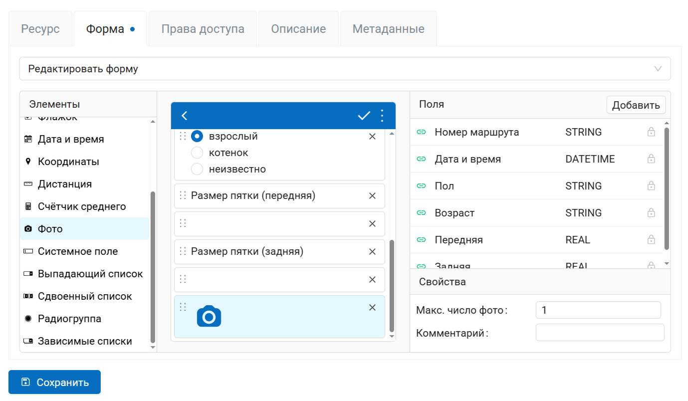
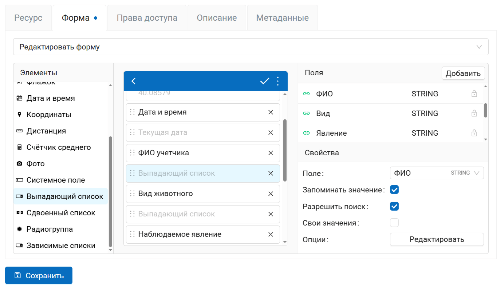
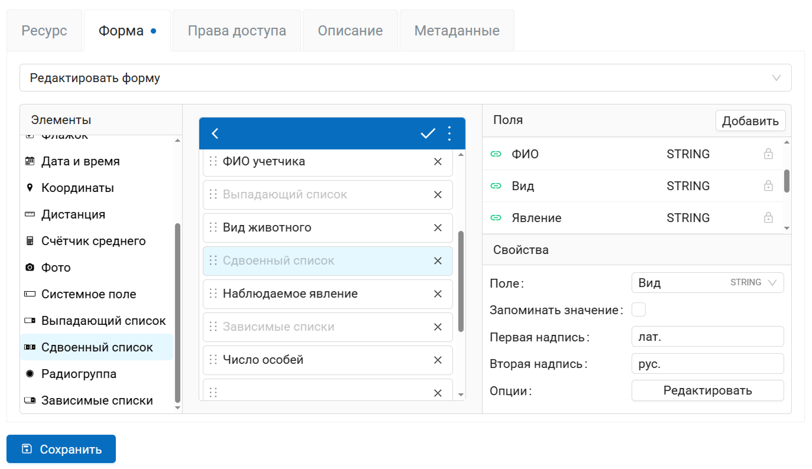
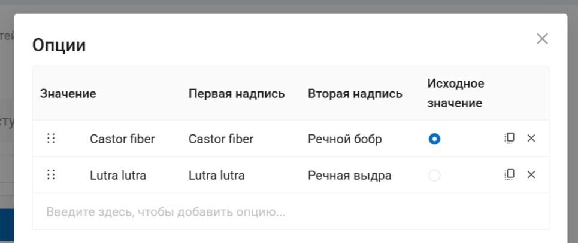
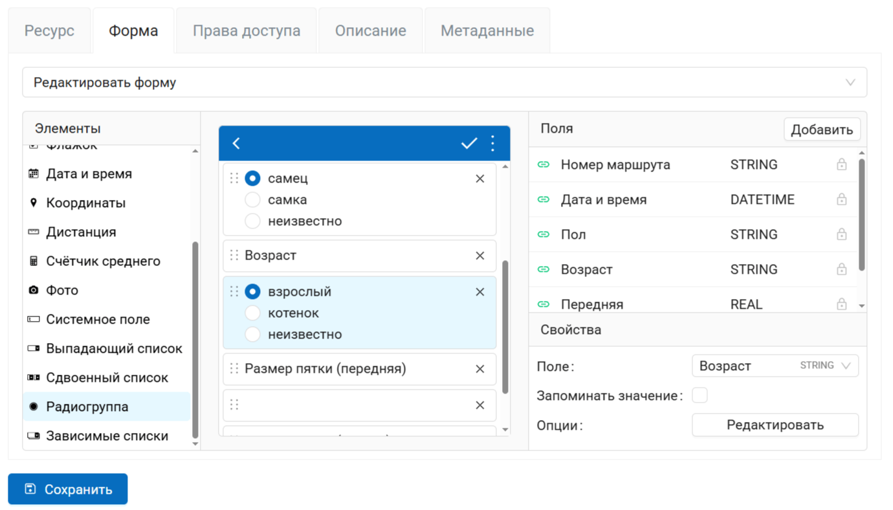
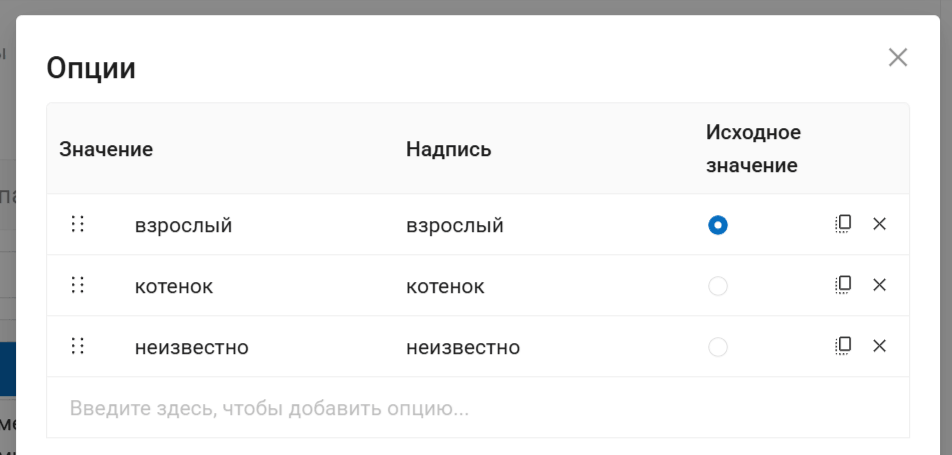
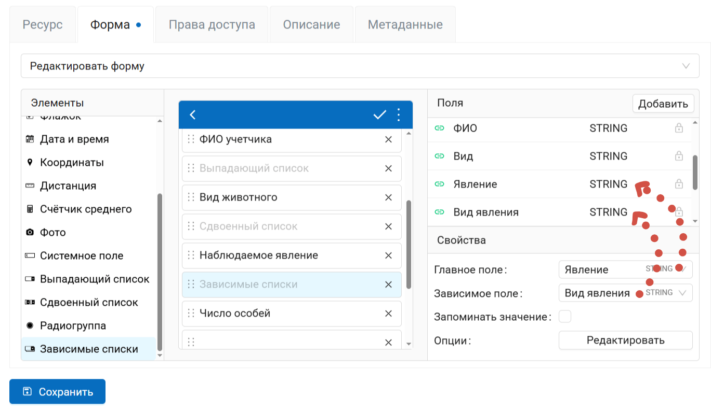
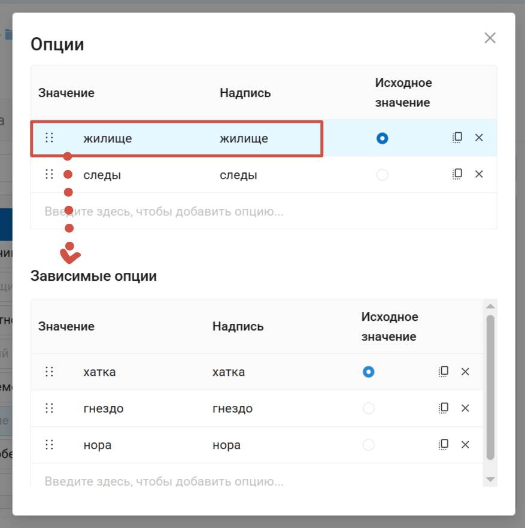

.. _form:

Элементы формы
==============

В констуркторе формы слева находится панель, которая содержит в себе список всех доступных элементов которые можно создать на форме. 

.. todo:: Наведите курсор на элемент чтобы увидеть его описание во всплывающем сообщении.

.. todo:: _static/form_form_elements_ru.png
   :name: form_form_elements_pic
   :align: center
   :width: 20cm

   Панель элементов

Чтобы *добавить элемент* на форму - начните перетаскивать его курсором с зажатой левой кнопкой мыши в центральную часть конструктора - экран устройства. Альтернативно можно быстро добавить элемент в конец формы один раз щёлкнув по нему левой кнопкой мыши с зажатой клавишей клавиатуры Ctrl.

Ниже каждый из элементов описывается подробно. 

Элементы оформления формы:

* `Надпись <https://docs.nextgis.ru/docs_ngweb/source/form_elements.html#form-label>`_- пояснительный текст: название поля, инструкции по его заполнению и т.п.;
* `Пробел <https://docs.nextgis.ru/docs_ngweb/source/form_elements.html#form-void>`_ - пустое место, отделяющее один раздел формы от другого;
* `Вкладки <https://docs.nextgis.ru/docs_ngweb/source/form_elements.html#form-tabs>`_ - вместо прокручивания одной длинной страницы можно разделить элементы большой формы на вкладки, между которыми можно переключаться.

Элементы ввода данных:

* `Текстовое поле <https://docs.nextgis.ru/docs_ngweb/source/form_elements.html#text>`_;
* `Флажок <https://docs.nextgis.ru/docs_ngweb/source/form_elements.html#checkbox>`_;
* `Дата и время <https://docs.nextgis.ru/docs_ngweb/source/form_elements.html#datetime>`_;
* `Координаты <https://docs.nextgis.ru/docs_ngweb/source/form_elements.html#coordinates>`_;
* `Дистанция <https://docs.nextgis.ru/docs_ngweb/source/form_elements.html#distance>`_;
* `Счётчик среднего <https://docs.nextgis.ru/docs_ngweb/source/form_elements.html#average>`_;
* `Фото <https://docs.nextgis.ru/docs_ngweb/source/form_elements.html#photo>`_;
* `Системное поле <https://docs.nextgis.ru/docs_ngweb/source/form_elements.html#sytem>`_;
* `Выпадающий список <https://docs.nextgis.ru/docs_ngweb/source/form_elements.html#combobox>`_;
* `Сдвоенный список <https://docs.nextgis.ru/docs_ngweb/source/form_elements.html#split_cb>`_;
* `Радиогруппа <https://docs.nextgis.ru/docs_ngweb/source/form_elements.html#radio>`_;
* `Зависимые списки <https://docs.nextgis.ru/docs_ngweb/source/form_elements.html#dependet_cb>`_.

.. _label:

Надпись
-------

Позволяет добавить произвольный пояснительный текст: название поля, инструкцию по вводу данных и т.п.

Свойства:

* **Текст** - можно отредактировать отображаемый текст.

.. _void:

Пробел
------

Добавляет пустое пространство для создания отступов между элементами формы.

.. todo:: _static/form_with_voids_ru.png
   :name: form_with_voids_pic
   :align: center
   :width: 7cm

   Форма с отступами

.. _tabs:

Вкладки
-------

Вкладки используются для группирования других элементов. Можно добавлять в форму несколько комплектов вкладок одновременно и регулировать количество вкладок в каждом комплекте.

Форма может одновременно содержать элементы вне вкладок и распределенные по вкладкам.

Чтобы добавить комплект вкладок, перетащите элемент "Вкладки" в форму. Справа в панели "Свойства" появятся свойства этого комплекта. 

С помощью этой панели можно **переключаться между вкладками** внутри комплекта, а также вызвать диалог настроек вкладок.

.. todo:: _static/form_folders_current_ru.png
   :name: folder_current_pic
   :align: center
   :width: 20cm

   Поле переключения между вкладками. Текущая вкладка 1 подчеркнута голубым в форме

.. todo:: _static/form_folders_properties_ru.png
   :name: folder_properties_pic
   :align: center
   :width: 20cm

   Редактирование комплекта вкладок

Окно редактирования позволяет:

* Изменять названия вкладок (по умолчанию "Вкладка" + номер);
* Добавлять новые вкладки в набор (для этого впишите новое название в желтое поле в конце);
* Удалять вкладки.

.. _add_to_tab:

Добавление элементов во вкладки
~~~~~~~~~~~~~~~~~~~~~~~~~~~~~~~~~

Чтобы добавить элемент во вкладку, перетащите его. Элемент добавится в ту вкладку, которая в настоящий момент активна (выделена синим). Следите затем, чтобы новый элемент был размещен внутри элемента блока вкладок. Границы элемента показаны красным пунктиром, если нажать на блок вкладок.

.. todo:: _static/form_folders_insideout_ru.png
   :name: folders_insideout_pic
   :align: center
   :width: 10cm

   Добавление элемента формы внутрь вкладки и снаружи

В одной форме может быть несколько блоков вкладок, а также элементы, расположенные вне вкладок.

.. todo:: _static/form_folders_example_ru.png
   :name: folders_example_pic
   :align: center
   :width: 10cm

   Возможные способы размещения элементов и вкладок.

Элементы, расположенные в неактивной вкладке, скрываются. Чтобы редактировать их, переключитесь на нужную вкладку в панели "Свойства".

При удалении блока вкладок будут удалены также все элементы, находящиеся внутри каждой из вкладок. Чтобы избежать случайного удаления, программа запросит подтверждение.

.. todo:: _static/form_folders_del_confirm_ru.png
   :name: folders_del_confirm_pic
   :align: center
   :width: 10cm
   :alt: Диалог подтверждения удаления блока вкладок

   Диалог подтверждения удаления блока вкладок

.. _text:

Текстовое поле
--------------

Элемент для редактирования текста или чисел.

Свойства:

* **Поле** - в какое поле слоя будут сохраняться данные из этого элемента формы.
* **Макс. число строк** - максимальное число строк для данного текстового поля. Целое число в диапазоне между 1 и 256.
* **Исходное значение** - исходный текст, отображающийся в поле.
* **Запоминать значение** - если активировать, подставляет предыдущее введённое значение при создании нового объекта.

* **Логин NextGIS ID**. Это текстовое поле будет сохранять логин NextGIS ID под которым авторизовался сборщик данных в процессе сбора данных. При выборе этой опции другие свойства элемента, кроме выбора поля, становятся недоступны.
* **Логин NextGIS Web**. Это текстовое поле будет сохранять логин NextGIS Web под которым авторизовался сборщик данных в процессе сбора данных. При выборе этой опции другие свойства элемента, кроме выбора поля, становятся недоступны.

.. todo:: **Только цифры**. Через этот элемент можно будет вводить только числа.

.. todo:: _static/form_text_ru.png
   :name: form_text_pic
   :align: center
   :width: 20cm

   Три текстовых поля в форме: логин NextGIS ID, логин NextGIS Web и обычный текст

.. _checkbox:

Флажок
------

Элемент, который позволяет сборщику данных выбирать одно из двух значений: истина или ложь.

Свойства:

* **Поле** - в какое поле слоя будут сохраняться данные из этого элемента формы.
* **Надпись** - текст, отображаемый рядом с флажком.
* **Исходное значение** - если поставить галочку в этом свойстве, то по умолчанию она будет стоять в форме.
* **Запоминать значение** - если активировать, подставляет предыдущее введённое значение при создании нового объекта.

.. todo:: _static/form_checkbox_ru.png
   :name: form_checkbox_pic
   :align: center
   :width: 20cm

   Флажок с установленным значением по умолчанию "истина"

.. _datetime:

Дата и время
------------

Элемент, позволяющий выбрать дату, время или дату + время.

Свойства:

* **Поле** - в какое поле слоя будут сохраняться данные из этого элемента формы.
* **Тип** - только дата, только время или дата + время.
* **Исходное значение** - по умолчанию в поде "дата и время" подставляется текущая дата. Можно задать другое исходное значение поля с помощью календаря. 
* **Запоминать значение** - если активировать, подставляет предыдущее введённое значение при создании нового объекта.

   Элемент "Дата и время" и его свойства

.. _coordinates:

Координаты
----------

Элемент, автоматически сохраняющий текущее местоположение сборщика данных в текстовом формате.

Содержит два поля: долгота и широта.

Свойства элемента:

* **Поле долготы** - в какое поле слоя будет сохраняться долгота.
* **Поле широты** - в какое поле слоя будет сохраняться широта.
* **Скрыть** - элемент не будет показан в форме, но координаты будут всё равно сохраняться.

   Поля, в которые сохраняются координаты

.. _distance:

Дистанция
---------

Элемент, автоматически измеряющий расстояние между сборщиком данных и указанной точкой.

Свойства:

* **Поле**. Позволяет выбрать, в какое поле слоя будут сохраняться данные из этого элемента формы.

.. _average:

Счётчик среднего
----------------

Элемент, вычисляющий среднее значение от введённых значений. Содержит интерактивный элемент, кнопку "Посчитать".

Свойства:

* **Поле** - в какое поле слоя будут сохраняться данные из этого элемента формы.
* **Количество измерений** - сколько значений сборщик данных должен внести, для того чтобы посчиталось среднее значение.

.. todo:: _static/form_average_ru.png
   :name: form_average_pic
   :align: center
   :width: 20cm

   Элемент "Счетчик среднего"

.. _photo:

Фото
----

Элемент, позволяющий сборщику данных делать фотографии или выбирать их из галерии.

Свойства:

* **Макс. число фото** - максимальное число фотографий, которое можно добавить к объекту. Диапазон от 1 до 20.
* **Комментарий** - комментарий под фотографиями.

   Свойства элемента "Фото"

.. _sytem:

Системное поле
--------------

Позволяет автоматически сохранять имя пользователя, вносящего изменения в слой.

Свойства:

* **Поле** - в какое поле слоя будут сохраняться данные из этого элемента формы.
* **Тип** - можно выбрать, сохранять имя пользователя NextGIS ID или имя пользователя, заданное внутри Веб ГИС.

.. _combobox:

Выпадающий список
------------------

Выпадающий список значений (сборщик данных может выбрать только одно значение).

Свойства:

* **Поле** - в какое поле слоя будут сохраняться данные из этого элемента формы.
* **Запоминать значение** - если активировать, подставляет предыдущее введённое значение при создании нового объекта.
* **Разрешить поиск** - во время набора текста в списке будут отображаться доступные варианты.
* **Свои значения** - сборщик данных может добавлять свои значения в список.
* **Опции** - список возможных значений, нажмите **Редактировать**, чтобы ввести нужные значения.

   Свойства элемента "Выпадающий список"

.. todo:: _static/form_edit_combobox_ru.png
   :name: form_edit_combobox_pic
   :align: center
   :width: 20cm

   Редактирование значений списка

Опции вводятся в виде таблицы.

Чтобы **добавить** новое значение, впишите в серую строку значение, которое будет записываться в слой, и значение, отображаемое в интерфейсе (они могут быть одинаковыми).

.. important:: Нужно заполнить обе колонки, иначе форму не удастся сохранить.

В правой части строки находятся кнопки управления:

* Назначить исходным значением;
* Клонировать (создать ещё одну строку с таким же содержанием, удобно, если нужно поменять только часть значения);
* Удалить.

.. _split_cb:

Сдвоенный список
----------------

Выпадающий список, значения которого разбиты на две части. Пример использования: сборщик данных сможет увидеть одно и то же название объекта на двух языках.

Свойства:

* **Поле** - в какое поле слоя будут сохраняться данные из этого элемента формы.
* **Запоминать значение** - если активировать, подставляет предыдущее введённое значение при создании нового объекта.
* **Первая надпись** - текст над левой частью списка.
* **Вторая надпись** - текст над правой частью списка.
* **Опции** - список возможных значений, нажмите **Редактировать**, чтобы ввести нужные значения.

   Свойства элемента "Сдвоенный список"

   Редактирование значений сдвоенного списка

Опции вводятся в виде таблицы.

Чтобы **добавить** новое значение, впишите в серую строку значение, которое будет записываться в слой, и две надписи, отображаемые в интерфейсе.

.. important:: Нужно заполнить все три колонки, иначе форму не удастся сохранить.

В правой части строки находятся кнопки управления:

* Назначить исходным значением;
* Клонировать (создать ещё одну строку с таким же содержанием, удобно, если нужно поменять только часть значения);
* Удалить.

.. _radio:

Радиогруппа
-----------

Список значений (сборщик данных может выбрать только одно значение).

Свойства:

* **Поле** - в какое поле слоя будут сохраняться данные из этого элемента формы.
* **Запоминать значение** - если активировать, подставляет предыдущее введённое значение при создании нового объекта.
* **Опции** - список возможных значений, нажмите **Редактировать**, чтобы ввести нужные значения.

   Свойства элемента "Радиогруппа"

Опции вводятся в виде таблицы.

   Редактирование радиогруппы

Чтобы **добавить** новое значение, впишите в серую строку значение, которое будет записываться в слой, и значение, отображаемое в интерфейсе (они могут быть одинаковыми).

.. important:: Нужно заполнить обе колонки, иначе форму не удастся сохранить.

В правой части строки находятся кнопки управления:

* Назначить исходным значением;
* Клонировать (создать ещё одну строку с таким же содержанием, удобно, если нужно поменять только часть значения);
* Удалить.

.. _dependet_cb:

Зависимые списки
----------------

Пара выпадающих списков. Значения зависимого списка (нижний) зависят от выбранного значения основного списка (верхний).

**Пример использования:**

* Основной список - перечень регионов (1. Приморский край; 2. Хабаровский край)
* Зависимый список - районы в этих регионах (1.1. Лазовский, 1.2. Хорольский; 2.1. Тугуро-Чумиканский, 2.2. Верхнебуреинский)

Свойства:

* **Главное поле** - в какое поле слоя будут сохраняться данные из главного списка.
* **Зависимое поле** - в какое поле слоя будут сохраняться данные из зависимого списка.
* **Запоминать значение** - если активировать, подставляет предыдущее введённое значение при создании нового объекта.
* **Опции** - список возможных значений, нажмите **Редактировать**, чтобы ввести нужные значения.

   Свойства элемента "Зависимые списки"

Опции вводятся в виде таблицы.

   Редактирование зависимого списка

Чтобы **добавить** новое значение, впишите в серую строку значение, которое будет записываться в слой, и значение, отображаемое в интерфейсе (они могут быть одинаковыми).

.. important:: Нужно заполнить обе колонки, иначе форму не удастся сохранить.

В правой части строки находятся кнопки управления:

* Назначить исходным значением;
* Клонировать (создать ещё одну строку с таким же содержанием, удобно, если нужно поменять только часть значения);
* Удалить.

