Галерея
========

Это особый тип ресурса, позволяющий создавать своего рода витрину из ресурсов вашей Веб ГИС, а также внешних ссылок. Такую галерею можно сделать главной страницей Веб ГИС вместо стандартного списка ресурсов.

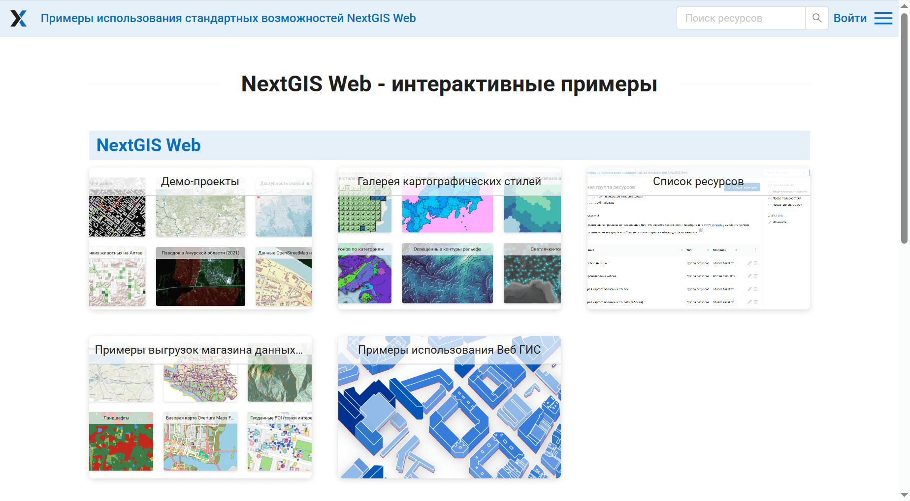

   Галерея

Перейдите в группу ресурсов (папку), в которой хотите создать галерею.
Нажмите кнопку **Создать ресурс** и выберите во всплывающем окне тип ресурса **Галерея**. 

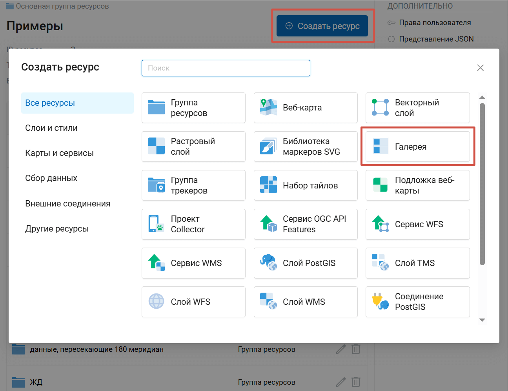

   Выбор типа ресурса "Галерея"

На первой вкладке для создаваемой галереи можно задать пользовательское **Наименование**, оно будет отображаться в списке ресурсов.

На второй вкладке добавьте нужные элементы с помощью кнопок в верхнем ряду. Доступные элементы:

* Ресурс;
* Ссылка;
* Группа - ресурсы и ссылки можно объединять в группы.

Изменить порядок элементов можно перетаскиванием. Чтобы добавить элемент в группу, перетащите его на название группы.

Уже на этом этапе вы можете нажать **Создать** и посмотреть на получившуюся галерею.

А можно более детально настроить общий вид галереи и её элементы.

Элементы галереи
-----------------

После добавления элемента кликните по нему, справа откроется панель свойств элемента. Доступные поля зависят от типа элемента.

Ресурс
~~~~~~

* Название: отображаемое название ресурса (может не совпадать с его наименованием);
* Ресурс: здесь показывается наименование ресурса и можно перейти к его расположению;
* Действие: что происходит по клике на этом ресурсе в галерее. Доступные варианты зависят от типа ресурса:

    * **Перейти к ресурсу** - доступно для всех типов;
    * **Изменить ресурс** - доступно для всех типов;
    * **Просмотреть ресурс** - доступно для веб-карт и галерей ресурсов.

* Обложка: изображение, показываемое на плашке с ресурсом вместо стандартного значка типа. 5.0 MiB максимум. Соотношение сторон зависит от выбранного способа отображения элементов: 3:2 для сетки, 5:4 для списка.
* Описание: произвольное описание, отображается при наведении курсора на плашку или справа в списке. Работает форматирование.

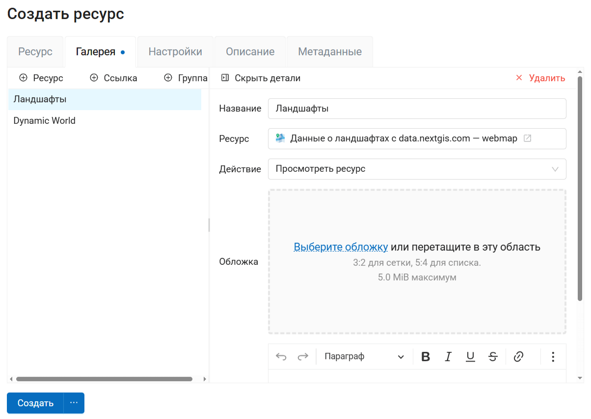

   Настройки веб-карты в галерее

Ссылка
~~~~~~

* Название;
* Ссылка - по умолчанию вставлена ссылка на саму Веб ГИС, вы можете заменить её на любую другую;
* Обложка;
* Описание.

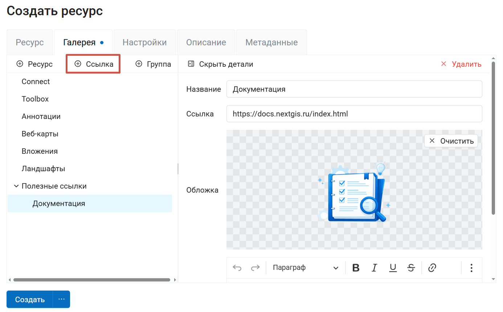

   Настройки ссылки в галерее

Группа
~~~~~~

* Название;
* Описание;
* Расположение:

    * Сетка
    * Список
    * Строки
    * Столбцы
    * Плиточный

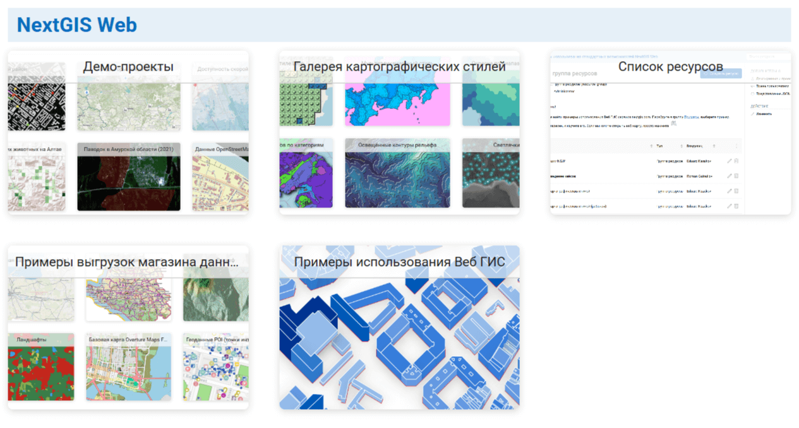

   Расположение: сетка

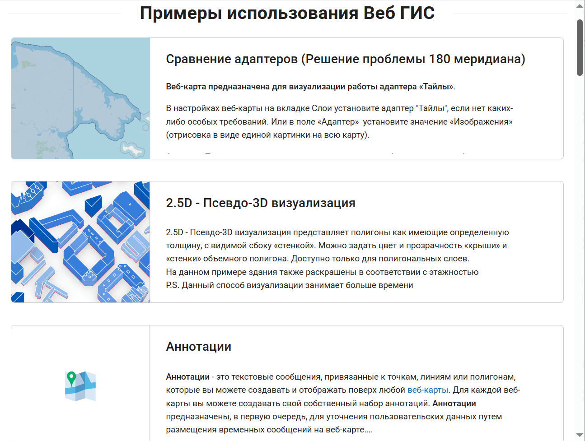

   Расположение: список

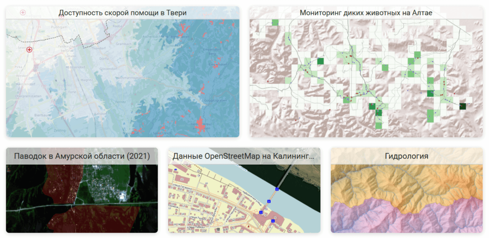

   Расположение: строки

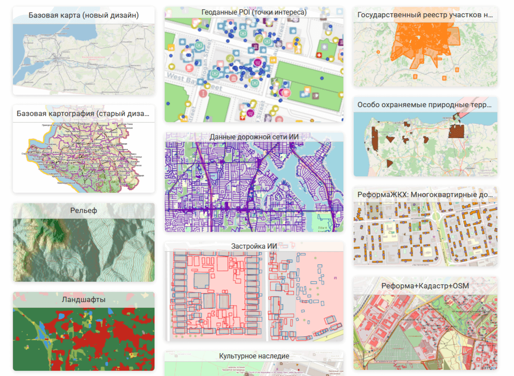

   Расположение: столбцы

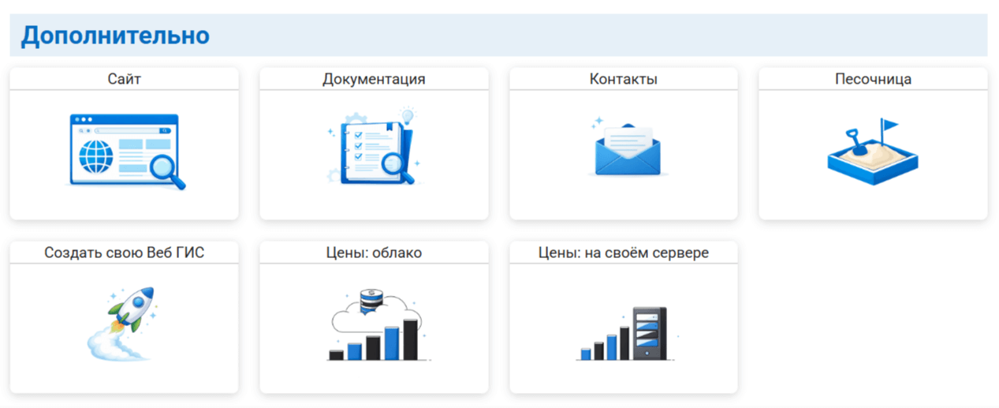

   Расположение: плиточный

Настройки галереи
-----------------

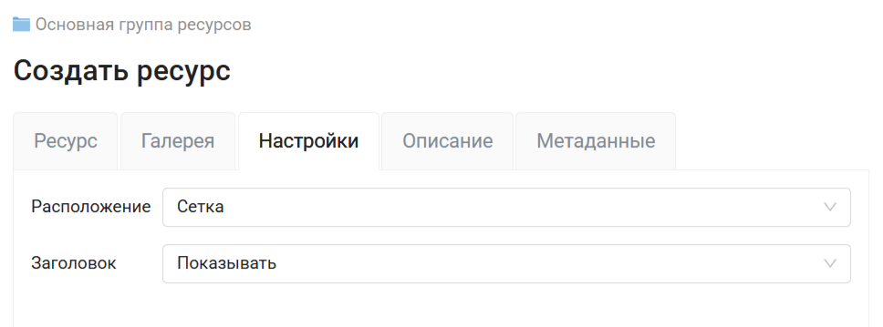

   Настройки галереи

На вкладке "Настройки" можно задать:

* Расположение элементов по умолчанию - оно будет применяться ко всем группам, для которых не задано другое на вкладке "Галерея";
* Показывать или скрывать шапку (полосу наверху с названием Веб ГИС, строкой поиска и меню).

.. todo:: _static/ngw_gallery_no_title_ru.png
   :name: 
   :align: center
   :width: 20cm

   Галерея ресурсов со скрытым заголовком

Также можно добавить описание и метаданные на соответствующих вкладках. Описание галереи отображается как на странице ресурса, так и в самой галереи после заголовка.

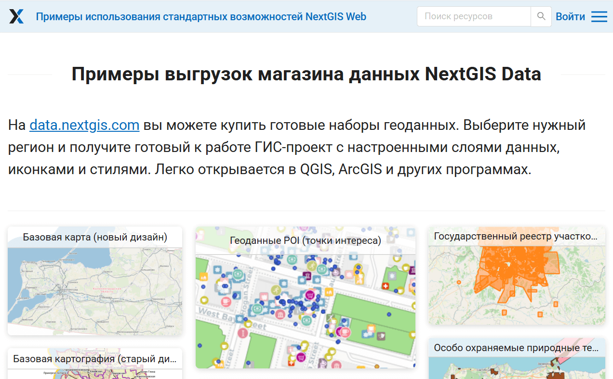

   Описание галереи ресурсов
